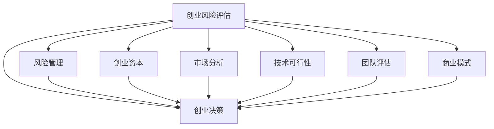

                 

# 程序员如何评估创业风险

> 关键词：创业风险评估, 创业决策, 风险管理, 创业资本, 市场分析, 技术可行性, 团队评估

## 1. 背景介绍

### 1.1 问题由来
随着创业环境的变化和科技的快速发展，越来越多的程序员和科技爱好者投入到创业的浪潮中。然而，创业并非易事，充满了不确定性和风险。对创业者来说，如何准确评估创业风险、制定合理的决策方案，是成功与否的关键。本文将围绕如何评估创业风险，系统探讨相关的核心概念、算法原理、操作步骤和案例分析，力求为有志于创业的程序员提供一份实用的指南。

### 1.2 问题核心关键点
创业风险评估涉及多方面的因素，包括市场环境、技术可行性、商业模式、团队结构、财务状况等。如何系统化地综合这些因素，制定出科学、合理的评估模型，是本文的核心目标。

## 2. 核心概念与联系

### 2.1 核心概念概述

为更好地理解创业风险评估，本节将介绍几个关键概念及其相互关系：

- 创业风险评估(Risk Assessment)：通过系统化的分析方法，对创业项目中的不确定性因素进行量化评估，以确定其对项目成功的影响程度。
- 创业决策(Decision Making)：在风险评估的基础上，对项目的可行性和商业价值进行综合判断，作出最终的决策。
- 风险管理(Risk Management)：识别、分析和控制创业过程中可能出现的风险，以最小化潜在损失。
- 创业资本(Capital)：包括启动资金和后续运营资金，是创业项目正常运作和发展的物质基础。
- 市场分析(Market Analysis)：通过调查和分析市场环境，识别市场需求、竞争态势和潜在客户群。
- 技术可行性(Technical Feasibility)：评估技术方案的可行性，包括技术成熟度、技术实现难度和成本预算。
- 团队评估(Team Assessment)：对创业团队的组成、专业背景和协同能力进行评估，判断团队是否具备实现项目目标的能力。
- 商业模式(Business Model)：描述项目的价值主张、收入来源和盈利方式，确保项目的商业可持续性。

这些概念之间的逻辑关系可以通过以下Mermaid流程图来展示：



这个流程图展示了大语言模型的核心概念及其之间的关系：

1. 创业风险评估通过识别和量化风险因素，为创业决策提供依据。
2. 创业决策在风险评估的基础上，综合考虑多方面因素，作出是否进入市场或继续发展的决定。
3. 风险管理旨在识别潜在风险，采取措施降低或消除风险。
4. 创业资本是创业项目的基础，需要科学规划和管理。
5. 市场分析、技术可行性和团队评估共同构成项目成功的关键要素。
6. 商业模式是项目可持续发展的保障。

## 3. 核心算法原理 & 具体操作步骤

### 3.1 算法原理概述

创业风险评估的核心思想是通过多维度因素的组合评估，量化潜在风险对项目成功的影响，从而为创业决策提供科学的依据。其主要过程包括数据收集、因素分析、风险评分和决策支持。

### 3.2 算法步骤详解

创业风险评估一般包括以下几个关键步骤：

**Step 1: 数据收集**
- 收集创业项目的相关数据，包括市场、技术、团队、财务等方面的信息。这些数据可以来自内部开发记录、行业报告、市场调研、财务报表等。

**Step 2: 定义评估指标**
- 根据项目特点，定义评估指标。常见的评估指标包括市场规模、竞争态势、技术成熟度、团队实力、资金需求等。

**Step 3: 量化风险**
- 对各项指标进行量化，通常使用0-1或0-10的评分体系。对于可量化的指标，如市场规模，可以直接获取数据；对于定性指标，如团队实力，需要进行专家打分或问卷调查。

**Step 4: 计算风险权重**
- 确定各项指标对项目成功的相对重要性，通常通过专家评估或经验数据获得。设某指标权重为 $w_i$，其值在0到1之间。

**Step 5: 计算综合风险评分**
- 对各项指标的风险评分进行加权求和，得到项目的综合风险评分。公式为：
$$
R = \sum_{i=1}^n w_i \cdot S_i
$$
其中 $R$ 为综合风险评分，$w_i$ 为第 $i$ 项指标的权重，$S_i$ 为第 $i$ 项指标的风险评分。

**Step 6: 决策分析**
- 根据综合风险评分，结合市场调研、团队评估、技术可行性等因素，综合判断项目的可行性，作出最终的决策。

### 3.3 算法优缺点

创业风险评估方法具有以下优点：
1. 系统化评估。通过多维度综合评估，可以更全面地识别和量化项目风险。
2. 定量化处理。通过量化指标和评分体系，可以更客观地进行风险比较和分析。
3. 简单易行。评估模型简单，所需的数据和资源较少，易于操作。
4. 决策支持。评估结果可以直接用于支持创业决策，提高决策科学性。

同时，该方法也存在一定的局限性：
1. 数据获取困难。部分关键指标难以获取或数据不全面，影响评估准确性。
2. 主观性强。评估指标的权重和评分体系可能受到主观判断的影响。
3. 动态变化。市场环境和技术趋势不断变化，静态评估模型可能不够适用。
4. 复杂度较高。涉及多维度、多层次的评估指标，实际操作中较为复杂。

尽管存在这些局限性，创业风险评估仍是创业过程中不可或缺的重要环节。未来研究的方向在于如何进一步优化数据获取和处理，提高评估模型的动态适应性和可操作性。

### 3.4 算法应用领域

创业风险评估方法可以广泛应用于以下领域：

- 初创企业评估：对于刚起步的创业项目，评估市场潜力、技术可行性和团队实力，判断其是否具备投资价值。
- 技术型企业风险评估：针对依赖核心技术的创业项目，评估技术成熟度、研发进度和专利布局，确定技术突破点。
- 电商和金融创业：评估市场规模、用户增长潜力和竞争优势，制定市场扩张和融资策略。
- 创业投资风险评估：投资者用于评估潜在投资项目，判断投资回报风险和回报率。
- 创业培训和辅导：帮助创业者系统化地评估项目风险，提高创业成功率。

## 4. 数学模型和公式 & 详细讲解  
### 4.1 数学模型构建

创业风险评估的数学模型可以简单表示为：
$$
R = \sum_{i=1}^n w_i \cdot S_i
$$
其中，$R$ 表示综合风险评分，$w_i$ 表示第 $i$ 项指标的权重，$S_i$ 表示第 $i$ 项指标的风险评分。

### 4.2 公式推导过程

以上公式基于如下假设：
- 各指标对项目的风险影响相对独立。
- 指标的重要性可以通过专家评估或经验数据获得。

设某指标 $i$ 的风险评分为 $S_i$，权重为 $w_i$，则综合风险评分为：
$$
R = \sum_{i=1}^n w_i \cdot S_i
$$
例如，某创业项目包含市场规模、技术成熟度和团队实力三个评估指标，分别赋予权重0.4、0.3和0.3。对每个指标进行打分，如市场规模得分为6，技术成熟度得分为7，团队实力得分为8。则综合风险评分为：
$$
R = 0.4 \cdot 6 + 0.3 \cdot 7 + 0.3 \cdot 8 = 6.2
$$

### 4.3 案例分析与讲解

假设某创业者计划开发一款基于AI的金融分析软件。通过市场调研，他确定了以下几个评估指标：
- 市场规模：50亿美金
- 技术成熟度：4/5
- 团队实力：3/5
- 用户增长潜力：5/5
- 资金需求：1000万美金

根据专家评估，各项指标权重分别为：市场规模0.4，技术成熟度0.3，团队实力0.2，用户增长潜力0.1，资金需求0.0。对各项指标进行打分，如技术成熟度得分为3.8，用户增长潜力得分为5，资金需求得分为1。则综合风险评分为：
$$
R = 0.4 \cdot 50 + 0.3 \cdot 3.8 + 0.2 \cdot 3 + 0.1 \cdot 5 + 0.0 \cdot 1 = 40.6
$$

根据评分规则，综合风险评分0.8以下可视为低风险，0.8-1.0为中等风险，1.0以上为高风险。因此，该创业项目的风险评分为0.8，属于中等风险。创业者需要进一步评估项目的技术可行性和市场前景，决定是否进入市场。

## 5. 项目实践：代码实例和详细解释说明
### 5.1 开发环境搭建

在进行创业风险评估的实践前，我们需要准备好开发环境。以下是使用Python进行创业风险评估的环境配置流程：

1. 安装Python：从官网下载并安装Python 3.8及以上版本。
2. 安装Pandas：
```bash
pip install pandas
```
3. 安装NumPy：
```bash
pip install numpy
```
4. 安装Scikit-learn：
```bash
pip install scikit-learn
```
5. 安装Matplotlib：
```bash
pip install matplotlib
```

完成上述步骤后，即可在本地环境中开始创业风险评估的代码实现。

### 5.2 源代码详细实现

以下是一个简单的创业风险评估程序，用于计算综合风险评分。

```python
import pandas as pd
import numpy as np
from sklearn.preprocessing import MinMaxScaler

# 定义评估指标和权重
indicators = ['市场规模', '技术成熟度', '团队实力', '用户增长潜力', '资金需求']
weights = [0.4, 0.3, 0.2, 0.1, 0.0]

# 读取数据
data = pd.read_csv('risk_data.csv')

# 数据处理
data.fillna(0, inplace=True)
data = data.dropna()

# 量化指标
scaler = MinMaxScaler()
data_scaled = scaler.fit_transform(data)

# 计算风险评分
scores = np.dot(data_scaled, weights)

# 计算综合风险评分
risk_score = np.sum(scores)

print('综合风险评分：', risk_score)
```

### 5.3 代码解读与分析

让我们再详细解读一下关键代码的实现细节：

**数据处理**：
- 使用Pandas读取评估数据。
- 使用fillna方法填充缺失值。
- 使用dropna方法删除含有缺失值的记录。

**量化指标**：
- 使用MinMaxScaler对指标进行标准化处理，确保评分体系的一致性。
- 使用numpy的dot函数计算各指标的加权求和，得到风险评分。

**综合风险评分**：
- 将风险评分进行加权求和，得到综合风险评分。
- 通过print函数输出评分结果。

通过这个简单的程序，可以对创业项目进行基本的风险评估。当然，实际的评估过程可能更为复杂，需要根据具体需求进行定制化设计和优化。

## 6. 实际应用场景
### 6.1 初创企业评估

初创企业面临的最大风险之一是市场和技术的未知性。通过创业风险评估，可以系统化地识别潜在风险，制定有效的风险管理策略。例如，某初创企业计划推出一款新型智能手机，通过评估市场规模、技术成熟度和团队实力，可以判断项目的技术可行性、市场接受度和团队执行能力。

### 6.2 技术型企业风险评估

对于依赖核心技术的创业项目，技术成熟度是决定项目成败的关键因素。通过对技术成熟度、研发进度和专利布局进行评估，可以明确技术突破点和项目可行性，避免技术陷阱和投资浪费。

### 6.3 电商和金融创业

电商和金融领域竞争激烈，市场环境和技术趋势变化快。通过对市场规模、用户增长潜力和竞争优势进行评估，可以帮助创业者制定有效的市场策略，规避市场风险。例如，某电商创业项目通过评估市场规模和用户增长潜力，判断其市场潜力和扩张计划。

### 6.4 创业投资风险评估

创业投资风险评估是投资者用于评估潜在投资项目的工具。通过多维度评估，可以全面识别项目的潜在风险和回报率，为投资决策提供科学依据。例如，某创业投资机构通过评估项目市场规模、技术成熟度和团队实力，判断投资项目的回报潜力和风险。

## 7. 工具和资源推荐
### 7.1 学习资源推荐

为了帮助创业者掌握创业风险评估的方法和技巧，这里推荐一些优质的学习资源：

1. 《创业风险管理》一书：详细介绍了创业风险评估的理论基础和方法，是创业者的必读书籍。
2. 《精益创业》一书：介绍了精益创业的理念和实践方法，帮助创业者快速迭代和优化项目。
3. 创业风险评估在线课程：如Coursera上的《创业风险管理》课程，涵盖多方面的评估方法和案例分析。
4. 创业风险评估工具：如AngelList的风险评估工具，提供可视化界面和数据分析功能。

通过对这些资源的学习实践，相信你一定能够掌握创业风险评估的精髓，并用于解决实际的创业问题。

### 7.2 开发工具推荐

高效的开发离不开优秀的工具支持。以下是几款用于创业风险评估开发的常用工具：

1. Jupyter Notebook：支持Python代码的交互式开发和数据可视化，方便创业者进行数据分析和模型调试。
2. Excel：支持多维度数据处理和可视化，适合初期的数据收集和分析。
3. Google Sheets：提供在线数据协作和分析功能，方便团队共享和合作。
4. Tableau：支持复杂的数据分析和可视化，适合进行多维度评估和报告生成。

合理利用这些工具，可以显著提升创业风险评估的开发效率，加快创新迭代的步伐。

### 7.3 相关论文推荐

创业风险评估技术的发展源于学界的持续研究。以下是几篇奠基性的相关论文，推荐阅读：

1. 《创业风险评估模型与方法》：总结了多种创业风险评估模型，如AHP、Fuzzy等，讨论了其优缺点和应用场景。
2. 《创业投资风险评估框架》：提出了多维度风险评估框架，包括市场、技术和财务等方面的评估指标。
3. 《基于大数据的创业风险评估》：利用大数据技术，优化创业风险评估的数据处理和分析方法。
4. 《创业团队评估模型》：提出了多种团队评估模型，如五力模型、SWOT等，分析了团队对创业项目的影响。
5. 《创业项目商业模型设计》：介绍了创业项目商业模型设计的基本要素和设计方法，帮助创业者制定可持续的商业模式。

这些论文代表了大语言模型微调技术的发展脉络。通过学习这些前沿成果，可以帮助研究者把握学科前进方向，激发更多的创新灵感。

## 8. 总结：未来发展趋势与挑战

### 8.1 总结

本文对创业风险评估方法进行了全面系统的介绍。首先阐述了创业风险评估的重要性，明确了创业决策和风险管理的基础地位。其次，从原理到实践，详细讲解了创业风险评估的数学模型和操作步骤，给出了代码实现和案例分析。同时，本文还探讨了创业风险评估在多个行业领域的应用场景，展示了其广泛的价值。此外，本文精选了创业风险评估的学习资源、开发工具和相关论文，力求为读者提供全方位的技术指引。

通过本文的系统梳理，可以看到，创业风险评估技术正在成为创业过程中不可或缺的重要环节。它通过系统化的评估方法，为创业者提供了科学、合理的数据支撑和决策依据，极大地提高了创业项目的成功率。未来，伴随评估模型的不断优化和智能化，相信创业风险评估将能够更好地服务于创业者和投资者，推动创业生态的健康发展。

### 8.2 未来发展趋势

展望未来，创业风险评估技术将呈现以下几个发展趋势：

1. 智能化评估：引入人工智能和大数据分析技术，优化评估模型的计算效率和准确性。
2. 实时评估：建立实时数据监控和分析系统，动态调整评估模型，提高风险管理的及时性和有效性。
3. 自动化评估：开发自动化评估工具，减少人工干预，提高评估过程的效率和一致性。
4. 多维度融合：将财务、市场、技术、团队等多个维度的评估指标进行融合，形成综合评估体系。
5. 定制化评估：针对不同行业的特点，设计定制化的评估模型和方法，提升评估的针对性和实用性。

以上趋势凸显了创业风险评估技术的广阔前景。这些方向的探索发展，必将进一步提升评估模型的智能化水平，为创业者提供更全面、更准确的决策支持。

### 8.3 面临的挑战

尽管创业风险评估技术已经取得了一定的进展，但在迈向更加智能化、普适化应用的过程中，它仍面临诸多挑战：

1. 数据获取难度大：部分关键指标难以获取或数据不全面，影响评估准确性。
2. 模型复杂度高：多维度、多层次的评估指标增加了模型设计的复杂性。
3. 主观性强：评估指标的权重和评分体系可能受到主观判断的影响。
4. 动态变化：市场环境和技术趋势不断变化，静态评估模型可能不够适用。
5. 可解释性不足：评估模型的结果往往缺乏解释和论证，导致决策者难以理解。

尽管存在这些挑战，创业风险评估技术的发展潜力巨大。未来研究的方向在于如何进一步优化数据获取和处理，提高评估模型的动态适应性和可操作性。

### 8.4 研究展望

面对创业风险评估所面临的挑战，未来的研究需要在以下几个方面寻求新的突破：

1. 数据挖掘与自动标注：开发数据自动挖掘和标注技术，减少人工干预，提高数据获取的效率和质量。
2. 动态评估模型：引入时间序列分析和机器学习技术，建立动态评估模型，实时监控和预测市场变化。
3. 可解释性增强：开发可解释性评估模型，提供详细的评估报告和建议，帮助创业者理解评估结果。
4. 多模态融合：将多模态数据（如文本、图像、视频等）进行融合，提升评估模型的综合性和可靠性。
5. 集成化平台：开发集成的创业风险评估平台，提供一站式服务，涵盖评估、监控、报告等功能。

这些研究方向的探索，必将引领创业风险评估技术迈向更高的台阶，为创业者提供更科学、更可靠的风险评估服务。面向未来，创业风险评估技术还需要与其他人工智能技术进行更深入的融合，共同推动创业生态的健康发展。

## 9. 附录：常见问题与解答

**Q1：创业风险评估是否适用于所有创业项目？**

A: 创业风险评估方法适用于大多数创业项目，特别是涉及市场、技术、财务等方面评估的项目。然而，对于一些依赖核心领域知识和特殊资源的项目，可能需要结合专业知识和行业经验进行补充评估。

**Q2：创业风险评估是否可以自动进行？**

A: 创业风险评估模型可以自动化进行，但需要根据具体情况进行优化和调整。自动化评估可以提高评估效率，减少人工干预，但仍需结合专家评估进行修正和优化。

**Q3：创业风险评估是否需要大量的数据支持？**

A: 创业风险评估需要一定量的数据支持，但通过数据挖掘和自动标注技术，可以部分减少数据获取的难度。部分指标可以通过专家打分或问卷调查获取，以弥补数据不足的问题。

**Q4：创业风险评估模型是否需要频繁更新？**

A: 创业风险评估模型需要根据市场环境和技术趋势进行动态更新，以确保评估结果的准确性和时效性。引入机器学习技术，可以实现模型自动更新和优化。

**Q5：如何提高创业风险评估的可解释性？**

A: 提高创业风险评估的可解释性需要引入可解释性模型和算法，如LIME、SHAP等。提供详细的评估报告和建议，帮助创业者理解评估结果和决策依据。

---

作者：禅与计算机程序设计艺术 / Zen and the Art of Computer Programming

