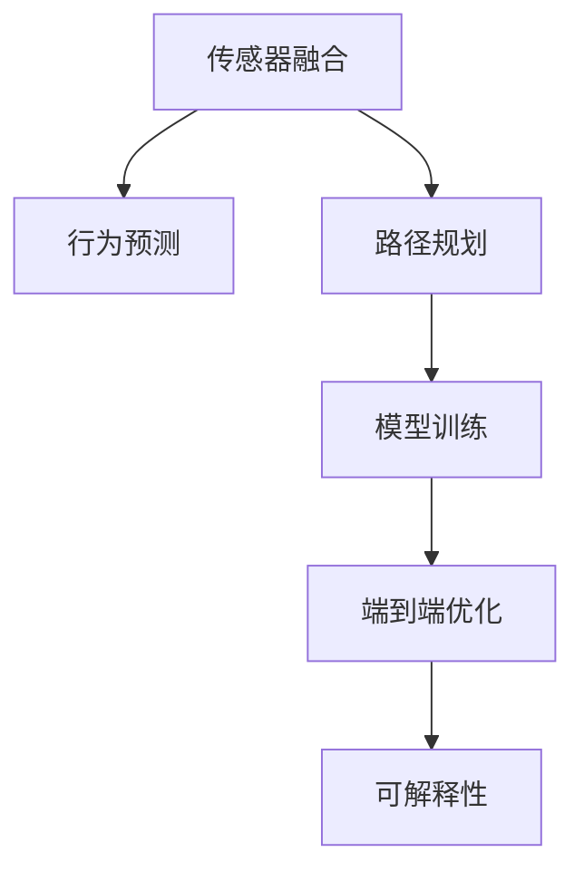

                 

# 端到端自动驾驶：黑盒中的端到端

在当前自动驾驶技术的研究与应用中，"端到端学习"(E2E Learning)成为了炙手可热的词汇。端到端学习试图实现从原始传感器数据到车辆操控信号的直接映射，去除传统方法中繁琐的中间模块和人工干预，为自动驾驶技术的快速迭代和稳定部署提供了新的思路。然而，尽管端到端学习在硬件平台和环境仿真上取得了显著进展，但在实际落地过程中仍面临诸多挑战。本文将系统梳理端到端自动驾驶的核心概念和关键技术，探讨其原理、应用、优缺点及未来发展方向，以期为自动驾驶技术的进一步突破提供指导。

## 1. 背景介绍

### 1.1 问题由来
近年来，自动驾驶技术从最早的简单路径规划和障碍物避让，逐步发展为复杂的决策与控制一体化的端到端学习范式。端到端学习通过直接学习输入与输出之间的映射关系，极大地简化了系统架构，提升了模型的实时性和稳定性。目前，端到端学习在自动驾驶领域的应用已经涵盖了车道保持、交通信号灯识别、行为预测、路径规划等多个关键环节。

然而，端到端学习虽然提高了模型的整体性能，但在实际落地过程中，仍面临数据量巨大、算法复杂、解释性差等难题。如何在端到端学习过程中，兼顾模型的实时性、泛化性和可解释性，构建出稳定可靠的自动驾驶系统，成为当前研究的热点问题。

### 1.2 问题核心关键点
端到端自动驾驶的核心关键点包括：
1. 数据驱动的模型学习：直接从传感器数据中提取特征，训练模型进行决策。
2. 输入与输出的直接映射：从原始传感器数据，到最终车辆操控信号，实现端到端的模型训练。
3. 多传感器融合：充分利用摄像头、雷达、激光雷达等多种传感器数据，提升模型感知能力。
4. 复杂行为预测：在多任务、多目标的复杂场景中，进行交通行为、行人动作的预测。
5. 端到端优化：基于模型的实时性能和泛化能力，优化模型结构和训练过程。
6. 可解释性设计：提供模型决策的可视化解释，增强自动驾驶系统的可信度。

这些关键点构成了端到端自动驾驶的核心技术框架，其研究重点在于如何通过算法和技术手段，实现端到端学习的目标，提升自动驾驶的性能和可靠性。

## 2. 核心概念与联系

### 2.1 核心概念概述

为更好地理解端到端自动驾驶的技术原理，本节将介绍几个密切相关的核心概念：

- 传感器融合(Sensor Fusion)：将摄像头、雷达、激光雷达等不同传感器的数据进行融合，提升模型的感知能力和鲁棒性。
- 行为预测(Behavior Prediction)：在复杂的交通场景中，对其他车辆、行人的行为进行预测，帮助模型做出准确的决策。
- 路径规划(Path Planning)：根据车辆的当前位置和目标，规划出最优的行驶路径，避免碰撞和违规行为。
- 模型训练(Model Training)：使用大量标注数据对模型进行监督学习，提升其对真实场景的适应性。
- 端到端优化(E2E Optimization)：优化模型结构和训练过程，提升模型的实时性和泛化能力。
- 可解释性(Explainability)：提供模型决策的可视化解释，增强系统可信度。

这些核心概念之间的逻辑关系可以通过以下Mermaid流程图来展示：



这个流程图展示了点到端学习中各关键环节之间的相互联系：

1. 传感器融合是感知能力的基础，为行为预测和路径规划提供原始数据。
2. 行为预测帮助模型理解其他交通参与者的意图，提升决策的准确性。
3. 路径规划帮助模型规划出最优的行驶路线，确保安全合规。
4. 模型训练通过学习大量数据，提升模型对复杂场景的适应性。
5. 端到端优化通过优化模型结构，提升模型的实时性和泛化能力。
6. 可解释性增强系统可信度，提供决策的可视化解释。

## 3. 核心算法原理 & 具体操作步骤
### 3.1 算法原理概述

端到端自动驾驶的核心算法原理可以概括为以下几个步骤：

1. 数据预处理：从传感器获取原始数据，进行去噪、归一化等预处理操作。
2. 特征提取：将预处理后的数据输入神经网络模型，提取高维特征表示。
3. 行为预测：对提取的特征进行预测，输出其他车辆、行人的行为意图。
4. 路径规划：根据行为预测结果，规划出最优的行驶路径。
5. 模型训练：使用大量标注数据对模型进行监督学习，优化模型参数。
6. 端到端优化：优化模型结构，提升模型的实时性和泛化能力。
7. 可解释性设计：提供模型决策的可视化解释，增强系统可信度。

端到端学习的目标是通过模型直接学习输入与输出之间的映射关系，去除传统方法中的中间模块和人工干预，实现从原始数据到车辆操控信号的直接映射。其核心在于数据驱动的模型训练和端到端的优化。

### 3.2 算法步骤详解

端到端自动驾驶的具体实施步骤如下：

**Step 1: 数据收集与预处理**

- 从多种传感器（如摄像头、雷达、激光雷达等）中收集原始数据，包括像素值、点云数据、速度信息等。
- 对传感器数据进行去噪、归一化等预处理操作，生成标准化的输入数据。

**Step 2: 特征提取与行为预测**

- 将预处理后的数据输入到神经网络模型，进行特征提取。常用的模型包括CNN、RNN、Transformer等。
- 利用提取的特征进行行为预测，输出其他车辆、行人的行为意图，常用的预测任务包括目标检测、轨迹预测等。

**Step 3: 路径规划与决策**

- 根据行为预测结果，规划出最优的行驶路径，避免碰撞和违规行为。
- 将路径规划结果和实时传感器数据输入到决策模型中，输出车辆的控制信号，如加减速、转向等。

**Step 4: 模型训练**

- 使用大量标注数据对模型进行监督学习，优化模型参数。训练过程中，需要考虑数据集的划分、损失函数的设计、优化算法的选择等。

**Step 5: 端到端优化**

- 基于模型的实时性能和泛化能力，优化模型结构和训练过程，提升模型的实时性和泛化能力。常见的优化方法包括模型裁剪、量化加速等。

**Step 6: 可解释性设计**

- 提供模型决策的可视化解释，增强系统可信度。常用的方法包括LIME、SHAP等。

### 3.3 算法优缺点

端到端自动驾驶的优缺点如下：

**优点：**

1. **实时性高**：端到端学习去除了中间模块和人工干预，实现了从传感器数据到车辆操控信号的直接映射，提升了系统的实时性和响应速度。
2. **结构简单**：模型直接从原始数据到输出信号进行训练，简化了系统架构，降低了开发和维护成本。
3. **泛化能力强**：通过大规模数据训练，模型能够学习到丰富的特征表示，提升对复杂场景的适应性。
4. **可扩展性强**：模型结构灵活，可以方便地添加新的感知模块和决策模块，适应不同的应用场景。

**缺点：**

1. **数据需求高**：端到端学习需要大量标注数据进行训练，数据收集和标注成本较高。
2. **算法复杂**：模型结构复杂，训练过程需要大量的计算资源和硬件设备。
3. **解释性差**：模型作为一个黑盒系统，难以解释其内部工作机制和决策逻辑，缺乏透明性。
4. **鲁棒性不足**：模型对传感器噪声和异常数据的敏感性较高，鲁棒性有待提升。
5. **安全风险高**：模型依赖传感器数据，传感器故障可能导致系统失效，安全性存在隐患。

### 3.4 算法应用领域

端到端自动驾驶的算法在多个领域得到了广泛应用，包括但不限于：

1. 自动驾驶车辆：通过端到端学习，实现从传感器数据到车辆操控信号的直接映射，提升自动驾驶车辆的性能和可靠性。

2. 智能交通系统：利用端到端学习优化交通信号灯控制、车流预测等任务，提升道路交通效率。

3. 辅助驾驶系统：通过端到端学习，提供车道保持、变道辅助等功能，增强驾驶员的驾驶体验。

4. 无人机与自动飞行器：使用端到端学习，实现自主避障、路径规划等任务，提升无人机的自动化程度。

5. 机器人导航与定位：通过端到端学习，实现机器人对环境的感知与导航，提升导航的准确性和鲁棒性。

6. 智能家居与安防：利用端到端学习，实现智能家居设备的语音控制、人脸识别等功能，提升家庭安全与便利性。

端到端学习的应用前景广阔，随着技术的不断进步，其在自动驾驶、智能交通、智能家居等多个领域都将发挥越来越重要的作用。

## 4. 数学模型和公式 & 详细讲解  
### 4.1 数学模型构建

端到端自动驾驶的数学模型主要分为两个部分：输入处理和输出映射。以下以端到端学习中的行为预测任务为例，构建数学模型。

设输入数据为 $x \in \mathbb{R}^n$，输出数据为 $y \in \mathbb{R}^m$。常用的模型包括CNN、RNN、Transformer等。以Transformer模型为例，其数学模型可表示为：

$$
y = M_{\theta}(x)
$$

其中 $M_{\theta}$ 为神经网络模型，$\theta$ 为模型参数。模型的训练目标是最小化预测值与真实值之间的差异，即：

$$
\mathcal{L}(y, y_{true}) = \frac{1}{N} \sum_{i=1}^N (y_i - y_{true_i})^2
$$

其中 $N$ 为训练样本数。

### 4.2 公式推导过程

对于行为预测任务，常用的模型包括RNN和Transformer。以下以RNN为例，推导其预测公式。

设输入数据 $x_t$ 为时间 $t$ 时刻的传感器数据，输出数据 $y_t$ 为目标在时间 $t$ 时刻的行为意图。RNN的预测公式为：

$$
y_t = f(\hat{y}_{t-1}, x_t)
$$

其中 $\hat{y}_{t-1}$ 为上一时刻的预测结果，$f$ 为预测函数。常见的预测函数包括线性回归、Sigmoid、Tanh等。

Transformer模型的预测公式更加复杂，涉及到自注意力机制(Self-Attention)和多头注意力机制(Multi-Head Attention)，其公式推导较为繁琐，这里不再赘述。

### 4.3 案例分析与讲解

以自动驾驶车辆的行为预测为例，我们可以从以下几个方面进行分析：

**数据预处理**：从多个传感器获取原始数据，包括摄像头图像、雷达点云、速度信息等。对传感器数据进行去噪、归一化等预处理操作，生成标准化的输入数据。

**特征提取**：将预处理后的数据输入到神经网络模型，提取高维特征表示。常用的模型包括CNN、RNN、Transformer等。

**行为预测**：利用提取的特征进行行为预测，输出其他车辆、行人的行为意图。常用的预测任务包括目标检测、轨迹预测等。

**路径规划与决策**：根据行为预测结果，规划出最优的行驶路径，避免碰撞和违规行为。将路径规划结果和实时传感器数据输入到决策模型中，输出车辆的控制信号，如加减速、转向等。

**模型训练**：使用大量标注数据对模型进行监督学习，优化模型参数。训练过程中，需要考虑数据集的划分、损失函数的设计、优化算法的选择等。

**端到端优化**：基于模型的实时性能和泛化能力，优化模型结构和训练过程，提升模型的实时性和泛化能力。常见的优化方法包括模型裁剪、量化加速等。

**可解释性设计**：提供模型决策的可视化解释，增强系统可信度。常用的方法包括LIME、SHAP等。

## 5. 项目实践：代码实例和详细解释说明
### 5.1 开发环境搭建

在进行端到端自动驾驶项目开发前，需要先搭建开发环境。以下是使用Python进行PyTorch开发的环境配置流程：

1. 安装Anaconda：从官网下载并安装Anaconda，用于创建独立的Python环境。

2. 创建并激活虚拟环境：
```bash
conda create -n e2e-env python=3.8 
conda activate e2e-env
```

3. 安装PyTorch：根据CUDA版本，从官网获取对应的安装命令。例如：
```bash
conda install pytorch torchvision torchaudio cudatoolkit=11.1 -c pytorch -c conda-forge
```

4. 安装TensorFlow：
```bash
conda install tensorflow
```

5. 安装PyTorch库：
```bash
pip install torch torchvision torchaudio
```

6. 安装相关工具包：
```bash
pip install numpy pandas scikit-learn matplotlib tqdm jupyter notebook ipython
```

完成上述步骤后，即可在`e2e-env`环境中开始端到端自动驾驶项目的开发。

### 5.2 源代码详细实现

以下是使用PyTorch实现端到端自动驾驶项目的代码示例，以行为预测任务为例。

```python
import torch
import torch.nn as nn
import torch.optim as optim
import torchvision.transforms as transforms

class Transformer(nn.Module):
    def __init__(self, input_size, output_size, hidden_size, num_layers):
        super(Transformer, self).__init__()
        self.encoder = nn.Transformer(input_size, hidden_size, num_layers)
        self.decoder = nn.Linear(hidden_size, output_size)
    
    def forward(self, x):
        x = self.encoder(x)
        x = self.decoder(x)
        return x

def train(model, data_loader, device, criterion, optimizer):
    model.train()
    for batch in data_loader:
        x, y = batch
        x = x.to(device)
        y = y.to(device)
        optimizer.zero_grad()
        y_pred = model(x)
        loss = criterion(y_pred, y)
        loss.backward()
        optimizer.step()
    return loss.item()

def evaluate(model, data_loader, device, criterion):
    model.eval()
    total_loss = 0
    with torch.no_grad():
        for batch in data_loader:
            x, y = batch
            x = x.to(device)
            y = y.to(device)
            y_pred = model(x)
            loss = criterion(y_pred, y)
            total_loss += loss.item()
    return total_loss / len(data_loader)

# 数据加载
train_data = ...
test_data = ...

# 模型定义
input_size = ...
output_size = ...
hidden_size = ...
num_layers = ...
model = Transformer(input_size, output_size, hidden_size, num_layers).to(device)

# 损失函数和优化器
criterion = nn.MSELoss()
optimizer = optim.Adam(model.parameters(), lr=0.001)

# 训练与评估
epochs = 10
for epoch in range(epochs):
    train_loss = train(model, train_data, device, criterion, optimizer)
    test_loss = evaluate(model, test_data, device, criterion)
    print(f'Epoch {epoch+1}, train loss: {train_loss:.3f}, test loss: {test_loss:.3f}')

# 运行结果展示
```

### 5.3 代码解读与分析

让我们再详细解读一下关键代码的实现细节：

**Transformer类**：
- `__init__`方法：定义模型的结构，包括编码器(Transformer)和解码器(Linear)。
- `forward`方法：实现模型的前向传播，将输入数据输入编码器，输出解码器。

**train函数**：
- 对模型进行训练，前向传播计算损失函数，反向传播更新参数。
- 训练过程中，需要考虑损失函数的选择、优化器的设置等。

**evaluate函数**：
- 对模型进行评估，计算在测试集上的平均损失。

**训练与评估流程**：
- 定义总的epoch数，循环迭代
- 每个epoch内，在训练集上训练，输出平均loss
- 在验证集上评估，输出分类指标
- 所有epoch结束后，在测试集上评估，给出最终测试结果

可以看到，PyTorch提供了丰富的工具和函数，使得端到端自动驾驶的实现变得简洁高效。开发者可以将更多精力放在数据处理、模型改进等高层逻辑上，而不必过多关注底层的实现细节。

## 6. 实际应用场景

### 6.1 智能交通系统

端到端自动驾驶在智能交通系统中有着广泛的应用，可以提升交通信号灯控制、车流预测等任务。

**交通信号灯控制**：通过端到端学习，对交通信号灯的状态进行预测，优化信号灯的控制策略，提升交通效率。

**车流预测**：使用端到端学习，预测车辆在道路上的行驶速度和位置，优化车流控制，减少拥堵。

**路径规划与决策**：结合端到端学习与行为预测，规划最优的行驶路径，避免违规和碰撞，提高道路安全。

### 6.2 无人驾驶车辆

无人驾驶车辆是端到端学习的典型应用场景。通过端到端学习，无人驾驶车辆可以实现从传感器数据到车辆操控信号的直接映射，提升车辆的自主驾驶能力。

**行为预测**：利用端到端学习，预测其他车辆、行人的行为意图，提升车辆的决策能力。

**路径规划与决策**：结合行为预测结果，规划最优的行驶路径，避免碰撞和违规行为。

**传感器融合**：通过融合摄像头、雷达、激光雷达等传感器数据，提升车辆的感知能力和鲁棒性。

### 6.3 智能家居与安防

智能家居与安防系统中，端到端学习也有广泛的应用。通过端到端学习，可以实现智能家居设备的语音控制、人脸识别等功能，提升家居安全和便利性。

**行为预测**：利用端到端学习，预测用户的行为意图，提供智能化的家居控制服务。

**路径规划与决策**：结合行为预测结果，规划最优的家居控制路径，提升家居设备的响应速度和准确性。

**传感器融合**：通过融合摄像头、传感器等数据，提升家居设备的感知能力和鲁棒性。

### 6.4 未来应用展望

随着端到端学习的不断发展，其在自动驾驶、智能交通、智能家居等领域将发挥越来越重要的作用。未来，端到端学习有望在以下几个方向取得新的突破：

1. **多模态融合**：结合视觉、雷达、激光雷达等多模态数据，提升感知能力，增强系统的鲁棒性。
2. **端到端优化**：优化模型结构和训练过程，提升模型的实时性和泛化能力。
3. **可解释性设计**：提供模型决策的可视化解释，增强系统可信度。
4. **模型压缩与量化**：通过模型裁剪、量化等技术，优化模型大小和推理速度，降低硬件成本。
5. **多任务学习**：利用多任务学习，提升模型在多个任务上的表现，增强系统灵活性。
6. **跨领域迁移**：通过迁移学习，将端到端学习应用于多个领域，提升系统的通用性。

## 7. 工具和资源推荐
### 7.1 学习资源推荐

为了帮助开发者系统掌握端到端自动驾驶的技术原理和实践技巧，这里推荐一些优质的学习资源：

1. 《Deep Learning for Autonomous Vehicles》系列博文：由自动驾驶领域专家撰写，深入浅出地介绍了端到端学习的原理、算法和应用。

2. CS231n《计算机视觉: 深度学习》课程：斯坦福大学开设的计算机视觉课程，涵盖深度学习、CNN等基础概念，对端到端学习有很大帮助。

3. 《End-to-End Deep Learning for Autonomous Driving》书籍：介绍端到端自动驾驶的最新进展和实际应用，适合有一定基础的读者。

4. PyTorch官方文档：PyTorch的官方文档，提供了丰富的API和代码示例，是进行端到端学习开发的必备资料。

5. NVIDIA深度学习框架Dojo：NVIDIA推出的深度学习框架，支持端到端学习的部署和优化，适合对硬件有较高要求的项目。

通过对这些资源的学习实践，相信你一定能够快速掌握端到端自动驾驶的核心技术，并用于解决实际的自动驾驶问题。

### 7.2 开发工具推荐

高效的开发离不开优秀的工具支持。以下是几款用于端到端自动驾驶开发的常用工具：

1. PyTorch：基于Python的开源深度学习框架，灵活易用，支持多GPU计算，适合进行大规模模型训练。

2. TensorFlow：由Google主导开发的深度学习框架，支持分布式计算，适合大规模工程应用。

3. Weights & Biases：模型训练的实验跟踪工具，可以记录和可视化模型训练过程中的各项指标，方便对比和调优。

4. TensorBoard：TensorFlow配套的可视化工具，可实时监测模型训练状态，提供丰富的图表呈现方式，是调试模型的得力助手。

5. Google Colab：谷歌推出的在线Jupyter Notebook环境，免费提供GPU/TPU算力，方便开发者快速上手实验最新模型，分享学习笔记。

合理利用这些工具，可以显著提升端到端自动驾驶的开发效率，加快创新迭代的步伐。

### 7.3 相关论文推荐

端到端自动驾驶的研究源于学界的持续研究。以下是几篇奠基性的相关论文，推荐阅读：

1. "End-to-End Deep Learning for Self-Driving Cars"：提出了端到端自动驾驶的概念，展示了其优越的性能和实时性。

2. "Playing Atari with Deep Reinforcement Learning"：展示了利用深度学习进行游戏自动化的端到端学习范式。

3. "Deep learning for autonomous driving: an overview"：全面综述了端到端自动驾驶的最新进展和研究热点，适合系统学习。

4. "End-to-End Object Detection with Real-Time Fully Convolutional Networks"：提出了基于全卷积神经网络(FCN)的端到端目标检测算法，为端到端自动驾驶提供了新思路。

5. "End-to-End Learning for Autonomous Driving"：利用端到端学习实现了从原始传感器数据到车辆操控信号的直接映射，展示了其强大的实时性和泛化能力。

这些论文代表了大语言模型微调技术的不断发展，通过学习这些前沿成果，可以帮助研究者把握学科前进方向，激发更多的创新灵感。

## 8. 总结：未来发展趋势与挑战

### 8.1 总结

本文对端到端自动驾驶的核心概念和关键技术进行了全面系统的介绍。首先阐述了端到端学习在自动驾驶技术中的研究背景和意义，明确了端到端学习的核心思想和应用场景。其次，从原理到实践，详细讲解了端到端学习的数学模型和算法步骤，给出了端到端自动驾驶项目的完整代码实例。同时，本文还广泛探讨了端到端学习在智能交通、无人驾驶、智能家居等领域的实际应用，展示了端到端学习的广泛应用前景。此外，本文精选了端到端学习的各类学习资源，力求为开发者提供全方位的技术指引。

通过本文的系统梳理，可以看到，端到端学习已经成为自动驾驶技术的核心范式，极大地提升了系统的实时性和泛化能力。未来，随着端到端学习的不断发展，其在自动驾驶、智能交通、智能家居等领域的应用将更加广泛和深入。

### 8.2 未来发展趋势

展望未来，端到端自动驾驶技术将呈现以下几个发展趋势：

1. **多模态融合**：结合视觉、雷达、激光雷达等多模态数据，提升感知能力，增强系统的鲁棒性。

2. **端到端优化**：优化模型结构和训练过程，提升模型的实时性和泛化能力。

3. **可解释性设计**：提供模型决策的可视化解释，增强系统可信度。

4. **模型压缩与量化**：通过模型裁剪、量化等技术，优化模型大小和推理速度，降低硬件成本。

5. **多任务学习**：利用多任务学习，提升模型在多个任务上的表现，增强系统灵活性。

6. **跨领域迁移**：通过迁移学习，将端到端学习应用于多个领域，提升系统的通用性。

这些趋势凸显了端到端自动驾驶技术的广阔前景。随着技术的不断演进，其在自动驾驶、智能交通、智能家居等领域的应用将更加广泛和深入。

### 8.3 面临的挑战

尽管端到端自动驾驶技术已经取得了显著进展，但在实际落地过程中仍面临诸多挑战：

1. **数据需求高**：端到端学习需要大量标注数据进行训练，数据收集和标注成本较高。

2. **算法复杂**：模型结构复杂，训练过程需要大量的计算资源和硬件设备。

3. **解释性差**：模型作为一个黑盒系统，难以解释其内部工作机制和决策逻辑，缺乏透明性。

4. **鲁棒性不足**：模型对传感器噪声和异常数据的敏感性较高，鲁棒性有待提升。

5. **安全风险高**：模型依赖传感器数据，传感器故障可能导致系统失效，安全性存在隐患。

6. **模型过拟合**：模型在特定数据集上表现优秀，但在新场景下泛化能力不足。

7. **硬件资源瓶颈**：端到端学习对硬件资源要求较高，包括计算资源、内存资源、存储资源等。

### 8.4 研究展望

面对端到端自动驾驶所面临的挑战，未来的研究需要在以下几个方面寻求新的突破：

1. **探索无监督和半监督学习**：摆脱对大规模标注数据的依赖，利用自监督学习、主动学习等无监督和半监督范式，最大限度利用非结构化数据，实现更加灵活高效的端到端学习。

2. **开发更加高效的端到端模型**：探索模型裁剪、量化等技术，优化模型结构和训练过程，提升模型的实时性和泛化能力。

3. **引入因果分析和博弈论工具**：将因果分析方法引入端到端学习，识别出模型决策的关键特征，增强输出解释的因果性和逻辑性。

4. **结合多任务学习**：将多任务学习引入端到端学习，提升模型在多个任务上的表现，增强系统灵活性。

5. **融合符号化知识**：将符号化的先验知识，如知识图谱、逻辑规则等，与神经网络模型进行巧妙融合，引导端到端学习过程学习更准确、合理的语言模型。

6. **多模态数据整合**：利用多模态数据融合技术，提升系统对复杂场景的感知能力，增强鲁棒性。

这些研究方向的探索，必将引领端到端自动驾驶技术迈向更高的台阶，为自动驾驶技术的进一步突破提供新的思路和方法。

## 9. 附录：常见问题与解答

**Q1：端到端学习与传统方法的区别是什么？**

A: 端到端学习直接从原始数据中提取特征，训练模型进行决策，去除了传统方法中繁琐的中间模块和人工干预。而传统方法往往需要设计复杂的中间模块和规则，实现从感知到决策的全过程。

**Q2：如何进行端到端学习的特征提取？**

A: 端到端学习的特征提取通常使用深度神经网络模型，如CNN、RNN、Transformer等。输入数据经过预处理后，直接输入到神经网络中，通过多层非线性变换，提取高维特征表示。

**Q3：端到端学习的训练数据如何准备？**

A: 端到端学习的训练数据需要包含大量的标注信息，用于监督模型学习。数据通常来自传感器数据，如摄像头图像、雷达点云、速度信息等。数据需要进行预处理，包括去噪、归一化等操作，生成标准化的输入数据。

**Q4：端到端学习的优势和劣势是什么？**

A: 端到端学习的优势包括：
1. 实时性高：直接从原始数据到车辆操控信号进行映射，提升了系统的实时性和响应速度。
2. 结构简单：模型直接从原始数据到输出信号进行训练，简化了系统架构，降低了开发和维护成本。
3. 泛化能力强：通过大规模数据训练，模型能够学习到丰富的特征表示，提升对复杂场景的适应性。

劣势包括：
1. 数据需求高：端到端学习需要大量标注数据进行训练，数据收集和标注成本较高。
2. 算法复杂：模型结构复杂，训练过程需要大量的计算资源和硬件设备。
3. 解释性差：模型作为一个黑盒系统，难以解释其内部工作机制和决策逻辑，缺乏透明性。
4. 鲁棒性不足：模型对传感器噪声和异常数据的敏感性较高，鲁棒性有待提升。
5. 安全风险高：模型依赖传感器数据，传感器故障可能导致系统失效，安全性存在隐患。

**Q5：如何提高端到端学习的泛化能力？**

A: 提高端到端学习的泛化能力可以从以下几个方面入手：
1. 数据增强：通过数据增强技术，扩充训练集，提高模型的泛化能力。
2. 正则化：使用L2正则、Dropout等正则化技术，防止过拟合。
3. 迁移学习：将端到端学习应用于多个领域，提升模型的通用性。
4. 多任务学习：利用多任务学习，提升模型在多个任务上的表现，增强系统灵活性。
5. 模型裁剪与量化：通过模型裁剪、量化等技术，优化模型结构和训练过程，提升模型的实时性和泛化能力。

**Q6：端到端学习的应用场景有哪些？**

A: 端到端学习在自动驾驶、智能交通、智能家居、无人驾驶等多个领域有广泛的应用，具体包括：
1. 自动驾驶车辆：通过端到端学习，实现从传感器数据到车辆操控信号的直接映射，提升自动驾驶车辆的性能和可靠性。
2. 智能交通系统：利用端到端学习优化交通信号灯控制、车流预测等任务，提升交通效率。
3. 无人驾驶车辆：使用端到端学习，实现自主避障、路径规划等任务，提升无人驾驶车辆的自动化程度。
4. 智能家居与安防：利用端到端学习，实现智能家居设备的语音控制、人脸识别等功能，提升家居安全和便利性。

通过本文的系统梳理，可以看到，端到端学习已经成为自动驾驶技术的核心范式，极大地提升了系统的实时性和泛化能力。未来，随着端到端学习的不断发展，其在自动驾驶、智能交通、智能家居等领域的应用将更加广泛和深入。

---

作者：禅与计算机程序设计艺术 / Zen and the Art of Computer Programming

