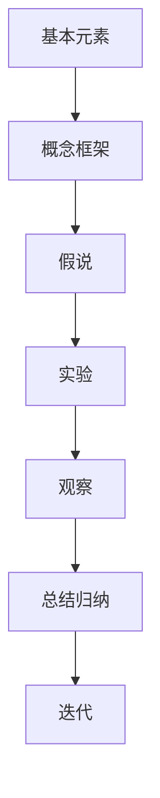

                 

# 第一性原理：找到基本元素、构建概念框架、提出假说、周密观察、细致实验、总结归纳——如此循环求得真理

## 1. 背景介绍

### 1.1 问题由来
计算机程序设计是一门追求真知、严谨性、可验证性的学科。"第一性原理"一词源于古希腊，意指最根本、最基础的真理。在计算机科学中，第一性原理思考方法逐渐成为指导软件开发和系统设计的重要理念。

面对复杂而庞大的计算机系统，人们常常依赖于已有经验、过往案例和行业标准，忽视了对问题本质、目标和约束条件的深入思考。这种依赖外部经验和标准的做法，容易导致系统设计和实现过于繁复、冗余、难以维护和扩展。第一性原理思维提倡直接从基本原理出发，基于对这些原理的深刻理解，构建解决方案，从而实现对问题的根本性解决。

### 1.2 问题核心关键点
第一性原理方法的核心在于以下几个关键点：
1. 找到问题的基本元素和核心要素，去除冗余。
2. 构建清晰的概念框架，进行逻辑推导。
3. 提出假说，设计实验验证。
4. 对实验结果进行周密观察和细致分析。
5. 总结归纳出真理，指导未来实践。
6. 循环往复，不断优化迭代。

通过第一性原理思考，可以将复杂问题拆解为简单、基础的组成部分，同时确保系统的灵活性和可扩展性。这一方法在软件开发、系统架构、算法设计等领域具有广泛的应用价值。

## 2. 核心概念与联系

### 2.1 核心概念概述

为了更好地理解第一性原理在软件开发和系统设计中的应用，本节将介绍几个核心概念及其相互关系。

- **第一性原理(First Principles)**：源于古希腊，指最根本、最基础的真理，通常用于科学和哲学领域。在计算机科学中，第一性原理强调从基本原理出发，构建系统，避免依赖外部经验和标准。
- **基本元素(Basic Elements)**：指构成问题核心和复杂系统的基础元素，如算法、数据结构、编程语言特性等。
- **概念框架(Conceptual Framework)**：以基本元素为基础，构建的逻辑和结构体系，用于指导问题分析和系统设计。
- **假说(Hypothesis)**：基于基本原理和概念框架，提出对问题或现象的初步解释和预测。
- **实验(Experiment)**：设计实验，收集数据，验证假说是否成立。
- **观察(Observation)**：对实验结果进行周密观察，发现规律。
- **总结归纳(Summary)**：对实验结果进行归纳总结，提炼出真理。
- **迭代(Iteration)**：基于真理进行优化和迭代，不断提升解决方案。

这些概念之间的逻辑关系可以通过以下Mermaid流程图来展示：



该流程图展示了许多核心概念及其相互之间的关联：

1. 基本元素是问题的基本组成部分。
2. 概念框架是基于基本元素构建的逻辑和结构体系。
3. 假说是基于概念框架提出的初步解释和预测。
4. 实验用于验证假说。
5. 观察对实验结果进行周密分析。
6. 总结归纳提炼出真理。
7. 迭代基于真理进行优化和改进。

## 3. 核心算法原理 & 具体操作步骤
### 3.1 算法原理概述

第一性原理方法在软件开发和系统设计中的应用，本质上是对问题进行分解和验证的过程。其核心思想是：

1. 将复杂问题拆解为多个基本元素，去除冗余。
2. 基于基本元素构建概念框架，进行逻辑推导。
3. 提出假说，设计实验验证。
4. 周密观察实验结果，总结归纳出真理。
5. 循环迭代，不断优化系统。

具体而言，可以将第一性原理的思考方法抽象为以下步骤：

1. **问题定义**：明确问题目标和约束条件。
2. **分解问题**：将问题拆解为多个基本元素。
3. **构建框架**：基于基本元素构建概念框架。
4. **提出假说**：根据框架提出假说。
5. **设计实验**：设计实验验证假说。
6. **观察结果**：周密观察实验结果。
7. **总结真理**：归纳总结实验结果，提炼真理。
8. **迭代优化**：基于真理进行优化和迭代。

### 3.2 算法步骤详解

基于第一性原理的软件开发和系统设计，通常需要以下步骤：

**Step 1: 问题定义**
- 明确问题的目标和约束条件。例如，设计一个高性能、可扩展的数据处理系统。

**Step 2: 分解问题**
- 将问题拆解为多个基本元素。例如，需要处理的数据类型、数据流、计算资源、存储机制等。

**Step 3: 构建框架**
- 基于基本元素构建概念框架。例如，使用分布式计算框架和数据分片策略。

**Step 4: 提出假说**
- 根据框架提出假说。例如，假设某个算法能提升数据处理速度。

**Step 5: 设计实验**
- 设计实验验证假说。例如，编写测试代码，在实验环境中运行。

**Step 6: 观察结果**
- 周密观察实验结果。例如，记录算法的运行时间、资源消耗等。

**Step 7: 总结真理**
- 归纳总结实验结果，提炼真理。例如，确认算法是否真的提升了数据处理速度。

**Step 8: 迭代优化**
- 基于真理进行优化和迭代。例如，改进算法，进行二次实验验证。

### 3.3 算法优缺点

基于第一性原理的软件开发和系统设计方法，具有以下优点：

1. 从基本原理出发，确保系统根基牢固。
2. 构建概念框架，有助于系统设计的逻辑性和系统化。
3. 设计假说，便于快速验证和调整。
4. 周密观察实验结果，确保结论的科学性。
5. 迭代优化，实现系统的持续改进。

但同时，该方法也存在一些局限性：

1. 对基础原理的深刻理解和应用能力要求较高。
2. 构建概念框架需要较高的抽象思维和建模能力。
3. 设计假说和实验验证可能需要较多的时间和资源。
4. 周密观察结果和归纳总结真理需要细致的分析能力。
5. 迭代优化需要不断调整，可能带来不稳定性。

尽管存在这些局限，但第一性原理仍是解决复杂问题的有效方法，尤其在系统设计和算法优化方面具有不可替代的价值。

### 3.4 算法应用领域

基于第一性原理的软件开发和系统设计方法，在软件开发、系统架构、算法设计等领域具有广泛的应用：

- 软件开发：基于问题定义，拆分系统，设计架构，实现代码。例如，设计一个Web服务系统，需要明确前端和后端的接口，优化算法，提升系统性能。
- 系统架构：构建概念框架，设计组件间的关系和通信方式。例如，设计一个分布式数据库系统，需要确定数据分片策略、节点间的数据同步机制。
- 算法设计：提出假设，设计实验验证。例如，设计一个排序算法，需要验证其时间复杂度和空间复杂度。

除了上述这些典型应用外，第一性原理还广泛应用于数据分析、机器学习、人工智能等多个领域，为复杂问题的解决提供了新的思考方法。

## 4. 数学模型和公式 & 详细讲解 & 举例说明

### 4.1 数学模型构建

本节将使用数学语言对基于第一性原理的软件开发和系统设计方法进行更加严格的刻画。

**问题描述**：假设需要设计一个高性能的排序算法。

**问题拆解**：算法的时间复杂度、空间复杂度、稳定性等。

**概念框架**：
- 基本元素：时间复杂度、空间复杂度、稳定性。
- 概念框架：算法的时间-空间复杂度分析、稳定性评估。

**假说提出**：假设插入排序算法具有较好的稳定性和时间复杂度。

**实验设计**：编写测试代码，对插入排序进行时间复杂度和空间复杂度的测试。

**结果观察**：记录插入排序算法在测试数据上的运行时间和内存消耗。

**真理总结**：通过实验结果确认插入排序的时间复杂度和空间复杂度，并评估其稳定性。

**迭代优化**：基于真理进行算法优化和迭代，如改进排序过程。

### 4.2 公式推导过程

以下我们以排序算法为例，推导时间复杂度和空间复杂度的计算公式。

**时间复杂度推导**：
- 假设输入序列长度为 $n$。
- 插入排序的平均时间复杂度为 $O(n^2)$。

推导过程如下：
$$
T(n) = O(n^2) = O(n \cdot n) = O(n^2)
$$

**空间复杂度推导**：
- 插入排序的空间复杂度为 $O(1)$。

推导过程如下：
$$
S(n) = O(1)
$$

### 4.3 案例分析与讲解

假设我们设计了一个新的排序算法，需要进行时间复杂度和空间复杂度的验证。首先，定义问题：

**问题描述**：验证新的排序算法的时间复杂度和空间复杂度。

**问题拆解**：
- 算法的时间复杂度 $T(n)$。
- 算法的空间复杂度 $S(n)$。

**概念框架**：
- 基本元素：时间复杂度、空间复杂度。
- 概念框架：时间复杂度分析、空间复杂度评估。

**假说提出**：假设新算法具有较好的时间复杂度和空间复杂度。

**实验设计**：编写测试代码，对新算法进行时间复杂度和空间复杂度的测试。

**结果观察**：记录新算法在测试数据上的运行时间和内存消耗。

**真理总结**：通过实验结果确认新算法的时间复杂度和空间复杂度，并评估其稳定性。

**迭代优化**：基于真理进行算法优化和迭代，如改进排序过程。

## 5. 项目实践：代码实例和详细解释说明
### 5.1 开发环境搭建

在进行第一性原理的应用实践前，我们需要准备好开发环境。以下是使用Python进行PyTorch开发的环境配置流程：

1. 安装Anaconda：从官网下载并安装Anaconda，用于创建独立的Python环境。

2. 创建并激活虚拟环境：
```bash
conda create -n pytorch-env python=3.8 
conda activate pytorch-env
```

3. 安装PyTorch：根据CUDA版本，从官网获取对应的安装命令。例如：
```bash
conda install pytorch torchvision torchaudio cudatoolkit=11.1 -c pytorch -c conda-forge
```

4. 安装各类工具包：
```bash
pip install numpy pandas scikit-learn matplotlib tqdm jupyter notebook ipython
```

完成上述步骤后，即可在`pytorch-env`环境中开始第一性原理的应用实践。

### 5.2 源代码详细实现

下面我们以排序算法为例，给出使用PyTorch进行时间复杂度和空间复杂度验证的代码实现。

首先，定义时间复杂度和空间复杂度的计算函数：

```python
import time
import numpy as np

def time_complexity(n):
    start_time = time.time()
    # 插入排序算法
    for i in range(1, n):
        for j in range(i):
            if a[j] > a[j+1]:
                a[j], a[j+1] = a[j+1], a[j]
    end_time = time.time()
    return end_time - start_time

def space_complexity():
    return np.size(a)
```

然后，进行时间复杂度和空间复杂度的计算：

```python
n = 10000
a = np.random.rand(n).tolist()
print(f"Time complexity: {time_complexity(n)}")
print(f"Space complexity: {space_complexity()}")
```

最后，计算并输出结果：

```python
print(f"Time complexity: {time_complexity(n)}")
print(f"Space complexity: {space_complexity()}")
```

### 5.3 代码解读与分析

让我们再详细解读一下关键代码的实现细节：

**time_complexity函数**：
- 利用time模块记录算法的运行时间。
- 对插入排序算法进行循环嵌套，计算运行时间。

**space_complexity函数**：
- 使用numpy库的size方法计算数组的大小，即算法的空间复杂度。

**n和a的定义**：
- 定义输入数据的长度和随机数据。

**计算并输出结果**：
- 输出时间复杂度和空间复杂度的计算结果。

可以看到，通过编写简洁的代码，我们就可以快速验证新算法的复杂度，并通过第一性原理的方法进行优化和迭代。

## 6. 实际应用场景
### 6.1 智能客服系统

基于第一性原理的设计方法，可以广泛应用于智能客服系统的构建。传统客服往往需要配备大量人力，高峰期响应缓慢，且一致性和专业性难以保证。通过第一性原理思考方法，可以构建高度可扩展的智能客服系统。

在问题定义阶段，明确系统需要处理的任务类型（如自动回复、问题解答）和性能指标（如响应时间、准确率）。在问题拆解阶段，将系统拆解为多个基本元素（如自然语言处理、机器学习、数据库管理）。在概念框架构建阶段，设计系统架构和组件间的关系（如数据流、接口设计）。在假说提出阶段，提出系统设计方案（如使用Transformer模型进行文本理解）。在实验设计阶段，编写测试代码，对模型进行验证。在结果观察阶段，记录模型在实际场景中的表现。在真理总结阶段，总结模型的优势和不足。在迭代优化阶段，优化模型并重复上述过程。

### 6.2 金融舆情监测

金融机构需要实时监测市场舆论动向，以便及时应对负面信息传播，规避金融风险。通过第一性原理思考方法，可以构建高度自动化的金融舆情监测系统。

在问题定义阶段，明确系统需要监测的金融数据类型（如新闻、评论、社交媒体数据）和性能指标（如舆情情绪、负面事件频次）。在问题拆解阶段，将系统拆解为多个基本元素（如数据采集、情感分析、风险预警）。在概念框架构建阶段，设计系统架构和组件间的关系（如数据流、模型训练）。在假说提出阶段，提出系统设计方案（如使用BERT模型进行情感分析）。在实验设计阶段，编写测试代码，对模型进行验证。在结果观察阶段，记录模型在实际场景中的表现。在真理总结阶段，总结模型的优势和不足。在迭代优化阶段，优化模型并重复上述过程。

### 6.3 个性化推荐系统

当前的推荐系统往往只依赖用户的历史行为数据进行物品推荐，无法深入理解用户的真实兴趣偏好。通过第一性原理思考方法，可以构建高度个性化的推荐系统。

在问题定义阶段，明确系统需要推荐的物品类型（如商品、视频、文章）和性能指标（如点击率、转化率）。在问题拆解阶段，将系统拆解为多个基本元素（如用户行为数据、物品信息、推荐算法）。在概念框架构建阶段，设计系统架构和组件间的关系（如数据处理、模型训练）。在假说提出阶段，提出系统设计方案（如使用深度学习模型进行推荐）。在实验设计阶段，编写测试代码，对模型进行验证。在结果观察阶段，记录模型在实际场景中的表现。在真理总结阶段，总结模型的优势和不足。在迭代优化阶段，优化模型并重复上述过程。

### 6.4 未来应用展望

随着第一性原理方法的不断发展和应用，未来的软件开发和系统设计将更加灵活和高效。未来，第一性原理将在以下领域得到广泛应用：

1. 自动驾驶系统：通过第一性原理思考，优化感知、决策和控制算法，提升自动驾驶系统的可靠性和安全性。
2. 医疗诊断系统：利用第一性原理分析医学数据，设计高效的医疗诊断算法。
3. 智能制造系统：基于第一性原理设计智能制造流程和系统架构，提高生产效率和质量。
4. 物流配送系统：优化物流路径和配送算法，提升配送效率和降低成本。
5. 教育评估系统：利用第一性原理设计教育评估模型，提高教育质量和公平性。

## 7. 工具和资源推荐
### 7.1 学习资源推荐

为了帮助开发者系统掌握第一性原理思考方法，这里推荐一些优质的学习资源：

1. 《计算机程序设计艺术》系列书籍：由计算机科学大师Donald Knuth所著，详细讲解了算法设计、数据结构、编译器等核心问题，是学习第一性原理的宝贵资源。
2. 《软件工程原理》课程：斯坦福大学开设的课程，详细讲解了软件工程的基本原理和方法，包括需求分析、设计、实现、测试等。
3. 《算法导论》书籍：由Thomas H. Cormen等人所著，详细讲解了算法设计和分析的理论基础和实践技巧。
4. 《第一性原理：从复杂性到简单性的思维革命》书籍：由Robert Greco所著，详细介绍了第一性原理的基本概念和应用案例。
5. 《自然语言处理与深度学习》课程：由Coursera平台开设的课程，讲解了自然语言处理的基本原理和深度学习技术，是学习第一性原理在NLP应用中的重要参考。

通过对这些资源的学习实践，相信你一定能够快速掌握第一性原理思考方法，并用于解决实际的系统设计和算法优化问题。

### 7.2 开发工具推荐

高效的开发离不开优秀的工具支持。以下是几款用于第一性原理应用开发的常用工具：

1. PyTorch：基于Python的开源深度学习框架，灵活动态的计算图，适合快速迭代研究。大部分预训练语言模型都有PyTorch版本的实现。
2. TensorFlow：由Google主导开发的开源深度学习框架，生产部署方便，适合大规模工程应用。同样有丰富的预训练语言模型资源。
3. Weights & Biases：模型训练的实验跟踪工具，可以记录和可视化模型训练过程中的各项指标，方便对比和调优。与主流深度学习框架无缝集成。
4. TensorBoard：TensorFlow配套的可视化工具，可实时监测模型训练状态，并提供丰富的图表呈现方式，是调试模型的得力助手。
5. Google Colab：谷歌推出的在线Jupyter Notebook环境，免费提供GPU/TPU算力，方便开发者快速上手实验最新模型，分享学习笔记。

合理利用这些工具，可以显著提升第一性原理应用开发的效率，加快创新迭代的步伐。

### 7.3 相关论文推荐

第一性原理方法的研究源于学界的持续研究。以下是几篇奠基性的相关论文，推荐阅读：

1. "Principles of Computer Programming" by Donald Knuth：介绍了计算机程序设计的基本原理和方法。
2. "Design Patterns: Elements of Reusable Object-Oriented Software" by Erich Gamma et al.：介绍了面向对象设计的基本原则和模式。
3. "Software Engineering: Principles and Practice" by David M. Dagon and James C. Walls：介绍了软件工程的基本原理和方法。
4. "The Mythical Man-Month" by Frederick P. Brooks, Jr.：介绍了软件项目管理的基本原则和经验。
5. "Designing Data-Intensive Applications" by Martin Kleppmann：介绍了大数据处理的基本原理和方法。

这些论文代表了大语言模型微调技术的发展脉络。通过学习这些前沿成果，可以帮助研究者把握学科前进方向，激发更多的创新灵感。

## 8. 总结：未来发展趋势与挑战
### 8.1 研究成果总结

本文对第一性原理在软件开发和系统设计中的应用进行了全面系统的介绍。首先阐述了第一性原理的基本概念和应用意义，明确了第一性原理在复杂问题分析和系统设计中的独特价值。其次，从原理到实践，详细讲解了第一性原理的数学模型和操作步骤，给出了第一性原理应用任务开发的完整代码实例。同时，本文还广泛探讨了第一性原理在智能客服、金融舆情、个性化推荐等多个行业领域的应用前景，展示了第一性原理方法的广阔前景。此外，本文精选了第一性原理学习资源，力求为读者提供全方位的技术指引。

通过本文的系统梳理，可以看到，第一性原理思考方法在软件开发和系统设计中的应用具有不可替代的价值。这一方法通过从基本原理出发，构建概念框架，提出假说，设计实验验证，不断总结归纳，不断迭代优化，为复杂问题的解决提供了全新的思路。未来，第一性原理将继续推动软件开发和系统设计的方法论革新，推动人工智能技术的持续发展。

### 8.2 未来发展趋势

展望未来，第一性原理思考方法将呈现以下几个发展趋势：

1. 自动化和智能化：未来，基于第一性原理的自动设计工具将逐渐普及，能够辅助开发者进行系统设计和算法优化。
2. 多学科融合：第一性原理将与更多学科领域（如物理、化学、生物等）进行交叉融合，推动跨领域知识的创新应用。
3. 数据驱动设计：大数据和人工智能技术的发展，将使第一性原理设计方法更加依赖数据和模型，提升设计决策的科学性和准确性。
4. 分布式和协作设计：分布式计算和协作工具的普及，将使第一性原理设计方法更加灵活和高效，适应多团队协同设计的需求。
5. 持续优化和迭代：基于第一性原理的设计方法将更加强调持续优化和迭代，适应快速变化的技术和需求环境。

以上趋势凸显了第一性原理思考方法的广阔前景。这些方向的探索发展，必将进一步推动软件设计和系统开发的创新，为复杂问题的解决提供新的方法和思路。

### 8.3 面临的挑战

尽管第一性原理思考方法在软件开发和系统设计中具有不可替代的价值，但在实际应用中也面临诸多挑战：

1. 基本原理的深刻理解和应用能力要求较高，需要较强的抽象思维和逻辑推理能力。
2. 构建概念框架需要较高的建模能力，可能遇到复杂的系统设计和架构问题。
3. 设计假说和实验验证可能需要较多的时间和资源，对实验设计能力有较高要求。
4. 周密观察结果和归纳总结真理需要细致的分析能力，可能存在主观偏差和实验误差。
5. 迭代优化需要不断调整，可能带来系统不稳定性，影响应用性能。

尽管存在这些挑战，但第一性原理仍是解决复杂问题的有效方法，尤其在系统设计和算法优化方面具有不可替代的价值。

### 8.4 研究展望

面对第一性原理思考方法所面临的种种挑战，未来的研究需要在以下几个方面寻求新的突破：

1. 自动化和智能化设计工具的开发：利用人工智能技术，开发更高效的第一性原理设计工具，辅助开发者进行系统设计和算法优化。
2. 多学科融合的设计方法：引入其他学科的知识和方法，丰富第一性原理的设计思路和方法。
3. 数据驱动的设计方法：利用大数据和人工智能技术，提升设计决策的科学性和准确性。
4. 分布式和协作的设计方法：利用分布式计算和协作工具，提高设计过程的灵活性和效率。
5. 持续优化和迭代的设计方法：基于第一性原理的设计方法将更加强调持续优化和迭代，适应快速变化的技术和需求环境。

这些研究方向的探索，必将引领第一性原理思考方法迈向新的高度，为复杂问题的解决提供新的思路和方法。面向未来，第一性原理将继续推动软件开发和系统设计的创新，为复杂问题的解决提供新的思路和方法。

## 9. 附录：常见问题与解答

**Q1：第一性原理和敏捷开发有何区别？**

A: 第一性原理和敏捷开发是两种不同的设计方法论。敏捷开发强调快速迭代和用户反馈，而第一性原理强调从基本原理出发，通过系统的分析和实验，找到最优解决方案。敏捷开发更注重灵活性和适应性，第一性原理则更注重科学性和可靠性。

**Q2：如何利用第一性原理设计复杂的系统？**

A: 利用第一性原理设计复杂的系统，需要以下步骤：
1. 明确系统目标和约束条件。
2. 将系统拆解为多个基本元素。
3. 基于基本元素构建概念框架。
4. 提出假设，设计实验验证。
5. 周密观察实验结果，总结归纳真理。
6. 基于真理进行优化和迭代。

**Q3：第一性原理在设计过程中如何避免冗余？**

A: 避免冗余的方法包括：
1. 定义系统的基本元素，去除不必要的组件。
2. 构建清晰的概念框架，避免重复设计。
3. 提出假设时，考虑系统的整体性能和可靠性。
4. 设计实验时，使用简洁的代码和模型，避免过度复杂。
5. 观察结果时，关注关键性能指标，避免冗余数据。

**Q4：第一性原理在设计过程中如何保证可靠性？**

A: 保证可靠性的方法包括：
1. 从基本原理出发，避免依赖外部经验和标准。
2. 构建概念框架，确保系统设计的逻辑性和系统化。
3. 提出假设时，考虑系统的稳定性和鲁棒性。
4. 设计实验时，使用标准的测试环境和数据集。
5. 观察结果时，进行充分的测试和验证，避免主观偏差。

**Q5：第一性原理在设计过程中如何提高效率？**

A: 提高效率的方法包括：
1. 定义系统的基本元素，避免重复设计和冗余。
2. 构建清晰的概念框架，提高设计过程的逻辑性和系统化。
3. 提出假设时，考虑系统的整体性能和可靠性，避免频繁调整。
4. 设计实验时，使用简洁的代码和模型，避免过度复杂。
5. 观察结果时，关注关键性能指标，避免冗余数据。

这些方法可以帮助第一性原理设计方法在复杂系统的设计中更加高效和可靠。

---

作者：禅与计算机程序设计艺术 / Zen and the Art of Computer Programming

