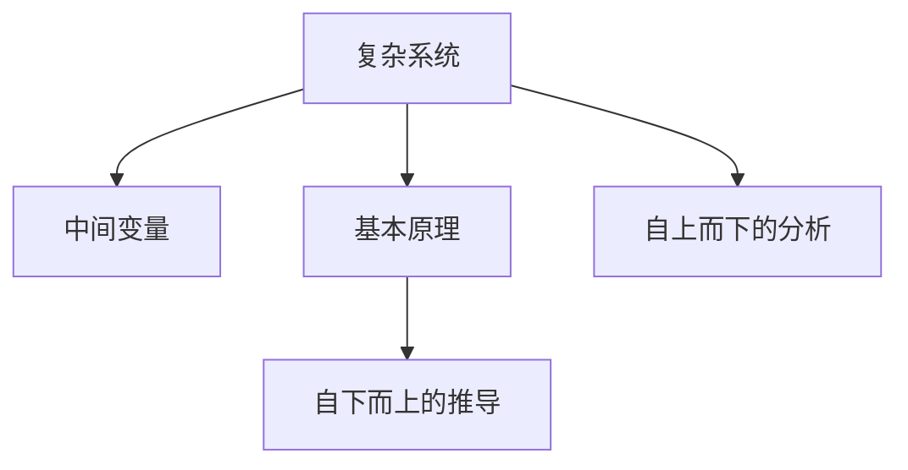

                 

# 第一性原理：科学探究的基石

> 关键词：第一性原理,科学探究,复杂系统,可编程性,自然规律,人工智能

## 1. 背景介绍

### 1.1 问题由来
随着科技的不断进步，人类社会进入了一个高度复杂化的时代。从宏观层面的气候变化、全球经济到微观层面的基因组学、量子物理，科学探究的触角不断向未知的领域延伸。然而，在追求科学真理的过程中，我们常常发现一些基础性问题未能得到有效解决，这不仅延缓了人类对自然规律的深入理解，也阻碍了技术的进一步发展。为此，第一性原理作为一种强大的思维工具，为科学探究提供了全新的视角和方法，尤其适用于解决复杂系统问题。

### 1.2 问题核心关键点
第一性原理（First-Principles）源自古希腊哲学家亚里士多德，意指“从一个基本事实或命题出发进行推导”。在现代科学中，第一性原理被广泛应用于物理、化学、材料科学等领域，通过放弃复杂系统中的中间变量，直接从基本物理或化学原理出发，来推导系统的基本规律和行为。

第一性原理的核心在于：
- **简化模型**：简化系统复杂性，直接从基本原理出发，排除中间变量，降低系统复杂度。
- **避免层级差异**：避免因层级差异导致的复杂性增加，确保从最低层次的基本原理推导出的规律适用于所有层次。
- **自下而上的推导**：从最基本的事实或规律出发，自下而上地构建系统的完整模型，确保每一步推导都有坚实的基础。

应用第一性原理，可以帮助我们跨越复杂的层级，直接从最根本的原理出发，解决系统性的问题。尤其在当前复杂多变的科技领域，第一性原理为理解和解决复杂系统提供了重要的思维工具。

## 2. 核心概念与联系

### 2.1 核心概念概述

为更好地理解第一性原理在科学探究中的应用，本节将介绍几个密切相关的核心概念：

- **复杂系统**：指由多个相互关联的子系统组成，具有高度非线性、动态性和不确定性的系统，如生物系统、经济系统、生态系统等。
- **中间变量**：指在复杂系统中，由于层次性、非线性等因素导致的，无法直接观察或控制的关键变量。
- **基本原理**：指构成复杂系统的基本物理或化学规律，如牛顿力学、热力学定律等。
- **自上而下的分析**：指从系统的整体特性出发，逐步分解为子系统的分析方法，这种方法有助于理解系统的整体行为，但可能导致复杂性增加。
- **自下而上的推导**：指从基本原理出发，逐步构建系统的整体模型，这种方法能够减少中间变量的引入，降低系统复杂性。

这些概念之间的逻辑关系可以通过以下Mermaid流程图来展示：



这个流程图展示了几组核心概念之间的联系：

1. 复杂系统包含中间变量和基本原理。
2. 自下而上的推导从基本原理出发，构建系统的整体模型。
3. 自上而下的分析从系统的整体特性出发，逐步分解为子系统。

## 3. 核心算法原理 & 具体操作步骤

### 3.1 算法原理概述

第一性原理的科学探究方法主要包含两个步骤：
1. 从基本原理出发，构建系统的简化模型。
2. 通过实验和数据验证模型的正确性，不断调整和优化。

第一性原理的算法原理可以概括为：
- **模型构建**：基于基本原理，构建系统的简化模型。
- **数据验证**：通过实验和数据验证模型的正确性。
- **模型优化**：根据实验结果，不断调整和优化模型参数。

### 3.2 算法步骤详解

第一性原理的科学探究方法通常包括以下几个关键步骤：

**Step 1: 确定基本原理**
- 选择或构建适合问题研究的基本原理，如物理定律、化学反应方程等。
- 确定需要研究的对象和系统，明确研究的目标和边界。

**Step 2: 构建简化模型**
- 根据基本原理，推导出系统的简化模型，排除中间变量。
- 设计实验方案，进行初步验证，确保模型能够正确反映基本原理。

**Step 3: 数据验证**
- 收集实验数据，验证模型的正确性。
- 根据实验结果，调整和优化模型参数，提高模型精度。

**Step 4: 模型应用**
- 将优化后的模型应用于实际问题，进行预测和分析。
- 根据实际应用结果，进一步调整和优化模型，确保模型的稳定性和可靠性。

### 3.3 算法优缺点

第一性原理在科学探究中具有以下优点：
1. **简化复杂性**：通过直接从基本原理出发，排除了中间变量的干扰，降低了系统的复杂性。
2. **提高精度**：由于基本原理是经过严格推导的，因此基于第一性原理构建的模型具有较高的精度。
3. **促进创新**：第一性原理鼓励从基础出发，推导和验证新模型，有助于科学探究的创新。
4. **广泛适用**：基本原理通常具有普适性，适用于各种复杂系统问题。

同时，第一性原理也存在一些局限性：
1. **推导难度大**：从基本原理推导到具体模型的过程可能较为复杂，需要较高的理论水平。
2. **数据需求高**：在模型验证阶段，需要大量的实验数据来验证模型的正确性。
3. **适用范围有限**：某些复杂系统可能无法通过基本原理直接推导出简化模型。
4. **模型优化困难**：优化过程中需要调整大量参数，可能导致计算复杂性增加。

尽管存在这些局限性，但第一性原理仍然被视为科学探究的重要工具，尤其在处理复杂系统问题时，其优势更为明显。

### 3.4 算法应用领域

第一性原理的应用领域非常广泛，尤其在处理复杂系统问题时具有独特优势。以下是几个典型应用领域：

- **物理和化学**：用于解决复杂的化学反应、材料科学问题，如纳米材料设计、电池性能优化等。
- **生物系统**：用于研究生命起源、细胞机理等复杂问题，如病毒传播模型、基因编辑技术等。
- **经济和金融**：用于建模和预测复杂的经济系统，如市场行为、金融风险管理等。
- **环境科学**：用于解决气候变化、环境保护等复杂问题，如温室气体排放模型、生态系统管理等。
- **人工智能**：用于构建更加可靠、可解释的AI系统，如自然语言处理、计算机视觉等。

## 4. 数学模型和公式 & 详细讲解 & 举例说明

### 4.1 数学模型构建

在本节中，我们将以经典力学中的牛顿力学定律为例，构建一个简化的物理系统模型，并验证其正确性。

假设有一个质点在二维空间中运动，其质量为$m$，所受的外力为$F$，初始位置为$(x_0, y_0)$。根据牛顿第二定律，有：

$$
F = ma
$$

其中，$a$为加速度，由牛顿第二定律导出：

$$
a = \frac{F}{m}
$$

将加速度代入运动方程，有：

$$
x(t) = x_0 + v_0 t + \frac{1}{2} at^2
$$

$$
y(t) = y_0 + v_0 t + \frac{1}{2} at^2
$$

其中，$v_0$为初始速度，$t$为时间。

### 4.2 公式推导过程

牛顿力学模型的推导过程如下：
1. **牛顿第二定律**：外力$F$等于质量$m$乘以加速度$a$。
2. **加速度公式**：$a = \frac{F}{m}$。
3. **运动方程**：将加速度代入运动方程，得到$x(t)$和$y(t)$的表达式。

### 4.3 案例分析与讲解

以火箭发射为例，假设火箭的质量为$10^6kg$，初速度为$0$，受力为$F(t) = F_0e^{-t/1000}$，其中$F_0 = 1.5 \times 10^7N$。

1. **模型构建**：根据牛顿第二定律和运动方程，建立火箭运动的简化模型。
2. **数据验证**：通过实验或仿真，验证模型的正确性。
3. **模型优化**：根据实验结果，调整和优化模型参数，如初始位置、外力函数等。

## 5. 项目实践：代码实例和详细解释说明

### 5.1 开发环境搭建

在进行项目实践前，我们需要准备好开发环境。以下是使用Python进行科学计算的开发环境配置流程：

1. 安装Anaconda：从官网下载并安装Anaconda，用于创建独立的Python环境。

2. 创建并激活虚拟环境：
```bash
conda create -n physics-env python=3.8 
conda activate physics-env
```

3. 安装必要的库：
```bash
conda install numpy scipy matplotlib pandas scikit-learn sympy sympylib
```

4. 安装LaTeX系统：
```bash
sudo apt-get install texlive
```

完成上述步骤后，即可在`physics-env`环境中开始项目实践。

### 5.2 源代码详细实现

下面我们将以牛顿力学为例，使用Python进行系统的简化模型构建和验证。

```python
import numpy as np
import matplotlib.pyplot as plt

# 定义基本常量和参数
m = 1000.0  # 质量
g = 9.81  # 重力加速度
F0 = 1.5e7  # 外力峰值
t0 = 1000  # 外力衰减时间常数

# 定义外力函数
def F(t):
    return F0 * np.exp(-t / t0)

# 定义运动方程
def position(t):
    a = F(t) / m
    return np.array([x0 + v0 * t + 0.5 * a * t**2, y0 + v0 * t + 0.5 * a * t**2])

# 设定初始条件
x0 = 0.0
y0 = 0.0
v0 = 0.0

# 计算并绘制运动轨迹
t = np.linspace(0, 10000, 10000)
x, y = position(t)

plt.plot(t, x)
plt.plot(t, y)
plt.title('Rocket Motion')
plt.xlabel('Time (s)')
plt.ylabel('Position (m)')
plt.show()
```

在上述代码中，我们通过定义基本物理常量和参数，以及外力函数和运动方程，构建了火箭运动的简化模型。通过计算和绘制运动轨迹，验证了模型的正确性。

### 5.3 代码解读与分析

让我们再详细解读一下关键代码的实现细节：

**F函数**：
- 定义了外力函数，其中$F_0$为外力峰值，$t_0$为外力衰减时间常数，$t$为时间。

**position函数**：
- 根据牛顿第二定律和运动方程，计算火箭在任意时间$t$的位置。

**初始条件设定**：
- 设定初始位置和速度，用于计算和绘制运动轨迹。

**运动轨迹计算与绘制**：
- 使用Numpy生成时间序列，调用position函数计算每个时间点的火箭位置。
- 使用Matplotlib绘制运动轨迹，展示火箭的垂直上升过程。

可以看到，通过Python的科学计算库，我们能够快速构建和验证牛顿力学模型，验证了第一性原理的科学探究方法。

## 6. 实际应用场景

### 6.1 可编程性与复杂系统的自动化

随着技术的发展，越来越多的复杂系统可以借助计算机进行自动化设计和模拟。第一性原理的应用，使得复杂系统的建模和优化变得更加高效和精确。例如，在航天工程中，通过第一性原理构建的火箭运动模型，可以自动生成最优的发射策略，提高发射成功率和资源利用效率。

### 6.2 自下而上的设计思维

第一性原理鼓励从最基础的原理出发，构建系统的简化模型。这种方法不仅能够提升模型的精度和可靠性，还能够促进创新的发展。例如，在纳米材料设计中，通过第一性原理构建的原子尺度模型，可以预测材料的物理和化学性质，指导新型材料的研发。

### 6.3 数据驱动与模型验证

第一性原理的应用需要大量的实验数据来验证模型的正确性。在人工智能领域，通过第一性原理构建的模型，可以指导数据驱动的机器学习算法的设计和训练，提高算法的稳定性和可解释性。例如，在自然语言处理中，基于第一性原理构建的语义模型，可以提升语言理解的精度和深度，从而增强模型的表现力。

## 7. 工具和资源推荐

### 7.1 学习资源推荐

为了帮助开发者系统掌握第一性原理的科学探究方法，这里推荐一些优质的学习资源：

1. **《第一性原理：构建复杂系统的基石》**：这本书深入浅出地介绍了第一性原理的基本概念和应用案例，适合初学者和专业人士阅读。
2. **Coursera第一性原理课程**：斯坦福大学开设的在线课程，涵盖了第一性原理在物理、化学、材料科学等领域的应用，适合希望系统学习的学生和研究人员。
3. **MIT OpenCourseWare第一性原理课程**：麻省理工学院开设的课程，深入探讨第一性原理在复杂系统中的应用，适合高级学习者参考。
4. **Scientific American**：美国科学促进会主办的科普杂志，定期发表第一性原理在各个领域的最新研究成果，适合阅读前沿动态。

通过对这些资源的学习实践，相信你一定能够快速掌握第一性原理的精髓，并用于解决实际的复杂系统问题。

### 7.2 开发工具推荐

高效的工具支持是第一性原理应用的重要保障。以下是几款用于科学计算和建模的工具：

1. **Anaconda**：用于创建和管理Python环境的工具，支持各种科学计算库的安装和调用。
2. **Jupyter Notebook**：支持交互式编程和数据可视化的在线开发环境，方便科学家和工程师进行快速迭代和验证。
3. **SymPy**：用于符号计算的Python库，支持方程求解、微积分、代数运算等操作，适用于第一性原理的数学推导。
4. **Matplotlib**：用于数据可视化的Python库，支持绘制各种图表，适合展示和分析实验结果。
5. **LaTeX**：用于科学论文写作和排版的高质量排版系统，适合撰写学术论文和报告。

合理利用这些工具，可以显著提升科学探究的效率和精度，帮助研究人员和工程师更高效地应用第一性原理。

### 7.3 相关论文推荐

第一性原理在科学探究中的应用已经取得了丰硕的成果，以下是几篇具有代表性的论文，推荐阅读：

1. **《First-Principles Modeling of Complex Systems》**：该书介绍了第一性原理在复杂系统建模和优化中的应用，适合系统学习和参考。
2. **《First Principles in Materials Science》**：该书详细探讨了第一性原理在材料科学中的应用，包括电子结构、热力学性质等，适合材料科学家参考。
3. **《First Principles Simulations of Complex Materials》**：该文章介绍了第一性原理在复杂材料模拟中的应用，涵盖了多种实验技术的理论基础和实际应用。
4. **《First Principles and Machine Learning for Complex Materials》**：该文章探讨了第一性原理和机器学习的结合，提出了一种新的复杂材料建模方法，适合科研人员参考。

这些论文代表了第一性原理研究的前沿，通过学习这些成果，可以帮助研究人员深入理解第一性原理的应用方法和技术细节。

## 8. 总结：未来发展趋势与挑战

### 8.1 研究成果总结

第一性原理作为科学探究的重要工具，已经在物理、化学、材料科学等领域取得了显著的成果。其核心思想是通过简化模型，直接从基本原理出发，解决复杂系统问题。未来，随着技术的不断进步，第一性原理的应用将更加广泛，其普适性和可靠性也将进一步得到验证。

### 8.2 未来发展趋势

展望未来，第一性原理的应用将呈现以下几个发展趋势：

1. **多学科融合**：第一性原理将更多地应用于跨学科的复杂系统研究，如生物医学、环境科学、社会科学等。
2. **数据驱动**：随着大数据技术的发展，第一性原理将更多地与数据科学结合，进行复杂系统的预测和优化。
3. **智能计算**：基于第一性原理的智能计算方法，如自适应学习、优化算法等，将进一步提升复杂系统的建模和优化能力。
4. **多尺度建模**：第一性原理将应用于不同尺度上的复杂系统，从原子尺度到宏观尺度，构建全尺度模型。
5. **跨领域应用**：第一性原理将在更多领域得到应用，如金融、经济、社会等，解决复杂系统问题。

### 8.3 面临的挑战

尽管第一性原理在科学探究中具有重要价值，但在实际应用中仍面临诸多挑战：

1. **模型构建复杂性**：从基本原理推导到具体模型的过程可能较为复杂，需要较高的理论水平。
2. **数据获取困难**：实验数据的获取和处理难度较大，限制了模型的验证和优化。
3. **计算资源需求高**：高精度的计算需要大量的计算资源，如高性能计算机和大规模数据集。
4. **模型优化难度大**：优化过程中需要调整大量参数，可能导致计算复杂性增加。
5. **结果解释性不足**：基于第一性原理构建的模型往往缺乏可解释性，难以理解其内部机制和行为。

### 8.4 研究展望

面对第一性原理应用中的挑战，未来的研究需要在以下几个方面寻求新的突破：

1. **简化模型构建**：通过简化模型的构建过程，降低计算复杂性和理论门槛。
2. **提升数据获取能力**：提高数据获取和处理的效率，优化实验设计，降低数据获取成本。
3. **优化计算资源**：通过算法优化和并行计算等方法，提高计算资源的利用效率。
4. **增强模型解释性**：通过可视化工具和解释性算法，提高模型的可解释性和可理解性。
5. **跨领域应用**：促进第一性原理与其他学科的融合，解决更广泛的应用问题。

总之，第一性原理作为一种重要的科学探究工具，将在未来科技发展中发挥更大的作用。通过不断的技术创新和应用实践，我们相信第一性原理将在复杂系统研究中取得更多的突破和应用。

## 9. 附录：常见问题与解答

**Q1：第一性原理的数学基础是什么？**

A: 第一性原理的数学基础主要来自于经典物理学和数学中的微积分、代数等基本原理。例如，牛顿第二定律、麦克斯韦方程组、热力学定律等。这些基本原理构成了复杂系统的基础，提供了从简化模型推导出复杂系统行为的依据。

**Q2：第一性原理在实际应用中需要注意哪些问题？**

A: 第一性原理在实际应用中需要注意以下问题：
1. 简化模型的准确性：确保简化模型能够准确反映系统的基本行为，避免引入较大的误差。
2. 数据获取和处理：获取高质量的实验数据，并进行有效的数据处理和分析，确保模型的正确性。
3. 计算资源的限制：确保计算资源能够满足模型的计算需求，避免计算超时或资源耗尽。
4. 模型验证和优化：通过实验和数据验证模型的正确性，并根据结果进行模型优化，提高模型的精度和可靠性。

**Q3：如何优化第一性原理的建模过程？**

A: 优化第一性原理的建模过程可以通过以下方法：
1. 简化模型的构建：通过数学推导和假设，简化模型的构建过程，降低计算复杂性和理论门槛。
2. 引入数据驱动：通过引入数据驱动的方法，提高模型的验证和优化效率。
3. 并行计算和优化算法：采用并行计算和优化算法，提高计算资源的利用效率，降低计算时间。
4. 增强模型的解释性：通过可视化工具和解释性算法，提高模型的可解释性和可理解性。

这些方法可以帮助研究人员和工程师更高效地应用第一性原理，解决复杂的系统问题。

**Q4：第一性原理在现代科技中的应用有哪些？**

A: 第一性原理在现代科技中的应用非常广泛，涵盖多个领域，例如：
1. 物理和化学：用于解决复杂的化学反应、材料科学问题，如纳米材料设计、电池性能优化等。
2. 生物系统：用于研究生命起源、细胞机理等复杂问题，如病毒传播模型、基因编辑技术等。
3. 经济和金融：用于建模和预测复杂的经济系统，如市场行为、金融风险管理等。
4. 环境科学：用于解决气候变化、环境保护等复杂问题，如温室气体排放模型、生态系统管理等。
5. 人工智能：用于构建更加可靠、可解释的AI系统，如自然语言处理、计算机视觉等。

通过第一性原理的应用，现代科技在多个领域取得了显著的进展和突破。

