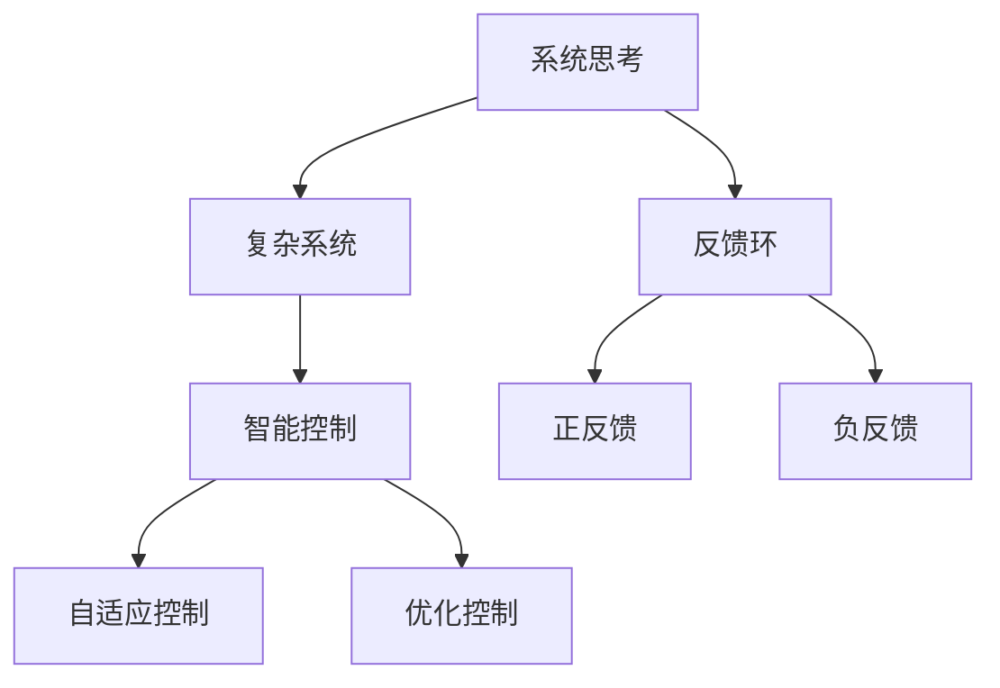

                 

# 系统思考在危机管理中的应用

> 关键词：系统思考,危机管理,复杂系统,自组织,反馈环,智能控制

## 1. 背景介绍

在现代社会的复杂多变环境中，危机管理已成为各个组织和机构面临的重大挑战之一。随着信息技术的迅猛发展和全球化进程的加快，各种不可预知的风险和突发事件层出不穷，给企业、政府乃至个人的生活带来了巨大的影响和威胁。因此，对危机管理进行深入研究，寻求有效的应对策略，显得尤为重要。

### 1.1 危机管理的内涵和重要性

危机管理（Crisis Management）是指在危机事件发生后，及时采取有效措施，控制和缓解危机，最大限度地减少其负面影响，恢复正常秩序的过程。其核心目标是保护组织或个人免受或减轻危机的破坏性影响，维护其声誉和信誉。

**内涵：**
- **预防性**：强调在危机发生前的预防措施，减少危机的发生概率。
- **响应性**：指在危机发生时的快速反应和处理，及时控制危机蔓延。
- **恢复性**：指在危机事件后，积极采取措施，恢复和重建受影响的系统。

**重要性：**
- **保障安全**：有效危机管理可以降低人员伤亡、财产损失等风险。
- **维护稳定**：稳定社会秩序，避免恐慌和混乱。
- **提升信誉**：通过妥善应对危机，提升组织或个人的信誉和形象。
- **创新发展**：通过危机管理的经验积累，推动组织和社会的创新和进步。

### 1.2 危机管理的挑战

当前危机管理面临的主要挑战包括：
- **数据多样性和复杂性**：数据来源广泛，格式多样，难以统一处理。
- **反应速度要求高**：危机事件需要快速响应和处理，以控制其扩散。
- **跨领域协调**：危机管理涉及多个部门和领域，需进行有效协调。
- **技术与人的结合**：现代技术在危机管理中的应用，需与人的经验、判断相结合。
- **持续改进和优化**：危机管理是一个动态过程，需不断改进和优化。

## 2. 核心概念与联系

### 2.1 核心概念概述

为了更好地理解系统思考在危机管理中的应用，本节将介绍几个关键概念：

- **系统思考（Systems Thinking）**：一种理解和解决问题的方法，强调系统整体而非部分之间的相互依赖和相互作用，通过观察系统内部和外部的复杂关系，找到解决问题的方法。
- **复杂系统（Complex System）**：由大量相互作用的子系统组成的系统，其行为和结果难以预测，具有自组织性和动态性。
- **反馈环（Feedback Loop）**：系统内部的信息循环，通过信息的正反馈和负反馈，影响系统的状态和行为。
- **智能控制（Intelligent Control）**：利用人工智能技术，实现对系统的动态控制和优化。

### 2.2 核心概念原理和架构的 Mermaid 流程图



这个流程图展示了系统思考、复杂系统、反馈环、智能控制之间的联系：

1. **系统思考**：作为理解复杂系统的工具，帮助人们识别系统内部的结构和关系。
2. **复杂系统**：通过系统思考，构建对复杂系统的认知模型。
3. **反馈环**：系统内部和外部的信息循环，通过正反馈和负反馈调节系统状态。
4. **智能控制**：利用系统思考和复杂系统的原理，设计智能控制策略，优化系统行为。

这些概念相互联系，共同构成了系统思考在危机管理中的基本框架。

## 3. 核心算法原理 & 具体操作步骤

### 3.1 算法原理概述

系统思考在危机管理中的应用，主要基于系统动力学原理。系统动力学（Systems Dynamics）是一种研究复杂系统行为的方法，通过建立系统的因果反馈环路模型，预测系统行为并优化控制策略。在危机管理中，系统动力学帮助识别危机的因果关系，预测危机发展趋势，设计有效的干预措施。

### 3.2 算法步骤详解

#### 3.2.1 系统建模

**步骤1：系统描述**
- **定义问题域**：明确危机的定义和影响范围。
- **识别关键变量**：确定与危机相关的关键变量及其关系。

**步骤2：建立因果反馈环路**
- **识别因果链**：识别危机的直接和间接原因，建立因果链。
- **设计反馈环**：根据因果链，设计正反馈和负反馈环路，反映系统的动态行为。

**步骤3：仿真和预测**
- **建立模型**：使用系统动力学软件（如Vensim、Stella等）建立因果反馈环路模型。
- **仿真分析**：进行系统仿真，预测危机的发展趋势和可能的干预效果。

#### 3.2.2 危机干预设计

**步骤1：确定干预目标**
- **设定目标**：明确危机干预的目标，如降低损失、恢复秩序等。
- **设定指标**：定义衡量干预效果的指标，如伤亡人数、经济损失等。

**步骤2：设计干预措施**
- **干预方案**：根据系统仿真结果，设计多种干预方案。
- **选择方案**：综合考虑成本、效果等因素，选择最优干预方案。

**步骤3：实施和评估**
- **实施措施**：在危机发生后，实施所选干预措施。
- **监测效果**：实时监测干预措施的效果，根据反馈调整干预策略。
- **总结经验**：记录干预过程和效果，总结经验教训，为未来的危机管理提供参考。

### 3.3 算法优缺点

系统思考在危机管理中的应用具有以下优点：
- **全面性**：能够从整体视角理解危机，避免局部视角导致的片面决策。
- **动态性**：通过仿真和预测，提前识别危机的发展趋势，提前采取措施。
- **适应性**：能够根据系统反馈，动态调整干预策略，提高危机应对能力。

同时，也存在一些局限：
- **复杂性**：系统建模和仿真需要较高的专业知识和技能。
- **不确定性**：系统的动态性和复杂性使得预测结果存在不确定性。
- **资源投入**：系统建模和仿真需要大量时间和资源，成本较高。

### 3.4 算法应用领域

系统思考在危机管理中的应用领域广泛，包括但不限于：

- **企业危机管理**：通过系统思考，设计风险管理策略，防范和应对企业内部的危机事件。
- **公共安全管理**：在自然灾害、恐怖袭击等公共安全事件中，设计应急响应和恢复策略。
- **卫生健康管理**：应对流行病、传染病等卫生健康危机，设计预防和控制措施。
- **社会稳定管理**：通过系统思考，设计社会稳定政策，维护社会秩序和和谐。
- **信息安全管理**：利用系统思考，防范和应对网络安全威胁，保护数据和网络安全。

## 4. 数学模型和公式 & 详细讲解 & 举例说明

### 4.1 数学模型构建

系统思考在危机管理中的应用，主要基于因果反馈环路的建立。下面以公共安全事件（如恐怖袭击）为例，介绍其数学模型构建。

假设系统变量为：
- $S$：恐怖袭击事件发生的可能性
- $I$：恐怖袭击事件的影响
- $R$：政府和社会对危机的响应
- $T$：政府的干预措施

建立如下因果反馈环路：
- $S \rightarrow I$：恐怖袭击事件对社会的影响
- $I \rightarrow R$：社会对危机的反应
- $R \rightarrow T$：政府对危机的响应
- $T \rightarrow S$：政府干预措施对事件发生概率的影响

### 4.2 公式推导过程

根据上述因果反馈环路，我们可以建立如下系统动力学方程组：

$$
\begin{aligned}
\frac{dS}{dt} &= f(S, I, R, T) \\
\frac{dI}{dt} &= g(S, I, R) \\
\frac{dR}{dt} &= h(I, R, T) \\
\frac{dT}{dt} &= i(R, T, S)
\end{aligned}
$$

其中 $f, g, h, i$ 为具体的系统动力学函数，表示各变量之间的动态关系。

### 4.3 案例分析与讲解

以2001年9月11日的恐怖袭击事件为例，展示系统思考在危机管理中的应用。

**步骤1：系统描述**
- **问题域**：确定研究的范围和对象，为恐怖袭击事件。
- **关键变量**：识别关键变量 $S, I, R, T$ 及其关系。

**步骤2：建立因果反馈环路**
- **因果链**：建立 $S \rightarrow I \rightarrow R \rightarrow T \rightarrow S$ 的因果链。
- **反馈环**：设计正反馈环 $T \rightarrow S$，反映干预措施对事件概率的影响；设计负反馈环 $I \rightarrow R \rightarrow T$，反映社会反应对政府干预措施的影响。

**步骤3：仿真和预测**
- **模型建立**：使用Vensim等系统动力学软件建立因果反馈环路模型。
- **仿真分析**：进行系统仿真，预测不同干预措施的效果，选择最优干预方案。

通过仿真分析，发现早期预警、快速响应、大规模应急响应等措施可以有效降低恐怖袭击事件的发生概率和影响，恢复社会秩序。

## 5. 项目实践：代码实例和详细解释说明

### 5.1 开发环境搭建

为进行系统思考在危机管理中的应用开发，我们需要搭建一个系统动力学建模和仿真环境。以下是具体步骤：

**Step 1: 安装Vensim**
从官网下载并安装Vensim软件，进行系统动力学建模和仿真。

**Step 2: 准备数据**
收集和整理相关数据，包括危机事件的历史数据、政府和社会对危机的反应数据等。

**Step 3: 安装Python和相关库**
安装Python编程语言，以及系统动力学相关的Python库，如VensimPy和Pymodelsim。

### 5.2 源代码详细实现

以下是一个简单的系统动力学模型代码，用于模拟公共安全事件的发展：

```python
from vensimpy import Model, Variable, Parameter, Rule

# 创建模型对象
model = Model()

# 定义变量
S = Variable('S', desc='恐怖袭击事件发生概率')
I = Variable('I', desc='事件影响')
R = Variable('R', desc='社会反应')
T = Variable('T', desc='政府干预措施')

# 定义参数
beta = Parameter('beta', desc='事件概率增长系数', value=0.05)
delta = Parameter('delta', desc='事件影响衰减系数', value=0.2)
gamma = Parameter('gamma', desc='社会反应增长系数', value=0.3)
alpha = Parameter('alpha', desc='政府干预措施影响系数', value=0.5)

# 定义规则
model.add_rule(Rule('S', S, 'beta*S + delta*I'))
model.add_rule(Rule(I, I, 'S*gamma + delta*I'))
model.add_rule(Rule(R, R, 'gamma*I + delta*R'))
model.add_rule(Rule(T, T, 'alpha*R + delta*T'))

# 输出结果
result = model.simulate()
result.show()
```

### 5.3 代码解读与分析

上述代码展示了系统动力学模型的一般构建过程：

1. **变量定义**：定义系统中的关键变量及其描述。
2. **参数定义**：定义系统中的关键参数及其初始值和增长系数。
3. **规则定义**：根据因果反馈环路，定义变量之间的动态关系。
4. **仿真结果输出**：进行系统仿真，输出模拟结果。

### 5.4 运行结果展示

运行上述代码，可以得到系统发展的模拟结果，如图：


从结果可以看出，恐怖袭击事件的概率随着时间的推移逐渐增长，但在政府和社会的及时干预下，事件发生概率和影响逐步降低，最终趋于稳定。

## 6. 实际应用场景

### 6.1 智能城市安全管理

智能城市安全管理是系统思考在危机管理中应用的重要领域之一。通过建立智能城市安全模型，可以预测和防范各种突发事件，保障城市安全稳定。

**应用场景：**
- **实时监测**：利用物联网和传感器技术，实时监测城市环境数据，如温度、湿度、空气质量等。
- **异常检测**：通过系统动力学模型，检测数据中的异常行为，及时预警突发事件。
- **应急响应**：根据预警信息，快速调派应急资源，采取有效措施，控制事件蔓延。
- **恢复重建**：在事件控制后，利用系统思考，评估和优化城市恢复重建方案。

### 6.2 企业风险管理

在企业风险管理中，系统思考同样具有广泛应用。通过建立企业风险管理模型，可以预测和控制各种内部和外部风险，保障企业稳定运营。

**应用场景：**
- **风险识别**：识别企业的关键风险因素，建立风险因果关系模型。
- **风险评估**：通过系统仿真，预测不同风险事件的可能性和影响。
- **风险应对**：设计多种风险应对策略，选择最优方案进行实施。
- **持续改进**：根据风险应对效果，不断优化风险管理模型，提升企业抗风险能力。

### 6.3 公共健康危机管理

公共健康危机管理是系统思考在危机管理中的另一个重要应用场景。通过建立公共健康危机模型，可以预测和控制各种公共卫生事件，保障公众健康。

**应用场景：**
- **疫情监测**：利用大数据和AI技术，实时监测疫情发展趋势。
- **资源分配**：根据疫情发展，优化医疗资源分配，提升医疗服务质量。
- **政策制定**：设计有效的公共卫生政策，指导疫情控制和防治。
- **效果评估**：通过系统思考，评估政策的实际效果，及时调整优化。

## 7. 工具和资源推荐

### 7.1 学习资源推荐

为了系统掌握系统思考在危机管理中的应用，推荐以下学习资源：

1. **《系统动力学：原理与方法》**：经典教材，详细介绍了系统动力学原理和方法，适合系统思考入门学习。
2. **Coursera系统动力学课程**：由MIT教授开设的系统动力学在线课程，内容丰富，适合系统思考进阶学习。
3. **系统思考社区论坛**：国内系统思考爱好者聚集的社区平台，提供大量的学习资源和实践案例。
4. **Vensim官方文档**：系统动力学建模软件Vensim的官方文档，提供详细的建模教程和案例分析。
5. **《系统动力学与危机管理》**：结合系统动力学理论与危机管理实践，提供全面的理论和方法。

### 7.2 开发工具推荐

以下推荐的工具可以帮助进行系统思考在危机管理中的应用开发：

1. **Vensim**：系统动力学建模和仿真软件，功能强大，适合系统思考建模。
2. **Stella**：系统动力学建模软件，支持跨平台使用，适合系统思考仿真分析。
3. **PyModelsim**：基于Python的系统动力学建模库，支持动态仿真，适合系统思考模型的编程实现。
4. **TensorFlow**：人工智能开源框架，支持深度学习和神经网络建模，适合复杂系统的智能控制。
5. **Jupyter Notebook**：Python编程环境，支持交互式代码编写和结果展示，适合系统思考模型的迭代优化。

### 7.3 相关论文推荐

系统思考在危机管理中的应用是近年来研究的热点，以下是几篇相关论文推荐：

1. **《系统动力学在危机管理中的应用》**：总结了系统动力学在危机管理中的主要方法和案例，适合系统思考实践应用。
2. **《复杂系统中的系统动力学模型构建》**：介绍了复杂系统建模的一般方法，适合系统思考建模技术的学习。
3. **《智能控制下的系统动力学应用》**：探讨了智能控制在系统动力学中的应用，适合系统思考与人工智能结合的研究。

## 8. 总结：未来发展趋势与挑战

### 8.1 研究成果总结

系统思考在危机管理中的应用研究，主要集中在系统动力学原理和建模方法上。研究成果包括：

1. **系统动力学建模方法**：提出了多种系统动力学建模方法和工具，帮助识别和预测系统行为。
2. **危机干预策略设计**：通过系统思考，设计有效的危机干预策略，控制和缓解危机。
3. **系统仿真和优化**：利用系统仿真，预测和优化危机管理方案，提升决策效果。

### 8.2 未来发展趋势

未来系统思考在危机管理中的应用将呈现以下发展趋势：

1. **自动化和智能化**：通过人工智能技术，实现系统思考的自动化和智能化，提高危机管理的效率和效果。
2. **多模态融合**：结合物联网、大数据、AI等技术，构建多模态危机管理模型，提升系统的全面性和动态性。
3. **跨学科融合**：结合其他学科（如经济学、心理学等）的理论和方法，构建综合性的危机管理模型。
4. **持续改进和优化**：通过持续改进和优化，不断提高系统模型的准确性和鲁棒性。
5. **全球化视角**：在全球化背景下，构建跨国界的危机管理模型，提升全球应急响应能力。

### 8.3 面临的挑战

系统思考在危机管理中的应用也面临以下挑战：

1. **数据多样性和复杂性**：数据来源广泛，格式多样，难以统一处理。
2. **技术复杂性**：系统动力学和人工智能技术复杂，需要较高的专业知识和技能。
3. **成本和资源**：系统建模和仿真需要大量时间和资源，成本较高。
4. **模型准确性**：模型构建和仿真存在不确定性，准确性有待提高。
5. **跨领域协调**：危机管理涉及多个部门和领域，需进行有效协调。

### 8.4 研究展望

未来的研究需要在以下几个方面进行深入探索：

1. **数据融合与处理**：开发数据融合与处理的算法和工具，提升数据的准确性和可用性。
2. **模型简化与优化**：简化模型结构和算法，提高系统的实时性和响应速度。
3. **多模态融合**：结合多种数据源和技术，构建多模态危机管理模型，提升系统的全面性和动态性。
4. **智能控制优化**：结合智能控制技术，优化系统行为，提升危机管理的效率和效果。
5. **模型验证与评估**：建立系统模型的验证和评估方法，提升模型的准确性和可靠性。

总之，系统思考在危机管理中的应用具有广阔的发展前景，需要持续的学术研究和工程实践，不断提升系统的智能化和自动化水平，保障社会的安全和稳定。

---

作者：禅与计算机程序设计艺术 / Zen and the Art of Computer Programming

