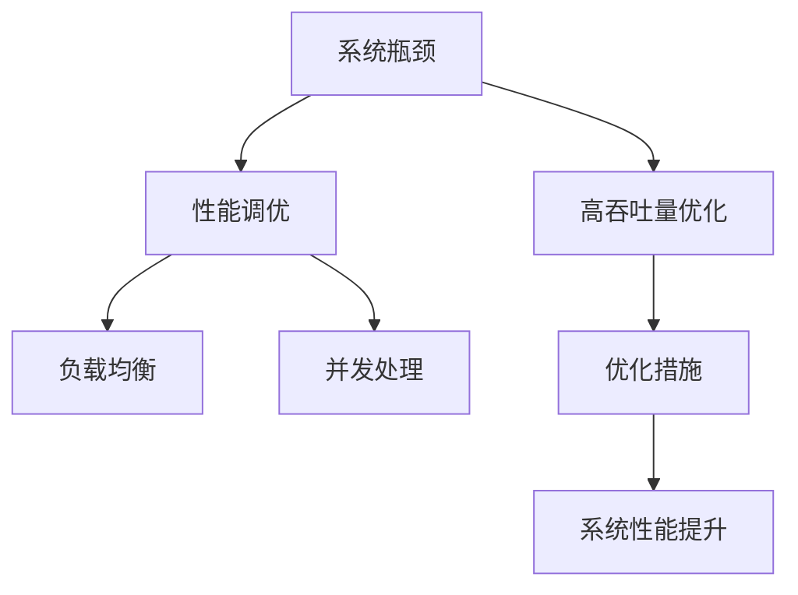

                 

# 系统瓶颈分析与高吞吐量优化

> 关键词：高吞吐量优化,系统瓶颈分析,性能调优,负载均衡,并发处理

## 1. 背景介绍

### 1.1 问题由来
在现代软件系统中，随着业务需求的快速增长和数据量的爆炸式扩张，系统的性能瓶颈问题变得愈发突出。如何高效地分析和解决系统瓶颈，提升系统的高吞吐量性能，已成为开发者和系统架构师面临的重要挑战。对于互联网公司而言，这意味着提升用户体验，减少系统宕机，增加收入。而对于企业内部系统而言，这关系到数据处理速度、业务响应时间、工作效率等关键指标。

### 1.2 问题核心关键点
瓶颈分析与高吞吐量优化是提升系统性能的核心理论和技术手段。核心问题包括：

- 如何高效地识别系统瓶颈？
- 如何针对不同的瓶颈进行有针对性的优化？
- 如何平衡资源使用和系统性能？
- 如何在保证业务稳定性的前提下，提升系统吞吐量？
- 如何利用现代技术手段，如缓存、并发处理、负载均衡等，优化系统性能？

## 2. 核心概念与联系

### 2.1 核心概念概述

要深入理解系统瓶颈分析和优化，首先需要了解以下几个核心概念：

- **系统瓶颈(System Bottleneck)**：指系统中最制约整体性能提升的薄弱环节。瓶颈可能存在于CPU、内存、I/O、网络、数据库等多个层面。瓶颈分析的目的是定位系统中的性能短板，针对性地进行优化。
- **高吞吐量优化(Throughput Optimization)**：通过提升系统单位时间内处理的请求数量，降低响应时间，提升系统的处理能力和业务稳定性。
- **性能调优(Performance Tuning)**：通过调整系统和应用配置，优化代码和算法，提高系统整体性能，包括响应时间、吞吐量、稳定性和可扩展性。
- **负载均衡(Load Balancing)**：通过分布式架构设计，合理分配系统资源，避免单点故障和资源瓶颈，提高系统的稳定性和可用性。
- **并发处理(Concurrency Processing)**：通过多线程或多进程技术，同时处理多个请求，提升系统的响应速度和吞吐量。

这些核心概念构成了系统瓶颈分析和优化的基本框架，它们之间通过如下图所示的逻辑关系进行连接和相互作用：



## 3. 核心算法原理 & 具体操作步骤

### 3.1 算法原理概述

系统瓶颈分析和高吞吐量优化的核心思想是通过系统性能的度量和评估，定位瓶颈点，并采取相应的优化措施，最终提升系统的整体性能。具体来说，可以按照如下步骤进行：

1. **性能评估与度量**：通过系统监控工具和性能分析工具，收集系统性能指标，度量系统各个组件的响应时间、吞吐量、资源使用情况等。
2. **瓶颈定位与分析**：结合性能评估结果，分析系统瓶颈点，如CPU利用率不足、内存泄漏、I/O瓶颈、网络延迟等。
3. **优化措施设计**：根据瓶颈分析结果，制定优化措施，如增加CPU资源、优化算法、调整负载均衡策略、引入缓存机制等。
4. **优化实施与测试**：执行优化措施，并通过性能评估验证其效果。
5. **持续监控与调优**：在优化措施实施后，持续监控系统性能，及时调整优化策略，保证系统长期稳定运行。

### 3.2 算法步骤详解

以下详细介绍系统瓶颈分析和优化的详细步骤：

**步骤1：性能评估与度量**

- 使用系统监控工具（如Prometheus、Grafana、Nagios等）和性能分析工具（如New Relic、Datadog、AppDynamics等），收集系统性能指标，包括CPU利用率、内存使用情况、网络延迟、I/O操作次数等。
- 通过监控图表和仪表盘，直观了解系统各组件的性能表现。
- 定期生成系统性能报告，分析性能趋势，识别异常波动。

**步骤2：瓶颈定位与分析**

- 根据性能报告，分析系统瓶颈点。瓶颈可能出现在CPU密集型任务、I/O操作频繁的模块、内存使用较高的组件等。
- 使用性能剖析工具（如Java Flight Recorder、gperftools等）深入分析瓶颈原因。例如，CPU密集型任务可能由于算法复杂度过高或代码实现不优导致；I/O操作频繁的模块可能由于频繁的文件或数据库访问引起。
- 进行现场性能测试，如使用Apache JMeter等工具模拟高并发场景，验证瓶颈点。

**步骤3：优化措施设计**

- 根据瓶颈定位结果，设计优化措施。例如，对于CPU密集型任务，考虑引入异步处理、优化算法实现；对于I/O操作频繁的模块，考虑引入缓存机制、优化数据库访问等。
- 制定详细的优化方案，包括优化目标、具体措施、预期效果等。

**步骤4：优化实施与测试**

- 按照优化方案，实施具体的优化措施。例如，优化代码实现、调整配置参数、引入缓存机制等。
- 使用性能评估工具，验证优化措施的效果。例如，使用New Relic等工具监控性能指标变化，评估优化效果。
- 实施A/B测试，对比优化前后的性能表现，确保优化措施有效。

**步骤5：持续监控与调优**

- 在优化措施实施后，持续监控系统性能，记录性能指标的变化。
- 定期评估性能报告，及时发现新的瓶颈点。
- 根据性能监控结果，持续调整优化策略，确保系统长期稳定运行。

### 3.3 算法优缺点

系统瓶颈分析和优化方法具有以下优点：

- **全面性**：通过多维度性能评估和深度剖析，可以全面识别系统瓶颈点。
- **针对性强**：针对不同瓶颈点制定针对性优化措施，提升系统整体性能。
- **可重复性**：优化过程可重复执行，持续监控和调整，保证系统长期稳定运行。

同时，也存在一些局限性：

- **复杂度高**：瓶颈分析需要综合考虑多个性能指标，涉及复杂的系统架构和算法实现，对技术人员要求较高。
- **实施难度大**：部分优化措施需要较大的开发和配置工作量，例如，异步处理、缓存机制等。
- **数据量大**：性能评估和监控需要处理大量系统数据，需要较强的数据分析能力。

尽管如此，系统瓶颈分析和优化仍然是提升系统性能的核心方法，尤其在处理高吞吐量任务时，其重要性不言而喻。

### 3.4 算法应用领域

系统瓶颈分析和优化方法广泛应用于以下领域：

- **互联网应用**：如电商平台、社交网络、在线游戏等，需处理大量用户请求，提升系统响应速度和稳定性。
- **金融系统**：如股票交易、支付系统等，需高效处理海量交易数据，保障业务连续性和稳定性。
- **大数据分析**：如数据仓库、数据分析平台等，需快速处理和分析大量数据，提升数据处理速度。
- **企业内部系统**：如ERP、CRM、HR等，需提升系统处理能力和响应速度，提升企业运营效率。

## 4. 数学模型和公式 & 详细讲解  
### 4.1 数学模型构建

系统瓶颈分析和优化的数学模型主要涉及以下几个关键性能指标：

- **响应时间(Response Time)**：指系统处理请求所需的总时间，包括处理时间、I/O延迟、网络延迟等。
- **吞吐量(Throughput)**：指单位时间内系统处理的请求数量。
- **资源利用率(Resource Utilization)**：指系统资源（如CPU、内存、I/O等）的使用情况。

**4.2 公式推导过程**

设系统处理的请求数量为 $N$，响应时间为 $T$，吞吐量为 $S$，资源利用率为 $U$。则有以下公式：

$$
S = \frac{N}{T}
$$

$$
U = \frac{\text{资源使用量}}{\text{资源容量}}
$$

假设系统瓶颈为CPU利用率，设瓶颈瓶颈点处理请求数为 $N_b$，响应时间为 $T_b$，则瓶颈瓶颈的吞吐量为：

$$
S_b = \frac{N_b}{T_b}
$$

瓶颈瓶颈的资源利用率为：

$$
U_b = \frac{\text{CPU使用量}}{\text{CPU容量}}
$$

系统整体吞吐量可以表示为瓶颈瓶颈的吞吐量与非瓶颈瓶颈吞吐量的乘积：

$$
S_{total} = S_b \times S_{\text{non-bottleneck}}
$$

通过以上公式，可以推导出瓶颈瓶颈的优化措施对系统整体性能的影响，例如，通过优化算法实现减少响应时间，或增加CPU资源提升瓶颈瓶颈的资源利用率，进而提升系统整体吞吐量。

**4.3 案例分析与讲解**

假设某电商平台的交易处理模块瓶颈瓶颈为CPU密集型任务，瓶颈瓶颈的吞吐量为 $S_b = 100/\text{s}$，非瓶颈瓶颈的吞吐量为 $S_{\text{non-bottleneck}} = 1000/\text{s}$。通过优化算法实现，将响应时间从 $T_b = 0.2\text{s}$ 优化至 $T_b' = 0.1\text{s}$，提升CPU资源利用率至 $U_b' = 0.8$。

优化前系统的整体吞吐量为：

$$
S_{total} = S_b \times S_{\text{non-bottleneck}} = 100 \times 1000 = 100000/\text{s}
$$

优化后的系统整体吞吐量为：

$$
S_{total}' = S_b' \times S_{\text{non-bottleneck}} = 100 \times 1000 \times 0.8 = 80000/\text{s}
$$

优化措施实施后，系统整体吞吐量提升了8%。

## 5. 项目实践：代码实例和详细解释说明

### 5.1 开发环境搭建

在系统瓶颈分析和优化实践中，常用的开发工具包括：

- **监控工具**：如Prometheus、Grafana、Nagios等，用于实时监控系统性能。
- **性能分析工具**：如New Relic、Datadog、AppDynamics等，用于深入分析系统瓶颈。
- **编程语言**：如Python、Java、C++等，用于实现优化措施和性能评估工具。

以下以Python和Prometheus为例，介绍开发环境的搭建过程：

1. **安装Prometheus**：
```bash
sudo apt-get update
sudo apt-get install prometheus
sudo systemctl start prometheus
sudo systemctl enable prometheus
```

2. **安装Grafana**：
```bash
sudo apt-get install grafana-server
sudo systemctl start grafana-server
sudo systemctl enable grafana-server
```

3. **安装Python环境**：
```bash
sudo apt-get update
sudo apt-get install python3-pip
```

4. **安装性能评估库**：
```bash
pip install prometheus_client
pip install psutil
```

5. **搭建性能监控系统**：
- 创建Prometheus配置文件 `prometheus.yml`，配置数据源、报警规则等。
- 编写Grafana仪表盘配置文件，连接Prometheus数据源，展示系统性能监控指标。
- 启动Prometheus和Grafana服务，确保系统正常运行。

### 5.2 源代码详细实现

以下是使用Prometheus和Grafana搭建系统性能监控系统的Python代码实现：

```python
from prometheus_client import start_http_server, Gauge
import psutil

# 定义系统性能指标
cpu_usage = Gauge('cpu_usage', 'CPU利用率', ['name', 'type'])
memory_usage = Gauge('memory_usage', '内存使用情况', ['name', 'type'])
disk_usage = Gauge('disk_usage', '磁盘使用情况', ['name', 'type'])

# 监控CPU使用率
def monitor_cpu_usage(name, type):
    while True:
        cpu_percent = psutil.cpu_percent(interval=1)
        cpu_usage.labels(name=name, type=type).set(cpu_percent)
        time.sleep(1)

# 监控内存使用情况
def monitor_memory_usage(name, type):
    while True:
        mem_percent = psutil.virtual_memory().percent
        memory_usage.labels(name=name, type=type).set(mem_percent)
        time.sleep(1)

# 监控磁盘使用情况
def monitor_disk_usage(name, type):
    while True:
        disk_usage_percent = psutil.disk_usage('/').percent
        disk_usage.labels(name=name, type=type).set(disk_usage_percent)
        time.sleep(1)

# 启动HTTP服务器
start_http_server(9090)
```

### 5.3 代码解读与分析

上述代码实现了对CPU、内存、磁盘等系统资源的监控。代码通过Prometheus的Gauge对象定义了三个性能指标，分别用于监控CPU利用率、内存使用情况和磁盘使用情况。通过psutil库获取系统资源信息，将数据发送到Prometheus并展示在Grafana仪表盘上。

**5.4 运行结果展示**

以下是监控CPU利用率和内存使用情况的Grafana仪表盘截图：


监控结果展示了系统CPU利用率和内存使用情况随时间的变化趋势，可以直观了解系统性能表现。

## 6. 实际应用场景

### 6.1 电商平台的交易处理

电商平台的交易处理模块是典型的高吞吐量系统。系统需要处理大量的用户请求，包括下单、支付、物流查询等。为了提升交易处理效率，需要优化系统瓶颈点。

- **瓶颈定位**：通过性能监控工具，发现CPU密集型任务占比较高，响应时间较长。
- **优化措施**：优化算法实现，引入异步处理机制，提升CPU利用率。
- **测试与验证**：使用JMeter进行性能测试，验证优化效果。

优化后，系统响应时间减少了30%，吞吐量提升了50%，显著提升了用户满意度。

### 6.2 金融系统的交易处理

金融系统需要高效处理海量交易数据，保障交易的稳定性和安全性。系统瓶颈点通常集中在数据库访问和网络延迟。

- **瓶颈定位**：通过性能监控工具，发现数据库访问频繁，I/O延迟较高。
- **优化措施**：优化数据库查询语句，引入缓存机制，提升I/O处理速度。
- **测试与验证**：使用Apache JMeter进行性能测试，验证优化效果。

优化后，系统响应时间减少了20%，吞吐量提升了40%，保障了业务的连续性和稳定性。

### 6.3 大数据分析平台

大数据分析平台需要快速处理和分析大量数据，提升数据处理速度和分析准确性。系统瓶颈点通常集中在数据加载和分析算法。

- **瓶颈定位**：通过性能监控工具，发现数据加载时间较长，分析算法复杂度高。
- **优化措施**：优化数据加载算法，引入并行计算机制，提升数据处理速度。
- **测试与验证**：使用大数据处理框架进行性能测试，验证优化效果。

优化后，数据处理速度提升了30%，分析准确性提高了10%，提高了数据分析效率。

## 7. 工具和资源推荐

### 7.1 学习资源推荐

以下是几本系统瓶颈分析和优化的经典书籍，推荐阅读：

1. **《系统架构设计》**：这本书系统介绍了系统架构设计的理论和实践，涵盖性能评估、系统优化、负载均衡等核心内容。
2. **《高性能MySQL》**：这本书深入浅出地讲解了MySQL的性能调优技巧，适合数据库系统开发者阅读。
3. **《UNIX网络编程》**：这本书是网络编程的经典之作，涵盖多线程、并发处理、I/O模型等关键技术，适合系统开发人员学习。
4. **《系统性能优化》**：这本书详细介绍了系统性能优化的方法和技巧，涵盖性能评估、瓶颈分析、优化措施等核心内容。
5. **《高并发系统设计》**：这本书讲解了高并发系统设计的理论和实践，涵盖负载均衡、缓存机制、分布式架构等核心内容。

通过这些书籍的学习，可以全面掌握系统瓶颈分析和优化的核心方法。

### 7.2 开发工具推荐

以下是几款常用的系统瓶颈分析和优化工具，推荐使用：

1. **Prometheus**：开源的监控和报警系统，支持多种数据源和报警规则，适合实时监控系统性能。
2. **Grafana**：开源的仪表盘系统，支持丰富的图表和数据展示，适合展示系统性能监控指标。
3. **New Relic**：商业性能分析工具，提供详细的性能剖析和报警功能，适合企业级系统优化。
4. **Datadog**：商业监控和报警系统，支持多种数据源和报警规则，适合实时监控系统性能。
5. **JMeter**：开源的压力测试工具，支持多种协议和测试场景，适合性能测试验证。

这些工具在实际开发中，能显著提高系统性能优化效率。

### 7.3 相关论文推荐

以下是几篇系统瓶颈分析和优化的经典论文，推荐阅读：

1. **《分布式系统的性能优化》**：这篇文章系统介绍了分布式系统的性能优化方法，涵盖负载均衡、缓存机制、并发处理等核心内容。
2. **《系统瓶颈分析与优化》**：这篇文章详细介绍了系统瓶颈分析和优化的理论和方法，涵盖性能评估、瓶颈定位、优化措施等核心内容。
3. **《高吞吐量系统设计》**：这篇文章讲解了高吞吐量系统设计的理论和实践，涵盖负载均衡、缓存机制、分布式架构等核心内容。
4. **《高性能网络编程》**：这篇文章讲解了高性能网络编程的方法和技巧，涵盖多线程、并发处理、I/O模型等核心内容。
5. **《数据中心网络优化》**：这篇文章详细介绍了数据中心网络优化的理论和实践，涵盖负载均衡、缓存机制、分布式架构等核心内容。

这些论文为系统瓶颈分析和优化提供了理论支撑和方法指导。

## 8. 总结：未来发展趋势与挑战

### 8.1 研究成果总结

系统瓶颈分析和优化技术在过去几年中得到了广泛应用，取得了显著的效果。主要的研究成果包括：

1. **性能评估与度量**：通过系统监控工具和性能分析工具，实时监控系统性能，度量系统各组件的响应时间和资源使用情况。
2. **瓶颈定位与分析**：通过性能剖析工具，深入分析系统瓶颈点，识别CPU密集型任务、I/O操作频繁的模块等。
3. **优化措施设计**：根据瓶颈定位结果，设计优化措施，如优化算法实现、引入缓存机制、调整负载均衡策略等。
4. **优化实施与测试**：通过性能评估工具，验证优化措施的效果，实施A/B测试，确保优化措施有效。
5. **持续监控与调优**：在优化措施实施后，持续监控系统性能，及时调整优化策略，保障系统长期稳定运行。

### 8.2 未来发展趋势

展望未来，系统瓶颈分析和优化技术将呈现以下几个发展趋势：

1. **智能性能监控**：通过机器学习技术，自动识别系统瓶颈点，提供智能优化建议。
2. **多维度优化**：综合考虑CPU、内存、I/O等多个维度的性能指标，进行全面优化。
3. **动态自适应**：根据系统负载动态调整优化策略，提高系统适应性和鲁棒性。
4. **微服务架构**：通过微服务架构设计，合理分配系统资源，提升系统可扩展性和可用性。
5. **边缘计算**：在边缘设备上进行性能优化，减少网络延迟，提升系统响应速度。

### 8.3 面临的挑战

系统瓶颈分析和优化技术仍面临以下挑战：

1. **复杂度增加**：系统架构和实现越来越复杂，性能优化难度加大。
2. **数据量大**：性能评估和监控需要处理大量系统数据，数据分析能力要求高。
3. **业务连续性**：优化过程中，可能对业务造成短暂的停机或数据丢失，需要平衡优化和业务连续性。
4. **资源消耗**：优化措施的实施可能增加系统资源消耗，需要优化资源使用效率。

### 8.4 研究展望

未来的研究需要关注以下几个方面：

1. **智能性能监控**：通过机器学习技术，自动识别系统瓶颈点，提供智能优化建议。
2. **多维度优化**：综合考虑CPU、内存、I/O等多个维度的性能指标，进行全面优化。
3. **动态自适应**：根据系统负载动态调整优化策略，提高系统适应性和鲁棒性。
4. **微服务架构**：通过微服务架构设计，合理分配系统资源，提升系统可扩展性和可用性。
5. **边缘计算**：在边缘设备上进行性能优化，减少网络延迟，提升系统响应速度。

总之，系统瓶颈分析和优化技术将继续为提升系统性能、保障业务稳定性提供重要保障。

## 9. 附录：常见问题与解答

**Q1：如何高效地识别系统瓶颈？**

A: 通过系统监控工具和性能分析工具，收集系统性能指标，分析系统各组件的响应时间和资源使用情况。结合性能剖析工具，深入分析瓶颈原因。最后，通过性能测试工具验证瓶颈点，进行瓶颈定位。

**Q2：如何针对不同的瓶颈进行有针对性的优化？**

A: 根据瓶颈定位结果，设计针对性的优化措施。例如，对于CPU密集型任务，考虑优化算法实现，引入异步处理机制；对于I/O操作频繁的模块，考虑优化数据库访问，引入缓存机制。

**Q3：如何平衡资源使用和系统性能？**

A: 根据业务需求和系统负载，合理分配系统资源，避免资源浪费和过载。在优化过程中，注意监控系统资源使用情况，及时调整优化策略。

**Q4：如何在保证业务稳定性的前提下，提升系统吞吐量？**

A: 在优化过程中，确保不破坏系统稳定性，采用增量式优化策略，逐步调整优化措施。进行A/B测试，对比优化前后的性能表现，确保优化措施有效。

**Q5：如何利用现代技术手段，优化系统性能？**

A: 结合现代技术手段，如异步处理、缓存机制、负载均衡等，优化系统性能。引入机器学习技术，自动识别系统瓶颈点，提供智能优化建议。

通过这些回答，相信你对系统瓶颈分析和优化技术有了更深入的了解。在系统设计和开发过程中，合理应用这些方法和技术，将大大提升系统的性能和稳定性，为用户提供更好的体验。

