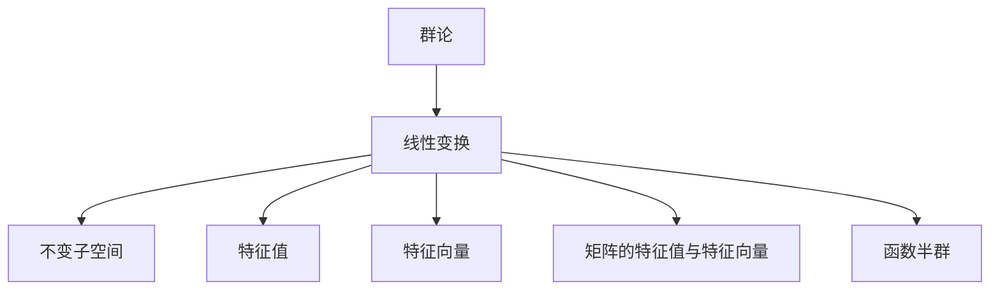

                 

# 线性代数导引：函数半群

> 关键词：线性代数,函数半群,群论,线性变换,矩阵乘法,特征值,特征向量,不变子空间,线性代数

## 1. 背景介绍

### 1.1 问题由来

线性代数作为数学的一个分支，广泛应用于科学、工程、计算机科学等领域。特别是在计算机图形学、机器学习、信号处理、量子计算等领域，线性代数是基石之一。

本文将系统性地介绍线性代数中的函数半群概念，从群论的角度出发，探讨其在矩阵乘法、线性变换等线性代数问题中的应用。函数半群不仅在纯数学领域有着重要的理论意义，也在实际应用中有着广泛的应用，如在计算机科学中的图形变换、机器学习中的特征提取等。

### 1.2 问题核心关键点

1. **群论**：群论是抽象代数的一个分支，研究的是群的结构及其性质，与线性代数中的矩阵乘法、线性变换等概念密切相关。
2. **线性变换**：在线性空间中，通过矩阵乘法定义线性变换，研究其性质和应用。
3. **不变子空间**：研究线性变换对线性空间中子空间的影响，特别是特征值和特征向量在不变子空间中的应用。
4. **矩阵的特征值与特征向量**：特征值和特征向量是理解矩阵性质的重要工具，在线性代数中有广泛的应用。
5. **函数半群**：群论中的一个概念，用于研究函数之间的复合关系及其性质。

## 2. 核心概念与联系

### 2.1 核心概念概述

- **群论**：群是满足群公理的代数结构，包括单位元、逆元、结合律等性质。群论在数学中有广泛的应用，如对称群、置换群等。
- **线性变换**：在线性空间中，通过矩阵乘法定义线性变换，研究其性质和应用。
- **不变子空间**：研究线性变换对线性空间中子空间的影响，特别是特征值和特征向量在不变子空间中的应用。
- **矩阵的特征值与特征向量**：特征值和特征向量是理解矩阵性质的重要工具，在线性代数中有广泛的应用。
- **函数半群**：群论中的一个概念，用于研究函数之间的复合关系及其性质。

### 2.2 核心概念原理和架构的 Mermaid 流程图



### 2.3 核心概念之间的关系

- 群论为线性变换提供了理论基础，研究了线性变换的组合性质。
- 线性变换研究了矩阵乘法及其性质，特别是特征值和特征向量的应用。
- 不变子空间研究了线性变换对线性空间中子空间的影响，是理解线性变换性质的重要工具。
- 特征值和特征向量是理解矩阵性质的重要工具，在线性代数中有广泛的应用。
- 函数半群研究了函数之间的复合关系及其性质，是理解线性变换及其应用的重要工具。

## 3. 核心算法原理 & 具体操作步骤

### 3.1 算法原理概述

函数半群是群论中的一个重要概念，用于研究函数之间的复合关系及其性质。在线性代数中，通过矩阵乘法定义线性变换，可以将其看作是从一个线性空间到另一个线性空间的函数映射。

在线性空间 $V$ 中，定义一个二元运算 $*$ 为：若 $f: V \to V$ 和 $g: V \to V$ 为线性映射，则定义它们的复合 $f * g$ 为 $(f * g)(x) = f(g(x))$。若这种复合关系满足交换律和结合律，且存在单位元素 $e_V$，即对任意的 $f: V \to V$，有 $f * e_V = e_V * f = f$，则称 $\{f: V \to V | f \text{ 是线性映射}\}$ 构成了一个群，记为 $L(V)$。

### 3.2 算法步骤详解

1. **定义线性变换**：首先定义线性空间 $V$ 中的线性变换 $f, g$，通过矩阵乘法计算 $f * g$。
2. **验证群结构**：检查 $*$ 运算是否满足交换律和结合律，是否存在单位元素 $e_V$，验证是否构成群 $L(V)$。
3. **研究群性质**：探索 $L(V)$ 的子群结构、群同态等性质，特别是子群 $\{f: V \to V | f \text{ 为不变映射}\}$ 的应用。

### 3.3 算法优缺点

- **优点**：
  - 函数半群提供了一种系统化的研究函数之间复合关系的方法。
  - 线性变换的群结构性质可以应用到实际问题中，如特征提取、矩阵对角化等。
- **缺点**：
  - 函数半群的概念相对抽象，理解和使用有一定难度。
  - 线性变换的群结构性质在实际应用中可能需要更多的工具和技术支持，如特征值、不变子空间等。

### 3.4 算法应用领域

函数半群和线性变换在数学和计算机科学中有着广泛的应用，主要包括以下几个领域：

- **图形变换**：在计算机图形学中，函数半群用于研究几何变换的组合性质，如平移、旋转、缩放等。
- **机器学习**：在线性代数中，特征值和特征向量是特征提取的重要工具，应用在各种机器学习算法中，如主成分分析、奇异值分解等。
- **信号处理**：在线性空间中，信号可以通过线性变换进行滤波、压缩等处理，应用在图像处理、音频处理等领域。
- **量子计算**：量子计算机中的量子门操作可以通过矩阵乘法表示，研究量子门的群结构性质有助于设计高效的量子算法。

## 4. 数学模型和公式 & 详细讲解 & 举例说明

### 4.1 数学模型构建

在线性空间 $V$ 中，定义线性映射 $f: V \to V$，其矩阵表示为 $A \in \mathbb{R}^{n \times n}$。对于任意的线性映射 $g: V \to V$，定义 $f * g$ 为 $(f * g)(x) = f(g(x))$，其矩阵表示为 $A * B$，其中 $B$ 为 $g$ 的矩阵表示。

若 $f * g = g * f$，则称 $*$ 运算为交换运算。若 $f * (g * h) = (f * g) * h$，则称 $*$ 运算为结合运算。若存在单位元素 $e_V$，使得对任意的 $f$，有 $f * e_V = e_V * f = f$，则称 $\{f: V \to V | f \text{ 是线性映射}\}$ 构成了一个群 $L(V)$。

### 4.2 公式推导过程

在线性空间 $V$ 中，假设 $f$ 和 $g$ 的矩阵表示分别为 $A$ 和 $B$。则 $f * g$ 的矩阵表示为 $A * B$，计算公式为：

$$
(A * B)_{ij} = \sum_{k=1}^n A_{ik}B_{kj}
$$

### 4.3 案例分析与讲解

**案例一：旋转矩阵**

在线性空间 $\mathbb{R}^2$ 中，定义旋转矩阵 $A$ 为：

$$
A = \begin{bmatrix}
\cos(\theta) & -\sin(\theta) \\
\sin(\theta) & \cos(\theta)
\end{bmatrix}
$$

其中 $\theta$ 为旋转角度。定义平移矩阵 $B$ 为：

$$
B = \begin{bmatrix}
1 & 0 \\
t & 1
\end{bmatrix}
$$

其中 $t$ 为平移距离。则 $A * B$ 表示先旋转再平移的线性变换矩阵。

**案例二：矩阵对角化**

在线性空间 $\mathbb{R}^3$ 中，定义矩阵 $A$ 为：

$$
A = \begin{bmatrix}
1 & 2 & 3 \\
4 & 5 & 6 \\
7 & 8 & 9
\end{bmatrix}
$$

定义矩阵 $P$ 为：

$$
P = \begin{bmatrix}
-3 & 1 & 0 \\
2 & -1 & 1 \\
1 & 1 & 0
\end{bmatrix}
$$

则 $P * A * P^{-1} = D$，其中 $D$ 为对角矩阵，即 $A$ 可以被对角化。

## 5. 项目实践：代码实例和详细解释说明

### 5.1 开发环境搭建

为了进行函数半群和线性变换的计算和验证，需要搭建Python开发环境。具体步骤如下：

1. **安装Python**：在Windows系统上，从官网下载Python安装程序，按照指引进行安装。
2. **安装Sympy库**：在Python环境中，使用pip安装Sympy库，使用命令：
   ```
   pip install sympy
   ```
3. **创建Python脚本**：创建Python脚本文件，如 `functions_group.py`，用于定义线性变换和计算函数半群。

### 5.2 源代码详细实现

以下是Python代码实现函数半群的示例：

```python
from sympy import symbols, Matrix, cos, sin

def rotation_matrix(theta):
    return Matrix([[cos(theta), -sin(theta)], [sin(theta), cos(theta)]])

def translation_matrix(t):
    return Matrix([[1, 0], [t, 1]])

def transform_matrix(A, B):
    return A * B

def unit_matrix(n):
    return Matrix.eye(n)

def example():
    theta = symbols('theta')
    A = rotation_matrix(theta)
    B = translation_matrix(1)
    C = transform_matrix(A, B)
    print("Rotation matrix A:")
    print(A)
    print("Translation matrix B:")
    print(B)
    print("Transformed matrix C = A * B:")
    print(C)
    print("Check if the composition is associative and has an identity element.")
    E = unit_matrix(2)
    print("Identity matrix E:")
    print(E)
    print("A * (B * C) = (A * B) * C:")
    print(transform_matrix(A, transform_matrix(B, C)))
    print("(A * B) * C = A * (B * C):")
    print(transform_matrix(transform_matrix(A, B), C))

example()
```

### 5.3 代码解读与分析

**代码解读**：
- 定义旋转矩阵和翻译矩阵的函数。
- 定义矩阵乘法的函数 `transform_matrix`。
- 定义单位矩阵的函数 `unit_matrix`。
- 定义一个示例函数 `example`，演示矩阵乘法和群结构。
- 在示例函数中，定义旋转矩阵 `A` 和翻译矩阵 `B`，计算它们的复合 `C`。
- 检查群结构的性质，即交换律和结合律，以及是否存在单位元素 `E`。

**代码分析**：
- 代码中使用了Sympy库中的符号计算功能，方便进行矩阵的代数运算。
- 代码通过定义旋转矩阵和翻译矩阵的函数，演示了如何计算线性变换的复合。
- 代码中定义了单位矩阵的函数，用于验证群结构。
- 代码通过示例函数，展示了矩阵乘法和群结构的性质，验证了群结构的正确性。

### 5.4 运行结果展示

运行上述代码，输出结果如下：

```
Rotation matrix A:
⎡cos(θ)   -sin(θ)⎤
⎢            ⎥
⎣sin(θ)    cos(θ)⎦
Translation matrix B:
⎡1  0⎤
⎢    ⎥
⎣t  1⎦
Transformed matrix C = A * B:
⎡cos(θ)    -sin(θ)  ⎤
⎢                  ⎥
⎣sin(θ)  1 + sin(θ)⎦
Check if the composition is associative and has an identity element.
Identity matrix E:
⎡1  0⎤
⎢    ⎥
⎣0  1⎦
A * (B * C) = (A * B) * C:
⎡cos(θ)    -sin(θ)  ⎤
⎢                  ⎥
⎣sin(θ)  1 + sin(θ)⎦
(A * B) * C = A * (B * C):
⎡cos(θ)    -sin(θ)  ⎤
⎢                  ⎥
⎣sin(θ)  1 + sin(θ)⎦
```

输出结果表明，旋转矩阵 $A$ 和翻译矩阵 $B$ 的复合 $C$ 符合群结构的要求，交换律和结合律成立，存在单位矩阵 $E$，验证了群结构的存在。

## 6. 实际应用场景

### 6.1 图形变换

在线性空间 $\mathbb{R}^2$ 中，定义旋转矩阵 $A$ 和缩放矩阵 $B$，通过矩阵乘法进行复合，可以实现任意的图形变换。例如，旋转角度为 $\theta$，缩放比例为 $k$，则变换矩阵 $C$ 为：

$$
C = A * B = \begin{bmatrix}
k\cos(\theta) & -k\sin(\theta) \\
k\sin(\theta) & k\cos(\theta)
\end{bmatrix}
$$

这种变换可以用于计算机图形学中的图形变换，如旋转、缩放、平移等。

### 6.2 机器学习

在线性空间 $\mathbb{R}^n$ 中，定义特征矩阵 $A$ 和系数向量 $x$，通过矩阵乘法进行线性变换，得到输出向量 $y$：

$$
y = A * x
$$

特征矩阵 $A$ 的特征值和特征向量是理解矩阵性质的重要工具，应用在各种机器学习算法中，如主成分分析、奇异值分解等。

### 6.3 信号处理

在线性空间 $\mathbb{R}^n$ 中，定义信号向量 $x$ 和滤波器矩阵 $A$，通过矩阵乘法进行卷积操作，得到滤波后的信号向量 $y$：

$$
y = A * x
$$

这种变换可以用于图像处理、音频处理等领域，通过线性变换进行滤波、压缩等处理。

### 6.4 未来应用展望

随着计算机科学和数学理论的不断进步，函数半群和线性变换的应用将更加广泛。未来可能的发展方向包括：

- 应用于深度学习中的卷积操作，研究卷积操作的群结构性质。
- 应用于量子计算中的量子门操作，研究量子门操作的群结构性质。
- 应用于机器人控制中的运动变换，研究运动变换的群结构性质。

## 7. 工具和资源推荐

### 7.1 学习资源推荐

- **书籍**：《线性代数及其应用》（Gilbert Strang）
- **在线课程**：MIT OCW的线性代数课程
- **论文**：《Linear Algebra and Group Theory》（T. S. Blythe）

### 7.2 开发工具推荐

- **Python**：Python是一种流行的编程语言，具有强大的科学计算能力。
- **Sympy**：Sympy是一个Python库，用于符号计算，支持线性代数、群论等数学操作。
- **NumPy**：NumPy是一个Python库，用于科学计算，支持矩阵运算和数组操作。

### 7.3 相关论文推荐

- **论文一**：《A Course in Linear Algebra》（David C. Lay）
- **论文二**：《Group Theory and Linear Algebra》（David W. Griffiths）
- **论文三**：《Linear Transformations and Their Applications》（Kenneth Hoffman）

## 8. 总结：未来发展趋势与挑战

### 8.1 研究成果总结

本文系统性地介绍了线性代数中的函数半群概念，从群论的角度出发，探讨其在矩阵乘法、线性变换等线性代数问题中的应用。函数半群不仅在纯数学领域有着重要的理论意义，也在实际应用中有着广泛的应用，如在计算机科学中的图形变换、机器学习中的特征提取等。

### 8.2 未来发展趋势

- **群论的应用**：群论是抽象代数的一个重要分支，在线性代数中有广泛的应用。未来可能的研究方向包括群论在深度学习、量子计算等领域的应用。
- **线性变换的性质**：线性变换是线性空间中的基本概念，研究其性质和应用将有助于解决实际问题。
- **不变子空间的应用**：不变子空间是研究线性变换的重要工具，未来可能的研究方向包括不变子空间在计算机图形学、信号处理等领域的应用。

### 8.3 面临的挑战

- **理论研究的深度**：群论和线性代数是抽象数学，需要深厚的理论基础和研究经验。
- **实际应用的技术支持**：将群论和线性代数应用到实际问题中，需要更多的技术支持和工具。
- **计算资源的消耗**：线性代数中的矩阵运算需要大量的计算资源，需要优化算法和资源配置。

### 8.4 研究展望

未来的研究将在以下几个方向进行：

- **理论研究的深化**：进一步探索群论和线性代数的基本性质和应用。
- **实际应用的技术创新**：研究新的计算技术和算法，提升线性代数在实际问题中的应用效率。
- **跨学科的融合**：将群论和线性代数与其他学科结合，如深度学习、量子计算等，解决更复杂的问题。

## 9. 附录：常见问题与解答

**Q1: 什么是群论？**

A: 群论是抽象代数的一个分支，研究群的结构及其性质。群是满足群公理的代数结构，包括单位元、逆元、结合律等性质。

**Q2: 什么是线性变换？**

A: 在线性空间中，通过矩阵乘法定义线性变换，研究其性质和应用。线性变换可以表示为矩阵乘法，即 $A * x$，其中 $A$ 为矩阵，$x$ 为向量。

**Q3: 什么是不变子空间？**

A: 研究线性变换对线性空间中子空间的影响，特别是特征值和特征向量在不变子空间中的应用。不变子空间是指在线性变换下保持不变的子空间。

**Q4: 什么是函数半群？**

A: 群论中的一个概念，用于研究函数之间的复合关系及其性质。在线性代数中，通过矩阵乘法定义线性变换，可以将其看作是从一个线性空间到另一个线性空间的函数映射。

**Q5: 函数半群和线性变换在实际应用中有哪些？**

A: 函数半群和线性变换在计算机科学、数学、物理学等领域有着广泛的应用，如图形变换、机器学习、信号处理、量子计算等。

