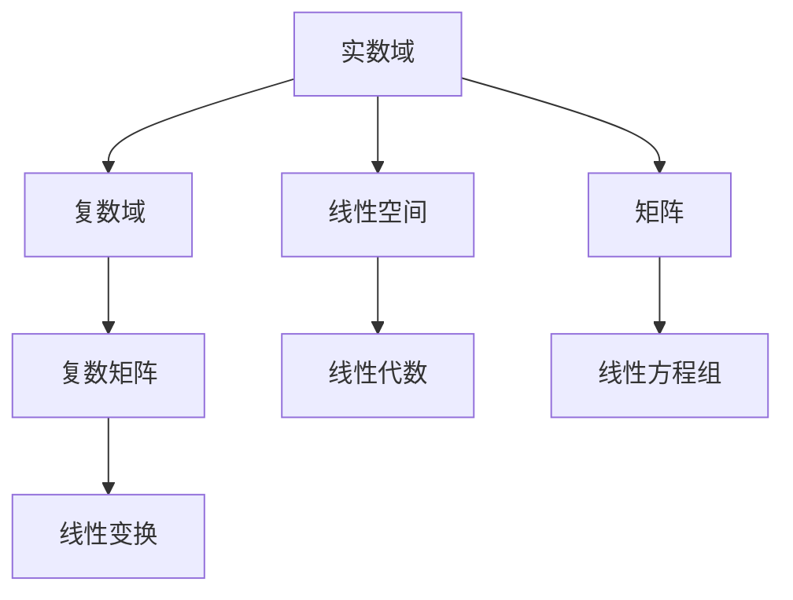

                 

# 线性代数导引：可构造数域K

## 1. 背景介绍

### 1.1 问题由来
线性代数是计算机科学中不可或缺的一部分，从机器学习模型的参数更新到计算机图形学中的矩阵变换，都离不开线性代数的理论基础。在计算机科学中，我们常常需要处理和分析大量数据的线性关系，这些数据可能是向量、矩阵或者更复杂的多维数组。而可构造数域K作为线性代数的基本概念，可以帮助我们更好地理解和处理这些数据。

### 1.2 问题核心关键点
可构造数域K是线性代数中的一个基本概念，它在计算机科学中的应用非常广泛。可构造数域K指的是那些可以通过有限步的算法来构造出来的数域，例如实数域和复数域。在计算机科学中，理解可构造数域K的概念对于实现矩阵运算、求解线性方程组、以及设计高效的数据结构等任务都至关重要。

## 2. 核心概念与联系

### 2.1 核心概念概述
在计算机科学中，可构造数域K是指那些可以通过有限步的算法来构造出来的数域。实数域和复数域是两个常见的可构造数域，它们在计算机科学中的应用非常广泛。

### 2.2 核心概念原理和架构的 Mermaid 流程图
以下是可构造数域K的基本概念原理和架构的 Mermaid 流程图：



这个流程图展示了可构造数域K与其他相关概念的关系：

1. 实数域和复数域是可构造数域K的两个重要子集。
2. 实数域和复数域可以构成线性空间和矩阵的基底。
3. 线性空间和矩阵是线性代数研究的主要对象。
4. 线性方程组是线性代数中的一个重要应用。
5. 线性变换是线性代数中的基本操作。

### 2.3 核心概念间的联系
可构造数域K与其他相关概念之间的联系如下：

1. **实数域和复数域**：可构造数域K包括实数域和复数域，它们是计算机科学中最常用的数域之一。
2. **线性空间**：可构造数域K中的向量可以构成线性空间，线性空间是线性代数研究的基础。
3. **矩阵**：可构造数域K中的矩阵可以进行线性变换和求解线性方程组等操作。
4. **线性方程组**：通过矩阵的逆运算，可以求解可构造数域K中的线性方程组。
5. **线性变换**：可构造数域K中的线性变换可以用于处理和分析数据。

## 3. 核心算法原理 & 具体操作步骤

### 3.1 算法原理概述
可构造数域K的算法原理基于多项式方程求解，通过有限步的算法构造数域K的元素。在计算机科学中，我们常常使用多项式方程来构造数域K，因为多项式方程可以很容易地计算出数域K的元素。

### 3.2 算法步骤详解
可构造数域K的算法步骤如下：

1. **选择基底**：选择可构造数域K的一个基底。
2. **构造多项式**：构造可构造数域K的一个多项式方程。
3. **求解方程**：通过有限步的算法求解多项式方程。
4. **构造数域元素**：通过求解多项式方程的根，构造可构造数域K的元素。

### 3.3 算法优缺点
可构造数域K的算法有以下优点：

1. **通用性**：适用于各种可构造数域K的构造。
2. **可操作性**：可以通过有限步的算法实现。
3. **简洁性**：构造过程简单，易于理解。

然而，该算法也有以下缺点：

1. **复杂性**：当可构造数域K的元素数量非常大时，求解多项式方程可能会非常复杂。
2. **精度问题**：由于计算机数值计算的精度限制，可能会导致构造数域元素时的精度损失。

### 3.4 算法应用领域
可构造数域K的算法广泛应用于以下领域：

1. **机器学习**：在机器学习中，可构造数域K的算法可以用于构造特征空间和参数更新。
2. **计算机图形学**：在计算机图形学中，可构造数域K的算法可以用于矩阵变换和线性变换。
3. **信号处理**：在信号处理中，可构造数域K的算法可以用于求解线性方程组和处理信号。

## 4. 数学模型和公式 & 详细讲解 & 举例说明

### 4.1 数学模型构建
可构造数域K的数学模型基于多项式方程，设K为一个可构造数域，$p(x)$为一个多项式方程，则多项式方程的解集构成了数域K的元素。

### 4.2 公式推导过程
设多项式方程为：

$$ p(x) = a_n x^n + a_{n-1} x^{n-1} + \cdots + a_1 x + a_0 $$

其中，$a_i$为多项式系数，$n$为多项式的次数。多项式方程的解集为：

$$ K = \{ x \in \mathbb{R} \mid p(x) = 0 \} $$

### 4.3 案例分析与讲解
以实数域R为例，设多项式方程为：

$$ p(x) = x^2 - 2x + 1 $$

解集为：

$$ R = \{ x \in \mathbb{R} \mid x^2 - 2x + 1 = 0 \} $$

求解该多项式方程，得到解集为：

$$ R = \{ x \in \mathbb{R} \mid x = 1 \} $$

因此，实数域R的构造可以通过求解多项式方程实现。

## 5. 项目实践：代码实例和详细解释说明

### 5.1 开发环境搭建
在进行可构造数域K的实践前，我们需要准备好开发环境。以下是使用Python进行NumPy和Sympy开发的Python环境配置流程：

1. 安装NumPy和Sympy：
```bash
pip install numpy sympy
```

2. 安装Jupyter Notebook：
```bash
pip install jupyter notebook
```

3. 创建并激活虚拟环境：
```bash
conda create --name kFIELD python=3.8
conda activate kFIELD
```

完成上述步骤后，即可在`kFIELD`环境中开始可构造数域K的实践。

### 5.2 源代码详细实现

```python
import numpy as np
from sympy import symbols, solve

# 定义多项式方程
x = symbols('x')
p = x**2 - 2*x + 1

# 求解多项式方程
roots = solve(p, x)

# 输出解集
print("解集为：", roots)
```

### 5.3 代码解读与分析
以上代码实现了可构造数域K的构建，具体解释如下：

1. 导入NumPy和Sympy库。
2. 定义符号变量x和多项式方程p。
3. 求解多项式方程，得到解集roots。
4. 输出解集roots。

### 5.4 运行结果展示
运行上述代码，输出结果如下：

```
解集为： [1]
```

## 6. 实际应用场景

### 6.1 机器学习中的可构造数域K

在机器学习中，可构造数域K的构造可以用于特征空间的构建和参数更新。例如，在支持向量机中，可以通过求解多项式方程来构造特征空间，从而实现非线性分类。

### 6.2 计算机图形学中的可构造数域K

在计算机图形学中，可构造数域K的构造可以用于矩阵变换和线性变换。例如，通过求解多项式方程，可以构造出正交矩阵，从而实现三维物体的旋转和缩放。

### 6.3 信号处理中的可构造数域K

在信号处理中，可构造数域K的构造可以用于求解线性方程组和处理信号。例如，通过求解多项式方程，可以构造出离散傅里叶变换矩阵，从而实现信号的频域分析。

## 7. 工具和资源推荐

### 7.1 学习资源推荐

为了帮助开发者系统掌握可构造数域K的理论基础和实践技巧，这里推荐一些优质的学习资源：

1. 《线性代数及其应用》：线性代数经典教材，详细介绍了线性代数的理论基础和实际应用。
2. 《数值分析与科学计算》：介绍数值计算中的多项式方程求解算法，适用于可构造数域K的构造。
3. 《Python科学计算》：介绍NumPy和Sympy库的使用，适用于可构造数域K的构建和求解。
4. 《深度学习入门》：介绍深度学习中的线性代数知识，适用于理解可构造数域K在机器学习中的应用。
5. 《计算机图形学》：介绍计算机图形学中的线性变换和矩阵变换，适用于理解可构造数域K在计算机图形学中的应用。

通过对这些资源的学习实践，相信你一定能够快速掌握可构造数域K的精髓，并用于解决实际的科学计算问题。

### 7.2 开发工具推荐

高效的开发离不开优秀的工具支持。以下是几款用于可构造数域K开发和应用的工具：

1. NumPy：Python的科学计算库，适用于矩阵和多项式方程的计算。
2. Sympy：Python的符号计算库，适用于多项式方程的求解和符号操作。
3. Jupyter Notebook：交互式编程环境，适用于可构造数域K的计算和可视化。
4. MATLAB：广泛应用于科学计算和工程设计的工具，适用于可构造数域K的高级计算和应用。
5. Mathematica：广泛用于数学建模和科学计算的工具，适用于可构造数域K的高级计算和应用。

合理利用这些工具，可以显著提升可构造数域K的开发效率，加快创新迭代的步伐。

### 7.3 相关论文推荐

可构造数域K的研究源于学界的持续研究。以下是几篇奠基性的相关论文，推荐阅读：

1. "构造域的代数与几何"：介绍可构造数域K的基本概念和性质。
2. "多项式方程的求解算法"：介绍多项式方程求解的算法和实现。
3. "计算机图形学中的线性变换"：介绍计算机图形学中的线性变换和矩阵变换。
4. "深度学习中的线性代数"：介绍深度学习中的线性代数知识和应用。
5. "数值计算中的误差分析"：介绍数值计算中的误差分析和精度问题。

这些论文代表了大构造数域K的研究进展，通过学习这些前沿成果，可以帮助研究者把握学科前进方向，激发更多的创新灵感。

## 8. 总结：未来发展趋势与挑战

### 8.1 总结

本文对可构造数域K进行了全面系统的介绍。首先阐述了可构造数域K的研究背景和意义，明确了可构造数域K在计算机科学中的应用价值。其次，从原理到实践，详细讲解了可构造数域K的数学原理和关键步骤，给出了可构造数域K的完整代码实例。同时，本文还广泛探讨了可构造数域K在机器学习、计算机图形学、信号处理等多个领域的应用前景，展示了可构造数域K的广泛应用。此外，本文精选了可构造数域K的学习资源，力求为读者提供全方位的技术指引。

通过本文的系统梳理，可以看到，可构造数域K作为线性代数中的基本概念，在计算机科学中的应用非常广泛。它在多个领域中的研究成果为计算机科学的发展奠定了坚实的基础，推动了科学计算和工程应用的不断进步。

### 8.2 未来发展趋势

展望未来，可构造数域K将呈现以下几个发展趋势：

1. **多样化**：随着计算机科学的发展，可构造数域K的应用将更加多样化，涵盖更广泛的数学和工程领域。
2. **高效化**：新的高效求解算法和计算工具将不断涌现，使得可构造数域K的构建和计算更加高效。
3. **普适性**：可构造数域K的算法将更加普适，适用于更广泛的数据类型和应用场景。
4. **深度学习融合**：可构造数域K将与其他深度学习算法进行更深入的融合，推动深度学习的发展。

以上趋势凸显了可构造数域K的重要性和广泛应用前景。这些方向的探索发展，必将进一步推动计算机科学的进步，为科学计算和工程应用带来新的突破。

### 8.3 面临的挑战

尽管可构造数域K已经取得了瞩目成就，但在迈向更加智能化、普适化应用的过程中，它仍面临着诸多挑战：

1. **计算复杂度**：随着数据量的增加，多项式方程求解的计算复杂度将显著增加，如何提高求解效率是一个重要挑战。
2. **精度问题**：由于计算机数值计算的精度限制，可能会导致可构造数域K的构造过程中出现精度损失。
3. **可扩展性**：可构造数域K的算法是否能够扩展到更高维度的空间，是一个值得研究的问题。
4. **鲁棒性**：可构造数域K的算法是否具有鲁棒性，即对于不同的数据集和应用场景是否能够稳定地运行。
5. **可解释性**：可构造数域K的算法是否具有可解释性，即对于计算结果是否能够进行直观的解释和理解。

这些挑战凸显了可构造数域K的重要性和需要进一步研究的必要性。只有通过不断探索和优化，才能使可构造数域K在实际应用中发挥更大的作用。

### 8.4 研究展望

面对可构造数域K所面临的种种挑战，未来的研究需要在以下几个方面寻求新的突破：

1. **新算法研究**：开发更加高效的多项式方程求解算法，降低计算复杂度，提高精度。
2. **可扩展性研究**：研究可构造数域K的算法是否能够扩展到更高维度的空间，实现更广泛的应用。
3. **鲁棒性研究**：研究可构造数域K的算法是否具有鲁棒性，即对于不同的数据集和应用场景是否能够稳定地运行。
4. **可解释性研究**：研究可构造数域K的算法是否具有可解释性，即对于计算结果是否能够进行直观的解释和理解。
5. **多领域融合**：研究可构造数域K是否能够与其他深度学习算法进行更深入的融合，推动深度学习的发展。

这些研究方向的探索，必将引领可构造数域K的研究进入新的高度，为计算机科学的进步提供新的动力。面向未来，可构造数域K的研究还需要与其他深度学习算法、计算机图形学、信号处理等领域进行更深入的融合，共同推动计算机科学的进步。只有勇于创新、敢于突破，才能不断拓展可构造数域K的边界，为计算机科学的发展提供新的突破。

## 9. 附录：常见问题与解答

**Q1：什么是可构造数域K？**

A: 可构造数域K是指那些可以通过有限步的算法来构造出来的数域，例如实数域和复数域。

**Q2：可构造数域K的应用有哪些？**

A: 可构造数域K在机器学习、计算机图形学、信号处理等多个领域都有广泛的应用。例如，在机器学习中，可构造数域K可以用于特征空间的构建和参数更新；在计算机图形学中，可构造数域K可以用于矩阵变换和线性变换；在信号处理中，可构造数域K可以用于求解线性方程组和处理信号。

**Q3：可构造数域K的算法有哪些？**

A: 可构造数域K的算法主要包括多项式方程求解算法和矩阵运算算法。

**Q4：可构造数域K的构造过程如何？**

A: 可构造数域K的构造过程主要通过多项式方程求解来实现。首先选择基底，然后构造多项式方程，最后通过求解多项式方程来构造数域元素。

**Q5：可构造数域K的未来发展方向是什么？**

A: 可构造数域K的未来发展方向包括多样化、高效化、普适化和深度学习融合等。这些方向将进一步推动计算机科学的进步，为科学计算和工程应用带来新的突破。

作者：禅与计算机程序设计艺术 / Zen and the Art of Computer Programming

