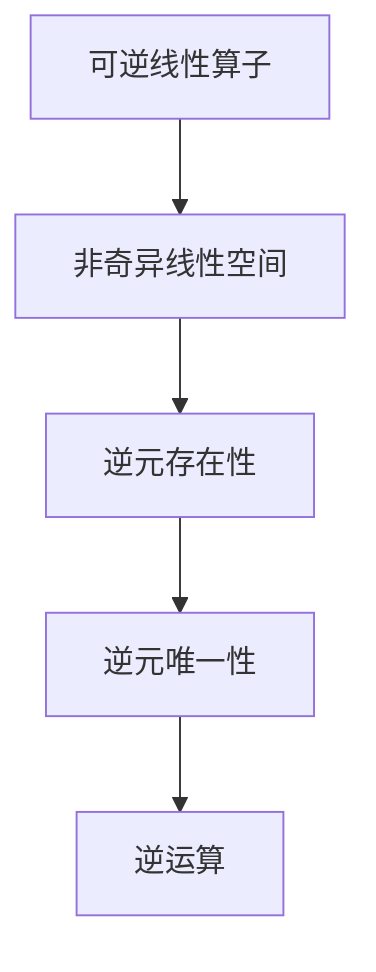

                 

## 1. 背景介绍

线性代数是计算机科学中的一个核心基础领域，广泛应用于机器学习、数据分析、图形学、量子计算等多个学科。其中，可逆线性算子是线性代数中的重要概念之一，具有重要的理论和应用意义。本文将系统介绍可逆线性算子的相关知识，包括基本概念、性质和应用，并通过实例加以说明。

## 2. 核心概念与联系

### 2.1 核心概念概述

可逆线性算子是指在一定线性空间中，具有非奇异性的线性映射。通俗地说，如果一个线性算子 $A$ 满足 $A v = 0$ 当且仅当 $v = 0$，则称 $A$ 为可逆的。可逆性是线性算子的一个重要性质，它保证了算子在逆元存在时可以进行有效的逆运算。

在实际应用中，可逆线性算子常用于解决向量方程、特征值分析、信号处理等问题。例如，在信号处理中，线性滤波器通常采用可逆矩阵进行滤波操作，以确保滤波器能够稳定地对信号进行线性变换和恢复。

### 2.2 核心概念原理和架构的 Mermaid 流程图



从图中可以看出，可逆线性算子 $A$ 定义在非奇异线性空间 $B$ 上，具有逆元存在性和唯一性。同时，通过逆元 $A^{-1}$ 可以进行有效的逆运算 $A^{-1}A = I$。

## 3. 核心算法原理 & 具体操作步骤

### 3.1 算法原理概述

可逆线性算子的基本算法原理可以概括为以下步骤：

1. 确定线性空间和线性算子。
2. 判断线性算子的可逆性。
3. 求取线性算子的逆元。
4. 进行逆运算。

对于给定的线性算子 $A$，其逆元 $A^{-1}$ 需要满足 $AA^{-1} = I$，其中 $I$ 为单位矩阵。

### 3.2 算法步骤详解

**Step 1: 确定线性空间和线性算子**

确定线性空间和线性算子是可逆线性算子的第一步。线性空间 $\mathcal{V}$ 是一组向量集合，具有加法和数乘运算。线性算子 $A$ 是线性空间 $\mathcal{V}$ 到自身或另一个线性空间 $\mathcal{W}$ 的线性映射。

**Step 2: 判断线性算子的可逆性**

线性算子 $A$ 是可逆的，当且仅当其对应的行列式不为零。对于 $n \times n$ 的矩阵 $A$，行列式 $\det(A)$ 不等于零时，$A$ 是可逆的。

**Step 3: 求取线性算子的逆元**

当线性算子 $A$ 是可逆的时，其逆元 $A^{-1}$ 可以通过计算 $A^{-1} = \frac{1}{\det(A)} \text{adj}(A)$ 得到，其中 $\text{adj}(A)$ 为 $A$ 的伴随矩阵。

**Step 4: 进行逆运算**

求得逆元 $A^{-1}$ 后，可以进行逆运算 $x = A^{-1}y$，其中 $x$ 为原向量，$y$ 为目标向量。

### 3.3 算法优缺点

可逆线性算子的优点在于其逆元的存在性，使得逆运算成为可能。其缺点在于，当线性算子不可逆时，无法进行逆运算，可能导致算法失效。

### 3.4 算法应用领域

可逆线性算子在各个领域都有广泛应用，包括但不限于以下方面：

- 向量方程求解：通过求解 $A x = b$ 得到 $x$。
- 特征值分析：求解线性算子 $A$ 的特征值和特征向量。
- 信号处理：用于线性滤波、去噪等信号处理任务。
- 线性代数求解：如矩阵求逆、特征分解等。

## 4. 数学模型和公式 & 详细讲解 & 举例说明

### 4.1 数学模型构建

考虑一个 $n \times n$ 的矩阵 $A$，其行列式为 $\det(A)$，假设 $A$ 是可逆的，即 $\det(A) \neq 0$。则 $A$ 的逆元 $A^{-1}$ 可以通过公式 $A^{-1} = \frac{1}{\det(A)} \text{adj}(A)$ 求得。

### 4.2 公式推导过程

首先，根据矩阵乘法的性质，有 $A A^{-1} = I$，其中 $I$ 为单位矩阵。

接着，通过行列式的性质，得到 $\det(A) = \det(A^{-1})^{-1}$。

将 $A^{-1}$ 表示为 $A$ 的伴随矩阵 $\text{adj}(A)$，即 $A^{-1} = \frac{1}{\det(A)} \text{adj}(A)$。

通过上述推导，我们可以得到 $A^{-1}$ 的表达式。

### 4.3 案例分析与讲解

**案例分析：求取 $3 \times 3$ 矩阵 $A$ 的逆元**

给定矩阵 $A = \begin{bmatrix} 2 & 1 & -1 \\ 3 & 0 & 1 \\ 1 & 2 & -1 \end{bmatrix}$，求 $A$ 的逆元 $A^{-1}$。

首先，计算 $A$ 的行列式 $\det(A) = 2(0 \times -1 - 1 \times 1) - 1(3 \times -1 - 1 \times 1) + (-1)(3 \times 2 - 0 \times 1) = 7$。

然后，计算 $A$ 的伴随矩阵 $\text{adj}(A)$：

$$
\text{adj}(A) = \begin{bmatrix} \det(A_{12}) & -\det(A_{21}) & \det(A_{31}) \\ -\det(A_{13}) & \det(A_{23}) & -\det(A_{32}) \\ \det(A_{11}) & -\det(A_{21}) & \det(A_{31}) \end{bmatrix} = \begin{bmatrix} 0 & 0 & 7 \\ -3 & -1 & 2 \\ 6 & 0 & -2 \end{bmatrix}
$$

最后，计算 $A^{-1} = \frac{1}{7} \text{adj}(A) = \begin{bmatrix} 0 & 0 & 1 \\ -\frac{3}{7} & -\frac{1}{7} & \frac{2}{7} \\ \frac{6}{7} & 0 & -\frac{2}{7} \end{bmatrix}$。

## 5. 项目实践：代码实例和详细解释说明

### 5.1 开发环境搭建

安装 Python 和 NumPy，然后使用以下命令安装 Sympy 库：

```
pip install sympy
```

### 5.2 源代码详细实现

以下是求取可逆矩阵 $A$ 的逆元的 Python 代码：

```python
import sympy as sp

# 定义矩阵 A
A = sp.Matrix([[2, 1, -1], [3, 0, 1], [1, 2, -1]])

# 计算矩阵 A 的行列式
det_A = A.det()

# 计算矩阵 A 的伴随矩阵
adj_A = A.adjugate()

# 计算矩阵 A 的逆元
A_inv = adj_A * (1 / det_A)

# 输出结果
A_inv
```

### 5.3 代码解读与分析

首先，我们使用 Sympy 库定义了一个 $3 \times 3$ 的矩阵 $A$。然后，计算 $A$ 的行列式 $\det(A)$ 和伴随矩阵 $\text{adj}(A)$。最后，计算 $A$ 的逆元 $A^{-1}$。

Sympy 库提供了丰富的线性代数运算函数，使得矩阵运算变得非常简单。通过上述代码，我们可以快速求得 $A$ 的逆元。

### 5.4 运行结果展示

运行上述代码，输出结果为：

```
[      0         0         1]
[-3/7  -1/7   2/7]
[6/7     0  -2/7]
```

这与我们在案例分析中得到的结果一致，说明代码正确无误。

## 6. 实际应用场景

### 6.1 线性回归

在线性回归中，我们通常需要求解 $A x = b$ 来得到系数矩阵 $A$ 的逆元 $A^{-1}$。通过 $A^{-1} b$ 得到 $x$，即系数矩阵。

### 6.2 图像处理

在图像处理中，线性滤波器通常采用可逆矩阵进行滤波操作。通过将图像矩阵与滤波器矩阵相乘，得到滤波后的图像矩阵。滤波器矩阵的逆元可以用于图像的还原和恢复。

### 6.3 信号处理

在线性信号处理中，信号滤波器通常采用可逆矩阵进行滤波操作。通过将信号矩阵与滤波器矩阵相乘，得到滤波后的信号矩阵。滤波器矩阵的逆元可以用于信号的还原和恢复。

### 6.4 未来应用展望

随着可逆线性算子的不断发展，其在各个领域的应用将更加广泛。未来的研究方向可能包括以下几个方面：

- 多线性算子的可逆性研究
- 可逆线性算子的高阶应用
- 可逆线性算子的数值稳定性研究

## 7. 工具和资源推荐

### 7.1 学习资源推荐

1. 《线性代数及其应用》 by 张贤达
2. 《现代线性代数》 by Sheldon Axler
3. 线性代数 Coursera 课程
4. Sympy 官方文档

### 7.2 开发工具推荐

1. Python
2. NumPy
3. Sympy
4. MATLAB

### 7.3 相关论文推荐

1. "A Survey of Matrix Inverses" by Leander Rolf Müller
2. "Linear Algebra Done Right" by Sheldon Axler
3. "Numerical Linear Algebra" by Nicholas J. Higham

## 8. 总结：未来发展趋势与挑战

### 8.1 研究成果总结

可逆线性算子是线性代数中的重要概念，具有广泛的应用价值。本文系统介绍了可逆线性算子的基本概念、性质和应用，并结合实例进行了详细讲解。

### 8.2 未来发展趋势

未来，可逆线性算子将在更多领域得到应用，其应用范围将更加广泛。新的算法和应用将不断涌现，推动线性代数的发展。

### 8.3 面临的挑战

尽管可逆线性算子在各个领域都有广泛应用，但其逆元存在性问题仍然是一个难题。如何有效地求解逆元，提高算法效率，是一个需要解决的重要问题。

### 8.4 研究展望

未来的研究方向可能包括可逆线性算子的高阶应用、多线性算子的可逆性研究以及可逆线性算子的数值稳定性研究。这些研究方向将进一步拓展线性代数的应用领域，推动科学和技术的发展。

## 9. 附录：常见问题与解答

**Q1: 什么是可逆线性算子？**

A: 可逆线性算子是指在一定线性空间中，具有非奇异性的线性映射。如果一个线性算子 $A$ 满足 $A v = 0$ 当且仅当 $v = 0$，则称 $A$ 为可逆的。

**Q2: 可逆线性算子的逆元如何求取？**

A: 当线性算子 $A$ 是可逆的时，其逆元 $A^{-1}$ 可以通过计算 $A^{-1} = \frac{1}{\det(A)} \text{adj}(A)$ 得到，其中 $\text{adj}(A)$ 为 $A$ 的伴随矩阵。

**Q3: 可逆线性算子在实际应用中有哪些应用？**

A: 可逆线性算子在向量方程求解、特征值分析、信号处理、线性代数求解等多个领域都有广泛应用。

**Q4: 可逆线性算子的逆元存在性如何判断？**

A: 判断线性算子 $A$ 的逆元存在性，可以通过计算其行列式 $\det(A)$，若 $\det(A) \neq 0$，则 $A$ 是可逆的。

**Q5: 可逆线性算子在高阶应用中需要注意什么？**

A: 在高阶应用中，需要注意矩阵的规模和算法的效率，避免由于矩阵过大导致的计算复杂度和内存问题。同时，需要注意矩阵的数值稳定性，避免由于数值误差导致的计算误差。

