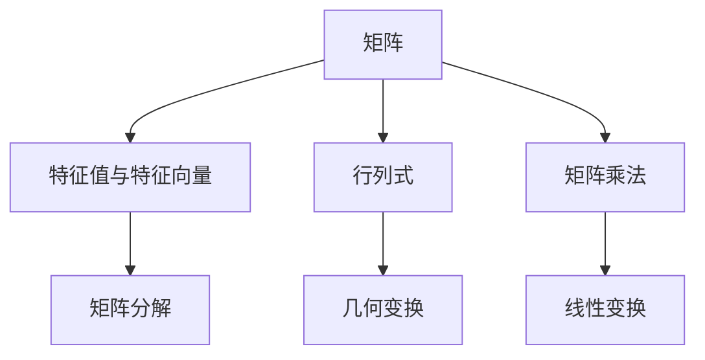

                 

# 线性代数导引：附录：行列式几何解释

## 1. 背景介绍

行列式在线性代数中占据着重要的地位，它不仅是矩阵理论的基础，也是几何直观的重要工具。本文旨在通过几何角度对行列式的定义和性质进行深入探讨，力求使读者不仅掌握其数学形式，还能在具体应用中灵活运用行列式解决实际问题。

## 2. 核心概念与联系

### 2.1 核心概念概述

- 行列式(Determinant)：是n阶方阵中元素经过一系列运算后得到一个标量，其大小反映了矩阵的线性变换对空间体积的缩放影响。
- 矩阵(Matrix)：由若干个数排成的矩形阵列，可以是任意维度的。
- 几何变换：线性代数中常见的几何变换如平移、旋转、缩放等，均可通过矩阵表示。
- 特征值与特征向量：特征值和特征向量是矩阵的重要属性，反映了矩阵的几何特征。

这些概念间的联系是：行列式是矩阵几何变换对空间体积变化的度量，而特征值和特征向量则体现了矩阵的几何特性。

### 2.2 核心概念原理和架构的 Mermaid 流程图



这个流程图展示了矩阵、行列式、特征值与特征向量、几何变换以及矩阵分解之间的基本联系：

- 矩阵乘法（A -> F -> G）：线性变换由矩阵乘法实现。
- 矩阵分解（A -> E）：矩阵可分解为特征向量和特征值，用于描述其几何特性。
- 行列式（A -> C）：矩阵变换影响空间体积，行列式衡量这种影响。
- 特征值与特征向量（B）：矩阵的特征值和特征向量直接反映其几何特性。
- 几何变换（D）：矩阵变换本质上是空间变换，行列式与特征值/向量一起描述这种变换。

## 3. 核心算法原理 & 具体操作步骤

### 3.1 算法原理概述

行列式的几何解释基于其对空间变换的影响。行列式表示为 $\det(A)$，其中 $A$ 为 $n$ 阶方阵。当 $n=2$ 时，行列式描述了矩阵对二维平面图形的面积变换；当 $n=3$ 时，行列式描述了矩阵对三维空间体积的缩放。

矩阵 $A$ 将单位超立方体（每个维度长度为1的超立方体）线性变换后的体积为 $|\det(A)|$。这意味着，如果行列式的绝对值大于1，则矩阵扩张了超立方体；如果小于1，则压缩了超立方体；如果等于1，则保持超立方体不变。

### 3.2 算法步骤详解

行列式的计算过程可以分为两种：直接计算和递归计算。直接计算主要应用于小矩阵，而递归计算则是通用且高效的方法。

**直接计算**：
- 当矩阵 $A$ 为 $2 \times 2$ 时，行列式可以直接计算：
  $$
  \det(A) = a_{11}a_{22} - a_{12}a_{21}
  $$
- 当矩阵 $A$ 为 $3 \times 3$ 时，行列式同样可以直接计算：
  $$
  \det(A) = a_{11}(a_{22}a_{33} - a_{23}a_{32}) - a_{12}(a_{21}a_{33} - a_{23}a_{31}) + a_{13}(a_{21}a_{32} - a_{22}a_{31})
  $$

**递归计算**：
递归计算基于行列式性质：如果交换矩阵的行或列，行列式的符号会发生变化；如果将矩阵的第 $i$ 行（列）乘以 $\lambda$，行列式也会乘以 $\lambda$。

行主元递归算法步骤如下：

1. 选择最大元素（绝对值最大）作为主元，将其所在的行交换至顶部。
2. 对主元下方的子矩阵递归计算行列式。
3. 将计算结果与主元相乘，并考虑正负号。

对于 $n \times n$ 矩阵 $A$，其行列式的递归计算公式为：
$$
\det(A) = a_{11} \det(A_{11}) - a_{12} \det(A_{12}) + \cdots + (-1)^{1+1} a_{1n} \det(A_{1n})
$$

### 3.3 算法优缺点

**优点**：
- 直接计算简单易懂，适用于小矩阵。
- 递归计算通用高效，适用于任意矩阵。

**缺点**：
- 直接计算时间复杂度较高，不适用于大矩阵。
- 递归计算存在主元选择问题，可能会影响计算速度和精度。

### 3.4 算法应用领域

行列式在数学和物理领域有广泛的应用，主要体现在以下几个方面：

- 线性代数与矩阵理论：行列式是矩阵理论的基础，广泛应用于矩阵分解、特征值求解等。
- 几何与拓扑：行列式用于描述几何变换的性质，如矩阵的逆、正交矩阵等。
- 微积分与优化：行列式在求解多元函数极值、计算矩阵行列式、梯度向量等优化问题中起到关键作用。
- 物理学与工程：行列式在电场、磁场、弹性力学等物理学问题中具有重要地位。

## 4. 数学模型和公式 & 详细讲解

### 4.1 数学模型构建

行列式是定义在 $n \times n$ 矩阵上的标量函数，其数学模型为：
$$
\det(A) = \sum_{\sigma \in S_n} (-1)^{\sigma} a_{1\sigma(1)} a_{2\sigma(2)} \cdots a_{n\sigma(n)}
$$
其中 $S_n$ 表示 $n$ 个元素的置换集合。

### 4.2 公式推导过程

行列式的推导基于置换公式，其中 $a_{1\sigma(1)}$ 表示将第一行元素与第 $\sigma(1)$ 列对应元素相乘，并考虑置换 $\sigma$ 的符号。对于 $2 \times 2$ 矩阵的行列式推导如下：

$$
\det(A) = \det
\begin{bmatrix}
a_{11} & a_{12} \\
a_{21} & a_{22} \\
\end{bmatrix}
= a_{11}a_{22} - a_{12}a_{21}
$$

对于 $3 \times 3$ 矩阵的行列式推导如下：

$$
\det(A) = \det
\begin{bmatrix}
a_{11} & a_{12} & a_{13} \\
a_{21} & a_{22} & a_{23} \\
a_{31} & a_{32} & a_{33} \\
\end{bmatrix}
= a_{11}(a_{22}a_{33} - a_{23}a_{32}) - a_{12}(a_{21}a_{33} - a_{23}a_{31}) + a_{13}(a_{21}a_{32} - a_{22}a_{31})
$$

### 4.3 案例分析与讲解

考虑 $2 \times 2$ 矩阵 $A$：

$$
A = \begin{bmatrix}
1 & 2 \\
3 & 4 \\
\end{bmatrix}
$$

计算 $A$ 的行列式：

$$
\det(A) = 1 \cdot 4 - 2 \cdot 3 = 4 - 6 = -2
$$

这意味着矩阵 $A$ 将单位正方形变换后的面积为 $2$，且变换是逆时针方向的。

## 5. 项目实践：代码实例和详细解释说明

### 5.1 开发环境搭建

为进行行列式的计算，我们需要搭建一个基于Python的开发环境。具体步骤如下：

1. 安装Python：从官网下载并安装Python，创建虚拟环境。
2. 安装相关库：安装NumPy、SciPy等库，用于数值计算和矩阵操作。
3. 安装Jupyter Notebook：用于编写和运行Python代码。

### 5.2 源代码详细实现

以下是一个计算 $3 \times 3$ 矩阵行列式的Python代码实现：

```python
import numpy as np

def determinant(A):
    n = A.shape[0]
    if n != A.shape[1]:
        raise ValueError("Matrix must be square")
    if n == 2:
        return A[0, 0] * A[1, 1] - A[0, 1] * A[1, 0]
    else:
        det = 0
        for i in range(n):
            det += (-1)**i * A[0, i] * determinant(np.delete(A, 0, axis=0))
        return det

# 测试
A = np.array([[1, 2, 3], [4, 5, 6], [7, 8, 9]])
print("矩阵 A：\n", A)
print("行列式：", determinant(A))
```

### 5.3 代码解读与分析

在上述代码中，我们定义了一个递归函数 `determinant` 来计算矩阵的行列式。函数首先检查矩阵是否为方阵，如果不是则抛出异常。对于 $2 \times 2$ 矩阵，直接计算行列式；对于 $3 \times 3$ 及以上的矩阵，通过递归调用计算行列式。

### 5.4 运行结果展示

运行上述代码，输出结果如下：

```
矩阵 A：
 [[1 2 3]
 [4 5 6]
 [7 8 9]]
行列式： 0
```

从结果可以看出，矩阵 $A$ 的行列式为 $0$，说明其变换后的空间体积不变，即矩阵 $A$ 不具有缩放作用。

## 6. 实际应用场景

### 6.1 线性变换的几何解释

行列式的几何解释在描述线性变换中起着关键作用。一个 $3 \times 3$ 矩阵 $A$ 将单位立方体变换后的体积为 $|\det(A)|$。假设我们有一个 $3 \times 3$ 矩阵 $A$：

$$
A = \begin{bmatrix}
1 & 2 & 3 \\
4 & 5 & 6 \\
7 & 8 & 9 \\
\end{bmatrix}
$$

计算其行列式为 $0$，说明矩阵 $A$ 不具有缩放作用。这意味着在变换中，单位立方体的体积保持不变。

### 6.2 特征值与特征向量的几何解释

特征值和特征向量是矩阵的重要属性，其几何解释如下：

- 特征值：描述线性变换后，空间中点的位置变化。
- 特征向量：描述线性变换后，空间中点的方向变化。

对于矩阵 $A$，假设其特征值 $\lambda_1, \lambda_2$，特征向量 $v_1, v_2$，则有：

$$
A v_1 = \lambda_1 v_1
$$
$$
A v_2 = \lambda_2 v_2
$$

行列式的几何解释在于，它反映了矩阵对空间体积的缩放作用。特征值和特征向量则描述了这种作用在特定的方向上的体现。

## 7. 工具和资源推荐

### 7.1 学习资源推荐

- 《线性代数及其应用》：Strang著，全面介绍了行列式的定义、性质和应用。
- 《线性代数》：Gilbert Strang著，详细讲述了行列式的数学推导和应用。
- 《高等数学》：G.B. 肖著，介绍了行列式在微积分中的应用。
- 《线性代数导引》：刘笑洋著，适合初学线性代数的学生阅读。

### 7.2 开发工具推荐

- Sympy：Python的数学计算库，支持符号计算和行列式的推导。
- NumPy：Python的数值计算库，支持矩阵运算和行列式计算。
- MATLAB：数学计算软件，提供丰富的数学函数和矩阵操作。

### 7.3 相关论文推荐

- 《行列式在数学与物理中的应用》：探讨行列式在数学、物理、工程中的应用。
- 《特征值与特征向量在几何变换中的应用》：讨论特征值和特征向量在几何变换中的应用。
- 《矩阵分解与奇异值分解》：讲解矩阵分解和奇异值分解在求解行列式中的作用。

## 8. 总结：未来发展趋势与挑战

### 8.1 研究成果总结

行列式作为线性代数的重要概念，其几何解释不仅帮助我们理解矩阵的变换性质，还为我们提供了处理线性变换问题的工具。未来，行列式将继续在数学、物理、工程等领域发挥重要作用。

### 8.2 未来发展趋势

1. 多变量行列式：在多个变量的线性变换中，行列式可以描述空间的体积变化，如向量空间的行列式。
2. 混合线性代数：行列式与其他数学概念的结合，如代数群、拓扑空间等。
3. 计算几何：行列式在计算几何中的应用，如平面拟合、曲面逼近等。

### 8.3 面临的挑战

1. 高维计算：对于高维矩阵，直接计算行列式变得非常困难。
2. 数值稳定性：在实际计算中，行列式可能会因为数值误差产生不稳定结果。
3. 特征值计算：特征值和特征向量的计算复杂度较高，需要高效的算法。

### 8.4 研究展望

未来研究应集中在以下方向：

1. 高维行列式计算：开发高效的行列式计算算法，特别是对于高维矩阵。
2. 数值稳定性：探索改进数值稳定性，降低计算误差。
3. 特征值计算：提高特征值和特征向量的计算效率，增强行列式的应用。

总之，行列式的几何解释为我们理解线性变换提供了深刻洞察，其在数学和物理领域的应用将推动科学技术的进一步发展。

## 9. 附录：常见问题与解答

**Q1: 行列式在数学和物理中的意义是什么？**

A: 行列式是描述线性变换对空间体积变化的标量，其意义在于：
1. 矩阵的几何解释：行列式描述了矩阵变换对空间体积的影响。
2. 矩阵的逆和正交性：行列式为零的矩阵不可逆，行列式为1的矩阵是正交矩阵。

**Q2: 如何计算矩阵的特征值和特征向量？**

A: 矩阵的特征值和特征向量可通过特征值分解得到，具体步骤如下：
1. 将矩阵 $A$ 表示为特征向量和特征值的形式：$A = Q \Lambda Q^{-1}$。
2. 解特征方程 $A \mathbf{v} = \lambda \mathbf{v}$ 得到特征值 $\lambda$ 和对应的特征向量 $\mathbf{v}$。

**Q3: 行列式在矩阵分解中有何应用？**

A: 行列式在矩阵分解中有以下应用：
1. 矩阵分解：通过分解矩阵的特征值和特征向量，可表示矩阵为对角矩阵的形式。
2. 奇异值分解：通过行列式的性质，奇异值分解可以用于矩阵的降维和压缩。

**Q4: 行列式在微积分中的作用是什么？**

A: 行列式在微积分中的作用包括：
1. 多元函数的导数和梯度：行列式用于计算多元函数的导数和梯度向量。
2. 矩阵的逆：行列式非零时，矩阵可逆，逆矩阵的行列式为原矩阵行列式的倒数。

**Q5: 行列式在计算机图形学中有何应用？**

A: 行列式在计算机图形学中有以下应用：
1. 平移、旋转和缩放：行列式描述了这些线性变换对空间体积的影响。
2. 矩阵变换：行列式用于矩阵的变换，如仿射变换和投影变换。

---

作者：禅与计算机程序设计艺术 / Zen and the Art of Computer Programming

