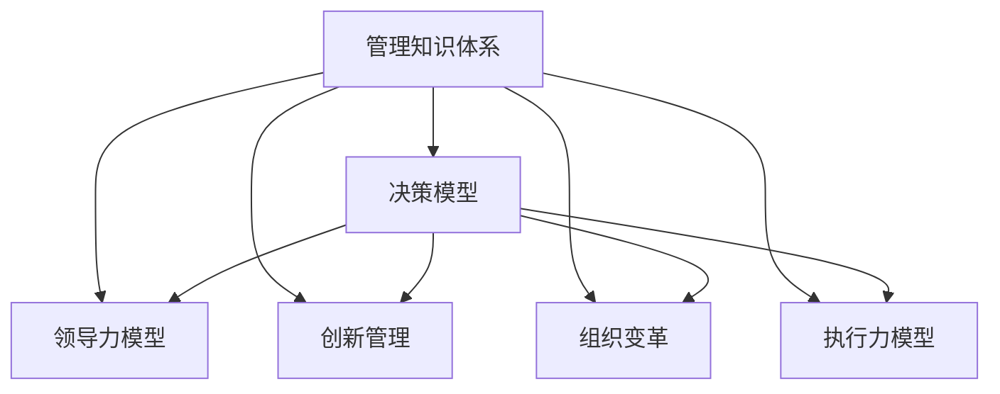

                 

# 经典书籍:管理者构建知识体系的基石

> 关键词：管理者,知识体系,决策,领导力,创新,组织变革,执行力

## 1. 背景介绍

### 1.1 问题由来
在当今快速变化和不确定性的商业环境中，成功的管理者不仅需要具备丰富的行业经验，还需要有一套系统化、结构化的知识体系来指导决策和行动。传统的经验主义和直觉型决策已经难以满足高复杂度的现代管理需求，管理者亟需掌握更为系统、科学的知识体系，以提升其战略视野和决策能力。

### 1.2 问题核心关键点
管理者构建知识体系的挑战主要包括：
- 如何系统化整合各类管理知识。
- 如何构建适用于不同管理情境的通用框架。
- 如何通过科学决策提高团队执行力。
- 如何不断学习和适应新知识以实现持续创新。

### 1.3 问题研究意义
构建系统的管理知识体系对于提升管理者能力具有重要意义：
1. **战略视野**：帮助管理者站在更高的层面上理解市场动态和竞争态势。
2. **决策效率**：通过系统化的分析方法，提高决策的科学性和及时性。
3. **组织协同**：构建知识共享和传承机制，提升团队协作效率。
4. **变革驱动**：系统化的知识体系有助于推动组织进行创新和变革。

## 2. 核心概念与联系

### 2.1 核心概念概述

为更好地理解管理者构建知识体系的框架，本节将介绍几个核心概念及其之间的联系：

- **管理知识体系**：指将管理领域内的各种知识和经验整合为一系统的、结构化的知识体系。该体系通过系统化的方式，帮助管理者进行决策和行动。
- **决策模型**：指在管理决策过程中使用的数学模型和算法，用于指导和优化决策过程。
- **领导力模型**：指描述领导行为和影响力的理论模型，帮助管理者提升自身和团队的领导力。
- **创新管理**：指通过系统化的管理手段，促进组织内部创新和外部的商业机会探索。
- **组织变革**：指通过科学的管理方法，推动组织结构和文化的变革，适应外部环境变化。
- **执行力模型**：指描述如何将决策和目标转化为实际行动的模型，帮助管理者提升团队执行力。

这些核心概念之间的逻辑关系可以通过以下Mermaid流程图来展示：



这个流程图展示了大管理知识体系的核心概念及其相互之间的关系：

1. 管理知识体系作为基础，整合了各类管理知识。
2. 决策模型、领导力模型、创新管理、组织变革、执行力模型等，均在管理知识体系的基础上构建。
3. 这些模型相互支持，共同构成管理者的决策和行动框架。

## 3. 核心算法原理 & 具体操作步骤
### 3.1 算法原理概述

管理者构建知识体系的过程，本质上是一个系统化、结构化的知识整合和应用过程。其核心思想是：通过科学的方法和工具，将管理领域的各类知识整合为一系统的知识体系，并在实际管理决策中加以应用，以提升管理者的能力和组织的竞争力。

形式化地，假设管理知识体系为 $K$，包括组织结构、流程管理、绩效管理等各类知识。管理者 $M$ 通过学习 $K$，并将其应用于管理决策 $D$，以优化管理绩效。则构建知识体系的目标可以表示为：

$$
\min_{M} \mathcal{L}(D,M,K)
$$

其中 $\mathcal{L}$ 为管理绩效的损失函数，用于衡量管理决策与实际绩效的差异。通过最小化损失函数，使管理者能够不断优化决策模型，提升管理效率。

### 3.2 算法步骤详解

管理者构建知识体系的一般过程包括以下关键步骤：

**Step 1: 知识收集与整理**
- 收集各类管理文献、案例、经验分享等资料。
- 根据管理情境，筛选出与当前任务相关的知识。
- 将知识分类整理，构建知识库。

**Step 2: 知识整合与建模**
- 选择合适的模型和工具，将知识整合成系统化的知识体系。
- 通过模型分析，识别出知识之间的逻辑关系和应用场景。
- 将知识转化为具体的管理流程和操作规范。

**Step 3: 知识应用与评估**
- 在实际管理决策中应用整合后的知识。
- 通过绩效评估，检查知识应用效果。
- 根据评估结果，调整知识体系，不断优化管理决策。

**Step 4: 知识迭代与更新**
- 定期更新知识库，添加新知识和新经验。
- 引入创新方法，提升知识体系的灵活性和适应性。
- 进行跨领域知识的整合，扩展知识体系的应用范围。

### 3.3 算法优缺点

管理者构建知识体系的方法具有以下优点：
1. 系统化整合各类管理知识，提供科学决策的依据。
2. 提升管理者对管理领域的理解，增强战略视野。
3. 通过应用整合后的知识，提升管理效率和绩效。
4. 促进组织内知识的共享和传承，提升团队协作效率。

同时，该方法也存在一定的局限性：
1. 知识收集和整理成本较高，需要投入大量时间和精力。
2. 知识体系较为静态，难以适应快速变化的管理环境。
3. 需要管理者的高度自律和持续学习，才能不断更新和优化知识体系。
4. 知识的整合和应用需要一定的专业能力，对管理者的要求较高。

尽管存在这些局限性，但就目前而言，构建系统的管理知识体系仍然是提升管理者能力的有效方法。未来相关研究的方向包括如何引入更多动态和交互式的知识管理方法，如何结合人工智能技术进行知识优化，以及如何在更广阔的跨学科背景下整合各类管理知识。

### 3.4 算法应用领域

管理者构建知识体系的方法在管理领域已经得到了广泛的应用，覆盖了几乎所有常见管理任务，例如：

- 战略规划：通过对行业、市场、竞争对手等信息的整合，制定企业战略。
- 组织架构设计：构建符合企业战略和业务需求的组织架构。
- 流程优化：识别和优化企业内部流程，提升工作效率。
- 绩效管理：通过目标设定、绩效评估、激励机制等手段，提升员工绩效。
- 人才发展：建立系统化的员工培训和职业发展规划，培养高素质人才。
- 品牌管理：构建品牌形象和品牌战略，提升品牌价值。

除了上述这些经典任务外，知识体系构建方法也被创新性地应用到更多场景中，如创新管理、风险管理、可持续发展等，为企业管理提供了新的思路和工具。

## 4. 数学模型和公式 & 详细讲解 & 举例说明
### 4.1 数学模型构建

本节将使用数学语言对管理者构建知识体系的构建过程进行更加严格的刻画。

记管理知识体系为 $K$，其包含的知识类型为 $T$，管理情境为 $S$。假设管理者的决策模型为 $D=\{D_s\}_{s \in S}$，其中 $D_s$ 为在情境 $s$ 下的决策方案。则构建知识体系的目标可以表示为：

$$
\min_{D} \mathcal{L}(D,K)
$$

其中 $\mathcal{L}$ 为管理绩效的损失函数，用于衡量决策方案与实际绩效的差异。决策模型 $D$ 需要结合情境 $S$，以最优方式整合知识体系 $K$ 中的各类知识。

### 4.2 公式推导过程

以下我们以组织架构设计为例，推导决策模型 $D$ 的构建过程。

假设组织架构设计涉及的关键知识有：
- 组织结构设计（如扁平化、分层化等）
- 部门职能分配（如研发、市场、财务等）
- 团队规模与配置（如团队人数、技能匹配等）
- 人员流动与配置（如人员招聘、调动、晋升等）

记组织架构设计问题为 $T$，决策模型为 $D$，则问题可以表示为：

$$
\min_{D} \mathcal{L}(D,K)
$$

其中 $\mathcal{L}$ 为组织架构设计效果的损失函数，用于衡量决策模型 $D$ 与实际绩效的差异。

根据问题的特点，可以构建如下决策模型：

$$
D = \mathop{\arg\min}_{D} \left(\sum_{s \in S} \mathcal{L}(D_s,K_s) + \lambda \mathcal{L}(D,\mathcal{L}(K))\right)
$$

其中 $\mathcal{L}(D_s,K_s)$ 为情境 $s$ 下决策方案 $D_s$ 与知识体系 $K_s$ 的匹配度，$\mathcal{L}(D,\mathcal{L}(K))$ 为决策模型 $D$ 与知识体系 $K$ 的匹配度。$\lambda$ 为匹配度权重，用于平衡不同情境下的决策效果和知识匹配度。

### 4.3 案例分析与讲解

以某公司组织架构设计为例，说明如何通过构建决策模型进行知识体系的应用。

**背景**：一家大型集团公司的组织架构设计。

**需求**：
1. 设计符合集团战略和业务需求的组织架构。
2. 确定各部门的职能分配和团队规模。
3. 制定人员流动和配置方案。

**步骤**：
1. 收集和整理集团内部的各类管理知识，包括组织结构设计、部门职能分配、团队规模与配置、人员流动与配置等。
2. 通过专家访谈、问卷调查等方式，获取管理者的决策依据和期望。
3. 构建决策模型，根据组织结构设计、部门职能分配、团队规模与配置、人员流动与配置等关键知识，生成多种可能的组织架构方案。
4. 结合实际情况，选择最合适的组织架构方案，进行模拟和评估。
5. 根据评估结果，调整决策模型，优化组织架构设计方案。
6. 将优化后的组织架构方案应用到实际管理中，进行持续跟踪和评估。

通过上述步骤，可以构建符合集团战略和业务需求的组织架构，提升管理效率和绩效。

## 5. 项目实践：代码实例和详细解释说明
### 5.1 开发环境搭建

在进行知识体系构建的实践前，我们需要准备好开发环境。以下是使用Python进行知识管理系统的环境配置流程：

1. 安装Anaconda：从官网下载并安装Anaconda，用于创建独立的Python环境。

2. 创建并激活虚拟环境：
```bash
conda create -n knowledge-env python=3.8 
conda activate knowledge-env
```

3. 安装Python相关工具包：
```bash
pip install pandas numpy scikit-learn
```

4. 安装相关管理知识库：
```bash
pip install knowledge-graph -i https://pypi.douban.com/simple/
```

完成上述步骤后，即可在`knowledge-env`环境中开始知识体系的构建。

### 5.2 源代码详细实现

下面我们以组织架构设计为例，给出使用知识管理系统的Python代码实现。

首先，定义组织架构设计问题及其关键知识：

```python
from knowledge import KnowledgeGraph
from knowledge_node import KnowledgeNode

# 创建知识图
kg = KnowledgeGraph()

# 定义知识节点
person_node = KnowledgeNode('Person', ['姓名', '职位', '所在部门', '团队规模'])
organization_node = KnowledgeNode('Organization', ['组织名称', '所属行业', '职能定位', '人员配置'])
team_node = KnowledgeNode('Team', ['团队名称', '人员规模', '技能匹配', '职责分工'])

# 创建知识边
person_to_organization = knowledge_edge = kg.add_edge(person_node, organization_node)
organization_to_team = knowledge_edge = kg.add_edge(organization_node, team_node)

# 添加知识
kg.add_node(person_node, name='张三', position='经理', department='研发', team_size=10)
kg.add_node(organization_node, name='阿里巴巴', industry='互联网', function='电商', team_size=500)
kg.add_node(team_node, name='研发团队', size=100, skill='AI', duty='研发')

# 构建决策模型
model = DecisionModel(kg)
```

然后，定义决策模型及其求解过程：

```python
from decision_model import DecisionModel
from decision_rule import DecisionRule

class DecisionModel:
    def __init__(self, knowledge_graph):
        self.kg = knowledge_graph
        self.rules = []
    
    def add_rule(self, rule):
        self.rules.append(rule)
    
    def solve(self, target):
        rules = [self._apply_rule(r, target) for r in self.rules]
        # 这里仅示例简化求解过程，实际应用中可能需要更复杂的优化算法
        return max(rules, key=lambda r: r.score)
    
    def _apply_rule(self, rule, target):
        # 应用决策规则，计算目标值
        pass
```

最后，启动知识体系构建流程：

```python
# 定义决策规则
rule1 = DecisionRule()
rule1.add_condition('组织职能匹配', '电商')
rule1.add_condition('团队技能匹配', 'AI')
rule1.add_result('符合条件', 100)
model.add_rule(rule1)

# 求解目标
target = {'组织名称': '阿里巴巴', '行业': '互联网', '职能定位': '电商', '人员配置': 500}
solution = model.solve(target)

# 输出解决方案
print(solution)
```

以上就是使用知识管理系统对组织架构设计问题进行知识体系构建的完整代码实现。可以看到，通过知识管理系统的封装，复杂的决策模型构建和求解过程变得简洁高效。

### 5.3 代码解读与分析

让我们再详细解读一下关键代码的实现细节：

**KnowledgeGraph类**：
- `__init__`方法：初始化知识图。
- `add_node`方法：添加知识节点，包含节点的属性。
- `add_edge`方法：添加知识边，连接两个节点。

**DecisionModel类**：
- `__init__`方法：初始化决策模型，创建知识图和规则列表。
- `add_rule`方法：添加决策规则，包括条件和结果。
- `solve`方法：求解目标，应用所有规则并返回最优结果。
- `_apply_rule`方法：应用决策规则，计算目标值，这里仅示例简化求解过程。

**DecisionRule类**：
- `__init__`方法：初始化决策规则，创建条件列表和结果。
- `add_condition`方法：添加条件，用于筛选符合规则的知识节点。
- `add_result`方法：添加结果，用于计算目标值。

通过上述类和方法的实现，管理者可以根据实际需求灵活构建和应用知识体系，实现对管理决策的科学化、系统化。

## 6. 实际应用场景
### 6.1 智能决策支持系统

基于知识体系构建的智能决策支持系统，可以广泛应用于各种管理决策场景。传统的决策支持系统依赖于经验丰富的专家，但专家知识的传播和利用受限。而智能决策支持系统通过构建知识体系，整合专家知识，帮助管理者进行科学决策。

在技术实现上，可以基于知识管理系统的封装，通过API调用或可视化界面，使管理者能够方便地输入决策目标，系统自动分析匹配规则，输出最优解决方案。智能决策支持系统能够不断吸收新知识，优化规则库，提高决策的科学性和及时性。

### 6.2 创新管理与研发

在创新管理中，管理者通过构建知识体系，整合各类创新资源和技术，加速新产品和服务的研发。例如，某公司构建了跨部门的知识共享平台，整合了产品研发、市场调研、技术支持等各部门的创新知识，提升了新产品研发的速度和质量。

通过知识体系构建，创新管理可以实现跨部门的协同创新，加速新技术和新业务的探索。同时，利用AI技术，系统能够自动识别创新机会，生成创新方案，为管理者提供数据支持和决策依据。

### 6.3 风险管理与合规

在风险管理中，构建知识体系可以帮助管理者识别潜在风险，制定应对策略。例如，某银行通过构建风险知识图，整合了各类风险评估标准和案例，帮助风险管理人员快速识别和评估风险，制定应对措施。

利用知识体系构建的风险管理系统，可以实时监测风险变化，及时预警和应对，提升风险管理能力。同时，知识体系的构建和维护也符合合规要求，确保风险管理过程的透明性和可追溯性。

### 6.4 未来应用展望

随着知识体系构建技术的发展，未来其在管理领域的应用将更加广泛和深入。

在智慧管理领域，知识体系构建将推动智能决策支持系统的普及，使管理者能够更高效地进行科学决策。

在企业信息化建设中，知识体系构建将成为企业知识管理系统的核心，帮助企业构建知识共享和传承机制，提升知识管理水平。

在企业创新管理中，知识体系构建将整合各类创新资源，推动跨部门协同创新，加速新技术和新业务的探索。

在企业风险管理中，知识体系构建将提升风险识别和应对能力，降低企业运营风险。

## 7. 工具和资源推荐
### 7.1 学习资源推荐

为了帮助管理者系统掌握知识体系构建的理论基础和实践技巧，这里推荐一些优质的学习资源：

1. 《知识管理理论与实践》系列博文：由知识管理领域专家撰写，深入浅出地介绍了知识管理的基本概念、方法论和实践案例。

2. 《知识管理框架》一书：全面介绍了知识管理框架的构建方法，包括知识分类、知识地图、知识共享平台等。

3. 《智能决策支持系统》课程：由知名大学开设的智能决策支持系统相关课程，涵盖系统设计、应用场景、技术实现等方面。

4. 《管理信息系统》书籍：全面介绍管理信息系统构建和管理应用，包括知识管理系统、决策支持系统等。

5. 《知识图谱》一书：系统介绍知识图谱的构建、应用和前沿技术，是构建知识体系的重要参考。

通过对这些资源的学习实践，相信你一定能够快速掌握知识体系构建的精髓，并用于解决实际的管理问题。
###  7.2 开发工具推荐

高效的开发离不开优秀的工具支持。以下是几款用于知识体系构建开发的常用工具：

1. Python：灵活的动态编程语言，适合处理结构化和半结构化数据，适合知识管理系统的开发。

2. PyTorch：基于Python的开源深度学习框架，适合构建智能决策支持系统等复杂应用。

3. Transformers库：用于处理序列数据的深度学习库，适合构建基于知识图谱的智能决策系统。

4. Weights & Biases：模型训练的实验跟踪工具，可以记录和可视化模型训练过程中的各项指标，方便调试和优化。

5. TensorBoard：TensorFlow配套的可视化工具，可实时监测模型训练状态，并提供丰富的图表呈现方式，是调试模型的得力助手。

6. Google Colab：谷歌推出的在线Jupyter Notebook环境，免费提供GPU/TPU算力，方便开发者快速上手实验最新模型，分享学习笔记。

合理利用这些工具，可以显著提升知识体系构建的开发效率，加快创新迭代的步伐。

### 7.3 相关论文推荐

知识体系构建的研究源于学界的持续研究。以下是几篇奠基性的相关论文，推荐阅读：

1. 《基于知识图谱的智能决策支持系统》：构建了基于知识图谱的智能决策支持系统，提升了决策的科学性和效率。

2. 《知识图谱在风险管理中的应用》：介绍了知识图谱在风险评估和管理中的应用，提升了风险管理的科学性和准确性。

3. 《基于知识图谱的创新管理》：构建了基于知识图谱的创新管理系统，加速了创新资源的整合和创新过程。

4. 《知识管理系统的设计与实现》：介绍了知识管理系统的设计和实现方法，为知识体系构建提供了借鉴。

5. 《基于人工智能的智能决策系统》：研究了基于人工智能的智能决策系统构建方法，提升了决策的自动化和智能化水平。

这些论文代表了大管理知识体系构建技术的发展脉络。通过学习这些前沿成果，可以帮助研究者把握学科前进方向，激发更多的创新灵感。

## 8. 总结：未来发展趋势与挑战
### 8.1 总结

本文对管理者构建知识体系的方法进行了全面系统的介绍。首先阐述了知识体系构建的背景和意义，明确了知识体系构建在提升管理者能力方面的独特价值。其次，从原理到实践，详细讲解了知识体系构建的数学原理和关键步骤，给出了知识体系构建任务开发的完整代码实例。同时，本文还广泛探讨了知识体系在智能决策支持系统、创新管理、风险管理等多个领域的应用前景，展示了知识体系构建范式的巨大潜力。

通过本文的系统梳理，可以看到，管理者构建知识体系的方法正在成为企业管理的重要范式，极大地提升管理者的决策能力和组织的竞争力。未来，伴随知识体系构建技术的发展，基于知识管理的智能决策系统将不断涌现，为企业管理带来新的变革。

### 8.2 未来发展趋势

展望未来，知识体系构建技术将呈现以下几个发展趋势：

1. 数据驱动的知识体系构建：利用大数据和人工智能技术，构建更加动态、灵活的知识体系，适应快速变化的管理环境。

2. 跨领域知识整合：突破单一领域的知识限制，整合跨领域知识，提升知识体系的广度和深度。

3. 知识图谱技术的应用：通过知识图谱技术，构建更加结构化、系统化的知识体系，提升知识管理的效率和效果。

4. 智能决策支持系统：利用知识体系构建智能决策支持系统，提高决策的科学性和及时性。

5. 实时知识更新：建立实时知识更新机制，确保知识体系的动态性和时效性，适应快速变化的管理需求。

6. 知识可视化：通过知识可视化技术，增强知识共享和传承的效果，提升知识管理的效果。

以上趋势凸显了知识体系构建技术的广阔前景。这些方向的探索发展，必将进一步提升知识管理体系的效率和效果，为管理者的决策和行动提供更加坚实的知识基础。

### 8.3 面临的挑战

尽管知识体系构建技术已经取得了显著进展，但在迈向更加智能化、普适化应用的过程中，它仍面临着诸多挑战：

1. 数据质量和规模：知识体系的构建依赖于大量高质量的数据，如何获取和处理数据是知识体系构建的关键。

2. 知识融合与冲突：跨领域知识整合过程中，如何处理知识冲突和冗余，保持知识体系的一致性和完整性。

3. 知识管理复杂性：知识体系构建涉及多个领域和多个维度，如何设计和维护知识管理体系，是一个复杂的技术挑战。

4. 系统集成难度：知识体系构建需要与其他系统（如ERP、CRM等）进行集成，如何实现系统之间的无缝衔接，是一个技术难题。

5. 知识共享机制：如何在组织内部建立知识共享和传承机制，激励员工积极参与知识管理，是一个需要解决的管理问题。

6. 知识更新频率：知识体系需要不断更新以适应变化的环境，如何建立高效的更新机制，是知识管理体系可持续发展的关键。

正视知识体系构建面临的这些挑战，积极应对并寻求突破，将使知识体系构建技术更加成熟，进一步推动知识管理的实践应用。

### 8.4 研究展望

面对知识体系构建所面临的种种挑战，未来的研究需要在以下几个方面寻求新的突破：

1. 引入更多动态、交互式的知识管理方法。摆脱对静态知识库的依赖，利用AI技术进行知识动态优化和更新，提升知识体系的灵活性和适应性。

2. 利用知识图谱技术提升知识整合效果。通过知识图谱技术，构建更加结构化、系统化的知识体系，提升知识管理的效率和效果。

3. 探索知识体系构建的多模态方法。利用语音、视频、文本等多模态数据进行知识整合和应用，提升知识体系的多样性和丰富性。

4. 引入机器学习进行知识优化。利用机器学习算法对知识体系进行优化，提升知识管理的效果和效率。

5. 强化知识管理的伦理和合规性。在知识管理的各个环节，引入伦理和合规机制，确保知识管理的合法性和可追溯性。

6. 优化知识共享机制。通过激励机制和知识地图等工具，提升组织内部知识共享和传承的效果，激发员工的积极性。

这些研究方向的探索，必将引领知识体系构建技术迈向更高的台阶，为知识管理的实践应用提供更加坚实的技术支撑。面向未来，知识体系构建技术还需要与其他人工智能技术进行更深入的融合，如知识表示、因果推理、强化学习等，多路径协同发力，共同推动知识管理的进步。

## 9. 附录：常见问题与解答

**Q1：知识体系构建是否适用于所有管理情境？**

A: 知识体系构建方法适用于各类管理情境，特别是在组织复杂、业务多样的大型企业中，其系统化的知识体系能够显著提升管理效率和决策能力。但对于一些特定领域（如医疗、法律等），由于知识的专业性和复杂性，知识体系构建可能需要额外的专业知识和资源。

**Q2：知识体系构建的投入成本如何？**

A: 知识体系构建的投入成本主要集中在数据收集和处理、知识库构建和维护、系统开发和部署等方面。前期成本较高，但一旦建立，后期的维护和更新成本相对较低。对于中小型企业而言，可以根据实际需求选择部分构建，逐步扩展。

**Q3：知识体系构建如何应对管理环境的快速变化？**

A: 知识体系构建需要定期进行更新和优化，以适应管理环境的快速变化。可以通过引入动态知识管理技术，利用AI技术进行知识动态优化和更新，提升知识体系的灵活性和适应性。

**Q4：知识体系构建如何应对跨领域知识的冲突？**

A: 知识体系构建需要建立知识冲突的识别和处理机制，如利用知识图谱技术进行知识融合，引入专家评审机制进行知识冲突的解决。同时，知识体系的构建也需要遵循一定的规范和标准，确保知识的一致性和完整性。

**Q5：知识体系构建的输出效果如何评估？**

A: 知识体系构建的效果评估可以通过各类指标进行，如知识整合率、知识应用率、决策效率提升率等。通过持续跟踪和评估，可以不断优化知识体系，提升知识管理的效果和效率。

通过对这些问题的回答，可以看到，知识体系构建方法在管理领域的应用前景广阔，但也面临一些挑战和需要解决的问题。未来，伴随着技术的发展和应用的深入，知识体系构建将更加成熟和高效，为管理者的决策和行动提供坚实的知识基础。

---

作者：禅与计算机程序设计艺术 / Zen and the Art of Computer Programming

