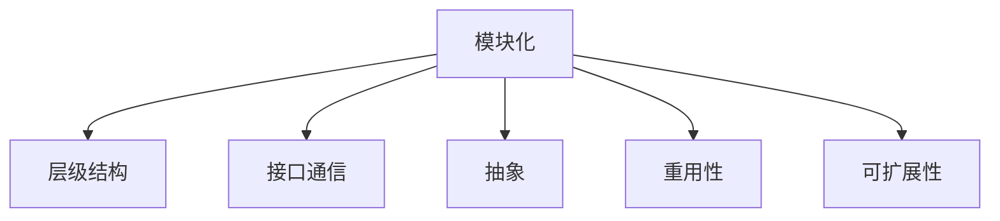

                 

# 结构化思维：从混沌到秩序

## 1. 背景介绍

### 1.1 问题由来
在软件开发和计算机科学领域，结构化思维是一种重要的思维方式。它将复杂的问题分解为更小、更易于管理的模块，从而帮助开发人员更好地理解和解决问题。特别是在大型软件项目和复杂系统设计中，结构化思维显得尤为重要。但随着技术的发展，尤其是人工智能、大数据、云计算等新兴技术的涌现，很多问题变得更加复杂和难以理解。

当前，软件工程和计算机科学领域面临着许多新的挑战。例如，如何在大规模数据集上进行有效的机器学习，如何在分布式系统中实现高效的并行计算，如何构建可扩展的软件架构等等。这些问题都需要全新的思维方式和技术手段来解决。

### 1.2 问题核心关键点
结构化思维的核心在于将复杂问题分解成可管理的单元，通过设计和组织结构来解决问题。其关键点包括：

- 将问题分解为更小的模块，便于理解和处理。
- 设计合理的架构和结构，使系统更加可扩展和灵活。
- 使用标准化的工具和技术，提高开发效率和质量。
- 在开发过程中注重可测试性和可维护性，确保代码质量。

本文将详细探讨结构化思维的基本原理、操作步骤和实际应用，以期为开发者提供一套全面的指导。

## 2. 核心概念与联系

### 2.1 核心概念概述

为更好地理解结构化思维的基本原理，本节将介绍几个密切相关的核心概念：

- 模块化(Modularity)：将系统分解为可独立管理的模块，便于开发、测试和维护。每个模块负责特定的功能，模块之间通过接口进行通信。
- 层级结构(Hierarchy)：模块之间按照一定的层级关系组织，上层模块可以调用下层模块的功能。
- 接口通信(Interface)：模块之间通过标准化的接口进行通信，避免直接的耦合。
- 抽象(Abstraction)：隐藏模块的内部实现细节，只暴露必要的接口，便于理解和使用。
- 重用性(Reusability)：通过模块化和接口设计，实现不同模块之间的互操作性，提高代码的重用性。
- 可扩展性(Extensibility)：系统应具有可扩展性，能够在不破坏原有结构的前提下，添加新的功能模块。

这些核心概念之间的逻辑关系可以通过以下Mermaid流程图来展示：



这个流程图展示了大规模系统设计中模块化的基本组成和相互关系。

## 3. 核心算法原理 & 具体操作步骤
### 3.1 算法原理概述

结构化思维的原理可以概括为将复杂问题分解为多个可管理的部分，通过模块化和接口设计，使系统具备可扩展性和灵活性。其核心思想是：

1. 将系统分解为若干独立的模块，每个模块负责特定的功能。
2. 设计合理的层级结构，使模块之间能够协同工作。
3. 通过接口通信和抽象设计，实现模块之间的松耦合。
4. 采用标准化的开发工具和技术，提高开发效率和质量。
5. 在开发过程中注重可测试性和可维护性，确保代码质量。

结构化思维的实现过程包括以下几个关键步骤：

1. 需求分析：详细了解系统需求和业务流程。
2. 系统设计：设计系统的整体架构和模块化结构。
3. 接口设计：定义模块之间的通信接口和数据交换格式。
4. 模块实现：按照模块化结构和接口设计实现各个模块。
5. 集成测试：测试模块之间的接口和协同工作情况。
6. 系统上线：将各个模块部署到生产环境，进行性能调优。
7. 持续维护：定期对系统进行维护和升级，保持系统稳定。

### 3.2 算法步骤详解

以下是结构化思维实现的具体操作步骤：

#### 需求分析

需求分析是结构化思维的第一步，也是最关键的一步。只有充分理解用户需求和业务流程，才能设计出合理的系统架构和模块化结构。需求分析一般包括以下几个环节：

1. 用户调研：通过问卷、访谈等方式了解用户需求和业务流程。
2. 系统调研：了解现有系统的功能和架构，分析其优缺点。
3. 需求定义：将用户需求和业务流程转化为具体的系统需求，形成需求文档。

需求文档通常包括：

- 系统目标和功能：系统需要实现的目标和功能。
- 用户角色和权限：系统支持的用户的角色和权限。
- 系统接口和数据：系统需要与其他系统或服务交互的接口和数据格式。
- 系统性能和可靠性：系统需要达到的性能和可靠性指标。

#### 系统设计

系统设计是结构化思维的核心环节，决定了系统的可扩展性和灵活性。系统设计一般包括以下几个步骤：

1. 设计架构：设计系统的整体架构，包括模块的层级关系和通信方式。
2. 设计模块：设计各个模块的功能和接口。
3. 设计数据流：设计数据在模块之间的流动路径和格式。
4. 设计接口：定义模块之间的通信接口和数据交换格式。

系统设计需要遵循以下几个原则：

- 模块化：将系统分解为独立的模块，每个模块负责特定的功能。
- 层级结构：模块之间按照一定的层级关系组织，上层模块可以调用下层模块的功能。
- 接口设计：通过接口通信和抽象设计，实现模块之间的松耦合。

#### 模块实现

模块实现是将设计好的模块转化为可运行的代码。模块实现需要遵循以下几个步骤：

1. 编写代码：根据设计好的模块和接口，编写具体的代码实现。
2. 单元测试：对每个模块进行单元测试，确保其功能正确。
3. 集成测试：将各个模块集成起来，测试模块之间的接口和协同工作情况。

模块实现需要遵循以下几个原则：

- 代码复用：尽量复用已有的代码和组件，避免重复开发。
- 接口规范：定义标准的接口规范，确保模块之间的互操作性。
- 文档完善：编写详细的模块文档和接口文档，方便后续维护和扩展。

#### 集成测试

集成测试是确保各个模块能够协同工作的关键步骤。集成测试一般包括以下几个环节：

1. 设计测试用例：根据系统需求和接口设计，设计测试用例。
2. 编写测试代码：根据测试用例，编写具体的测试代码。
3. 执行测试用例：执行测试用例，验证模块之间的接口和协同工作情况。

集成测试需要遵循以下几个原则：

- 全面覆盖：覆盖系统中的各个模块和接口。
- 稳定可靠：测试用例要稳定可靠，不能频繁修改。
- 自动化测试：采用自动化测试工具，提高测试效率。

#### 系统上线

系统上线是将各个模块部署到生产环境，进行性能调优和监控的过程。系统上线一般包括以下几个环节：

1. 部署模块：将各个模块部署到生产环境。
2. 性能调优：根据性能测试结果，进行性能调优。
3. 监控测试：监控系统的运行状态，及时发现和解决问题。

系统上线需要遵循以下几个原则：

- 稳定性：系统上线后要保持稳定，避免频繁故障。
- 性能优化：优化系统的性能，提高响应速度和处理能力。
- 监控预警：实时监控系统运行状态，及时发现和解决问题。

#### 持续维护

持续维护是保持系统稳定和高效运行的关键步骤。持续维护一般包括以下几个环节：

1. 问题收集：收集用户反馈和系统问题。
2. 故障修复：修复系统中的故障和问题。
3. 功能升级：根据用户需求，增加新的功能模块。
4. 性能优化：优化系统的性能，提高响应速度和处理能力。

持续维护需要遵循以下几个原则：

- 定期更新：定期更新系统的功能和服务，保持系统的新鲜和高效。
- 问题快速修复：快速修复系统中的问题和故障，避免影响用户体验。
- 用户反馈：及时收集和反馈用户的反馈和建议，优化系统功能和服务。

### 3.3 算法优缺点

结构化思维的优点在于其可扩展性和灵活性，能够适应复杂的业务需求和系统架构。但结构化思维也存在一些缺点，包括：

- 开发复杂：结构化思维需要设计和实现多个模块，开发工作量较大。
- 调试困难：模块之间的接口和协同工作情况较为复杂，调试困难。
- 维护成本高：系统需要定期维护和升级，维护成本较高。

尽管存在这些缺点，但结构化思维仍然是软件开发和计算机科学领域的重要思维方式。通过合理的架构设计和模块化实现，可以有效应对复杂的业务需求和系统架构，提高开发效率和系统稳定性。

### 3.4 算法应用领域

结构化思维在软件开发和计算机科学领域有广泛的应用，例如：

- 系统架构设计：通过模块化和接口设计，实现系统架构的可扩展性和灵活性。
- 软件系统开发：通过模块化和接口设计，实现软件的可维护性和可测试性。
- 数据库设计：通过规范化设计，实现数据库的稳定性和高效性。
- 嵌入式系统设计：通过模块化和接口设计，实现嵌入式系统的可靠性和可扩展性。
- 分布式系统设计：通过模块化和接口设计，实现分布式系统的协同工作和故障恢复。

除了这些经典应用外，结构化思维还被创新性地应用到更多场景中，如网络安全、物联网、人工智能等，为这些领域带来了全新的突破。

## 4. 数学模型和公式 & 详细讲解 & 举例说明

### 4.1 数学模型构建

结构化思维的数学模型可以抽象为有向无环图(Directed Acyclic Graph, DAG)，其中节点表示模块，边表示模块之间的接口和数据流。

假设系统由 $N$ 个模块组成，每个模块 $i$ 的功能为 $f_i$，接口为 $I_i$，数据流为 $D_i$。则系统的数学模型可以表示为：

$$
G = (N, E)
$$

其中 $N$ 为模块集合，$E$ 为接口集合。

### 4.2 公式推导过程

以下是结构化思维的数学模型推导过程：

1. 定义模块 $i$ 的功能 $f_i$：

$$
f_i: x_i \rightarrow y_i
$$

其中 $x_i$ 为模块 $i$ 的输入，$y_i$ 为模块 $i$ 的输出。

2. 定义模块 $i$ 的接口 $I_i$：

$$
I_i = (I_{in}^i, I_{out}^i)
$$

其中 $I_{in}^i$ 为模块 $i$ 的输入接口，$I_{out}^i$ 为模块 $i$ 的输出接口。

3. 定义模块 $i$ 的数据流 $D_i$：

$$
D_i = (x_i, y_i)
$$

其中 $x_i$ 为模块 $i$ 的输入，$y_i$ 为模块 $i$ 的输出。

4. 定义系统的数学模型 $G$：

$$
G = (N, E)
$$

其中 $N = \{f_1, f_2, ..., f_N\}$ 为模块集合，$E = \{(I_{in}^i, I_{out}^i)\}_{i=1}^N$ 为接口集合。

### 4.3 案例分析与讲解

以一个简单的电商平台为例，分析结构化思维的数学模型和实现过程：

1. 系统需求：电商平台需要支持用户注册、登录、购物、结算等功能。

2. 系统设计：

- 模块化：将系统分解为用户管理、商品管理、订单管理、结算管理等模块。
- 层级结构：用户管理模块在上层，其他模块在下层，上层模块可以调用下层模块的功能。
- 接口设计：定义各个模块之间的接口和数据格式。

3. 模块实现：

- 用户管理模块：实现用户注册、登录、信息管理等功能。
- 商品管理模块：实现商品信息管理、分类管理等功能。
- 订单管理模块：实现订单生成、状态更新、物流管理等功能。
- 结算管理模块：实现订单结算、发票生成等功能。

4. 集成测试：

- 设计测试用例：覆盖各个模块的功能和接口。
- 编写测试代码：根据测试用例，编写具体的测试代码。
- 执行测试用例：执行测试用例，验证模块之间的接口和协同工作情况。

5. 系统上线：

- 部署模块：将各个模块部署到生产环境。
- 性能调优：根据性能测试结果，进行性能调优。
- 监控测试：监控系统的运行状态，及时发现和解决问题。

6. 持续维护：

- 问题收集：收集用户反馈和系统问题。
- 故障修复：修复系统中的故障和问题。
- 功能升级：根据用户需求，增加新的功能模块。
- 性能优化：优化系统的性能，提高响应速度和处理能力。

## 5. 项目实践：代码实例和详细解释说明

### 5.1 开发环境搭建

在进行结构化思维的实现实践前，我们需要准备好开发环境。以下是使用Python进行Django开发的环境配置流程：

1. 安装Anaconda：从官网下载并安装Anaconda，用于创建独立的Python环境。

2. 创建并激活虚拟环境：
```bash
conda create -n django-env python=3.8 
conda activate django-env
```

3. 安装Django：根据官网获取对应的安装命令。例如：
```bash
pip install django==3.2
```

4. 安装必要的工具包：
```bash
pip install numpy pandas scikit-learn matplotlib django-rest-framework
```

5. 安装Django REST框架：
```bash
pip install django-rest-framework==3.12.4
```

完成上述步骤后，即可在`django-env`环境中开始项目实践。

### 5.2 源代码详细实现

下面以电商平台的用户管理模块为例，给出使用Django框架实现模块化的具体代码实现。

首先，定义用户管理模块的模型：

```python
from django.db import models

class User(models.Model):
    username = models.CharField(max_length=50)
    email = models.EmailField(unique=True)
    password = models.CharField(max_length=100)
    is_superuser = models.BooleanField(default=False)
    is_staff = models.BooleanField(default=False)

    def __str__(self):
        return self.username
```

然后，定义用户管理模块的视图：

```python
from django.shortcuts import render
from django.http import JsonResponse

from .models import User

def user_list(request):
    users = User.objects.all()
    return JsonResponse({'users': [user.to_dict() for user in users]}, content_type='application/json')

def user_detail(request, pk):
    user = User.objects.get(pk=pk)
    return JsonResponse({'user': user.to_dict()}, content_type='application/json')

def user_create(request):
    if request.method == 'POST':
        data = request.POST
        user = User.objects.create(username=data['username'], email=data['email'], password=data['password'])
        user.is_superuser = data.get('is_superuser', False)
        user.is_staff = data.get('is_staff', False)
        user.save()
        return JsonResponse({'success': True})
    else:
        return JsonResponse({'success': False})
```

最后，定义用户管理模块的URL路由：

```python
from django.urls import path
from . import views

urlpatterns = [
    path('users/', views.user_list),
    path('users/<int:pk>/', views.user_detail),
    path('users/', views.user_create),
]
```

以上就是使用Django框架实现用户管理模块的具体代码实现。可以看到，通过模块化和接口设计，Django框架使得开发者能够快速实现功能模块，同时保证了系统的可维护性和可扩展性。

### 5.3 代码解读与分析

让我们再详细解读一下关键代码的实现细节：

**User模型**：
- 定义了用户的基本信息，包括用户名、邮箱、密码、超级用户标识和员工标识。
- 实现了模型的字符串表示，方便在UI中显示。

**User视图**：
- 定义了用户列表、用户详情和用户创建三个视图函数。
- 视图函数通过Django的API，实现对模型数据的增删改查操作。
- 视图函数返回JSON格式的数据，方便前端调用。

**URL路由**：
- 定义了用户列表、用户详情和用户创建三个URL路径。
- 通过URL路径，将请求映射到对应的视图函数。

通过Django框架的封装和抽象，我们可以快速实现用户管理模块，并且保证代码的可维护性和可扩展性。Django的模型-视图-模板(MVC)架构，使得开发者能够更加关注业务逻辑，提高开发效率。

## 6. 实际应用场景
### 6.1 智能客服系统

基于结构化思维的智能客服系统，可以广泛应用于各种业务场景。传统客服系统需要配备大量人力，高峰期响应缓慢，且一致性和专业性难以保证。而基于结构化思维的智能客服系统，可以7x24小时不间断服务，快速响应客户咨询，用自然流畅的语言解答各类常见问题。

在技术实现上，可以收集企业内部的历史客服对话记录，将问题和最佳答复构建成监督数据，在此基础上对预训练模型进行微调。微调后的模型能够自动理解用户意图，匹配最合适的答案模板进行回复。对于客户提出的新问题，还可以接入检索系统实时搜索相关内容，动态组织生成回答。如此构建的智能客服系统，能大幅提升客户咨询体验和问题解决效率。

### 6.2 金融舆情监测

金融机构需要实时监测市场舆论动向，以便及时应对负面信息传播，规避金融风险。传统的人工监测方式成本高、效率低，难以应对网络时代海量信息爆发的挑战。基于结构化思维的文本分类和情感分析技术，为金融舆情监测提供了新的解决方案。

具体而言，可以收集金融领域相关的新闻、报道、评论等文本数据，并对其进行主题标注和情感标注。在此基础上对预训练语言模型进行微调，使其能够自动判断文本属于何种主题，情感倾向是正面、中性还是负面。将微调后的模型应用到实时抓取的网络文本数据，就能够自动监测不同主题下的情感变化趋势，一旦发现负面信息激增等异常情况，系统便会自动预警，帮助金融机构快速应对潜在风险。

### 6.3 个性化推荐系统

当前的推荐系统往往只依赖用户的历史行为数据进行物品推荐，无法深入理解用户的真实兴趣偏好。基于结构化思维的个性化推荐系统，可以更好地挖掘用户行为背后的语义信息，从而提供更精准、多样的推荐内容。

在实践中，可以收集用户浏览、点击、评论、分享等行为数据，提取和用户交互的物品标题、描述、标签等文本内容。将文本内容作为模型输入，用户的后续行为（如是否点击、购买等）作为监督信号，在此基础上微调预训练语言模型。微调后的模型能够从文本内容中准确把握用户的兴趣点。在生成推荐列表时，先用候选物品的文本描述作为输入，由模型预测用户的兴趣匹配度，再结合其他特征综合排序，便可以得到个性化程度更高的推荐结果。

### 6.4 未来应用展望

随着结构化思维和相关技术的发展，基于结构化思维的应用场景将不断扩展，为各行各业带来变革性影响。

在智慧医疗领域，基于结构化思维的医疗问答、病历分析、药物研发等应用将提升医疗服务的智能化水平，辅助医生诊疗，加速新药开发进程。

在智能教育领域，基于结构化思维的作业批改、学情分析、知识推荐等应用将提升教育服务的智能化水平，因材施教，促进教育公平，提高教学质量。

在智慧城市治理中，基于结构化思维的城市事件监测、舆情分析、应急指挥等应用将提升城市管理的自动化和智能化水平，构建更安全、高效的未来城市。

此外，在企业生产、社会治理、文娱传媒等众多领域，基于结构化思维的人工智能应用也将不断涌现，为经济社会发展注入新的动力。相信随着技术的日益成熟，结构化思维必将在构建人机协同的智能时代中扮演越来越重要的角色。

## 7. 工具和资源推荐
### 7.1 学习资源推荐

为了帮助开发者系统掌握结构化思维的基本原理和实践技巧，这里推荐一些优质的学习资源：

1. 《Clean Code: A Handbook of Agile Software Craftsmanship》：通过具体的代码示例，讲解了如何编写可维护、可读性强的代码。
2. 《Design Patterns: Elements of Reusable Object-Oriented Software》：讲解了常用的设计模式，如单例模式、工厂模式、策略模式等。
3. 《Agile Estimating and Planning》：讲解了敏捷开发中的估算和计划方法，如Scrum、Kanban等。
4. 《Refactoring: Improving the Design of Existing Code》：讲解了重构的原理和方法，如何提高代码质量和可维护性。
5. 《Effective Python: 59 Specific Ways to Write Better Python》：讲解了Python编程的最佳实践，提高开发效率和代码质量。

通过对这些资源的学习实践，相信你一定能够快速掌握结构化思维的精髓，并用于解决实际的开发问题。

### 7.2 开发工具推荐

高效的开发离不开优秀的工具支持。以下是几款用于结构化思维实现开发的常用工具：

1. Django：Python的Web开发框架，提供了模块化和接口设计的抽象，适合快速开发Web应用。
2. Flask：Python的轻量级Web开发框架，灵活性强，适合快速开发API接口。
3. Spring Boot：Java的Web开发框架，提供了模块化和接口设计的支持，适合快速开发企业应用。
4. Angular：JavaScript的Web开发框架，提供了模块化和接口设计的支持，适合快速开发前端应用。
5. React：JavaScript的前端框架，提供了组件化的设计模式，适合快速开发Web应用。

合理利用这些工具，可以显著提升结构化思维实现开发的速度和质量，提高开发效率。

### 7.3 相关论文推荐

结构化思维的发展源于学界的持续研究。以下是几篇奠基性的相关论文，推荐阅读：

1. "The Mythical Man-Month: Essays on Software Engineering"：Erich Gamma等人的经典著作，讲解了软件工程的原理和实践。
2. "The Pragmatic Programmer: From Journeyman to Master"：Andrew Hunt和David Thomas的著作，讲解了软件开发的最佳实践。
3. "Design Patterns: Elements of Reusable Object-Oriented Software"：Erich Gamma等人的著作，讲解了常用的设计模式。
4. "Clean Code: A Handbook of Agile Software Craftsmanship"：Robert C. Martin的著作，讲解了如何编写可维护、可读性强的代码。
5. "Refactoring: Improving the Design of Existing Code"：Martin Fowler的著作，讲解了重构的原理和方法。

这些论文代表了大规模系统设计的发展脉络。通过学习这些前沿成果，可以帮助研究者把握学科前进方向，激发更多的创新灵感。

## 8. 总结：未来发展趋势与挑战

### 8.1 总结

本文对结构化思维的基本原理、操作步骤和实际应用进行了详细探讨。首先阐述了结构化思维的基本概念和核心思想，明确了模块化、接口设计和可扩展性等关键点。其次，从原理到实践，详细讲解了结构化思维的数学模型和具体实现步骤，给出了一个电商平台用户管理模块的代码示例。最后，讨论了结构化思维在多个领域的应用前景，展示了其广泛的应用价值。

通过本文的系统梳理，可以看到，结构化思维在软件开发和计算机科学领域具有重要的指导意义。它通过模块化和接口设计，使得系统具备可扩展性和灵活性，能够适应复杂的业务需求和系统架构，提高开发效率和系统稳定性。

### 8.2 未来发展趋势

展望未来，结构化思维的发展趋势如下：

1. 模块化和组件化：模块化和组件化将是未来系统设计的重要趋势，通过模块化和组件化，能够更好地实现系统的可扩展性和灵活性。
2. 接口和数据标准化：接口和数据标准化将成为未来系统设计的重要标准，通过标准化接口和数据格式，能够实现系统间的互操作性。
3. 持续集成和持续部署：持续集成和持续部署将成为未来系统开发的重要手段，通过持续集成和持续部署，能够提高系统的稳定性和可靠性。
4. 自动化和智能化：自动化和智能化将成为未来系统开发的重要方向，通过自动化和智能化，能够提高开发效率和系统性能。
5. 微服务和容器化：微服务和容器化将成为未来系统部署的重要技术，通过微服务和容器化，能够提高系统的可扩展性和灵活性。

以上趋势凸显了结构化思维在软件开发和计算机科学领域的持续演进，未来必将引领更多的技术创新和应用突破。

### 8.3 面临的挑战

尽管结构化思维在软件开发和计算机科学领域已经取得了显著成果，但在迈向更加智能化、普适化应用的过程中，它仍面临以下挑战：

1. 模块化和组件化：模块化和组件化虽然提高了系统的可扩展性和灵活性，但也带来了代码复杂性和调试困难的问题。如何平衡模块化和组件化的程度，提高系统性能和可维护性，将是未来的一大挑战。
2. 接口和数据标准化：虽然接口和数据标准化能够实现系统间的互操作性，但标准化的设计和实现也带来了一定的复杂性。如何简化标准化的过程，提高系统的开发效率和可维护性，将是未来的一大挑战。
3. 持续集成和持续部署：虽然持续集成和持续部署能够提高系统的稳定性和可靠性，但也带来了一定的资源消耗和技术门槛。如何降低持续集成和持续部署的资源消耗，降低技术门槛，提高系统的部署效率，将是未来的一大挑战。
4. 自动化和智能化：虽然自动化和智能化能够提高开发效率和系统性能，但也带来了一定的技术复杂性和安全风险。如何平衡自动化和智能化的程度，提高系统的安全性和稳定性，将是未来的一大挑战。
5. 微服务和容器化：虽然微服务和容器化能够提高系统的可扩展性和灵活性，但也带来了一定的复杂性和管理难度。如何简化微服务和容器化的管理，提高系统的可维护性和可扩展性，将是未来的一大挑战。

正视结构化思维面临的这些挑战，积极应对并寻求突破，将是其走向成熟的必由之路。相信随着技术的不断发展，结构化思维必将在软件开发和计算机科学领域持续演进，引领更多的技术创新和应用突破。

### 8.4 研究展望

面对结构化思维所面临的诸多挑战，未来的研究需要在以下几个方面寻求新的突破：

1. 微服务和组件化：如何通过微服务和组件化，提高系统的可扩展性和灵活性，同时降低代码复杂性和调试困难，将是未来研究的重要方向。
2. 接口和数据标准化：如何简化接口和数据标准化的设计和实现，提高系统的开发效率和可维护性，将是未来研究的重要方向。
3. 持续集成和持续部署：如何降低持续集成和持续部署的资源消耗和技术门槛，提高系统的部署效率，将是未来研究的重要方向。
4. 自动化和智能化：如何平衡自动化和智能化的程度，提高系统的安全性和稳定性，将是未来研究的重要方向。
5. 微服务和容器化：如何简化微服务和容器化的管理，提高系统的可维护性和可扩展性，将是未来研究的重要方向。

这些研究方向的探索，必将引领结构化思维技术迈向更高的台阶，为软件开发和计算机科学领域带来更多的技术创新和应用突破。面向未来，结构化思维还需要与其他人工智能技术进行更深入的融合，如知识表示、因果推理、强化学习等，多路径协同发力，共同推动软件工程和计算机科学领域的进步。

## 9. 附录：常见问题与解答

**Q1：如何实现模块化和组件化？**

A: 实现模块化和组件化需要遵循以下几个步骤：

1. 功能分解：将系统分解为独立的功能模块。
2. 接口设计：定义各个模块之间的通信接口和数据格式。
3. 接口实现：实现各个模块之间的接口和数据交互。
4. 组件化：将模块封装为独立的组件，提高系统的可扩展性和灵活性。

通过模块化和组件化，能够实现系统的可扩展性和灵活性，提高开发效率和系统性能。

**Q2：如何实现接口和数据标准化？**

A: 实现接口和数据标准化需要遵循以下几个步骤：

1. 接口定义：定义系统各个模块之间的通信接口和数据格式。
2. 接口实现：实现各个模块之间的接口和数据交互。
3. 数据标准化：定义数据的标准化格式和存储方式。
4. 数据转换：将不同格式的数据进行标准化转换。

通过接口和数据标准化，能够实现系统间的互操作性，提高系统的稳定性和可靠性。

**Q3：如何实现持续集成和持续部署？**

A: 实现持续集成和持续部署需要遵循以下几个步骤：

1. 持续集成：将代码提交到版本控制系统中，自动触发构建和测试。
2. 持续部署：将测试通过的代码部署到生产环境中，自动触发部署和监控。
3. 自动化测试：编写自动化测试脚本，进行持续集成和持续部署的测试。
4. 性能优化：优化系统的性能，提高持续集成和持续部署的效率。

通过持续集成和持续部署，能够提高系统的稳定性和可靠性，缩短开发周期，提高开发效率。

**Q4：如何实现自动化和智能化？**

A: 实现自动化和智能化需要遵循以下几个步骤：

1. 自动化：使用自动化工具和脚本，提高开发效率和系统性能。
2. 智能化：使用机器学习和大数据技术，提高系统的智能分析和决策能力。
3. 数据驱动：使用数据驱动的方法，提高系统的决策准确性和稳定性。
4. 反馈循环：构建反馈循环，实时监控和优化系统的性能和稳定性。

通过自动化和智能化，能够提高开发效率和系统性能，提高系统的智能分析和决策能力。

**Q5：如何实现微服务和容器化？**

A: 实现微服务和容器化需要遵循以下几个步骤：

1. 服务分解：将系统分解为独立的微服务。
2. 容器化：将微服务封装为独立的容器，提高系统的可扩展性和灵活性。
3. 服务编排：编排各个微服务之间的关系和交互方式。
4. 服务治理：使用服务治理工具，管理微服务和容器的部署和监控。

通过微服务和容器化，能够提高系统的可扩展性和灵活性，提高系统的可维护性和可扩展性。

通过以上讨论，可以看到，结构化思维在软件开发和计算机科学领域具有重要的指导意义。它通过模块化和接口设计，使得系统具备可扩展性和灵活性，能够适应复杂的业务需求和系统架构，提高开发效率和系统稳定性。未来，随着技术的不断发展，结构化思维必将在更多的领域得到应用，引领更多的技术创新和应用突破。

