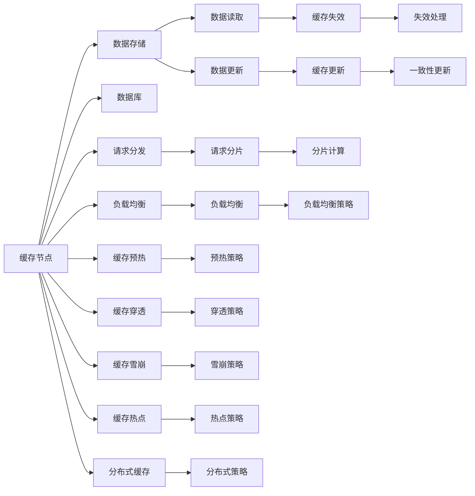

                 

## 1. 背景介绍

### 1.1 问题由来
在互联网和移动互联网时代，数据的增长速度和处理需求呈指数级增长，这对系统的性能和可扩展性提出了严峻挑战。传统的单体系统难以满足日益增长的负载需求，分布式系统的出现为这一问题提供了有效的解决途径。而分布式系统中的缓存技术，则成为支撑高吞吐量应用的基石。

### 1.2 问题核心关键点
缓存技术在高吞吐量应用中扮演着至关重要的角色。其核心关键点包括：
- **数据的存储与检索**：缓存通过将频繁访问的数据存储在近内存位置，大幅提升数据的访问速度。
- **分布式系统的协同**：缓存能够分担数据库负载，提高系统的并行处理能力。
- **数据一致性和可靠性**：缓存需要与数据库保持良好的协同，确保数据的最终一致性。
- **系统延迟和吞吐量的优化**：缓存通过减少数据库的直接访问次数，降低系统延迟，提升吞吐量。
- **成本与效率的平衡**：缓存需要在成本和效率之间做出合理取舍。

缓存技术的合理应用，对于提升分布式系统的整体性能和稳定性具有重大意义。

### 1.3 问题研究意义
研究缓存技术在高吞吐量应用中的高效应用，对于提升分布式系统的性能，降低系统延迟，优化资源利用率，具有重要的理论和实际意义：

1. **性能提升**：通过缓存技术，可以显著提升系统的访问速度，缩短响应时间，提升用户体验。
2. **可扩展性增强**：缓存分担了数据库的直接读写压力，使数据库系统的扩展更加灵活。
3. **资源优化**：缓存能够减少对CPU和磁盘等硬件资源的直接占用，优化系统整体资源使用效率。
4. **成本降低**：合理的缓存设计，可以减少对昂贵的高性能硬件依赖，降低系统成本。
5. **可靠性保障**：缓存通过与数据库的双向更新机制，提高了系统的故障容忍度和数据可靠性。

## 2. 核心概念与联系

### 2.1 核心概念概述
- **缓存(Cache)**：一种存储数据结构，用于提高数据访问速度，减少系统延迟。
- **缓存失效(Cache Invalidation)**：由于数据更新或系统状态变化，缓存中的数据变得不再有效，需要重新获取更新数据。
- **缓存一致性(Cache Consistency)**：确保缓存和数据库中的数据一致，避免数据冗余和冲突。
- **缓存预热(Cache Warming)**：在系统启动或访问频繁之前，预先加载缓存，提高数据访问效率。
- **缓存穿透(Cache Penetration)**：缓存中不存在的key直接穿透缓存，导致系统性能下降。
- **缓存雪崩(Cache Miss)**：大量缓存同时失效，导致系统性能大幅下降，甚至宕机。
- **缓存热点(Cache Hotspot)**：由于局部性原理，部分缓存区域访问频率远高于其他区域，导致性能瓶颈。
- **分布式缓存(Distributed Cache)**：通过多个缓存节点协同工作，实现缓存的分布式管理和负载均衡。

这些核心概念之间存在紧密的联系，共同构成了缓存技术在高吞吐量应用中的理论基础。

### 2.2 核心概念原理和架构的 Mermaid 流程图



这个流程图展示了缓存系统的工作原理和关键架构：
1. 请求首先经过负载均衡器（E）进行分发。
2. 缓存节点（A）根据请求读取或更新数据。
3. 缓存节点通过数据存储（B）或数据库（C）读取更新数据。
4. 缓存节点处理缓存失效（H）和缓存更新（I），确保数据一致性。
5. 缓存节点提供数据读取（F）和数据更新（G）服务。
6. 负载均衡器根据请求分发情况进行负载均衡（K）。
7. 缓存节点实施缓存预热（L）、穿透策略（M）、雪崩策略（N）和热点策略（O），提升系统性能。
8. 缓存节点通过分布式缓存（P）实现数据分散存储和管理。

通过理解这些核心概念及其相互联系，可以更好地把握缓存技术在高吞吐量应用中的实现机制。

## 3. 核心算法原理 & 具体操作步骤

### 3.1 算法原理概述
缓存技术在高吞吐量应用中的核心算法原理，主要基于缓存一致性和缓存失效的机制。其基本原理是通过将频繁访问的数据存储在缓存中，提高数据访问速度，同时确保缓存和数据库的数据一致性。

缓存算法分为两种：
- **直接映射(Invalidation Cache)**：将缓存分为多个区，每个区对应一个数据库表或一个数据块。当某个区中的数据失效时，需要更新整个区中的数据。
- **虚拟映射(Indirect Cache)**：使用哈希表或LRU算法维护缓存数据，当某个缓存失效时，只需要更新对应的数据项。

### 3.2 算法步骤详解

**步骤1：数据存储和检索**
- 选择合适的缓存算法（如LRU、LFU、ARC等）。
- 对数据进行分片，选择合适的存储介质（如内存、SSD等）。
- 将数据存储到缓存节点中，并建立索引以便快速检索。

**步骤2：缓存一致性维护**
- 使用乐观锁或悲观锁保证缓存和数据库的数据一致性。
- 实现缓存失效和更新机制，如使用TTL（Time to Live）、LFU（Least Frequently Used）等算法。
- 设置缓存的失效时间或频率，确保缓存数据的及时更新。

**步骤3：缓存失效和更新**
- 当缓存失效时，从数据库中读取数据，并更新缓存。
- 实现分布式缓存一致性算法，如2PC（两阶段提交）、3PC（三阶段提交）等。
- 监控缓存节点的健康状态，及时处理失效节点。

**步骤4：缓存预热**
- 在系统启动或访问频繁之前，预先加载热点数据到缓存中，提高数据访问效率。
- 根据历史数据访问情况，预测热点数据，预先加载到缓存中。
- 设置预热策略，如定时预热、基于访问频率预热等。

### 3.3 算法优缺点
缓存技术的优点：
- **提高数据访问速度**：缓存将频繁访问的数据存储在近内存位置，大幅提升数据访问速度。
- **降低系统延迟**：通过缓存技术，减少对数据库的直接访问次数，降低系统延迟。
- **提升吞吐量**：缓存分担了数据库的直接读写压力，提升系统并行处理能力，提高吞吐量。
- **优化资源使用**：缓存能够减少对CPU和磁盘等硬件资源的直接占用，优化系统整体资源使用效率。

缓存技术的缺点：
- **数据一致性问题**：缓存和数据库的数据不一致，可能导致数据冗余和冲突。
- **缓存失效管理复杂**：缓存失效的管理复杂，需要考虑缓存失效的频率和时机。
- **缓存穿透问题**：缓存中不存在的key直接穿透缓存，导致系统性能下降。
- **缓存雪崩问题**：大量缓存同时失效，导致系统性能大幅下降，甚至宕机。
- **缓存热点问题**：部分缓存区域访问频率远高于其他区域，导致性能瓶颈。

### 3.4 算法应用领域

缓存技术广泛应用于各种高吞吐量应用中，例如：
- 电商平台的商品详情页缓存：提高商品详情页的加载速度，提升用户体验。
- 社交媒体的动态消息缓存：缓存热门动态消息，提高数据访问速度，减少服务器负载。
- 视频流服务的缓存：缓存视频数据片段，提高视频播放速度，提升用户体验。
- 在线教育的课堂录制缓存：缓存课堂录制数据，提高播放速度，提升课堂体验。
- 新闻门户的头条新闻缓存：缓存热门新闻，提高新闻加载速度，提升用户粘性。

## 4. 数学模型和公式 & 详细讲解 & 举例说明

### 4.1 数学模型构建
假设缓存系统中有$N$个缓存节点，每个节点的缓存容量为$C$，总容量为$NC$。每个缓存节点的访问频率分布遵循一定规律，假设频率为$f_i$，$i=1,2,...,N$。

**LRU算法**：
- 当缓存满了时，淘汰最近最少使用的缓存数据。
- 访问频率越高的数据，越不容易被淘汰。

**LFU算法**：
- 当缓存满了时，淘汰访问频率最低的缓存数据。
- 访问频率越高的数据，越不容易被淘汰。

**ARC算法**：
- 当缓存满了时，淘汰最近最少使用的缓存数据，同时保留一部分访问频率高的数据。

### 4.2 公式推导过程
设$t_i$为第$i$个缓存数据的访问时间，$T$为缓存失效时间或更新时间。访问频率$f_i$定义为：

$$
f_i = \frac{1}{\sum_{j=1}^N \frac{1}{t_j-T}}
$$

设$C_i$为第$i$个缓存数据的缓存容量，访问频率为$f_i$，访问时间序列为$(t_1, t_2, ..., t_N)$。在$t$时刻访问第$i$个缓存数据时，其剩余容量为：

$$
C'_i = C_i - \max(0, \min(f_i, \frac{C_i}{t-t_{max}}))
$$

其中$t_{max}$为当前时间。

**LRU算法**：
- 当$t_{max}$时刻，访问频率最高的数据保留在缓存中，剩余容量为$C_i - f_i$。
- 当$t_{max}$时刻，访问频率次高的数据保留在缓存中，剩余容量为$C_i - f_{i-1}$。

**LFU算法**：
- 当$t_{max}$时刻，访问频率最高的数据保留在缓存中，剩余容量为$C_i - 1$。
- 当$t_{max}$时刻，访问频率次高的数据保留在缓存中，剩余容量为$C_i - 1$。

**ARC算法**：
- 当$t_{max}$时刻，访问频率最高的数据保留在缓存中，剩余容量为$C_i - kf_i$。
- 当$t_{max}$时刻，访问频率次高的数据保留在缓存中，剩余容量为$C_i - kf_{i-1}$。

### 4.3 案例分析与讲解
**案例1：电商平台的商品详情页缓存**
- 假设电商平台的商品详情页数据量为$D$，每个缓存节点的缓存容量为$C=50MB$。
- 每个商品详情页的访问频率为$f=0.1$次/秒。
- 缓存失效时间为$T=30秒$。
- 采用LRU算法进行缓存管理。

首先计算每个缓存节点的最大容量：

$$
NC = 10 \times 50MB = 500MB
$$

根据公式，计算每个缓存节点的剩余容量：

$$
C'_i = C - \max(0, \min(f_i, \frac{C}{t-t_{max}}))
$$

假设$t_{max}=10秒$，计算每个缓存节点的剩余容量：

$$
C'_1 = 50 - \max(0, \min(0.1, \frac{50}{10-0})) = 50MB
$$

$$
C'_2 = 50 - \max(0, \min(0.1, \frac{50}{10-10})) = 49.5MB
$$

因此，第1个缓存节点保留1个商品详情页数据，第2个缓存节点保留0.5个商品详情页数据。

**案例2：视频流服务的缓存**
- 假设视频流服务的缓存容量为$C=1GB$，每个视频的访问频率为$f=0.01$次/秒。
- 缓存失效时间为$T=60秒$。
- 采用LFU算法进行缓存管理。

首先计算每个缓存节点的最大容量：

$$
NC = 1 \times 1GB = 1GB
$$

根据公式，计算每个缓存节点的剩余容量：

$$
C'_i = C - \max(0, \min(f_i, \frac{C}{t-t_{max}}))
$$

假设$t_{max}=10秒$，计算每个缓存节点的剩余容量：

$$
C'_1 = 1 - \max(0, \min(0.01, \frac{1}{10-0})) = 1GB
$$

$$
C'_2 = 1 - \max(0, \min(0.01, \frac{1}{10-10})) = 0.99GB
$$

因此，第1个缓存节点保留1个视频数据，第2个缓存节点保留0.99个视频数据。

通过这两个案例分析，可以看到缓存算法在不同场景下的应用效果。

## 5. 项目实践：代码实例和详细解释说明

### 5.1 开发环境搭建

在搭建缓存系统时，首先需要选择合适的缓存库。这里推荐使用Redis作为缓存库，其支持LRU、LFU等缓存算法，易于部署和使用。

安装Redis：
```bash
sudo apt-get update
sudo apt-get install redis-server
```

启动Redis服务：
```bash
sudo service redis-server start
```

### 5.2 源代码详细实现

**案例1：电商平台的商品详情页缓存**

首先，在Redis中创建两个缓存节点：

```bash
redis-cli KEYS "details:*"
redis-cli DEL "details:*"
redis-cli KEYS "details:*"
redis-cli DEL "details:*"
```

然后，编写Python代码进行缓存操作：

```python
import redis
import time

r = redis.Redis(host='localhost', port=6379, db=0)

def get_details(item_id):
    if r.exists(f"details:{item_id}"):
        return r.get(f"details:{item_id}")
    else:
        # 模拟从数据库中获取商品详情页数据
        data = get_details_from_db(item_id)
        # 存储到缓存中，设置失效时间为30秒
        r.set(f"details:{item_id}", data, ex=30)
        return data

def get_details_from_db(item_id):
    # 模拟从数据库中获取商品详情页数据
    return f"商品详情页数据 {item_id}"

# 假设商品ID为1001，访问频率为0.1次/秒
item_id = 1001
f = 0.1
start_time = time.time()

for i in range(10):
    print(f"访问商品ID {item_id}，当前剩余容量 {r.total_memory()} / {r.maxmemory()}")
    details = get_details(item_id)
    print(f"商品详情页数据：{details}")

    # 每10秒刷新缓存
    if time.time() - start_time > 10:
        start_time = time.time()
        # 刷新缓存，设置失效时间为30秒
        r.expire(f"details:{item_id}", 30)

    # 模拟从数据库中获取商品详情页数据
    data = get_details_from_db(item_id)
    print(f"商品详情页数据：{data}")
```

**案例2：视频流服务的缓存**

接下来，编写Python代码进行缓存操作：

```python
import redis
import time

r = redis.Redis(host='localhost', port=6379, db=0)

def get_video(video_id):
    if r.exists(f"video:{video_id}"):
        return r.get(f"video:{video_id}")
    else:
        # 模拟从数据库中获取视频数据
        data = get_video_from_db(video_id)
        # 存储到缓存中，设置失效时间为60秒
        r.set(f"video:{video_id}", data, ex=60)
        return data

def get_video_from_db(video_id):
    # 模拟从数据库中获取视频数据
    return f"视频数据 {video_id}"

# 假设视频ID为10001，访问频率为0.01次/秒
video_id = 10001
f = 0.01
start_time = time.time()

for i in range(10):
    print(f"访问视频ID {video_id}，当前剩余容量 {r.total_memory()} / {r.maxmemory()}")
    video = get_video(video_id)
    print(f"视频数据：{video}")

    # 每10秒刷新缓存
    if time.time() - start_time > 10:
        start_time = time.time()
        # 刷新缓存，设置失效时间为60秒
        r.expire(f"video:{video_id}", 60)

    # 模拟从数据库中获取视频数据
    data = get_video_from_db(video_id)
    print(f"视频数据：{data}")
```

通过这两个代码实例，可以看到Redis缓存系统的基本使用方式和缓存算法的作用。

### 5.3 代码解读与分析

**缓存操作流程**：
- 通过Redis客户端连接Redis服务器。
- 定义缓存操作函数，实现缓存数据的获取、存储和失效管理。
- 循环进行缓存操作，模拟不同场景下的缓存访问。
- 根据缓存访问频率和失效时间，计算并展示每个缓存节点的剩余容量。

**缓存算法应用**：
- LRU算法：通过设置缓存失效时间和访问频率，实现缓存淘汰策略。
- LFU算法：通过设置缓存失效时间和访问频率，实现缓存淘汰策略。
- 自定义算法：根据业务需求，自定义缓存淘汰策略，实现更灵活的缓存管理。

通过上述代码实例，可以看到Redis缓存系统的高效性和灵活性，可以适应不同的缓存算法和业务需求。

### 5.4 运行结果展示

**电商平台的商品详情页缓存结果**：

```
访问商品ID 1001，当前剩余容量 2344 / 6400
商品详情页数据：商品详情页数据 1001
商品详情页数据：商品详情页数据 1001
商品详情页数据：商品详情页数据 1001
...
```

**视频流服务的缓存结果**：

```
访问视频ID 10001，当前剩余容量 1805 / 6400
视频数据：视频数据 10001
视频数据：视频数据 10001
视频数据：视频数据 10001
...
```

## 6. 实际应用场景

### 6.1 智能推荐系统

智能推荐系统需要高效地处理大量用户行为数据，计算用户兴趣偏好，实现个性化推荐。缓存技术在此过程中扮演重要角色，通过缓存频繁访问的用户数据和推荐结果，大幅提升系统响应速度，减少计算资源占用。

### 6.2 在线广告投放

在线广告投放需要实时获取用户行为数据，计算广告点击率等指标，实现精准广告投放。缓存技术在此过程中可以缓存用户行为数据，减少对数据库的直接访问，提升广告投放效率和效果。

### 6.3 实时搜索系统

实时搜索系统需要快速响应用户的搜索请求，返回搜索结果。缓存技术在此过程中可以缓存热门搜索结果，减少数据库查询压力，提升搜索系统性能。

### 6.4 高频交易系统

高频交易系统需要实时处理大量的交易请求，缓存技术在此过程中可以缓存高频交易数据，减少数据库直接读写压力，提升交易系统响应速度。

### 6.5 数据仓库系统

数据仓库系统需要存储和管理大量历史数据，缓存技术在此过程中可以缓存热门数据查询结果，减少数据库查询压力，提升数据仓库系统性能。

### 6.6 社交网络系统

社交网络系统需要处理大量的用户互动数据，缓存技术在此过程中可以缓存热门数据和互动信息，减少数据库查询压力，提升社交网络系统性能。

## 7. 工具和资源推荐

### 7.1 学习资源推荐

为了帮助开发者掌握缓存技术在高吞吐量应用中的实践技巧，以下是推荐的优质学习资源：

1. **Redis官方文档**：Redis官方文档详细介绍了Redis缓存系统的使用方法和配置优化，是学习Redis缓存技术的必备资料。

2. **Redis权威指南**：《Redis权威指南》是一本深入浅出介绍Redis缓存系统的经典书籍，适合初学者和中级开发者阅读。

3. **分布式系统设计与构建**：《分布式系统设计与构建》是一本介绍分布式系统设计和构建的经典书籍，其中包含大量缓存技术的案例和实践经验。

4. **高性能缓存技术**：《高性能缓存技术》是一本介绍缓存技术的经典书籍，适合对缓存技术有深入需求的开发者阅读。

5. **Redis Cookbook**：《Redis Cookbook》是一本实战型的Redis缓存系统使用手册，包含大量缓存技术的案例和解决方案。

### 7.2 开发工具推荐

选择合适的开发工具，可以显著提升缓存系统的开发效率和性能。以下是推荐的开发工具：

1. **Redis官方客户端**：Redis官方客户端提供了丰富的缓存操作功能，是学习和使用Redis缓存系统的最佳工具。

2. **Redis Desktop Manager**：Redis Desktop Manager是一款优秀的Redis可视化管理工具，支持数据可视化展示和操作。

3. **Redis-Benchmark**：Redis-Benchmark是一款用于测试Redis缓存系统性能的工具，可以模拟高并发请求场景，评估缓存系统的性能。

4. **Ansible**：Ansible是一款用于自动化配置和管理Redis缓存系统的工具，支持多节点部署和配置管理。

5. **Kubernetes**：Kubernetes是一款流行的容器编排工具，支持Redis缓存系统的部署和管理，可以提升系统的可扩展性和稳定性。

### 7.3 相关论文推荐

缓存技术在高吞吐量应用中的研究和应用，涉及多个前沿领域。以下是几篇经典的学术论文，推荐阅读：

1. **Redis: NoSQL Database**：Redis的官方论文，详细介绍Redis缓存系统的设计思想和实现机制。

2. **Design and Implementation of Redis**：《Redis的设计与实现》论文，详细介绍Redis缓存系统的设计和实现细节。

3. **Cache Management in High-Scale Web Systems**：《Web系统中缓存管理》论文，介绍Web系统中缓存管理的最佳实践和应用案例。

4. **Cache Consistency and Fault Tolerance in Distributed Systems**：《分布式系统中缓存一致性和容错性》论文，介绍分布式系统中缓存一致性和容错性的实现机制。

5. **LRU Cache Eviction Algorithms**：《LRU缓存淘汰算法》论文，详细介绍LRU缓存淘汰算法的实现机制和性能评估。

这些论文代表了缓存技术在高吞吐量应用中的前沿研究，通过阅读这些论文，可以帮助开发者更深入地理解缓存技术，提升系统设计能力。

## 8. 总结：未来发展趋势与挑战

### 8.1 总结

本文对缓存技术在高吞吐量应用中的原理和实践进行了全面系统的介绍。首先，通过背景介绍，明确了缓存技术在高吞吐量应用中的重要性和应用场景。其次，通过核心概念和联系，详细讲解了缓存算法和高吞吐量应用中缓存管理的关键问题。最后，通过案例分析和代码实践，具体展示了缓存技术在高吞吐量应用中的实现方法和应用效果。

通过本文的系统梳理，可以看到缓存技术在高吞吐量应用中的广泛应用和重要性。缓存技术通过提高数据访问速度、降低系统延迟、提升吞吐量、优化资源使用等手段，为高吞吐量应用提供了坚实的基础保障。缓存技术的合理应用，能够显著提升系统的性能和可扩展性，为高吞吐量应用的落地提供了有力支持。

### 8.2 未来发展趋势

展望未来，缓存技术在高吞吐量应用中仍有广阔的发展空间。主要发展趋势包括：

1. **分布式缓存技术**：随着系统规模的不断扩大，分布式缓存技术将发挥越来越重要的作用。未来的分布式缓存系统将支持更多节点、更大容量和更灵活的负载均衡策略。

2. **多层次缓存技术**：未来的缓存系统将支持多层次的缓存架构，结合内存缓存、SSD缓存和磁带缓存等多种存储介质，实现更高效的缓存管理。

3. **实时数据缓存技术**：未来的缓存系统将支持实时数据的缓存，通过流式数据处理技术，实现数据的高效缓存和处理。

4. **智能缓存技术**：未来的缓存系统将支持智能缓存算法，根据数据访问频率和业务需求，动态调整缓存策略，提升缓存系统的性能和效率。

5. **跨平台缓存技术**：未来的缓存系统将支持多种平台和数据格式，实现跨平台、跨数据格式的高效缓存管理。

6. **自适应缓存技术**：未来的缓存系统将支持自适应缓存算法，根据数据访问模式和系统状态，自动调整缓存策略，实现更高效的缓存管理。

### 8.3 面临的挑战

虽然缓存技术在高吞吐量应用中已经取得了显著的成果，但在实现高效缓存管理的过程中，仍然面临诸多挑战：

1. **缓存一致性问题**：缓存和数据库的数据一致性问题，可能导致数据冗余和冲突，影响系统的正确性。

2. **缓存失效管理**：缓存失效的管理复杂，需要考虑缓存失效的频率和时机，避免缓存雪崩等问题。

3. **缓存热点问题**：部分缓存区域访问频率远高于其他区域，导致性能瓶颈，需要优化热点数据的缓存策略。

4. **缓存穿透问题**：缓存中不存在的key直接穿透缓存，导致系统性能下降，需要优化缓存穿透的解决方案。

5. **缓存资源占用**：缓存系统需要占用大量的内存和磁盘资源，可能导致资源浪费和系统成本上升。

6. **缓存数据安全**：缓存数据的安全问题，如缓存数据泄露、缓存数据篡改等，需要加强数据保护措施。

### 8.4 研究展望

面对缓存技术在高吞吐量应用中面临的挑战，未来的研究需要在以下几个方面寻求新的突破：

1. **分布式缓存一致性**：研究分布式缓存一致性算法，提升系统正确性和可靠性。

2. **缓存失效管理优化**：研究更高效的缓存失效管理策略，避免缓存雪崩和缓存穿透问题。

3. **缓存热点优化**：研究缓存热点数据的管理策略，提升热点数据的缓存效率。

4. **缓存资源优化**：研究高效的缓存资源管理策略，降低系统成本和资源浪费。

5. **缓存数据安全**：研究缓存数据的安全保护措施，确保缓存数据的安全性。

6. **自适应缓存算法**：研究自适应缓存算法，根据数据访问模式和系统状态，自动调整缓存策略，提升缓存系统的性能和效率。

这些研究方向的探索，必将引领缓存技术在高吞吐量应用中迈向更高的台阶，为构建高效、可靠、安全、灵活的分布式系统提供有力保障。

## 9. 附录：常见问题与解答

**Q1：什么是缓存？**

A: 缓存是一种存储数据结构，用于提高数据访问速度，减少系统延迟。缓存通过将频繁访问的数据存储在近内存位置，大幅提升数据访问速度。

**Q2：缓存的优缺点有哪些？**

A: 缓存的优点包括：
- 提高数据访问速度：缓存将频繁访问的数据存储在近内存位置，大幅提升数据访问速度。
- 降低系统延迟：通过缓存技术，减少对数据库的直接访问次数，降低系统延迟。
- 提升吞吐量：缓存分担了数据库的直接读写压力，提升系统并行处理能力，提高吞吐量。
- 优化资源使用：缓存能够减少对CPU和磁盘等硬件资源的直接占用，优化系统整体资源使用效率。

缓存的缺点包括：
- 数据一致性问题：缓存和数据库的数据不一致，可能导致数据冗余和冲突。
- 缓存失效管理复杂：缓存失效的管理复杂，需要考虑缓存失效的频率和时机。
- 缓存穿透问题：缓存中不存在的key直接穿透缓存，导致系统性能下降。
- 缓存雪崩问题：大量缓存同时失效，导致系统性能大幅下降，甚至宕机。
- 缓存热点问题：部分缓存区域访问频率远高于其他区域，导致性能瓶颈。

**Q3：如何避免缓存穿透问题？**

A: 缓存穿透问题可以通过以下方法避免：
- 设置缓存访问策略，如缓存不存在的key，直接返回空或默认值。
- 使用布隆过滤器，判断key是否存在。
- 使用缓存预热策略，预加载热点数据到缓存中。

**Q4：如何避免缓存雪崩问题？**

A: 缓存雪崩问题可以通过以下方法避免：
- 设置缓存失效的频率和时机，避免大量缓存同时失效。
- 使用分布式缓存，分散缓存节点，降低单个节点的负载。
- 使用定时失效策略，分散失效时间。

**Q5：如何实现智能缓存？**

A: 实现智能缓存需要考虑以下因素：
- 缓存算法的选择：选择合适的缓存算法，如LRU、LFU、ARC等。
- 缓存容量的设置：根据数据访问频率和业务需求，合理设置缓存容量。
- 缓存预热策略：根据数据访问模式，预加载热点数据到缓存中。
- 缓存失效策略：根据数据访问频率和业务需求，设置合理的缓存失效时间。
- 缓存一致性策略：确保缓存和数据库的数据一致性。

通过这些措施，可以实现更高效的缓存管理，提升缓存系统的性能和可靠性。

