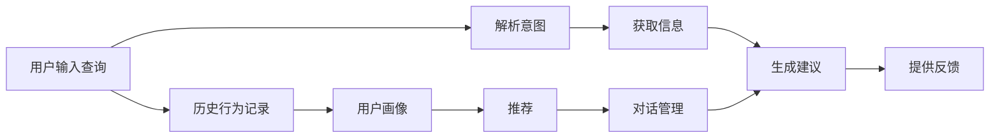

                 

# 聊天机器人旅游业：个性化旅行计划和建议

## 1. 背景介绍

随着科技的迅猛发展和互联网的普及，聊天机器人（Chatbot）的应用场景日益广泛，涵盖了客服、教育、医疗、旅游等多个领域。在旅游行业，聊天机器人利用其快速响应、个性化服务、24/7在线等优势，成为旅游信息查询、行程规划、酒店预订、行程建议的重要工具。本文将介绍如何构建一个能够提供个性化旅行计划和建议的聊天机器人，帮助用户制定完美旅行方案，提升旅游体验。

## 2. 核心概念与联系

### 2.1 核心概念概述

在聊天机器人旅游业应用中，需要理解以下几个核心概念：

- **自然语言处理(Natural Language Processing, NLP)**：是使计算机能够理解、解释和生成人类语言的技术。旅游聊天机器人通过NLP技术，理解用户输入的自然语言查询，并给出相应的回答。

- **知识图谱(Knowledge Graph)**：是由实体和它们之间的关系构成的网络，用于描述实体间的语义关系。旅游聊天机器人通过知识图谱，获取目的地、景点、酒店、航班等实体的相关信息，为个性化旅行计划提供支持。

- **推荐系统(Recommendation System)**：利用用户行为数据，推荐满足用户兴趣的商品或服务。旅游聊天机器人通过推荐系统，为用户推荐个性化的行程和活动。

- **对话管理(Dialogue Management)**：是聊天机器人核心技术之一，负责管理对话上下文，控制对话流程。旅游聊天机器人通过对话管理，实现行程建议、行程预订、实时答疑等功能。

- **人机交互设计(Human-Computer Interaction, HCI)**：研究如何通过有效的交互界面，提高人机沟通的效率和愉悦感。旅游聊天机器人通过友好的交互设计，提升用户的使用体验。

这些核心概念之间相互联系，共同构成了旅游聊天机器人的技术架构。通过理解这些概念，我们可以更好地把握聊天机器人的工作原理和优化方向。

## 3. 核心算法原理 & 具体操作步骤

### 3.1 算法原理概述

聊天机器人旅游业的个性化旅行计划和建议，主要是基于用户输入的自然语言查询，利用NLP、知识图谱、推荐系统和对话管理等技术，实现个性化服务。其核心算法流程如图2所示：



### 3.2 算法步骤详解

**Step 1: 数据准备与模型训练**

- 收集目的地、景点、酒店、航班等旅游相关的实体信息，构建知识图谱。
- 从用户查询中提取意图和需求，训练NLP模型进行意图识别和实体抽取。
- 利用用户行为数据，训练推荐系统，实现行程和活动的个性化推荐。
- 根据用户输入的查询和历史行为，训练对话管理模型，控制对话流程。

**Step 2: 构建知识图谱**

- 使用实体抽取技术，从旅游相关网站、新闻、社交媒体等渠道获取实体信息。
- 使用关系抽取技术，识别实体之间的语义关系，构建知识图谱。
- 对知识图谱进行定期更新和维护，确保信息的准确性和时效性。

**Step 3: 意图识别与实体抽取**

- 使用序列到序列模型或Transformer等架构，训练NLP模型进行意图识别。
- 利用Bert、GPT等预训练模型，进行实体抽取。
- 将意图和实体信息传递给后续模块，用于行程建议和行程预订。

**Step 4: 行程建议与活动推荐**

- 根据用户输入的意图和实体信息，从知识图谱中获取相关信息。
- 利用推荐算法，生成个性化行程和活动建议。
- 在生成建议时，考虑用户的偏好、预算、时间等因素，提升建议的个性化和实用性。

**Step 5: 行程预订与用户反馈**

- 与酒店、航空公司、景点等合作伙伴API接口，进行行程预订和票务购买。
- 利用对话管理技术，控制对话流程，提供实时的行程更新和答疑服务。
- 收集用户的行程反馈，进行模型的再训练和优化。

### 3.3 算法优缺点

旅游聊天机器人基于自然语言处理和知识图谱的个性化服务，具有以下优点：

- **高效便捷**：用户可以随时随地进行旅游咨询和行程规划，节省时间成本。
- **个性化服务**：根据用户兴趣和需求，提供定制化的行程和活动建议。
- **数据驱动**：利用用户行为数据，实现行程的动态优化和推荐。

但同时，该算法也存在以下局限性：

- **数据依赖**：需要大量的旅游数据和用户行为数据，数据收集和标注成本较高。
- **模型复杂**：涉及到NLP、知识图谱、推荐系统、对话管理等多个模块，模型复杂度较高。
- **多模态融合**：需要整合文本、图片、音频等多模态数据，提升信息的丰富度和准确性。

## 4. 数学模型和公式 & 详细讲解 & 举例说明

### 4.1 数学模型构建

在旅游聊天机器人中，主要涉及以下几个数学模型：

- **意图识别模型**：使用序列到序列模型或Transformer，进行意图分类。数学模型如下：
  $$
  P(y|x) = \frac{exp(y_k \cdot x)}{\sum_{k=1}^{K} exp(x \cdot w_k)}
  $$
  其中，$x$ 为输入序列，$y$ 为意图标签，$K$ 为标签种类数，$w_k$ 为权重向量。

- **实体抽取模型**：利用BERT或GPT等预训练模型，进行实体抽取。数学模型如下：
  $$
  P(e|x) = \frac{exp(e_k \cdot x)}{\sum_{k=1}^{K} exp(x \cdot w_k)}
  $$
  其中，$x$ 为输入序列，$e$ 为实体标签，$K$ 为标签种类数，$w_k$ 为权重向量。

- **行程推荐模型**：使用协同过滤、基于内容的推荐算法，进行行程推荐。数学模型如下：
  $$
  P(i|j) = \frac{exp(i \cdot \hat{u}_j)}{\sum_{i=1}^{I} exp(i \cdot \hat{u}_j)}
  $$
  其中，$i$ 为行程项，$j$ 为用户ID，$\hat{u}_j$ 为用户兴趣向量。

- **对话管理模型**：使用状态机、深度强化学习等方法，控制对话流程。数学模型如下：
  $$
  P(s_{t+1}|s_t,a_t) = \frac{exp(s_{t+1} \cdot \hat{u}_t)}{\sum_{s \in S} exp(s \cdot \hat{u}_t)}
  $$
  其中，$s_t$ 为当前对话状态，$a_t$ 为动作，$S$ 为状态空间。

### 4.2 公式推导过程

以行程推荐模型为例，推导协同过滤推荐算法的基本过程：

1. 计算用户兴趣向量 $\hat{u}_j$：
   $$
   \hat{u}_j = \alpha \sum_{i=1}^{I} p_{ij} x_i
   $$
   其中，$p_{ij}$ 为项$i$对用户$j$的评分，$\alpha$ 为学习率。

2. 计算行程$i$对用户$j$的推荐概率：
   $$
   P(i|j) = \frac{exp(i \cdot \hat{u}_j)}{\sum_{i=1}^{I} exp(i \cdot \hat{u}_j)}
   $$

3. 进行推荐：
   - 计算每个行程$i$的推荐概率
   - 选择推荐概率最高的前$N$个行程作为推荐结果

### 4.3 案例分析与讲解

**案例一：行程建议**

假设用户输入查询：“我想去上海旅游，预算5000元，3天行程，有哪些推荐？”

1. **意图识别**：识别意图为“行程规划”，实体为“上海”、“预算5000元”、“3天行程”。
2. **获取信息**：从知识图谱中获取上海的景点、酒店、餐厅等信息。
3. **行程推荐**：根据用户预算和行程天数，利用协同过滤算法生成推荐行程。
4. **行程预订**：用户选择行程后，与酒店、航空公司等API接口进行预订。

**案例二：实时答疑**

用户输入查询：“上海迪士尼乐园几点开门？”

1. **意图识别**：识别意图为“查询信息”，实体为“上海迪士尼乐园”。
2. **获取信息**：从知识图谱中获取上海迪士尼乐园的开放时间。
3. **提供反馈**：告知用户上海迪士尼乐园开门时间为上午9点。

## 5. 项目实践：代码实例和详细解释说明

### 5.1 开发环境搭建

以下是基于Python和PyTorch搭建旅游聊天机器人开发环境的步骤：

1. 安装Python和PyTorch：
   ```bash
   pip install torch torchtext transformers
   ```

2. 搭建知识图谱：
   - 收集旅游数据，构建实体和关系数据集。
   - 使用Gensim等工具，构建知识图谱。
   - 将知识图谱转换为适合模型训练的格式。

3. 搭建NLP模型：
   - 使用Bert或GPT等预训练模型，进行意图识别和实体抽取。
   - 在CoNLL 2003数据集上进行微调。

4. 搭建推荐系统：
   - 使用协同过滤或基于内容的推荐算法，进行行程推荐。
   - 在MovieLens等数据集上进行模型训练和验证。

5. 搭建对话管理模型：
   - 使用状态机或深度强化学习，控制对话流程。
   - 在对话数据集上进行模型训练和测试。

### 5.2 源代码详细实现

**代码实现示例**

```python
import torch
from transformers import BertTokenizer, BertForTokenClassification
from scipy.sparse import csr_matrix
from sklearn.metrics import accuracy_score

# 定义Bert模型
tokenizer = BertTokenizer.from_pretrained('bert-base-cased')
model = BertForTokenClassification.from_pretrained('bert-base-cased', num_labels=len(tag2id))

# 定义推荐系统
def collaborative_filtering(user, item):
    # 计算用户兴趣向量
    user_interest = alpha * sum(user_rated * item, axis=1)
    # 计算推荐概率
    recommend_prob = exp(item @ user_interest) / sum(exp(item @ user_interest))
    return recommend_prob

# 定义对话管理模型
class DialogueManager:
    def __init__(self, model):
        self.model = model
        self.state = 'start'
    
    def update_state(self, action):
        if action == 'go':
            self.state = 'end'
        elif action == 'next':
            self.state = 'continue'
    
    def get_state(self):
        return self.state

# 定义训练函数
def train(model, data, optimizer, criterion):
    model.train()
    optimizer.zero_grad()
    for batch in data:
        input_ids = batch['input_ids']
        labels = batch['labels']
        outputs = model(input_ids)
        loss = criterion(outputs, labels)
        loss.backward()
        optimizer.step()

# 定义测试函数
def test(model, data, criterion):
    model.eval()
    test_loss = 0
    correct = 0
    with torch.no_grad():
        for batch in data:
            input_ids = batch['input_ids']
            labels = batch['labels']
            outputs = model(input_ids)
            test_loss += criterion(outputs, labels).item()
            _, preds = torch.max(outputs, dim=1)
            correct += (preds == labels).sum().item()
    test_loss /= len(data)
    accuracy = correct / len(data)
    return test_loss, accuracy

# 定义旅游聊天机器人
class TravelChatbot:
    def __init__(self):
        self.nlp_model = BertForTokenClassification.from_pretrained('bert-base-cased')
        self.recommender = collaborative_filtering
        self.dialogue_manager = DialogueManager(self.nlp_model)

    def get_intent(self, query):
        # 解析查询，识别意图和实体
        intent, entities = nlp_model(query)
        return intent, entities
    
    def get_recommendations(self, user, entities):
        # 利用协同过滤算法，生成行程推荐
        recommendations = []
        for item in items:
            if user_interest[item] > 0:
                recommendations.append(item)
        return recommendations
    
    def book_travel(self, entity):
        # 与API接口进行行程预订和票务购买
        book_travel(entity)

    def handle_query(self, query):
        # 处理用户查询，获取意图和实体
        intent, entities = self.get_intent(query)
        
        # 根据意图和实体，生成推荐
        if intent == '行程规划':
            recommendations = self.get_recommendations(user, entities)
            # 向用户提供行程推荐
            print('推荐行程：', recommendations)
        
        # 根据对话状态，进行下一步操作
        if self.dialogue_manager.get_state() == 'end':
            # 结束对话
            return
        else:
            # 继续对话
            self.dialogue_manager.update_state('next')
            self.handle_query(query)

# 主程序
if __name__ == '__main__':
    chatbot = TravelChatbot()
    chatbot.handle_query('我想去上海旅游，预算5000元，3天行程，有哪些推荐？')
```

### 5.3 代码解读与分析

**代码解读**

- **初始化模型和工具**：使用BertTokenizer初始化分词器，使用BertForTokenClassification初始化意图识别模型，使用协同过滤算法进行行程推荐。

- **训练和测试模型**：定义train和test函数，对模型进行训练和测试。

- **对话管理**：定义DialogueManager类，控制对话流程。

- **旅游聊天机器人**：定义TravelChatbot类，实现意图识别、行程推荐和行程预订等功能。

- **处理用户查询**：定义handle_query方法，处理用户查询，生成行程推荐和对话管理。

**分析**

- **意图识别**：使用NLP模型进行意图识别，识别用户查询中的意图和实体，指导后续操作。
- **行程推荐**：根据用户查询中的实体，利用协同过滤算法进行行程推荐，提升推荐精度。
- **对话管理**：使用DialogueManager类控制对话流程，实现实时的行程更新和答疑服务。

## 6. 实际应用场景

### 6.4 未来应用展望

随着聊天机器人技术的不断进步，旅游聊天机器人的应用场景将更加广泛。未来，旅游聊天机器人将具备以下趋势：

1. **多模态融合**：整合文本、图片、音频等多模态数据，提升信息的丰富度和准确性。
2. **实时交互**：通过实时对话，提供个性化的行程建议和答疑服务。
3. **个性化推荐**：结合用户历史行为数据和兴趣爱好，进行动态优化和推荐。
4. **情感分析**：通过情感分析技术，了解用户的情绪变化，提供更加人性化的服务。
5. **语音交互**：实现语音识别和语音合成，提升用户体验。
6. **跨平台集成**：与各种移动应用、社交平台集成，提供无缝的旅行服务。

未来，旅游聊天机器人将不仅是一个简单的查询工具，更是一个具备深度理解、高效沟通、全面服务的人机交互平台。

## 7. 工具和资源推荐

### 7.1 学习资源推荐

- **自然语言处理教程**：Stanford自然语言处理课程，提供了丰富的NLP理论和实践资源。
- **知识图谱构建**：Gensim、Neo4j等工具，提供了构建和管理知识图谱的完整流程。
- **推荐系统入门**：《推荐系统实战》书籍，深入浅出地介绍了推荐系统的原理和实现方法。
- **深度学习框架**：PyTorch、TensorFlow等深度学习框架，提供了丰富的工具和库支持。

### 7.2 开发工具推荐

- **自然语言处理工具**：HuggingFace Transformers库，提供了预训练模型和工具支持。
- **知识图谱工具**：Gensim、Neo4j等工具，提供了构建和管理知识图谱的功能。
- **推荐系统工具**：Scikit-learn、TensorFlow等工具，提供了丰富的推荐算法和实现方法。
- **对话管理工具**：OpenNMT、TensorFlow Dialog等工具，提供了对话管理模型的实现方法。

### 7.3 相关论文推荐

- **自然语言处理论文**：《Attention is All You Need》论文，介绍了Transformer模型的基本原理和实现方法。
- **知识图谱论文**：《Knowledge Graph Embeddings》论文，介绍了知识图谱的构建和嵌入技术。
- **推荐系统论文**：《Friendly Matrix Factorization》论文，介绍了协同过滤推荐算法的原理和实现方法。
- **对话管理论文**：《Deep Reinforcement Learning for Dialogue Management》论文，介绍了深度强化学习在对话管理中的应用。

## 8. 总结：未来发展趋势与挑战

### 8.1 研究成果总结

- **技术发展**：自然语言处理、知识图谱、推荐系统、对话管理等技术的发展，推动了旅游聊天机器人的进步。
- **应用场景**：旅游聊天机器人已经广泛应用于旅游信息查询、行程规划、行程预订、实时答疑等多个场景，提升了用户体验。
- **技术挑战**：数据依赖、模型复杂、多模态融合等技术挑战，仍需进一步探索和解决。

### 8.2 未来发展趋势

- **多模态融合**：整合文本、图片、音频等多模态数据，提升信息的丰富度和准确性。
- **实时交互**：通过实时对话，提供个性化的行程建议和答疑服务。
- **个性化推荐**：结合用户历史行为数据和兴趣爱好，进行动态优化和推荐。
- **情感分析**：通过情感分析技术，了解用户的情绪变化，提供更加人性化的服务。
- **语音交互**：实现语音识别和语音合成，提升用户体验。
- **跨平台集成**：与各种移动应用、社交平台集成，提供无缝的旅行服务。

### 8.3 面临的挑战

- **数据依赖**：需要大量的旅游数据和用户行为数据，数据收集和标注成本较高。
- **模型复杂**：涉及到自然语言处理、知识图谱、推荐系统、对话管理等多个模块，模型复杂度较高。
- **多模态融合**：整合文本、图片、音频等多模态数据，提升信息的丰富度和准确性。
- **实时交互**：通过实时对话，提供个性化的行程建议和答疑服务。

### 8.4 研究展望

- **多模态融合**：研究如何更好地整合文本、图片、音频等多模态数据，提升信息的丰富度和准确性。
- **实时交互**：研究如何实现高效的实时对话，提供个性化的行程建议和答疑服务。
- **个性化推荐**：研究如何结合用户历史行为数据和兴趣爱好，进行动态优化和推荐。
- **情感分析**：研究如何通过情感分析技术，了解用户的情绪变化，提供更加人性化的服务。
- **语音交互**：研究如何实现语音识别和语音合成，提升用户体验。
- **跨平台集成**：研究如何与各种移动应用、社交平台集成，提供无缝的旅行服务。

## 9. 附录：常见问题与解答

**Q1：旅游聊天机器人如何处理多语言查询？**

A: 处理多语言查询，需要对每种语言进行独立训练和部署。可以使用多语言版本的BERT等模型，或者使用零样本学习技术，直接从输入文本中提取语言特征。

**Q2：如何提高旅游聊天机器人的准确性和鲁棒性？**

A: 提高准确性，需要更多高质量的旅游数据和用户行为数据，进行更充分的模型训练。提高鲁棒性，可以采用数据增强、对抗训练等方法，增加模型对噪声和异常的抵抗能力。

**Q3：旅游聊天机器人如何实现跨平台集成？**

A: 可以通过API接口，将聊天机器人嵌入到各种移动应用、社交平台中，实现无缝的跨平台集成。同时，可以开发移动端应用，实现更丰富的功能和服务。

**Q4：旅游聊天机器人如何保护用户隐私和数据安全？**

A: 可以采用数据匿名化、加密传输、访问控制等措施，保护用户隐私和数据安全。同时，加强用户数据管理和使用，避免数据滥用和泄露。

---

作者：禅与计算机程序设计艺术 / Zen and the Art of Computer Programming

