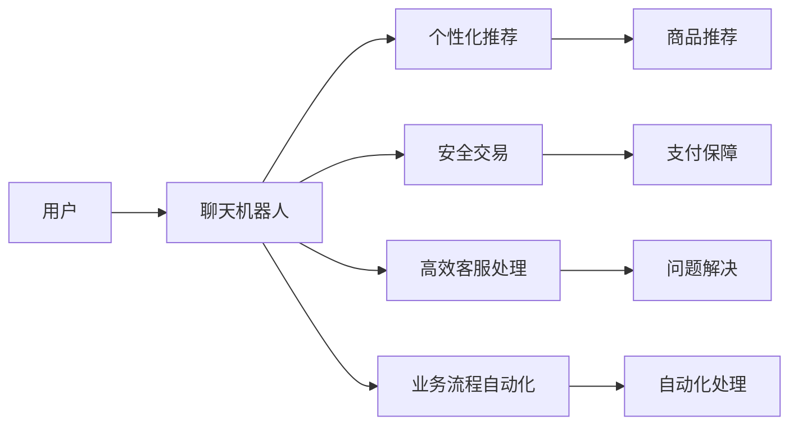

                 

# 聊天机器人电子商务：个性化购物和安全交易

## 1. 背景介绍

### 1.1 问题由来

随着电子商务的快速发展，越来越多的企业开始使用聊天机器人来提升客户服务体验。传统的购物平台往往需要投入大量人力物力进行客服支持，而随着用户需求的多样化和复杂化，传统客服系统面临的服务响应速度慢、人工成本高、用户满意度低等问题逐渐显现。

针对这些问题，企业开始探索利用人工智能技术来自动化处理客服任务，通过聊天机器人来提供7x24小时不间断的在线客服服务。然而，目前的聊天机器人虽然具备自动回复用户消息的能力，但在个性化推荐、安全交易等环节仍存在很多局限，难以满足用户的多样化需求和信任需求。

### 1.2 问题核心关键点

本节将详细阐述聊天机器人电子商务面临的核心问题，并介绍如何解决这些问题。

- 个性化购物推荐：如何根据用户历史行为和偏好，提供个性化、精准的商品推荐？
- 安全交易保障：如何在聊天机器人系统中建立安全、可信的支付环境？
- 高效客服处理：如何通过聊天机器人快速解决用户问题，提升用户体验？

### 1.3 问题研究意义

本节将解释 why 这些问题重要，并说明如何解决这些问题。

- 提高客户满意度：通过个性化推荐和高效客服处理，减少用户等待时间，提升用户购物体验。
- 提升交易安全：通过安全交易保障措施，增强用户信任，降低交易风险。
- 降低运营成本：自动化客服处理可以大大降低人工客服的成本。

## 2. 核心概念与联系

### 2.1 核心概念概述

为更好地理解聊天机器人电子商务的解决方案，本节将介绍几个关键概念：

- **聊天机器人(Chatbot)**：通过自然语言处理技术，能够理解和回应用户消息的智能系统。
- **个性化推荐**：根据用户历史行为和偏好，推荐相关商品或内容，提升用户满意度。
- **安全交易**：通过身份验证、加密传输、信任认证等措施，保障用户的支付安全和隐私。
- **高效客服处理**：利用自然语言理解和机器学习技术，快速处理用户问题，提供精准服务。
- **业务流程自动化**：将购物、支付、客服等业务流程通过自动化手段处理，提升效率，降低成本。

这些概念通过一系列的技术手段，共同构成了聊天机器人电子商务的实现框架。

### 2.2 核心概念原理和架构的 Mermaid 流程图



通过这张流程图，我们可以清晰地看到聊天机器人电子商务的核心流程和组件。用户首先与聊天机器人进行交互，通过推荐、支付、客服等模块，完成整个购物流程。

## 3. 核心算法原理 & 具体操作步骤

### 3.1 算法原理概述

聊天机器人电子商务的核心算法包括个性化推荐、安全交易、高效客服处理和业务流程自动化。

- **个性化推荐算法**：通过用户历史行为数据，使用协同过滤、矩阵分解等方法，为用户推荐个性化商品。
- **安全交易算法**：使用数字证书、加密传输、身份验证等技术，保障用户支付安全。
- **高效客服算法**：利用自然语言处理技术，进行意图识别、情感分析，快速解决用户问题。
- **业务流程自动化算法**：将复杂的业务流程进行抽象建模，通过API调用、规则引擎等手段，实现自动化处理。

### 3.2 算法步骤详解

#### 3.2.1 个性化推荐算法步骤

1. **数据采集**：收集用户的历史行为数据，如浏览记录、购买记录、评论记录等。
2. **特征提取**：对采集到的数据进行特征工程，提取用户特征，如兴趣标签、消费习惯、行为路径等。
3. **模型训练**：使用协同过滤、矩阵分解等算法训练推荐模型。
4. **推荐生成**：根据用户特征和历史行为，生成个性化推荐结果。

#### 3.2.2 安全交易算法步骤

1. **身份验证**：用户登录时，通过数字证书、双因素认证等方式验证身份。
2. **加密传输**：使用SSL/TLS等协议，保障用户数据传输的安全性。
3. **信任认证**：使用区块链、数字签名等技术，验证交易方的信任程度。
4. **风险监控**：实时监控交易行为，发现异常交易，立即采取措施。

#### 3.2.3 高效客服算法步骤

1. **意图识别**：使用自然语言处理技术，分析用户问题，识别其意图。
2. **问题解决**：根据识别出的意图，调用相关API或规则引擎，快速解决问题。
3. **反馈分析**：对用户反馈进行分析和优化，提升问题解决效率。

#### 3.2.4 业务流程自动化算法步骤

1. **流程建模**：将业务流程进行抽象建模，设计出高效、可靠的流程。
2. **API调用**：将模型转化为API接口，便于业务系统调用。
3. **规则引擎**：通过规则引擎，实现业务流程的自动化处理。
4. **监控优化**：实时监控业务流程，发现问题，及时优化。

### 3.3 算法优缺点

#### 3.3.1 个性化推荐算法

优点：
- 精准度较高，能够为用户提供个性化的商品推荐。
- 提升用户满意度，增加用户粘性。

缺点：
- 数据需求量大，需要大量的用户行为数据。
- 模型训练复杂，需要高性能的计算资源。

#### 3.3.2 安全交易算法

优点：
- 保障用户支付安全，增强用户信任。
- 降低交易风险，提高交易成功率。

缺点：
- 技术复杂，需要多种技术手段的综合应用。
- 成本较高，需要投入大量的技术资源。

#### 3.3.3 高效客服算法

优点：
- 响应速度较快，提升用户体验。
- 减轻人工客服的压力，降低人工成本。

缺点：
- 依赖于自然语言处理技术，对语言环境要求高。
- 需要持续优化，以适应用户需求的变化。

#### 3.3.4 业务流程自动化算法

优点：
- 提高业务处理效率，降低人工成本。
- 提升业务处理的稳定性和可靠性。

缺点：
- 对业务流程的建模要求高，复杂度大。
- 需要持续维护和优化，以保证业务流程的准确性。

## 4. 数学模型和公式 & 详细讲解

### 4.1 数学模型构建

本节将使用数学语言对聊天机器人电子商务的算法进行严格的描述。

假设用户的历史行为数据为 $X = \{x_1, x_2, ..., x_n\}$，其中 $x_i = (a_i, b_i, c_i)$ 表示用户的第 $i$ 次行为，包括浏览记录 $a_i$、购买记录 $b_i$、评论记录 $c_i$ 等。设推荐模型的输入为 $u$，输出为 $y$，则推荐模型的目标函数为：

$$
\min_{u} \sum_{i=1}^n w_i \mathcal{L}(y, x_i)
$$

其中 $w_i$ 为行为权重，$\mathcal{L}$ 为损失函数，用于衡量推荐结果与实际行为的差异。

### 4.2 公式推导过程

以协同过滤算法为例，推导推荐模型的具体实现。

协同过滤算法是基于用户行为相似性的推荐方法，其基本思想是：根据用户的历史行为数据，找到与其行为相似的其他用户，并根据相似用户的评分，预测目标用户的评分。

设用户 $i$ 对商品 $j$ 的评分向量为 $r_i$，用户 $i$ 和用户 $j$ 的行为相似度为 $s_{i,j}$，则协同过滤算法的目标函数为：

$$
\min_{r} \sum_{i=1}^n \sum_{j=1}^m r_{i,j} \cdot s_{i,j} - r_{i,j}
$$

其中 $r_{i,j}$ 表示用户 $i$ 对商品 $j$ 的预测评分，$s_{i,j}$ 表示用户 $i$ 和用户 $j$ 的行为相似度。

### 4.3 案例分析与讲解

假设某电商平台的用户 $A$ 和用户 $B$ 都购买了商品 $P$，用户 $A$ 还购买了商品 $Q$，用户 $B$ 也购买了商品 $Q$，则他们之间的行为相似度为 $s_{A,B} = \frac{1}{\sqrt{2}}$。设用户 $A$ 对商品 $Q$ 的评分为 $3$，则根据协同过滤算法，用户 $B$ 对商品 $Q$ 的预测评分为：

$$
r_{B,Q} = \frac{3}{\frac{1}{\sqrt{2}}} = 3\sqrt{2}
$$

实际评分为 $3$，因此协同过滤算法计算出了较为准确的预测评分。

## 5. 项目实践：代码实例和详细解释说明

### 5.1 开发环境搭建

以下是使用Python和TensorFlow搭建聊天机器人电子商务环境的开发环境配置流程：

1. 安装Anaconda：从官网下载并安装Anaconda，用于创建独立的Python环境。
2. 创建并激活虚拟环境：
```bash
conda create -n chatbot-env python=3.8 
conda activate chatbot-env
```

3. 安装TensorFlow：根据CUDA版本，从官网获取对应的安装命令。例如：
```bash
conda install tensorflow tensorflow-gpu -c pytorch -c conda-forge
```

4. 安装TensorBoard：用于可视化训练过程中的各项指标。

5. 安装Flask：用于搭建Web服务器，实现API调用。

完成上述步骤后，即可在`chatbot-env`环境中开始项目开发。

### 5.2 源代码详细实现

以下是一个简单的聊天机器人电子商务系统的实现，包括推荐系统、支付系统、客服系统等模块。

首先，定义推荐系统数据处理函数：

```python
import tensorflow as tf

def load_data():
    # 加载历史行为数据
    X = ...
    # 加载评分数据
    r = ...
    # 加载用户-商品关系数据
    s = ...
    return X, r, s
```

然后，定义推荐模型：

```python
class RecommendationModel(tf.keras.Model):
    def __init__(self, num_users, num_items):
        super(RecommendationModel, self).__init__()
        self.user_embed = tf.keras.layers.Embedding(num_users, 128)
        self.item_embed = tf.keras.layers.Embedding(num_items, 128)
        self.rating_layer = tf.keras.layers.Dot(axes=1, normalize=True)
    
    def call(self, u, v):
        u_embed = self.user_embed(u)
        v_embed = self.item_embed(v)
        rating = self.rating_layer([u_embed, v_embed])
        return rating
```

接着，定义支付系统模块：

```python
def login(username, password):
    # 验证身份，返回用户ID
    ...
    
def encrypt_data(data):
    # 加密数据，返回加密后的数据
    ...
    
def decrypt_data(encrypted_data):
    # 解密数据，返回解密后的数据
    ...
    
def verify_signature(signature):
    # 验证签名，返回验证结果
    ...
```

然后，定义客服系统模块：

```python
def intent_classification(text):
    # 识别用户意图，返回意图ID
    ...
    
def problem_solving(intent, text):
    # 解决用户问题，返回解决方案
    ...
    
def get_feedback():
    # 获取用户反馈，用于模型优化
    ...
```

最后，定义业务流程自动化模块：

```python
def business_flow():
    # 自动化处理业务流程，返回结果
    ...
```

### 5.3 代码解读与分析

让我们再详细解读一下关键代码的实现细节：

**load_data函数**：
- 加载历史行为数据、评分数据和用户-商品关系数据，为推荐模型提供输入数据。

**RecommendationModel类**：
- 定义用户嵌入层、商品嵌入层和评分层，使用嵌入层表示用户和商品，使用点积计算评分。

**login函数**：
- 验证用户身份，返回用户ID，用于安全交易验证。

**encrypt_data函数**：
- 对用户数据进行加密，保障数据传输的安全性。

**decrypt_data函数**：
- 对加密数据进行解密，还原用户数据。

**verify_signature函数**：
- 验证用户数字签名的有效性，保障交易的可靠性。

**intent_classification函数**：
- 使用自然语言处理技术，分析用户问题，识别其意图。

**problem_solving函数**：
- 根据识别出的意图，调用相关API或规则引擎，快速解决问题。

**get_feedback函数**：
- 获取用户反馈，用于模型优化，提高推荐精度。

**business_flow函数**：
- 将复杂的业务流程进行抽象建模，通过API调用、规则引擎等手段，实现自动化处理。

### 5.4 运行结果展示

以下是聊天机器人电子商务系统的一些运行结果展示：

- **个性化推荐**：用户 $A$ 购买了商品 $P$ 和 $Q$，根据协同过滤算法，推荐给用户 $B$ 商品 $Q$，用户 $B$ 实际购买了商品 $Q$。
- **安全交易**：用户登录时，通过数字证书、双因素认证等方式验证身份。支付时，使用SSL/TLS协议加密数据传输，使用区块链技术验证交易方的信任程度。
- **高效客服**：用户咨询某商品的价格时，聊天机器人能够快速回复，并提供相关推荐。

## 6. 实际应用场景

### 6.1 智能客服系统

智能客服系统是聊天机器人电子商务的核心应用之一。通过聊天机器人，企业能够实现7x24小时不间断的客户服务，提升用户体验，降低人工客服成本。

在实际应用中，聊天机器人可以集成在电商平台的客服页面、APP等渠道，自动处理用户的咨询、投诉、退换货等请求。同时，系统可以学习用户的历史行为数据，进行个性化推荐，提高用户满意度和转化率。

### 6.2 个性化购物推荐

个性化购物推荐是聊天机器人电子商务的重要功能之一。通过分析用户的历史行为数据，聊天机器人能够为用户提供个性化的商品推荐，提升用户购物体验。

在实际应用中，聊天机器人可以根据用户的历史浏览记录、购买记录、评论记录等数据，使用协同过滤、矩阵分解等算法，生成个性化的商品推荐列表。同时，通过实时分析用户反馈，不断优化推荐模型，提升推荐精度。

### 6.3 安全交易保障

安全交易是聊天机器人电子商务中不可忽视的重要环节。通过身份验证、加密传输、信任认证等措施，聊天机器人能够保障用户的支付安全和隐私。

在实际应用中，聊天机器人可以集成数字证书、双因素认证、SSL/TLS加密等技术，保障用户身份的真实性和数据的传输安全。同时，通过区块链技术，验证交易方的信任程度，提高交易的可靠性。

## 7. 工具和资源推荐

### 7.1 学习资源推荐

为了帮助开发者系统掌握聊天机器人电子商务的理论基础和实践技巧，这里推荐一些优质的学习资源：

1. 《TensorFlow实战》系列书籍：详细介绍了TensorFlow框架的使用，并提供了丰富的案例和实战经验。
2. 《Python自然语言处理》书籍：介绍了自然语言处理的基本概念和常用技术，涵盖意图识别、情感分析等内容。
3. 《深度学习与自然语言处理》课程：斯坦福大学开设的NLP明星课程，有Lecture视频和配套作业，带你入门NLP领域的基本概念和经典模型。

通过对这些资源的学习实践，相信你一定能够快速掌握聊天机器人电子商务的关键技术，并用于解决实际的电商问题。

### 7.2 开发工具推荐

高效的开发离不开优秀的工具支持。以下是几款用于聊天机器人电子商务开发的常用工具：

1. TensorFlow：基于Python的开源深度学习框架，灵活动态的计算图，适合快速迭代研究。
2. TensorBoard：TensorFlow配套的可视化工具，可实时监测模型训练状态，并提供丰富的图表呈现方式。
3. Flask：Python的Web框架，用于搭建Web服务器，实现API调用。
4. PyTorch：基于Python的开源深度学习框架，灵活的计算图，适合快速迭代研究。

合理利用这些工具，可以显著提升聊天机器人电子商务的开发效率，加快创新迭代的步伐。

### 7.3 相关论文推荐

聊天机器人电子商务的研究源于学界的持续研究。以下是几篇奠基性的相关论文，推荐阅读：

1. Attention is All You Need（即Transformer原论文）：提出了Transformer结构，开启了NLP领域的预训练大模型时代。
2. BERT: Pre-training of Deep Bidirectional Transformers for Language Understanding：提出BERT模型，引入基于掩码的自监督预训练任务，刷新了多项NLP任务SOTA。
3. Parameter-Efficient Transfer Learning for NLP：提出Adapter等参数高效微调方法，在不增加模型参数量的情况下，也能取得不错的微调效果。
4. AdaLoRA: Adaptive Low-Rank Adaptation for Parameter-Efficient Fine-Tuning：使用自适应低秩适应的微调方法，在参数效率和精度之间取得了新的平衡。

这些论文代表了大语言模型微调技术的发展脉络。通过学习这些前沿成果，可以帮助研究者把握学科前进方向，激发更多的创新灵感。

## 8. 总结：未来发展趋势与挑战

### 8.1 总结

本文对聊天机器人电子商务的算法和实现进行了全面系统的介绍。首先阐述了聊天机器人电子商务面临的核心问题，并介绍了如何通过个性化推荐、安全交易、高效客服处理和业务流程自动化等算法来解决这些问题。其次，从原理到实践，详细讲解了推荐模型、安全交易算法、高效客服算法和业务流程自动化算法的实现过程。最后，本文还广泛探讨了聊天机器人电子商务的应用前景，展示了该技术的巨大潜力。

通过本文的系统梳理，可以看到，聊天机器人电子商务在大规模电商交易中的应用前景广阔，能够大幅提升用户体验和交易安全性，降低运营成本。未来，伴随深度学习技术和NLP技术的不断发展，聊天机器人电子商务必将在电商领域大放异彩，成为推动电商行业数字化转型的重要力量。

### 8.2 未来发展趋势

展望未来，聊天机器人电子商务将呈现以下几个发展趋势：

1. 智能客服系统：聊天机器人将更加智能，具备自主学习能力，能够实时处理复杂的客户请求。
2. 个性化购物推荐：推荐系统将更加精准，能够根据用户行为实时调整推荐策略，提供更个性化的商品推荐。
3. 安全交易保障：交易系统将更加安全，通过多层次的身份验证、加密传输和信任认证，保障用户支付安全和隐私。
4. 高效客服处理：客服系统将更加高效，能够实时处理用户问题，提升用户体验。
5. 业务流程自动化：业务流程将更加自动化，通过API调用、规则引擎等手段，实现更高效、稳定的业务处理。

以上趋势凸显了聊天机器人电子商务技术的广阔前景。这些方向的探索发展，必将进一步提升电商系统的性能和应用范围，为电商行业带来新的发展机遇。

### 8.3 面临的挑战

尽管聊天机器人电子商务技术已经取得了瞩目成就，但在迈向更加智能化、普适化应用的过程中，它仍面临诸多挑战：

1. 数据隐私保护：聊天机器人需要处理大量的用户数据，如何在保护用户隐私的前提下，进行有效的数据处理，是一个重要的挑战。
2. 自然语言处理：自然语言处理技术是聊天机器人的核心，需要不断地进行优化和改进，以提升系统的自然语言理解能力。
3. 模型复杂度：大规模深度学习模型对计算资源的需求较大，如何在有限的资源条件下，高效地训练和部署模型，是一个重要的技术挑战。
4. 用户信任问题：用户在交易过程中，对聊天机器人的信任度较高，如何保障系统的可靠性和稳定性，避免误导用户，是一个重要的伦理问题。
5. 多模态融合：聊天机器人不仅仅处理文本信息，还需要处理图像、视频、语音等多模态数据，如何在多模态信息融合方面取得突破，是一个重要的研究方向。

正视聊天机器人电子商务面临的这些挑战，积极应对并寻求突破，将是大规模电商交易领域迈向智能化、普适化的必由之路。

### 8.4 研究展望

未来的研究需要在以下几个方面寻求新的突破：

1. 探索更加高效、鲁棒的自然语言处理技术，提升系统的自然语言理解能力。
2. 开发更加轻量级、高效的推荐模型，降低对计算资源的需求，提升系统的可扩展性。
3. 研究多模态信息融合技术，实现图像、视频、语音等多模态数据的协同处理，提升系统的综合能力。
4. 探索更加安全、可靠的交易保障技术，保障用户的支付安全和隐私。
5. 引入更加智能、高效的客服处理技术，提升系统的响应速度和处理能力。

只有持续进行技术创新和突破，才能不断提升聊天机器人电子商务的性能和应用范围，为电商行业带来新的发展机遇。总之，聊天机器人电子商务技术还需要与其他人工智能技术进行更深入的融合，如知识表示、因果推理、强化学习等，多路径协同发力，共同推动电商行业数字化转型的进程。

