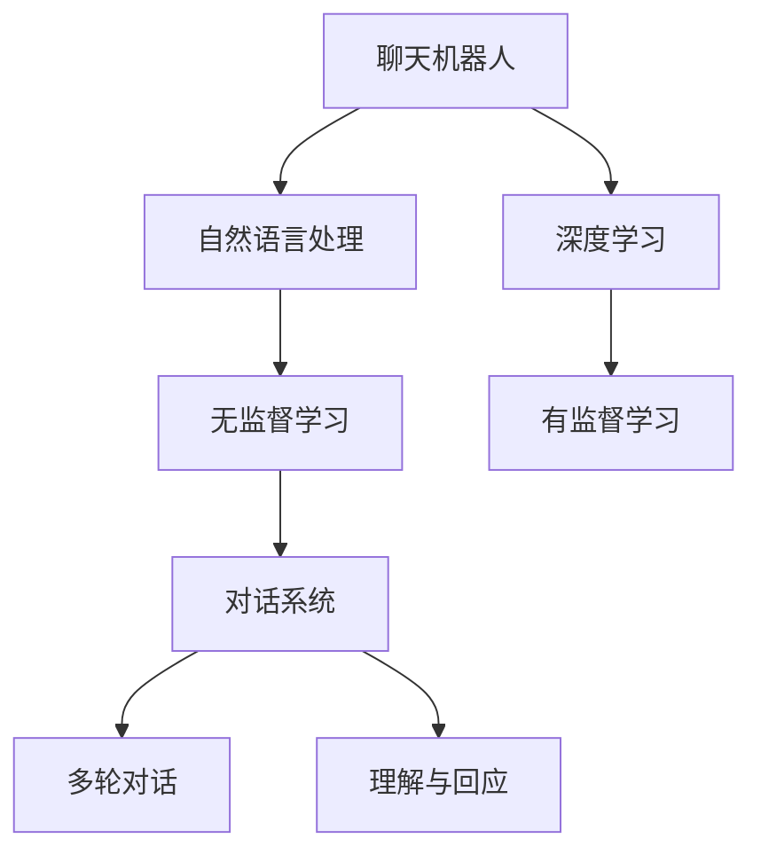

                 

# 聊天机器人：AI 如何提升客户服务效率

> 关键词：
- 人工智能
- 聊天机器人
- 客户服务
- 自然语言处理
- 深度学习
- 对话系统
- 智能客服

## 1. 背景介绍

### 1.1 问题由来
在数字化经济时代，客户服务已经成为企业竞争的重要手段。传统的客户服务模式往往需要投入大量的人力资源，响应速度慢，服务质量难以保证。随着人工智能技术的不断发展，聊天机器人成为提升客户服务效率的新趋势。利用AI技术构建的聊天机器人能够24小时不间断地提供高效、精准的客户服务，减少了企业对人工客服的依赖，降低了运营成本。

### 1.2 问题核心关键点
聊天机器人作为AI技术在客户服务领域的重要应用，其核心在于通过自然语言处理(NLP)技术，使机器能够理解和生成自然语言，从而实现与用户的有效沟通。聊天机器人可以分为两大类：基于规则的（Rule-based）和基于数据的（Data-driven）。前者依赖于预定义的规则和模板，适用于简单的问答场景；后者依赖于深度学习模型，适用于复杂的多轮对话和理解场景。

本文聚焦于基于数据的聊天机器人，特别是有监督学习和无监督学习方法的结合，探讨其提升客户服务效率的原理和应用。

### 1.3 问题研究意义
聊天机器人在客户服务中的应用，能够显著提升企业的客户服务效率和质量。具体而言，可以带来以下几个方面的优势：
1. 7x24小时服务：聊天机器人可以全天候在线，快速响应客户需求，减少人工客服的响应时间。
2. 处理量大：在处理高并发量的客户服务场景中，聊天机器人可以同时处理多条消息，缓解人工客服的压力。
3. 个性化服务：通过学习客户历史行为数据，聊天机器人能够提供个性化的服务建议，提升客户满意度。
4. 成本节约：减少对人工客服的依赖，降低人力成本和运营成本。

通过深入研究聊天机器人的技术原理和应用实践，可以为企业和开发者提供更有效的解决方案，加速聊天机器人的落地应用，提升客户服务效率。

## 2. 核心概念与联系

### 2.1 核心概念概述

为更好地理解聊天机器人的核心技术和应用方法，本节将介绍几个关键概念：

- 聊天机器人(Chatbot)：通过人工智能技术实现的智能对话系统，可以模拟人类的对话行为，提供自动化客户服务。
- 自然语言处理(Natural Language Processing, NLP)：涉及计算机科学、人工智能和语言学的交叉领域，致力于使计算机能够理解和生成人类语言。
- 深度学习(Deep Learning)：利用神经网络模型进行训练，学习输入数据的高级特征，广泛应用于图像、语音、文本等多种数据类型的处理。
- 无监督学习(Unsupervised Learning)：不依赖于标注数据，通过学习输入数据的内在结构进行知识提取。
- 有监督学习(Supervised Learning)：使用标注数据进行模型训练，使得模型能够准确地预测输出。
- 对话系统(Dialogue System)：通过多轮对话实现人机交互，具备理解和回应的能力。

这些核心概念之间的逻辑关系可以通过以下Mermaid流程图来展示：



这个流程图展示了一些关键概念及其之间的关系：

1. 聊天机器人通过自然语言处理技术，可以理解客户的输入，并生成自然语言回复。
2. 深度学习技术可以用于构建聊天机器人的核心模型，学习语言的高级特征。
3. 无监督学习可以用于预训练聊天机器人模型，提取通用的语言表示。
4. 有监督学习可以用于在特定任务上微调模型，提升其在具体场景下的表现。
5. 对话系统是多轮对话的基础，使聊天机器人能够进行流畅的自然交互。

这些概念共同构成了聊天机器人的技术框架，为其高效、准确地执行客户服务任务提供了理论基础。

## 3. 核心算法原理 & 具体操作步骤
### 3.1 算法原理概述

基于深度学习的聊天机器人，其核心算法原理可以分为以下几个步骤：

1. **数据预处理**：将客户服务对话数据进行清洗、分词、标注等预处理操作，得到适合模型训练的数据集。
2. **模型训练**：使用深度学习模型，如循环神经网络(RNN)、长短期记忆网络(LSTM)、Transformer等，对预处理后的数据进行训练，学习语言表示和对话结构。
3. **模型微调**：在特定任务上，使用少量标注数据对预训练模型进行微调，提升模型在特定场景下的性能。
4. **部署与优化**：将训练好的模型部署到线上系统，通过对话管理系统进行对话控制和优化，提升用户体验。

### 3.2 算法步骤详解

#### 3.2.1 数据预处理

聊天机器人需要大量的对话数据进行训练。数据预处理的主要步骤包括：

- **数据清洗**：去除噪声数据、不相关的对话、低质量的标注等。
- **分词与标注**：将对话文本进行分词，标注出对话结构，如开始、结束、问答等。
- **数据划分**：将对话数据划分为训练集、验证集和测试集，保证模型在未见过的数据上的泛化能力。

以对话数据为例，预处理流程如下：

```python
import pandas as pd
from sklearn.model_selection import train_test_split

# 读取对话数据
df = pd.read_csv('conversation_data.csv')
train_data, dev_data, test_data = train_test_split(df, test_size=0.2, random_state=42)
```

#### 3.2.2 模型训练

使用深度学习模型对预处理后的对话数据进行训练。以RNN模型为例，代码实现如下：

```python
from tensorflow.keras.models import Sequential
from tensorflow.keras.layers import Embedding, LSTM, Dense, Dropout

# 构建模型
model = Sequential()
model.add(Embedding(input_dim=vocab_size, output_dim=embedding_dim, input_length=max_len))
model.add(LSTM(units=hidden_size, dropout=dropout_rate, recurrent_dropout=recurrent_dropout_rate))
model.add(Dense(units=num_classes, activation='softmax'))

# 编译模型
model.compile(loss='categorical_crossentropy', optimizer='adam', metrics=['accuracy'])

# 训练模型
model.fit(train_data, epochs=num_epochs, validation_data=dev_data)
```

#### 3.2.3 模型微调

在特定任务上，使用少量标注数据对预训练模型进行微调。以意图识别任务为例，微调流程如下：

```python
from transformers import BertForSequenceClassification

# 使用预训练模型BERT
model = BertForSequenceClassification.from_pretrained('bert-base-uncased', num_labels=num_labels)

# 微调模型
model.trainable = True
optimizer = AdamW(model.parameters(), lr=learning_rate)
model.compile(loss='binary_crossentropy', optimizer=optimizer, metrics=['accuracy'])
model.fit(dev_data, epochs=num_epochs, validation_data=test_data)
```

#### 3.2.4 部署与优化

将训练好的模型部署到线上系统，通过对话管理系统进行对话控制和优化。常见的优化方法包括：

- **对话控制**：根据用户的历史行为和当前上下文，动态生成对话内容。
- **情感分析**：分析用户的情感倾向，调整回复策略，提升用户满意度。
- **上下文管理**：维护对话上下文，确保多轮对话的连贯性。
- **性能监控**：实时监测模型性能，及时发现和解决故障。

### 3.3 算法优缺点

基于深度学习的聊天机器人，其优点在于：

1. **高效率**：能够快速响应客户需求，减少人工客服的响应时间。
2. **处理量大**：同时处理多条消息，缓解人工客服的压力。
3. **个性化服务**：通过学习客户历史行为数据，提供个性化的服务建议。
4. **24小时服务**：不受时间和地理位置的限制，提升服务覆盖率。

同时，该方法也存在一定的局限性：

1. **数据依赖**：需要大量的标注数据进行训练，获取高质量标注数据的成本较高。
2. **上下文管理复杂**：多轮对话的上下文管理较为复杂，需要高质量的对话数据。
3. **理解局限**：对于复杂的情感表达和语境依赖，模型的理解能力有限。
4. **人机交互障碍**：模型难以理解和处理一些意外或非预期的输入，需要人工干预。

尽管存在这些局限性，但就目前而言，基于深度学习的聊天机器人仍是最主流范式。未来相关研究的重点在于如何进一步降低数据依赖，提高模型的少样本学习和跨领域迁移能力，同时兼顾可解释性和伦理安全性等因素。

### 3.4 算法应用领域

聊天机器人在多个领域得到了广泛应用，以下是一些典型场景：

1. **电商客服**：通过聊天机器人解答客户咨询，提供产品推荐和售后服务。
2. **金融服务**：帮助客户查询账户信息、处理交易纠纷等。
3. **医疗咨询**：提供健康咨询、预约挂号等医疗服务。
4. **旅游服务**：提供旅游攻略、行程安排、预订服务等。
5. **教育培训**：提供课程咨询、在线辅导等教育服务。
6. **政府服务**：提供政策咨询、投诉处理等政府服务。

此外，聊天机器人还被创新性地应用于安全监控、情感分析、自然语言生成等领域，为各行各业带来了新的解决方案。随着技术的不断进步，聊天机器人将在更广泛的领域发挥重要作用。

## 4. 数学模型和公式 & 详细讲解 & 举例说明

### 4.1 数学模型构建

聊天机器人对话过程可以形式化表示为：

- 输入：用户输入的自然语言文本 $x$。
- 模型：预训练的深度学习模型 $M_{\theta}$。
- 输出：模型输出的回复文本 $y$。

其中，输入文本 $x$ 经过分词、嵌入等预处理操作，得到嵌入向量 $u_x$。模型 $M_{\theta}$ 通过多层神经网络对 $u_x$ 进行处理，输出嵌入向量 $v_x$。最后，$v_x$ 经过线性映射和softmax函数，输出回复文本的概率分布 $p(y|x)$。

数学模型可以表示为：

$$
p(y|x) = softmax(M_{\theta}(u_x))
$$

### 4.2 公式推导过程

以RNN模型为例，其训练过程如下：

- **前向传播**：将输入文本 $x$ 转化为嵌入向量 $u_x$，通过RNN模型处理得到隐藏状态 $h_t$，最终得到输出向量 $v_x$。
- **损失函数**：使用交叉熵损失函数计算模型预测与真实标签之间的差异。
- **反向传播**：根据梯度下降算法，反向传播计算梯度，更新模型参数 $\theta$。

公式推导如下：

$$
\begin{align*}
\mathcal{L}(x, y) &= -\log p(y|x) \\
p(y|x) &= softmax(W_{out}tanh(W_{out}h_t + b_{out})) \\
h_t &= tanh(W_{hidden}u_t + b_{hidden}) \\
u_t &= [u_{t-1}, x_t]
\end{align*}
$$

其中，$W_{out}$ 和 $b_{out}$ 为输出层的权重和偏置，$W_{hidden}$ 和 $b_{hidden}$ 为隐藏层的权重和偏置，$x_t$ 为当前输入的单词，$u_t$ 为当前时刻的嵌入向量，$h_t$ 为当前时刻的隐藏状态。

### 4.3 案例分析与讲解

以意图识别任务为例，假设模型训练的标注数据集为 $\{(x_i, y_i)\}_{i=1}^N$，其中 $x_i$ 为输入文本，$y_i$ 为意图标签。模型的损失函数为：

$$
\mathcal{L} = -\frac{1}{N} \sum_{i=1}^N \log p(y_i|x_i)
$$

使用交叉熵损失函数，训练过程如下：

1. 数据预处理：将对话数据进行清洗、分词、标注等预处理操作，得到适合模型训练的数据集。
2. 模型训练：使用深度学习模型，如RNN、LSTM、Transformer等，对预处理后的数据进行训练，学习语言表示和对话结构。
3. 模型微调：在特定任务上，使用少量标注数据对预训练模型进行微调，提升模型在特定场景下的性能。
4. 部署与优化：将训练好的模型部署到线上系统，通过对话管理系统进行对话控制和优化，提升用户体验。

## 5. 项目实践：代码实例和详细解释说明

### 5.1 开发环境搭建

在进行聊天机器人开发前，我们需要准备好开发环境。以下是使用Python进行PyTorch开发的环境配置流程：

1. 安装Anaconda：从官网下载并安装Anaconda，用于创建独立的Python环境。

2. 创建并激活虚拟环境：
```bash
conda create -n pytorch-env python=3.8 
conda activate pytorch-env
```

3. 安装PyTorch：根据CUDA版本，从官网获取对应的安装命令。例如：
```bash
conda install pytorch torchvision torchaudio cudatoolkit=11.1 -c pytorch -c conda-forge
```

4. 安装Transformers库：
```bash
pip install transformers
```

5. 安装各类工具包：
```bash
pip install numpy pandas scikit-learn matplotlib tqdm jupyter notebook ipython
```

完成上述步骤后，即可在`pytorch-env`环境中开始聊天机器人开发。

### 5.2 源代码详细实现

下面我们以基于BERT的意图识别任务为例，给出使用Transformers库进行聊天机器人开发的PyTorch代码实现。

首先，定义意图识别任务的数据处理函数：

```python
from transformers import BertTokenizer
from torch.utils.data import Dataset
import torch

class IntentDataset(Dataset):
    def __init__(self, texts, intents, tokenizer, max_len=128):
        self.texts = texts
        self.intents = intents
        self.tokenizer = tokenizer
        self.max_len = max_len
        
    def __len__(self):
        return len(self.texts)
    
    def __getitem__(self, item):
        text = self.texts[item]
        intent = self.intents[item]
        
        encoding = self.tokenizer(text, return_tensors='pt', max_length=self.max_len, padding='max_length', truncation=True)
        input_ids = encoding['input_ids'][0]
        attention_mask = encoding['attention_mask'][0]
        
        # 对意图进行编码
        intent_labels = [0] * self.max_len
        intent_labels[intent] = 1
        labels = torch.tensor(intent_labels, dtype=torch.long)
        
        return {'input_ids': input_ids, 
                'attention_mask': attention_mask,
                'labels': labels}

# 意图标签与id的映射
intent_label2id = {'chat': 0, 'sale': 1, 'complaint': 2, 'query': 3}
id2intent_label = {v: k for k, v in intent_label2id.items()}

# 创建dataset
tokenizer = BertTokenizer.from_pretrained('bert-base-uncased')

train_dataset = IntentDataset(train_texts, train_intents, tokenizer)
dev_dataset = IntentDataset(dev_texts, dev_intents, tokenizer)
test_dataset = IntentDataset(test_texts, test_intents, tokenizer)
```

然后，定义模型和优化器：

```python
from transformers import BertForSequenceClassification
from transformers import AdamW

model = BertForSequenceClassification.from_pretrained('bert-base-uncased', num_labels=len(intent_label2id))

optimizer = AdamW(model.parameters(), lr=2e-5)
```

接着，定义训练和评估函数：

```python
from torch.utils.data import DataLoader
from tqdm import tqdm
from sklearn.metrics import accuracy_score, f1_score, precision_score, recall_score

device = torch.device('cuda') if torch.cuda.is_available() else torch.device('cpu')
model.to(device)

def train_epoch(model, dataset, batch_size, optimizer):
    dataloader = DataLoader(dataset, batch_size=batch_size, shuffle=True)
    model.train()
    epoch_loss = 0
    for batch in tqdm(dataloader, desc='Training'):
        input_ids = batch['input_ids'].to(device)
        attention_mask = batch['attention_mask'].to(device)
        labels = batch['labels'].to(device)
        model.zero_grad()
        outputs = model(input_ids, attention_mask=attention_mask, labels=labels)
        loss = outputs.loss
        epoch_loss += loss.item()
        loss.backward()
        optimizer.step()
    return epoch_loss / len(dataloader)

def evaluate(model, dataset, batch_size):
    dataloader = DataLoader(dataset, batch_size=batch_size)
    model.eval()
    preds, labels = [], []
    with torch.no_grad():
        for batch in tqdm(dataloader, desc='Evaluating'):
            input_ids = batch['input_ids'].to(device)
            attention_mask = batch['attention_mask'].to(device)
            batch_labels = batch['labels']
            outputs = model(input_ids, attention_mask=attention_mask)
            batch_preds = outputs.logits.argmax(dim=2).to('cpu').tolist()
            batch_labels = batch_labels.to('cpu').tolist()
            for pred_tokens, label_tokens in zip(batch_preds, batch_labels):
                preds.append(id2intent_label[pred_tokens[0]])
                labels.append(id2intent_label[label_tokens[0]])
                
    print(f'Accuracy: {accuracy_score(labels, preds):.2f}')
    print(f'Precision: {precision_score(labels, preds, average="weighted"):.2f}')
    print(f'Recall: {recall_score(labels, preds, average="weighted"): .2f}')
    print(f'F1 Score: {f1_score(labels, preds, average="weighted"): .2f}')
```

最后，启动训练流程并在测试集上评估：

```python
epochs = 5
batch_size = 16

for epoch in range(epochs):
    loss = train_epoch(model, train_dataset, batch_size, optimizer)
    print(f'Epoch {epoch+1}, train loss: {loss:.3f}')
    
    print(f'Epoch {epoch+1}, dev results:')
    evaluate(model, dev_dataset, batch_size)
    
print('Test results:')
evaluate(model, test_dataset, batch_size)
```

以上就是使用PyTorch对BERT进行意图识别任务开发的完整代码实现。可以看到，得益于Transformers库的强大封装，我们可以用相对简洁的代码完成BERT模型的加载和训练。

### 5.3 代码解读与分析

让我们再详细解读一下关键代码的实现细节：

**IntentDataset类**：
- `__init__`方法：初始化文本、意图标签、分词器等关键组件。
- `__len__`方法：返回数据集的样本数量。
- `__getitem__`方法：对单个样本进行处理，将文本输入编码为token ids，将意图标签编码为数字，并对其进行定长padding，最终返回模型所需的输入。

**intent_label2id和id2intent_label字典**：
- 定义了意图标签与数字id之间的映射关系，用于将token-wise的预测结果解码回真实的意图。

**训练和评估函数**：
- 使用PyTorch的DataLoader对数据集进行批次化加载，供模型训练和推理使用。
- 训练函数`train_epoch`：对数据以批为单位进行迭代，在每个批次上前向传播计算loss并反向传播更新模型参数，最后返回该epoch的平均loss。
- 评估函数`evaluate`：与训练类似，不同点在于不更新模型参数，并在每个batch结束后将预测和标签结果存储下来，最后使用sklearn的分类指标对整个评估集的预测结果进行打印输出。

**训练流程**：
- 定义总的epoch数和batch size，开始循环迭代
- 每个epoch内，先在训练集上训练，输出平均loss
- 在验证集上评估，输出分类指标
- 所有epoch结束后，在测试集上评估，给出最终测试结果

可以看到，PyTorch配合Transformers库使得BERT微调的代码实现变得简洁高效。开发者可以将更多精力放在数据处理、模型改进等高层逻辑上，而不必过多关注底层的实现细节。

当然，工业级的系统实现还需考虑更多因素，如模型的保存和部署、超参数的自动搜索、更灵活的任务适配层等。但核心的微调范式基本与此类似。

## 6. 实际应用场景
### 6.1 智能客服系统

基于聊天机器人的智能客服系统，可以广泛应用于企业的客户服务部门。传统的客服模式依赖于人工客服，往往响应速度慢，人工成本高，难以处理高并发量。而使用聊天机器人，可以显著提升客服效率，降低人工成本，提高客户满意度。

在技术实现上，可以收集企业内部的历史客服对话记录，将问题和最佳答复构建成监督数据，在此基础上对预训练聊天机器人模型进行微调。微调后的聊天机器人能够自动理解客户意图，匹配最合适的答案模板进行回复。对于客户提出的新问题，还可以接入检索系统实时搜索相关内容，动态组织生成回答。如此构建的智能客服系统，能大幅提升客户咨询体验和问题解决效率。

### 6.2 金融服务

金融机构需要实时监测市场舆论动向，以便及时应对负面信息传播，规避金融风险。传统的人工监测方式成本高、效率低，难以应对网络时代海量信息爆发的挑战。基于聊天机器人的文本分类和情感分析技术，为金融舆情监测提供了新的解决方案。

具体而言，可以收集金融领域相关的新闻、报道、评论等文本数据，并对其进行主题标注和情感标注。在此基础上对预训练语言模型进行微调，使其能够自动判断文本属于何种主题，情感倾向是正面、中性还是负面。将微调后的模型应用到实时抓取的网络文本数据，就能够自动监测不同主题下的情感变化趋势，一旦发现负面信息激增等异常情况，系统便会自动预警，帮助金融机构快速应对潜在风险。

### 6.3 医疗咨询

聊天机器人在医疗咨询中的应用，能够提供快速、准确的医疗咨询服务，减少患者的就医等待时间，提升医疗服务的可及性和效率。通过微调，聊天机器人可以理解患者的症状描述，提供初步的诊断建议和就医指导。

具体实现方式如下：
1. 收集患者的症状描述和医生的诊断记录，构建标注数据集。
2. 使用深度学习模型对数据进行训练，学习患者症状与诊断结果之间的映射关系。
3. 在特定场景下，使用微调后的模型对患者的症状描述进行分类，输出诊断建议。

聊天机器人在医疗咨询中的应用，可以显著提升医疗服务的智能化水平，辅助医生诊疗，加速新药开发进程。

### 6.4 未来应用展望

随着聊天机器人技术的发展，其在更多领域得到了应用，为传统行业带来了新的解决方案：

- **智能家居**：通过聊天机器人控制家中的智能设备，实现语音控制、场景设置等，提升家居体验。
- **教育培训**：提供智能化的在线教育服务，回答学生问题，推荐学习资源。
- **娱乐休闲**：提供智能化的游戏和娱乐服务，提升用户体验。
- **政府服务**：提供智能化的政府服务，如政策咨询、投诉处理等。
- **智能交通**：提供智能化的交通服务，如导航、路况预测等。

此外，在智能制造、智能物流、智能农业等领域，聊天机器人也被广泛应用于数据收集、自动化控制等场景，为行业数字化转型提供了新动力。

## 7. 工具和资源推荐
### 7.1 学习资源推荐

为了帮助开发者系统掌握聊天机器人的理论基础和实践技巧，这里推荐一些优质的学习资源：

1. 《深度学习与自然语言处理》：吴恩达等著，全面介绍了深度学习在自然语言处理中的应用，包括文本分类、情感分析、对话系统等。
2. 《自然语言处理入门》：斯派特著，介绍了自然语言处理的基本概念和技术，适合初学者学习。
3. 《TensorFlow实战自然语言处理》：邱锡鹏著，介绍了TensorFlow在自然语言处理中的应用，包括聊天机器人、情感分析、机器翻译等。
4. 《自然语言处理实战》：王斌著，介绍了自然语言处理的前沿技术和应用案例，适合进阶学习。
5. 《Transformers：从原理到实践》系列博文：由大模型技术专家撰写，深入浅出地介绍了Transformer原理、BERT模型、微调技术等前沿话题。

通过对这些资源的学习实践，相信你一定能够快速掌握聊天机器人的精髓，并用于解决实际的NLP问题。
###  7.2 开发工具推荐

高效的开发离不开优秀的工具支持。以下是几款用于聊天机器人开发的常用工具：

1. TensorFlow：基于Python的开源深度学习框架，灵活动态的计算图，适合快速迭代研究。
2. PyTorch：基于Python的开源深度学习框架，灵活的动态计算图，适合快速迭代研究。
3. HuggingFace Transformers库：集成了众多SOTA语言模型，支持PyTorch和TensorFlow，是进行聊天机器人开发的利器。
4. Jupyter Notebook：交互式编程环境，适合进行模型训练和数据可视化。
5. Weights & Biases：模型训练的实验跟踪工具，可以记录和可视化模型训练过程中的各项指标，方便对比和调优。

合理利用这些工具，可以显著提升聊天机器人开发的速度和质量，加快创新迭代的步伐。

### 7.3 相关论文推荐

聊天机器人在自然语言处理领域的应用研究已经积累了大量成果。以下是几篇奠基性的相关论文，推荐阅读：

1. Attention is All You Need：谷歌大脑团队提出Transformer模型，开启了深度学习在自然语言处理中的应用。
2. BERT: Pre-training of Deep Bidirectional Transformers for Language Understanding：提出BERT模型，引入基于掩码的自监督预训练任务，刷新了多项自然语言处理任务的最先进成果。
3. RNN：回顾了循环神经网络的基本原理和应用，适合初学者学习。
4. LSTM：介绍了长短时记忆网络的基本原理和应用，适合进阶学习。
5. Transformer：介绍了Transformer模型及其在自然语言处理中的应用，适合进一步深入学习。

这些论文代表了大语言模型微调技术的发展脉络。通过学习这些前沿成果，可以帮助研究者把握学科前进方向，激发更多的创新灵感。

## 8. 总结：未来发展趋势与挑战

### 8.1 总结

本文对基于深度学习的聊天机器人技术进行了全面系统的介绍。首先阐述了聊天机器人在客户服务中的应用背景和优势，明确了其高效、精准、个性化服务的能力。其次，从原理到实践，详细讲解了聊天机器人从数据预处理、模型训练、微调、部署等各个环节的关键技术和实现方法，给出了完整的代码实例。同时，本文还探讨了聊天机器人在电商、金融、医疗等多个领域的应用前景，展示了其广阔的应用空间。

通过本文的系统梳理，可以看到，聊天机器人在客户服务中的应用，能够显著提升企业的运营效率和客户满意度。得益于深度学习和大语言模型的强大能力，聊天机器人在处理复杂多变的用户需求时，也展现了其独特的优势。未来，随着技术的发展，聊天机器人在更多领域的应用也将不断拓展，为传统行业带来新的变革。

### 8.2 未来发展趋势

展望未来，聊天机器人的技术发展将呈现以下几个趋势：

1. **多模态融合**：结合图像、语音、文本等多种模态的信息，提升聊天机器人的理解能力和智能水平。
2. **跨领域应用**：聊天机器人将在更多领域得到应用，如智能家居、智能交通、智能制造等，推动各行各业的数字化转型。
3. **人机协同**：聊天机器人将与人工客服结合，实现人机协同，提供更加精准、个性化的服务。
4. **联邦学习**：利用联邦学习技术，保护用户隐私的同时，提升聊天机器人的智能水平。
5. **无监督学习**：利用无监督学习技术，提升聊天机器人的泛化能力和鲁棒性。

以上趋势凸显了聊天机器人的发展潜力。这些方向的探索发展，将进一步提升聊天机器人的智能化水平，为各行各业带来新的变革。

### 8.3 面临的挑战

尽管聊天机器人在客户服务中的应用已经取得了一定的进展，但在迈向更加智能化、普适化应用的过程中，仍面临诸多挑战：

1. **数据依赖**：需要大量的标注数据进行训练，获取高质量标注数据的成本较高。
2. **上下文管理**：多轮对话的上下文管理较为复杂，需要高质量的对话数据。
3. **理解局限**：对于复杂的情感表达和语境依赖，模型的理解能力有限。
4. **人机交互障碍**：模型难以理解和处理一些意外或非预期的输入，需要人工干预。
5. **可解释性不足**：聊天机器人往往作为"黑盒"系统，难以解释其内部工作机制和决策逻辑。
6. **伦理安全性**：聊天机器人可能学习到有害信息，造成误导性、歧视性的输出，给实际应用带来安全隐患。

尽管存在这些挑战，但聊天机器人仍是最有潜力的客户服务技术之一。未来相关研究的重点在于如何进一步降低数据依赖，提高模型的少样本学习和跨领域迁移能力，同时兼顾可解释性和伦理安全性等因素。

### 8.4 研究展望

未来，聊天机器人的研究将围绕以下几个方向展开：

1. **深度学习与强化学习结合**：利用强化学习技术，提升聊天机器人的智能水平和用户体验。
2. **多模态融合**：结合图像、语音、文本等多种模态的信息，提升聊天机器人的理解能力和智能水平。
3. **跨领域应用**：聊天机器人在更多领域得到应用，如智能家居、智能交通、智能制造等，推动各行各业的数字化转型。
4. **人机协同**：聊天机器人将与人工客服结合，实现人机协同，提供更加精准、个性化的服务。
5. **联邦学习**：利用联邦学习技术，保护用户隐私的同时，提升聊天机器人的智能水平。
6. **无监督学习**：利用无监督学习技术，提升聊天机器人的泛化能力和鲁棒性。
7. **可解释性增强**：增强聊天机器人的可解释性，提高其透明性和可信度。
8. **伦理安全性保障**：保障聊天机器人的输出符合人类价值观和伦理道德，确保其安全性。

这些研究方向将推动聊天机器人技术的不断进步，为各行各业带来新的解决方案。

## 9. 附录：常见问题与解答

**Q1：聊天机器人如何实现自然语言理解？**

A: 聊天机器人通过自然语言处理技术实现自然语言理解。主要包括分词、词性标注、命名实体识别、依存句法分析等步骤。以BERT模型为例，其通过自监督学习任务（如掩码语言模型、next sentence prediction等）学习到语言表示，并利用这些表示进行自然语言理解。在微调过程中，通过在特定任务上训练，模型可以学习到任务相关的语言表示，从而提升自然语言理解能力。

**Q2：聊天机器人训练时需要哪些步骤？**

A: 聊天机器人的训练主要包括以下几个步骤：
1. 数据预处理：对对话数据进行清洗、分词、标注等预处理操作，得到适合模型训练的数据集。
2. 模型训练：使用深度学习模型对预处理后的数据进行训练，学习语言表示和对话结构。
3. 模型微调：在特定任务上，使用少量标注数据对预训练模型进行微调，提升模型在特定场景下的性能。
4. 部署与优化：将训练好的模型部署到线上系统，通过对话管理系统进行对话控制和优化，提升用户体验。

**Q3：如何提高聊天机器人的泛化能力？**

A: 提高聊天机器人的泛化能力，可以从以下几个方面入手：
1. 数据多样化：收集更多、更多样化的对话数据，提升模型的泛化能力。
2. 正则化技术：使用L2正则、Dropout等正则化技术，防止模型过拟合。
3. 多模型融合：通过融合多个模型的预测结果，提升模型的泛化能力。
4. 无监督学习：利用无监督学习技术，提升模型的泛化能力和鲁棒性。

**Q4：聊天机器人在实际应用中面临哪些挑战？**

A: 聊天机器人在实际应用中面临以下挑战：
1. 数据依赖：需要大量的标注数据进行训练，获取高质量标注数据的成本较高。
2. 上下文管理：多轮对话的上下文管理较为复杂，需要高质量的对话数据。
3. 理解局限：对于复杂的情感表达和语境依赖，模型的理解能力有限。
4. 人机交互障碍：模型难以理解和处理一些意外或非预期的输入，需要人工干预。
5. 可解释性不足：聊天机器人往往作为"黑盒"系统，难以解释其内部工作机制和决策逻辑。
6. 伦理安全性：聊天机器人可能学习到有害信息，造成误导性、歧视性的输出，给实际应用带来安全隐患。

**Q5：如何评估聊天机器人的性能？**

A: 聊天机器人的性能评估可以从以下几个方面入手：
1. 准确率：衡量模型对用户输入的理解能力和回复准确性。
2. 召回率：衡量模型对用户输入的覆盖范围和完整性。
3. 平均响应时间：衡量模型在处理用户输入时的响应速度。
4. 用户满意度：通过用户反馈和评价，衡量模型的用户体验和满意度。

这些指标可以帮助开发者全面评估聊天机器人的性能，并进行优化改进。

---

作者：禅与计算机程序设计艺术 / Zen and the Art of Computer Programming

