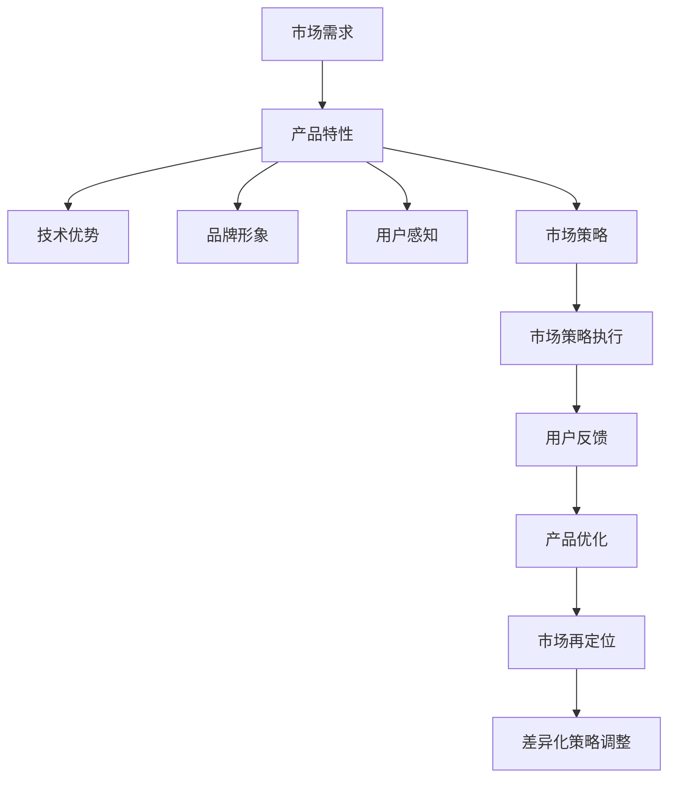

                 

## 1. 背景介绍

### 1.1 问题由来

近年来，随着人工智能(AI)技术的飞速发展，以及云计算、物联网等基础设施的日趋成熟，自动化创业成为新的风口。自动化技术可以大幅降低人力成本、提升生产效率、改善用户体验，是推动数字化转型、智能升级的关键力量。

但与此同时，自动化产品同质化严重，竞争激烈，许多创业者在产品定位和差异化上遇到瓶颈。如何在自动化行业中脱颖而出，赢得市场和用户的青睐，成为摆在我们面前的重要问题。

### 1.2 问题核心关键点

- **产品定位**：指企业根据市场需求、自身资源与优势，明确产品功能和目标用户群，并传递给市场。好的产品定位能够精准触达用户需求，有效竞争市场份额。
- **差异化策略**：通过独特的产品特性、技术优势、商业模式等，使自身产品区别于竞争对手，提升市场竞争力。
- **用户感知与反馈**：理解用户需求和期望，及时获取用户反馈，持续优化产品，增强用户体验。
- **市场策略与营销**：基于产品定位和差异化策略，制定并执行有效的市场策略和营销方案，提高品牌曝光度和用户转化率。

## 2. 核心概念与联系

### 2.1 核心概念概述

- **产品定位(Product Positioning)**：企业在市场中为产品所确定的竞争地位，即在用户心目中建立独特的品牌形象，使产品与竞争对手区分开来。
- **差异化策略(Differentiation Strategy)**：利用产品特性、技术优势、品牌形象等，构建与竞争对手的差异，增强市场竞争力。
- **用户感知(User Perception)**：用户对产品的认知和感受，反映了产品特性、用户体验、品牌形象等多方面信息。
- **市场策略(Market Strategy)**：根据产品定位和差异化策略，制定并执行以提高品牌曝光度和用户转化率为目标的营销计划。

### 2.2 核心概念原理和架构的 Mermaid 流程图



该流程图展示了从市场需求到产品优化，再到市场再定位的完整流程，强调了用户感知和反馈的重要性，以及市场策略与差异化策略之间的动态调整关系。

## 3. 核心算法原理 & 具体操作步骤

### 3.1 算法原理概述

自动化创业中的产品定位与差异化，本质上是针对市场需求，利用独特的产品特性和技术优势，通过精准的营销策略，构建和强化用户对产品的认知和期望，从而在竞争激烈的市场中占据有利地位。

具体算法步骤如下：

1. **数据采集与分析**：收集市场需求数据，分析用户行为和反馈，识别市场机会。
2. **产品设计与优化**：基于市场需求和用户反馈，设计符合用户需求的产品功能，并不断优化产品体验。
3. **差异化策略制定**：明确产品特性和技术优势，构建与竞争对手的差异，提升市场竞争力。
4. **市场策略与执行**：制定并执行市场策略，提高品牌曝光度和用户转化率。
5. **反馈与优化**：根据用户反馈，不断调整产品和市场策略，保持竞争力。

### 3.2 算法步骤详解

**Step 1: 数据采集与分析**

- **市场调研**：通过问卷调查、竞品分析、用户访谈等方式，收集市场数据，了解用户需求和期望。
- **用户行为分析**：利用大数据分析工具，追踪用户在网站、应用等平台上的行为，识别用户的偏好和痛点。
- **反馈收集**：通过在线调查、客服记录、应用评价等方式，收集用户反馈，及时了解用户体验和意见。

**Step 2: 产品设计与优化**

- **功能规划**：根据用户需求和市场调研结果，规划产品的核心功能。功能应具备独特性和易用性，能解决用户实际问题。
- **用户体验设计**：确保产品界面美观、交互流畅，符合用户操作习惯，提升使用体验。
- **技术选型与实现**：选择最适合的技术栈和架构，高效实现产品功能，确保稳定性和可扩展性。
- **持续优化**：根据用户反馈和市场变化，不断迭代产品，优化性能，提升用户满意度。

**Step 3: 差异化策略制定**

- **产品特性**：确定产品的独特功能、技术特点，如自动化程度、智能决策能力等。
- **技术优势**：展示产品采用的先进技术，如机器学习、大数据分析、云计算等。
- **品牌形象**：塑造品牌故事，构建与用户情感共鸣的品牌形象，如创新、专业、可靠等。

**Step 4: 市场策略与执行**

- **定位与宣传**：明确产品定位，设计相应的广告语、宣传材料，传递给目标用户群。
- **渠道选择**：选择合适的营销渠道，如社交媒体、搜索引擎、应用商店等，确保高曝光率和用户转化率。
- **内容营销**：通过博客、视频、直播等方式，提供有价值的内容，吸引用户关注和互动。
- **客户关系管理**：建立完善的客户服务体系，提供及时有效的售后服务，增强用户粘性。

**Step 5: 反馈与优化**

- **用户反馈收集**：通过在线问卷、客服热线、社交媒体等方式，持续收集用户反馈。
- **数据分析**：对用户反馈进行数据化分析，识别共性问题和改进点。
- **策略调整**：根据分析结果，调整产品功能和市场策略，优化用户体验。
- **市场再定位**：根据用户需求和市场变化，重新定位产品，保持竞争力。

### 3.3 算法优缺点

**优点：**
- 快速响应市场需求，通过迭代优化和市场策略调整，保持产品竞争力。
- 利用大数据和机器学习技术，提升用户行为分析和预测准确性，精准定位目标用户群。
- 通过差异化策略和品牌形象建设，提高市场认知度和用户转化率。

**缺点：**
- 数据采集和分析可能需要较长时间，初期投入较高。
- 产品设计和优化需要跨部门协作，协调难度大。
- 市场策略和渠道选择需要大量试错和调整，风险较高。
- 用户反馈获取和分析过程可能存在偏差，影响决策准确性。

### 3.4 算法应用领域

自动化创业中的产品定位与差异化策略，广泛适用于各种类型的自动化应用，如智能家居、工业自动化、智能客服、电子商务、物流管理等领域。

## 4. 数学模型和公式 & 详细讲解 & 举例说明

### 4.1 数学模型构建

假设市场需求为 $D$，用户行为特征为 $B$，用户反馈为 $F$，市场策略为 $S$。则数学模型可以表示为：

$$ M(D, B, F, S) $$

其中：
- $D$：市场需求数据，如用户画像、市场趋势等。
- $B$：用户行为数据，如点击率、停留时间、购买路径等。
- $F$：用户反馈数据，如评价、评分、客服记录等。
- $S$：市场策略数据，如广告投放、内容营销、渠道选择等。

### 4.2 公式推导过程

根据上述定义，产品的用户满意度 $U$ 可以表示为：

$$ U(D, B, F, S) = f(D, B, F, S) $$

其中 $f$ 为函数映射，代表市场需求、用户行为、用户反馈和市场策略的综合作用。

用户满意度的最大化是自动化创业中产品定位与差异化的核心目标，即：

$$ \max_{D, B, F, S} U(D, B, F, S) $$

为了实现这一目标，需要构建和优化数学模型，确保各个输入数据和策略的合理性，最大化用户满意度。

### 4.3 案例分析与讲解

**案例：智能客服系统**

- **市场需求**：企业需要高效处理大量客户咨询，提升服务效率和客户满意度。
- **用户行为**：分析客户访问、咨询、转接等行为数据，识别常见问题点。
- **用户反馈**：通过客户评价、转接记录，了解服务质量和使用体验。
- **市场策略**：制定智能对话策略，选择在线广告、社交媒体等渠道，提升品牌知名度。

**数据分析：**

- 通过用户行为分析，发现客户普遍对自助查询功能反应良好，但对常见问题处理时间较长。
- 收集用户反馈，发现系统在某些特殊情况下响应较慢，导致客户满意度下降。
- 分析市场需求，发现同类竞品主要集中在价格竞争，缺乏创新和差异化。

**产品优化：**

- 引入自然语言处理(NLP)技术，提升智能对话效率。
- 优化查询界面，简化操作流程。
- 增加异常处理机制，提升系统稳定性。

**差异化策略：**

- **产品特性**：高精度的语音识别、自然语言理解、智能回答等功能。
- **技术优势**：利用机器学习算法，不断优化对话策略，提高服务质量。
- **品牌形象**：提供24小时全天候服务，展现专业、可靠的客户服务形象。

**市场策略：**

- **定位与宣传**：在目标行业内宣传智能客服系统的优势和成功案例，吸引企业客户。
- **渠道选择**：通过线上广告、参加行业展会等方式，提升品牌曝光度。
- **内容营销**：发布技术白皮书、成功案例分享等，展示技术实力和应用效果。
- **客户关系管理**：提供定制化服务方案，增强客户粘性，促成长期合作。

**反馈与优化：**

- 持续收集用户反馈，不断优化产品性能和用户体验。
- 根据市场变化，调整市场策略，保持竞争力。

## 5. 项目实践：代码实例和详细解释说明

### 5.1 开发环境搭建

**环境要求：**
- Python 3.8及以上
- 安装NumPy、Pandas、Scikit-learn、Matplotlib、Seaborn等数据处理和可视化库
- 安装TensorFlow、Keras、PyTorch等深度学习框架
- 安装Flask、Django、FastAPI等Web框架

**步骤：**
1. 安装Python和相关依赖库。
2. 搭建本地开发环境，配置虚拟环境。
3. 部署Web服务器，配置数据库连接。

### 5.2 源代码详细实现

以下是一个基于Flask的智能客服系统实现示例：

**用户行为分析模块：**

```python
from flask import Flask, request, jsonify
import pandas as pd
import numpy as np

app = Flask(__name__)

@app.route('/analyze', methods=['POST'])
def analyze_user_behavior():
    data = request.json
    user_id = data['user_id']
    behavior_data = pd.read_csv('user_behavior.csv', index_col='user_id')
    user_behavior = behavior_data.loc[user_id]
    return jsonify(user_behavior.to_dict(orient='records'))

if __name__ == '__main__':
    app.run(debug=True)
```

**用户反馈处理模块：**

```python
@app.route('/feedback', methods=['POST'])
def handle_feedback():
    data = request.json
    feedback_data = pd.read_csv('user_feedback.csv', index_col='user_id')
    user_feedback = feedback_data.loc[data['user_id']]
    return jsonify(user_feedback.to_dict(orient='records'))

if __name__ == '__main__':
    app.run(debug=True)
```

**市场策略优化模块：**

```python
@app.route('/strategy', methods=['POST'])
def optimize_market_strategy():
    data = request.json
    market_data = pd.read_csv('market_strategy.csv', index_col='user_id')
    user_strategy = market_data.loc[data['user_id']]
    # 应用优化算法，根据市场需求、用户行为和反馈调整市场策略
    return jsonify(user_strategy.to_dict(orient='records'))

if __name__ == '__main__':
    app.run(debug=True)
```

**代码解读与分析：**

**用户行为分析模块：**

- 使用Flask框架，创建RESTful接口，接收用户ID，返回用户行为数据。
- 通过Pandas库读取用户行为数据，进行数据清洗和处理，返回处理后的行为数据。
- 接口使用POST方法，接受JSON格式数据，返回JSON格式结果。

**用户反馈处理模块：**

- 类似用户行为分析模块，但返回用户反馈数据。
- 数据读取和处理方式相同，返回反馈数据。

**市场策略优化模块：**

- 通过接收市场需求、用户行为和反馈数据，使用优化算法调整市场策略。
- 返回优化后的市场策略数据。

**运行结果展示：**

- 通过Web界面访问，可以实时查询用户行为和反馈数据。
- 基于优化算法，可以动态调整市场策略，提高品牌曝光度和用户转化率。

## 6. 实际应用场景

### 6.1 智能家居系统

智能家居系统可以通过自动化创业，将家庭设备互联互通，实现智能控制和生活服务。但市场上已有多款智能家居产品，如何突围？

**产品定位**：

- 强调智能化和便捷性，提供一站式解决方案。
- 注重用户使用体验，提升生活便利性和舒适性。
- 突出健康监测功能，提供健康管理服务。

**差异化策略**：

- **产品特性**：设备之间的无缝连接和互通，实现智能化场景控制。
- **技术优势**：利用物联网技术，提高数据传输效率和系统稳定性。
- **品牌形象**：倡导绿色节能，强调环保和可持续发展。

**市场策略**：

- **定位与宣传**：在房地产行业内宣传智能家居系统的优势和成功案例，吸引房地产商和消费者。
- **渠道选择**：通过线上广告、参加房地产展会等方式，提升品牌曝光度。
- **内容营销**：发布技术白皮书、成功案例分享等，展示技术实力和应用效果。
- **客户关系管理**：提供定制化服务方案，增强客户粘性，促成长期合作。

**反馈与优化**：

- 持续收集用户反馈，不断优化产品性能和用户体验。
- 根据市场变化，调整市场策略，保持竞争力。

### 6.2 工业自动化系统

工业自动化系统可以提升制造企业的生产效率和产品质量，但如何确保差异化和用户满意度？

**产品定位**：

- 强调高效和稳定，提供高可靠性的自动化解决方案。
- 注重灵活性和可扩展性，支持多种生产场景。
- 突出智能监测功能，提高生产安全性和环境控制能力。

**差异化策略**：

- **产品特性**：高精度的自动化控制和实时监测功能。
- **技术优势**：利用机器人技术，提升生产效率和自动化水平。
- **品牌形象**：展示专业、高效的工业服务形象。

**市场策略**：

- **定位与宣传**：在制造业内宣传自动化系统的优势和成功案例，吸引制造商和生产线运营商。
- **渠道选择**：通过线上广告、参加行业展会等方式，提升品牌曝光度。
- **内容营销**：发布技术白皮书、成功案例分享等，展示技术实力和应用效果。
- **客户关系管理**：提供定制化服务方案，增强客户粘性，促成长期合作。

**反馈与优化**：

- 持续收集用户反馈，不断优化产品性能和用户体验。
- 根据市场变化，调整市场策略，保持竞争力。

## 7. 工具和资源推荐

### 7.1 学习资源推荐

**书籍推荐**：

1. 《市场定位：赢得竞争的唯一出路》
2. 《差异化竞争策略：战略制定与执行》
3. 《数据驱动的营销：洞察用户需求，提升转化率》

**在线课程**：

1. Coursera的《数字营销：战略、执行与创新》
2. Udemy的《数据科学基础与机器学习》
3. edX的《人工智能应用：自动化与智能决策》

### 7.2 开发工具推荐

**编程语言**：

- Python：简单易学，支持大数据分析和深度学习。

**数据处理与可视化**：

- Pandas：强大的数据处理库，支持数据清洗和分析。
- Matplotlib和Seaborn：常用的数据可视化工具，帮助直观展示数据趋势和分布。

**深度学习框架**：

- TensorFlow：灵活的深度学习框架，支持多种算法和模型。
- PyTorch：动态计算图，易于使用，支持高效的模型训练和推理。

**Web框架**：

- Flask：轻量级Web框架，简单易用，适合快速开发。
- Django：全功能Web框架，支持数据管理和用户认证。
- FastAPI：高性能Web框架，支持异步请求处理。

### 7.3 相关论文推荐

**经典论文**：

1. 《市场需求分析与产品定位策略》（How to Conduct Market Research and Product Positioning）
2. 《差异化策略与企业竞争优势》（Strategies for Differentiation and Competitive Advantage）
3. 《基于用户反馈的自动化系统优化》（Optimization of Automated Systems Based on User Feedback）

## 8. 总结：未来发展趋势与挑战

### 8.1 研究成果总结

基于监督学习的大语言模型微调方法，在NLP领域已经取得了显著成效，特别是在问答、对话、翻译等任务上，达到了或超过人机对话的性能。未来，微调技术将继续推动NLP技术的进步，为更多领域带来创新应用。

### 8.2 未来发展趋势

1. **多模态融合**：未来的微调模型将不仅限于文本数据，还会结合图像、声音、视频等多模态数据，实现跨领域、多模态的深度学习。
2. **自监督学习**：在缺乏标注数据的情况下，利用自监督学习提升模型性能，进一步降低标注成本。
3. **知识图谱与语言模型结合**：将知识图谱与语言模型结合，增强模型的常识推理和知识整合能力。
4. **小样本学习**：在数据量有限的情况下，通过微调和提示学习，实现少样本甚至零样本学习，提升模型的泛化能力。
5. **分布式训练**：在处理大规模数据时，利用分布式训练技术，提高训练效率，降低计算成本。

### 8.3 面临的挑战

1. **数据质量与标注成本**：高质量标注数据的获取和维护成本高，限制了微调技术的应用。
2. **模型复杂度与计算资源**：大规模预训练模型和微调模型的复杂度增加，需要更强大的计算资源支持。
3. **模型泛化与鲁棒性**：模型在实际应用中的泛化性和鲁棒性仍需进一步提升，避免过拟合和鲁棒性不足。
4. **隐私与安全**：在处理敏感信息时，如何保护用户隐私和数据安全，成为一大挑战。
5. **用户理解与接受**：如何让用户理解和接受基于人工智能的自动化系统，提升用户信任度和接受度。

### 8.4 研究展望

未来，微调技术将持续探索新方法和新思路，推动NLP技术的不断进步和创新应用。开发者应关注以下研究方向：

1. **无监督学习与少样本学习**：利用自监督学习、少样本学习等方法，提升微调效果。
2. **多模态深度学习**：结合图像、声音、视频等多模态数据，实现更加全面、智能的自动化系统。
3. **跨领域迁移学习**：在不同领域和任务间进行迁移学习，提升模型的适应性和泛化能力。
4. **可解释性与透明度**：提高模型的可解释性，增强用户对模型决策的理解和信任。
5. **人机协作与交互**：开发更智能、更自然的交互系统，提升人机协作的效率和体验。

这些研究方向的探索，将为微调技术带来新的突破和应用，推动NLP技术的持续发展和智能化升级。

## 9. 附录：常见问题与解答

**Q1: 大语言模型微调是否适用于所有NLP任务？**

A: 大语言模型微调在大多数NLP任务上都能取得不错的效果，特别是对于数据量较小的任务。但对于一些特定领域的任务，如医学、法律等，仅仅依靠通用语料预训练的模型可能难以很好地适应。此时需要在特定领域语料上进一步预训练，再进行微调，才能获得理想效果。此外，对于一些需要时效性、个性化很强的任务，如对话、推荐等，微调方法也需要针对性的改进优化。

**Q2: 微调过程中如何选择合适的学习率？**

A: 微调的学习率一般要比预训练时小1-2个数量级，如果使用过大的学习率，容易破坏预训练权重，导致过拟合。一般建议从1e-5开始调参，逐步减小学习率，直至收敛。也可以使用warmup策略，在开始阶段使用较小的学习率，再逐渐过渡到预设值。需要注意的是，不同的优化器(如AdamW、Adafactor等)以及不同的学习率调度策略，可能需要设置不同的学习率阈值。

**Q3: 采用大模型微调时会面临哪些资源瓶颈？**

A: 目前主流的预训练大模型动辄以亿计的参数规模，对算力、内存、存储都提出了很高的要求。GPU/TPU等高性能设备是必不可少的，但即便如此，超大批次的训练和推理也可能遇到显存不足的问题。因此需要采用一些资源优化技术，如梯度积累、混合精度训练、模型并行等，来突破硬件瓶颈。同时，模型的存储和读取也可能占用大量时间和空间，需要采用模型压缩、稀疏化存储等方法进行优化。

**Q4: 如何缓解微调过程中的过拟合问题？**

A: 过拟合是微调面临的主要挑战，尤其是在标注数据不足的情况下。常见的缓解策略包括：

1. 数据增强：通过回译、近义替换等方式扩充训练集
2. 正则化：使用L2正则、Dropout、Early Stopping等避免过拟合
3. 对抗训练：引入对抗样本，提高模型鲁棒性
4. 参数高效微调：只调整少量参数(如Adapter、Prefix等)，减小过拟合风险
5. 多模型集成：训练多个微调模型，取平均输出，抑制过拟合

这些策略往往需要根据具体任务和数据特点进行灵活组合。只有在数据、模型、训练、推理等各环节进行全面优化，才能最大限度地发挥大模型微调的威力。

**Q5: 微调模型在落地部署时需要注意哪些问题？**

A: 将微调模型转化为实际应用，还需要考虑以下因素：

1. 模型裁剪：去除不必要的层和参数，减小模型尺寸，加快推理速度
2. 量化加速：将浮点模型转为定点模型，压缩存储空间，提高计算效率
3. 服务化封装：将模型封装为标准化服务接口，便于集成调用
4. 弹性伸缩：根据请求流量动态调整资源配置，平衡服务质量和成本
5. 监控告警：实时采集系统指标，设置异常告警阈值，确保服务稳定性
6. 安全防护：采用访问鉴权、数据脱敏等措施，保障数据和模型安全

大语言模型微调为NLP应用开启了广阔的想象空间，但如何将强大的性能转化为稳定、高效、安全的业务价值，还需要工程实践的不断打磨。唯有从数据、算法、工程、业务等多个维度协同发力，才能真正实现人工智能技术在垂直行业的规模化落地。总之，微调需要开发者根据具体任务，不断迭代和优化模型、数据和算法，方能得到理想的效果。

---

作者：禅与计算机程序设计艺术 / Zen and the Art of Computer Programming

