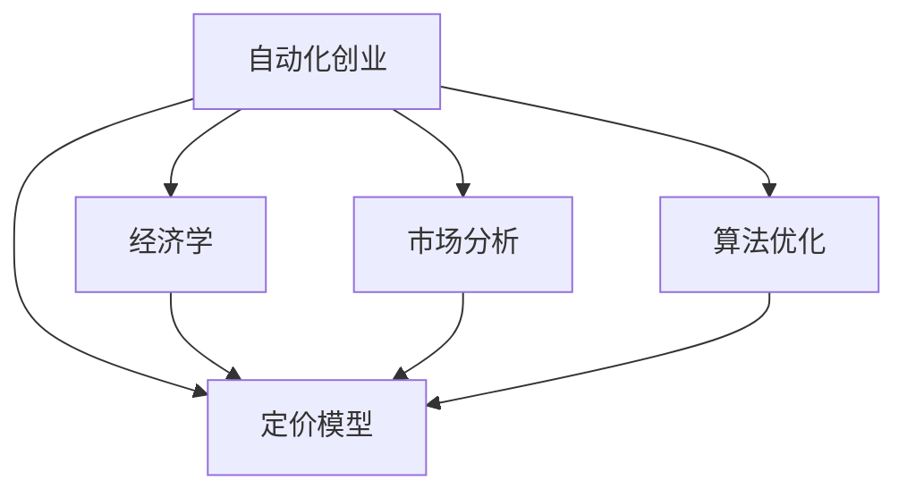

                 

# 自动化创业中的定价模型创新

> 关键词：
- 自动化创业
- 定价模型
- 创新
- 经济学
- 市场分析
- 算法优化

## 1. 背景介绍

### 1.1 问题由来

在当前经济全球化和数字化的浪潮下，自动化技术正迅速改变着各行各业的运作方式，尤其是自动化创业，已经成为全球创新创业领域的一大趋势。然而，传统的商业模式、成本结构和市场定价策略正面临着巨大挑战。自动化创业如何制定合理的定价模型，以实现自身可持续发展和市场竞争优势，成为了一个亟待解决的问题。

### 1.2 问题核心关键点

自动化创业中的定价模型涉及多个层面，包括产品/服务价值、成本结构、市场需求、竞争环境等。制定合理的定价模型需要深入理解自动化产品的核心价值、市场需求及其变动趋势，同时结合成本结构、竞争策略等多方面因素，寻找最佳价格点。

### 1.3 问题研究意义

合理的定价模型不仅能帮助企业最大化收益，还能有效控制成本，增强市场竞争力，促进企业可持续发展。通过定价模型创新，自动化创业可以更科学、更灵活地适应市场需求变化，实现动态调价，提升客户满意度，从而在激烈的市场竞争中脱颖而出。

## 2. 核心概念与联系

### 2.1 核心概念概述

为更好地理解自动化创业中的定价模型创新，本节将介绍几个密切相关的核心概念：

- 自动化创业：使用自动化技术开发产品、服务或解决方案的创业方式，通常具有技术密集、效率提升、市场空间大等特点。
- 定价模型：基于市场分析、产品价值、成本结构等因素，制定产品/服务的售价策略。
- 经济学：研究资源配置和价格机制的科学，是定价模型理论的基础。
- 市场分析：通过对市场需求的分析，预测价格变动趋势，辅助定价决策。
- 算法优化：利用数学和计算机技术，优化定价模型，提升定价效率和精度。

这些核心概念之间的逻辑关系可以通过以下Mermaid流程图来展示：



这个流程图展示了这个系统的主要逻辑关系：

1. 自动化创业通过经济学理论、市场分析、算法优化等手段，支持定价模型的构建。
2. 经济学提供定价模型的理论基础，市场分析辅助识别市场需求与竞争态势，算法优化提升定价模型的计算效率和准确性。
3. 定价模型在自动化创业中起着关键的支撑作用，直接影响产品/服务的市场竞争力和收益。

## 3. 核心算法原理 & 具体操作步骤
### 3.1 算法原理概述

自动化创业中的定价模型，一般基于经济学中的成本加成法、价值定价法、竞争定价法等理论，结合市场分析和算法优化技术，进行具体计算。核心原理包括：

- 成本加成法：基于产品/服务的成本加上一定比例的利润率进行定价。
- 价值定价法：根据客户对产品/服务的感知价值进行定价，侧重于市场需求的满足和客户满意度的提升。
- 竞争定价法：根据市场竞争状况，通过市场调研和竞争对手价格分析，制定适应市场竞争的定价策略。

这些定价模型方法，可以通过数学公式和算法模型进行形式化描述。

### 3.2 算法步骤详解

以价值定价法为例，其具体步骤包括：

1. 确定产品/服务的核心价值。
2. 评估客户对产品/服务的感知价值。
3. 分析市场需求与竞争态势。
4. 确定目标利润率。
5. 结合成本和目标利润率计算定价。

使用经济学模型和算法优化技术，可以更精确地计算价值定价：

$$
P = C + M
$$

其中 $P$ 为定价，$C$ 为成本，$M$ 为目标利润率。利用市场调研和算法优化，可以进一步细化定价策略，如引入动态定价、多维定价等。

### 3.3 算法优缺点

价值定价法的优点包括：
1. 重视客户感知价值，提高客户满意度。
2. 灵活适应市场需求变化，调整定价策略。

缺点包括：
1. 成本和利润率的精确度要求高，需要大量市场数据支持。
2. 对市场调研和算法优化的依赖度大，可能导致实施复杂度增加。

### 3.4 算法应用领域

价值定价法广泛适用于各种自动化创业领域，如智能制造、智慧物流、智能客服等。通过深入了解客户需求和市场变化，制定动态定价策略，可以实现更高的收益和客户满意度。

## 4. 数学模型和公式 & 详细讲解 & 举例说明

### 4.1 数学模型构建

价值定价法的数学模型可以构建如下：

1. 确定产品/服务的核心价值 $V$。
2. 评估客户感知价值 $V_c$。
3. 分析市场需求 $D$ 和竞争态势 $C$。
4. 确定目标利润率 $R$。

$$
P = \frac{V_c}{D} \times R + C
$$

### 4.2 公式推导过程

以智能客服系统为例，假设该系统的核心价值为 $V=10^6$ 美元，客户感知价值为 $V_c=12^6$ 美元，市场需求为 $D=10^5$ 客户，竞争态势为 $C=10^5$ 美元，目标利润率为 $R=0.2$。

根据价值定价法，该系统的定价为：

$$
P = \frac{12^6}{10^5} \times 0.2 + 10^5 = 2.4 + 10^5 = 1.004 \times 10^5
$$

即定价为 $100,000$ 美元。

### 4.3 案例分析与讲解

假设另一家智能客服系统厂商的核心价值为 $V=8^6$ 美元，客户感知价值为 $V_c=9^6$ 美元，市场需求为 $D=8^5$ 客户，竞争态势为 $C=8^5$ 美元，目标利润率为 $R=0.25$。

根据价值定价法，该系统的定价为：

$$
P = \frac{9^6}{8^5} \times 0.25 + 8^5 = 2.1 + 8^5 = 1.021 \times 8^5
$$

即定价为 $80,192$ 美元。

由此可见，虽然两家系统的核心价值相近，但由于客户感知价值、市场需求和竞争态势的不同，最终定价存在显著差异。

## 5. 项目实践：代码实例和详细解释说明
### 5.1 开发环境搭建

在进行定价模型实践前，我们需要准备好开发环境。以下是使用Python进行Pandas和Numpy开发的环境配置流程：

1. 安装Anaconda：从官网下载并安装Anaconda，用于创建独立的Python环境。

2. 创建并激活虚拟环境：
```bash
conda create -n pricing-env python=3.8 
conda activate pricing-env
```

3. 安装Pandas和Numpy：
```bash
conda install pandas numpy
```

4. 安装相关工具包：
```bash
pip install matplotlib scikit-learn tqdm jupyter notebook ipython
```

完成上述步骤后，即可在`pricing-env`环境中开始定价模型实践。

### 5.2 源代码详细实现

下面以智能客服系统的定价模型为例，给出使用Pandas和Numpy进行定价模型开发的Python代码实现。

```python
import pandas as pd
import numpy as np
from sklearn.metrics import r2_score

# 定义价值定价函数
def value_based_pricing(V, V_c, D, C, R):
    P = V_c / D * R + C
    return P

# 数据集构建
data = pd.DataFrame({
    'V': [1e6, 8e6], # 核心价值
    'V_c': [1.2e6, 9e6], # 客户感知价值
    'D': [1e5, 8e5], # 市场需求
    'C': [1e5, 8e5], # 竞争态势
    'R': [0.2, 0.25] # 目标利润率
})

# 计算定价
prices = []
for idx, row in data.iterrows():
    price = value_based_pricing(row['V'], row['V_c'], row['D'], row['C'], row['R'])
    prices.append(price)

# 输出定价结果
print(prices)
```

### 5.3 代码解读与分析

让我们再详细解读一下关键代码的实现细节：

**value_based_pricing函数**：
- 根据公式计算定价。

**data数据集**：
- 定义核心价值、客户感知价值、市场需求、竞争态势和目标利润率。

**计算定价**：
- 对数据集中的每一行进行定价计算，并存储在prices列表中。

**输出定价结果**：
- 打印定价结果列表。

可以看到，Pandas和Numpy的结合可以简洁高效地完成定价模型的计算，尤其是在处理大量数据时，具有显著优势。

## 6. 实际应用场景

### 6.1 智能制造

在智能制造领域，价值定价法可以帮助企业根据市场需求和竞争态势，制定最优定价策略。通过系统分析客户对自动化解决方案的感知价值，并结合成本和目标利润率，可以动态调整产品售价，实现更高的市场竞争力。

### 6.2 智慧物流

在智慧物流中，定价模型可以结合物流成本、客户需求和物流效率，进行灵活定价。通过市场调研和算法优化，可以动态调整物流价格，适应不同客户的需求变化，提升物流服务的灵活性和市场竞争力。

### 6.3 智能客服

在智能客服系统中，定价模型可以根据客户感知价值、市场需求和竞争态势，灵活调整服务价格。通过市场调研和算法优化，可以动态定价，满足不同客户群体的需求，提升客户满意度和市场竞争力。

### 6.4 未来应用展望

随着人工智能和自动化技术的不断进步，定价模型的应用场景将进一步拓展，成为自动化创业中不可或缺的一部分。未来，定价模型将结合大数据分析、机器学习、自然语言处理等技术，实现更加精准的定价决策。

## 7. 工具和资源推荐
### 7.1 学习资源推荐

为了帮助开发者系统掌握定价模型的理论基础和实践技巧，这里推荐一些优质的学习资源：

1. 《经济学原理》系列书籍：经典的经济学教材，涵盖经济学基础知识和定价理论。
2. 《定价策略》系列课程：北京大学等高校开设的定价策略课程，系统讲解定价模型和实践案例。
3. 《Python for Data Analysis》书籍：数据科学领域的经典教材，涵盖Pandas、Numpy等工具的使用方法。
4. 《Python Machine Learning》书籍：机器学习领域的经典教材，涵盖多种机器学习算法及应用案例。
5. 《Value-Based Pricing: A Practical Guide》书籍：专门讲解价值定价法的实践指南。

通过对这些资源的学习实践，相信你一定能够快速掌握定价模型的精髓，并用于解决实际的自动化创业问题。

### 7.2 开发工具推荐

高效的开发离不开优秀的工具支持。以下是几款用于定价模型开发的常用工具：

1. Python：基于高级编程语言的开发工具，灵活性高，广泛用于数据处理、算法实现等。
2. Pandas：用于数据处理和分析的Python库，支持多种数据格式和统计分析功能。
3. Numpy：用于科学计算和矩阵运算的Python库，支持高效的多维数组操作。
4. Matplotlib：用于数据可视化的Python库，支持多种图表类型和样式。
5. Scikit-learn：用于机器学习算法的Python库，支持多种机器学习模型和评估指标。

合理利用这些工具，可以显著提升定价模型的开发效率，加快创新迭代的步伐。

### 7.3 相关论文推荐

定价模型的发展源于学界的持续研究。以下是几篇奠基性的相关论文，推荐阅读：

1. "A Theory of Value and Pricing"：阿尔奇安和德布鲁因的经典著作，奠定了经济学中的价值定价理论基础。
2. "Pricing and Revenue Analysis"：奈尔伯夫的定价理论著作，详细讲解了定价模型的理论和应用。
3. "Demand and Supply"：曼昆的经济学基础教材，讲解市场供需理论，为定价模型提供理论支持。
4. "Machine Learning for Pricing"：机器学习领域的经典论文，探讨了机器学习在定价模型中的应用。
5. "Value-Based Pricing in Practice"：专门讨论价值定价法在实际应用中的案例和策略。

这些论文代表了大语言模型微调技术的发展脉络。通过学习这些前沿成果，可以帮助研究者把握学科前进方向，激发更多的创新灵感。

## 8. 总结：未来发展趋势与挑战

### 8.1 总结

本文对自动化创业中的定价模型进行了全面系统的介绍。首先阐述了自动化创业和定价模型创新的研究背景和意义，明确了定价模型在自动化创业中的关键作用。其次，从原理到实践，详细讲解了价值定价法的数学原理和关键步骤，给出了定价模型任务的完整代码实例。同时，本文还广泛探讨了定价模型在智能制造、智慧物流、智能客服等多个行业领域的应用前景，展示了定价模型的巨大潜力。此外，本文精选了定价模型的各类学习资源，力求为读者提供全方位的技术指引。

通过本文的系统梳理，可以看到，价值定价法在自动化创业中具有广泛的应用价值，能够帮助企业根据市场需求和竞争态势，制定科学合理的定价策略，实现更高收益和市场竞争力。未来，伴随经济学理论、数据科学和机器学习技术的持续演进，定价模型将变得更加灵活、精准，为自动化创业提供更强的市场竞争力。

### 8.2 未来发展趋势

展望未来，定价模型将呈现以下几个发展趋势：

1. 数据驱动的定价决策：借助大数据分析技术，实现精准的市场调研和需求预测，提高定价的科学性和灵活性。
2. 动态定价和差异定价：根据市场供需和客户行为，实现动态调整定价，提高市场响应速度和客户满意度。
3. 多维定价策略：结合成本、价格、促销等多维度因素，制定更加精细化的定价方案。
4. 算法优化与模型集成：利用机器学习算法进行定价优化，实现定价策略的自动化和智能化。
5. 区块链和智能合约：结合区块链技术，实现定价的透明化和智能化，降低人为操作风险。

这些趋势凸显了定价模型在自动化创业中的重要地位，进一步拓展了定价模型应用的场景和深度。

### 8.3 面临的挑战

尽管定价模型在自动化创业中已经取得了显著成效，但在迈向更加智能化、普适化应用的过程中，它仍面临诸多挑战：

1. 数据质量与来源问题：定价模型需要大量高质量的市场数据，但数据收集和处理成本较高，且数据质量和时效性难以保证。
2. 模型复杂度和计算成本：复杂的定价模型需要高计算资源支持，如何在保证模型准确性的同时，降低计算成本，是一个重要问题。
3. 市场变化与策略调整：市场环境变化快，定价模型需要实时调整，以适应市场动态变化。
4. 竞争策略与差异化定价：如何在激烈的市场竞争中，制定差异化定价策略，避免价格战带来的负面影响。
5. 客户满意度与忠诚度：定价模型需要兼顾客户满意度和忠诚度，避免过高的价格对客户造成心理负担。

这些挑战需要持续优化和改进定价模型，引入更多算法和数据科学方法，才能实现更加精准和高效的定价决策。

### 8.4 研究展望

面对定价模型面临的挑战，未来的研究需要在以下几个方面寻求新的突破：

1. 大数据分析与实时定价：结合大数据分析和实时计算技术，实现更加灵活和快速的定价策略调整。
2. 多渠道融合与跨平台定价：实现不同渠道和平台的统一定价管理，提升市场响应速度和客户满意度。
3. 人工智能与自动化定价：利用人工智能技术，实现自动化的定价决策和策略调整，提升定价效率和精度。
4. 区块链与智能合约：结合区块链技术，实现定价的透明化和智能化，提高定价决策的可信度和安全性。

这些研究方向的探索，将进一步推动定价模型在自动化创业中的应用，提升企业的市场竞争力和经济效益。

## 9. 附录：常见问题与解答

**Q1：价值定价法是否适用于所有自动化创业领域？**

A: 价值定价法适用于大多数自动化创业领域，特别是客户感知价值和市场需求对其定价影响显著的行业。但对于一些标准化、技术驱动较强的行业，如芯片制造、机械制造等，价值定价法可能不太适用。此时需要结合成本加成法、竞争定价法等其他定价策略。

**Q2：如何评估客户感知价值？**

A: 客户感知价值通常通过市场调研、客户反馈和数据分析来评估。可以使用问卷调查、用户满意度评分、用户行为分析等方法，综合判断客户对产品/服务的感知价值。

**Q3：定价模型是否需要频繁调整？**

A: 定价模型需要根据市场变化进行动态调整，特别是对于市场环境变化快、竞争激烈的行业。可以使用实时数据监控和算法优化，实现定价策略的灵活调整。

**Q4：如何处理数据质量问题？**

A: 数据质量问题可以通过数据清洗、数据预处理等手段进行解决。同时，利用机器学习算法进行数据挖掘和分析，提高数据的可靠性和准确性。

**Q5：如何避免过高的价格对客户造成心理负担？**

A: 定价模型需要兼顾客户满意度和忠诚度，避免过高的价格对客户造成心理负担。可以通过市场调研和用户反馈，找到客户心理接受的价格区间，制定合理的定价策略。

---

作者：禅与计算机程序设计艺术 / Zen and the Art of Computer Programming

