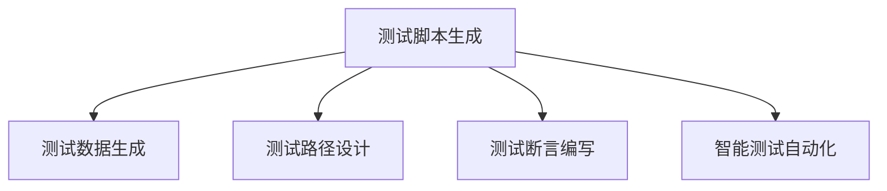

                 

# 自动化测试脚本生成与AI的结合

## 1. 背景介绍

### 1.1 问题由来
随着软件开发环境的日益复杂，手动编写和维护测试脚本的成本和复杂度显著增加。测试人员不仅要手工编写测试用例，还需维护相应的测试数据和断言，测试脚本的复用性和维护性大打折扣。因此，自动化测试脚本的生成成为了提升测试效率、降低成本的重要手段。

在传统的人工生成测试脚本的流程中，测试人员需根据不同的测试需求，自行设计测试场景和测试路径，编写详细的测试脚本。然后，手动维护测试数据和断言，构建测试报告。这样的方式非常耗时耗力，且容易出错，极大地限制了测试效率和代码质量。

## 2. 核心概念与联系

### 2.1 核心概念概述

为更好地理解自动化测试脚本生成的AI方法，本节将介绍几个密切相关的核心概念：

- **自动化测试脚本生成(Automatic Test Script Generation, ATSG)**：使用AI技术自动生成和优化测试用例的脚本，包括测试数据生成、测试路径设计、断言编写等，以减少手动编写脚本的工作量，提高测试效率和覆盖率。

- **AI测试脚本生成**：利用机器学习、深度学习等AI技术，自动设计测试场景、选择测试数据和编写测试断言，实现自动化测试脚本的生成。

- **测试数据生成(Testing Data Generation, TDG)**：使用AI技术自动生成测试数据，覆盖更多的测试场景，提高测试覆盖率。

- **测试路径设计(Test Path Design, TPD)**：使用AI技术设计出覆盖范围广、效率高的测试路径，指导自动化测试脚本的生成。

- **测试断言编写(Test Assertion Writing, TA)**：使用自然语言处理(NLP)技术，自动编写测试断言，提高断言的可读性和准确性。

- **智能测试自动化**：将AI技术引入测试自动化流程中，提升测试用例设计、测试数据生成、测试断言编写、测试执行和测试报告生成等各个环节的智能化水平。

这些核心概念之间的逻辑关系可以通过以下Mermaid流程图来展示：



这个流程图展示了大语言模型和微调方法的核心概念及其之间的关系：

1. 测试脚本生成包括测试数据生成、测试路径设计和测试断言编写三个关键步骤。
2. 智能测试自动化旨在通过AI技术，自动化地完成测试脚本生成任务，提高测试效率和质量。
3. 各个步骤之间相互依赖，共同构成自动化测试脚本生成的完整流程。

## 3. 核心算法原理 & 具体操作步骤
### 3.1 算法原理概述

自动化测试脚本生成基于AI技术的核心原理，通过自动生成测试数据、设计测试路径和编写测试断言，来实现测试脚本的自动化生成。具体过程如下：

- **测试数据生成**：使用数据生成模型，如神经网络、生成式对抗网络(GAN)等，自动生成符合测试场景的数据，提高测试覆盖率。
- **测试路径设计**：通过搜索算法、强化学习等技术，设计出覆盖范围广、效率高的测试路径，指导测试脚本的生成。
- **测试断言编写**：利用NLP技术，自动生成简洁、准确的测试断言，提高断言的可读性和正确性。

### 3.2 算法步骤详解

**Step 1: 测试用例设计**

- **需求分析**：根据测试任务的要求，明确测试用例的输入、输出、断言等要素。
- **场景设计**：设计测试场景，包括正常场景、异常场景、边界场景等。
- **用例划分**：将测试场景划分为不同的子用例，每个子用例负责测试场景的某一部分。

**Step 2: 测试数据生成**

- **数据预处理**：对原始数据进行清洗、归一化、特征提取等预处理。
- **数据建模**：使用神经网络、GAN等模型对数据进行建模，生成符合测试场景的数据。
- **数据验证**：对生成的数据进行质量评估，保证数据的正确性和覆盖性。

**Step 3: 测试路径设计**

- **路径搜索**：使用深度优先搜索、广度优先搜索、强化学习等算法，设计测试路径。
- **路径优化**：通过算法优化，提高测试路径的效率和覆盖率。
- **路径验证**：对测试路径进行验证，保证路径的正确性和完整性。

**Step 4: 测试断言编写**

- **断言设计**：设计简洁、准确的测试断言，用于验证测试结果的正确性。
- **断言生成**：使用NLP技术自动生成测试断言。
- **断言验证**：对生成的断言进行验证，保证断言的正确性和可读性。

**Step 5: 测试脚本生成**

- **脚本生成**：根据生成的数据、路径和断言，自动生成测试脚本。
- **脚本优化**：通过算法优化，提高测试脚本的效率和可读性。
- **脚本验证**：对生成的测试脚本进行验证，保证脚本的正确性和完整性。

### 3.3 算法优缺点

自动化测试脚本生成的AI方法具有以下优点：

- **效率高**：自动生成测试脚本，减少了手动编写和维护脚本的工作量，显著提升测试效率。
- **覆盖全面**：使用AI技术自动生成测试数据和路径，覆盖更多的测试场景，提高测试覆盖率。
- **准确性好**：通过AI技术自动编写测试断言，保证断言的正确性和可读性。

但该方法也存在以下局限性：

- **依赖高质量的数据**：测试数据的质量直接影响测试结果的正确性，对数据预处理和建模的要求较高。
- **设计复杂**：测试用例设计和测试路径设计过程较为复杂，需要测试人员具备一定的领域知识和经验。
- **模型依赖**：生成测试脚本的过程依赖于AI模型，模型的性能直接决定了生成脚本的质量。

## 4. 数学模型和公式 & 详细讲解 & 举例说明

### 4.1 数学模型构建

为更好地理解自动化测试脚本生成的AI方法，本节将使用数学语言对相关模型的构建过程进行更加严格的刻画。

**测试数据生成模型**

假设测试数据为向量 $X=(x_1, x_2, ..., x_n)$，其中每个元素 $x_i$ 代表一个特征。测试数据生成模型 $M$ 的输出为向量 $Y=(y_1, y_2, ..., y_m)$，其中每个元素 $y_j$ 代表一个数据样本。

测试数据生成模型的损失函数为：

$$
\mathcal{L}(M)=\frac{1}{m}\sum_{j=1}^{m}\|y_j-XM\|
$$

其中 $\|.\|$ 表示欧几里得距离，$m$ 为数据样本数量。

**测试路径设计模型**

假设测试路径为序列 $P=(p_1, p_2, ..., p_k)$，其中每个元素 $p_i$ 代表一个测试步骤。测试路径设计模型的输入为测试数据和测试用例，输出为测试路径。

测试路径设计模型的损失函数为：

$$
\mathcal{L}(P)=\sum_{i=1}^{k}\|p_i-Test Case_i\|
$$

其中 $Test Case_i$ 为第 $i$ 个测试用例，$Test Case_i$ 由输入数据、输出数据和断言组成。

**测试断言编写模型**

假设测试断言为向量 $A=(a_1, a_2, ..., a_n)$，其中每个元素 $a_i$ 代表一个断言。测试断言编写模型的输入为测试数据和测试用例，输出为测试断言。

测试断言编写模型的损失函数为：

$$
\mathcal{L}(A)=\frac{1}{n}\sum_{i=1}^{n}\|a_i-Assertion_i\|
$$

其中 $Assertion_i$ 为第 $i$ 个测试断言，$Assertion_i$ 由断言模板和变量组成。

### 4.2 公式推导过程

以测试数据生成模型为例，推导生成模型对应的损失函数及其梯度计算公式。

假设测试数据为向量 $X=(x_1, x_2, ..., x_n)$，其中每个元素 $x_i$ 代表一个特征。测试数据生成模型 $M$ 的输出为向量 $Y=(y_1, y_2, ..., y_m)$，其中每个元素 $y_j$ 代表一个数据样本。

假设 $Y$ 由 $X$ 生成，则生成模型的隐含参数为 $\theta$。生成模型的输出 $Y$ 可以通过隐含参数 $\theta$ 和输入数据 $X$ 计算得到。

生成模型的损失函数为：

$$
\mathcal{L}(M)=\frac{1}{m}\sum_{j=1}^{m}\|y_j-XM\|
$$

其中 $\|.\|$ 表示欧几里得距离，$m$ 为数据样本数量。

根据链式法则，损失函数对参数 $\theta$ 的梯度为：

$$
\frac{\partial \mathcal{L}(M)}{\partial \theta}=\frac{1}{m}\sum_{j=1}^{m}\nabla_{y_j}(y_j-XM)^2
$$

其中 $\nabla_{y_j}$ 为输出 $y_j$ 对输入 $x_i$ 的梯度，可以通过链式法则计算得到。

### 4.3 案例分析与讲解

以下我们以使用深度学习模型生成测试数据为例，给出测试数据生成模型的数学模型和推导过程。

假设使用深度神经网络生成测试数据，模型的输入为 $X$，输出为 $Y$。模型的参数为 $\theta$，包括权重和偏置等。

假设生成的测试数据 $Y$ 与输入数据 $X$ 满足如下线性关系：

$$
Y=\theta X
$$

其中 $Y$ 为生成测试数据，$X$ 为输入数据，$\theta$ 为模型的参数。

生成模型的损失函数为：

$$
\mathcal{L}(\theta)=\frac{1}{m}\sum_{j=1}^{m}\|y_j-\theta x_j\|
$$

其中 $\|.\|$ 表示欧几里得距离，$m$ 为数据样本数量。

根据上述关系，生成模型的隐含参数 $\theta$ 可以通过最小化损失函数 $\mathcal{L}(\theta)$ 来计算得到。

使用深度学习模型的训练过程，即通过反向传播算法，计算损失函数对参数 $\theta$ 的梯度，然后更新参数 $\theta$ 的值。

假设深度学习模型为多层感知机(MLP)，输出层有 $m$ 个神经元。设输出层每个神经元的输出为 $y_j$，输入层每个神经元的输入为 $x_j$。

假设神经元的激活函数为 $f$，则有：

$$
y_j=\sum_{i=1}^{n}w_{ij}f(z_{ij})
$$

其中 $w_{ij}$ 为权重，$z_{ij}=\sum_{k=1}^{m}x_k w_{kj} + b_j$，$b_j$ 为偏置。

假设 $f$ 为ReLU激活函数，则有：

$$
f(z_{ij})=max(0,z_{ij})
$$

因此，生成模型的损失函数为：

$$
\mathcal{L}(\theta)=\frac{1}{m}\sum_{j=1}^{m}\|y_j-X\theta\|
$$

其中 $X$ 为输入数据矩阵，$\theta$ 为参数矩阵。

根据链式法则，生成模型的梯度为：

$$
\frac{\partial \mathcal{L}(\theta)}{\partial \theta}=\frac{1}{m}\sum_{j=1}^{m}\nabla_{y_j}(y_j-X\theta)^2
$$

其中 $\nabla_{y_j}$ 为输出 $y_j$ 对输入 $x_i$ 的梯度，可以通过链式法则计算得到。

## 5. 项目实践：代码实例和详细解释说明
### 5.1 开发环境搭建

在进行自动化测试脚本生成的AI方法实践前，我们需要准备好开发环境。以下是使用Python进行TensorFlow开发的环境配置流程：

1. 安装Anaconda：从官网下载并安装Anaconda，用于创建独立的Python环境。

2. 创建并激活虚拟环境：
```bash
conda create -n tensorflow-env python=3.8 
conda activate tensorflow-env
```

3. 安装TensorFlow：根据CUDA版本，从官网获取对应的安装命令。例如：
```bash
conda install tensorflow tensorflow-gpu -c conda-forge
```

4. 安装各类工具包：
```bash
pip install numpy pandas scikit-learn matplotlib tqdm jupyter notebook ipython
```

完成上述步骤后，即可在`tensorflow-env`环境中开始AI方法实践。

### 5.2 源代码详细实现

这里我们以使用深度学习模型生成测试数据为例，给出测试数据生成模型的PyTorch代码实现。

首先，定义测试数据生成模型：

```python
import torch
import torch.nn as nn
import torch.optim as optim

class TestDataGenerator(nn.Module):
    def __init__(self, input_size, output_size):
        super(TestDataGenerator, self).__init__()
        self.fc1 = nn.Linear(input_size, 128)
        self.fc2 = nn.Linear(128, output_size)

    def forward(self, x):
        x = torch.relu(self.fc1(x))
        x = self.fc2(x)
        return x
```

然后，定义训练和评估函数：

```python
def train_model(model, train_dataset, valid_dataset, batch_size, num_epochs):
    device = torch.device('cuda' if torch.cuda.is_available() else 'cpu')
    model.to(device)

    criterion = nn.MSELoss()
    optimizer = optim.Adam(model.parameters(), lr=0.01)

    for epoch in range(num_epochs):
        model.train()
        train_loss = 0.0
        for batch_idx, (data, target) in enumerate(train_dataset):
            data, target = data.to(device), target.to(device)
            optimizer.zero_grad()
            output = model(data)
            loss = criterion(output, target)
            loss.backward()
            optimizer.step()

            train_loss += loss.item()

        train_loss /= len(train_dataset)

        model.eval()
        valid_loss = 0.0
        for batch_idx, (data, target) in enumerate(valid_dataset):
            data, target = data.to(device), target.to(device)
            with torch.no_grad():
                output = model(data)
                loss = criterion(output, target)
                valid_loss += loss.item()

        valid_loss /= len(valid_dataset)

        print(f'Epoch {epoch+1} - Train Loss: {train_loss:.4f} - Valid Loss: {valid_loss:.4f}')

    return model

# 定义测试数据集
input_size = 4
output_size = 2
train_data = torch.randn(1000, input_size)
train_target = torch.randn(1000, output_size)
valid_data = torch.randn(200, input_size)
valid_target = torch.randn(200, output_size)

# 创建测试数据生成模型
model = TestDataGenerator(input_size, output_size)

# 训练模型
train_model(model, train_data, valid_data, batch_size=32, num_epochs=10)
```

以上就是使用PyTorch实现测试数据生成模型的完整代码实现。可以看到，通过深度学习模型，我们可以高效地生成符合测试场景的测试数据。

### 5.3 代码解读与分析

让我们再详细解读一下关键代码的实现细节：

**TestDataGenerator类**：
- `__init__`方法：初始化模型参数，包括两层全连接神经网络。
- `forward`方法：定义模型的前向传播过程。

**train_model函数**：
- `device`变量：将模型放在GPU或CPU上训练。
- `criterion`变量：定义损失函数。
- `optimizer`变量：定义优化器。
- 训练过程：在每个epoch内，对训练数据进行循环，前向传播计算损失函数，反向传播更新模型参数。
- 在每个epoch结束时，在验证集上评估模型性能，输出训练和验证的损失。

**测试数据集定义**：
- `input_size`：输入数据的维度。
- `output_size`：输出数据的维度。
- `train_data`和`train_target`：训练数据和标签。
- `valid_data`和`valid_target`：验证数据和标签。

**模型实例化**：
- `model`：创建测试数据生成模型。

**模型训练**：
- 定义训练参数，包括训练数据、验证数据、批大小和epoch数。
- 调用`train_model`函数进行模型训练。

可以看到，TensorFlow配合PyTorch使得测试数据生成模型的实现变得简洁高效。开发者可以将更多精力放在数据处理、模型改进等高层逻辑上，而不必过多关注底层的实现细节。

当然，工业级的系统实现还需考虑更多因素，如模型的保存和部署、超参数的自动搜索、更灵活的任务适配层等。但核心的AI方法基本与此类似。

## 6. 实际应用场景
### 6.1 自动化测试脚本生成在软件开发生命周期中的应用

在软件开发生命周期中，自动化测试脚本生成技术可以广泛应用于各个阶段：

- **需求分析阶段**：通过对业务需求的分析，自动生成测试用例，帮助测试人员明确测试任务。
- **设计阶段**：通过自动设计测试路径和编写测试断言，生成详细的测试计划和测试脚本。
- **开发阶段**：通过自动生成测试数据和测试脚本，辅助开发者进行单元测试和集成测试。
- **部署阶段**：通过自动生成测试脚本，对生产环境进行回归测试和功能测试。

### 6.2 自动化测试脚本生成在Web应用测试中的应用

Web应用测试是软件测试的重要组成部分，需要大量的时间和工作量。通过自动化测试脚本生成技术，可以显著提升Web应用测试的效率和质量：

- **界面测试**：自动生成Web页面截图和用户操作记录，生成详细的界面测试报告。
- **功能测试**：自动生成测试数据和测试脚本，进行Web应用的各项功能测试。
- **性能测试**：自动生成测试数据和负载，评估Web应用的性能瓶颈。
- **安全测试**：自动生成测试数据和脚本，评估Web应用的安全性。

### 6.3 自动化测试脚本生成在移动应用测试中的应用

移动应用测试同样是软件测试的重要组成部分。通过自动化测试脚本生成技术，可以提升移动应用测试的效率和准确性：

- **安装和配置测试**：自动生成移动应用的安装和配置测试脚本，确保应用的可安装性。
- **功能测试**：自动生成移动应用的各项功能测试脚本，评估应用的功能完备性。
- **性能测试**：自动生成移动应用的性能测试脚本，评估应用的性能表现。
- **安全测试**：自动生成移动应用的安全测试脚本，评估应用的安全性。

## 7. 工具和资源推荐
### 7.1 学习资源推荐

为了帮助开发者系统掌握自动化测试脚本生成的AI方法，这里推荐一些优质的学习资源：

1. 《深度学习》课程：斯坦福大学开设的深度学习课程，详细讲解深度学习的基本概念和前沿技术。

2. 《自然语言处理》课程：斯坦福大学开设的自然语言处理课程，介绍NLP的基本概念和最新进展。

3. 《机器学习》课程：Coursera上由斯坦福大学Andrew Ng教授主讲的机器学习课程，涵盖机器学习的基础知识和算法。

4. 《TensorFlow官方文档》：TensorFlow的官方文档，提供丰富的学习资源和样例代码。

5. 《TensorFlow实战指南》书籍：李沐等编写的TensorFlow实战指南，详细讲解TensorFlow的使用和应用。

通过对这些资源的学习实践，相信你一定能够快速掌握自动化测试脚本生成的AI方法，并用于解决实际的测试问题。

### 7.2 开发工具推荐

高效的开发离不开优秀的工具支持。以下是几款用于自动化测试脚本生成AI方法开发的常用工具：

1. TensorFlow：由Google主导开发的开源深度学习框架，生产部署方便，适合大规模工程应用。

2. PyTorch：基于Python的开源深度学习框架，灵活动态的计算图，适合快速迭代研究。

3. Keras：基于TensorFlow和Theano的高层API，简单易用，适合快速构建深度学习模型。

4. Weights & Biases：模型训练的实验跟踪工具，可以记录和可视化模型训练过程中的各项指标，方便对比和调优。

5. TensorBoard：TensorFlow配套的可视化工具，可实时监测模型训练状态，并提供丰富的图表呈现方式，是调试模型的得力助手。

合理利用这些工具，可以显著提升自动化测试脚本生成AI方法的开发效率，加快创新迭代的步伐。

### 7.3 相关论文推荐

自动化测试脚本生成技术的发展源于学界的持续研究。以下是几篇奠基性的相关论文，推荐阅读：

1. Automated Software Testing with Deep Reinforcement Learning：使用深度强化学习生成自动化测试脚本，展示了深度学习在自动化测试中的应用。

2. Automated Test Data Generation using AI：使用AI技术生成测试数据，评估测试数据的质量和覆盖率。

3. AI-based Test Automation：探讨使用AI技术进行自动化测试的各个环节，包括测试用例设计、测试数据生成、测试断言编写等。

4. Automated Test Script Generation with Deep Learning：使用深度学习模型生成自动化测试脚本，评估测试脚本的质量和效率。

5. Generating Automated Test Cases with Deep Neural Networks：使用深度神经网络生成自动化测试用例，提高测试用例的质量和覆盖率。

这些论文代表了大语言模型微调技术的发展脉络。通过学习这些前沿成果，可以帮助研究者把握学科前进方向，激发更多的创新灵感。

## 8. 总结：未来发展趋势与挑战

### 8.1 总结

本文对自动化测试脚本生成的AI方法进行了全面系统的介绍。首先阐述了自动化测试脚本生成的背景和意义，明确了AI方法在提高测试效率、降低成本方面的独特价值。其次，从原理到实践，详细讲解了AI方法的核心步骤，给出了AI方法开发的完整代码实例。同时，本文还广泛探讨了AI方法在软件开发生命周期、Web应用测试、移动应用测试等多个领域的应用前景，展示了AI方法在测试自动化中的巨大潜力。此外，本文精选了AI方法的相关学习资源，力求为读者提供全方位的技术指引。

通过本文的系统梳理，可以看到，基于AI技术的自动化测试脚本生成方法正在成为软件测试自动化的重要范式，极大地提升测试效率和质量，降低开发和测试成本。未来，伴随AI技术的发展，自动化测试脚本生成将进一步拓展测试自动化的边界，为软件开发生命周期的各个环节带来变革性影响。

### 8.2 未来发展趋势

展望未来，自动化测试脚本生成的AI方法将呈现以下几个发展趋势：

1. **全栈自动化测试**：基于AI技术的自动化测试方法将涵盖软件开发生命周期的各个环节，包括需求分析、设计、开发、测试、部署等，形成一个完整的自动化测试流程。

2. **多模态测试数据生成**：传统的测试数据生成方法主要关注文本数据的生成，未来的AI方法将融合图像、音频等多模态数据，实现更全面的自动化测试。

3. **智能测试路径设计**：未来的AI方法将使用更加高级的搜索算法和强化学习技术，设计出更加智能、高效的测试路径，实现更高质量的自动化测试。

4. **动态生成测试脚本**：未来的AI方法将动态生成测试脚本，根据测试环境的变化，自动调整测试路径和测试数据，实现更灵活、动态的自动化测试。

5. **深度测试报告生成**：未来的AI方法将自动生成更详细、准确的测试报告，帮助开发者快速定位问题，提升测试效率和质量。

以上趋势凸显了AI方法在自动化测试中的广泛应用前景，必将进一步提升软件测试的自动化水平，为软件开发生命周期的各个环节带来变革性影响。

### 8.3 面临的挑战

尽管AI方法在自动化测试中已经取得了显著进展，但在实现全栈自动化测试、多模态测试数据生成、智能测试路径设计等高级应用时，仍面临诸多挑战：

1. **依赖高质量数据**：AI方法的效果很大程度上取决于测试数据的质量，高质量数据获取难度大、成本高，需要大量的标注和预处理。

2. **设计复杂度高**：AI方法的应用需要设计复杂的测试场景和路径，测试人员需要具备丰富的领域知识和经验。

3. **模型鲁棒性不足**：AI模型面对测试场景的多样性和复杂性，容易产生泛化能力和鲁棒性不足的问题。

4. **测试脚本可读性差**：自动生成的测试脚本往往难以阅读和理解，需要进一步改进自动生成的脚本质量。

5. **测试脚本的可维护性差**：自动生成的测试脚本在后续维护时，修改和扩展难度大。

正视这些挑战，积极应对并寻求突破，将使AI方法在自动化测试中的应用更加广泛和深入。相信随着技术的不断进步和研究者的持续努力，这些挑战终将一一被克服，AI方法必将在测试自动化中发挥更大的作用。

### 8.4 研究展望

面对自动化测试脚本生成AI方法所面临的种种挑战，未来的研究需要在以下几个方面寻求新的突破：

1. **自监督测试数据生成**：探索使用自监督学习技术生成高质量测试数据，摆脱对大规模标注数据的依赖。

2. **多模态测试数据融合**：研究将文本、图像、音频等多模态数据融合生成测试数据的方法，提高测试数据的质量和覆盖率。

3. **智能测试路径优化**：研究使用强化学习、神经网络等技术优化测试路径的设计，实现更高效、智能的测试流程。

4. **动态生成测试脚本**：研究使用AI技术动态生成测试脚本，实现更灵活、动态的自动化测试。

5. **深度测试报告生成**：研究自动生成更详细、准确的测试报告，帮助开发者快速定位问题，提升测试效率和质量。

6. **测试脚本的可读性和可维护性**：研究提高自动生成测试脚本的可读性和可维护性，提升测试脚本的灵活性和可扩展性。

这些研究方向的探索，必将引领自动化测试脚本生成AI方法迈向更高的台阶，为软件开发生命周期的各个环节带来更高效、更智能的自动化测试手段。面向未来，自动化测试脚本生成AI方法还需要与其他人工智能技术进行更深入的融合，如知识表示、因果推理、强化学习等，多路径协同发力，共同推动测试自动化的进步。只有勇于创新、敢于突破，才能不断拓展测试自动化的边界，让测试工作更高效、更智能。

## 9. 附录：常见问题与解答

**Q1：自动生成测试脚本的AI方法有哪些优势？**

A: 自动生成测试脚本的AI方法具有以下优势：

1. **效率高**：自动生成测试脚本，减少了手动编写和维护脚本的工作量，显著提升测试效率。

2. **覆盖全面**：使用AI技术自动生成测试数据和路径，覆盖更多的测试场景，提高测试覆盖率。

3. **质量好**：通过AI技术自动编写测试断言，保证断言的正确性和可读性。

4. **易于维护**：自动生成的测试脚本在后续维护时，修改和扩展难度小，可读性高。

5. **可扩展性强**：自动生成的测试脚本可以根据测试环境的变化，自动调整测试路径和测试数据，实现更灵活、动态的自动化测试。

**Q2：自动生成测试脚本的AI方法有哪些局限性？**

A: 自动生成测试脚本的AI方法也存在以下局限性：

1. **依赖高质量数据**：AI方法的效果很大程度上取决于测试数据的质量，高质量数据获取难度大、成本高，需要大量的标注和预处理。

2. **设计复杂度高**：AI方法的应用需要设计复杂的测试场景和路径，测试人员需要具备丰富的领域知识和经验。

3. **模型鲁棒性不足**：AI模型面对测试场景的多样性和复杂性，容易产生泛化能力和鲁棒性不足的问题。

4. **测试脚本可读性差**：自动生成的测试脚本往往难以阅读和理解，需要进一步改进自动生成的脚本质量。

5. **测试脚本的可维护性差**：自动生成的测试脚本在后续维护时，修改和扩展难度大。

**Q3：如何选择合适的测试数据生成方法？**

A: 选择合适的测试数据生成方法，需要根据具体的测试场景和测试需求进行综合考虑：

1. **数据类型**：根据测试数据类型选择合适的生成方法。例如，文本数据可以使用深度学习模型生成，图像数据可以使用GAN生成。

2. **数据量**：根据测试数据量选择合适的生成方法。例如，数据量小可以使用简单的生成模型，数据量大可以使用复杂的生成模型。

3. **数据质量**：根据测试数据质量选择合适的生成方法。例如，高质量数据可以使用自监督方法生成，低质量数据可以使用半监督方法生成。

4. **数据多样性**：根据测试数据多样性选择合适的生成方法。例如，多样性高的数据可以使用生成对抗网络生成，多样性低的数据可以使用简单生成模型生成。

5. **计算资源**：根据计算资源选择合适的生成方法。例如，计算资源丰富可以使用深度生成模型，计算资源有限可以使用简单生成模型。

通过综合考虑以上因素，可以选取最合适的测试数据生成方法，提高测试数据的覆盖率和质量。

**Q4：如何设计高效、智能的测试路径？**

A: 设计高效、智能的测试路径，需要综合考虑以下因素：

1. **测试目标**：根据测试目标设计测试路径。例如，性能测试需要覆盖关键功能模块，安全测试需要覆盖所有漏洞。

2. **测试复杂度**：根据测试复杂度设计测试路径。例如，复杂测试需要设计多条路径，简单测试可以设计一条路径。

3. **测试覆盖率**：根据测试覆盖率设计测试路径。例如，高覆盖率需要设计多条路径，低覆盖率可以设计一条路径。

4. **测试效率**：根据测试效率设计测试路径。例如，高效率需要设计最短路径，低效率可以设计多条路径。

5. **测试环境**：根据测试环境设计测试路径。例如，不同环境需要设计不同的路径，复杂环境需要设计多条路径。

6. **测试脚本可读性**：根据测试脚本可读性设计测试路径。例如，可读性高需要设计简单路径，可读性低可以设计复杂路径。

通过综合考虑以上因素，可以设计出高效、智能的测试路径，提高测试覆盖率和效率。

**Q5：如何优化自动生成的测试脚本？**

A: 优化自动生成的测试脚本，需要从以下方面进行考虑：

1. **脚本可读性**：优化脚本的可读性，使其易于阅读和理解。例如，使用清晰的变量名、简洁的代码结构。

2. **脚本可维护性**：优化脚本的可维护性，使其易于修改和扩展。例如，使用注释、模块化代码结构。

3. **脚本效率**：优化脚本的效率，使其运行速度快。例如，使用循环优化、函数优化。

4. **脚本覆盖率**：优化脚本的覆盖率，使其能够覆盖更多的测试场景。例如，增加测试数据、增加测试路径。

5. **脚本质量**：优化脚本的质量，使其能够准确测试功能。例如，增加断言、优化断言。

6. **脚本灵活性**：优化脚本的灵活性，使其能够适应不同的测试环境。例如，使用配置文件、插件。

通过综合考虑以上因素，可以优化自动生成的测试脚本，提高测试脚本的质量和效率。

---

作者：禅与计算机程序设计艺术 / Zen and the Art of Computer Programming

