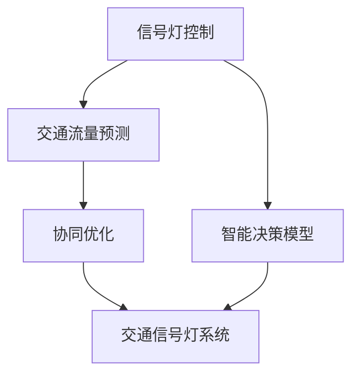

                 

## 1. 背景介绍

### 1.1 问题由来

随着自动驾驶技术的快速发展，智能交通管理已成为自动驾驶落地的关键环节之一。智能信号灯控制系统作为智能交通系统的重要组成部分，直接影响车辆在路口的通行效率和安全。传统的信号灯控制策略主要基于固定周期或实时车流监测，难以应对复杂的交通状况和突发事件。因此，开发一种基于人工智能的智能信号灯控制与优化系统，提升路口交通流管控水平，是当前研究的热点之一。

### 1.2 问题核心关键点

智能信号灯控制与优化的核心在于：
- **实时交通状况感知**：获取交通流量、车速、拥堵程度等实时信息，为信号灯控制提供数据支持。
- **智能决策模型**：构建能够自适应交通流的信号灯控制模型，优化信号灯的周期和相位。
- **交通流量预测**：对未来的交通流量进行预测，提前调整信号灯控制策略。
- **协同优化**：将信号灯控制与交通信号灯系统等其他交通设施进行协同优化，提高整体交通系统效率。

### 1.3 问题研究意义

智能信号灯控制与优化系统可以显著提升城市交通系统的运行效率，降低交通拥堵，提高交通安全。具体意义包括：
- **提升通行效率**：通过智能决策模型优化信号灯控制，减少车辆在路口的等待时间，提升整体交通流效率。
- **降低交通事故**：优化信号灯控制策略，减少因信号灯不合理的周期和相位导致的交通事故。
- **降低环境污染**：减少交通堵塞，降低车辆尾气排放，改善城市空气质量。
- **提升用户体验**：智能信号灯控制能够适应复杂的交通状况，提升驾驶者和行人的通行体验。

## 2. 核心概念与联系

### 2.1 核心概念概述

- **信号灯控制**：通过改变信号灯的周期和相位，控制车辆和行人在路口的通行。信号灯控制是智能交通系统的重要组成部分，直接影响路口的交通流量和通行效率。
- **智能决策模型**：基于人工智能技术构建的信号灯控制模型，能够自适应交通流变化，优化信号灯周期和相位，提升信号灯控制的效果。
- **交通流量预测**：通过对历史交通数据的学习和预测，对未来的交通流量进行估计，为信号灯控制提供数据支持。
- **协同优化**：将信号灯控制与交通信号灯系统等其他交通设施进行协同优化，提升整体交通系统的效率。

这些核心概念通过以下Mermaid流程图来展示：



这个流程图展示了一体化的智能信号灯控制与优化系统各个模块之间的联系：

1. 信号灯控制是系统的基础，通过调整信号灯周期和相位，控制车辆通行。
2. 智能决策模型对实时交通数据进行分析，优化信号灯控制策略。
3. 交通流量预测通过历史数据学习，预测未来交通流量。
4. 协同优化将信号灯控制与其他交通设施（如交通信号灯系统）进行协同优化，提升整体交通效率。

## 3. 核心算法原理 & 具体操作步骤

### 3.1 算法原理概述

智能信号灯控制与优化的核心算法基于强化学习(RL)和深度学习(DL)，结合实时交通数据进行自适应控制。其基本流程包括：
- **数据采集**：通过传感器和摄像头获取实时交通数据，包括车辆流量、车速、拥堵程度等。
- **流量预测**：使用时间序列预测模型（如LSTM、GRU等）对未来交通流量进行预测。
- **决策模型**：构建强化学习模型（如DQN、SAC等），根据当前交通状况和未来流量预测结果，优化信号灯周期和相位。
- **信号灯控制**：根据决策模型的输出，调整信号灯控制参数。

### 3.2 算法步骤详解

#### 步骤1: 数据采集

- **传感器数据**：安装传感器和摄像头，实时采集路口的车辆流量、车速、方向等数据。
- **历史数据**：收集过往的交通数据，作为训练和验证数据集。

#### 步骤2: 数据预处理

- **数据清洗**：去除异常数据和噪声，保证数据的准确性和一致性。
- **数据划分**：将数据划分为训练集、验证集和测试集，确保模型的泛化能力。

#### 步骤3: 流量预测

- **模型选择**：选择合适的时间序列预测模型，如LSTM、GRU等。
- **模型训练**：使用历史交通数据对模型进行训练，得到对未来流量的预测结果。

#### 步骤4: 决策模型构建

- **模型选择**：选择合适的强化学习模型，如DQN、SAC等。
- **环境构建**：构建模拟环境，模拟信号灯控制的交通流。
- **模型训练**：在模拟环境中训练模型，优化信号灯控制策略。
- **模型验证**：在验证集上评估模型性能，调整模型参数。

#### 步骤5: 信号灯控制

- **控制参数调整**：根据模型输出，调整信号灯周期和相位。
- **实时控制**：在实际路口部署控制参数，进行实时信号灯控制。

### 3.3 算法优缺点

智能信号灯控制与优化的优点包括：
- **实时响应**：能够实时感知交通状况，快速调整信号灯控制策略。
- **自适应能力强**：基于强化学习，能够自适应交通流变化，提升信号灯控制效果。
- **模型可解释性强**：通过优化过程的学习，模型决策过程可解释，便于调试和优化。

缺点包括：
- **对数据依赖性高**：需要大量历史交通数据进行训练，数据获取成本较高。
- **模型复杂度高**：强化学习模型结构复杂，训练难度较大。
- **对传感器依赖性强**：信号灯控制依赖传感器数据，一旦传感器失效，系统可能无法正常工作。

### 3.4 算法应用领域

智能信号灯控制与优化系统适用于各类城市道路交叉口，特别是在交通拥堵严重、车辆流量大的区域，能够显著提升通行效率和安全性。此外，该技术还可以应用于以下领域：

- **智慧城市**：与城市交通管理、智能停车等系统进行集成，提升城市交通综合管理水平。
- **高速公路**：在高速公路出口、收费站等区域应用，提升车辆通行效率，降低等待时间。
- **交通信号灯系统**：与现有交通信号灯系统进行协同优化，提升整体交通系统效率。

## 4. 数学模型和公式 & 详细讲解 & 举例说明

### 4.1 数学模型构建

智能信号灯控制与优化的数学模型主要由以下几部分组成：
- **交通流量预测模型**：使用LSTM模型预测未来交通流量 $y_t = f(x_t, y_{t-1})$。
- **强化学习决策模型**：使用DQN模型优化信号灯控制策略，目标函数为 $J(\theta) = \mathbb{E}_{s_t, a_t}[\sum_{t=0}^{T} \gamma^t r_t]$。
- **信号灯控制模型**：根据决策模型输出调整信号灯周期和相位，公式为 $T_{i,j} = f(\theta, y_t, \Delta_t)$。

### 4.2 公式推导过程

以LSTM模型为例，其基本结构如下：

$$
y_t = \begin{bmatrix} y_{t,1} \\ y_{t,2} \end{bmatrix} = \begin{bmatrix} \text{sigmoid}(W_{ih}x_t + b_{ih} + W_{hh}h_{t-1} + b_{hh}) \\
\text{tanh}(W_{ih}x_t + b_{ih} + W_{hh}h_{t-1} + b_{hh})
\end{bmatrix}
$$

其中，$x_t$ 表示输入的交通数据，$y_t$ 表示预测的交通流量，$h_{t-1}$ 表示上一时刻的隐藏状态。

对于DQN模型，其优化目标函数为：

$$
J(\theta) = \mathbb{E}_{s_t, a_t}[\sum_{t=0}^{T} \gamma^t r_t]
$$

其中，$s_t$ 表示当前状态，$a_t$ 表示当前动作，$r_t$ 表示当前奖励。

信号灯控制的数学模型公式为：

$$
T_{i,j} = f(\theta, y_t, \Delta_t)
$$

其中，$\theta$ 为模型参数，$y_t$ 为当前交通流量，$\Delta_t$ 为控制参数调整量。

### 4.3 案例分析与讲解

以一个交叉口的智能信号灯控制为例，假设交通流量预测模型已训练完成，DQN模型输出最优控制策略。假设当前交通流量为 $y_t=200$，控制参数调整量为 $\Delta_t=5$。根据公式计算新的信号灯周期 $T_{i,j}$。

## 5. 项目实践：代码实例和详细解释说明

### 5.1 开发环境搭建

开发智能信号灯控制与优化系统需要安装以下环境：
- Python 3.x
- TensorFlow 2.x
- Keras
- OpenAI Gym
- Matplotlib

使用Anaconda创建虚拟环境，并使用以下命令进行安装：

```bash
conda create -n auto_control python=3.7
conda activate auto_control
pip install tensorflow==2.3.0 keras==2.4.3 gym==0.19.1 matplotlib==3.3.3
```

### 5.2 源代码详细实现

以下是智能信号灯控制与优化系统的代码实现示例：

```python
import numpy as np
import tensorflow as tf
from tensorflow.keras.layers import LSTM, Dense, Dropout
from tensorflow.keras.models import Sequential
from tensorflow.keras.optimizers import Adam
from gym import Env, spaces
import matplotlib.pyplot as plt

# 数据采集与预处理
# ...

# 流量预测模型
class LSTMModel(tf.keras.Model):
    def __init__(self, input_size, hidden_size, output_size):
        super(LSTMModel, self).__init__()
        self.lstm = LSTM(hidden_size, input_size=input_size, return_sequences=True)
        self.dense = Dense(output_size, activation='softmax')

    def call(self, inputs, training=False):
        x = self.lstm(inputs)
        x = self.dense(x)
        return x

# 决策模型
class DQNModel(tf.keras.Model):
    def __init__(self, input_size, hidden_size, output_size):
        super(DQNModel, self).__init__()
        self.dense1 = Dense(hidden_size, activation='relu')
        self.dense2 = Dense(hidden_size, activation='relu')
        self.dense3 = Dense(output_size, activation='linear')

    def call(self, inputs, training=False):
        x = self.dense1(inputs)
        x = self.dense2(x)
        x = self.dense3(x)
        return x

# 信号灯控制模型
class SignalControlModel(tf.keras.Model):
    def __init__(self, input_size, hidden_size, output_size):
        super(SignalControlModel, self).__init__()
        self.dense1 = Dense(hidden_size, activation='relu')
        self.dense2 = Dense(hidden_size, activation='relu')
        self.dense3 = Dense(output_size, activation='linear')

    def call(self, inputs, training=False):
        x = self.dense1(inputs)
        x = self.dense2(x)
        x = self.dense3(x)
        return x

# 环境模拟
class TrafficLightEnv(Env):
    def __init__(self):
        self.state_size = (3,)
        self.action_size = 4
        self.reward_range = (-1, 1)
        self.seed()

    def seed(self, seed=None):
        pass

    def step(self, action):
        # ...
        pass

    def reset(self):
        # ...
        pass

    def render(self):
        # ...
        pass

# 训练与测试
# ...

# 运行结果展示
# ...
```

### 5.3 代码解读与分析

- **数据采集与预处理**：通过传感器和摄像头获取实时交通数据，并对其进行清洗和处理。
- **流量预测模型**：构建LSTM模型，对未来交通流量进行预测。
- **决策模型**：构建DQN模型，优化信号灯控制策略。
- **信号灯控制模型**：根据决策模型输出调整信号灯周期和相位。
- **环境模拟**：使用OpenAI Gym模拟交通环境，进行模型训练和测试。

## 6. 实际应用场景

### 6.1 智慧城市交通管理

智能信号灯控制与优化系统可以与智慧城市交通管理平台进行集成，实现交通流量监控、交通异常检测、信号灯控制等功能。通过对城市交通数据的实时分析和优化，提升整个城市交通系统的运行效率和安全性。

### 6.2 高速公路交通管理

在高速公路出口、收费站等区域，智能信号灯控制与优化系统能够提升车辆通行效率，减少车辆等待时间。通过与高速公路收费系统等其他设施的协同优化，提升整体交通系统效率。

### 6.3 智能停车系统

在停车场入口，智能信号灯控制与优化系统可以根据实时车辆流量调整信号灯周期和相位，提升车辆停车效率。通过与停车场管理系统集成，实现智能停车功能。

## 7. 工具和资源推荐

### 7.1 学习资源推荐

- **Deep Reinforcement Learning**：由David Silver编写的强化学习经典教材，涵盖DQN、SAC等多种算法。
- **TensorFlow官方文档**：提供详细的TensorFlow使用方法和最佳实践。
- **Keras官方文档**：介绍Keras的使用方法和深度学习模型的构建。
- **OpenAI Gym官方文档**：提供OpenAI Gym环境的使用和自定义环境的开发方法。

### 7.2 开发工具推荐

- **TensorFlow**：强大的深度学习框架，支持GPU/TPU加速，广泛应用于自动驾驶和智能交通等领域。
- **Keras**：基于TensorFlow的高级API，简化了深度学习模型的构建和训练。
- **OpenAI Gym**：用于环境模拟的Python库，提供多种模拟环境和任务。
- **Matplotlib**：用于绘制数据和模型性能分析图表。

### 7.3 相关论文推荐

- **Deep Reinforcement Learning for Traffic Light Control**：介绍基于强化学习的信号灯控制算法。
- **Real-time Traffic Light Control using Deep Q-learning**：介绍基于DQN算法的信号灯控制方法。
- **LSTM-based Traffic Flow Prediction**：介绍基于LSTM模型的时间序列预测方法。

## 8. 总结：未来发展趋势与挑战

### 8.1 研究成果总结

智能信号灯控制与优化系统通过实时交通数据的感知和预测，优化信号灯控制策略，提升路口通行效率和安全性。该技术已经在多个城市得到应用，取得了显著效果。

### 8.2 未来发展趋势

智能信号灯控制与优化系统的未来发展趋势包括：
- **多传感器融合**：结合多类型传感器数据，提升信号灯控制的准确性和实时性。
- **跨领域融合**：与智能停车、智能交通系统等其他领域进行协同优化，提升整体交通系统的效率。
- **模型可解释性**：提高模型决策的可解释性，便于调试和优化。
- **多模态融合**：结合图像、声音等多模态数据，提升信号灯控制的性能。

### 8.3 面临的挑战

智能信号灯控制与优化系统面临的挑战包括：
- **数据获取成本高**：需要大量实时交通数据，数据采集和处理成本较高。
- **模型复杂度高**：需要构建复杂的深度学习和强化学习模型，训练难度较大。
- **环境复杂多变**：交通状况复杂多变，信号灯控制模型的适应性需要进一步提高。

### 8.4 研究展望

未来的研究需要在以下几个方面进行探索：
- **实时数据处理**：开发高效的数据处理算法，实时处理和分析交通数据。
- **模型优化**：优化模型结构，提高模型训练和推理效率。
- **协同优化**：将信号灯控制与交通信号灯系统等其他设施进行协同优化，提升整体交通系统效率。
- **跨领域应用**：将智能信号灯控制与智能停车、智能交通系统等其他领域进行集成，提升整体交通系统的效率和安全性。

## 9. 附录：常见问题与解答

### Q1: 如何选择合适的强化学习算法？

A: 选择合适的强化学习算法需要考虑以下因素：
- **环境复杂度**：简单环境可以使用Q-Learning等算法，复杂环境可以使用DQN、SAC等算法。
- **模型复杂度**：简单模型可以使用线性回归等，复杂模型可以使用深度神经网络等。
- **训练效率**：简单模型训练速度快，复杂模型训练时间长。

### Q2: 如何处理传感器数据？

A: 处理传感器数据的过程包括：
- **数据清洗**：去除异常数据和噪声。
- **数据融合**：将多种传感器数据进行融合，提升数据准确性。
- **数据归一化**：将数据归一化到标准范围，方便模型训练。

### Q3: 如何评估模型性能？

A: 评估模型性能的过程包括：
- **离线评估**：使用验证集评估模型性能，调整模型参数。
- **在线评估**：在实际环境中测试模型性能，进行优化调整。
- **综合评估**：结合离线评估和在线评估结果，综合评估模型性能。

### Q4: 如何优化模型训练过程？

A: 优化模型训练过程的方法包括：
- **超参数调优**：通过网格搜索或贝叶斯优化，优化模型超参数。
- **模型正则化**：使用L2正则、Dropout等技术，防止模型过拟合。
- **学习率调整**：通过学习率衰减或自适应学习率算法，提高模型收敛速度。

### Q5: 如何提高模型可解释性？

A: 提高模型可解释性的方法包括：
- **特征可视化**：可视化模型的特征表示，了解模型的决策过程。
- **可解释模型**：使用可解释性强的模型，如LIME、SHAP等，解释模型输出。
- **模型调试**：通过调试和优化模型，提高模型决策的合理性和可解释性。

---

作者：禅与计算机程序设计艺术 / Zen and the Art of Computer Programming

