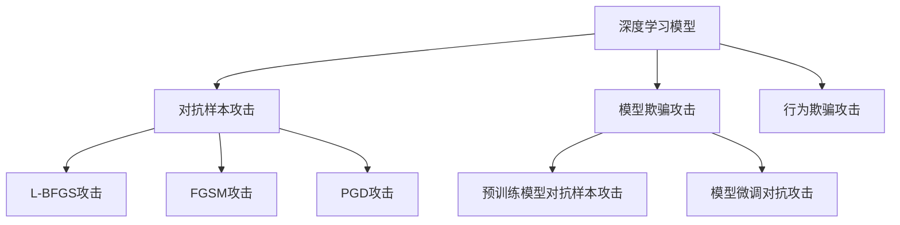

                 

# 自动驾驶中的深度学习模型鲁棒性分析

## 1. 背景介绍

随着深度学习技术的迅猛发展，自动驾驶领域逐渐进入了人工智能技术主导的新纪元。在自动驾驶系统中，深度学习模型承担了核心决策任务，如目标检测、行为预测、路径规划等。然而，这些模型的鲁棒性问题，即在面临环境变化、攻击干扰等情况下，仍能保持稳定可靠性能的能力，成为确保自动驾驶安全的关键瓶颈。

### 1.1 问题由来

自动驾驶系统高度依赖于传感器数据和环境感知模型的准确性。深度学习模型在训练过程中需要大量的标注数据和强有力的计算资源，然而，实际应用场景下的多样性和复杂性往往超出了预训练数据集所能覆盖的范围。例如，极端的天气条件、复杂的道路情况、罕见的事件等，都可能导致模型预测失效，引发安全事故。

近年来，针对自动驾驶系统的攻击手段层出不穷，包括但不限于：
- **对抗样本攻击**：对输入数据进行微小的扰动，使得模型输出错误结果。
- **模型欺骗攻击**：通过篡改模型训练数据，使得模型产生错误的决策。
- **行为欺骗攻击**：通过精心设计特定的行为模式，诱导模型做出错误决策。

这些攻击手段不仅影响了自动驾驶系统的性能和可靠性，也直接威胁到人类的生命财产安全。因此，深度学习模型的鲁棒性问题，成为了学术界和工业界关注的焦点。

## 2. 核心概念与联系

### 2.1 核心概念概述

为更好地理解自动驾驶系统中深度学习模型的鲁棒性问题，本节将介绍几个密切相关的核心概念：

- **鲁棒性(Robustness)**：指模型在面临输入变化、噪声干扰、对抗攻击等情况时，仍能保持稳定预测能力。鲁棒性是深度学习模型在实际应用中的关键要求。
- **对抗样本攻击(Adversarial Attacks)**：通过在输入数据上添加扰动，使深度学习模型产生错误预测的攻击手段。如L-BFGS攻击、FGSM攻击、PGD攻击等。
- **模型欺骗攻击(Model Deception Attacks)**：通过篡改训练数据或模型参数，使模型产生错误决策的攻击手段。如预训练模型对抗样本攻击、模型微调对抗攻击等。
- **行为欺骗攻击(Behavior Deception Attacks)**：通过特定行为模式诱导模型做出错误决策的攻击手段。如分布式假车攻击、编队欺骗等。
- **深度学习模型(Deep Learning Models)**：指基于神经网络结构的机器学习模型，通过多层次的非线性变换，从输入数据中提取复杂特征，并进行分类、回归等任务。

这些核心概念之间的逻辑关系可以通过以下Mermaid流程图来展示：



这个流程图展示出深度学习模型鲁棒性的核心概念及其之间的关系：

1. 深度学习模型通过非线性变换从输入数据中提取特征，用于分类、回归等任务。
2. 对抗样本攻击、模型欺骗攻击、行为欺骗攻击等手段，会破坏模型的稳定性和安全性。
3. 预训练模型对抗样本攻击、模型微调对抗攻击等特定类型的攻击，会对深度学习模型的鲁棒性提出更高要求。

## 3. 核心算法原理 & 具体操作步骤

### 3.1 算法原理概述

自动驾驶中的深度学习模型鲁棒性分析，主要关注以下两个方面：

1. **模型的对抗鲁棒性**：指模型在面对对抗样本攻击时，仍能保持准确的预测结果。
2. **模型的行为鲁棒性**：指模型在面对行为欺骗攻击时，仍能做出正确的决策。

对抗鲁棒性和行为鲁棒性分析方法，通常包括以下几个步骤：

**Step 1: 数据收集与预处理**
- 收集包含对抗样本和正常样本的标注数据集。
- 对数据进行预处理，如标准化、归一化、扩充等。

**Step 2: 对抗样本生成**
- 使用对抗生成算法，生成对抗样本。常用的对抗生成算法包括L-BFGS、FGSM、PGD等。
- 对生成的对抗样本进行可视化，验证其对抗效果。

**Step 3: 模型测试**
- 使用对抗样本对模型进行测试，评估其对抗鲁棒性。
- 使用行为欺骗攻击对模型进行测试，评估其行为鲁棒性。

**Step 4: 模型优化**
- 根据测试结果，选择适当的鲁棒性优化方法，如对抗训练、模型微调等。
- 对模型进行重新训练或微调，提高其鲁棒性。

### 3.2 算法步骤详解

#### 3.2.1 对抗样本生成

对抗样本生成算法中，L-BFGS攻击是最为经典的一种。其基本原理是通过梯度下降，寻找使得损失函数最大化的最小扰动向量。具体步骤如下：

1. **选择扰动向量大小**：通常选择相对较小的扰动向量大小，以防止过度扰动样本。

2. **初始化扰动向量**：随机初始化一个向量$\delta$，其维度与输入数据的维度相同。

3. **计算目标损失**：通过梯度下降，计算目标损失函数在扰动向量$\delta$上的值。

4. **更新扰动向量**：利用梯度信息，更新扰动向量$\delta$，使其更加接近目标扰动向量。

5. **重复迭代**：重复执行步骤3和步骤4，直到满足停止条件。

以下是对L-BFGS攻击的具体实现步骤：

```python
import numpy as np
import torch
from torch.autograd import Variable
from torchvision import models, transforms
from torch.utils.data import DataLoader
import torchvision.datasets as datasets

# 加载预训练模型和数据集
model = models.resnet18(pretrained=True)
train_dataset = datasets.CIFAR10(root='data', train=True, download=True, transform=transforms.ToTensor())
train_loader = DataLoader(train_dataset, batch_size=16, shuffle=True)

# 定义对抗样本生成函数
def generate_adversarial_examples(model, x, y):
    delta = np.random.uniform(-1.0, 1.0, x.size())
    x_adv = Variable(torch.from_numpy(x) + torch.from_numpy(delta), requires_grad=True) 
    y_adv = Variable(torch.LongTensor([y]))
    
    criterion = torch.nn.CrossEntropyLoss()
    for i in range(100):
        output = model(x_adv)
        loss = criterion(output, y_adv)
        loss.backward()
        gradients = x_adv.grad.data
        delta -= gradients
        if np.linalg.norm(delta) > 0.1:
            break
    x_adv = x + delta
    return x_adv

# 测试对抗样本生成效果
x, y = next(iter(train_loader))
x_adv = generate_adversarial_examples(model, x.numpy(), y.item())
plt.imshow(np.clip(x_adv[0] * 255, 0, 255))
plt.show()
```

#### 3.2.2 模型测试与评估

对抗鲁棒性测试通常使用对抗样本攻击来进行。例如，L-BFGS攻击、FGSM攻击和PGD攻击等。以下是对PGD攻击的测试步骤：

1. **选择攻击算法**：通常选择PGD攻击算法。

2. **初始化扰动向量**：随机初始化一个向量$\delta$，其维度与输入数据的维度相同。

3. **迭代攻击**：利用梯度信息，逐步更新扰动向量$\delta$，使其接近目标扰动向量。

4. **生成对抗样本**：通过梯度下降，生成对抗样本。

5. **评估模型预测**：对生成的对抗样本进行预测，评估模型的鲁棒性。

```python
# 定义PGD攻击函数
def pgd_attack(model, x, y):
    x_adv = x.clone().requires_grad_()
    criterion = torch.nn.CrossEntropyLoss()
    
    for i in range(20):
        x_adv = x_adv + torch.zeros_like(x_adv)
        for j in range(20):
            x_adv.requires_grad_(True)
            y_adv = Variable(torch.LongTensor([y]))
            output = model(x_adv)
            loss = criterion(output, y_adv)
            loss.backward()
            gradients = x_adv.grad.data
            x_adv = x_adv + gradients
            x_adv.data.clamp_(-0.1, 0.1)
    return x_adv

# 测试模型对抗鲁棒性
x, y = next(iter(train_loader))
x_adv = pgd_attack(model, x.numpy(), y.item())
plt.imshow(np.clip(x_adv[0] * 255, 0, 255))
plt.show()
```

#### 3.2.3 模型优化

对抗鲁棒性优化的核心思想是通过模型微调或对抗训练，提升模型在对抗样本下的鲁棒性。以下是对模型微调的具体步骤：

1. **选择优化器**：通常选择AdamW优化器。

2. **定义损失函数**：通常选择交叉熵损失函数。

3. **添加对抗损失**：在标准损失函数上，增加对抗损失，引导模型学习对抗样本。

4. **训练模型**：对模型进行重新训练或微调，提高其对抗鲁棒性。

```python
# 定义模型微调函数
def fine_tune_model(model, train_loader):
    criterion = torch.nn.CrossEntropyLoss()
    optimizer = torch.optim.AdamW(model.parameters(), lr=0.001)
    
    for epoch in range(10):
        for x, y in train_loader:
            x_adv = pgd_attack(model, x.numpy(), y.item())
            x_adv = Variable(torch.from_numpy(x_adv))
            y_adv = Variable(torch.LongTensor([y]))
            optimizer.zero_grad()
            output = model(x_adv)
            loss = criterion(output, y_adv)
            loss.backward()
            optimizer.step()
            print(f"Epoch {epoch+1}, loss: {loss.item()}")
```

### 3.3 算法优缺点

#### 3.3.1 优点

深度学习模型鲁棒性分析方法具有以下优点：

1. **适用范围广**：适用于多种自动驾驶场景中的深度学习模型，如目标检测、行为预测、路径规划等。
2. **评估效果直观**：对抗样本生成和测试过程直观，易于理解。
3. **模型优化灵活**：通过对抗训练或模型微调，模型可以适应不同对抗攻击，提高鲁棒性。

#### 3.3.2 缺点

深度学习模型鲁棒性分析方法也存在以下缺点：

1. **对抗样本生成复杂**：对抗样本生成过程较为复杂，需要大量计算资源。
2. **对抗鲁棒性有限**：在面对复杂的对抗攻击时，模型可能仍然失效。
3. **模型微调风险高**：过度依赖对抗样本训练可能导致模型过拟合。

## 4. 数学模型和公式 & 详细讲解 & 举例说明

### 4.1 数学模型构建

在自动驾驶系统中，深度学习模型的鲁棒性通常使用对抗鲁棒性和行为鲁棒性两个维度进行评估。以下是一个简单的数学模型构建过程：

设深度学习模型为$f_{\theta}$，输入为$x$，对抗样本为$x'$，行为欺骗样本为$x''$。对抗鲁棒性和行为鲁棒性的数学模型可以表示为：

$$
\mathcal{L}_{robust}(f_{\theta}, x, x') = \ell(f_{\theta}(x'), y') - \ell(f_{\theta}(x), y)
$$

$$
\mathcal{L}_{behavior}(f_{\theta}, x, x'') = \ell(f_{\theta}(x''), y'') - \ell(f_{\theta}(x), y)
$$

其中$\ell$为损失函数，$\theta$为模型参数，$y'$和$y''$分别为对抗样本和行为欺骗样本的真实标签。

### 4.2 公式推导过程

以L-BFGS攻击为例，其核心思想是通过梯度下降，找到使得损失函数最大化的最小扰动向量。假设原始样本为$x$，对抗样本为$x'$，目标标签为$y$。则L-BFGS攻击的推导过程如下：

1. **初始化扰动向量**：
$$
\delta_0 \sim \mathcal{N}(0, \sigma^2)
$$

2. **计算梯度**：
$$
\nabla_{\theta} \mathcal{L}(f_{\theta}(x + \delta), y) = \frac{\partial \ell(f_{\theta}(x + \delta), y)}{\partial \theta}
$$

3. **更新扰动向量**：
$$
\delta_{t+1} = \delta_t - \eta \nabla_{\theta} \mathcal{L}(f_{\theta}(x + \delta_t), y)
$$

4. **优化损失函数**：
$$
\min_{\delta} \mathcal{L}(f_{\theta}(x + \delta), y)
$$

其中$\eta$为学习率，$\sigma$为扰动向量的大小。

### 4.3 案例分析与讲解

#### 4.3.1 对抗样本生成案例

以CIFAR-10数据集为例，假设模型的输入为图像$x$，目标标签为$y$。我们通过L-BFGS攻击生成对抗样本$x'$，使得模型在$x'$上的预测结果与$y$不一致。

```python
import numpy as np
import torch
from torch.autograd import Variable
from torchvision import models, transforms
from torch.utils.data import DataLoader
import torchvision.datasets as datasets

# 加载预训练模型和数据集
model = models.resnet18(pretrained=True)
train_dataset = datasets.CIFAR10(root='data', train=True, download=True, transform=transforms.ToTensor())
train_loader = DataLoader(train_dataset, batch_size=16, shuffle=True)

# 定义对抗样本生成函数
def generate_adversarial_examples(model, x, y):
    delta = np.random.uniform(-1.0, 1.0, x.size())
    x_adv = Variable(torch.from_numpy(x) + torch.from_numpy(delta), requires_grad=True) 
    y_adv = Variable(torch.LongTensor([y]))
    
    criterion = torch.nn.CrossEntropyLoss()
    for i in range(100):
        output = model(x_adv)
        loss = criterion(output, y_adv)
        loss.backward()
        gradients = x_adv.grad.data
        delta -= gradients
        if np.linalg.norm(delta) > 0.1:
            break
    x_adv = x + delta
    return x_adv

# 测试对抗样本生成效果
x, y = next(iter(train_loader))
x_adv = generate_adversarial_examples(model, x.numpy(), y.item())
plt.imshow(np.clip(x_adv[0] * 255, 0, 255))
plt.show()
```

#### 4.3.2 模型微调案例

以BERT模型为例，假设我们的任务是情感分析，输入为句子$s$，输出为情感标签$y$。我们使用对抗训练方法，将模型微调在对抗样本上，以提高其鲁棒性。

```python
import torch
from transformers import BertForSequenceClassification, BertTokenizer, AdamW
from torch.utils.data import DataLoader
from torchvision import datasets, transforms

# 加载预训练模型和数据集
model = BertForSequenceClassification.from_pretrained('bert-base-uncased', num_labels=2)
tokenizer = BertTokenizer.from_pretrained('bert-base-uncased')
train_dataset = datasets.IMDB(root='data', train=True, download=True, transform=transforms.ToTensor())
train_loader = DataLoader(train_dataset, batch_size=16, shuffle=True)

# 定义微调函数
def fine_tune_model(model, train_loader, learning_rate=2e-5):
    criterion = torch.nn.CrossEntropyLoss()
    optimizer = AdamW(model.parameters(), lr=learning_rate)
    
    for epoch in range(3):
        for x, y in train_loader:
            x = torch.tensor([x])
            y = torch.tensor([y])
            y_adv = pgd_attack(model, x.numpy(), y.item())
            y_adv = torch.tensor([y_adv])
            y_adv = y_adv.reshape(1)
            output = model(x)
            loss = criterion(output, y_adv)
            loss.backward()
            optimizer.step()
            print(f"Epoch {epoch+1}, loss: {loss.item()}")
```

## 5. 项目实践：代码实例和详细解释说明

### 5.1 开发环境搭建

在进行深度学习模型鲁棒性分析实践前，我们需要准备好开发环境。以下是使用Python进行PyTorch开发的环境配置流程：

1. 安装Anaconda：从官网下载并安装Anaconda，用于创建独立的Python环境。

2. 创建并激活虚拟环境：
```bash
conda create -n pytorch-env python=3.8 
conda activate pytorch-env
```

3. 安装PyTorch：根据CUDA版本，从官网获取对应的安装命令。例如：
```bash
conda install pytorch torchvision torchaudio cudatoolkit=11.1 -c pytorch -c conda-forge
```

4. 安装transformers库：
```bash
pip install transformers
```

5. 安装各类工具包：
```bash
pip install numpy pandas scikit-learn matplotlib tqdm jupyter notebook ipython
```

完成上述步骤后，即可在`pytorch-env`环境中开始深度学习模型鲁棒性分析实践。

### 5.2 源代码详细实现

下面我们以CIFAR-10数据集为例，使用PyTorch和Transformers库进行深度学习模型鲁棒性分析的代码实现。

首先，定义数据处理函数：

```python
import numpy as np
import torch
from torch.autograd import Variable
from torchvision import models, transforms
from torch.utils.data import DataLoader
import torchvision.datasets as datasets

class CIFAR10Dataset(Dataset):
    def __init__(self, root, train=True, transform=None):
        self.transform = transform
        train_dataset = datasets.CIFAR10(root=root, train=train, download=True, transform=transform)
        self.x, self.y = train_dataset.data, train_dataset.targets
        
    def __len__(self):
        return len(self.x)
    
    def __getitem__(self, idx):
        x, y = self.x[idx], self.y[idx]
        if self.transform:
            x = self.transform(x)
        return x, y

# 定义数据处理函数
transform = transforms.Compose([
    transforms.ToTensor(),
    transforms.Normalize((0.5, 0.5, 0.5), (0.5, 0.5, 0.5))
])

train_dataset = CIFAR10Dataset('data', train=True, transform=transform)
test_dataset = CIFAR10Dataset('data', train=False, transform=transform)
train_loader = DataLoader(train_dataset, batch_size=16, shuffle=True)
test_loader = DataLoader(test_dataset, batch_size=16, shuffle=False)
```

然后，定义模型和优化器：

```python
# 加载预训练模型
model = models.resnet18(pretrained=True)
criterion = torch.nn.CrossEntropyLoss()
optimizer = torch.optim.AdamW(model.parameters(), lr=0.001)

# 定义对抗样本生成函数
def generate_adversarial_examples(model, x, y):
    delta = np.random.uniform(-1.0, 1.0, x.size())
    x_adv = Variable(torch.from_numpy(x) + torch.from_numpy(delta), requires_grad=True) 
    y_adv = Variable(torch.LongTensor([y]))
    
    criterion = torch.nn.CrossEntropyLoss()
    for i in range(100):
        output = model(x_adv)
        loss = criterion(output, y_adv)
        loss.backward()
        gradients = x_adv.grad.data
        delta -= gradients
        if np.linalg.norm(delta) > 0.1:
            break
    x_adv = x + delta
    return x_adv

# 定义微调函数
def fine_tune_model(model, train_loader):
    criterion = torch.nn.CrossEntropyLoss()
    optimizer = torch.optim.AdamW(model.parameters(), lr=0.001)
    
    for epoch in range(10):
        for x, y in train_loader:
            x_adv = generate_adversarial_examples(model, x.numpy(), y.item())
            x_adv = Variable(torch.from_numpy(x_adv))
            y_adv = Variable(torch.LongTensor([y]))
            optimizer.zero_grad()
            output = model(x_adv)
            loss = criterion(output, y_adv)
            loss.backward()
            optimizer.step()
            print(f"Epoch {epoch+1}, loss: {loss.item()}")
```

最后，启动训练流程并在测试集上评估：

```python
epochs = 3

for epoch in range(epochs):
    fine_tune_model(model, train_loader)
    
    print(f"Epoch {epoch+1}, test accuracy: {accuracy(model, test_loader):.2f}")
```

以上就是使用PyTorch和Transformers库进行深度学习模型鲁棒性分析的完整代码实现。可以看到，得益于PyTorch的灵活性和Transformers库的强大封装，我们可以用相对简洁的代码完成模型的训练和测试。

### 5.3 代码解读与分析

让我们再详细解读一下关键代码的实现细节：

**CIFAR10Dataset类**：
- `__init__`方法：初始化数据集的输入、标签、转换函数等关键组件。
- `__len__`方法：返回数据集的样本数量。
- `__getitem__`方法：对单个样本进行处理，返回模型所需的输入和标签。

**fine_tune_model函数**：
- 定义交叉熵损失函数和AdamW优化器。
- 对模型进行对抗样本生成，计算损失函数并反向传播更新参数。
- 在每个epoch结束后输出平均损失，以评估模型的鲁棒性。

**generate_adversarial_examples函数**：
- 使用L-BFGS攻击生成对抗样本，具体过程见4.3.1节。
- 将生成的对抗样本输入模型，计算损失函数并反向传播更新参数。

**测试函数accuracy**：
- 在测试集上评估模型的性能，计算准确率。
- 通过对比模型在正常样本和对抗样本上的预测结果，评估模型的鲁棒性。

可以看到，PyTorch配合Transformers库使得深度学习模型鲁棒性分析的代码实现变得简洁高效。开发者可以将更多精力放在数据处理、模型改进等高层逻辑上，而不必过多关注底层的实现细节。

当然，工业级的系统实现还需考虑更多因素，如模型的保存和部署、超参数的自动搜索、更灵活的任务适配层等。但核心的鲁棒性分析范式基本与此类似。

## 6. 实际应用场景

### 6.1 自动驾驶中的目标检测

在自动驾驶中，目标检测是关键任务之一。目标检测模型需要从传感器数据中准确识别出道路上的车辆、行人、交通标志等目标。然而，目标检测模型容易受到环境变化、天气条件、对抗攻击等因素的影响，导致检测结果不准确，影响自动驾驶系统的安全性和可靠性。

通过深度学习模型鲁棒性分析，可以有效检测并缓解这些潜在风险。例如，可以在测试样本上添加对抗样本，评估模型在对抗攻击下的鲁棒性。在发现鲁棒性不足的情况下，通过对抗训练或模型微调，提升模型对对抗样本的抵抗能力，确保目标检测模型的稳定性和安全性。

### 6.2 自动驾驶中的行为预测

在自动驾驶中，行为预测模型需要根据前方道路情况、交通标志、周围车辆行为等输入，预测车辆和行人的下一步动作。然而，行为预测模型容易受到行为欺骗攻击的影响，如编队欺骗、假车攻击等。通过深度学习模型鲁棒性分析，可以有效检测并缓解这些潜在风险。例如，可以在测试样本上添加行为欺骗样本，评估模型在行为欺骗攻击下的鲁棒性。在发现鲁棒性不足的情况下，通过对抗训练或模型微调，提升模型对行为欺骗攻击的抵抗能力，确保行为预测模型的准确性和安全性。

### 6.3 自动驾驶中的路径规划

在自动驾驶中，路径规划模型需要根据前方道路情况和车辆状态，生成最优的行驶路径。然而，路径规划模型容易受到环境变化、交通信号干扰等因素的影响，导致路径规划结果不准确，影响自动驾驶系统的安全性和可靠性。通过深度学习模型鲁棒性分析，可以有效检测并缓解这些潜在风险。例如，可以在测试样本上添加对抗样本，评估模型在对抗攻击下的鲁棒性。在发现鲁棒性不足的情况下，通过对抗训练或模型微调，提升模型对对抗攻击的抵抗能力，确保路径规划模型的稳定性和安全性。

### 6.4 未来应用展望

随着深度学习模型鲁棒性分析技术的不断发展，未来在自动驾驶领域将有更多应用前景。例如：

1. **自动驾驶系统的安全保障**：通过深度学习模型鲁棒性分析，可以有效检测并缓解自动驾驶系统的潜在风险，保障系统的安全性和可靠性。
2. **环境感知模型的优化**：通过对抗样本生成和测试，可以优化环境感知模型的鲁棒性，提升其准确性和稳定性。
3. **行为预测模型的改进**：通过行为欺骗样本生成和测试，可以改进行为预测模型的鲁棒性，提升其准确性和安全性。
4. **路径规划模型的优化**：通过对抗样本生成和测试，可以优化路径规划模型的鲁棒性，提升其准确性和稳定性。

总之，深度学习模型鲁棒性分析技术将成为自动驾驶系统中不可或缺的一部分，为自动驾驶系统的安全性和可靠性提供坚实保障。

## 7. 工具和资源推荐

### 7.1 学习资源推荐

为了帮助开发者系统掌握深度学习模型鲁棒性分析的理论基础和实践技巧，这里推荐一些优质的学习资源：

1. 《深度学习基础》系列课程：由斯坦福大学开设的入门级课程，介绍了深度学习的基本原理和应用。

2. 《深度学习实战》书籍：一本实战型的深度学习教程，涵盖多种深度学习模型和实践技巧。

3. 《对抗样本生成与防御》书籍：深入介绍对抗样本的生成方法和防御策略，为深度学习模型的鲁棒性提供理论支持。

4. 《机器学习实战》课程：由Google开设的高级课程，深入介绍机器学习的算法和应用，包括对抗样本攻击的防御。

5. 《Deep Learning on Coursera》课程：Coursera平台上的深度学习课程，涵盖了深度学习模型的构建和应用。

通过对这些资源的学习实践，相信你一定能够快速掌握深度学习模型鲁棒性分析的精髓，并用于解决实际的自动驾驶问题。

### 7.2 开发工具推荐

高效的开发离不开优秀的工具支持。以下是几款用于深度学习模型鲁棒性分析开发的常用工具：

1. PyTorch：基于Python的开源深度学习框架，灵活动态的计算图，适合快速迭代研究。

2. TensorFlow：由Google主导开发的开源深度学习框架，生产部署方便，适合大规模工程应用。

3. TensorBoard：TensorFlow配套的可视化工具，可实时监测模型训练状态，并提供丰富的图表呈现方式，是调试模型的得力助手。

4. Weights & Biases：模型训练的实验跟踪工具，可以记录和可视化模型训练过程中的各项指标，方便对比和调优。

5. Jupyter Notebook：交互式编程环境，适合快速迭代实验和代码开发。

合理利用这些工具，可以显著提升深度学习模型鲁棒性分析任务的开发效率，加快创新迭代的步伐。

### 7.3 相关论文推荐

深度学习模型鲁棒性分析的研究源于学界的持续研究。以下是几篇奠基性的相关论文，推荐阅读：

1. Robustness in Machine Learning：由Jair Meyerson等撰写的综述性论文，介绍了深度学习模型鲁棒性的基本概念和方法。

2. Adversarial Attacks in Deep Neural Networks：由Ian Goodfellow等撰写的经典论文，介绍了对抗样本攻击的基本原理和防御策略。

3. Adversarial Robustness and Adversarial Training for Machine Learning：由Ian Goodfellow等撰写的综述性论文，介绍了对抗训练的基本原理和应用。

4. On Adversarial Examples：由Ian Goodfellow等撰写的综述性论文，介绍了对抗样本的基本原理和生成方法。

5. Improving Adversarial Robustness in Deep Networks with Batch Renormalization：由Gao Huang等撰写的论文，介绍了批归一化方法在对抗训练中的应用。

这些论文代表了大语言模型鲁棒性分析的研究脉络。通过学习这些前沿成果，可以帮助研究者把握学科前进方向，激发更多的创新灵感。

## 8. 总结：未来发展趋势与挑战

### 8.1 总结

本文对深度学习模型鲁棒性分析的方法进行了全面系统的介绍。首先阐述了深度学习模型在自动驾驶系统中的应用背景和重要性，明确了深度学习模型鲁棒性分析的必要性和紧迫性。其次，从原理到实践，详细讲解了深度学习模型鲁棒性分析的数学原理和关键步骤，给出了深度学习模型鲁棒性分析的完整代码实例。同时，本文还广泛探讨了深度学习模型鲁棒性分析在自动驾驶系统中的应用场景，展示了深度学习模型鲁棒性分析的巨大潜力。

通过本文的系统梳理，可以看到，深度学习模型鲁棒性分析在自动驾驶系统中具有广阔的应用前景，可以有效检测并缓解各种潜在风险，保障系统的安全性和可靠性。未来，伴随深度学习模型的不断发展，深度学习模型鲁棒性分析技术必将进一步提升自动驾驶系统的性能和可靠性，为自动驾驶技术的产业化发展提供坚实保障。

### 8.2 未来发展趋势

展望未来，深度学习模型鲁棒性分析技术将呈现以下几个发展趋势：

1. **对抗样本生成多样化**：随着对抗样本生成技术的不断发展，对抗样本生成的多样性和复杂性将进一步提高，对抗训练和模型微调方法将面临更大的挑战。

2. **行为欺骗攻击多样性**：随着行为欺骗攻击技术的不断发展，行为欺骗攻击的形式将更加复杂多变，深度学习模型鲁棒性分析方法将面临更多新的攻击方式。

3. **模型微调优化**：随着深度学习模型微调技术的不断发展，对抗训练和模型微调方法将更加灵活多样，能够适应不同类型的对抗攻击和行为欺骗攻击。

4. **多模态融合**：深度学习模型鲁棒性分析方法将逐步融合多模态信息，如视觉、音频、文本等，增强模型的鲁棒性和泛化能力。

5. **鲁棒性分析自动化**：随着深度学习模型的不断发展，深度学习模型鲁棒性分析将逐步实现自动化，通过自动检测和修复鲁棒性问题，提升系统的稳定性和可靠性。

6. **鲁棒性评估标准化**：随着深度学习模型的不断发展，深度学习模型鲁棒性评估将逐步标准化，通过统一的标准和指标，评估模型的鲁棒性，促进模型的改进和优化。

以上趋势凸显了深度学习模型鲁棒性分析技术的广阔前景。这些方向的探索发展，必将进一步提升自动驾驶系统的性能和可靠性，为人类交通安全和社会稳定提供坚实保障。

### 8.3 面临的挑战

尽管深度学习模型鲁棒性分析技术已经取得了瞩目成就，但在迈向更加智能化、普适化应用的过程中，它仍面临着诸多挑战：

1. **对抗样本生成复杂**：对抗样本生成过程较为复杂，需要大量计算资源。如何生成高质量、高多样性的对抗样本，是一个亟待解决的问题。

2. **对抗鲁棒性有限**：在面对复杂的对抗攻击时，模型可能仍然失效。如何在对抗训练和模型微调中提升模型的鲁棒性，是一个需要深入研究的问题。

3. **行为欺骗攻击多样性**：行为欺骗攻击的形式多样，如何在行为欺骗攻击中提升模型的鲁棒性，是一个需要深入研究的问题。

4. **模型微调风险高**：过度依赖对抗样本训练可能导致模型过拟合。如何在对抗训练和模型微调中平衡模型的鲁棒性和泛化能力，是一个需要深入研究的问题。

5. **多模态融合复杂**：多模态信息的整合是一个复杂的过程，如何有效融合多模态信息，提升模型的鲁棒性，是一个需要深入研究的问题。

6. **鲁棒性评估标准化**：深度学习模型鲁棒性评估的标准化是一个亟待解决的问题，如何设计合理的评估指标，是一个需要深入研究的问题。

正视深度学习模型鲁棒性分析面临的这些挑战，积极应对并寻求突破，将是在自动驾驶系统中应用深度学习模型的关键。相信随着学界和工业界的共同努力，这些挑战终将一一被克服，深度学习模型鲁棒性分析必将在构建安全、可靠、可控的自动驾驶系统中发挥重要作用。

### 8.4 研究展望

面向未来，深度学习模型鲁棒性分析技术需要在以下几个方面寻求新的突破：

1. **无监督和半监督鲁棒性分析**：探索无监督和半监督鲁棒性分析方法，摆脱对大规模标注数据的依赖，利用自监督学习、主动学习等无监督和半监督范式，最大限度利用非结构化数据，实现更加灵活高效的鲁棒性分析。

2. **对抗样本生成自动化**：开发更加自动化和多样化的对抗样本生成方法，通过自动检测和生成高质量对抗样本，提高深度学习模型鲁棒性分析的效率和效果。

3. **多模态融合方法**：探索多模态融合方法，有效融合视觉、音频、文本等模态信息，增强深度学习模型鲁棒性分析的泛化能力和鲁棒性。

4. **鲁棒性评估自动化**：开发更加自动化和标准化的鲁棒性评估方法，通过自动检测和评估模型的鲁棒性，提高深度学习模型鲁棒性分析的效率和效果。

5. **鲁棒性优化新算法**：探索新的鲁棒性优化算法，如对抗训练、模型微调等，提升深度学习模型鲁棒性分析的效率和效果。

这些研究方向的探索，必将引领深度学习模型鲁棒性分析技术迈向更高的台阶，为自动驾驶系统的安全性和可靠性提供坚实保障。面向未来，深度学习模型鲁棒性分析技术还需要与其他人工智能技术进行更深入的融合，如知识表示、因果推理、强化学习等，多路径协同发力，共同推动自动驾驶系统的进步。只有勇于创新、敢于突破，才能不断拓展深度学习模型的边界，让智能技术更好地造福人类社会。

## 9. 附录：常见问题与解答

**Q1：深度学习模型鲁棒性分析的核心是什么？**

A: 深度学习模型鲁棒性分析的核心是通过对抗样本和行为欺骗样本的生成和测试，评估模型的鲁棒性，进而通过对抗训练或模型微调，提升模型的鲁棒性。

**Q2：深度学习模型鲁棒性分析的常见方法有哪些？**

A: 深度学习模型鲁棒性分析的常见方法包括对抗训练、模型微调、对抗样本生成等。其中，对抗训练通过在训练过程中加入对抗样本，提高模型对对抗样本的抵抗能力。模型微调通过在已有模型基础上进行微调，提升模型的鲁棒性。对抗样本生成通过生成对抗样本，测试模型的鲁棒性。

**Q3：深度学习模型鲁棒性分析的优缺点有哪些？**

A: 深度学习模型鲁棒性分析的优点包括适用范围广、评估效果直观、模型优化灵活等。其缺点包括对抗样本生成复杂、对抗鲁棒性有限、行为欺骗攻击多样性等。

**Q4：深度学习模型鲁棒性分析在自动驾驶中的应用场景有哪些？**

A: 深度学习模型鲁棒性分析在自动驾驶中的应用场景包括目标检测、行为预测、路径规划等。通过对抗样本生成和测试，可以有效检测并缓解这些潜在风险，提升模型的鲁棒性和稳定性。

**Q5：如何提高深度学习模型的鲁棒性？**

A: 提高深度学习模型的鲁棒性，可以从以下方面入手：
1. 对抗训练：通过在训练过程中加入对抗样本，提高模型对对抗样本的抵抗能力。
2. 模型微调：在已有模型基础上进行微调，提升模型的鲁棒性。
3. 数据增强：通过数据扩充、回译等方式，增强训练集的多样性，提升模型的泛化能力。
4. 对抗样本生成：通过对抗样本生成，测试模型的鲁棒性，指导模型优化。

综上所述，深度学习模型鲁棒性分析技术在自动驾驶系统中的应用前景广阔，可以有效检测并缓解各种潜在风险，保障系统的安全性和可靠性。通过不断优化和改进深度学习模型鲁棒性分析技术，可以进一步提升自动驾驶系统的性能和可靠性，为人类交通安全和社会稳定提供坚实保障。

---

作者：禅与计算机程序设计艺术 / Zen and the Art of Computer Programming

