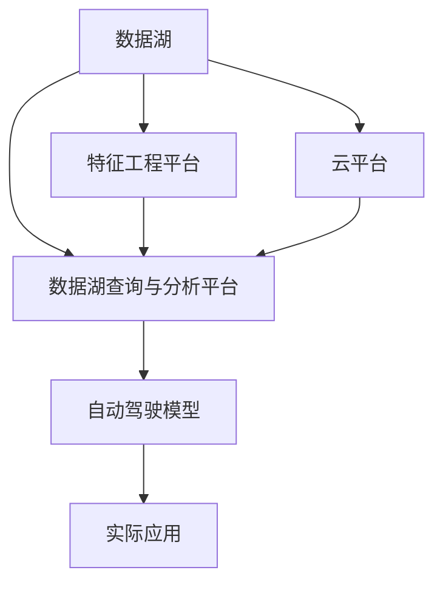

                 

## 1. 背景介绍

自动驾驶技术的兴起，极大地推动了汽车行业的转型升级。作为一门集成计算机视觉、深度学习、传感器融合、地图导航等前沿技术的高新技术，自动驾驶的复杂性和挑战性远超传统的汽车制造。为应对这些挑战，各大车企纷纷建立了大规模数据湖和特征工程平台，以数据为驱动，优化模型训练，加速自动驾驶技术的落地应用。

本文将系统介绍自动驾驶公司建立数据湖与特征工程平台的核心概念、技术原理及实操细节。从背景介绍入手，深入剖析自动驾驶数据湖与特征工程平台的搭建和应用，并展望未来发展趋势与挑战。

## 2. 核心概念与联系

### 2.1 核心概念概述

为理解自动驾驶公司的数据湖与特征工程平台，首先需要明确几个关键概念：

1. **数据湖(Data Lake)**：一种以海量存储为核心，支持多种数据源、多种数据格式和多种数据分析方式的数据管理架构。自动驾驶公司需要存储大量的日志数据、传感器数据、地图数据等，数据湖能够为其提供高效、灵活的数据管理能力。

2. **特征工程(Feature Engineering)**：一种数据预处理技术，通过选择、构建、转换、降维等方式，从原始数据中提取出对模型训练有价值的信息，从而提升模型的性能。自动驾驶技术依赖大量高维度的传感器数据，特征工程能够从这些数据中提取有意义的特征，供模型训练使用。

3. **云平台(Cloud Platform)**：自动驾驶公司利用云平台进行数据湖的搭建与维护，实现数据的实时采集、处理、存储和分析。云平台提供了弹性伸缩、高可用、安全可靠等特性，支持大规模数据处理。

4. **数据湖查询与分析平台**：用于对数据湖进行高效查询和分析的工具，如Hive、Spark等，能够提供实时的数据分析和可视化，辅助工程师快速发现和解决问题。

5. **特征工程平台**：专门用于特征提取和管理的平台，通过自动化工具，提升特征工程效率，减少人工干预，降低误差。

这些概念之间的联系如下图所示：



这个图表展示了一个完整的自动驾驶公司数据湖与特征工程平台框架，其中数据湖存储了大量的传感器数据、地图数据和日志数据，通过云平台进行管理和分析，特征工程平台从数据湖中提取特征，并通过分析平台进行验证和调整，最后用于自动驾驶模型的训练和优化，进而实现自动驾驶的实际应用。

## 3. 核心算法原理 & 具体操作步骤

### 3.1 算法原理概述

自动驾驶公司的数据湖与特征工程平台的核心算法原理主要包括数据存储、数据处理、特征提取和模型训练四个方面。

1. **数据存储**：利用分布式文件系统（如HDFS）和大规模对象存储（如AWS S3），实现海量数据的存储与管理。
2. **数据处理**：通过ETL（Extract-Transform-Load）工具（如Apache Nifi、Apache Kafka）进行数据的抽取、转换和加载，实现数据的实时处理。
3. **特征提取**：通过特征工程工具（如Turi Create、Alchemy Data Labs）进行特征选择、构建和转换，从原始数据中提取出有意义的特征。
4. **模型训练**：利用机器学习框架（如TensorFlow、PyTorch）对特征提取后的数据进行训练，构建自动驾驶模型，并进行优化。

### 3.2 算法步骤详解

#### 3.2.1 数据湖搭建

1. **数据采集**：从车辆、传感器、摄像头等设备中实时采集数据，并将其存储到分布式文件系统中。
2. **数据清洗**：对采集的数据进行去重、填补空值、处理异常值等操作，确保数据质量。
3. **数据存储**：将清洗后的数据存储到分布式文件系统中，并进行数据分类、分块、分片处理，方便后续的数据查询和分析。

#### 3.2.2 特征工程流程

1. **特征选择**：根据自动驾驶任务的需求，选择对模型训练有价值的数据特征。例如，可以从传感器数据中选择速度、加速度、方向等特征。
2. **特征构建**：对原始数据进行计算和转换，生成新的特征。例如，可以从GPS数据中计算速度、位置变化量等。
3. **特征转换**：将特征进行归一化、标准化、降维等操作，减少特征维度，提高模型训练效率。例如，使用PCA（主成分分析）对高维数据进行降维处理。
4. **特征验证**：通过特征工程平台对提取的特征进行验证，确保其对模型的贡献。例如，使用A/B测试比较不同特征对模型性能的影响。

#### 3.2.3 模型训练与优化

1. **模型选择**：根据自动驾驶任务的需求，选择合适的机器学习模型。例如，使用深度神经网络进行行为预测。
2. **模型训练**：使用特征工程后的数据进行模型训练，优化模型参数。例如，使用Adam优化器对模型进行训练，调整学习率、批大小等超参数。
3. **模型验证**：通过验证集对训练好的模型进行验证，评估其性能和泛化能力。例如，使用交叉验证评估模型在不同数据集上的表现。
4. **模型调优**：根据验证结果对模型进行调优，例如增加模型层数、调整神经元数量、引入正则化技术等。

### 3.3 算法优缺点

#### 3.3.1 优点

1. **数据可扩展性**：分布式文件系统和云平台支持大规模数据的存储和处理，能够应对自动驾驶公司海量数据的挑战。
2. **数据实时性**：数据湖和云平台能够实现数据的实时采集和处理，支持自动驾驶系统的实时决策。
3. **特征工程自动化**：特征工程平台能够自动化处理数据特征，提高特征提取的效率和准确性。
4. **模型训练效率高**：机器学习框架支持大规模模型训练，能够快速构建和优化自动驾驶模型。

#### 3.3.2 缺点

1. **存储成本高**：分布式文件系统和云平台需要大量的存储空间，存储成本较高。
2. **数据隐私风险**：自动驾驶公司存储的数据包含大量敏感信息，数据隐私和安全问题需要重点关注。
3. **特征工程复杂性高**：特征工程过程需要手工调整和优化，复杂度较高。
4. **模型复杂性高**：自动驾驶模型通常较为复杂，训练和优化难度较大。

### 3.4 算法应用领域

自动驾驶公司的数据湖与特征工程平台在自动驾驶的各个环节中都有广泛的应用，包括：

1. **行为预测**：通过历史数据和传感器数据，预测车辆和行人的行为，供决策系统使用。
2. **地图构建**：从高精度传感器数据中提取道路、交通标志、障碍物等地图信息，供高精度定位使用。
3. **模型优化**：通过实时数据反馈，对自动驾驶模型进行持续优化，提升模型性能。
4. **系统监控**：对自动驾驶系统进行实时监控，及时发现和解决系统故障，保障系统稳定性。
5. **安全预警**：通过传感器数据和地图信息，预测潜在的安全风险，进行主动安全预警。

## 4. 数学模型和公式 & 详细讲解 & 举例说明

### 4.1 数学模型构建

自动驾驶公司的数据湖与特征工程平台主要涉及数据存储和特征提取两大数学模型。

**数据存储模型**：
$$
D = \{(x_i,y_i)\}_{i=1}^N
$$
其中 $x_i$ 为数据样本，$y_i$ 为样本标签，$N$ 为样本总数。

**特征提取模型**：
$$
F = \{\phi(x_i)\}_{i=1}^N
$$
其中 $\phi$ 为特征映射函数，$x_i$ 为原始数据样本，$F$ 为提取后的特征。

### 4.2 公式推导过程

#### 4.2.1 数据湖存储模型

**分布式文件系统**：
$$
S = \{d_i\}_{i=1}^M
$$
其中 $d_i$ 为分布式文件系统中的数据块，$M$ 为数据块总数。

**数据清洗模型**：
$$
C = \{c_i\}_{i=1}^N
$$
其中 $c_i$ 为清洗后的数据样本，$N$ 为样本总数。

**数据存储模型**：
$$
D = \{(c_i,t_i)\}_{i=1}^N
$$
其中 $t_i$ 为数据的时间戳，用于区分不同时间的数据。

#### 4.2.2 特征提取模型

**特征选择模型**：
$$
S = \{s_i\}_{i=1}^N
$$
其中 $s_i$ 为选择后的特征向量，$N$ 为特征总数。

**特征构建模型**：
$$
B = \{b_i\}_{i=1}^N
$$
其中 $b_i$ 为构建后的特征向量，$N$ 为特征总数。

**特征转换模型**：
$$
T = \{t_i\}_{i=1}^N
$$
其中 $t_i$ 为转换后的特征向量，$N$ 为特征总数。

### 4.3 案例分析与讲解

**案例分析**：某自动驾驶公司存储了大量的传感器数据，包含车辆位置、速度、加速度、方向等信息。公司通过数据湖和特征工程平台，对这些数据进行存储、处理和分析。

**案例讲解**：
1. **数据采集**：车辆上的传感器实时采集位置、速度、加速度、方向等信息，并通过网络传输到分布式文件系统中。
2. **数据清洗**：数据湖系统对采集的数据进行去重、填补空值、处理异常值等操作，确保数据质量。
3. **特征提取**：特征工程平台从传感器数据中提取速度、加速度、方向等特征，并进行归一化、标准化等处理。
4. **特征验证**：通过A/B测试，验证提取的特征对模型性能的贡献。
5. **模型训练**：使用TensorFlow框架，训练深度神经网络模型，优化模型参数。
6. **模型验证**：使用验证集对训练好的模型进行验证，评估其性能和泛化能力。
7. **模型调优**：根据验证结果，调整模型参数，提升模型性能。

## 5. 项目实践：代码实例和详细解释说明

### 5.1 开发环境搭建

#### 5.1.1 数据湖搭建

**分布式文件系统**：
```python
# 安装Apache Hadoop
sudo apt-get install hadoop-hdfs-client
```

**数据采集工具**：
```python
# 使用Apache Kafka进行数据采集
sudo apt-get install kafka
```

#### 5.1.2 特征工程平台搭建

**特征提取工具**：
```python
# 安装Turi Create
pip install turicreate
```

**特征验证工具**：
```python
# 安装Alchemy Data Labs
pip install alchemylabs
```

### 5.2 源代码详细实现

**数据湖搭建代码**：

```python
from pyspark.sql import SparkSession

# 创建Spark会话
spark = SparkSession.builder.appName("data_lake").getOrCreate()

# 从HDFS读取数据
data = spark.read.format("csv").option("header", "true").load("hdfs://path/to/data.csv")

# 清洗数据
cleaned_data = data.dropDuplicates().withColumn("timestamp", expr("UNIX_TIMESTAMP(timestamp)"))

# 存储数据
cleaned_data.write.format("parquet").mode("overwrite").save("hdfs://path/to/data.parquet")
```

**特征工程平台代码**：

```python
import turicreate as tc

# 读取数据
data = tc.SFrame("data.parquet")

# 特征选择
selected_features = tc.StringFeatureSelector(data["speed", "acceleration", "direction"])

# 特征构建
constructed_features = tc.FeatureUnion([tc.SummationFeature("velocity"), tc.PCA(data, n_components=2)])

# 特征转换
transformed_features = tc.Normalize(constructed_features)

# 特征验证
validated_features = tc.A/BTest(transformed_features, "test.parquet")

# 保存特征
validated_features.write_csv("validated_features.csv")
```

### 5.3 代码解读与分析

**代码解读**：
1. **数据湖搭建**：使用Apache Spark读取、清洗并存储数据，利用分布式文件系统进行大规模数据处理。
2. **特征工程平台搭建**：使用Turi Create进行特征选择、构建、转换和验证，确保特征提取的准确性和有效性。

**分析说明**：
1. **数据湖搭建**：Apache Spark的分布式计算能力能够高效处理海量数据，通过HDFS进行数据存储和管理，确保数据的高可靠性和可扩展性。
2. **特征工程平台搭建**：Turi Create提供了一系列高效的特征工程工具，能够自动化处理数据特征，提升特征提取的效率和准确性。

### 5.4 运行结果展示

**运行结果**：
1. **数据湖搭建结果**：数据清洗后的存储到HDFS中的数据文件，可以进行高效的数据查询和分析。
2. **特征工程平台搭建结果**：提取的特征文件可以进行验证和分析，用于模型训练和优化。

## 6. 实际应用场景

### 6.1 数据湖在自动驾驶中的应用

**数据湖在行为预测中的应用**：通过历史数据和传感器数据，预测车辆和行人的行为，供决策系统使用。

**数据湖在地图构建中的应用**：从高精度传感器数据中提取道路、交通标志、障碍物等地图信息，供高精度定位使用。

**数据湖在模型优化中的应用**：通过实时数据反馈，对自动驾驶模型进行持续优化，提升模型性能。

### 6.2 特征工程在自动驾驶中的应用

**特征工程在行为预测中的应用**：通过提取速度、加速度、方向等特征，供行为预测模型使用。

**特征工程在地图构建中的应用**：通过提取道路、交通标志、障碍物等特征，供高精度地图构建使用。

**特征工程在模型优化中的应用**：通过提取有意义的特征，供模型训练和优化使用。

## 7. 工具和资源推荐

### 7.1 学习资源推荐

1. **Apache Spark官方文档**：详细介绍了Spark的分布式计算框架和数据处理功能，适合学习数据湖的搭建和维护。
2. **Turi Create官方文档**：提供了Turi Create的特征工程工具和API接口，适合学习特征工程的自动化处理。
3. **Alchemy Data Labs官方文档**：提供了Alchemy Data Labs的特征验证工具和API接口，适合学习特征验证和评估。
4. **TensorFlow官方文档**：提供了TensorFlow的机器学习框架和API接口，适合学习自动驾驶模型的训练和优化。

### 7.2 开发工具推荐

1. **Apache Spark**：用于大规模数据处理和分布式计算。
2. **Turi Create**：用于特征工程和数据预处理。
3. **Alchemy Data Labs**：用于特征验证和评估。
4. **TensorFlow**：用于机器学习和深度学习模型训练。

### 7.3 相关论文推荐

1. **《大数据时代的数据湖技术》**：介绍数据湖的基本概念、构建方法和应用场景。
2. **《特征工程在机器学习中的重要性》**：探讨特征工程对模型性能的影响和优化策略。
3. **《自动驾驶数据湖的构建与优化》**：介绍自动驾驶公司数据湖的搭建和优化方法。
4. **《特征工程在自动驾驶中的应用》**：探讨特征工程在自动驾驶中的具体应用场景和实现细节。

## 8. 总结：未来发展趋势与挑战

### 8.1 研究成果总结

自动驾驶公司的数据湖与特征工程平台，通过高效的数据管理和特征工程，大幅提升了自动驾驶模型的性能和应用效果。未来，该平台将成为自动驾驶公司技术创新的重要工具，助力公司加速自动驾驶技术的落地应用。

### 8.2 未来发展趋势

1. **数据湖的无缝集成**：未来的数据湖将能够无缝集成多种数据源和数据格式，实现数据的全生命周期管理。
2. **特征工程的自动化**：特征工程平台将具备更加智能化的特征提取和验证功能，减少人工干预，提升效率。
3. **模型的实时优化**：通过实时数据反馈，自动驾驶模型将能够进行持续优化，提升性能。
4. **跨平台的支持**：数据湖和特征工程平台将支持多种平台和工具，实现跨平台的数据管理和处理。
5. **大数据与AI的深度融合**：大数据技术和人工智能技术将深度融合，共同推动自动驾驶技术的发展。

### 8.3 面临的挑战

1. **数据隐私和安全**：自动驾驶公司存储的数据包含大量敏感信息，数据隐私和安全问题需要重点关注。
2. **特征工程的复杂性**：特征工程过程需要手工调整和优化，复杂度较高。
3. **模型的复杂性**：自动驾驶模型通常较为复杂，训练和优化难度较大。
4. **云平台的管理和维护**：云平台需要高效管理和维护，保障数据和系统的稳定性和可靠性。

### 8.4 研究展望

未来的研究需要在以下几个方面寻求新的突破：
1. **数据隐私保护**：开发更加高效的数据隐私保护技术，确保数据安全。
2. **特征工程的自动化**：进一步提升特征工程的自动化水平，减少人工干预。
3. **模型的实时优化**：研究更加高效的实时优化算法，提升模型性能。
4. **跨平台的支持**：实现跨平台的数据管理和处理，支持多种平台和工具。
5. **大数据与AI的深度融合**：探索大数据技术和人工智能技术的深度融合，共同推动自动驾驶技术的发展。

## 9. 附录：常见问题与解答

**Q1：自动驾驶公司的数据湖和特征工程平台有哪些关键组件？**

A: 自动驾驶公司的数据湖和特征工程平台的关键组件包括：
1. **分布式文件系统**：用于大规模数据的存储和管理。
2. **数据采集工具**：用于实时采集车辆和传感器的数据。
3. **数据清洗工具**：用于数据去重、填补空值、处理异常值等操作。
4. **特征工程工具**：用于特征选择、构建、转换和验证。
5. **机器学习框架**：用于训练和优化自动驾驶模型。
6. **数据湖查询与分析平台**：用于高效查询和分析数据。

**Q2：自动驾驶公司的数据湖和特征工程平台如何提高特征工程效率？**

A: 自动驾驶公司的数据湖和特征工程平台通过以下方式提高特征工程效率：
1. **自动化工具**：使用自动化工具，如Turi Create、Alchemy Data Labs，自动进行特征提取和验证。
2. **数据增强**：利用数据增强技术，增加数据的多样性和丰富性，提高特征提取的准确性。
3. **模型融合**：通过模型融合技术，将多个特征工程工具和算法融合在一起，提升特征提取的效率和准确性。
4. **特征压缩**：通过特征压缩技术，减少特征维度，提高特征提取的效率。

**Q3：自动驾驶公司的数据湖和特征工程平台如何保障数据隐私和安全？**

A: 自动驾驶公司的数据湖和特征工程平台通过以下方式保障数据隐私和安全：
1. **数据加密**：对存储和传输的数据进行加密，确保数据的安全性。
2. **访问控制**：通过访问控制技术，限制数据的访问权限，防止未经授权的访问。
3. **数据匿名化**：对敏感数据进行匿名化处理，减少隐私泄露的风险。
4. **安全审计**：通过安全审计技术，监控数据的使用和访问情况，及时发现和解决安全问题。

**Q4：自动驾驶公司的数据湖和特征工程平台如何优化自动驾驶模型？**

A: 自动驾驶公司的数据湖和特征工程平台通过以下方式优化自动驾驶模型：
1. **实时数据反馈**：通过实时数据反馈，对自动驾驶模型进行持续优化，提升模型性能。
2. **特征工程验证**：通过特征工程平台对提取的特征进行验证，确保其对模型性能的贡献。
3. **模型训练优化**：通过调整模型参数、增加模型层数、引入正则化技术等方式优化模型。
4. **模型调优工具**：使用模型调优工具，如Hyperopt、Bayesian Optimization等，找到最优的模型参数。

**Q5：自动驾驶公司的数据湖和特征工程平台如何处理大规模数据？**

A: 自动驾驶公司的数据湖和特征工程平台通过以下方式处理大规模数据：
1. **分布式计算**：使用分布式计算框架，如Apache Spark，处理大规模数据，提升计算效率。
2. **数据分块和分片**：将大规模数据进行分块和分片处理，减少单个数据块的体积，提高处理效率。
3. **数据压缩**：对数据进行压缩处理，减少存储和传输的带宽和资源消耗。
4. **数据缓存**：对常用的数据进行缓存处理，减少数据的读取和处理时间。

**Q6：自动驾驶公司的数据湖和特征工程平台如何保障系统的稳定性和可靠性？**

A: 自动驾驶公司的数据湖和特征工程平台通过以下方式保障系统的稳定性和可靠性：
1. **冗余设计**：设计多副本数据存储和计算节点，保证系统的可靠性。
2. **负载均衡**：使用负载均衡技术，均衡数据和计算节点的负载，提高系统性能。
3. **故障转移**：设计故障转移机制，在节点故障时能够自动切换到备用节点，保证系统的可用性。
4. **实时监控**：使用实时监控工具，监控数据和计算节点的运行情况，及时发现和解决系统问题。

**Q7：自动驾驶公司的数据湖和特征工程平台如何支持跨平台的数据管理和处理？**

A: 自动驾驶公司的数据湖和特征工程平台通过以下方式支持跨平台的数据管理和处理：
1. **统一数据格式**：对不同平台和工具的数据进行统一格式处理，确保数据的一致性和可兼容性。
2. **标准API接口**：提供标准API接口，支持多种平台和工具的数据管理和处理。
3. **数据同步工具**：使用数据同步工具，将不同平台和工具的数据进行同步处理，保证数据的一致性和完整性。
4. **数据迁移工具**：使用数据迁移工具，将数据从一种平台或工具迁移到另一种平台或工具，实现跨平台的数据管理和处理。

**Q8：自动驾驶公司的数据湖和特征工程平台如何提升特征工程的准确性？**

A: 自动驾驶公司的数据湖和特征工程平台通过以下方式提升特征工程的准确性：
1. **数据增强**：利用数据增强技术，增加数据的多样性和丰富性，提高特征提取的准确性。
2. **特征选择**：使用特征选择技术，选择对模型训练有价值的数据特征，减少特征维度。
3. **特征构建**：对原始数据进行计算和转换，生成新的特征，提高特征提取的丰富性。
4. **特征验证**：通过特征工程平台对提取的特征进行验证，确保其对模型性能的贡献。

**Q9：自动驾驶公司的数据湖和特征工程平台如何优化数据湖的存储和处理？**

A: 自动驾驶公司的数据湖和特征工程平台通过以下方式优化数据湖的存储和处理：
1. **分布式存储**：使用分布式存储系统，如HDFS，处理大规模数据，提高存储和处理效率。
2. **数据分块和分片**：将大规模数据进行分块和分片处理，减少单个数据块的体积，提高存储和处理效率。
3. **数据压缩**：对数据进行压缩处理，减少存储和传输的带宽和资源消耗。
4. **数据缓存**：对常用的数据进行缓存处理，减少数据的读取和处理时间。

**Q10：自动驾驶公司的数据湖和特征工程平台如何支持特征工程的自动化？**

A: 自动驾驶公司的数据湖和特征工程平台通过以下方式支持特征工程的自动化：
1. **自动化工具**：使用自动化工具，如Turi Create、Alchemy Data Labs，自动进行特征提取和验证。
2. **数据增强**：利用数据增强技术，增加数据的多样性和丰富性，提高特征提取的准确性。
3. **模型融合**：通过模型融合技术，将多个特征工程工具和算法融合在一起，提升特征提取的效率和准确性。
4. **特征压缩**：通过特征压缩技术，减少特征维度，提高特征提取的效率。

---

作者：禅与计算机程序设计艺术 / Zen and the Art of Computer Programming

