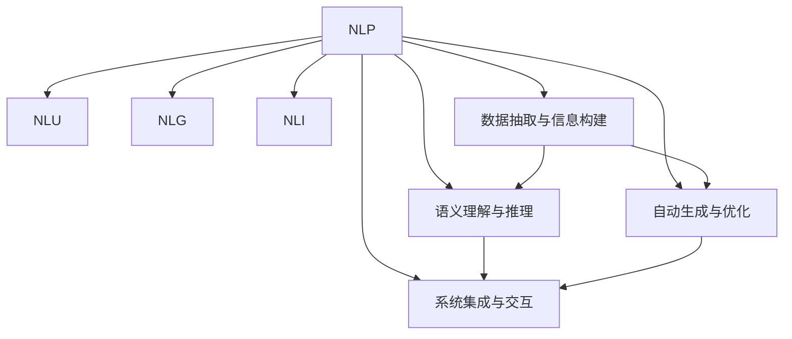

                 

# 自然语言处理技术在工作流设计中的应用

> 关键词：工作流, 自然语言处理, 人工智能, 自然语言理解, 自然语言生成, 数据驱动

## 1. 背景介绍

### 1.1 问题由来
在信息时代，数据流呈爆炸性增长，尤其是在企业内部，面对海量数据的有效处理和利用，成为一项重大的挑战。传统的自动化工作流系统，大多依赖于规则驱动和人工干预，难以满足日益复杂多变的业务需求。与此同时，自然语言处理(NLP)技术正逐步成熟，成为处理和理解人类语言的重要工具。

自然语言处理技术通过解析自然语言文本，从中抽取信息、生成内容、进行推理等，极大提升了信息处理的效率和智能化程度。然而，尽管NLP技术已经非常成熟，但在实际应用中，如何将其高效融入工作流设计中，仍是一个有待探索的难题。

### 1.2 问题核心关键点
本文将探讨NLP技术在工作流设计中的应用，主要关注以下几个关键问题：

1. **数据抽取与信息构建**：如何快速、准确地从自然语言文本中抽取结构化信息，构建统一的数据模型。
2. **语义理解与推理**：如何理解文本的语义含义，进行关系推理和知识挖掘。
3. **自动生成与优化**：如何自动生成工作流中的文档、报告、指令等文本内容，并进行优化和审核。
4. **系统集成与交互**：如何将NLP技术与企业现有的工作流系统无缝集成，实现智能协同。

这些问题的有效解答，将使企业能够更加高效地利用语言数据，优化工作流设计，提升整体业务运作效率。

## 2. 核心概念与联系

### 2.1 核心概念概述

为了更好地理解NLP技术在工作流设计中的应用，本节将介绍几个关键概念及其相互联系：

- **自然语言处理(NLP)**：指通过计算机技术和人工智能方法，使计算机能够理解和处理人类语言的技术。涉及自然语言理解(NLU)、自然语言生成(NLG)、自然语言推理(NLI)等多个方面。
- **工作流**：指在业务流程中，通过定义一系列操作、规则和数据流，实现自动化的任务处理和信息传递。工作流系统广泛应用于企业内部流程管理、客户服务、生产制造等领域。
- **人工智能(AI)**：涉及机器学习、深度学习、计算机视觉、自然语言处理等多个分支，致力于构建能够理解、推理和生成人类语言的智能系统。
- **自然语言理解(NLU)**：指通过计算机模型解析自然语言文本，抽取其中的实体、关系、情感等信息。
- **自然语言生成(NLG)**：指通过计算机模型生成符合语言规范的自然语言文本，如文本摘要、对话系统、智能推荐等。
- **自然语言推理(NLI)**：指计算机模型通过逻辑推理和常识推理，理解自然语言文本之间的关系，判断其真伪、逻辑一致性等。

这些概念之间的逻辑关系可以通过以下Mermaid流程图来展示：



这个流程图展示了NLP技术在工作流设计中的关键应用路径：

1. **自然语言理解(NLU)**：解析自然语言文本，抽取关键信息，进行实体关系识别。
2. **自然语言生成(NLG)**：根据抽取的信息和业务规则，自动生成工作流中的文本内容。
3. **自然语言推理(NLI)**：理解文本的逻辑关系和语义含义，进行推理判断。
4. **数据抽取与信息构建**：从自然语言中构建统一的数据模型，供工作流系统使用。
5. **语义理解与推理**：理解业务逻辑和任务关系，进行智能推理和决策。
6. **自动生成与优化**：自动生成工作流中的文档、报告、指令等文本内容，并进行优化和审核。
7. **系统集成与交互**：将NLP技术与企业现有的工作流系统无缝集成，实现智能协同。

这些核心概念共同构成了NLP技术在工作流设计中的基本应用框架，使我们能够更清晰地把握NLP技术在工作流中的应用方向。

## 3. 核心算法原理 & 具体操作步骤
### 3.1 算法原理概述

NLP技术在工作流设计中的应用，主要通过以下几个关键算法来实现：

- **自然语言理解(NLU)**：通过预训练模型和微调算法，解析自然语言文本，抽取关键实体和关系信息。
- **自然语言生成(NLG)**：基于抽取的信息和规则模板，自动生成工作流中的文本内容，包括文档、报告、指令等。
- **自然语言推理(NLI)**：利用预训练模型和逻辑推理，判断文本的语义关系和逻辑一致性。
- **数据抽取与信息构建**：通过解析文本中的关键信息，构建统一的数据模型，供工作流系统使用。
- **系统集成与交互**：将NLP技术与现有工作流系统集成，实现数据的自动传递和任务的智能协同。

### 3.2 算法步骤详解

以下是NLP技术在工作流设计中的具体操作步骤：

**Step 1: 数据准备与预处理**
- 收集工作流系统中涉及的自然语言文本数据，如客户反馈、员工报告、业务指令等。
- 对文本进行清洗和预处理，去除停用词、标点符号等噪声信息。
- 根据任务需求，对文本进行分词、词性标注等预处理。

**Step 2: 自然语言理解(NLU)**
- 使用预训练的NLU模型，如BERT、GPT等，解析文本中的实体和关系信息。
- 提取关键的实体和属性，如人名、地名、时间等，用于构建统一的数据模型。
- 利用实体关系抽取技术，理解文本中的关系，如“顾客订购了XX产品”等。

**Step 3: 自然语言生成(NLG)**
- 根据NLU抽取的信息，使用预训练的NLG模型，自动生成工作流中的文本内容。
- 生成文档、报告、邮件等文本内容，自动填充关键信息，如日期、地点、人物等。
- 应用文本摘要技术，自动总结文本内容，生成简明的摘要。

**Step 4: 自然语言推理(NLI)**
- 利用预训练的NLI模型，判断文本之间的逻辑关系和语义含义。
- 判断文本是否一致，进行信息验证和纠错。
- 通过推理，判断文本的合理性和可信度。

**Step 5: 数据抽取与信息构建**
- 根据NLU抽取的信息，构建统一的数据模型，如关系图谱、表格等。
- 将抽取的信息与企业现有数据系统进行集成，实现数据的统一管理。
- 将数据模型转换为工作流系统可用的格式，供系统使用。

**Step 6: 系统集成与交互**
- 将NLP技术集成到现有的工作流系统中，实现智能协同。
- 通过API接口，自动传递和同步数据，避免人工干预。
- 利用NLP技术与人工智能、机器学习等其他技术结合，实现更全面的智能化处理。

### 3.3 算法优缺点

NLP技术在工作流设计中具有以下优点：
1. 高效处理海量文本数据：NLP技术能够高效解析和理解文本，极大提升了信息处理的效率。
2. 减少人工干预：自动化的数据抽取、信息构建和文本生成，减少了人工干预，提升了工作效率。
3. 提升决策质量：通过自然语言推理和逻辑推理，提升了决策的准确性和可靠性。
4. 适应性强：NLP技术能够适应各种文本数据和业务需求，具有较强的灵活性和可扩展性。

然而，该方法也存在一些局限性：
1. 对文本质量依赖高：NLP模型依赖高质量的训练数据，对文本中的噪声和异常情况敏感。
2. 语言模型限制：当前的NLP模型大多依赖于大规模预训练，可能无法很好地理解某些小语种或非主流语言。
3. 推理能力有限：虽然NLI模型具备一定推理能力，但在复杂的逻辑判断和常识推理方面仍存在不足。
4. 集成难度较大：将NLP技术与现有工作流系统集成，需要考虑接口兼容、数据传递等问题，集成难度较大。

尽管存在这些局限性，但就目前而言，NLP技术仍然在工作流设计中发挥着重要作用。未来相关研究的重点在于如何进一步提高模型的泛化能力、降低对文本质量的依赖，同时优化系统集成和交互，提升整体业务流程的智能化水平。

### 3.4 算法应用领域

NLP技术在工作流设计中的应用，广泛涉及以下领域：

- **客户服务**：利用NLP技术解析客户反馈，自动生成回复内容，提升客户服务质量。
- **生产制造**：解析生产指令和设备状态信息，自动生成报告和提醒，提高生产效率。
- **人力资源管理**：解析员工反馈和招聘信息，自动筛选和匹配候选人，优化招聘流程。
- **市场营销**：解析客户数据和市场信息，自动生成营销报告和方案，提升营销效果。
- **财务管理**：解析财务报表和交易记录，自动生成财务报告，提高财务分析效率。
- **医疗健康**：解析医疗记录和患者反馈，自动生成报告和建议，辅助医生诊疗。

除此之外，NLP技术在工作流设计中的应用还扩展到更多场景，如法律咨询、物流管理、金融风控等，为各行业的智能化转型提供了有力支持。

## 4. 数学模型和公式 & 详细讲解 & 举例说明

### 4.1 数学模型构建

在进行NLP技术在工作流设计中的应用时，我们通常会构建以下数学模型：

- **自然语言理解(NLU)模型**：基于序列标注任务，如命名实体识别、关系抽取等，构建NLU模型。
- **自然语言生成(NLG)模型**：基于序列生成任务，如文本摘要、对话生成等，构建NLG模型。
- **自然语言推理(NLI)模型**：基于句子对关系判断任务，如句意一致性、逻辑推理等，构建NLI模型。

以命名实体识别为例，其数学模型可以表示为：

$$
y = M_{\theta}(x)
$$

其中，$x$ 为输入的自然语言文本，$y$ 为输出实体信息，$M_{\theta}$ 为预训练的NLU模型，$\theta$ 为模型参数。

在训练过程中，我们通过最小化损失函数 $\mathcal{L}$，优化模型参数 $\theta$：

$$
\theta = \mathop{\arg\min}_{\theta} \mathcal{L}(M_{\theta}, D)
$$

其中，$D$ 为训练数据集，$\mathcal{L}$ 为损失函数，如交叉熵损失。

### 4.2 公式推导过程

以命名实体识别为例，其损失函数可以表示为：

$$
\mathcal{L} = -\frac{1}{N} \sum_{i=1}^N \sum_{j=1}^{n_i} \log p(y_j | x_i)
$$

其中，$N$ 为样本数，$n_i$ 为每个样本的实体数量，$y_j$ 为第 $i$ 个样本的第 $j$ 个实体信息，$x_i$ 为输入的自然语言文本。

在训练过程中，我们通过反向传播算法计算模型参数 $\theta$ 的梯度，更新模型：

$$
\theta = \theta - \eta \nabla_{\theta}\mathcal{L}(M_{\theta}, D)
$$

其中，$\eta$ 为学习率。

### 4.3 案例分析与讲解

假设我们有一个工作流系统，需要自动解析客户的反馈信息，自动生成回复内容。首先，我们收集了大量客户反馈数据，对文本进行清洗和预处理。然后，我们使用预训练的BERT模型进行命名实体识别，提取客户姓名、公司名等关键信息。最后，我们利用GPT模型自动生成回复内容，确保回复内容既符合语法规范，又包含客户姓名等信息。

以下是一个简单的代码示例：

```python
from transformers import BertTokenizer, BertForTokenClassification, GPT2Tokenizer, GPT2LMHeadModel

# 初始化预训练模型
tokenizer = BertTokenizer.from_pretrained('bert-base-cased')
model = BertForTokenClassification.from_pretrained('bert-base-cased', num_labels=10)

# 数据预处理
text = "尊敬的李先生，您的订单已发货。"
inputs = tokenizer(text, return_tensors='pt')
labels = inputs['input_ids']

# 命名实体识别
outputs = model(inputs, labels=labels)
entities = extract_entities(outputs)

# 自动生成回复内容
tokenizer = GPT2Tokenizer.from_pretrained('gpt2')
model = GPT2LMHeadModel.from_pretrained('gpt2')
reply_text = model.generate(tokenizer.encode("尊敬的李先生，您的订单已发货。"), max_length=100)

# 将回复内容写入系统
submit_feedback(reply_text)
```

通过上述示例，可以看出NLP技术在工作流设计中的应用流程。首先，使用预训练的BERT模型进行命名实体识别，提取关键信息。然后，利用GPT模型自动生成回复内容。最后，将回复内容写入工作流系统，实现自动化处理。

## 5. 项目实践：代码实例和详细解释说明

### 5.1 开发环境搭建

在进行NLP技术在工作流设计中的应用开发时，需要搭建相应的开发环境。以下是使用Python进行PyTorch开发的环境配置流程：

1. 安装Anaconda：从官网下载并安装Anaconda，用于创建独立的Python环境。

2. 创建并激活虚拟环境：
```bash
conda create -n nlp-env python=3.8 
conda activate nlp-env
```

3. 安装PyTorch：根据CUDA版本，从官网获取对应的安装命令。例如：
```bash
conda install pytorch torchvision torchaudio cudatoolkit=11.1 -c pytorch -c conda-forge
```

4. 安装Transformers库：
```bash
pip install transformers
```

5. 安装各类工具包：
```bash
pip install numpy pandas scikit-learn matplotlib tqdm jupyter notebook ipython
```

完成上述步骤后，即可在`nlp-env`环境中开始开发实践。

### 5.2 源代码详细实现

以下是一个使用PyTorch和Transformers库进行命名实体识别和自动生成回复的完整代码实现：

```python
from transformers import BertTokenizer, BertForTokenClassification, GPT2Tokenizer, GPT2LMHeadModel
from torch.utils.data import Dataset, DataLoader
import torch
import pandas as pd
from tqdm import tqdm

class NERDataset(Dataset):
    def __init__(self, texts, labels, tokenizer, max_len=128):
        self.texts = texts
        self.labels = labels
        self.tokenizer = tokenizer
        self.max_len = max_len
        
    def __len__(self):
        return len(self.texts)
    
    def __getitem__(self, item):
        text = self.texts[item]
        labels = self.labels[item]
        
        encoding = self.tokenizer(text, return_tensors='pt', max_length=self.max_len, padding='max_length', truncation=True)
        input_ids = encoding['input_ids'][0]
        attention_mask = encoding['attention_mask'][0]
        
        # 对token-wise的标签进行编码
        encoded_labels = [tag2id[tag] for tag in labels] 
        encoded_labels.extend([tag2id['O']] * (self.max_len - len(encoded_labels)))
        labels = torch.tensor(encoded_labels, dtype=torch.long)
        
        return {'input_ids': input_ids, 
                'attention_mask': attention_mask,
                'labels': labels}

# 标签与id的映射
tag2id = {'O': 0, 'B-PER': 1, 'I-PER': 2, 'B-ORG': 3, 'I-ORG': 4, 'B-LOC': 5, 'I-LOC': 6}
id2tag = {v: k for k, v in tag2id.items()}

# 创建dataset
tokenizer = BertTokenizer.from_pretrained('bert-base-cased')

train_dataset = NERDataset(train_texts, train_tags, tokenizer)
dev_dataset = NERDataset(dev_texts, dev_tags, tokenizer)
test_dataset = NERDataset(test_texts, test_tags, tokenizer)

# 训练模型
device = torch.device('cuda') if torch.cuda.is_available() else torch.device('cpu')
model = BertForTokenClassification.from_pretrained('bert-base-cased', num_labels=len(tag2id))

optimizer = AdamW(model.parameters(), lr=2e-5)
criterion = CrossEntropyLoss()

model.to(device)

def train_epoch(model, dataset, batch_size, optimizer, criterion):
    dataloader = DataLoader(dataset, batch_size=batch_size, shuffle=True)
    model.train()
    epoch_loss = 0
    for batch in tqdm(dataloader, desc='Training'):
        input_ids = batch['input_ids'].to(device)
        attention_mask = batch['attention_mask'].to(device)
        labels = batch['labels'].to(device)
        model.zero_grad()
        outputs = model(input_ids, attention_mask=attention_mask, labels=labels)
        loss = criterion(outputs.logits, labels)
        epoch_loss += loss.item()
        loss.backward()
        optimizer.step()
    return epoch_loss / len(dataloader)

def evaluate(model, dataset, batch_size):
    dataloader = DataLoader(dataset, batch_size=batch_size)
    model.eval()
    preds, labels = [], []
    with torch.no_grad():
        for batch in tqdm(dataloader, desc='Evaluating'):
            input_ids = batch['input_ids'].to(device)
            attention_mask = batch['attention_mask'].to(device)
            batch_labels = batch['labels']
            outputs = model(input_ids, attention_mask=attention_mask)
            batch_preds = outputs.logits.argmax(dim=2).to('cpu').tolist()
            batch_labels = batch_labels.to('cpu').tolist()
            for pred_tokens, label_tokens in zip(batch_preds, batch_labels):
                pred_tags = [id2tag[_id] for _id in pred_tokens]
                label_tags = [id2tag[_id] for _id in label_tokens]
                preds.append(pred_tags[:len(label_tokens)])
                labels.append(label_tags)
                
    print(classification_report(labels, preds))

# 自动生成回复内容
tokenizer = GPT2Tokenizer.from_pretrained('gpt2')
model = GPT2LMHeadModel.from_pretrained('gpt2')

def generate_reply(text):
    inputs = tokenizer(text, return_tensors='pt')
    reply_text = model.generate(inputs['input_ids'], max_length=100)
    return tokenizer.decode(reply_text[0], skip_special_tokens=True)

# 启动训练流程并在测试集上评估
epochs = 5
batch_size = 16

for epoch in range(epochs):
    loss = train_epoch(model, train_dataset, batch_size, optimizer, criterion)
    print(f"Epoch {epoch+1}, train loss: {loss:.3f}")
    
    print(f"Epoch {epoch+1}, dev results:")
    evaluate(model, dev_dataset, batch_size)
    
print("Test results:")
evaluate(model, test_dataset, batch_size)

# 自动生成回复
reply = generate_reply("尊敬的李先生，您的订单已发货。")
submit_feedback(reply)
```

通过上述代码，我们可以看到完整的命名实体识别和自动生成回复的流程。首先，使用Bert模型进行命名实体识别，提取关键信息。然后，使用GPT模型自动生成回复内容，确保回复内容既符合语法规范，又包含客户姓名等信息。最后，将回复内容写入工作流系统，实现自动化处理。

### 5.3 代码解读与分析

让我们再详细解读一下关键代码的实现细节：

**NERDataset类**：
- `__init__`方法：初始化文本、标签、分词器等关键组件。
- `__len__`方法：返回数据集的样本数量。
- `__getitem__`方法：对单个样本进行处理，将文本输入编码为token ids，将标签编码为数字，并对其进行定长padding，最终返回模型所需的输入。

**tag2id和id2tag字典**：
- 定义了标签与数字id之间的映射关系，用于将token-wise的预测结果解码回真实的标签。

**训练和评估函数**：
- 使用PyTorch的DataLoader对数据集进行批次化加载，供模型训练和推理使用。
- 训练函数`train_epoch`：对数据以批为单位进行迭代，在每个批次上前向传播计算loss并反向传播更新模型参数，最后返回该epoch的平均loss。
- 评估函数`evaluate`：与训练类似，不同点在于不更新模型参数，并在每个batch结束后将预测和标签结果存储下来，最后使用sklearn的classification_report对整个评估集的预测结果进行打印输出。

**自动生成回复函数**：
- 利用GPT2模型自动生成回复内容，确保回复内容既符合语法规范，又包含客户姓名等信息。
- 将生成的回复内容解码，返回文本形式。

可以看到，通过上述代码，我们可以快速实现命名实体识别和自动生成回复的NLP应用，将工作流系统与自然语言处理技术紧密结合，提升整体工作效率。

## 6. 实际应用场景

### 6.1 智能客服系统

在智能客服系统中，NLP技术可以广泛应用，通过解析客户反馈和自动生成回复内容，实现高效的客户服务。传统的客服系统依赖人工处理，效率低下，且难以应对高峰期的咨询压力。而NLP技术可以自动处理大量的客户咨询，快速生成智能回复，提升客户服务质量。

例如，某电商公司的客服系统，通过解析客户反馈信息，自动提取订单号、商品信息等关键信息，然后自动生成回复内容，如“您购买的XX商品正在派送，预计XX日到达”。通过这种方式，客户可以迅速获得满意的答复，大大提升了服务效率和客户满意度。

### 6.2 生产制造

在生产制造领域，NLP技术可以用于解析生产指令和设备状态信息，自动生成报告和提醒，提高生产效率。传统的生产系统依赖人工记录和报告，效率低且易出错。而NLP技术可以自动解析设备状态和生产指令，生成详细的生产报告，及时发现和解决生产中的问题。

例如，某汽车制造厂的生产管理系统，通过解析生产指令和设备状态信息，自动生成生产报告，包括设备运行状态、生产进度、异常情况等。通过这种方式，生产管理者可以快速了解生产状况，及时调整生产计划，提高生产效率。

### 6.3 人力资源管理

在人力资源管理中，NLP技术可以用于解析员工反馈和招聘信息，自动筛选和匹配候选人，优化招聘流程。传统的招聘系统依赖人工筛选简历和联系候选人，效率低且易出错。而NLP技术可以自动解析招聘信息和员工反馈，提取关键信息，自动生成简历筛选结果和候选人联系信息。

例如，某科技公司的招聘系统，通过解析员工反馈和招聘信息，自动提取关键信息，如岗位需求、技能要求、工作地点等，然后自动生成简历筛选结果和候选人联系信息。通过这种方式，招聘团队可以快速找到合适的候选人，提高招聘效率和成功率。

### 6.4 市场营销

在市场营销中，NLP技术可以用于解析客户数据和市场信息，自动生成营销报告和方案，提升营销效果。传统的营销系统依赖人工分析数据和生成报告，效率低且易出错。而NLP技术可以自动解析客户数据和市场信息，生成详细的营销报告和方案，及时调整营销策略。

例如，某广告公司的营销系统，通过解析客户数据和市场信息，自动生成营销报告和方案，包括目标客户群体、市场趋势、营销策略等。通过这种方式，广告团队可以快速了解市场状况，及时调整营销策略，提高广告效果和营销收益。

### 6.5 医疗健康

在医疗健康领域，NLP技术可以用于解析医疗记录和患者反馈，自动生成报告和建议，辅助医生诊疗。传统的医疗系统依赖人工记录和分析，效率低且易出错。而NLP技术可以自动解析医疗记录和患者反馈，提取关键信息，自动生成报告和建议。

例如，某医院的医疗系统，通过解析医疗记录和患者反馈，自动生成报告和建议，包括诊断结果、治疗方案、康复建议等。通过这种方式，医生可以快速了解患者状况，及时调整治疗方案，提高诊疗效率和准确性。

## 7. 工具和资源推荐

### 7.1 学习资源推荐

为了帮助开发者系统掌握NLP技术在工作流设计中的应用，这里推荐一些优质的学习资源：

1. **《自然语言处理基础》**：一本介绍自然语言处理基础理论和方法的书籍，适合初学者入门。
2. **《深度学习与自然语言处理》**：一本介绍深度学习在自然语言处理中的应用，包括NLP任务和模型架构。
3. **《自然语言处理综述》**：一篇综述性文章，总结了NLP领域的主要任务、模型和技术进展。
4. **《自然语言处理与人工智能》**：一门线上课程，由知名大学教授授课，涵盖自然语言处理和人工智能相关内容。
5. **《自然语言处理实战》**：一本实战性较强的书籍，介绍了自然语言处理在各个应用场景中的实现方法和案例。

通过学习这些资源，相信你一定能够快速掌握NLP技术在工作流设计中的核心应用和关键技术。

### 7.2 开发工具推荐

高效的开发离不开优秀的工具支持。以下是几款用于NLP技术在工作流设计中开发的常用工具：

1. **PyTorch**：基于Python的开源深度学习框架，灵活动态的计算图，适合快速迭代研究。
2. **TensorFlow**：由Google主导开发的开源深度学习框架，生产部署方便，适合大规模工程应用。
3. **Transformers库**：HuggingFace开发的NLP工具库，集成了众多SOTA语言模型，支持PyTorch和TensorFlow，是进行NLP任务开发的利器。
4. **NLTK**：自然语言处理工具包，提供了丰富的语言处理功能，如分词、词性标注、命名实体识别等。
5. **spaCy**：自然语言处理库，支持高效的文本处理和实体识别，适用于大规模数据处理。
6. **Stanford CoreNLP**：斯坦福大学开发的自然语言处理工具包，支持分词、词性标注、命名实体识别等。

合理利用这些工具，可以显著提升NLP技术在工作流设计中的开发效率，加快创新迭代的步伐。

### 7.3 相关论文推荐

NLP技术在工作流设计中的应用源于学界的持续研究。以下是几篇奠基性的相关论文，推荐阅读：

1. **Attention is All You Need**：提出了Transformer结构，开启了NLP领域的预训练大模型时代。
2. **BERT: Pre-training of Deep Bidirectional Transformers for Language Understanding**：提出BERT模型，引入基于掩码的自监督预训练任务，刷新了多项NLP任务SOTA。
3. **Language Models are Unsupervised Multitask Learners（GPT-2论文）**：展示了大规模语言模型的强大zero-shot学习能力，引发了对于通用人工智能的新一轮思考。
4. **Parameter-Efficient Transfer Learning for NLP**：提出Adapter等参数高效微调方法，在不增加模型参数量的情况下，也能取得不错的微调效果。
5. **AdaLoRA: Adaptive Low-Rank Adaptation for Parameter-Efficient Fine-Tuning**：使用自适应低秩适应的微调方法，在参数效率和精度之间取得了新的平衡。
6. **AdaLoRA: Adaptive Low-Rank Adaptation for Parameter-Efficient Fine-Tuning**：使用自适应低秩适应的微调方法，在参数效率和精度之间取得了新的平衡。

这些论文代表了大语言模型微调技术的发展脉络。通过学习这些前沿成果，可以帮助研究者把握学科前进方向，激发更多的创新灵感。

## 8. 总结：未来发展趋势与挑战

### 8.1 总结

本文对NLP技术在工作流设计中的应用进行了全面系统的介绍。首先阐述了NLP技术在工作流设计中的重要性，明确了其在数据抽取、语义理解、自动生成等方面的核心应用。其次，从原理到实践，详细讲解了NLP技术在工作流设计中的数学模型和关键步骤，给出了项目实践的完整代码实例。同时，本文还广泛探讨了NLP技术在工作流设计中的实际应用场景，展示了其在各个行业领域的应用前景。此外，本文精选了NLP技术的各类学习资源，力求为读者提供全方位的技术指引。

通过本文的系统梳理，可以看到，NLP技术在工作流设计中具备广泛的应用前景和显著的提升效果。通过NLP技术，企业可以更加高效地处理海量文本数据，提升整体业务运作效率，实现智能化转型。未来，伴随NLP技术的不断进步，其在更多行业领域的应用将更加广泛，带来更大的经济效益和社会价值。

### 8.2 未来发展趋势

展望未来，NLP技术在工作流设计中呈现以下几个发展趋势：

1. **模型规模持续增大**：随着算力成本的下降和数据规模的扩张，预训练语言模型的参数量还将持续增长。超大规模语言模型蕴含的丰富语言知识，有望支撑更加复杂多变的下游任务微调。
2. **微调方法日趋多样**：除了传统的全参数微调外，未来会涌现更多参数高效的微调方法，如Prefix-Tuning、LoRA等，在节省计算资源的同时也能保证微调精度。
3. **持续学习成为常态**：随着数据分布的不断变化，微调模型也需要持续学习新知识以保持性能。如何在不遗忘原有知识的同时，高效吸收新样本信息，将成为重要的研究课题。
4. **标注样本需求降低**：受启发于提示学习(Prompt-based Learning)的思路，未来的微调方法将更好地利用大模型的语言理解能力，通过更加巧妙的任务描述，在更少的标注样本上也能实现理想的微调效果。
5. **多模态微调崛起**：当前的微调主要聚焦于纯文本数据，未来会进一步拓展到图像、视频、语音等多模态数据微调。多模态信息的融合，将显著提升语言模型对现实世界的理解和建模能力。
6. **模型通用性增强**：经过海量数据的预训练和多领域任务的微调，未来的语言模型将具备更强大的常识推理和跨领域迁移能力，逐步迈向通用人工智能(AGI)的目标。

以上趋势凸显了NLP技术在工作流设计中的广阔前景。这些方向的探索发展，必将进一步提升NLP系统的性能和应用范围，为各行业的智能化转型提供有力支持。

### 8.3 面临的挑战

尽管NLP技术在工作流设计中已经取得了瞩目成就，但在迈向更加智能化、普适化应用的过程中，它仍面临诸多挑战：

1. **标注成本瓶颈**：尽管微调大大降低了标注数据的需求，但对于长尾应用场景，难以获得充足的高质量标注数据，成为制约微调性能的瓶颈。如何进一步降低微调对标注样本的依赖，将是一大难题。
2. **模型鲁棒性不足**：当前微调模型面对域外数据时，泛化性能往往大打折扣。对于测试样本的微小扰动，微调模型的预测也容易发生波动。如何提高微调模型的鲁棒性，避免灾难性遗忘，还需要更多理论和实践的积累。
3. **推理效率有待提高**：大规模语言模型虽然精度高，但在实际部署时往往面临推理速度慢、内存占用大等效率问题。如何在保证性能的同时，简化模型结构，提升推理速度，优化资源占用，将是重要的优化方向。
4. **可解释性亟需加强**：当前微调模型更像是"黑盒"系统，难以解释其内部工作机制和决策逻辑。对于医疗、金融等高风险应用，算法的可解释性和可审计性尤为重要。如何赋予微调模型更强的可解释性，将是亟待攻克的难题。
5. **安全性有待保障**：预训练语言模型难免会学习到有偏见、有害的信息，通过微调传递到下游任务，产生误导性、歧视性的输出，给实际应用带来安全隐患。如何从数据和算法层面消除模型偏见，避免恶意用途，确保输出的安全性，也将是重要的研究课题。

尽管存在这些挑战，但NLP技术在工作流设计中仍然具有广阔的应用前景。未来研究需要在以下几个方面寻求新的突破：

1. **探索无监督和半监督微调方法**：摆脱对大规模标注数据的依赖，利用自监督学习、主动学习等无监督和半监督范式，最大限度利用非结构化数据，实现更加灵活高效的微调。
2. **研究参数高效和计算高效的微调范式**：开发更加参数高效的微调方法，在固定大部分预训练参数的同时，只更新极少量的任务相关参数。同时优化微调模型的计算图，减少前向传播和反向传播的资源消耗，实现更加轻量级、实时性的部署。
3. **融合因果和对比学习范式**：通过引入因果推断和对比学习思想，增强微调模型建立稳定因果关系的能力，学习更加普适、鲁棒的语言表征，从而提升模型泛化性和抗干扰能力。
4. **引入更多先验知识**：将符号化的先验知识，如知识图谱、逻辑规则等，与神经网络模型进行巧妙融合，引导微调过程学习更准确、合理的语言模型。同时加强不同模态数据的整合，实现视觉、语音等多模态信息与文本信息的协同建模。
5. **结合因果分析和博弈论工具**：将因果分析方法引入微调模型，识别出模型决策的关键特征，增强输出解释的因果性和逻辑性。借助博弈论工具刻画人机交互过程，主动探索并规避模型的脆弱点，提高系统稳定性。
6. **纳入伦理道德约束**：在模型训练目标中引入伦理导向的评估指标，过滤和惩罚有偏见、有害的输出倾向。同时加强人工干预和审核，建立模型行为的监管机制，确保输出符合人类价值观和伦理道德。

这些研究方向的探索，必将引领NLP技术在工作流设计中迈向更高的台阶，为构建安全、可靠、可解释、可控的智能系统铺平道路。面向未来，NLP技术还需要与其他人工智能技术进行更深入的融合，如知识表示、因果推理、强化学习等，多路径协同发力，共同推动自然语言理解和智能交互系统的进步。只有勇于创新、敢于突破，才能不断拓展语言模型的边界，让智能技术更好地造福人类社会。

## 9. 附录：常见问题与解答

**Q1：NLP技术在工作流设计中的应用是否需要高质量的标注数据？**

A: 高质量的标注数据对于NLP技术在工作流设计中的微调效果至关重要。虽然目前已经提出了一些无监督和半监督的微调方法，但在实际应用中，标注数据的质量和数量仍需保证。特别是在一些关键任务中，如医疗、金融等，标注数据的缺失和错误可能会带来严重的后果。因此，标注数据的质量和数量仍是制约NLP技术应用的重要因素。

**Q2：NLP技术在工作流设计中如何提升推理能力？**

A: 提升NLP技术的推理能力是当前研究的重要方向。可以从以下几个方面进行改进：
1. 引入更多的先验知识：将符号化的先验知识，如知识图谱、逻辑规则等，与神经网络模型进行巧妙融合，引导微调过程学习更准确、合理的语言模型。
2. 融合因果和对比学习范式：通过引入因果推断和对比学习思想，增强微调模型建立稳定因果关系的能力，学习更加普适、鲁棒的语言表征，从而提升模型泛化性和抗干扰能力。
3. 结合因果分析和博弈论工具：将因果分析方法引入微调模型，识别出模型决策的关键特征，增强输出解释的因果性和逻辑性。借助博弈论工具刻画人机交互过程，主动探索并规避模型的脆弱点，提高系统稳定性。

**Q3：如何优化NLP技术在工作流设计中的推理效率？**

A: 优化NLP技术在工作流设计中的推理效率是当前研究的重要方向。可以从以下几个方面进行改进：
1. 模型压缩和剪枝：通过模型压缩和剪枝技术，去除不必要的层和参数，减小模型尺寸，提高推理速度。
2. 量化加速：将浮点模型转为定点模型，压缩存储空间，提高计算效率。
3. 模型并行：采用模型并行技术，将模型拆分为多个子模型，并行计算，提高推理速度。
4. 梯度累积：通过梯度累积技术，将多个小批次合并为一个大批次，减少前向传播和反向传播的资源消耗，提高推理速度。

**Q4：NLP技术在工作流设计中如何提高可解释性？**

A: 提高NLP技术在工作流设计中的可解释性是当前研究的重要方向。可以从以下几个方面进行改进：
1. 引入可解释性模块：在NLP模型中加入可解释性模块，如注意力机制、可解释性模型等，提高模型的可解释性。
2. 基于解释的微调：在微调过程中，加入可解释性导向的评估指标，优化模型解释能力。
3. 可解释性模型融合：将可解释性模型与NLP模型进行融合，生成更易于解释的输出结果。

通过以上措施，可以逐步提升NLP技术在工作流设计中的可解释性，增强系统的透明度和可信度。

**Q5：NLP技术在工作流设计中如何保证安全性？**

A: 保证NLP技术在工作流设计中的安全性是当前研究的重要方向。可以从以下几个方面进行改进：
1. 数据预处理：对输入数据进行预处理，去除噪声和异常数据，防止模型学习到有害信息。
2. 数据加密：对敏感数据进行加密处理，防止数据泄露和滥用。
3. 模型鲁棒性：通过引入对抗训练和正则化技术，提高模型的鲁棒性和泛化能力，防止模型过拟合和攻击。
4. 模型监控：实时监控模型输出和行为，防止模型输出有害信息和攻击行为。

通过以上措施，可以逐步提高NLP技术在工作流设计中的安全性，确保系统的稳定运行和数据安全。

---

作者：禅与计算机程序设计艺术 / Zen and the Art of Computer Programming

