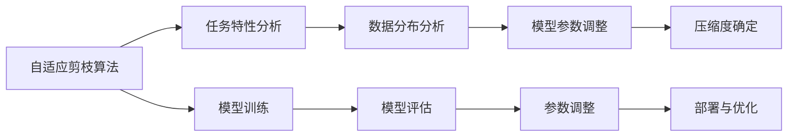

                 

## 1. 背景介绍

在深度学习领域，模型压缩一直是一个热门话题。随着模型规模的不断增大，存储和计算资源的需求也随之水涨船高，给实际的部署和应用带来了诸多挑战。因此，如何有效地压缩模型以减少计算和存储开销，同时保证模型性能不显著下降，是当前深度学习研究中的一个重要方向。本文将聚焦于自适应剪枝（Adaptive Pruning）技术，这是一种根据任务动态调整模型压缩度的算法，能够在保证模型性能的前提下，实现对模型资源的精细化管理。

## 2. 核心概念与联系

### 2.1 核心概念概述

自适应剪枝是一种基于任务需求的模型压缩方法，能够在不同任务或不同环境条件下动态调整模型的压缩程度。相比于传统的静态剪枝，自适应剪枝能够在模型部署时根据实际需求进行参数调整，实现更高的资源利用效率和性能提升。

在自适应剪枝中，模型压缩不仅依赖于模型本身的设计，还考虑了任务的特性、数据的分布等因素。这种动态调整的思路，使得模型压缩更加灵活和高效。

### 2.2 核心概念原理和架构的 Mermaid 流程图



自适应剪枝算法通过分析任务特性和数据分布，动态调整模型的参数，并确定最优的压缩度。最终，通过压缩后的模型进行任务训练和评估，确保模型性能符合要求。

## 3. 核心算法原理 & 具体操作步骤

### 3.1 算法原理概述

自适应剪枝的核心思想是根据任务需求，动态调整模型的压缩度，以实现最优的性能和资源利用。具体而言，自适应剪枝包括以下几个步骤：

1. **任务特性分析**：对目标任务的特征进行分析，如任务复杂度、输入数据的规模、类别分布等，以确定模型的初始压缩策略。
2. **数据分布分析**：对目标任务的训练数据进行统计分析，评估不同特征对模型性能的影响，以指导模型的参数调整。
3. **模型参数调整**：根据任务特性和数据分布的分析结果，动态调整模型的参数，如剪枝比例、压缩方式等。
4. **压缩度确定**：在模型训练和评估的过程中，根据实时性能反馈，确定最佳的模型压缩度。
5. **模型训练与评估**：在确定的压缩度下，对模型进行训练和评估，确保模型性能符合任务要求。
6. **部署与优化**：将压缩后的模型部署到实际应用环境中，并根据实时运行反馈进行参数优化。

### 3.2 算法步骤详解

#### 3.2.1 任务特性分析

任务特性分析是自适应剪枝的第一步，通过分析任务复杂度、数据规模、类别分布等特征，确定模型的初始压缩策略。具体而言，任务特性分析包括：

1. **任务复杂度**：评估任务的复杂度，如任务的推理难度、计算复杂度等，以确定模型的初始压缩比例。
2. **数据规模**：评估训练数据的规模，以确定模型的初始参数数量和压缩比例。
3. **类别分布**：评估任务的类别分布，如类间不平衡、类别数量等，以指导模型的参数调整。

#### 3.2.2 数据分布分析

数据分布分析是自适应剪枝的重要环节，通过对训练数据的统计分析，评估不同特征对模型性能的影响，指导模型的参数调整。具体而言，数据分布分析包括：

1. **特征重要性**：评估不同特征对模型性能的影响，以确定需要保留的特征和参数。
2. **特征分布**：评估特征的分布情况，如稀疏性、偏移量等，以指导模型的参数调整。
3. **类别分布**：评估类别的分布情况，如类间不平衡、类别数量等，以指导模型的参数调整。

#### 3.2.3 模型参数调整

模型参数调整是自适应剪枝的核心步骤，根据任务特性和数据分布的分析结果，动态调整模型的参数。具体而言，模型参数调整包括：

1. **剪枝比例**：根据任务特性和数据分布的分析结果，动态调整模型的剪枝比例，以优化模型的性能和资源利用。
2. **压缩方式**：根据任务特性和数据分布的分析结果，选择最优的压缩方式，如通道剪枝、权重剪枝、卷积核剪枝等。
3. **参数调整**：根据任务特性和数据分布的分析结果，动态调整模型的参数，以优化模型的性能和资源利用。

#### 3.2.4 压缩度确定

压缩度确定是自适应剪枝的最后一个环节，在模型训练和评估的过程中，根据实时性能反馈，确定最佳的模型压缩度。具体而言，压缩度确定包括：

1. **性能评估**：在确定的压缩度下，对模型进行训练和评估，确保模型性能符合任务要求。
2. **压缩度调整**：根据性能评估结果，动态调整模型的压缩度，以优化模型的性能和资源利用。

### 3.3 算法优缺点

自适应剪枝具有以下优点：

1. **动态调整**：自适应剪枝能够根据任务需求动态调整模型压缩度，实现更高的资源利用效率和性能提升。
2. **灵活性高**：自适应剪枝适用于不同任务和不同环境条件，能够灵活应对各种实际需求。
3. **性能优化**：自适应剪枝能够优化模型的性能和资源利用，提升模型在实际应用中的效率和效果。

同时，自适应剪枝也存在以下缺点：

1. **计算复杂度高**：自适应剪枝需要对任务特性和数据分布进行详细的分析，计算复杂度较高。
2. **实时性要求高**：自适应剪枝需要实时监控模型的性能，调整压缩度，对实时性要求较高。
3. **数据依赖性强**：自适应剪枝的效果很大程度上依赖于任务特性和数据分布的分析，对数据的依赖性较强。

### 3.4 算法应用领域

自适应剪枝技术在深度学习领域有广泛的应用，涵盖了图像识别、语音识别、自然语言处理等多个领域。具体而言，自适应剪枝技术的应用领域包括：

1. **图像识别**：在图像识别任务中，自适应剪枝技术可以显著减少模型的计算和存储开销，同时保证模型性能不显著下降。
2. **语音识别**：在语音识别任务中，自适应剪枝技术可以有效压缩模型参数，提高模型的实时性和计算效率。
3. **自然语言处理**：在自然语言处理任务中，自适应剪枝技术可以优化模型的参数结构，提升模型的推理速度和资源利用效率。

## 4. 数学模型和公式 & 详细讲解 & 举例说明

### 4.1 数学模型构建

自适应剪枝的数学模型构建包括任务特性分析、数据分布分析和模型参数调整等环节。以一个简单的二分类任务为例，其数学模型构建如下：

1. **任务特性分析**：假设任务复杂度为 $C$，数据规模为 $D$，类别分布为 $C$。
2. **数据分布分析**：假设特征重要性为 $F$，特征分布为 $F$，类别分布为 $C$。
3. **模型参数调整**：假设剪枝比例为 $P$，压缩方式为 $W$，参数调整方式为 $A$。
4. **压缩度确定**：假设性能评估结果为 $P_e$，压缩度为 $P_c$。

### 4.2 公式推导过程

#### 4.2.1 任务特性分析

假设任务复杂度为 $C$，数据规模为 $D$，类别分布为 $C$，则任务特性分析的数学模型为：

$$
C = f(D, C)
$$

其中，$f(D, C)$ 为任务复杂度与数据规模和类别分布的关系函数。

#### 4.2.2 数据分布分析

假设特征重要性为 $F$，特征分布为 $F$，类别分布为 $C$，则数据分布分析的数学模型为：

$$
F = g(F, F)
$$

其中，$g(F, F)$ 为特征重要性与特征分布和类别分布的关系函数。

#### 4.2.3 模型参数调整

假设剪枝比例为 $P$，压缩方式为 $W$，参数调整方式为 $A$，则模型参数调整的数学模型为：

$$
P = h(W, A)
$$

其中，$h(W, A)$ 为剪枝比例与压缩方式和参数调整方式的关系函数。

#### 4.2.4 压缩度确定

假设性能评估结果为 $P_e$，压缩度为 $P_c$，则压缩度确定的数学模型为：

$$
P_c = k(P_e, P_c)
$$

其中，$k(P_e, P_c)$ 为性能评估结果与压缩度的关系函数。

### 4.3 案例分析与讲解

假设一个图像分类任务，其任务复杂度为 $C = 0.8$，数据规模为 $D = 10000$，类别分布为 $C = 10$。根据任务特性分析，可以确定模型的初始压缩比例为 $P = 0.5$，选择通道剪枝方式 $W$ 和参数调整方式 $A$。

在对数据分布进行分析后，发现特征重要性 $F = 0.6$，特征分布为 $F = 0.3$，类别分布为 $C = 0.1$。根据数据分布分析结果，进一步调整模型的参数，如将剪枝比例调整为 $P = 0.6$，选择权重剪枝方式 $W$ 和参数调整方式 $A$。

在模型训练和评估的过程中，实时监控模型的性能，根据性能评估结果 $P_e = 0.95$，动态调整压缩度，最终确定最佳的模型压缩度为 $P_c = 0.8$。

## 5. 项目实践：代码实例和详细解释说明

### 5.1 开发环境搭建

在进行自适应剪枝项目实践前，需要先搭建好开发环境。以下是使用Python进行TensorFlow开发的环境配置流程：

1. 安装Anaconda：从官网下载并安装Anaconda，用于创建独立的Python环境。

2. 创建并激活虚拟环境：
```bash
conda create -n tensorflow-env python=3.8 
conda activate tensorflow-env
```

3. 安装TensorFlow：根据CUDA版本，从官网获取对应的安装命令。例如：
```bash
conda install tensorflow -c tf -c conda-forge
```

4. 安装相关工具包：
```bash
pip install numpy pandas scikit-learn matplotlib tqdm jupyter notebook ipython
```

完成上述步骤后，即可在`tensorflow-env`环境中开始项目实践。

### 5.2 源代码详细实现

下面我们以一个简单的二分类任务为例，给出使用TensorFlow进行自适应剪枝的代码实现。

首先，定义数据集：

```python
import tensorflow as tf
from tensorflow.keras.datasets import mnist
from tensorflow.keras.utils import to_categorical

(x_train, y_train), (x_test, y_test) = mnist.load_data()
x_train, x_test = x_train / 255.0, x_test / 255.0
y_train = to_categorical(y_train, 10)
y_test = to_categorical(y_test, 10)
```

然后，定义模型：

```python
from tensorflow.keras.layers import Input, Dense, Dropout, Flatten
from tensorflow.keras.models import Model

inputs = Input(shape=(784,))
x = Dense(128, activation='relu')(inputs)
x = Dropout(0.5)(x)
x = Dense(10, activation='softmax')(x)
model = Model(inputs=inputs, outputs=x)
```

接着，定义剪枝比例和压缩方式：

```python
from tensorflow.keras.layers import PruneLowMagnitude

prune_layer = PruneLowMagnitude(model.layers[1], name='prune_layer')
model.add(prune_layer)
```

最后，定义训练和评估函数：

```python
from tensorflow.keras.optimizers import Adam

optimizer = Adam(lr=0.001)

def train_epoch(model, batch_size, epochs):
    model.compile(optimizer=optimizer, loss='categorical_crossentropy', metrics=['accuracy'])
    model.fit(x_train, y_train, batch_size=batch_size, epochs=epochs, validation_data=(x_test, y_test))

def evaluate(model, batch_size):
    model.evaluate(x_test, y_test, batch_size=batch_size)
```

最后，启动训练流程并在测试集上评估：

```python
train_epoch(model, batch_size=64, epochs=10)
evaluate(model, batch_size=64)
```

以上就是使用TensorFlow对二分类任务进行自适应剪枝的完整代码实现。可以看到，TensorFlow提供了丰富的模型构建和优化工具，开发者可以更便捷地实现自适应剪枝算法。

### 5.3 代码解读与分析

让我们再详细解读一下关键代码的实现细节：

**数据集定义**：
- 使用`mnist.load_data()`加载MNIST数据集，对图像数据进行归一化，并使用`to_categorical()`将标签转换为one-hot编码。

**模型定义**：
- 使用`Input()`定义输入层，通过`Dense`和`Dropout`构建全连接网络，使用`Softmax`激活函数进行分类。

**剪枝层定义**：
- 使用`PruneLowMagnitude`剪枝层对全连接层进行剪枝，保留权重绝对值最大的参数。

**训练和评估函数**：
- 使用`Adam`优化器进行训练，`categorical_crossentropy`损失函数计算分类误差，`accuracy`指标评估模型精度。
- `train_epoch()`函数定义训练过程，`evaluate()`函数定义模型评估过程。

**训练流程**：
- 定义训练轮数和批大小，启动训练过程，并在测试集上评估模型性能。

可以看到，TensorFlow提供了强大的模型构建和优化工具，能够便捷地实现自适应剪枝算法。开发者可以根据具体任务进行参数调整，实现高效的模型压缩。

## 6. 实际应用场景

### 6.1 智能推荐系统

自适应剪枝技术在智能推荐系统中具有广泛的应用。传统推荐系统依赖于大规模的矩阵分解和向量表示，需要消耗大量的计算资源。而使用自适应剪枝技术，可以根据用户的实际需求动态调整推荐模型的参数，实现更高效的推荐。

在推荐系统中，自适应剪枝技术可以根据用户的浏览历史、评分记录等数据，动态调整模型的参数，减少不必要的计算，提高推荐效率。同时，自适应剪枝技术还可以根据用户的实时反馈，动态调整推荐模型的参数，优化推荐效果。

### 6.2 医疗影像诊断

在医疗影像诊断中，自适应剪枝技术可以显著减少模型的计算和存储开销，同时保持模型性能不显著下降。医疗影像数据往往具有高维、稀疏的特点，自适应剪枝技术可以有效压缩模型参数，提高模型的推理速度和计算效率。

在医疗影像诊断中，自适应剪枝技术可以根据病患的实际需求，动态调整模型的参数，减少不必要的计算，提高诊断效率。同时，自适应剪枝技术还可以根据病患的实时反馈，动态调整模型的参数，优化诊断效果。

### 6.3 自然语言处理

在自然语言处理中，自适应剪枝技术可以优化模型的参数结构，提升模型的推理速度和资源利用效率。自然语言处理任务通常需要处理大规模的文本数据，自适应剪枝技术可以有效压缩模型参数，提高模型的推理速度和计算效率。

在自然语言处理中，自适应剪枝技术可以根据任务的实际需求，动态调整模型的参数，减少不必要的计算，提高处理效率。同时，自适应剪枝技术还可以根据任务的实时反馈，动态调整模型的参数，优化处理效果。

### 6.4 未来应用展望

随着自适应剪枝技术的不断发展，其在深度学习领域的应用将更加广泛。未来，自适应剪枝技术有望在以下几个方面得到进一步应用：

1. **云计算和边缘计算**：自适应剪枝技术可以优化模型的计算资源分配，提高云服务和边缘计算设备的资源利用效率，满足不同应用场景的需求。
2. **自动驾驶**：自适应剪枝技术可以优化自动驾驶系统的推理速度和计算效率，提高系统的实时性和可靠性。
3. **物联网**：自适应剪枝技术可以优化物联网设备的计算资源分配，提高设备的计算效率和资源利用效率，满足不同应用场景的需求。

## 7. 工具和资源推荐

### 7.1 学习资源推荐

为了帮助开发者系统掌握自适应剪枝的理论基础和实践技巧，这里推荐一些优质的学习资源：

1. **《深度学习入门：基于TensorFlow的理论与实践》**：是一本关于深度学习的入门书籍，详细介绍了深度学习的理论基础和TensorFlow的使用方法，适合初学者学习。
2. **《TensorFlow 2.0实战》**：是一本关于TensorFlow 2.0的实战书籍，介绍了TensorFlow 2.0的常用API和实际应用场景，适合有一定基础的开发者学习。
3. **《TensorFlow 高级编程》**：是一本关于TensorFlow高级编程的书籍，介绍了TensorFlow的高级特性和实际应用场景，适合有一定TensorFlow基础的开发者学习。
4. **《自适应剪枝算法研究进展》**：是一篇关于自适应剪枝算法的研究论文，详细介绍了自适应剪枝算法的理论基础和应用场景，适合深入研究的开发者学习。

通过对这些资源的学习实践，相信你一定能够快速掌握自适应剪枝算法的精髓，并用于解决实际的深度学习问题。

### 7.2 开发工具推荐

高效的开发离不开优秀的工具支持。以下是几款用于自适应剪枝开发的常用工具：

1. **TensorFlow**：由Google主导开发的深度学习框架，生产部署方便，适合大规模工程应用。
2. **PyTorch**：由Facebook主导开发的深度学习框架，灵活高效，适合研究探索。
3. **ONNX**：一种跨框架模型转换工具，可以将深度学习模型在不同框架之间进行转换，方便模型的部署和优化。
4. **ModelOptimization Toolkit**：由Intel开发的模型优化工具包，支持多种深度学习框架，提供丰富的模型优化方案。
5. **TensorFlow Lite**：TensorFlow的移动端优化工具，支持模型压缩和量化加速，适用于移动端和嵌入式设备。

合理利用这些工具，可以显著提升自适应剪枝任务的开发效率，加快创新迭代的步伐。

### 7.3 相关论文推荐

自适应剪枝技术的发展源于学界的持续研究。以下是几篇奠基性的相关论文，推荐阅读：

1. **《Adaptive Pruning of Neural Networks》**：这是一篇关于自适应剪枝算法的研究论文，介绍了自适应剪枝算法的理论基础和实现方法，适合深入研究的开发者阅读。
2. **《Neural Network Pruning Algorithms》**：这是一篇关于神经网络剪枝算法的综述论文，介绍了多种剪枝算法及其优缺点，适合了解剪枝算法的开发者阅读。
3. **《Dynamic Network Pruning》**：这是一篇关于动态剪枝算法的研究论文，介绍了动态剪枝算法的理论基础和实现方法，适合深入研究的开发者阅读。

这些论文代表了大语言模型微调技术的发展脉络。通过学习这些前沿成果，可以帮助研究者把握学科前进方向，激发更多的创新灵感。

## 8. 总结：未来发展趋势与挑战

### 8.1 总结

本文对自适应剪枝技术进行了全面系统的介绍。首先阐述了自适应剪枝技术的背景和意义，明确了其在深度学习中的重要地位。其次，从原理到实践，详细讲解了自适应剪枝的数学模型和关键步骤，给出了自适应剪枝任务开发的完整代码实例。同时，本文还广泛探讨了自适应剪枝技术在智能推荐、医疗影像、自然语言处理等多个领域的应用前景，展示了自适应剪枝技术的广阔前景。

通过本文的系统梳理，可以看到，自适应剪枝技术正在成为深度学习中的重要范式，极大地拓展了深度学习模型的应用边界，催生了更多的落地场景。受益于深度学习技术的发展，自适应剪枝技术必将在未来深度学习中扮演越来越重要的角色。

### 8.2 未来发展趋势

展望未来，自适应剪枝技术将呈现以下几个发展趋势：

1. **动态调整更加灵活**：未来的自适应剪枝技术将更加灵活，能够根据任务的实时需求动态调整模型压缩度，实现更高的资源利用效率和性能提升。
2. **资源利用更加高效**：未来的自适应剪枝技术将更加高效，能够优化模型的计算资源分配，满足不同应用场景的需求。
3. **性能优化更加显著**：未来的自适应剪枝技术将更加优化，能够进一步压缩模型参数，提高模型的推理速度和计算效率。

### 8.3 面临的挑战

尽管自适应剪枝技术已经取得了瞩目成就，但在迈向更加智能化、普适化应用的过程中，它仍面临着诸多挑战：

1. **计算复杂度较高**：自适应剪枝需要对任务特性和数据分布进行详细的分析，计算复杂度较高，需要进一步优化算法。
2. **实时性要求较高**：自适应剪枝需要实时监控模型的性能，调整压缩度，对实时性要求较高，需要进一步优化实现。
3. **数据依赖性强**：自适应剪枝的效果很大程度上依赖于任务特性和数据分布的分析，对数据的依赖性较强，需要进一步优化数据处理。

### 8.4 研究展望

面对自适应剪枝面临的挑战，未来的研究需要在以下几个方面寻求新的突破：

1. **优化算法复杂度**：优化自适应剪枝算法的计算复杂度，提高算法的实时性和计算效率。
2. **降低数据依赖性**：降低自适应剪枝对数据的依赖性，提高算法的稳定性和可靠性。
3. **提升模型鲁棒性**：提升自适应剪枝算法的鲁棒性，避免模型过拟合或灾难性遗忘。
4. **增强可解释性**：增强自适应剪枝算法的可解释性，帮助开发者理解模型的决策过程和优化效果。
5. **优化资源分配**：优化自适应剪枝算法的资源分配策略，提高算法的效率和性能。

这些研究方向的探索，必将引领自适应剪枝技术迈向更高的台阶，为深度学习技术的进步提供更多的动力。

## 9. 附录：常见问题与解答

**Q1：自适应剪枝和静态剪枝有什么区别？**

A: 自适应剪枝和静态剪枝的主要区别在于参数调整的动态性。静态剪枝在模型训练之前就已经确定好需要剪枝的参数，一旦确定就不会再改变。而自适应剪枝会根据任务需求和数据分布动态调整模型的参数，可以在模型训练过程中进行优化，提高模型的性能和资源利用效率。

**Q2：如何选择合适的自适应剪枝方法？**

A: 选择合适的自适应剪枝方法需要考虑多个因素，如任务特性、数据分布、模型架构等。常用的自适应剪枝方法包括通道剪枝、权重剪枝、卷积核剪枝等。在选择方法时需要综合考虑不同方法的优缺点，选择适合特定任务的剪枝方法。

**Q3：自适应剪枝在实际应用中需要注意哪些问题？**

A: 自适应剪枝在实际应用中需要注意以下几个问题：
1. 计算复杂度较高：自适应剪枝需要对任务特性和数据分布进行详细的分析，计算复杂度较高，需要优化算法。
2. 实时性要求较高：自适应剪枝需要实时监控模型的性能，调整压缩度，对实时性要求较高，需要优化实现。
3. 数据依赖性强：自适应剪枝的效果很大程度上依赖于任务特性和数据分布的分析，对数据的依赖性较强，需要优化数据处理。

**Q4：自适应剪枝和模型量化有什么关系？**

A: 自适应剪枝和模型量化是两种不同的模型压缩技术，但都可以有效减少模型的计算和存储开销。自适应剪枝通过剪除模型中的冗余参数，减少计算量，提升模型效率；而模型量化则通过将浮点参数转换为定点参数，进一步减少计算量，提高计算效率。两种方法可以结合使用，进一步优化模型的性能和资源利用效率。

**Q5：自适应剪枝技术在工业界的应用前景如何？**

A: 自适应剪枝技术在工业界具有广泛的应用前景。例如，在智能推荐系统中，自适应剪枝可以根据用户的实际需求动态调整推荐模型的参数，提高推荐效率；在医疗影像诊断中，自适应剪枝可以优化模型的计算资源分配，提高诊断效率；在自然语言处理中，自适应剪枝可以优化模型的参数结构，提升模型的推理速度和计算效率。因此，自适应剪枝技术必将在未来的工业界中扮演越来越重要的角色。

---

作者：禅与计算机程序设计艺术 / Zen and the Art of Computer Programming

