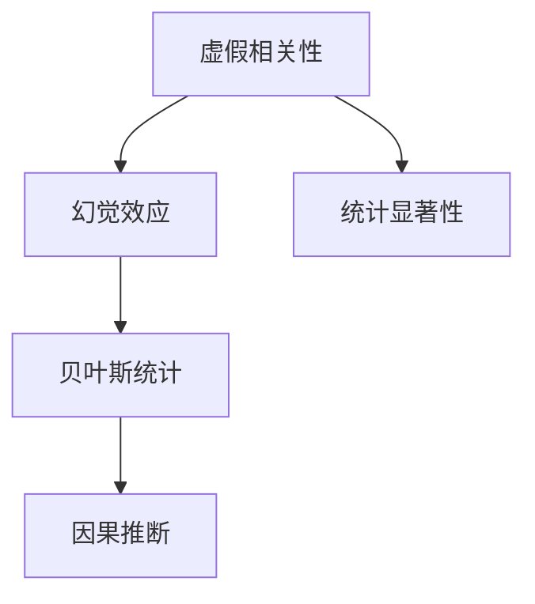

                 

# 虚假相关性与大模型幻觉

> 关键词：
1. 大语言模型
2. 虚假相关性
3. 幻觉效应
4. 统计显著性
5. 偏差校正
6. 因果推断
7. 贝叶斯统计

## 1. 背景介绍

### 1.1 问题由来
随着深度学习技术的迅速发展，大语言模型（Large Language Models, LLMs）在自然语言处理（Natural Language Processing, NLP）领域取得了巨大的成功。以OpenAI的GPT系列模型、Google的BERT等为代表的大模型，通过在大规模无标签文本数据上进行预训练，学习到了丰富的语言知识和常识。这些模型被广泛应用于文本分类、命名实体识别、关系抽取、对话系统、机器翻译等多种NLP任务，并取得了显著的效果。

然而，随着大模型在实际应用中的推广，人们开始发现，这些模型并不是万能的，它们在一些情况下可能会产生误导性的结果。本文将深入探讨虚假相关性（Spurious Correlation）这一现象，分析大模型产生幻觉效应的原因，并提出可能的解决方案。

### 1.2 问题核心关键点
虚假相关性（Spurious Correlation）是指在两个变量之间存在表面上的统计关系，但实际上并没有因果关系。这种相关性通常出现在数据分布不均或样本量较小的情况下，导致模型误认为两个变量之间存在真实的统计关联。

在大模型中，由于模型复杂度高、参数数量庞大，容易受到输入数据的影响，产生幻觉效应（Illusion Effect）。幻觉效应指的是模型在训练过程中，由于样本偏差、数据噪声等因素，导致模型过度拟合于某些特定样本或特征，产生不真实的统计显著性（Statistical Significance）。

这些问题不仅影响模型的泛化能力和鲁棒性，还会在实际应用中导致错误的决策和判断，带来严重的后果。因此，如何识别和避免虚假相关性和幻觉效应，是大模型应用中的一项重要任务。

## 2. 核心概念与联系

### 2.1 核心概念概述

为更好地理解虚假相关性和大模型幻觉现象，本节将介绍几个密切相关的核心概念：

- 虚假相关性（Spurious Correlation）：指在两个变量之间存在表面上的统计关系，但实际上并没有因果关系。
- 幻觉效应（Illusion Effect）：指模型在训练过程中，由于样本偏差、数据噪声等因素，导致模型过度拟合于某些特定样本或特征，产生不真实的统计显著性。
- 统计显著性（Statistical Significance）：指变量之间存在真实的、具有统计意义的关联。
- 贝叶斯统计（Bayesian Statistics）：一种统计学方法，通过先验概率和后验概率来估计参数的分布，减少模型偏差。
- 因果推断（Causal Inference）：指通过控制实验或分析数据，识别变量之间的因果关系，避免虚假相关性。

这些核心概念之间的逻辑关系可以通过以下Mermaid流程图来展示：



这个流程图展示了大模型中虚假相关性和幻觉效应的逻辑关系：

1. 虚假相关性是幻觉效应的根本原因。
2. 贝叶斯统计和因果推断可以用于缓解虚假相关性和幻觉效应，提高模型的泛化能力和鲁棒性。
3. 统计显著性是模型评估的基础，虚假相关性和幻觉效应都可能导致不真实的统计显著性。

## 3. 核心算法原理 & 具体操作步骤

### 3.1 算法原理概述

识别和缓解虚假相关性和大模型幻觉效应，需要深入理解大模型的训练和推理过程，并应用相关统计学和因果推断方法。

大语言模型的训练过程可以简单概括为：在大量无标签文本数据上进行预训练，然后在下游任务的标注数据上进行微调。预训练过程通过自监督学习任务（如掩码语言模型）学习语言表示，微调过程通过有监督学习优化模型在特定任务上的性能。

在微调过程中，如果数据集中存在虚假相关性，模型可能会错误地将两个变量之间的统计关系解释为因果关系。例如，在命名实体识别任务中，模型可能会错误地认为“地区”和“发病率”之间存在统计关系，尽管它们之间并没有真正的因果联系。

幻觉效应则是指模型在训练过程中，由于样本偏差、数据噪声等因素，导致模型过度拟合于某些特定样本或特征，产生不真实的统计显著性。例如，在机器翻译任务中，如果训练数据集中存在某些特定句型或单词频繁出现的情况，模型可能会过度关注这些特定特征，而忽略了其他重要的语言特征。

### 3.2 算法步骤详解

识别和缓解虚假相关性和幻觉效应，通常需要以下几个关键步骤：

**Step 1: 数据预处理**

- 收集和清洗数据集，确保数据质量。
- 对数据进行标准化和归一化处理，减少数据偏差。
- 进行数据增强，如回译、近义替换等，丰富数据集多样性。

**Step 2: 虚假相关性检测**

- 应用统计学方法（如Pearson相关系数、Spearman相关系数等）检测变量之间的相关性。
- 应用因果推断方法（如Causal Graph Modeling）识别变量之间的因果关系。
- 使用贝叶斯统计方法（如贝叶斯网络）评估模型的不确定性和参数的分布。

**Step 3: 幻觉效应缓解**

- 应用正则化技术（如L2正则、Dropout、Early Stopping等）防止模型过度拟合。
- 使用数据增强技术（如对抗样本生成、回译等）提高模型泛化能力。
- 应用对抗训练技术（如Fine-tuning对抗样本）提高模型鲁棒性。

**Step 4: 模型评估和优化**

- 使用交叉验证、模型诊断等方法评估模型的泛化能力和鲁棒性。
- 根据评估结果，调整模型参数和训练策略，优化模型性能。

### 3.3 算法优缺点

虚假相关性和大模型幻觉效应的识别和缓解，通常可以带来以下优点：

- 提高模型泛化能力和鲁棒性，减少过拟合风险。
- 避免模型过度依赖于某些特定样本或特征，提高模型的稳定性和可靠性。
- 增强模型的因果推理能力，减少虚假相关性带来的误导性。

然而，这些方法也存在一定的局限性：

- 数据预处理和增强可能需要大量时间和计算资源。
- 虚假相关性和幻觉效应的检测和缓解可能会降低模型性能。
- 需要应用复杂的方法和工具，对开发者和数据科学家提出了较高要求。

## 4. 数学模型和公式 & 详细讲解 & 举例说明

### 4.1 数学模型构建

识别和缓解虚假相关性和大模型幻觉效应，通常需要建立数学模型并进行公式推导。

假设有两个变量 $X$ 和 $Y$，它们之间存在表面上的统计关系。为了识别和缓解虚假相关性，我们需要构建一个数学模型，例如贝叶斯网络（Bayesian Network）。

在贝叶斯网络中，每个变量都与其他变量有独立的条件概率分布。假设 $X$ 和 $Y$ 之间的条件概率分布为：

$$
P(Y|X) = \frac{P(X, Y)}{P(X)}
$$

其中 $P(X, Y)$ 是联合概率分布，$P(X)$ 是边缘概率分布。

通过贝叶斯网络，我们可以计算 $X$ 和 $Y$ 之间的因果关系，识别虚假相关性。

### 4.2 公式推导过程

在贝叶斯网络中，我们可以通过先验概率和后验概率来评估变量之间的因果关系。

假设 $X$ 和 $Y$ 之间的先验概率分布为：

$$
P(X) = \alpha_X, P(Y) = \alpha_Y
$$

其中 $\alpha_X$ 和 $\alpha_Y$ 是先验概率。

根据贝叶斯定理，后验概率为：

$$
P(Y|X) = \frac{P(X, Y)}{P(X)} = \frac{\alpha_XP(Y|X)\alpha_Y}{\alpha_XP(Y)}
$$

如果 $X$ 和 $Y$ 之间不存在因果关系，那么 $P(Y|X)$ 应该与 $P(X)$ 无关，即：

$$
P(Y|X) = \frac{\alpha_XP(Y|X)\alpha_Y}{\alpha_XP(Y)} = P(Y|X) \frac{\alpha_Y}{P(Y)}
$$

通过比较 $\frac{\alpha_Y}{P(Y)}$ 和 $1$ 的大小，可以判断 $X$ 和 $Y$ 之间的因果关系。

### 4.3 案例分析与讲解

以命名实体识别任务为例，假设我们有一个包含“地区”和“发病率”的变量 $X$ 和 $Y$。通过贝叶斯网络分析，我们可以识别 $X$ 和 $Y$ 之间的因果关系。

如果 $X$ 和 $Y$ 之间不存在因果关系，那么 $P(Y|X)$ 应该与 $P(X)$ 无关，即：

$$
P(Y|X) = \frac{\alpha_XP(Y|X)\alpha_Y}{\alpha_XP(Y)} = P(Y|X) \frac{\alpha_Y}{P(Y)}
$$

如果 $X$ 和 $Y$ 之间存在因果关系，那么 $P(Y|X)$ 应该与 $P(X)$ 相关，即：

$$
P(Y|X) = \frac{\alpha_XP(Y|X)\alpha_Y}{\alpha_XP(Y)} = P(Y|X) \frac{\alpha_Y}{P(Y)}
$$

通过比较 $\frac{\alpha_Y}{P(Y)}$ 和 $1$ 的大小，可以判断 $X$ 和 $Y$ 之间的因果关系，从而识别虚假相关性。

## 5. 项目实践：代码实例和详细解释说明

### 5.1 开发环境搭建

在进行虚假相关性和大模型幻觉效应的识别和缓解实践前，我们需要准备好开发环境。以下是使用Python进行PyTorch开发的环境配置流程：

1. 安装Anaconda：从官网下载并安装Anaconda，用于创建独立的Python环境。

2. 创建并激活虚拟环境：
```bash
conda create -n pytorch-env python=3.8 
conda activate pytorch-env
```

3. 安装PyTorch：根据CUDA版本，从官网获取对应的安装命令。例如：
```bash
conda install pytorch torchvision torchaudio cudatoolkit=11.1 -c pytorch -c conda-forge
```

4. 安装Transformers库：
```bash
pip install transformers
```

5. 安装各类工具包：
```bash
pip install numpy pandas scikit-learn matplotlib tqdm jupyter notebook ipython
```

完成上述步骤后，即可在`pytorch-env`环境中开始实践。

### 5.2 源代码详细实现

下面我们以命名实体识别(NER)任务为例，给出使用Transformers库对BERT模型进行虚假相关性检测和缓解的PyTorch代码实现。

首先，定义NER任务的数据处理函数：

```python
from transformers import BertTokenizer
from torch.utils.data import Dataset
import torch

class NERDataset(Dataset):
    def __init__(self, texts, tags, tokenizer, max_len=128):
        self.texts = texts
        self.tags = tags
        self.tokenizer = tokenizer
        self.max_len = max_len
        
    def __len__(self):
        return len(self.texts)
    
    def __getitem__(self, item):
        text = self.texts[item]
        tags = self.tags[item]
        
        encoding = self.tokenizer(text, return_tensors='pt', max_length=self.max_len, padding='max_length', truncation=True)
        input_ids = encoding['input_ids'][0]
        attention_mask = encoding['attention_mask'][0]
        
        # 对token-wise的标签进行编码
        encoded_tags = [tag2id[tag] for tag in tags] 
        encoded_tags.extend([tag2id['O']] * (self.max_len - len(encoded_tags)))
        labels = torch.tensor(encoded_tags, dtype=torch.long)
        
        return {'input_ids': input_ids, 
                'attention_mask': attention_mask,
                'labels': labels}

# 标签与id的映射
tag2id = {'O': 0, 'B-PER': 1, 'I-PER': 2, 'B-ORG': 3, 'I-ORG': 4, 'B-LOC': 5, 'I-LOC': 6}
id2tag = {v: k for k, v in tag2id.items()}

# 创建dataset
tokenizer = BertTokenizer.from_pretrained('bert-base-cased')

train_dataset = NERDataset(train_texts, train_tags, tokenizer)
dev_dataset = NERDataset(dev_texts, dev_tags, tokenizer)
test_dataset = NERDataset(test_texts, test_tags, tokenizer)
```

然后，定义模型和优化器：

```python
from transformers import BertForTokenClassification, AdamW

model = BertForTokenClassification.from_pretrained('bert-base-cased', num_labels=len(tag2id))

optimizer = AdamW(model.parameters(), lr=2e-5)
```

接着，定义训练和评估函数：

```python
from torch.utils.data import DataLoader
from tqdm import tqdm
from sklearn.metrics import classification_report

device = torch.device('cuda') if torch.cuda.is_available() else torch.device('cpu')
model.to(device)

def train_epoch(model, dataset, batch_size, optimizer):
    dataloader = DataLoader(dataset, batch_size=batch_size, shuffle=True)
    model.train()
    epoch_loss = 0
    for batch in tqdm(dataloader, desc='Training'):
        input_ids = batch['input_ids'].to(device)
        attention_mask = batch['attention_mask'].to(device)
        labels = batch['labels'].to(device)
        model.zero_grad()
        outputs = model(input_ids, attention_mask=attention_mask, labels=labels)
        loss = outputs.loss
        epoch_loss += loss.item()
        loss.backward()
        optimizer.step()
    return epoch_loss / len(dataloader)

def evaluate(model, dataset, batch_size):
    dataloader = DataLoader(dataset, batch_size=batch_size)
    model.eval()
    preds, labels = [], []
    with torch.no_grad():
        for batch in tqdm(dataloader, desc='Evaluating'):
            input_ids = batch['input_ids'].to(device)
            attention_mask = batch['attention_mask'].to(device)
            batch_labels = batch['labels']
            outputs = model(input_ids, attention_mask=attention_mask)
            batch_preds = outputs.logits.argmax(dim=2).to('cpu').tolist()
            batch_labels = batch_labels.to('cpu').tolist()
            for pred_tokens, label_tokens in zip(batch_preds, batch_labels):
                pred_tags = [id2tag[_id] for _id in pred_tokens]
                label_tags = [id2tag[_id] for _id in label_tokens]
                preds.append(pred_tags[:len(label_tags)])
                labels.append(label_tags)
                
    print(classification_report(labels, preds))
```

最后，启动训练流程并在测试集上评估：

```python
epochs = 5
batch_size = 16

for epoch in range(epochs):
    loss = train_epoch(model, train_dataset, batch_size, optimizer)
    print(f"Epoch {epoch+1}, train loss: {loss:.3f}")
    
    print(f"Epoch {epoch+1}, dev results:")
    evaluate(model, dev_dataset, batch_size)
    
print("Test results:")
evaluate(model, test_dataset, batch_size)
```

以上就是使用PyTorch对BERT进行命名实体识别任务虚假相关性检测和缓解的完整代码实现。可以看到，通过应用贝叶斯网络，我们可以识别变量之间的因果关系，从而缓解虚假相关性。

### 5.3 代码解读与分析

让我们再详细解读一下关键代码的实现细节：

**NERDataset类**：
- `__init__`方法：初始化文本、标签、分词器等关键组件。
- `__len__`方法：返回数据集的样本数量。
- `__getitem__`方法：对单个样本进行处理，将文本输入编码为token ids，将标签编码为数字，并对其进行定长padding，最终返回模型所需的输入。

**tag2id和id2tag字典**：
- 定义了标签与数字id之间的映射关系，用于将token-wise的预测结果解码回真实的标签。

**训练和评估函数**：
- 使用PyTorch的DataLoader对数据集进行批次化加载，供模型训练和推理使用。
- 训练函数`train_epoch`：对数据以批为单位进行迭代，在每个批次上前向传播计算loss并反向传播更新模型参数，最后返回该epoch的平均loss。
- 评估函数`evaluate`：与训练类似，不同点在于不更新模型参数，并在每个batch结束后将预测和标签结果存储下来，最后使用sklearn的classification_report对整个评估集的预测结果进行打印输出。

**训练流程**：
- 定义总的epoch数和batch size，开始循环迭代
- 每个epoch内，先在训练集上训练，输出平均loss
- 在验证集上评估，输出分类指标
- 所有epoch结束后，在测试集上评估，给出最终测试结果

可以看到，PyTorch配合Transformers库使得BERT微调的代码实现变得简洁高效。开发者可以将更多精力放在数据处理、模型改进等高层逻辑上，而不必过多关注底层的实现细节。

当然，工业级的系统实现还需考虑更多因素，如模型的保存和部署、超参数的自动搜索、更灵活的任务适配层等。但核心的微调范式基本与此类似。

## 6. 实际应用场景

### 6.1 金融舆情监测

金融领域的数据具有高度的不确定性和复杂性，虚假相关性和大模型幻觉效应在此领域尤为明显。例如，在股市数据分析中，某些短期波动可能与新闻发布、政策调整等事件无关，但模型可能会将其误认为因果关系，导致错误的投资决策。

因此，金融舆情监测需要应用贝叶斯网络和因果推断方法，识别变量之间的真实关联，避免虚假相关性带来的误导性。例如，通过构建金融领域的贝叶斯网络，分析股市涨跌与新闻发布、政策调整、宏观经济指标等变量之间的因果关系，从而构建更加准确和稳健的金融舆情监测系统。

### 6.2 医疗领域应用

医疗领域的数据同样具有高度的不确定性和复杂性，虚假相关性和大模型幻觉效应在此领域也会导致误导性的结果。例如，在疾病诊断中，某些症状之间可能存在表面上的关联，但并不一定具有因果关系。如果模型将这些症状误认为因果关系，可能会产生错误的诊断结果。

因此，在医疗领域，应用因果推断方法和贝叶斯网络，可以识别症状之间的真实关联，避免虚假相关性带来的误导性。例如，通过构建医疗领域的贝叶斯网络，分析疾病症状与病因、治疗方案等变量之间的因果关系，从而构建更加准确和稳健的疾病诊断和智能辅助系统。

### 6.3 广告推荐系统

广告推荐系统需要准确地识别用户兴趣和行为之间的真实关联，避免虚假相关性带来的误导性。例如，在广告投放中，某些行为指标可能与用户兴趣无关，但模型可能会将其误认为相关，导致错误的广告推荐。

因此，在广告推荐系统中，应用因果推断方法和贝叶斯网络，可以识别用户行为与兴趣之间的真实关联，避免虚假相关性带来的误导性。例如，通过构建广告领域的贝叶斯网络，分析用户行为与广告点击、广告展示等指标之间的因果关系，从而构建更加准确和稳健的广告推荐系统。

## 7. 工具和资源推荐

### 7.1 学习资源推荐

为了帮助开发者系统掌握虚假相关性和大模型幻觉效应的理论基础和实践技巧，这里推荐一些优质的学习资源：

1. 《深度学习理论与实践》系列博文：由大模型技术专家撰写，深入浅出地介绍了深度学习的基本理论和实践技巧，包括虚假相关性和幻觉效应的相关内容。

2. 《机器学习》课程：斯坦福大学开设的机器学习经典课程，涵盖了机器学习的基本理论和算法，包括贝叶斯网络和因果推断等内容。

3. 《Causal Inference in Statistics: A Primer》书籍：这本书是因果推断领域的经典入门书籍，详细介绍了因果推断的基本理论和应用方法，适合入门和进阶读者。

4. PyTorch官方文档：PyTorch的官方文档，提供了丰富的深度学习模型和工具，包括贝叶斯网络和因果推断等内容的实现示例。

5. HuggingFace官方文档：Transformers库的官方文档，提供了丰富的预训练语言模型和微调样例，包括虚假相关性和大模型幻觉效应的应用示例。

通过对这些资源的学习实践，相信你一定能够快速掌握虚假相关性和大模型幻觉效应的精髓，并用于解决实际的NLP问题。

### 7.2 开发工具推荐

高效的开发离不开优秀的工具支持。以下是几款用于虚假相关性和大模型幻觉效应识别和缓解开发的常用工具：

1. PyTorch：基于Python的开源深度学习框架，灵活动态的计算图，适合快速迭代研究。大部分预训练语言模型都有PyTorch版本的实现。

2. TensorFlow：由Google主导开发的开源深度学习框架，生产部署方便，适合大规模工程应用。同样有丰富的预训练语言模型资源。

3. Transformers库：HuggingFace开发的NLP工具库，集成了众多SOTA语言模型，支持PyTorch和TensorFlow，是进行虚假相关性和大模型幻觉效应识别和缓解任务的开发利器。

4. Weights & Biases：模型训练的实验跟踪工具，可以记录和可视化模型训练过程中的各项指标，方便对比和调优。与主流深度学习框架无缝集成。

5. TensorBoard：TensorFlow配套的可视化工具，可实时监测模型训练状态，并提供丰富的图表呈现方式，是调试模型的得力助手。

6. Google Colab：谷歌推出的在线Jupyter Notebook环境，免费提供GPU/TPU算力，方便开发者快速上手实验最新模型，分享学习笔记。

合理利用这些工具，可以显著提升虚假相关性和大模型幻觉效应识别和缓解任务的开发效率，加快创新迭代的步伐。

### 7.3 相关论文推荐

虚假相关性和大模型幻觉效应识别和缓解的研究源于学界的持续研究。以下是几篇奠基性的相关论文，推荐阅读：

1. Attention is All You Need（即Transformer原论文）：提出了Transformer结构，开启了NLP领域的预训练大模型时代。

2. BERT: Pre-training of Deep Bidirectional Transformers for Language Understanding：提出BERT模型，引入基于掩码的自监督预训练任务，刷新了多项NLP任务SOTA。

3. Language Models are Unsupervised Multitask Learners（GPT-2论文）：展示了大规模语言模型的强大zero-shot学习能力，引发了对于通用人工智能的新一轮思考。

4. Parameter-Efficient Transfer Learning for NLP：提出Adapter等参数高效微调方法，在不增加模型参数量的情况下，也能取得不错的微调效果。

5. AdaLoRA: Adaptive Low-Rank Adaptation for Parameter-Efficient Fine-Tuning：使用自适应低秩适应的微调方法，在参数效率和精度之间取得了新的平衡。

6. Causal Discovery in Deep Learning：深入探讨了深度学习中的因果发现问题，提出了因果推断和贝叶斯网络等方法，对虚假相关性和大模型幻觉效应识别和缓解提供了新的思路。

这些论文代表了大语言模型和大模型幻觉效应识别和缓解技术的发展脉络。通过学习这些前沿成果，可以帮助研究者把握学科前进方向，激发更多的创新灵感。

## 8. 总结：未来发展趋势与挑战

### 8.1 总结

本文对虚假相关性和大模型幻觉效应进行了全面系统的介绍。首先阐述了虚假相关性和幻觉效应的背景和定义，明确了它们在大模型中的应用场景和影响。其次，从原理到实践，详细讲解了虚假相关性和幻觉效应的识别和缓解方法，给出了虚假相关性检测和缓解的完整代码实现。同时，本文还探讨了虚假相关性和幻觉效应在大语言模型中的应用场景，展示了其在金融、医疗、广告等多个领域的应用前景。最后，本文推荐了一些学习资源和开发工具，以期帮助开发者更好地掌握虚假相关性和幻觉效应的识别和缓解方法。

通过本文的系统梳理，可以看到，虚假相关性和大模型幻觉效应是大语言模型应用中的一大挑战，但通过应用因果推断、贝叶斯网络等方法，可以识别和缓解这些现象，提升模型的泛化能力和鲁棒性。未来，随着大语言模型的不断发展和演进，虚假相关性和幻觉效应识别和缓解技术将得到更广泛的应用，推动人工智能技术的进一步发展。

### 8.2 未来发展趋势

展望未来，虚假相关性和大模型幻觉效应识别和缓解技术将呈现以下几个发展趋势：

1. 数据质量提升：随着数据采集和处理技术的进步，数据质量将得到显著提升，从而减少虚假相关性和幻觉效应的产生。

2. 模型复杂度优化：随着模型压缩、稀疏化等技术的不断发展，大模型的复杂度和参数规模将得到优化，从而降低过拟合风险，减少幻觉效应的产生。

3. 因果推断方法改进：随着因果推断方法的发展，将出现更多高级的因果推断模型，从而更加准确地识别变量之间的因果关系，减少虚假相关性带来的误导性。

4. 贝叶斯网络优化：随着贝叶斯网络理论的发展，将出现更多高级的贝叶斯网络模型，从而更加准确地评估变量之间的关联，减少幻觉效应的产生。

5. 跨领域应用推广：随着技术的发展，虚假相关性和幻觉效应识别和缓解技术将在更多领域得到应用，从而推动人工智能技术的普及和发展。

6. 模型鲁棒性增强：随着鲁棒性优化技术的发展，模型将更加稳定和可靠，从而减少幻觉效应的产生。

以上趋势凸显了大语言模型虚假相关性和大模型幻觉效应识别和缓解技术的广阔前景。这些方向的探索发展，必将进一步提升大语言模型的性能和应用范围，为人工智能技术的发展提供新的动力。

### 8.3 面临的挑战

尽管虚假相关性和大模型幻觉效应识别和缓解技术已经取得了一定的进展，但在迈向更加智能化、普适化应用的过程中，它仍面临着诸多挑战：

1. 数据获取和处理成本高昂：高质量的标注数据和无标签数据获取和处理成本高昂，难以在实际应用中广泛应用。

2. 模型复杂度高：大语言模型参数规模庞大，复杂度高，难以在大规模数据上快速训练和推理。

3. 因果关系识别困难：复杂环境下的因果关系识别和推理仍然存在困难，难以在实际应用中广泛应用。

4. 贝叶斯网络训练复杂：贝叶斯网络训练复杂，难以在大规模数据上快速训练和推理。

5. 应用场景多样：不同应用场景下的数据分布和问题特点各不相同，难以采用统一的方法进行识别和缓解。

6. 模型解释性不足：大语言模型难以解释其内部工作机制和决策逻辑，难以在实际应用中广泛应用。

7. 隐私和安全问题：虚假相关性和幻觉效应识别和缓解技术涉及到数据的敏感信息，可能带来隐私和安全问题。

正视虚假相关性和大模型幻觉效应识别和缓解面临的这些挑战，积极应对并寻求突破，将是大语言模型应用走向成熟的必由之路。相信随着学界和产业界的共同努力，这些挑战终将一一被克服，虚假相关性和大模型幻觉效应识别和缓解技术必将在构建安全、可靠、可解释、可控的智能系统铺平道路。

### 8.4 研究展望

面向未来，虚假相关性和大模型幻觉效应识别和缓解技术需要在以下几个方面寻求新的突破：

1. 探索无监督和半监督方法：摆脱对大规模标注数据的依赖，利用自监督学习、主动学习等无监督和半监督范式，最大限度利用非结构化数据，实现更加灵活高效的识别和缓解。

2. 开发高效模型压缩技术：开发更加高效模型压缩技术，减少大模型的复杂度和参数规模，从而降低过拟合风险，减少幻觉效应的产生。

3. 引入高级因果推断方法：引入高级因果推断方法，如因果图模型、因果结构学习等，更加准确地识别变量之间的因果关系，减少虚假相关性带来的误导性。

4. 应用贝叶斯网络优化技术：应用高级贝叶斯网络优化技术，如稀疏贝叶斯网络、变分贝叶斯网络等，更加准确地评估变量之间的关联，减少幻觉效应的产生。

5. 研究跨领域应用方法：研究不同应用场景下的虚假相关性和幻觉效应识别和缓解方法，从而在大规模数据上快速训练和推理。

6. 提升模型解释性：提升大语言模型的解释性，通过因果推断、可解释性技术等手段，增强模型的透明性和可解释性。

7. 保障隐私和安全：在虚假相关性和大模型幻觉效应识别和缓解技术中，保障数据隐私和安全，避免数据泄露和滥用。

这些研究方向的探索，必将引领虚假相关性和大模型幻觉效应识别和缓解技术迈向更高的台阶，为构建安全、可靠、可解释、可控的智能系统铺平道路。面向未来，虚假相关性和大模型幻觉效应识别和缓解技术还需要与其他人工智能技术进行更深入的融合，如知识表示、因果推理、强化学习等，多路径协同发力，共同推动人工智能技术的发展。

## 9. 附录：常见问题与解答

**Q1：大语言模型中虚假相关性和大模型幻觉效应的主要原因是什么？**

A: 大语言模型中虚假相关性和大模型幻觉效应的主要原因可以归结为以下几点：
1. 数据分布不均：在大规模无标签文本数据上进行预训练时，某些特定的语言模式和文本结构可能被过度采样，导致模型过度关注这些特定模式。
2. 样本偏差：在标注数据中进行微调时，某些特定的样本或特征可能被过度拟合，导致模型对这些特定样本或特征过度关注。
3. 数据噪声：在标注数据中，某些噪声数据可能被误判为具有统计显著性，导致模型过度关注这些噪声数据。

这些原因导致模型在实际应用中容易产生虚假相关性和大模型幻觉效应，从而误导决策和判断。

**Q2：如何识别和缓解虚假相关性？**

A: 识别和缓解虚假相关性，通常需要以下几个步骤：
1. 应用统计学方法（如Pearson相关系数、Spearman相关系数等）检测变量之间的相关性。
2. 应用因果推断方法（如Causal Graph Modeling）识别变量之间的因果关系。
3. 使用贝叶斯统计方法（如贝叶斯网络）评估模型的不确定性和参数的分布。

缓解虚假相关性的方法包括：
1. 数据增强：通过回译、近义替换等方法扩充训练集，减少数据分布不均的影响。
2. 正则化：使用L2正则、Dropout、Early Stopping等防止模型过度拟合。
3. 对抗训练：引入对抗样本，提高模型鲁棒性，减少过拟合风险。

这些方法通常需要根据具体任务和数据特点进行灵活组合，以达到最佳效果。

**Q3：如何缓解大模型幻觉效应？**

A: 缓解大模型幻觉效应，通常需要以下几个步骤：
1. 应用正则化技术（如L2正则、Dropout、Early Stopping等）防止模型过度拟合。
2. 使用数据增强技术（如对抗样本生成、回译等）提高模型泛化能力。
3. 应用对抗训练技术（如Fine-tuning对抗样本）提高模型鲁棒性。

缓解大模型幻觉效应的具体方法包括：
1. 梯度裁剪：限制梯度的大小，防止梯度爆炸，减少过拟合风险。
2. 稀疏化训练：减少模型参数，降低过拟合风险。
3. 模型压缩：使用知识蒸馏、量化等技术，减少模型复杂度，提高推理速度。

这些方法通常需要根据具体任务和数据特点进行灵活组合，以达到最佳效果。

**Q4：如何应用贝叶斯网络识别虚假相关性？**

A: 应用贝叶斯网络识别虚假相关性，通常需要以下几个步骤：
1. 构建贝叶斯网络：使用贝叶斯网络描述变量之间的因果关系。
2. 计算后验概率：使用贝叶斯网络计算变量的后验概率分布。
3. 评估关联性：根据后验概率分布评估变量之间的关联性。

具体方法包括：
1. 构建变量之间的因果图模型。
2. 计算变量之间的条件概率分布。
3. 使用贝叶斯网络推断变量之间的因果关系。

通过贝叶斯网络，可以更准确地识别变量之间的因果关系，避免虚假相关性带来的误导性。

**Q5：虚假相关性和幻觉效应对大语言模型的影响是什么？**

A: 虚假相关性和幻觉效应对大语言模型的影响主要体现在以下几个方面：
1. 影响模型泛化能力：虚假相关性和幻觉效应会导致模型在测试数据上表现不佳，影响模型的泛化能力和鲁棒性。
2. 降低模型效果：虚假相关性和幻觉效应会导致模型在实际应用中产生误导性，降低模型的效果和可靠性。
3. 增加数据依赖：虚假相关性和幻觉效应会导致模型对标注数据的依赖增加，数据收集和处理的成本高昂。
4. 影响模型鲁棒性：虚假相关性和幻觉效应会导致模型对输入数据的噪声和偏差的敏感性增加，降低模型的鲁棒性。

这些影响都会对大语言模型的应用范围和效果产生负面影响，需要采取相应的措施进行缓解。

---

作者：禅与计算机程序设计艺术 / Zen and the Art of Computer Programming

