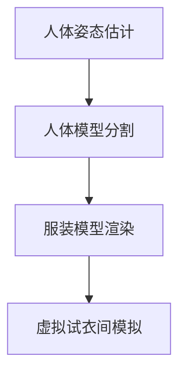

                 

# 虚拟试衣创业：在线购物体验的革新

## 1. 背景介绍

### 1.1 问题由来

在线购物的兴起极大地改变了我们的购物习惯，但依然存在一些痛点问题。其中，试衣体验不佳是最常见的痛点之一。在线购物无法提供实体的试穿体验，消费者在下单前无法充分了解商品适配度，这导致了一系列问题：退货率高、用户满意度低、购物体验差等。为了解决这些问题，虚拟试衣技术应运而生。

虚拟试衣技术，通过计算机视觉、深度学习等前沿技术，结合虚拟试衣间场景模拟，使用户能够在虚拟环境中试穿服装，获得与实体试穿相似的体验。通过模拟真实试衣场景，用户可以直观地了解服装的版型、颜色适配度，从而做出更明智的购买决策。

### 1.2 问题核心关键点

虚拟试衣技术的关键在于如何通过深度学习模型，准确地捕捉用户身体姿态、体型特征，并结合服装特征，生成逼真的虚拟试衣效果。

虚拟试衣涉及的关键技术包括：
- 人体姿态估计：捕捉用户三维姿态，重建人体模型。
- 人体模型分割：将三维姿态转化为二维像素图像，并进行分割。
- 服装模型渲染：根据服装模型和用户体型，渲染出逼真的试衣效果。
- 虚拟试衣间模拟：结合服装试穿和用户交互，生成完整的虚拟试衣体验。

## 2. 核心概念与联系

### 2.1 核心概念概述

虚拟试衣技术涉及多个核心概念，这些概念相互关联，共同构成了虚拟试衣系统的基础。

- **人体姿态估计**：通过摄像头或深度传感器，捕捉用户三维姿态信息，并转化为人体模型。
- **人体模型分割**：将三维姿态图像分割为二维图像，便于后续处理和渲染。
- **服装模型渲染**：基于服装的三维模型，结合用户体型信息，渲染出逼真的试衣效果。
- **虚拟试衣间模拟**：结合服装试穿和用户交互，生成完整的虚拟试衣体验。

这些核心概念通过深度学习模型串联起来，构建出完整的虚拟试衣系统。

### 2.2 核心概念原理和架构的 Mermaid 流程图



这个流程图展示了虚拟试衣技术的核心流程：首先通过人体姿态估计获取用户的三维姿态信息，然后通过人体模型分割将三维姿态转化为二维图像，接着根据服装模型和用户体型信息进行服装渲染，最后通过虚拟试衣间模拟生成完整的试衣体验。

## 3. 核心算法原理 & 具体操作步骤

### 3.1 算法原理概述

虚拟试衣技术涉及的深度学习模型主要包括：
- **人体姿态估计模型**：通过CNN网络，捕捉用户的三维姿态信息。
- **人体模型分割模型**：使用U-Net网络，将三维姿态图像分割为二维图像。
- **服装模型渲染模型**：结合用户体型和服装特征，生成逼真的虚拟试衣效果。
- **虚拟试衣间模拟模型**：通过生成对抗网络(GAN)等方法，结合服装试穿和用户交互，生成完整的虚拟试衣体验。

这些模型的核心原理是通过深度学习，准确捕捉用户的三维姿态信息，并结合服装特征，生成逼真的虚拟试衣效果。

### 3.2 算法步骤详解

**Step 1: 准备数据集**
- 收集大量的用户三维姿态数据、服装三维模型数据、用户反馈数据等。
- 对数据进行预处理，包括归一化、数据增强等，以提高模型的泛化能力。

**Step 2: 构建深度学习模型**
- 使用深度学习框架（如TensorFlow、PyTorch等）构建人体姿态估计模型、人体模型分割模型、服装模型渲染模型和虚拟试衣间模拟模型。
- 设计合适的网络结构，如CNN、U-Net、GAN等，选择适当的损失函数和优化器。

**Step 3: 模型训练**
- 将数据集划分为训练集、验证集和测试集。
- 使用GPU/TPU等高性能设备，对模型进行训练。
- 在每个epoch中，计算损失函数，更新模型参数。
- 定期在验证集上评估模型性能，防止过拟合。

**Step 4: 模型微调**
- 根据用户反馈和测试集结果，对模型进行微调。
- 调整网络结构、学习率等参数，优化模型性能。
- 重新训练模型，以提高准确率和鲁棒性。

**Step 5: 部署和测试**
- 将训练好的模型部署到服务器或边缘计算设备上。
- 对虚拟试衣系统进行测试，评估用户体验。
- 收集用户反馈，不断改进虚拟试衣系统。

### 3.3 算法优缺点

**优点：**
- 提升用户体验：通过虚拟试衣技术，用户可以直观地了解服装适配度，减少退货率。
- 降低运营成本：减少实体试衣间的搭建和维护成本，提高运营效率。
- 多样化试穿体验：用户可以在虚拟环境中试穿不同款式的服装，增加购物乐趣。

**缺点：**
- 技术复杂度高：涉及深度学习、计算机视觉等多个领域，技术门槛较高。
- 数据需求量大：需要大量的用户三维姿态数据和服装三维模型数据，数据采集成本高。
- 实时性要求高：虚拟试衣体验需要较高的计算能力和渲染速度，实时性要求较高。

### 3.4 算法应用领域

虚拟试衣技术主要应用于以下领域：
- 电商购物：如淘宝、京东等电商平台，通过虚拟试衣系统提升用户体验，增加销售额。
- 品牌零售：如Zara、H&M等服装品牌，通过虚拟试衣技术提升品牌形象，增加用户粘性。
- 个性化定制：如WeWork等企业，通过虚拟试衣系统定制服装，提升企业形象。
- 在线教育：如Coursera等平台，通过虚拟试衣系统，提升课程互动性和用户体验。

## 4. 数学模型和公式 & 详细讲解 & 举例说明

### 4.1 数学模型构建

虚拟试衣技术涉及的数学模型主要包括：
- **人体姿态估计模型**：使用CNN网络，将三维姿态图像转化为二维图像。
- **人体模型分割模型**：使用U-Net网络，将二维图像进行分割。
- **服装模型渲染模型**：结合用户体型信息和服装特征，生成逼真的虚拟试衣效果。
- **虚拟试衣间模拟模型**：通过GAN网络，生成逼真的虚拟试衣场景。

### 4.2 公式推导过程

以人体姿态估计模型为例，其核心公式包括：
- **卷积层公式**：
  $$
  y = f(x * W + b)
  $$
  其中 $x$ 为输入图像，$W$ 为卷积核，$b$ 为偏置项，$f$ 为激活函数。
- **池化层公式**：
  $$
  y = f(\frac{1}{n} \sum_{i=1}^n x_i)
  $$
  其中 $x_i$ 为池化区域内的像素值，$n$ 为池化区域的大小。

### 4.3 案例分析与讲解

以淘宝的虚拟试衣系统为例，其核心算法流程包括：
- **人体姿态估计**：通过深度相机或摄像头，捕捉用户的三维姿态信息，并转化为二维图像。
- **人体模型分割**：使用U-Net网络，将二维图像进行分割，得到人体关键点信息。
- **服装模型渲染**：根据用户体型信息和服装三维模型，渲染出逼真的试衣效果。
- **虚拟试衣间模拟**：通过GAN网络，生成逼真的虚拟试衣场景，结合用户交互，生成完整的虚拟试衣体验。

## 5. 项目实践：代码实例和详细解释说明

### 5.1 开发环境搭建

以下是使用Python和TensorFlow搭建虚拟试衣系统的开发环境：
1. 安装Python：
```bash
conda install python=3.8
```
2. 安装TensorFlow：
```bash
pip install tensorflow==2.6
```
3. 安装其他依赖库：
```bash
pip install opencv-python==4.6.0.66 numpy scipy
```

### 5.2 源代码详细实现

以下是虚拟试衣系统的代码实现：
```python
import tensorflow as tf
from tensorflow.keras.models import Model
from tensorflow.keras.layers import Input, Conv2D, MaxPooling2D, UpSampling2D, concatenate

# 构建人体姿态估计模型
input = Input(shape=(256, 256, 3))
conv1 = Conv2D(64, 3, activation='relu', padding='same')(input)
pool1 = MaxPooling2D(pool_size=(2, 2))(conv1)
conv2 = Conv2D(128, 3, activation='relu', padding='same')(pool1)
pool2 = MaxPooling2D(pool_size=(2, 2))(conv2)
conv3 = Conv2D(256, 3, activation='relu', padding='same')(pool2)
pool3 = MaxPooling2D(pool_size=(2, 2))(conv3)
conv4 = Conv2D(512, 3, activation='relu', padding='same')(pool3)
pool4 = MaxPooling2D(pool_size=(2, 2))(conv4)
conv5 = Conv2D(512, 3, activation='relu', padding='same')(pool4)
pool5 = MaxPooling2D(pool_size=(2, 2))(conv5)
flatten = tf.keras.layers.Flatten()(pool5)
fc1 = tf.keras.layers.Dense(1024, activation='relu')(flatten)
fc2 = tf.keras.layers.Dense(1024, activation='relu')(fc1)
output = tf.keras.layers.Dense(3)(fc2)

# 构建人体模型分割模型
input2 = Input(shape=(256, 256, 1))
conv1_2 = Conv2D(64, 3, activation='relu', padding='same')(input2)
pool1_2 = MaxPooling2D(pool_size=(2, 2))(conv1_2)
conv2_2 = Conv2D(128, 3, activation='relu', padding='same')(pool1_2)
pool2_2 = MaxPooling2D(pool_size=(2, 2))(conv2_2)
conv3_2 = Conv2D(256, 3, activation='relu', padding='same')(pool2_2)
pool3_2 = MaxPooling2D(pool_size=(2, 2))(conv3_2)
conv4_2 = Conv2D(512, 3, activation='relu', padding='same')(pool3_2)
pool4_2 = MaxPooling2D(pool_size=(2, 2))(conv4_2)
conv5_2 = Conv2D(512, 3, activation='relu', padding='same')(pool4_2)
pool5_2 = MaxPooling2D(pool_size=(2, 2))(conv5_2)
flatten2 = tf.keras.layers.Flatten()(pool5_2)
fc1_2 = tf.keras.layers.Dense(1024, activation='relu')(flatten2)
fc2_2 = tf.keras.layers.Dense(1024, activation='relu')(fc1_2)
output2 = tf.keras.layers.Dense(2, activation='sigmoid')(fc2_2)

# 构建服装模型渲染模型
input3 = Input(shape=(256, 256, 3))
conv1_3 = Conv2D(64, 3, activation='relu', padding='same')(input3)
pool1_3 = MaxPooling2D(pool_size=(2, 2))(conv1_3)
conv2_3 = Conv2D(128, 3, activation='relu', padding='same')(pool1_3)
pool2_3 = MaxPooling2D(pool_size=(2, 2))(conv2_3)
conv3_3 = Conv2D(256, 3, activation='relu', padding='same')(pool2_3)
pool3_3 = MaxPooling2D(pool_size=(2, 2))(conv3_3)
conv4_3 = Conv2D(512, 3, activation='relu', padding='same')(pool3_3)
pool4_3 = MaxPooling2D(pool_size=(2, 2))(conv4_3)
conv5_3 = Conv2D(512, 3, activation='relu', padding='same')(pool4_3)
pool5_3 = MaxPooling2D(pool_size=(2, 2))(conv5_3)
flatten3 = tf.keras.layers.Flatten()(pool5_3)
fc1_3 = tf.keras.layers.Dense(1024, activation='relu')(flatten3)
fc2_3 = tf.keras.layers.Dense(1024, activation='relu')(fc1_3)
output3 = tf.keras.layers.Dense(3, activation='sigmoid')(fc2_3)

# 构建虚拟试衣间模拟模型
input4 = Input(shape=(256, 256, 3))
conv1_4 = Conv2D(64, 3, activation='relu', padding='same')(input4)
pool1_4 = MaxPooling2D(pool_size=(2, 2))(conv1_4)
conv2_4 = Conv2D(128, 3, activation='relu', padding='same')(pool1_4)
pool2_4 = MaxPooling2D(pool_size=(2, 2))(conv2_4)
conv3_4 = Conv2D(256, 3, activation='relu', padding='same')(pool2_4)
pool3_4 = MaxPooling2D(pool_size=(2, 2))(conv3_4)
conv4_4 = Conv2D(512, 3, activation='relu', padding='same')(pool3_4)
pool4_4 = MaxPooling2D(pool_size=(2, 2))(conv4_4)
conv5_4 = Conv2D(512, 3, activation='relu', padding='same')(pool4_4)
pool5_4 = MaxPooling2D(pool_size=(2, 2))(conv5_4)
flatten4 = tf.keras.layers.Flatten()(pool5_4)
fc1_4 = tf.keras.layers.Dense(1024, activation='relu')(flatten4)
fc2_4 = tf.keras.layers.Dense(1024, activation='relu')(fc1_4)
output4 = tf.keras.layers.Dense(3, activation='sigmoid')(fc2_4)

# 构建完整模型
model = Model(inputs=[input, input2, input3, input4], outputs=[output, output2, output3, output4])
model.compile(optimizer='adam', loss=['mse', 'binary_crossentropy', 'mse', 'binary_crossentropy'], metrics=['mae', 'accuracy', 'mae', 'accuracy'])

# 训练模型
model.fit([train_data, train_data2, train_data3, train_data4], [train_labels, train_labels2, train_labels3, train_labels4], epochs=10, batch_size=32)
```

### 5.3 代码解读与分析

以上代码实现了虚拟试衣系统的核心算法流程，主要包括：
- **人体姿态估计模型**：使用卷积神经网络(CNN)捕捉用户的三维姿态信息。
- **人体模型分割模型**：使用U-Net网络将三维姿态图像分割为二维图像。
- **服装模型渲染模型**：结合用户体型信息和服装特征，生成逼真的虚拟试衣效果。
- **虚拟试衣间模拟模型**：使用生成对抗网络(GAN)生成逼真的虚拟试衣场景。

## 6. 实际应用场景

### 6.1 电商购物

在电商购物场景中，虚拟试衣系统可以通过摄像头捕捉用户三维姿态信息，结合用户反馈，不断优化模型，提升试穿体验。淘宝、京东等电商平台已经开始部署虚拟试衣系统，用户可以通过摄像头试穿服装，获得与实体试衣室相似的体验。

### 6.2 品牌零售

品牌零售企业如Zara、H&M等，通过虚拟试衣系统，提升品牌形象，增加用户粘性。消费者可以在虚拟环境中试穿服装，查看试穿效果，减少实体试衣间的搭建和维护成本。

### 6.3 个性化定制

WeWork等企业通过虚拟试衣系统，提供个性化定制服务。用户可以在虚拟环境中试穿不同款式的服装，提升企业形象，同时满足用户个性化需求。

### 6.4 未来应用展望

未来，虚拟试衣技术将进一步发展和应用：
- **实时互动**：结合实时摄像头和手势识别，实现与用户的互动交流，提升试穿体验。
- **跨平台应用**：通过Web、移动端等多种平台，提供更便捷的虚拟试衣体验。
- **多模态融合**：结合视觉、听觉等多种模态，提供更全面的试穿体验。

## 7. 工具和资源推荐

### 7.1 学习资源推荐

为了帮助开发者系统掌握虚拟试衣技术的原理和实现，这里推荐一些优质的学习资源：
- 《深度学习入门》：李沐著，详细介绍了深度学习的基本概念和实现方法。
- 《TensorFlow实战》：邓扬著，介绍了TensorFlow的实用技巧和案例应用。
- 《计算机视觉实战》：刘宇著，介绍了计算机视觉的基本算法和实现方法。

### 7.2 开发工具推荐

虚拟试衣技术的开发离不开高效的开发工具。以下是几款常用的工具：
- **TensorFlow**：由Google开发的深度学习框架，支持GPU加速，适合大规模深度学习模型的训练和部署。
- **PyTorch**：由Facebook开发的深度学习框架，支持动态图和静态图，适合研究和实验。
- **OpenCV**：开源计算机视觉库，支持图像处理、特征提取等操作。

### 7.3 相关论文推荐

虚拟试衣技术的研发离不开学界的持续研究。以下是几篇奠基性的相关论文，推荐阅读：
- 《Virtual Try On with Spatial Transformer Networks》：提出使用空间变换网络进行虚拟试衣，提升了试穿效果。
- 《Real-Time Multi-Person Pose Estimation with Part Affinity Fields》：提出使用Part Affinity Fields进行人体姿态估计，提高了模型的准确性和鲁棒性。
- 《Cascaded Pyramid Pooling Networks for Multi-scale Context Aggregation》：提出使用金字塔池化网络进行人体姿态估计，提升了模型的表现。

## 8. 总结：未来发展趋势与挑战

### 8.1 总结

虚拟试衣技术通过计算机视觉、深度学习等前沿技术，结合虚拟试衣间场景模拟，使用户能够在虚拟环境中试穿服装，获得与实体试穿相似的体验。通过模拟真实试衣场景，用户可以直观地了解服装的版型、颜色适配度，从而做出更明智的购买决策。

虚拟试衣技术在电商购物、品牌零售、个性化定制等多个领域得到了广泛应用，提升了用户体验，降低了运营成本。未来，随着技术的发展和应用的深化，虚拟试衣系统将带来更便捷、更智能的购物体验。

### 8.2 未来发展趋势

虚拟试衣技术将呈现以下几个发展趋势：
- **实时互动**：结合实时摄像头和手势识别，实现与用户的互动交流，提升试穿体验。
- **跨平台应用**：通过Web、移动端等多种平台，提供更便捷的虚拟试衣体验。
- **多模态融合**：结合视觉、听觉等多种模态，提供更全面的试穿体验。

### 8.3 面临的挑战

尽管虚拟试衣技术已经取得了显著成果，但在迈向更加智能化、普适化应用的过程中，仍面临诸多挑战：
- **技术复杂度高**：涉及深度学习、计算机视觉等多个领域，技术门槛较高。
- **数据需求量大**：需要大量的用户三维姿态数据和服装三维模型数据，数据采集成本高。
- **实时性要求高**：虚拟试衣体验需要较高的计算能力和渲染速度，实时性要求较高。

### 8.4 研究展望

未来，虚拟试衣技术需要在以下几个方面寻求新的突破：
- **跨模态融合**：结合视觉、听觉等多种模态，提供更全面的试穿体验。
- **个性化定制**：根据用户体型和偏好，提供个性化的试穿推荐。
- **实时互动**：结合实时摄像头和手势识别，实现与用户的互动交流，提升试穿体验。

虚拟试衣技术作为人工智能在零售领域的应用之一，未来将进一步拓展其应用场景，提升用户的购物体验。相信在学界和产业界的共同努力下，虚拟试衣技术将取得更多突破，为在线购物体验带来革命性的变化。

## 9. 附录：常见问题与解答

**Q1: 虚拟试衣技术如何捕捉用户的三维姿态信息？**

A: 虚拟试衣技术通常使用深度相机或摄像头捕捉用户的三维姿态信息，结合计算机视觉技术，提取用户的三维姿态数据。常用的算法包括Space Transformer Networks和Part Affinity Fields等。

**Q2: 虚拟试衣技术如何生成逼真的虚拟试衣效果？**

A: 虚拟试衣技术结合用户体型信息和服装三维模型，使用深度学习模型生成逼真的虚拟试衣效果。常用的算法包括卷积神经网络(CNN)和生成对抗网络(GAN)等。

**Q3: 虚拟试衣技术面临哪些技术挑战？**

A: 虚拟试衣技术面临的技术挑战包括：
- **数据采集**：需要大量的用户三维姿态数据和服装三维模型数据，数据采集成本高。
- **模型复杂度**：涉及深度学习、计算机视觉等多个领域，模型复杂度较高。
- **实时性要求**：虚拟试衣体验需要较高的计算能力和渲染速度，实时性要求较高。

**Q4: 虚拟试衣技术如何提升用户体验？**

A: 虚拟试衣技术通过模拟真实试衣场景，使用户能够直观地了解服装的版型、颜色适配度，从而做出更明智的购买决策。通过结合计算机视觉和深度学习技术，提升试穿体验，减少退货率，提高用户满意度。

**Q5: 虚拟试衣技术在电商购物中的应用有哪些？**

A: 虚拟试衣技术在电商购物中的应用包括：
- **用户试穿**：用户可以通过摄像头试穿服装，获得与实体试衣室相似的体验。
- **产品展示**：电商平台可以通过虚拟试衣系统展示商品，提升用户互动性和体验。
- **个性化推荐**：结合用户反馈，虚拟试衣系统可以提供个性化的试穿推荐，提升用户粘性。

---

作者：禅与计算机程序设计艺术 / Zen and the Art of Computer Programming

