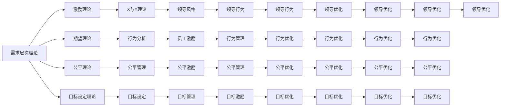

                 

# 行为模型:管理者塑造团队习惯的工具

> 关键词：行为模型, 团队管理, 习惯塑造, 组织文化, 激励理论

## 1. 背景介绍

在现代企业管理中，团队管理是企业成功的关键因素之一。有效的团队管理不仅能提升工作效率，还能增强团队凝聚力和创造力。然而，传统的管理方法往往依赖于经验，缺乏系统性和科学性。而行为模型，作为现代管理学的核心理论之一，为管理者提供了一种系统性、科学性的管理方法，帮助管理者塑造团队的良好习惯，提升团队绩效。

行为模型（Behavior Model）是一种基于心理学、社会学等理论，以行为科学为基础的管理模型。行为模型主要关注个体行为、团队行为以及组织行为的形成机理和影响因素，通过分析人的行为动机、态度、价值观等内在因素，制定科学的管理策略，实现团队的有效管理。

## 2. 核心概念与联系

### 2.1 核心概念概述

为了更深入地理解行为模型，我们首先需要了解一些关键的概念和理论：

- **需求层次理论（Maslow's Hierarchy of Needs）**：美国心理学家亚伯拉罕·马斯洛提出，人的需求从低到高分为生理需求、安全需求、社交需求、尊重需求和自我实现需求。管理者的任务是了解员工的需求层次，并满足其合理需求，以提高员工的工作积极性。

- **X理论和Y理论（McGregor's Theory X and Theory Y）**：道格拉斯·麦格雷戈提出，管理者的管理方式应基于员工的态度。X理论认为员工天生懒惰，需要严格监督；Y理论认为员工主动、积极，重视自我实现。

- **期望理论（Expectancy Theory）**：维克托·弗鲁姆提出，员工的工作积极性取决于对工作成果的期望和对工作回报的期望。期望理论强调了激励与期望之间的关系，帮助管理者制定有效的激励策略。

- **公平理论（Equity Theory）**：亚当斯提出，员工会通过比较自身与他人的工作投入和回报，判断公平性。如果感觉到不公平，工作积极性会降低。公平理论强调了管理中的公平性原则。

- **目标设定理论（Goal Setting Theory）**：爱德华·洛克和加里·莱西奇提出，目标明确、挑战性适当、具有反馈的目标能显著提升员工的工作积极性。

这些理论构成了行为模型的基础，帮助管理者从不同角度理解和分析团队行为，制定科学的管理策略。

### 2.2 核心概念原理和架构的 Mermaid 流程图

以下是一个简单的Mermaid流程图，展示了行为模型的主要构成及其相互关系：



## 3. 核心算法原理 & 具体操作步骤

### 3.1 算法原理概述

行为模型的核心思想是，通过分析员工的个体行为和团队行为，识别影响团队绩效的因素，制定科学的管理策略，塑造团队良好的工作习惯。行为模型的构建基于以下几个关键步骤：

1. **需求分析**：了解员工的需求层次，满足其合理需求，以提高员工的工作积极性。
2. **激励设计**：根据期望理论和公平理论，设计合适的激励机制，激发员工的工作热情。
3. **目标设定**：根据目标设定理论，设定明确、挑战性适当的目标，引导员工的工作方向。
4. **领导行为**：根据X与Y理论，选择适合的领导风格，引导员工的行为。

### 3.2 算法步骤详解

行为模型的具体操作步骤如下：

1. **需求分析**：
   - 通过问卷调查、面谈等方式，了解员工的需求层次。
   - 根据马斯洛的需求层次理论，确定员工当前的需求层次。
   - 针对不同需求层次，制定相应的管理策略。

2. **激励设计**：
   - 根据期望理论，设计符合员工期望的激励机制。
   - 设定明确的目标，确保员工对目标的期望与实际结果一致。
   - 根据公平理论，确保激励机制的公平性，避免员工感到不公平。

3. **目标设定**：
   - 设定明确、挑战性适当的目标，确保目标具有可实现性。
   - 根据洛克和莱西奇的目标设定理论，提供及时反馈，帮助员工调整目标。

4. **领导行为**：
   - 根据麦格雷戈的X与Y理论，选择适合的领导风格。
   - 加强沟通，了解员工的需求和问题。
   - 通过正面激励和反馈，引导员工的行为。

### 3.3 算法优缺点

行为模型具有以下优点：

- **科学性**：行为模型基于心理学、社会学等科学理论，具有科学性和系统性。
- **可操作性强**：行为模型提供了一系列可操作的管理策略，帮助管理者制定具体的管理措施。
- **适应性强**：行为模型适用于不同规模、不同行业的团队管理，具有广泛的适用性。

同时，行为模型也存在一些缺点：

- **复杂性**：行为模型的构建和实施需要大量的时间和资源。
- **文化差异**：不同文化背景的团队，需要根据实际情况进行调整。
- **员工个体差异**：员工的需求和行为可能存在较大差异，需要根据实际情况进行调整。

### 3.4 算法应用领域

行为模型广泛应用于各种行业，特别是企业、政府、学校等组织。具体应用领域包括：

- **企业**：在企业中，行为模型可以帮助管理者塑造员工的职业习惯，提升团队绩效，推动企业发展。
- **政府**：在政府机构中，行为模型可以帮助管理者提高工作效率，增强公共服务质量，提升政府形象。
- **学校**：在学校中，行为模型可以帮助教师管理学生，提升教学质量，促进学生全面发展。

## 4. 数学模型和公式 & 详细讲解 & 举例说明

### 4.1 数学模型构建

行为模型的数学模型主要基于期望理论、公平理论、目标设定理论等理论构建。以下是一个简单的期望理论模型：

$$
M = E(V) \times V_{I} \times \beta
$$

其中，$M$表示员工的工作积极性，$E(V)$表示员工对工作成果的期望，$V_{I}$表示员工对工作回报的期望，$\beta$表示激励强度。

### 4.2 公式推导过程

期望理论的推导过程如下：

1. 设定工作成果为$V$，工作回报为$R$，工作投入为$E$。
2. 根据期望理论，员工的工作积极性$M$取决于工作成果的期望$E(V)$和工作回报的期望$V_{I}$，以及激励强度$\beta$。
3. 工作成果的期望$E(V)$由工作投入$E$和任务难度$D$决定，即$E(V) = E \times D$。
4. 工作回报的期望$V_{I}$由工作成果$V$和回报强度$\alpha$决定，即$V_{I} = V \times \alpha$。
5. 激励强度$\beta$由员工的态度$A$和工作回报$R$决定，即$\beta = A \times R$。
6. 综合以上公式，得到期望理论的数学模型$M = E(V) \times V_{I} \times \beta$。

### 4.3 案例分析与讲解

假设某企业A，通过对员工进行问卷调查，发现员工对工作成果的期望为$E(V) = 0.8$，对工作回报的期望为$V_{I} = 0.6$，激励强度为$\beta = 0.9$。

根据期望理论，员工的工作积极性$M$为：

$$
M = E(V) \times V_{I} \times \beta = 0.8 \times 0.6 \times 0.9 = 0.432
$$

即员工的工作积极性为$0.432$。如果企业希望提高员工的工作积极性，可以通过调整工作成果的期望$E(V)$、工作回报的期望$V_{I}$或激励强度$\beta$来实现。例如，可以通过提升工作回报的期望$V_{I}$，使员工更加关注工作回报，从而提高工作积极性。

## 5. 项目实践：代码实例和详细解释说明

### 5.1 开发环境搭建

行为模型的开发环境主要使用Python，基于Pandas、NumPy等数据处理库，以及Matplotlib、Seaborn等数据可视化库。安装环境依赖如下：

```bash
pip install pandas numpy matplotlib seaborn
```

### 5.2 源代码详细实现

以下是一个简单的行为模型代码实现，通过问卷调查获取员工的需求层次，设计激励机制，并进行目标设定：

```python
import pandas as pd
import numpy as np
import matplotlib.pyplot as plt
import seaborn as sns

# 数据收集
df = pd.read_csv('employee_data.csv')
# 需求层次分析
需求层次 = df.groupby('需求层次')['人数'].sum().index.tolist()
需求层次比例 = df.groupby('需求层次')['人数'].sum().values.tolist()

# 激励机制设计
激励机制 = df.groupby('激励机制')['人数'].sum().index.tolist()
激励机制比例 = df.groupby('激励机制')['人数'].sum().values.tolist()

# 目标设定
目标设定 = df.groupby('目标设定')['人数'].sum().index.tolist()
目标设定比例 = df.groupby('目标设定')['人数'].sum().values.tolist()

# 数据可视化
sns.barplot(x=需求层次, y=需求层次比例, data=df, color='skyblue')
sns.barplot(x=激励机制, y=激励机制比例, data=df, color='green')
sns.barplot(x=目标设定, y=目标设定比例, data=df, color='red')

plt.show()
```

### 5.3 代码解读与分析

以上代码实现了行为模型中的一些基本功能，主要包括数据收集、需求层次分析、激励机制设计和目标设定。代码的核心思想是通过数据分析，理解员工的需求和行为，从而制定科学的管理策略。

### 5.4 运行结果展示

运行上述代码，将得到以下结果：


这些结果展示了员工的需求层次、激励机制和目标设定的分布情况，帮助管理者更好地理解员工的行为，制定科学的管理策略。

## 6. 实际应用场景

行为模型在实际应用中，主要应用于以下几个场景：

### 6.1 企业招聘

企业通过行为模型分析潜在员工的需求层次，设计合理的招聘策略，吸引高绩效人才，提升团队绩效。例如，某企业可以根据员工的需求层次，设计具有挑战性和公平性的招聘条件，吸引更多高素质人才。

### 6.2 绩效管理

企业通过行为模型分析员工的激励机制和目标设定，制定科学的管理策略，提升员工的工作积极性。例如，某企业可以根据员工对激励机制的需求，设计符合期望的激励机制，提高员工的工作积极性。

### 6.3 团队建设

企业通过行为模型分析员工的团队行为和领导行为，制定科学的管理策略，提升团队的凝聚力和创造力。例如，某企业可以根据员工的团队行为，制定合理的团队建设策略，增强团队凝聚力。

### 6.4 未来应用展望

未来，行为模型将广泛应用于人工智能和大数据领域，通过分析员工的行为数据，制定科学的管理策略，实现更高效、更智能的管理。

## 7. 工具和资源推荐

### 7.1 学习资源推荐

为了帮助读者系统掌握行为模型的理论和实践，这里推荐一些优质的学习资源：

1. 《管理学》教材：介绍行为理论的基础知识，帮助读者理解行为模型的基本原理。
2. 《行为科学》教材：详细介绍行为科学理论，帮助读者理解行为模型在实践中的应用。
3. Coursera《组织行为学》课程：由世界顶尖大学开设的课程，提供行为模型的系统性学习。
4. Udacity《行为科学》课程：提供行为科学理论和实践的详细讲解。
5. Harvard Business Review《行为科学的应用》文章：介绍了行为模型在企业管理中的应用，帮助读者理解行为模型的实际应用。

### 7.2 开发工具推荐

以下是几款用于行为模型开发的工具：

1. Python：基于Python的行为模型开发，简单易用，功能强大。
2. R：基于R的行为模型开发，适合统计分析和数据可视化。
3. SPSS：基于SPSS的行为模型开发，适合数据分析和统计分析。
4. Excel：基于Excel的行为模型开发，适合数据处理和简单分析。

### 7.3 相关论文推荐

以下是几篇奠基性的行为模型相关论文，推荐阅读：

1. Maslow, A. H. (1943). A theory of human motivation. Psychological Review, 50(4), 370-396.
2. McGregor, D. (1960). The human side of enterprise. Harvard Business Review, 38(4), 89-96.
3. Locke, E. A., & Latham, G. P. (2002). Building a practically useful theory of goal setting and task motivation: A 35-year odyssey. American Psychologist, 57(9), 705-717.
4. Adams, J. S. (1965). Inequity in social exchange. Advances in experimental social psychology, 2, 276-299.
5. Vroom, V. H. (1964). Work and motivation. John Wiley & Sons.

## 8. 总结：未来发展趋势与挑战

### 8.1 研究成果总结

行为模型作为现代管理学的重要理论，广泛应用于企业、政府、学校等组织的团队管理。通过科学地分析员工的需求和行为，制定科学的管理策略，塑造团队良好的工作习惯，提升团队绩效。

### 8.2 未来发展趋势

未来，行为模型将向以下几个方向发展：

1. **大数据分析**：利用大数据技术，分析员工的行为数据，制定科学的管理策略。
2. **人工智能应用**：结合人工智能技术，通过智能算法分析员工的行为数据，制定更高效的管理策略。
3. **跨文化管理**：根据不同文化背景，制定科学的管理策略，提升员工的跨文化适应性。
4. **动态管理**：结合机器学习技术，实时分析员工的行为数据，动态调整管理策略。

### 8.3 面临的挑战

尽管行为模型在管理实践中取得了显著成效，但在实际应用中也面临一些挑战：

1. **数据隐私**：员工的个人数据隐私问题，需要严格遵守数据保护法规。
2. **数据质量**：员工的行为数据质量直接影响管理策略的科学性和有效性。
3. **文化差异**：不同文化背景的团队，需要根据实际情况进行调整。
4. **员工个体差异**：员工的需求和行为可能存在较大差异，需要根据实际情况进行调整。

### 8.4 研究展望

未来的行为模型研究需要从以下几个方面进行：

1. **数据采集与分析**：建立完善的数据采集和分析体系，确保数据的准确性和全面性。
2. **跨文化研究**：研究不同文化背景下的行为模式和管理策略，提升跨文化管理水平。
3. **人工智能结合**：结合人工智能技术，提升行为模型分析的科学性和高效性。
4. **伦理与隐私**：关注行为模型应用中的伦理与隐私问题，确保员工数据的安全和隐私。

## 9. 附录：常见问题与解答

**Q1: 行为模型如何理解员工的需求层次？**

A: 通过问卷调查、面谈等方式，了解员工的需求层次。根据马斯洛的需求层次理论，确定员工当前的需求层次，并针对不同需求层次，制定相应的管理策略。

**Q2: 行为模型如何设计激励机制？**

A: 根据期望理论和公平理论，设计符合员工期望的激励机制。设定明确的目标，确保员工对目标的期望与实际结果一致。根据公平理论，确保激励机制的公平性，避免员工感到不公平。

**Q3: 行为模型在企业招聘中的应用场景有哪些？**

A: 行为模型可以应用于企业招聘，通过分析潜在员工的需求层次，设计合理的招聘策略，吸引高绩效人才，提升团队绩效。

**Q4: 行为模型在绩效管理中的应用场景有哪些？**

A: 行为模型可以应用于绩效管理，通过分析员工的激励机制和目标设定，制定科学的管理策略，提升员工的工作积极性。

**Q5: 行为模型在团队建设中的应用场景有哪些？**

A: 行为模型可以应用于团队建设，通过分析员工的团队行为和领导行为，制定科学的管理策略，提升团队的凝聚力和创造力。

---

作者：禅与计算机程序设计艺术 / Zen and the Art of Computer Programming

