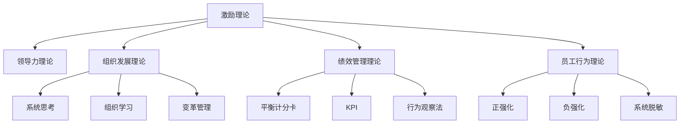

                 

# 行为科学在团队建设中的应用

> 关键词：行为科学, 团队建设, 激励理论, 领导力, 组织发展, 绩效管理, 员工行为, 绩效评估

## 1. 背景介绍

### 1.1 问题由来
在现代企业中，团队建设已成为提升组织效能的关键环节。然而，团队建设和管理的复杂性往往超乎想象。传统的管理手段，如规章制度、考核机制、激励政策等，虽然在一定程度上能提升员工的工作积极性，但在实际执行中，常面临员工动力不足、团队协作不畅、绩效管理困难等问题。如何从心理层面激发员工的潜力和创造力，构建高效的团队，成为了现代企业面临的难题。

行为科学是一门研究个体和群体在组织环境中的行为及其规律的学科。通过应用行为科学的基本原理和方法，企业可以更科学地理解员工的心理和行为，优化团队建设和管理，提升整体绩效。本文旨在通过行为科学的视角，探讨团队建设中的核心问题，提出有效的解决方案，为企业提供参考。

### 1.2 问题核心关键点
行为科学在团队建设中的应用主要包括以下几个关键点：
1. 激励理论的应用。行为科学中的激励理论，如双因素理论、成就动机理论、期望理论等，能够帮助企业设计合理的激励机制，激发员工的内在动机，提升工作积极性。
2. 领导力的研究。行为科学中的领导力理论，如变革型领导、情境领导、教练型领导等，能够指导企业领导者进行有效的团队管理，提升团队凝聚力和执行力。
3. 组织发展的理论与方法。行为科学中的组织发展(Organizational Development, OD)理论，如系统思考、组织学习、变革管理等，能够帮助企业进行组织优化和结构调整，促进团队的协同与发展。
4. 绩效管理的科学方法。行为科学中的绩效管理理论，如平衡计分卡、关键绩效指标(KPI)、行为观察法等，能够帮助企业建立科学的绩效评估体系，提升员工的绩效表现。
5. 员工行为的研究与干预。行为科学中的行为干预方法，如正强化、负强化、系统脱敏等，能够帮助企业改进员工的行为方式，提高工作效率和团队协作。

以上这些关键点，构成了行为科学在团队建设中的应用框架，为企业提供了科学的管理方法和理论依据。

## 2. 核心概念与联系

### 2.1 核心概念概述

为了更好地理解行为科学在团队建设中的应用，本节将介绍几个密切相关的核心概念：

- **激励理论**：行为科学中关于如何激发员工内在动力的理论，包括双因素理论、成就动机理论、期望理论等，用以指导企业设计合理的激励机制。
- **领导力理论**：关于领导者在团队中的行为和作用，包括变革型领导、情境领导、教练型领导等，帮助领导者提升团队管理能力。
- **组织发展理论**：关于如何通过系统思考、组织学习、变革管理等手段，促进组织的优化和结构的调整。
- **绩效管理理论**：包括平衡计分卡、关键绩效指标(KPI)、行为观察法等，用以建立科学的绩效评估体系。
- **员工行为理论**：如正强化、负强化、系统脱敏等行为干预方法，帮助企业改进员工的行为方式。

这些核心概念之间的逻辑关系可以通过以下Mermaid流程图来展示：



这个流程图展示了一些核心概念及其之间的关系：

1. 激励理论与领导力理论相互影响，共同作用于员工的动机和行为。
2. 组织发展理论为绩效管理和员工行为干预提供了理论基础。
3. 绩效管理理论与激励理论、员工行为理论密切相关，共同构成绩效评估和提升的闭环。
4. 员工行为理论提供了具体的行为干预方法，补充激励理论和绩效管理理论的不足。

## 3. 核心算法原理 & 具体操作步骤
### 3.1 算法原理概述

行为科学在团队建设中的应用，主要是通过应用相关的理论和方法，来优化员工的动机、行为和绩效。其核心思想是：通过科学的激励机制、领导策略、组织优化和绩效评估，激发员工的内在动力，提升团队的整体效能。

行为科学在团队建设中的应用，可以简单概括为以下三个步骤：

1. **数据收集与分析**：通过调查问卷、访谈、观察等手段，收集员工的工作态度、行为习惯、绩效表现等数据，分析其中的规律和问题。
2. **制定改进方案**：根据数据分析结果，制定针对性的激励机制、领导策略、组织优化和绩效评估方案，优化团队建设和管理。
3. **实施与评估**：在实际工作中应用改进方案，持续收集反馈，评估改进效果，进一步调整优化。

### 3.2 算法步骤详解

以下详细描述行为科学在团队建设中的应用步骤：

**Step 1: 数据收集与分析**

1. **问卷调查**：设计并分发员工满意度、工作动机、工作态度等问卷，收集员工的主观反馈。
2. **访谈**：与员工进行一对一的深度访谈，了解其工作中的困惑和需求。
3. **观察**：通过日常观察，记录员工的行为表现，如工作投入度、协作情况、任务完成情况等。
4. **绩效评估**：利用现有的绩效评估体系，对员工的绩效进行客观评估。

**Step 2: 制定改进方案**

1. **激励机制设计**：根据双因素理论和成就动机理论，设计合理的薪酬福利、晋升机会、奖金激励等机制。
2. **领导策略制定**：根据变革型领导和情境领导理论，制定有效的领导策略，提升团队士气和执行力。
3. **组织优化调整**：根据组织学习理论和变革管理方法，优化团队结构和流程，促进知识共享和协作。
4. **绩效管理体系构建**：根据平衡计分卡和KPI理论，构建科学的绩效评估体系，提升绩效表现。

**Step 3: 实施与评估**

1. **实施改进方案**：将改进方案落实到具体工作中，如调整薪酬福利、优化领导方式、改进组织流程等。
2. **持续反馈**：收集员工的反馈意见，评估改进方案的效果。
3. **进一步优化**：根据反馈结果，对改进方案进行持续优化，确保其有效性和适用性。

### 3.3 算法优缺点

行为科学在团队建设中的应用，具有以下优点：
1. 科学性：行为科学基于系统研究和实验数据，能够提供科学的解决方案。
2. 针对性：行为科学能够根据具体情况，制定有针对性的改进方案。
3. 可持续性：行为科学重视持续优化和反馈，能够逐步提升团队效能。
4. 灵活性：行为科学理论和方法具有很强的灵活性，能够适应不同的团队和情境。

同时，行为科学也存在一些局限性：
1. 数据收集难度大：行为科学需要大量的数据支撑，数据收集和分析过程可能较为复杂。
2. 实施难度高：行为科学的改进方案需要高水平的管理者和员工配合，实施过程可能较为困难。
3. 效果评估难：行为科学的改进效果需要较长时间才能显现，评估其效果可能较为困难。

尽管存在这些局限性，但行为科学仍是大规模组织管理的重要工具，其科学性和系统性能够为团队建设提供有力的理论支持。

### 3.4 算法应用领域

行为科学在团队建设中的应用，覆盖了企业管理的各个方面，具体应用领域包括：

1. **人力资源管理**：通过行为科学理论，制定科学的招聘、培训、薪酬福利等策略，提升员工满意度和绩效。
2. **团队协作管理**：通过行为科学理论，优化团队结构，提升团队协作和沟通效率。
3. **绩效评估管理**：通过行为科学理论，建立科学的绩效评估体系，提升绩效表现。
4. **组织优化调整**：通过行为科学理论，优化组织结构，提升整体效能。
5. **领导力提升**：通过行为科学理论，提升领导者的领导力和团队管理能力。

## 4. 数学模型和公式 & 详细讲解  
### 4.1 数学模型构建

本节将使用数学语言对行为科学在团队建设中的应用进行更加严格的刻画。

假设员工的工作表现可以用以下公式表示：

$$ P = f(X_1, X_2, ..., X_n) $$

其中，$P$ 为员工的工作表现，$X_i$ 为影响员工表现的各种因素，如工作动机、环境因素、激励机制等。

行为科学的数学模型可以通过多元回归分析等方法，对员工表现和影响因素之间的关系进行建模和预测。例如，可以利用线性回归模型表示员工表现与激励机制之间的关系：

$$ P = \beta_0 + \beta_1I_1 + \beta_2I_2 + ... + \beta_nI_n + \epsilon $$

其中，$\beta_i$ 为激励机制 $I_i$ 对员工表现 $P$ 的回归系数，$\epsilon$ 为随机误差项。

### 4.2 公式推导过程

以下我们以激励机制对员工表现的影响为例，推导线性回归模型的公式及其推导过程。

假设员工的工作表现 $P$ 与激励机制 $I_1$、$I_2$、$I_3$ 之间的关系为线性关系，可以表示为：

$$ P = \beta_0 + \beta_1I_1 + \beta_2I_2 + \beta_3I_3 + \epsilon $$

其中，$\beta_0$ 为截距项，$\beta_i$ 为激励机制 $I_i$ 对员工表现 $P$ 的回归系数，$\epsilon$ 为随机误差项。

在线性回归模型中，参数 $\beta_i$ 可以通过最小二乘法求解，其求解公式为：

$$ \hat{\beta} = (X^TX)^{-1}X^TP $$

其中，$X^T$ 为自变量矩阵的转置，$P$ 为员工表现的观测值向量。

在实际应用中，线性回归模型需要满足以下假设条件：
1. 线性关系假设：自变量与因变量之间存在线性关系。
2. 独立同分布假设：各观测值之间独立，服从同一分布。
3. 误差项同方差假设：误差项的方差为常数。

这些假设条件为线性回归模型的建立和求解提供了基础。通过合理选择自变量和因变量，建立科学的回归模型，可以预测和解释员工表现的各个因素。

### 4.3 案例分析与讲解

假设某公司的员工工作表现受薪酬福利（$I_1$）、晋升机会（$I_2$）、奖金激励（$I_3$）等因素的影响。根据历史数据，建立如下线性回归模型：

$$ P = \beta_0 + \beta_1I_1 + \beta_2I_2 + \beta_3I_3 + \epsilon $$

通过最小二乘法求解，得到参数 $\hat{\beta} = [\beta_0, \beta_1, \beta_2, \beta_3]$。将求解结果代入模型，可以得到员工表现与激励机制之间的关系。

例如，如果 $\hat{\beta}_1 = 0.5$，则表明薪酬福利每增加一个单位，员工表现平均增加0.5个单位。同理，可以分析晋升机会和奖金激励对员工表现的影响。

通过行为科学中的激励理论，可以进一步解释这些系数背后的心理和行为机制。例如，双因素理论指出，薪酬福利和奖金激励属于外部激励，对员工的即时满足感有显著影响，而晋升机会则属于内在激励，对员工的成长和归属感有重要影响。

## 5. 项目实践：代码实例和详细解释说明
### 5.1 开发环境搭建

在进行行为科学在团队建设中的应用实践前，我们需要准备好开发环境。以下是使用Python进行行为科学应用的开发环境配置流程：

1. 安装Anaconda：从官网下载并安装Anaconda，用于创建独立的Python环境。

2. 创建并激活虚拟环境：
```bash
conda create -n behavior-env python=3.8 
conda activate behavior-env
```

3. 安装相关库：
```bash
conda install pandas numpy matplotlib seaborn statsmodels
```

完成上述步骤后，即可在`behavior-env`环境中开始行为科学的实践。

### 5.2 源代码详细实现

以下是一个使用Python进行行为科学应用的基本代码实现，包括数据收集、线性回归模型建立和分析。

首先，导入必要的库：

```python
import pandas as pd
import numpy as np
from statsmodels.regression.linear_model import OLS
from statsmodels.tools.tools import add_constant
```

然后，准备数据集：

```python
# 假设已有的数据集为 data.csv，其中包含员工表现和激励机制的各项数据
data = pd.read_csv('data.csv')

# 将数据集转换为numpy数组，方便后续计算
X = data[['I1', 'I2', 'I3']]
y = data['P']
```

接着，建立线性回归模型：

```python
# 添加截距项
X = add_constant(X)

# 构建OLS模型
model = OLS(y, X)
results = model.fit()
```

最后，输出回归结果并进行分析：

```python
# 输出回归结果
print(results.summary())

# 预测新数据下的员工表现
new_data = pd.DataFrame({'I1': [50, 30, 20], 'I2': [10, 20, 30]})
new_data['I3'] = new_data['I1'] + new_data['I2']
new_data['P'] = results.predict(new_data)
print(new_data)
```

以上就是使用Python进行行为科学应用的完整代码实现。可以看到，通过数据处理和线性回归模型的建立，可以有效地分析员工表现的各个因素，为团队建设提供数据支持。

### 5.3 代码解读与分析

让我们再详细解读一下关键代码的实现细节：

**导入库**：
- `pandas` 库用于数据处理和分析。
- `numpy` 库用于数组计算和线性代数运算。
- `matplotlib` 和 `seaborn` 库用于数据可视化。
- `statsmodels` 库用于统计模型建立和分析。

**数据准备**：
- 使用 `pandas` 库的 `read_csv` 函数读取数据集，转换为 `numpy` 数组进行计算。
- 添加截距项，确保模型能够进行常数项回归。

**模型建立**：
- 使用 `statsmodels` 库的 `OLS` 函数建立线性回归模型。
- 使用 `statsmodels` 库的 `add_constant` 函数添加截距项。

**模型分析**：
- 使用 `statsmodels` 库的 `summary` 方法输出回归结果，包括系数、标准误差、t值、p值等。
- 使用 `predict` 方法预测新数据下的员工表现，输出预测结果。

**代码实现结果**：
- 输出回归结果，展示每个激励机制对员工表现的回归系数。
- 使用预测结果，分析新数据下员工表现的预测值。

## 6. 实际应用场景

### 6.1 人力资源管理

在人力资源管理中，行为科学的应用主要包括招聘、培训、薪酬福利等方面。通过应用行为科学中的激励理论，企业可以设计出合理的薪酬福利、晋升机会、奖金激励等机制，提升员工的工作积极性和满意度。

例如，某公司在招聘时，不仅考察候选人的专业技能，还通过行为面试、情景模拟等方式，评估候选人的动机和行为，选择更符合公司文化和价值观的员工。在培训过程中，通过应用行为科学中的成就动机理论和期望理论，设计个性化的培训方案，提升员工的学习效果和自我效能感。

### 6.2 团队协作管理

在团队协作管理中，行为科学的应用主要包括团队结构优化、沟通渠道建立等方面。通过应用行为科学中的组织学习理论和变革管理方法，企业可以优化团队结构和流程，提升团队协作和沟通效率。

例如，某公司通过行为科学的研究，发现现有团队结构存在信息孤岛和沟通障碍的问题。通过重新设计团队结构，将跨部门团队改为多团队协作模式，并建立定期的跨团队会议和沟通机制，提升了团队的整体协作效率和沟通质量。

### 6.3 绩效评估管理

在绩效评估管理中，行为科学的应用主要包括绩效评估体系的构建和员工行为数据的收集等方面。通过应用行为科学中的平衡计分卡和KPI理论，企业可以构建科学的绩效评估体系，提升员工的绩效表现。

例如，某公司通过行为科学的调研，发现现有绩效评估体系过于依赖结果指标，忽视了过程和行为指标。通过引入行为观察法和系统脱敏法，对员工的工作过程和行为进行详细记录和评估，建立以行为为导向的绩效评估体系，提升了员工的绩效表现和行为改进。

### 6.4 未来应用展望

随着行为科学的不断发展，其应用领域将不断扩展，影响范围将更加广泛。未来行为科学在团队建设中的应用，可能涉及更多领域和方向：

1. **员工心理健康**：通过行为科学的理论和方法，帮助企业关注员工的心理健康，提供相应的支持和干预措施，提升员工的幸福感和工作满意度。
2. **多元文化融合**：随着全球化进程的加快，企业越来越多地面对多元文化的员工群体。通过行为科学中的跨文化研究，帮助企业设计多元文化友好的管理策略，促进团队的融合与发展。
3. **员工职业发展**：通过行为科学的职业发展规划理论，帮助员工明确职业目标和路径，提升其职业发展速度和成功率。
4. **员工生涯管理**：通过行为科学的生涯发展理论，帮助员工进行生涯规划和自我评估，提升其生涯管理的科学性和有效性。
5. **员工体验管理**：通过行为科学的客户体验研究，帮助企业提升员工的工作体验和满意度，构建员工友好的企业文化。

## 7. 工具和资源推荐
### 7.1 学习资源推荐

为了帮助开发者系统掌握行为科学在团队建设中的应用，这里推荐一些优质的学习资源：

1. 《组织行为学》课程：哈佛大学开设的组织行为学课程，系统讲解组织行为学的基本理论和实践应用，适合进一步深入学习。
2. 《行为科学的实践应用》书籍：全面介绍行为科学在企业管理中的应用案例和实践方法，适合理论结合实践的学习。
3. 《领导力与组织发展》在线课程：Coursera上提供的领导力和组织发展课程，涵盖行为科学中的领导力理论、组织发展理论等。
4. 《行为科学论文集》：包括行为科学领域内的经典论文和前沿研究成果，适合深度学习和研究。
5. 《员工行为管理》在线视频：腾讯课堂提供的员工行为管理课程，结合实际案例讲解行为科学的实践应用。

通过对这些资源的学习实践，相信你一定能够快速掌握行为科学在团队建设中的应用方法，并用于解决实际的团队管理问题。

### 7.2 开发工具推荐

高效的开发离不开优秀的工具支持。以下是几款用于行为科学在团队建设中的应用开发的常用工具：

1. Python：作为科学计算和数据分析的主流语言，Python拥有丰富的库和框架，适合进行行为科学的数据分析和建模。
2. R语言：作为统计分析和数据科学的主流语言，R语言拥有强大的统计建模能力，适合进行行为科学的数据分析和回归分析。
3. SPSS：作为商业统计分析软件，SPSS提供了丰富的数据分析和建模功能，适合进行行为科学的数据分析和管理。
4. Excel：作为办公软件中的数据分析工具，Excel提供了基本的统计分析和数据可视化功能，适合进行行为科学的数据分析和管理。

合理利用这些工具，可以显著提升行为科学在团队建设中的应用效率，加快创新迭代的步伐。

### 7.3 相关论文推荐

行为科学在团队建设中的应用，源于学界的持续研究。以下是几篇奠基性的相关论文，推荐阅读：

1. Vroom, V. H. (1964). Work and motivation. John Wiley & Sons.
2. Herzberg, F. (1966). One more time: How do you motivate employees? Harvard Business Review.
3. Locke, E. A. (1968). Determination of a task concept: The structure of extrinsic incentives. Organizational Behavior and Human Performance, 5(2), 212-245.
4. Luthans, F. (2002). Organizational behavior: Critical thinking and contemporary challenges. Prentice Hall.
5. Avolio, B. J., & Yammarino, F. J. (2010). Leadership: Research and practice. Sage publications.

这些论文代表了大规模组织管理行为科学的发展脉络。通过学习这些前沿成果，可以帮助研究者把握学科前进方向，激发更多的创新灵感。

## 8. 总结：未来发展趋势与挑战
### 8.1 总结

本文对行为科学在团队建设中的应用进行了全面系统的介绍。首先阐述了行为科学在团队建设中的重要性，明确了行为科学在激发员工动机、提升团队绩效方面的独特价值。其次，从原理到实践，详细讲解了行为科学的基本原理和应用方法，给出了具体的案例分析。最后，本文探讨了行为科学在人力资源管理、团队协作管理、绩效评估管理等实际应用场景中的应用，展示了其广泛的应用前景。

通过本文的系统梳理，可以看到，行为科学为企业管理提供了科学的理论和方法，通过优化员工动机、提升团队协作、建立科学的绩效评估体系，能够显著提升企业的整体效能。

### 8.2 未来发展趋势

展望未来，行为科学在团队建设中的应用将呈现以下几个发展趋势：

1. **数据驱动的管理决策**：随着大数据技术的发展，行为科学将更加注重数据的收集、分析和应用，通过数据驱动的管理决策提升团队建设和管理的效果。
2. **个性化管理**：通过行为科学中的个体差异研究，为员工设计个性化的激励机制和管理策略，提升员工的工作积极性和满意度。
3. **多渠道沟通**：随着数字化进程的加快，行为科学将更加注重跨渠道沟通和管理，通过多渠道的沟通方式提升团队的协作效率和沟通质量。
4. **远程协作**：随着远程工作的普及，行为科学将更加注重远程协作的研究，通过科学的管理手段提升远程团队的工作效率和团队凝聚力。
5. **人工智能结合**：通过行为科学的理论和方法，结合人工智能技术，提升团队建设和管理的效果。例如，利用机器学习算法预测员工表现，提供个性化的培训和发展建议。

以上趋势凸显了行为科学在团队建设中的应用前景，其与大数据、人工智能等技术的结合，将进一步推动管理科学的创新和发展。

### 8.3 面临的挑战

尽管行为科学在团队建设中的应用已经取得了显著成效，但在迈向更加智能化、普适化应用的过程中，仍面临诸多挑战：

1. **数据隐私和安全**：在数据收集和分析过程中，如何保护员工的隐私和数据安全，避免数据泄露和滥用，是行为科学需要解决的重要问题。
2. **文化差异**：在不同文化背景下的员工群体中，如何设计符合当地文化和价值观的管理策略，是行为科学面临的挑战之一。
3. **实施难度**：行为科学的改进方案需要高水平的管理者和员工配合，实施过程可能较为困难，如何提高管理的执行力是关键。
4. **效果评估**：行为科学的改进效果需要较长时间才能显现，如何建立科学的评估体系，评估其效果，是行为科学需要解决的难题。
5. **技术依赖**：行为科学的应用过程中，需要依赖大量的统计软件和工具，如何降低技术门槛，提高应用的可操作性，是行为科学需要解决的问题。

正视行为科学面临的这些挑战，积极应对并寻求突破，将是大规模组织管理行为科学的必由之路。

### 8.4 研究展望

面对行为科学在团队建设中所面临的挑战，未来的研究需要在以下几个方面寻求新的突破：

1. **跨学科研究**：将行为科学与其他学科，如心理学、社会学、经济学等进行跨学科研究，提供更全面、深入的管理理论和方法。
2. **实证研究**：加强实证研究，通过大规模实验和案例分析，验证和优化行为科学的理论和应用方法。
3. **技术融合**：将行为科学与大数据、人工智能等技术进行深度融合，提升管理决策的科学性和有效性。
4. **全球化研究**：结合不同国家和地区的文化和管理实践，研究行为科学在全球化背景下的应用和推广。
5. **个性化研究**：通过个体差异和行为科学的理论，研究如何设计个性化的激励机制和管理策略，提升员工的工作积极性和满意度。

这些研究方向的探索，必将引领行为科学在团队建设中的应用迈向更高的台阶，为企业管理提供更加科学、系统、实用的方法和工具。

## 9. 附录：常见问题与解答

**Q1：行为科学在团队建设中的具体应用有哪些？**

A: 行为科学在团队建设中的具体应用包括：
1. 激励机制设计：通过双因素理论、成就动机理论、期望理论等，设计合理的薪酬福利、晋升机会、奖金激励等机制，提升员工的工作积极性和满意度。
2. 领导策略制定：通过变革型领导、情境领导、教练型领导等理论，制定有效的领导策略，提升团队士气和执行力。
3. 组织优化调整：通过系统思考、组织学习、变革管理等方法，优化团队结构和流程，促进知识共享和协作。
4. 绩效管理体系构建：通过平衡计分卡、KPI等理论，构建科学的绩效评估体系，提升绩效表现。
5. 员工行为干预：通过正强化、负强化、系统脱敏等方法，改进员工的行为方式，提高工作效率和团队协作。

**Q2：行为科学在团队建设中的应用效果如何？**

A: 行为科学在团队建设中的应用效果主要体现在以下几个方面：
1. 提升员工工作积极性：通过合理的激励机制和领导策略，激发员工的内在动机，提升工作积极性和满意度。
2. 增强团队协作效率：通过优化团队结构和流程，提升团队协作和沟通效率。
3. 提升绩效表现：通过科学的绩效评估体系，提升员工的绩效表现和工作质量。
4. 促进知识共享：通过系统思考和组织学习，促进知识共享和协作，提升团队的整体效能。
5. 改善员工行为：通过行为干预方法，改进员工的行为方式，提高工作效率和团队协作。

**Q3：行为科学在团队建设中的应用难点有哪些？**

A: 行为科学在团队建设中的应用难点主要包括：
1. 数据收集难度大：行为科学需要大量的数据支撑，数据收集和分析过程可能较为复杂。
2. 实施难度高：行为科学的改进方案需要高水平的管理者和员工配合，实施过程可能较为困难。
3. 效果评估难：行为科学的改进效果需要较长时间才能显现，评估其效果可能较为困难。
4. 数据隐私和安全：在数据收集和分析过程中，如何保护员工的隐私和数据安全，避免数据泄露和滥用。
5. 文化差异：在不同文化背景下的员工群体中，如何设计符合当地文化和价值观的管理策略。

**Q4：如何提高行为科学在团队建设中的应用效果？**

A: 提高行为科学在团队建设中的应用效果，可以从以下几个方面进行：
1. 加强数据收集和分析：通过多种手段收集员工的数据，确保数据的质量和完整性，进行科学的数据分析。
2. 提高管理的执行力：建立有效的反馈机制和持续优化机制，确保行为科学的改进方案能够得到有效执行。
3. 提升领导的科学管理能力：加强领导者的培训和培养，提升其对行为科学理论和方法的掌握和应用能力。
4. 建立科学的效果评估体系：通过定量和定性的方法，建立科学的效果评估体系，及时评估和反馈行为科学的应用效果。
5. 结合技术手段：利用大数据、人工智能等技术，提升行为科学的科学性和有效性。

这些方法的应用，能够帮助企业更好地利用行为科学的理论和方法，提升团队建设和管理的效果。

**Q5：行为科学在团队建设中的应用前景如何？**

A: 行为科学在团队建设中的应用前景非常广阔，未来可能涉及更多领域和方向：
1. 员工心理健康：通过行为科学的理论和方法，关注员工的心理健康，提供相应的支持和干预措施。
2. 多元文化融合：在多元文化背景下的员工群体中，设计符合当地文化和价值观的管理策略。
3. 员工职业发展：通过行为科学的职业发展规划理论，帮助员工明确职业目标和路径，提升其职业发展速度和成功率。
4. 员工生涯管理：通过行为科学的生涯发展理论，帮助员工进行生涯规划和自我评估。
5. 员工体验管理：通过行为科学的客户体验研究，提升员工的工作体验和满意度。

这些应用领域的拓展，将进一步提升行为科学在团队建设中的应用价值。

---

作者：禅与计算机程序设计艺术 / Zen and the Art of Computer Programming

