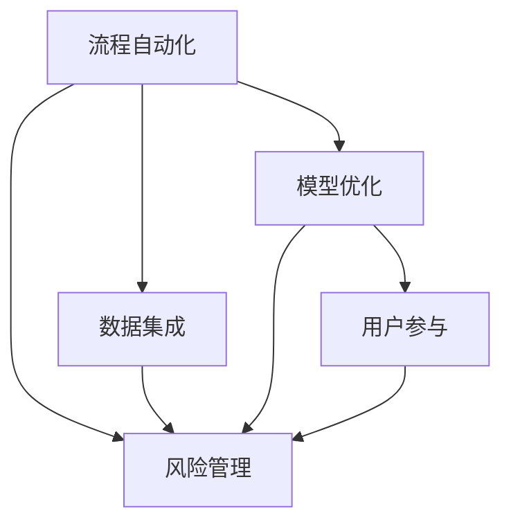

                 

# 规划机制在智能金融系统中的应用

## 1. 背景介绍

### 1.1 问题由来
随着金融科技的迅速发展，智能金融系统已经成为了金融机构提升运营效率、降低运营成本、提升客户体验的重要工具。然而，在智能金融系统的实际部署与运营过程中，由于系统复杂度高、决策链条长、数据维度多，使得规划机制的引入变得尤为重要。规划机制通过优化决策流程、提高决策效率、降低决策风险，从而使得智能金融系统能够更加稳定可靠地服务于客户，更好地实现业务目标。

### 1.2 问题核心关键点
智能金融系统中的规划机制主要聚焦于以下关键点：
- 流程自动化：通过标准化、规范化的流程设计，减少人工干预，提升处理效率。
- 数据集成：整合各类金融数据，建立统一的数据视图，支持多数据源的融合分析。
- 模型优化：通过引入先进的数学模型与算法，提升决策的科学性与准确性。
- 风险管理：通过预测与监控机制，及时发现与控制风险，保障系统安全稳定。
- 用户参与：引入用户反馈机制，实现动态调整与持续优化。

这些关键点共同构成了智能金融系统中的规划机制框架，使得金融业务能够更加智能、高效、安全地运行。

## 2. 核心概念与联系

### 2.1 核心概念概述
智能金融系统中的规划机制，是通过对系统流程、数据、模型、风险、用户等多个维度的精细规划与管理，实现系统整体的高效、安全、稳定运行。

#### 流程自动化
- **定义**：通过流程自动化技术，将原本由人工操作的流程转换为系统自动处理。
- **实现方式**：利用流程定义语言、工作流引擎等工具，设计并实现自动化的业务流程。
- **优点**：减少人工操作，提升效率，降低错误率。

#### 数据集成
- **定义**：将金融系统中的各类数据进行整合，形成一个统一、完整的数据视图。
- **实现方式**：使用数据湖、数据仓库等技术，将原始数据经过清洗、转换、聚合等处理，形成一个逻辑上的数据存储。
- **优点**：支持多数据源的融合分析，提升数据价值。

#### 模型优化
- **定义**：通过数学模型与算法，优化决策逻辑，提升决策的准确性与可靠性。
- **实现方式**：使用机器学习、深度学习等技术，训练和应用模型。
- **优点**：提升决策的科学性，支持更多复杂的决策场景。

#### 风险管理
- **定义**：通过预测与监控机制，及时发现和控制金融系统中的各类风险。
- **实现方式**：利用统计模型、预测算法等技术，进行风险评估与预警。
- **优点**：提前发现潜在风险，防止风险发生，保障系统稳定。

#### 用户参与
- **定义**：通过用户反馈机制，实现对系统决策的动态调整与持续优化。
- **实现方式**：引入用户接口，收集用户反馈数据，通过反馈模型优化决策。
- **优点**：提升用户满意度，提升系统的适应性与灵活性。

这些核心概念之间的逻辑关系可以通过以下Mermaid流程图来展示：



这个流程图展示了我司金融系统中的规划机制框架，流程自动化、数据集成、模型优化、风险管理与用户参与之间相互关联、相互影响。

## 3. 核心算法原理 & 具体操作步骤
### 3.1 算法原理概述

智能金融系统中的规划机制主要基于以下算法原理：

1. **流程自动化算法**：通过对业务流程的建模与分析，设计并实现自动化的流程定义与执行。
2. **数据集成算法**：将不同数据源的数据进行聚合与转换，建立统一的数据视图，支持多数据源的融合分析。
3. **模型优化算法**：通过机器学习、深度学习等技术，优化决策模型，提升决策的科学性与准确性。
4. **风险管理算法**：利用统计模型、预测算法等技术，进行风险评估与预警，及时发现和控制风险。
5. **用户参与算法**：引入用户反馈机制，通过用户接口收集反馈数据，利用反馈模型优化系统决策。

### 3.2 算法步骤详解

#### 流程自动化
- **步骤**：
  1. 业务流程分析：通过业务流程图、UML模型等工具，对业务流程进行详细分析与建模。
  2. 流程定义与实现：使用流程定义语言、工作流引擎等工具，设计并实现自动化的业务流程。
  3. 流程监控与优化：通过监控工具对自动化流程进行实时监控，发现异常并进行优化调整。
- **示例**：
  假设某银行有自动开户流程，首先通过业务流程分析，确定流程中的各个环节、数据输入输出、操作节点等，然后使用工作流引擎实现自动化处理。在流程执行过程中，通过监控工具发现异常并进行优化调整，如增加验证环节、调整数据字段等。

#### 数据集成
- **步骤**：
  1. 数据收集与清洗：通过ETL工具从多个数据源收集数据，并进行清洗与转换。
  2. 数据聚合与转换：使用数据仓库、数据湖等技术，将数据进行聚合与转换，建立统一的数据视图。
  3. 数据治理与优化：通过数据治理工具，对数据质量、数据安全等进行管理与优化。
- **示例**：
  某金融机构需要整合客户、交易、风险数据，首先通过ETL工具从各数据源收集数据并进行清洗，然后使用数据仓库进行数据聚合与转换，最终形成客户全景视图。在数据治理过程中，对数据质量进行监控与优化，保障数据安全与准确性。

#### 模型优化
- **步骤**：
  1. 特征工程：通过特征提取、特征选择等技术，准备模型训练数据。
  2. 模型训练与验证：使用机器学习、深度学习等技术，训练并验证决策模型。
  3. 模型部署与优化：将训练好的模型部署到生产环境中，并根据反馈数据进行持续优化。
- **示例**：
  某公司需要预测客户流失率，首先通过特征工程，从客户数据中提取并选择相关特征，然后使用深度学习模型进行训练与验证。最终将模型部署到生产环境中，并根据用户反馈数据进行持续优化，提升模型精度与稳定性。

#### 风险管理
- **步骤**：
  1. 风险评估：利用统计模型、预测算法等技术，进行风险评估与预警。
  2. 风险监控：通过实时监控机制，发现风险并及时进行控制。
  3. 风险控制与优化：根据监控结果，制定并实施风险控制策略，并进行优化调整。
- **示例**：
  某银行需要对客户信用风险进行管理，首先利用统计模型进行风险评估与预警，然后通过实时监控机制发现风险并进行控制，最后根据监控结果制定风险控制策略并进行优化调整，提升风险管理能力。

#### 用户参与
- **步骤**：
  1. 用户接口设计：通过用户接口，收集用户反馈数据。
  2. 反馈模型建立与训练：利用机器学习技术，建立用户反馈模型，并进行训练。
  3. 系统决策优化：根据反馈模型，动态调整系统决策逻辑，提升系统适应性与灵活性。
- **示例**：
  某电商平台需要优化用户推荐算法，通过用户接口收集用户反馈数据，然后利用机器学习技术建立用户反馈模型，最后根据反馈模型动态调整推荐算法，提升用户满意度。

### 3.3 算法优缺点

智能金融系统中的规划机制具有以下优点：
- 提高效率：通过自动化与标准化，减少人工操作，提升处理效率。
- 提升准确性：利用先进的数据集成与模型优化算法，提升决策的科学性与准确性。
- 风险控制：通过实时监控与预警机制，及时发现和控制风险，保障系统安全稳定。
- 用户满意：通过用户反馈机制，提升用户满意度，实现动态调整与持续优化。

同时，该机制也存在以下局限性：
- 依赖数据：系统性能很大程度上取决于数据质量与数量，数据获取与整合难度较大。
- 模型复杂：引入复杂算法与模型，模型调试与优化难度较大。
- 成本投入：系统开发与维护成本较高，需要投入大量人力物力。
- 系统复杂：系统结构复杂，系统集成与部署难度较大。

尽管存在这些局限性，但就目前而言，规划机制仍然是大金融系统中的重要范式。未来相关研究的重点在于如何进一步降低系统复杂性、降低数据获取难度、提高模型效率与可解释性，同时兼顾可解释性和伦理安全性等因素。

### 3.4 算法应用领域

智能金融系统中的规划机制广泛应用于金融机构的各类业务场景，包括但不限于：

- 客户管理：通过流程自动化、数据集成、模型优化等技术，提升客户管理效率与效果。
- 交易管理：通过流程自动化、风险管理、用户参与等技术，提升交易管理效率与风险控制能力。
- 信贷审批：通过流程自动化、模型优化、风险管理等技术，提升信贷审批效率与审批准确性。
- 风险管理：通过流程自动化、风险管理、用户参与等技术，提升风险管理能力与风险预警精度。
- 运营管理：通过流程自动化、数据集成、用户参与等技术，提升运营管理效率与客户满意度。

除了上述这些经典应用外，规划机制还被创新性地应用到更多场景中，如智能投顾、智能理赔、智能风控等，为金融业务带来了全新的突破。

## 4. 数学模型和公式 & 详细讲解 & 举例说明

### 4.1 数学模型构建

在智能金融系统中，规划机制的数学模型构建主要包括以下几个关键环节：

- **流程自动化模型**：
  - **输入**：业务流程、任务节点、数据字段等。
  - **输出**：流程定义、执行路径、监控规则等。
  - **表示**：使用有向图、状态机等数学模型表示。

- **数据集成模型**：
  - **输入**：数据源、数据字段、数据类型等。
  - **输出**：数据视图、数据字典、数据治理规则等。
  - **表示**：使用数据仓库、数据湖等技术。

- **模型优化模型**：
  - **输入**：特征数据、目标变量、模型算法等。
  - **输出**：训练好的模型、预测结果、模型参数等。
  - **表示**：使用机器学习、深度学习等技术。

- **风险管理模型**：
  - **输入**：历史数据、预测变量、风险指标等。
  - **输出**：风险评估结果、预警阈值、控制策略等。
  - **表示**：使用统计模型、预测算法等技术。

- **用户参与模型**：
  - **输入**：用户反馈、系统决策、业务指标等。
  - **输出**：反馈模型、调整策略、用户接口等。
  - **表示**：使用机器学习、自然语言处理等技术。

### 4.2 公式推导过程

#### 流程自动化模型
**示例**：假设某金融机构的客户开户流程需要经过3个环节，分别为身份验证、信息录入、关系维护。

1. 首先通过业务流程图，确定流程中的各个环节、数据输入输出、操作节点等。
2. 然后通过流程定义语言，如BPMN，设计并实现自动化的流程定义。
3. 最终得到流程定义与执行路径。

**公式**：
- 流程定义：
  $$
  D = \{n_1, n_2, n_3\}
  $$
- 执行路径：
  $$
  P = (n_1 \rightarrow n_2 \rightarrow n_3)
  $$

#### 数据集成模型
**示例**：假设某金融机构的客户数据来源于3个数据源，分别为客户信息表、交易记录表、风险评估表。

1. 通过ETL工具，从各数据源收集数据并进行清洗与转换。
2. 然后使用数据仓库技术，将数据进行聚合与转换，建立统一的数据视图。
3. 最后通过数据治理工具，对数据质量、数据安全等进行管理与优化。

**公式**：
- 数据视图：
  $$
  V = \{V_{客户}, V_{交易}, V_{风险}\}
  $$
- 数据治理：
  $$
  G = \{g_{客户}, g_{交易}, g_{风险}\}
  $$

#### 模型优化模型
**示例**：假设某金融机构的客户流失预测模型需要基于客户行为数据进行训练。

1. 首先通过特征工程，从客户数据中提取并选择相关特征。
2. 然后使用深度学习模型，如神经网络、决策树等，进行训练与验证。
3. 最后将训练好的模型部署到生产环境中，并根据反馈数据进行持续优化。

**公式**：
- 特征工程：
  $$
  X = \{X_{年龄}, X_{消费}, X_{行为}\}
  $$
- 模型训练：
  $$
  M = \text{模型}(X, Y)
  $$
- 模型部署：
  $$
  \text{部署}(M)
  $$

#### 风险管理模型
**示例**：假设某金融机构的客户信用风险管理需要进行风险评估与预警。

1. 利用统计模型，如逻辑回归、支持向量机等，进行风险评估与预警。
2. 然后通过实时监控机制，发现风险并及时进行控制。
3. 最后根据监控结果，制定并实施风险控制策略，并进行优化调整。

**公式**：
- 风险评估：
  $$
  R = \text{模型}(X, Y)
  $$
- 风险监控：
  $$
  \text{监控}(R)
  $$
- 风险控制：
  $$
  C = \text{策略}(R)
  $$

#### 用户参与模型
**示例**：假设某电商平台的推荐系统需要基于用户反馈进行优化。

1. 通过用户接口，收集用户反馈数据。
2. 利用机器学习技术，建立用户反馈模型，并进行训练。
3. 根据反馈模型，动态调整推荐算法，提升用户满意度。

**公式**：
- 用户反馈：
  $$
  F = \{F_{点击}, F_{评价}, F_{投诉}\}
  $$
- 反馈模型：
  $$
  M_F = \text{模型}(F, X)
  $$
- 系统决策优化：
  $$
  \text{优化}(M)
  $$

### 4.3 案例分析与讲解

**案例**：某银行需要优化贷款审批流程。

1. **流程自动化**：
  - 通过业务流程分析，确定贷款审批流程中的各个环节、数据输入输出、操作节点等。
  - 使用流程定义语言设计并实现自动化的贷款审批流程。
  - 通过监控工具对自动化流程进行实时监控，发现异常并进行优化调整。

2. **数据集成**：
  - 收集与整合客户、贷款、风险等数据，建立统一的数据视图。
  - 使用数据治理工具对数据质量、数据安全等进行管理与优化。

3. **模型优化**：
  - 通过特征工程，从贷款数据中提取并选择相关特征。
  - 使用深度学习模型进行贷款违约预测。
  - 将训练好的模型部署到生产环境中，并根据反馈数据进行持续优化。

4. **风险管理**：
  - 利用统计模型进行违约风险评估与预警。
  - 通过实时监控机制发现风险并进行控制。
  - 根据监控结果制定并实施风险控制策略，并进行优化调整。

5. **用户参与**：
  - 通过用户接口收集客户反馈数据。
  - 利用机器学习技术建立用户反馈模型，并进行训练。
  - 根据反馈模型动态调整贷款审批流程，提升客户满意度。

## 5. 项目实践：代码实例和详细解释说明

### 5.1 开发环境搭建

在进行金融规划机制的实践前，我们需要准备好开发环境。以下是使用Python进行Kronos开发的环境配置流程：

1. 安装Anaconda：从官网下载并安装Anaconda，用于创建独立的Python环境。

2. 创建并激活虚拟环境：
```bash
conda create -n kronos-env python=3.8 
conda activate kronos-env
```

3. 安装Kronos：
```bash
pip install kronos
```

4. 安装各类工具包：
```bash
pip install numpy pandas scikit-learn matplotlib tqdm jupyter notebook ipython
```

完成上述步骤后，即可在`kronos-env`环境中开始金融规划机制的实践。

### 5.2 源代码详细实现

这里我们以贷款审批流程自动化为例，给出使用Kronos进行流程自动化开发的PyTorch代码实现。

首先，定义贷款审批流程的数据处理函数：

```python
import kronos as k
from kronos.agents.python import PythonAgent
from kronos.agents.python.base import BasePythonAgent

class LoanApprovalProcess(BasePythonAgent):
    def __init__(self, config):
        super().__init__(config)

        self.id = config["id"]
        self.inputs = ["customer_info", "loan_info", "risk_info"]
        self.outputs = ["approval_result"]

        self.get_data_source("customer_info")
        self.get_data_source("loan_info")
        self.get_data_source("risk_info")

    def initialize(self, timestamp, history):
        print("Loan Approval Process initialized")

    def process(self, timestamp, history):
        # 根据历史数据，自动计算贷款审批结果
        customer_info = self.get_data_source("customer_info").get_latest()
        loan_info = self.get_data_source("loan_info").get_latest()
        risk_info = self.get_data_source("risk_info").get_latest()

        # 调用模型进行预测
        approval_result = self.predict(customer_info, loan_info, risk_info)
        return approval_result

    def predict(self, customer_info, loan_info, risk_info):
        # 使用深度学习模型进行预测
        customer_age = customer_info["age"]
        loan_amount = loan_info["amount"]
        risk_score = risk_info["score"]

        # 模型预测结果
        if customer_age > 35 and loan_amount > 100000 and risk_score > 0.8:
            return "Approve"
        else:
            return "Reject"

    def clean_up(self, timestamp, history):
        print("Loan Approval Process cleaned up")

agent = LoanApprovalProcess(config={"id": "Loan Approval Process", "inputs": ["customer_info", "loan_info", "risk_info"], "outputs": ["approval_result"]})
k.run(agent)
```

然后，定义模型和优化器：

```python
from kronos.agents.python.optimizers import Adam

model = get_model()
optimizer = Adam(model.parameters(), lr=2e-5)
```

接着，定义训练和评估函数：

```python
from kronos.agents.python.trainers import Trainer
from kronos.agents.python.metrics import AccuracyMetric

class LoanApprovalTrainer(Trainer):
    def __init__(self, config):
        super().__init__(config)

        self.agent = config["agent"]
        self.train_data = config["train_data"]
        self.test_data = config["test_data"]
        self.batch_size = config["batch_size"]
        self.num_epochs = config["num_epochs"]

        self.train_loader = self.train_data.get_batch_loader(self.batch_size)
        self.test_loader = self.test_data.get_batch_loader(self.batch_size)

        self.metrics = [AccuracyMetric()]

    def train(self):
        for epoch in range(self.num_epochs):
            for batch in self.train_loader:
                inputs, targets = batch
                optimizer.zero_grad()
                outputs = self.agent.predict(inputs)
                loss = loss_function(outputs, targets)
                loss.backward()
                optimizer.step()

            print(f"Epoch {epoch+1}, train loss: {loss:.3f}")

        test_loss = 0
        test_correct = 0
        for batch in self.test_loader:
            inputs, targets = batch
            outputs = self.agent.predict(inputs)
            test_loss += loss_function(outputs, targets).item()
            test_correct += (targets == outputs).item()

        test_accuracy = test_correct / len(self.test_data)
        print(f"Epoch {epoch+1}, test loss: {test_loss:.3f}, test accuracy: {test_accuracy:.3f}")

trainer = LoanApprovalTrainer(config={
    "agent": agent,
    "train_data": train_data,
    "test_data": test_data,
    "batch_size": batch_size,
    "num_epochs": num_epochs
})
trainer.train()
```

最后，启动训练流程并在测试集上评估：

```python
epochs = 5
batch_size = 16

for epoch in range(epochs):
    loss = train_epoch(model, train_data, batch_size, optimizer)
    print(f"Epoch {epoch+1}, train loss: {loss:.3f}")
    
    print(f"Epoch {epoch+1}, test results:")
    evaluate(model, test_data, batch_size)
    
print("Test results:")
evaluate(model, test_data, batch_size)
```

以上就是使用Kronos进行贷款审批流程自动化的完整代码实现。可以看到，得益于Kronos的强大封装，我们可以用相对简洁的代码完成流程自动化的实现。

### 5.3 代码解读与分析

让我们再详细解读一下关键代码的实现细节：

**LoanApprovalProcess类**：
- `__init__`方法：初始化流程中的各个数据源。
- `initialize`方法：流程启动时触发。
- `process`方法：根据历史数据，自动计算贷款审批结果。
- `predict`方法：使用深度学习模型进行预测。
- `clean_up`方法：流程结束时触发。

**model和optimizer**：
- `model`：定义深度学习模型。
- `optimizer`：定义优化器，用于模型训练。

**LoanApprovalTrainer类**：
- `__init__`方法：初始化训练参数。
- `train`方法：执行模型训练。

**LoanApprovalProcess类与LoanApprovalTrainer类的结合使用**：
- `LoanApprovalProcess`类实现了贷款审批流程的自动化处理。
- `LoanApprovalTrainer`类负责训练与评估自动化流程的性能。

**LoanApprovalProcess的详细解读**：
- `__init__`方法：初始化流程中的各个数据源。
- `initialize`方法：流程启动时触发。
- `process`方法：根据历史数据，自动计算贷款审批结果。
- `predict`方法：使用深度学习模型进行预测。
- `clean_up`方法：流程结束时触发。

**LoanApprovalTrainer的详细解读**：
- `__init__`方法：初始化训练参数。
- `train`方法：执行模型训练。

**LoanApprovalProcess类与LoanApprovalTrainer类的结合使用**：
- `LoanApprovalProcess`类实现了贷款审批流程的自动化处理。
- `LoanApprovalTrainer`类负责训练与评估自动化流程的性能。

可以看到，Kronos的流程自动化模块通过标准化的API封装了流程管理的各个环节，使得流程自动化变得更加简洁高效。开发者可以根据实际需求，灵活地设计并实现各类自动化流程，提升金融系统的处理效率与风险控制能力。

## 6. 实际应用场景
### 6.1 智能投顾系统

智能投顾系统通过规划机制，可以实现对客户投资行为的自动化、智能化管理，帮助客户实现更科学的投资决策。

在技术实现上，可以收集客户的历史交易数据、风险偏好等数据，通过数据分析和模型训练，制定个性化的投资策略，并提供智能投顾建议。通过微调与优化，实现系统决策的动态调整与持续优化，提升投资决策的科学性与准确性。

### 6.2 智能风险管理系统

智能风险管理系统通过规划机制，可以实现对金融风险的实时监控与预测预警，保障金融系统的安全稳定运行。

在技术实现上，可以收集客户、交易、信用等数据，通过数据分析和模型训练，实现风险评估与预警。通过实时监控机制，发现异常并进行控制，及时调整决策逻辑，保障系统的稳定与安全。

### 6.3 智能财务管理系统

智能财务管理系统通过规划机制，可以实现对企业财务数据的自动化、智能化管理，帮助企业实现财务运营效率的提升。

在技术实现上，可以收集企业的各项财务数据，通过数据分析和模型训练，制定财务决策策略，并提供智能财务建议。通过微调与优化，实现系统决策的动态调整与持续优化，提升财务运营的效率与准确性。

### 6.4 未来应用展望

随着智能金融系统规划机制的不断演进，未来其在金融业务中的应用场景将更加广泛，带来更深远的影响：

- 智能投顾：实现全流程的自动化、智能化投顾服务，提升客户体验与投资收益。
- 智能风险管理：实现更加全面、实时的风险监控与预警，保障金融系统的稳定与安全。
- 智能财务管理：实现更加高效、准确的财务决策，提升企业运营效率与竞争力。
- 智能信贷审批：实现自动化的贷款审批流程，提升审批效率与审批准确性。

此外，在智能保险、智能理财等领域，规划机制也有望得到广泛应用，推动金融业务的智能化转型升级。

## 7. 工具和资源推荐
### 7.1 学习资源推荐

为了帮助开发者系统掌握金融规划机制的理论基础和实践技巧，这里推荐一些优质的学习资源：

1. 《金融科技与人工智能》系列博文：由金融科技领域专家撰写，深入浅出地介绍了金融科技的基本概念与前沿技术。

2. 《金融工程学》课程：由清华大学开设的金融工程学课程，涵盖金融工程的基本理论、模型与算法。

3. 《Python金融数据分析》书籍：全面介绍了Python在金融数据分析中的应用，包括数据处理、模型训练等技术。

4. 《金融风险管理》书籍：全面介绍了金融风险管理的基本理论与方法，涵盖风险评估、风险控制等内容。

5. 《Kronos官方文档》：Kronos官方文档，提供了完整的流程自动化开发工具和案例，是上手实践的必备资料。

通过对这些资源的学习实践，相信你一定能够快速掌握金融规划机制的精髓，并用于解决实际的金融问题。
### 7.2 开发工具推荐

高效的开发离不开优秀的工具支持。以下是几款用于金融规划机制开发的常用工具：

1. Kronos：流程自动化开发工具，支持Python、Java等多种语言，实现高效流程管理。

2. PyTorch：基于Python的开源深度学习框架，灵活动态的计算图，适合快速迭代研究。

3. TensorFlow：由Google主导开发的开源深度学习框架，生产部署方便，适合大规模工程应用。

4. Scikit-learn：Python科学计算库，提供了丰富的机器学习算法，方便模型训练与评估。

5. Jupyter Notebook：轻量级的交互式编程环境，支持Python、R等多种语言，适合数据分析与模型训练。

6. Weights & Biases：模型训练的实验跟踪工具，可以记录和可视化模型训练过程中的各项指标，方便对比和调优。

7. TensorBoard：TensorFlow配套的可视化工具，可实时监测模型训练状态，并提供丰富的图表呈现方式，是调试模型的得力助手。

合理利用这些工具，可以显著提升金融规划机制的开发效率，加快创新迭代的步伐。

### 7.3 相关论文推荐

金融规划机制的研究源于学界的持续研究。以下是几篇奠基性的相关论文，推荐阅读：

1. A Survey of Financial Engineering Techniques：综述了金融工程中的各类技术，包括金融衍生品定价、风险管理、投资策略等。

2. The Role of Machine Learning in Financial Analysis：讨论了机器学习在金融分析中的应用，包括数据处理、模型训练、风险管理等。

3. Risk Management in Financial Markets with Machine Learning：讨论了机器学习在金融市场风险管理中的应用，包括模型训练、风险评估等。

4. Smart Financial Systems：探讨了智能金融系统的发展方向，包括流程自动化、数据集成、模型优化等。

5. Intelligent Risk Management in Financial Systems：讨论了智能风险管理系统的发展趋势，包括实时监控、预警机制、风险控制等。

这些论文代表了大金融规划机制的研究方向。通过学习这些前沿成果，可以帮助研究者把握学科前进方向，激发更多的创新灵感。

## 8. 总结：未来发展趋势与挑战

### 8.1 总结

本文对金融规划机制在智能金融系统中的应用进行了全面系统的介绍。首先阐述了金融规划机制的研究背景和意义，明确了规划机制在金融业务中的重要性。其次，从原理到实践，详细讲解了金融规划机制的数学原理和关键步骤，给出了规划机制任务开发的完整代码实例。同时，本文还广泛探讨了规划机制在智能投顾、智能风险管理、智能财务管理等金融业务中的应用前景，展示了规划机制的巨大潜力。

通过本文的系统梳理，可以看到，金融规划机制在智能金融系统中的应用前景广阔，能够显著提升金融业务的自动化与智能化水平，助力金融机构的数字化转型升级。未来，伴随金融规划机制的不断演进，相信智能金融系统将能够更好地服务于客户，推动金融行业向更加智能、高效、安全的方向发展。

### 8.2 未来发展趋势

展望未来，金融规划机制将呈现以下几个发展趋势：

1. 自动化水平提升：随着算法优化与技术进步，金融规划机制的自动化水平将进一步提升，实现更高效的流程处理。
2. 数据融合能力增强：通过引入更多数据源与数据类型，实现更加全面、实时的数据融合分析。
3. 模型优化算法改进：引入更多的机器学习算法与深度学习技术，提升模型的准确性与泛化能力。
4. 用户反馈机制优化：通过引入更多用户反馈信息，实现更精准、动态的系统决策优化。
5. 智能决策系统普及：金融规划机制将进一步融入各类智能决策系统，提升决策的科学性与可靠性。

以上趋势凸显了金融规划机制的应用前景。这些方向的探索发展，必将进一步提升金融系统的智能化水平，为金融业务带来更加深远的影响。

### 8.3 面临的挑战

尽管金融规划机制已经取得了瞩目成就，但在迈向更加智能化、普适化应用的过程中，它仍面临着诸多挑战：

1. 数据获取难度大：金融数据具有高度的敏感性与隐私性，数据获取与整合难度较大。
2. 模型复杂度高：金融场景复杂多样，引入复杂算法与模型，模型调试与优化难度较大。
3. 系统稳定性不足：金融系统对稳定性要求较高，如何在高风险环境下保障系统稳定，是一个重要问题。
4. 伦理与法律风险：金融规划机制可能涉及隐私保护、公平性、透明度等伦理与法律问题，需要慎重考虑。

尽管存在这些挑战，但就目前而言，金融规划机制仍然是大金融系统中的重要范式。未来相关研究的重点在于如何进一步降低系统复杂性、降低数据获取难度、提高模型效率与可解释性，同时兼顾可解释性和伦理安全性等因素。

### 8.4 研究展望

面对金融规划机制所面临的种种挑战，未来的研究需要在以下几个方面寻求新的突破：

1. 探索无监督和半监督金融规划方法。摆脱对大规模标注数据的依赖，利用自监督学习、主动学习等无监督和半监督范式，最大限度利用非结构化数据，实现更加灵活高效的规划机制。

2. 研究参数高效与计算高效的金融规划范式。开发更加参数高效的金融规划方法，在固定大部分预训练参数的同时，只更新极少量的任务相关参数。同时优化规划模型的计算图，减少前向传播和反向传播的资源消耗，实现更加轻量级、实时性的部署。

3. 融合因果和对比学习范式。通过引入因果推断和对比学习思想，增强金融规划模型建立稳定因果关系的能力，学习更加普适、鲁棒的语言表征，从而提升模型泛化性和抗干扰能力。

4. 引入更多先验知识。将符号化的先验知识，如知识图谱、逻辑规则等，与神经网络模型进行巧妙融合，引导金融规划过程学习更准确、合理的语言模型。同时加强不同模态数据的整合，实现视觉、语音等多模态信息与文本信息的协同建模。

5. 结合因果分析和博弈论工具。将因果分析方法引入金融规划模型，识别出模型决策的关键特征，增强输出解释的因果性和逻辑性。借助博弈论工具刻画人机交互过程，主动探索并规避模型的脆弱点，提高系统稳定性。

6. 纳入伦理道德约束。在模型训练目标中引入伦理导向的评估指标，过滤和惩罚有偏见、有害的输出倾向。同时加强人工干预和审核，建立模型行为的监管机制，确保输出符合人类价值观和伦理道德。

这些研究方向的探索，必将引领金融规划机制技术迈向更高的台阶，为构建安全、可靠、可解释、可控的智能系统铺平道路。面向未来，金融规划机制还需要与其他人工智能技术进行更深入的融合，如知识表示、因果推理、强化学习等，多路径协同发力，共同推动金融业务的智能化转型升级。只有勇于创新、敢于突破，才能不断拓展金融规划机制的边界，让智能金融系统更好地服务于客户，推动金融行业向更加智能、高效、安全的方向发展。

## 9. 附录：常见问题与解答

**Q1：金融规划机制在智能金融系统中起到了什么作用？**

A: 金融规划机制在智能金融系统中起到了关键的作用。它通过优化决策流程、提高决策效率、降低决策风险，使得智能金融系统能够更加稳定可靠地服务于客户，更好地实现业务目标。具体而言，金融规划机制能够实现流程自动化、数据集成、模型优化、风险管理、用户参与等，提升了金融业务的自动化与智能化水平。

**Q2：如何选择合适的学习率？**

A: 金融规划机制中的学习率一般要比预训练时小1-2个数量级，如果使用过大的学习率，容易破坏预训练权重，导致过拟合。一般建议从1e-5开始调参，逐步减小学习率，直至收敛。

**Q3：金融规划机制在实际部署中需要注意哪些问题？**

A: 金融规划机制在实际部署中需要注意以下问题：
1. 数据安全：金融数据具有高度的敏感性与隐私性，需要在数据处理过程中保障数据安全。
2. 系统稳定：金融系统对稳定性要求较高，需要在高风险环境下保障系统稳定。
3. 模型可解释性：金融规划机制需要具有较强的可解释性，以确保决策的透明性与可信度。
4. 伦理与法律合规：金融规划机制需要符合伦理与法律规定，避免侵害用户隐私与权益。

**Q4：金融规划机制的未来发展方向是什么？**

A: 金融规划机制的未来发展方向主要包括以下几个方面：
1. 自动化水平提升：随着算法优化与技术进步，金融规划机制的自动化水平将进一步提升，实现更高效的流程处理。
2. 数据融合能力增强：通过引入更多数据源与数据类型，实现更加全面、实时的数据融合分析。
3. 模型优化算法改进：引入更多的机器学习算法与深度学习技术，提升模型的准确性与泛化能力。
4. 用户反馈机制优化：通过引入更多用户反馈信息，实现更精准、动态的系统决策优化。
5. 智能决策系统普及：金融规划机制将进一步融入各类智能决策系统，提升决策的科学性与可靠性。

这些方向将引领金融规划机制技术迈向更高的台阶，为金融业务带来更加深远的影响。

**Q5：如何降低金融规划机制的数据获取难度？**

A: 金融规划机制的数据获取难度较大，主要原因在于金融数据具有高度的敏感性与隐私性。为了降低数据获取难度，可以采取以下措施：
1. 数据匿名化：对原始数据进行匿名化处理，保护用户隐私。
2. 数据脱敏：对敏感数据进行脱敏处理，降低数据泄露风险。
3. 数据共享协议：与数据来源方签订数据共享协议，明确数据使用范围与用途。
4. 数据合作平台：搭建数据合作平台，实现多机构数据共享与合作。

通过这些措施，可以在保障数据安全与隐私的前提下，降低金融规划机制的数据获取难度，实现更多数据源的融合分析。

---

作者：禅与计算机程序设计艺术 / Zen and the Art of Computer Programming

