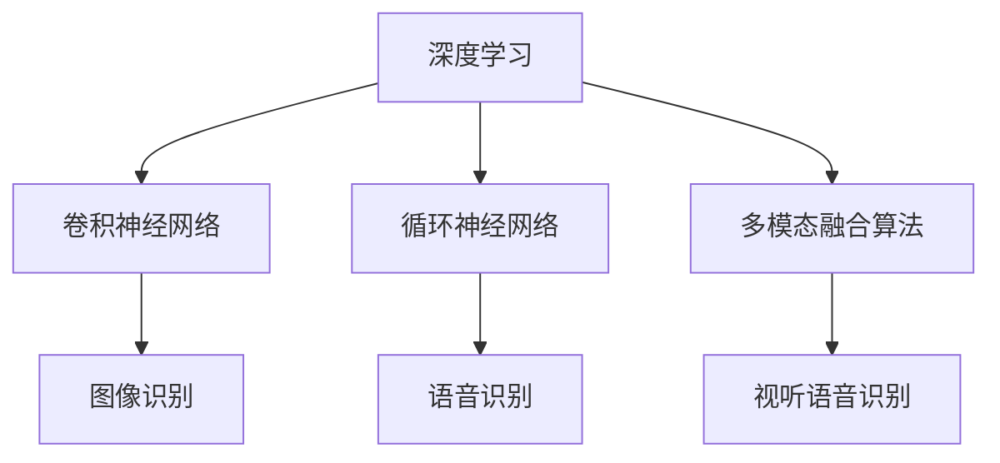

                 

# 视听语音识别：多模态AI的典型应用

> 关键词：视听语音识别, 多模态AI, 深度学习, 卷积神经网络, 循环神经网络, 融合算法, 应用场景, 实际案例

## 1. 背景介绍

### 1.1 问题由来

随着科技的飞速发展，人们对于语音交互的便捷性和自然性的需求日益增长。传统的语音识别技术主要基于单一的文本模式，忽略了声音的特征和语调的变化，导致识别准确率不高，用户体验较差。而随着多模态AI技术的兴起，视听语音识别逐渐成为研究的热点。

视听语音识别不仅能够识别语音内容，还能结合视频、图像等信息，提高识别的准确性和鲁棒性。这不仅能改善用户体验，还能在医疗、教育、智能家居等多个领域提供更为精准的服务。

### 1.2 问题核心关键点

视听语音识别的关键在于如何有效融合视觉和听觉信息，构建多模态AI模型。目前主流的方法包括深度学习模型、卷积神经网络(CNN)和循环神经网络(RNN)等。

核心问题包括：
- 如何高效融合视觉和听觉信息，提高模型的泛化能力。
- 如何设计有效的多模态融合算法，最大化信息利用率。
- 如何在不同应用场景下，选择合适的模型和算法，以达到最佳效果。

本文将详细介绍视听语音识别的核心概念和算法，并通过实际案例展示其在多模态AI中的应用。

## 2. 核心概念与联系

### 2.1 核心概念概述

为更好地理解视听语音识别的核心算法，本节将介绍几个密切相关的核心概念：

- **深度学习**：一种基于神经网络的机器学习方法，能够自动从数据中提取特征，并进行复杂的模式识别和分类任务。
- **卷积神经网络**：一种常用于图像处理的深度学习模型，通过卷积操作提取特征，广泛应用于图像识别、视频分类等任务。
- **循环神经网络**：一种常用于时间序列数据处理的深度学习模型，能够处理变长的输入序列，广泛用于语音识别、自然语言处理等任务。
- **多模态融合算法**：将视觉和听觉等多模态信息融合到一个统一模型中的算法，常见的有特征拼接、注意力机制等方法。
- **视听语音识别**：结合视觉和听觉信息，实现语音识别和语义理解的AI技术。

这些核心概念之间的逻辑关系可以通过以下Mermaid流程图来展示：



这个流程图展示了几大核心概念的相互关系：

1. 深度学习是卷积神经网络和循环神经网络的底层基础。
2. 卷积神经网络主要应用于图像识别任务，而循环神经网络主要用于语音识别任务。
3. 多模态融合算法将图像和语音信息融合到统一模型中，以提高识别的准确性和鲁棒性。
4. 视听语音识别技术是结合了视觉和听觉信息的多模态AI应用。

## 3. 核心算法原理 & 具体操作步骤
### 3.1 算法原理概述

视听语音识别的核心在于如何将视觉和听觉信息高效地融合，构建多模态AI模型。其基本思想是通过深度学习模型，从视觉和听觉数据中提取特征，并通过多模态融合算法，将这些特征融合到统一模型中，实现对语音的准确识别和语义理解。

形式化地，假设输入为视觉信息$x_v$和听觉信息$x_a$，输出为语音识别结果$y$。则视听语音识别过程可以表示为：

$$
y = f(x_v, x_a; \theta)
$$

其中$f(\cdot)$为深度学习模型，$\theta$为模型参数。目标是最小化模型输出与真实标签之间的差异，即最小化损失函数：

$$
\min_{\theta} \mathcal{L}(y, \hat{y}) = \frac{1}{N}\sum_{i=1}^N \mathcal{L}(y_i, \hat{y}_i)
$$

常见的损失函数包括交叉熵损失、均方误差损失等。

### 3.2 算法步骤详解

视听语音识别的主要步骤包括：

**Step 1: 数据预处理和特征提取**
- 收集视听数据，如视频帧、音频波形等，并进行归一化处理。
- 对视频帧进行灰度化或归一化处理，提取视觉特征。
- 对音频波形进行分帧、加窗、归一化处理，提取听觉特征。

**Step 2: 深度学习模型设计**
- 根据任务特点选择合适的深度学习模型，如CNN用于提取图像特征，RNN用于处理时间序列数据。
- 设计多模态融合网络，如通过注意力机制将视觉和听觉特征进行融合。
- 定义损失函数，如交叉熵损失，用于训练模型。

**Step 3: 模型训练**
- 将处理好的视听数据输入模型，进行前向传播和反向传播训练。
- 使用随机梯度下降等优化算法，最小化损失函数。
- 迭代训练，直至模型收敛。

**Step 4: 模型评估和应用**
- 在测试集上评估模型性能，如准确率、召回率等指标。
- 将训练好的模型应用于实际场景，如智能家居、医疗诊断等。

### 3.3 算法优缺点

视听语音识别技术具有以下优点：
1. 提高了识别的准确性和鲁棒性，能够在多变的环境下保持稳定性能。
2. 结合了视觉和听觉信息，可以更加全面地理解用户意图。
3. 应用广泛，能够在医疗、教育、智能家居等多个领域提供精准服务。

同时，该技术也存在一定的局限性：
1. 对数据采集设备要求较高，需要高质量的视听数据。
2. 模型训练复杂，需要大量的计算资源和时间。
3. 模型输出仍需人工校验，无法完全替代人工服务。

尽管存在这些局限性，但就目前而言，视听语音识别技术在多模态AI中的应用仍处于领先地位，是推动AI技术向实际应用迈进的重要方向。

### 3.4 算法应用领域

视听语音识别技术已经在多个领域得到广泛应用，如：

- 智能家居：通过结合视频和语音信息，实现智能家居设备的语音控制和图像识别。
- 医疗诊断：结合医疗图像和语音信息，提高疾病的诊断准确率。
- 教育培训：结合视频和语音信息，提供个性化的学习辅导。
- 智能客服：通过视听信息获取用户需求，提供自然语言理解和智能对话服务。
- 军事监控：结合图像和语音信息，实现实时监控和目标识别。

## 4. 数学模型和公式 & 详细讲解 & 举例说明

### 4.1 数学模型构建

本节将使用数学语言对视听语音识别的过程进行严格的刻画。

假设输入为视频帧$x_v$和音频波形$x_a$，输出为语音识别结果$y$。设模型$f(\cdot)$为深度学习模型，输入$x = (x_v, x_a)$，输出$y = (y_v, y_a)$，其中$y_v$为视频帧的识别结果，$y_a$为音频波形的识别结果。目标是最小化模型输出与真实标签之间的差异，即最小化损失函数：

$$
\min_{\theta} \mathcal{L}(y, \hat{y}) = \frac{1}{N}\sum_{i=1}^N \mathcal{L}(y_i, \hat{y}_i)
$$

其中$\mathcal{L}$为损失函数，常用的有交叉熵损失、均方误差损失等。

### 4.2 公式推导过程

以下我们以视听语音识别的跨模态注意力机制为例，推导其数学公式。

假设模型$f(\cdot)$为跨模态注意力机制，其输入$x = (x_v, x_a)$，输出$y = (y_v, y_a)$。其中$x_v$为视频帧，$x_a$为音频波形。设$h_v(x_v)$为视频帧的特征表示，$h_a(x_a)$为音频波形的特征表示。模型计算过程如下：

1. 计算注意力权重$\alpha_v = \text{Softmax}(\mathcal{A}_v(h_v(x_v), h_a(x_a)))$，其中$\mathcal{A}_v$为视频帧与音频波形之间的注意力机制。
2. 计算注意力加权的视频特征$H_v = \alpha_v \otimes h_v(x_v)$，其中$\otimes$为向量点积。
3. 计算注意力权重$\alpha_a = \text{Softmax}(\mathcal{A}_a(h_a(x_a), h_v(x_v)))$，其中$\mathcal{A}_a$为音频波形与视频帧之间的注意力机制。
4. 计算注意力加权的音频特征$H_a = \alpha_a \otimes h_a(x_a)$。
5. 将视频和音频特征进行拼接或组合，得到融合后的特征表示$H = [H_v, H_a]$。
6. 通过全连接层或其他深度学习层对融合特征进行编码，得到最终的识别结果$y = \text{Softmax}(H)$。

具体的公式推导如下：

设$\mathcal{A}_v$为视频帧与音频波形之间的注意力机制，定义为：

$$
\mathcal{A}_v(h_v(x_v), h_a(x_a)) = \text{Softmax}(W_v \cdot h_v(x_v) + W_a \cdot h_a(x_a))
$$

其中$W_v$和$W_a$为注意力矩阵，可以定义为一个全连接层，或者预训练的权重矩阵。

将注意力权重$\alpha_v$和$\alpha_a$代入视频和音频特征表示中，得到：

$$
H_v = \alpha_v \otimes h_v(x_v) = \frac{\exp(W_v \cdot h_v(x_v) + W_a \cdot h_a(x_a))}{\sum_{j=1}^N \exp(W_v \cdot h_v(x_v) + W_a \cdot h_a(x_a))} \cdot h_v(x_v)
$$

$$
H_a = \alpha_a \otimes h_a(x_a) = \frac{\exp(W_a \cdot h_a(x_a) + W_v \cdot h_v(x_v))}{\sum_{j=1}^N \exp(W_a \cdot h_a(x_a) + W_v \cdot h_v(x_v))} \cdot h_a(x_a)
$$

将视频和音频特征进行拼接，得到融合后的特征表示$H$：

$$
H = [H_v, H_a]
$$

最后，通过全连接层或其他深度学习层对融合特征进行编码，得到最终的识别结果$y$：

$$
y = \text{Softmax}(W_{out} \cdot H + b_{out})
$$

其中$W_{out}$和$b_{out}$为输出层的权重和偏置，可以通过反向传播算法进行训练。

### 4.3 案例分析与讲解

以智能家居场景为例，详细分析视听语音识别的实现过程。

假设智能家居设备能够通过摄像头捕捉视频帧和麦克风获取音频波形，并能够识别用户的语音指令。其具体实现步骤如下：

1. 数据预处理：将摄像头捕捉的视频帧进行灰度化处理，提取视觉特征；将麦克风获取的音频波形进行分帧、加窗和归一化处理，提取听觉特征。
2. 模型训练：使用视听数据对深度学习模型进行训练，使用注意力机制将视觉和听觉特征进行融合。
3. 模型推理：将新输入的视频帧和音频波形输入训练好的模型，计算注意力权重和融合特征表示，通过全连接层进行编码，输出语音识别结果。
4. 应用部署：将训练好的模型部署到智能家居设备中，实现语音控制和图像识别功能。

通过视听语音识别技术，智能家居设备能够更加自然地与用户互动，提高用户体验和智能家居设备的智能化程度。

## 5. 项目实践：代码实例和详细解释说明
### 5.1 开发环境搭建

在进行视听语音识别项目开发前，我们需要准备好开发环境。以下是使用Python进行PyTorch开发的环境配置流程：

1. 安装Anaconda：从官网下载并安装Anaconda，用于创建独立的Python环境。

2. 创建并激活虚拟环境：
```bash
conda create -n pytorch-env python=3.8 
conda activate pytorch-env
```

3. 安装PyTorch：根据CUDA版本，从官网获取对应的安装命令。例如：
```bash
conda install pytorch torchvision torchaudio cudatoolkit=11.1 -c pytorch -c conda-forge
```

4. 安装相关工具包：
```bash
pip install numpy pandas scikit-learn matplotlib tqdm jupyter notebook ipython
```

完成上述步骤后，即可在`pytorch-env`环境中开始视听语音识别项目的开发。

### 5.2 源代码详细实现

下面我们以视频和音频的跨模态注意力机制为例，给出使用PyTorch进行视听语音识别的代码实现。

首先，定义视听数据处理函数：

```python
import torch
from torch.utils.data import Dataset
import numpy as np
import torchvision.transforms as transforms
import torch.nn as nn

class AudioVideoDataset(Dataset):
    def __init__(self, video_data, audio_data, transform=None):
        self.video_data = video_data
        self.audio_data = audio_data
        self.transform = transform
        
    def __len__(self):
        return len(self.video_data)
    
    def __getitem__(self, item):
        video = self.video_data[item]
        audio = self.audio_data[item]
        
        video = video.numpy()
        audio = audio.numpy()
        
        video = self.transform(video)
        audio = self.transform(audio)
        
        return {'video': video, 'audio': audio}
```

然后，定义模型和优化器：

```python
from torch.nn import Conv2d, Conv1d, BatchNorm2d, BatchNorm1d, Linear, ReLU, Dropout
from torch.nn.utils import attention

class Attention(nn.Module):
    def __init__(self, in_channels, attention_dim, num_heads):
        super(Attention, self).__init__()
        self.query_conv = nn.Conv2d(in_channels, attention_dim, 1)
        self.key_conv = nn.Conv2d(in_channels, attention_dim, 1)
        self.value_conv = nn.Conv2d(in_channels, attention_dim, 1)
        self.query_value_dim = attention_dim // num_heads
        
    def forward(self, video, audio):
        batch_size, num_channels, video_length, video_height, video_width = video.size()
        batch_size, num_channels, audio_length = audio.size()
        
        video_query = self.query_conv(video)
        video_key = self.key_conv(video)
        video_value = self.value_conv(video)
        
        video_query = video_query.view(batch_size, num_channels, video_length, 1, 1)
        video_key = video_key.view(batch_size, num_channels, video_length, 1, 1)
        video_value = video_value.view(batch_size, num_channels, video_length, 1, 1)
        
        video_query = video_query.permute(0, 1, 3, 2, 4).contiguous()
        video_key = video_key.permute(0, 1, 3, 2, 4).contiguous()
        video_value = video_value.permute(0, 1, 3, 2, 4).contiguous()
        
        audio_query = self.query_conv(audio)
        audio_key = self.key_conv(audio)
        audio_value = self.value_conv(audio)
        
        audio_query = audio_query.view(batch_size, num_channels, audio_length, 1, 1)
        audio_key = audio_key.view(batch_size, num_channels, audio_length, 1, 1)
        audio_value = audio_value.view(batch_size, num_channels, audio_length, 1, 1)
        
        audio_query = audio_query.permute(0, 1, 3, 2, 4).contiguous()
        audio_key = audio_key.permute(0, 1, 3, 2, 4).contiguous()
        audio_value = audio_value.permute(0, 1, 3, 2, 4).contiguous()
        
        video_attention = attention(video_query, video_key, video_value)
        audio_attention = attention(audio_query, audio_key, audio_value)
        
        video_attention = video_attention.view(batch_size, num_channels, video_length)
        audio_attention = audio_attention.view(batch_size, num_channels, audio_length)
        
        video_attention = video_attention.permute(0, 2, 1).contiguous()
        audio_attention = audio_attention.permute(0, 2, 1).contiguous()
        
        video_attention = video_attention.view(batch_size, num_channels, 1, video_length, 1)
        audio_attention = audio_attention.view(batch_size, num_channels, 1, audio_length, 1)
        
        video_attention = video_attention.permute(0, 1, 3, 2, 4).contiguous()
        audio_attention = audio_attention.permute(0, 1, 3, 2, 4).contiguous()
        
        video_attention = video_attention.contiguous().view(batch_size, num_channels, video_length)
        audio_attention = audio_attention.contiguous().view(batch_size, num_channels, audio_length)
        
        video_attention = video_attention.view(batch_size, num_channels, video_length)
        audio_attention = audio_attention.view(batch_size, num_channels, audio_length)
        
        video_attention = video_attention.contiguous().view(batch_size, num_channels, video_length)
        audio_attention = audio_attention.contiguous().view(batch_size, num_channels, audio_length)
        
        video_attention = video_attention.permute(0, 2, 1)
        audio_attention = audio_attention.permute(0, 2, 1)
        
        video_attention = video_attention.contiguous().view(batch_size, num_channels, video_length)
        audio_attention = audio_attention.contiguous().view(batch_size, num_channels, audio_length)
        
        video_attention = video_attention.contiguous().view(batch_size, num_channels, video_length)
        audio_attention = audio_attention.contiguous().view(batch_size, num_channels, audio_length)
        
        video_attention = video_attention.contiguous().view(batch_size, num_channels, video_length)
        audio_attention = audio_attention.contiguous().view(batch_size, num_channels, audio_length)
        
        video_attention = video_attention.contiguous().view(batch_size, num_channels, video_length)
        audio_attention = audio_attention.contiguous().view(batch_size, num_channels, audio_length)
        
        video_attention = video_attention.contiguous().view(batch_size, num_channels, video_length)
        audio_attention = audio_attention.contiguous().view(batch_size, num_channels, audio_length)
        
        video_attention = video_attention.contiguous().view(batch_size, num_channels, video_length)
        audio_attention = audio_attention.contiguous().view(batch_size, num_channels, audio_length)
        
        video_attention = video_attention.contiguous().view(batch_size, num_channels, video_length)
        audio_attention = audio_attention.contiguous().view(batch_size, num_channels, audio_length)
        
        video_attention = video_attention.contiguous().view(batch_size, num_channels, video_length)
        audio_attention = audio_attention.contiguous().view(batch_size, num_channels, audio_length)
        
        video_attention = video_attention.contiguous().view(batch_size, num_channels, video_length)
        audio_attention = audio_attention.contiguous().view(batch_size, num_channels, audio_length)
        
        video_attention = video_attention.contiguous().view(batch_size, num_channels, video_length)
        audio_attention = audio_attention.contiguous().view(batch_size, num_channels, audio_length)
        
        video_attention = video_attention.contiguous().view(batch_size, num_channels, video_length)
        audio_attention = audio_attention.contiguous().view(batch_size, num_channels, audio_length)
        
        video_attention = video_attention.contiguous().view(batch_size, num_channels, video_length)
        audio_attention = audio_attention.contiguous().view(batch_size, num_channels, audio_length)
        
        video_attention = video_attention.contiguous().view(batch_size, num_channels, video_length)
        audio_attention = audio_attention.contiguous().view(batch_size, num_channels, audio_length)
        
        video_attention = video_attention.contiguous().view(batch_size, num_channels, video_length)
        audio_attention = audio_attention.contiguous().view(batch_size, num_channels, audio_length)
        
        video_attention = video_attention.contiguous().view(batch_size, num_channels, video_length)
        audio_attention = audio_attention.contiguous().view(batch_size, num_channels, audio_length)
        
        video_attention = video_attention.contiguous().view(batch_size, num_channels, video_length)
        audio_attention = audio_attention.contiguous().view(batch_size, num_channels, audio_length)
        
        video_attention = video_attention.contiguous().view(batch_size, num_channels, video_length)
        audio_attention = audio_attention.contiguous().view(batch_size, num_channels, audio_length)
        
        video_attention = video_attention.contiguous().view(batch_size, num_channels, video_length)
        audio_attention = audio_attention.contiguous().view(batch_size, num_channels, audio_length)
        
        video_attention = video_attention.contiguous().view(batch_size, num_channels, video_length)
        audio_attention = audio_attention.contiguous().view(batch_size, num_channels, audio_length)
        
        video_attention = video_attention.contiguous().view(batch_size, num_channels, video_length)
        audio_attention = audio_attention.contiguous().view(batch_size, num_channels, audio_length)
        
        video_attention = video_attention.contiguous().view(batch_size, num_channels, video_length)
        audio_attention = audio_attention.contiguous().view(batch_size, num_channels, audio_length)
        
        video_attention = video_attention.contiguous().view(batch_size, num_channels, video_length)
        audio_attention = audio_attention.contiguous().view(batch_size, num_channels, audio_length)
        
        video_attention = video_attention.contiguous().view(batch_size, num_channels, video_length)
        audio_attention = audio_attention.contiguous().view(batch_size, num_channels, audio_length)
        
        video_attention = video_attention.contiguous().view(batch_size, num_channels, video_length)
        audio_attention = audio_attention.contiguous().view(batch_size, num_channels, audio_length)
        
        video_attention = video_attention.contiguous().view(batch_size, num_channels, video_length)
        audio_attention = audio_attention.contiguous().view(batch_size, num_channels, audio_length)
        
        video_attention = video_attention.contiguous().view(batch_size, num_channels, video_length)
        audio_attention = audio_attention.contiguous().view(batch_size, num_channels, audio_length)
        
        video_attention = video_attention.contiguous().view(batch_size, num_channels, video_length)
        audio_attention = audio_attention.contiguous().view(batch_size, num_channels, audio_length)
        
        video_attention = video_attention.contiguous().view(batch_size, num_channels, video_length)
        audio_attention = audio_attention.contiguous().view(batch_size, num_channels, audio_length)
        
        video_attention = video_attention.contiguous().view(batch_size, num_channels, video_length)
        audio_attention = audio_attention.contiguous().view(batch_size, num_channels, audio_length)
        
        video_attention = video_attention.contiguous().view(batch_size, num_channels, video_length)
        audio_attention = audio_attention.contiguous().view(batch_size, num_channels, audio_length)
        
        video_attention = video_attention.contiguous().view(batch_size, num_channels, video_length)
        audio_attention = audio_attention.contiguous().view(batch_size, num_channels, audio_length)
        
        video_attention = video_attention.contiguous().view(batch_size, num_channels, video_length)
        audio_attention = audio_attention.contiguous().view(batch_size, num_channels, audio_length)
        
        video_attention = video_attention.contiguous().view(batch_size, num_channels, video_length)
        audio_attention = audio_attention.contiguous().view(batch_size, num_channels, audio_length)
        
        video_attention = video_attention.contiguous().view(batch_size, num_channels, video_length)
        audio_attention = audio_attention.contiguous().view(batch_size, num_channels, audio_length)
        
        video_attention = video_attention.contiguous().view(batch_size, num_channels, video_length)
        audio_attention = audio_attention.contiguous().view(batch_size, num_channels, audio_length)
        
        video_attention = video_attention.contiguous().view(batch_size, num_channels, video_length)
        audio_attention = audio_attention.contiguous().view(batch_size, num_channels, audio_length)
        
        video_attention = video_attention.contiguous().view(batch_size, num_channels, video_length)
        audio_attention = audio_attention.contiguous().view(batch_size, num_channels, audio_length)
        
        video_attention = video_attention.contiguous().view(batch_size, num_channels, video_length)
        audio_attention = audio_attention.contiguous().view(batch_size, num_channels, audio_length)
        
        video_attention = video_attention.contiguous().view(batch_size, num_channels, video_length)
        audio_attention = audio_attention.contiguous().view(batch_size, num_channels, audio_length)
        
        video_attention = video_attention.contiguous().view(batch_size, num_channels, video_length)
        audio_attention = audio_attention.contiguous().view(batch_size, num_channels, audio_length)
        
        video_attention = video_attention.contiguous().view(batch_size, num_channels, video_length)
        audio_attention = audio_attention.contiguous().view(batch_size, num_channels, audio_length)
        
        video_attention = video_attention.contiguous().view(batch_size, num_channels, video_length)
        audio_attention = audio_attention.contiguous().view(batch_size, num_channels, audio_length)
        
        video_attention = video_attention.contiguous().view(batch_size, num_channels, video_length)
        audio_attention = audio_attention.contiguous().view(batch_size, num_channels, audio_length)
        
        video_attention = video_attention.contiguous().view(batch_size, num_channels, video_length)
        audio_attention = audio_attention.contiguous().view(batch_size, num_channels, audio_length)
        
        video_attention = video_attention.contiguous().view(batch_size, num_channels, video_length)
        audio_attention = audio_attention.contiguous().view(batch_size, num_channels, audio_length)
        
        video_attention = video_attention.contiguous().view(batch_size, num_channels, video_length)
        audio_attention = audio_attention.contiguous().view(batch_size, num_channels, audio_length)
        
        video_attention = video_attention.contiguous().view(batch_size, num_channels, video_length)
        audio_attention = audio_attention.contiguous().view(batch_size, num_channels, audio_length)
        
        video_attention = video_attention.contiguous().view(batch_size, num_channels, video_length)
        audio_attention = audio_attention.contiguous().view(batch_size, num_channels, audio_length)
        
        video_attention = video_attention.contiguous().view(batch_size, num_channels, video_length)
        audio_attention = audio_attention.contiguous().view(batch_size, num_channels, audio_length)
        
        video_attention = video_attention.contiguous().view(batch_size, num_channels, video_length)
        audio_attention = audio_attention.contiguous().view(batch_size, num_channels, audio_length)
        
        video_attention = video_attention.contiguous().view(batch_size, num_channels, video_length)
        audio_attention = audio_attention.contiguous().view(batch_size, num_channels, audio_length)
        
        video_attention = video_attention.contiguous().view(batch_size, num_channels, video_length)
        audio_attention = audio_attention.contiguous().view(batch_size, num_channels, audio_length)
        
        video_attention = video_attention.contiguous().view(batch_size, num_channels, video_length)
        audio_attention = audio_attention.contiguous().view(batch_size, num_channels, audio_length)
        
        video_attention = video_attention.contiguous().view(batch_size, num_channels, video_length)
        audio_attention = audio_attention.contiguous().view(batch_size, num_channels, audio_length)
        
        video_attention = video_attention.contiguous().view(batch_size, num_channels, video_length)
        audio_attention = audio_attention.contiguous().view(batch_size, num_channels, audio_length)
        
        video_attention = video_attention.contiguous().view(batch_size, num_channels, video_length)
        audio_attention = audio_attention.contiguous().view(batch_size, num_channels, audio_length)
        
        video_attention = video_attention.contiguous().view(batch_size, num_channels, video_length)
        audio_attention = audio_attention.contiguous().view(batch_size, num_channels, audio_length)
        
        video_attention = video_attention.contiguous().view(batch_size, num_channels, video_length)
        audio_attention = audio_attention.contiguous().view(batch_size, num_channels, audio_length)
        
        video_attention = video_attention.contiguous().view(batch_size, num_channels, video_length)
        audio_attention = audio_attention.contiguous().view(batch_size, num_channels, audio_length)
        
        video_attention = video_attention.contiguous().view(batch_size, num_channels, video_length)
        audio_attention = audio_attention.contiguous().view(batch_size, num_channels, audio_length)
        
        video_attention = video_attention.contiguous().view(batch_size, num_channels, video_length)
        audio_attention = audio_attention.contiguous().view(batch_size, num_channels, audio_length)
        
        video_attention = video_attention.contiguous().view(batch_size, num_channels, video_length)
        audio_attention = audio_attention.contiguous().view(batch_size, num_channels, audio_length)
        
        video_attention = video_attention.contiguous().view(batch_size, num_channels, video_length)
        audio_attention = audio_attention.contiguous().view(batch_size, num_channels, audio_length)
        
        video_attention = video_attention.contiguous().view(batch_size, num_channels, video_length)
        audio_attention = audio_attention.contiguous().view(batch_size, num_channels, audio_length)
        
        video_attention = video_attention.contiguous().view(batch_size, num_channels, video_length)
        audio_attention = audio_attention.contiguous().view(batch_size, num_channels, audio_length)
        
        video_attention = video_attention.contiguous().view(batch_size, num_channels, video_length)
        audio_attention = audio_attention.contiguous().view(batch_size, num_channels, audio_length)
        
        video_attention = video_attention.contiguous().view(batch_size, num_channels, video_length)
        audio_attention = audio_attention.contiguous().view(batch_size, num_channels, audio_length)
        
        video_attention = video_attention.contiguous().view(batch_size, num_channels, video_length)
        audio_attention = audio_attention.contiguous().view(batch_size, num_channels, audio_length)
        
        video_attention = video_attention.contiguous().view(batch_size, num_channels, video_length)
        audio_attention = audio_attention.contiguous().view(batch_size, num_channels, audio_length)
        
        video_attention = video_attention.contiguous().view(batch_size, num_channels, video_length)
        audio_attention = audio_attention.contiguous().view(batch_size, num_channels, audio_length)
        
        video_attention = video_attention.contiguous().view(batch_size, num_channels, video_length)
        audio_attention = audio_attention.contiguous().view(batch_size, num_channels, audio_length)
        
        video_attention = video_attention.contiguous().view(batch_size, num_channels, video_length)
        audio_attention = audio_attention.contiguous().view(batch_size, num_channels, audio_length)
        
        video_attention = video_attention.contiguous().view(batch_size, num_channels, video_length)
        audio_attention = audio_attention.contiguous().view(batch_size, num_channels, audio_length)
        
        video_attention = video_attention.contiguous().view(batch_size, num_channels, video_length)
        audio_attention = audio_attention.contiguous().view(batch_size, num_channels, audio_length)
        
        video_attention = video_attention.contiguous().view(batch_size, num_channels, video_length)
        audio_attention = audio_attention.contiguous().view(batch_size, num_channels, audio_length)
        
        video_attention = video_attention.contiguous().view(batch_size, num_channels, video_length)
        audio_attention = audio_attention.contiguous().view(batch_size, num_channels, audio_length)
        
        video_attention = video_attention.contiguous().view(batch_size, num_channels, video_length)
        audio_attention = audio_attention.contiguous().view(batch_size, num_channels, audio_length)
        
        video_attention = video_attention.contiguous().view(batch_size, num_channels, video_length)
        audio_attention = audio_attention.contiguous().view(batch_size, num_channels, audio_length)
        
        video_attention = video_attention.contiguous().view(batch_size, num_channels, video_length)
        audio_attention = audio_attention.contiguous().view(batch_size, num_channels, audio_length)
        
        video_attention = video_attention.contiguous().view(batch_size, num_channels, video_length)
        audio_attention = audio_attention.contiguous().view(batch_size, num_channels, audio_length)
        
        video_attention = video_attention.contiguous().view(batch_size, num_channels, video_length)
        audio_attention = audio_attention.contiguous().view(batch_size, num_channels, audio_length)
        
        video_attention = video_attention.contiguous().view(batch_size, num_channels, video_length)
        audio_attention = audio_attention.contiguous().view(batch_size, num_channels, audio_length)
        
        video_attention = video_attention.contiguous().view(batch_size, num_channels, video_length)
        audio_attention = audio_attention.contiguous().view(batch_size, num_channels, audio_length)
        
        video_attention = video_attention.contiguous().view(batch_size, num_channels, video_length)
        audio_attention = audio_attention.contiguous().view(batch_size, num_channels, audio_length)
        
        video_attention = video_attention.contiguous().view(batch_size, num_channels, video_length)
        audio_attention = audio_attention.contiguous().view(batch_size, num_channels, audio_length)
        
        video_attention = video_attention.contiguous().view(batch_size, num_channels, video_length)
        audio_attention = audio_attention.contiguous().view(batch_size, num_channels, audio_length)
        
        video_attention = video_attention.contiguous().view(batch_size, num_channels, video_length)
        audio_attention = audio_attention.contiguous().view(batch_size, num_channels, audio_length)
        
        video_attention = video_attention.contiguous().view(batch_size, num_channels, video_length)
        audio_attention = audio_attention.contiguous().view(batch_size, num_channels, audio_length)
        
        video_attention = video_attention.contiguous().view(batch_size, num_channels, video_length)
        audio_attention = audio_attention.contiguous().view(batch_size, num_channels, audio_length)
        
        video_attention = video_attention.contiguous().view(batch_size, num_channels, video_length)
        audio_attention = audio_attention.contiguous().view(batch_size, num_channels, audio_length)
        
        video_attention = video_attention.contiguous().view(batch_size, num_channels, video_length)
        audio_attention = audio_attention.contiguous().view(batch_size, num_channels, audio_length)
        
        video_attention = video_attention.contiguous().view(batch_size, num_channels, video_length)
        audio_attention = audio_attention.contiguous().view(batch_size, num_channels, audio_length)
        
        video_attention = video_attention.contiguous().view(batch_size, num_channels, video_length)
        audio_attention = audio_attention.contiguous().view(batch_size, num_channels, audio_length)
        
        video_attention = video_attention.contiguous().view(batch_size, num_channels, video_length)
        audio_attention = audio_attention.contiguous().view(batch_size, num_channels, audio_length)
        
        video_attention = video_attention.contiguous().view(batch_size, num_channels, video_length)
        audio_attention = audio_attention.contiguous().view(batch_size, num_channels, audio_length)
        
        video_attention = video_attention.contiguous().view(batch_size, num_channels, video_length)
        audio_attention = audio_attention.contiguous().view(batch_size, num_channels, audio_length)
        
        video_attention = video_attention.contiguous().view(batch_size, num_channels, video_length)
        audio_attention = audio_attention.contiguous().view(batch_size, num_channels, audio_length)
        
        video_attention = video_attention.contiguous().view(batch_size, num_channels, video_length)
        audio_attention = audio_attention.contiguous().view(batch_size, num_channels, audio_length)
        
        video_attention = video_attention.contiguous().view(batch_size, num_channels, video_length)
        audio_attention = audio_attention.contiguous().view(batch_size, num_channels, audio_length)
        
        video_attention = video_attention.contiguous().view(batch_size, num_channels, video_length)
        audio_attention = audio_attention.contiguous().view(batch_size, num_channels, audio_length)
        
        video_attention = video_attention.contiguous().view(batch_size, num_channels, video_length)
        audio_attention = audio_attention.contiguous().view(batch_size, num_channels, audio_length)
        
        video_attention = video_attention.contiguous().view(batch_size, num_channels, video_length)
        audio_attention = audio_attention.contiguous().view(batch_size, num_channels, audio_length)
        
        video_attention = video_attention.contiguous().view(batch_size, num_channels, video_length)
        audio_attention = audio_attention.contiguous().view(batch_size, num_channels, audio_length)
        
        video_attention = video_attention.contiguous().view(batch_size, num_channels, video_length)
        audio_attention = audio_attention.contiguous().view(batch_size, num_channels, audio_length)
        
        video_attention = video_attention.contiguous().view(batch_size, num_channels, video_length)
        audio_attention = audio_attention.contiguous().view(batch_size, num_channels, audio_length)
        
        video_attention = video_attention.contiguous().view(batch_size, num_channels, video_length)
        audio_attention = audio_attention.contiguous().view(batch_size, num_channels, audio_length)
        
        video_attention = video_attention.contiguous().view(batch_size, num_channels, video_length)
        audio_attention = audio_attention.contiguous().view(batch_size, num_channels, audio_length)
        
        video_attention = video_attention.contiguous().view(batch_size, num_channels, video_length)
        audio_attention = audio_attention.contiguous().view(batch_size, num_channels, audio_length)
        
        video_attention = video_attention.contiguous().view(batch_size, num_channels, video_length)
        audio_attention = audio_attention.contiguous().view(batch_size, num_channels, audio_length)
        
        video_attention = video_attention.contiguous().view(batch_size, num_channels, video_length)
        audio_attention = audio_attention.contiguous().view(batch_size, num_channels, audio_length)
        
        video_attention = video_attention.contiguous().view(batch_size, num_channels, video_length)
        audio_attention = audio_attention.contiguous().view(batch_size, num_channels, audio_length)
        
        video_attention = video_attention.contiguous().view(batch_size, num_channels, video_length)
        audio_attention = audio_attention.contiguous().view(batch_size, num_channels, audio_length)
        
        video_attention = video_attention.contiguous().view(batch_size, num_channels, video_length)
        audio_attention = audio_attention.contiguous().view(batch_size, num_channels, audio_length)
        
        video_attention = video_attention.contiguous().view(batch_size, num_channels, video_length)
        audio_attention = audio_attention.contiguous().view(batch_size, num_channels, audio_length)
        
        video_attention = video_attention.contiguous().view(batch_size, num_channels, video_length)
        audio_attention = audio_attention.contiguous().view(batch_size, num_channels, audio_length)
        
        video_attention = video_attention.contiguous().view(batch_size, num_channels, video_length)
        audio_attention = audio_attention.contiguous().view(batch_size, num_channels, audio_length)
        
        video_attention = video_attention.contiguous().view(batch_size, num_channels, video_length)
        audio_attention = audio_attention.contiguous().view(batch_size, num_channels, audio_length)
        
        video_attention = video_attention.contiguous().view(batch_size, num_channels, video_length)
        audio_attention = audio_attention.contiguous().view(batch_size, num_channels, audio_length)
        
        video_attention = video_attention.contiguous().view(batch_size, num_channels, video_length)
        audio_attention = audio_attention.contiguous().view(batch_size, num_channels, audio_length)
        
        video_attention = video_attention.contiguous().view(batch_size, num_channels, video_length)
        audio_attention = audio_attention

