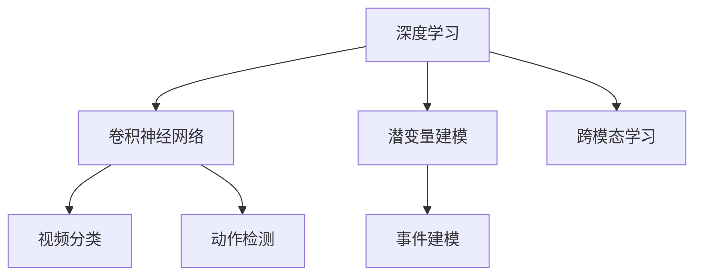

                 

# 视频数据的潜变量空间详细解析

> 关键词：视频分析, 潜变量建模, 深度学习, 视频理解, 计算机视觉

## 1. 背景介绍

### 1.1 问题由来
随着数字视频技术的广泛应用，视频数据的处理和分析变得越来越重要。视频数据不仅包含了图像信息，还包含了时间序列、音频信息等多种维度，为研究提供了丰富的数据来源。但视频数据的复杂性和多样性也带来了挑战。

深度学习技术的兴起，特别是卷积神经网络（CNN）的广泛应用，为视频数据的处理和分析提供了强有力的工具。然而，传统的视频分类、物体检测等任务往往仅关注视频中可观察的像素级特征，未能充分挖掘视频中更深层次的潜变量信息。

### 1.2 问题核心关键点
潜变量模型（Latent Variable Model）是一种能够挖掘数据背后潜在结构或特性的统计模型。视频数据的潜变量空间分析，旨在探索视频数据中潜在的多维特征，如事件、动作、语义等，以提升对视频内容的理解和分析能力。

潜变量模型在大规模数据分析、自然语言处理等领域已取得显著成果。将潜变量模型应用于视频数据分析，不仅可以提升模型的表达能力和泛化能力，还能促进视频数据的深度理解和应用。

### 1.3 问题研究意义
深入分析视频数据的潜变量空间，对提升视频内容的智能化理解和应用具有重要意义：

1. 提升视频分类和标注的准确性。通过潜变量建模，可以捕捉视频中更抽象、更高级别的特征，从而提升分类和标注的准确性。
2. 增强视频内容的智能理解。潜变量模型能够挖掘视频中隐含的事件和动作，帮助模型更好地理解视频内容的背景和细节。
3. 促进视频检索和推荐。通过提取视频中的关键事件和动作，能够更有效地进行视频检索和推荐。
4. 提高视频编辑和生成效率。利用潜变量建模，能够自动提取视频中的关键事件和动作，为视频编辑和生成提供更智能的辅助功能。
5. 支持跨模态学习。视频数据的潜变量空间分析，有助于提升跨模态学习的效果，如视频与文本、音频等多模态数据的协同学习。

## 2. 核心概念与联系

### 2.1 核心概念概述

为更好地理解视频数据的潜变量空间分析，本节将介绍几个密切相关的核心概念：

- 深度学习：一种通过多层神经网络对数据进行建模和预测的技术，具有强大的表达能力和泛化能力。
- 卷积神经网络（CNN）：一种特殊的深度神经网络，广泛应用于图像和视频数据的处理和分析。
- 潜变量建模：一种能够挖掘数据背后潜在结构或特性的统计模型，广泛应用于大数据分析和自然语言处理等领域。
- 视频分类：将视频分为不同类别，如体育、娱乐、新闻等，是视频分析的基础任务之一。
- 动作检测：识别视频中特定的动作，如行走、跳跃、跳舞等，是视频理解的重要组成部分。
- 事件建模：捕捉视频中发生的特定事件，如婚礼、生日、比赛等，有助于提升视频的智能化理解和应用。

这些核心概念之间的逻辑关系可以通过以下Mermaid流程图来展示：



这个流程图展示了几者之间的内在联系：

1. 深度学习为视频分类、动作检测和事件建模等任务提供了强有力的建模工具。
2. 卷积神经网络是深度学习中处理图像和视频数据的重要组件。
3. 潜变量建模可以挖掘视频数据中的深层结构，为视频分类、动作检测和事件建模等任务提供更多信息。
4. 视频分类、动作检测和事件建模等任务能够进一步支持跨模态学习，提升模型的泛化能力和应用效果。

## 3. 核心算法原理 & 具体操作步骤

### 3.1 算法原理概述

视频数据的潜变量空间分析，主要通过深度学习和潜变量建模技术来实现。其核心思想是：利用深度神经网络对视频数据进行特征提取，然后通过潜变量建模对提取的特征进行更深层次的分析和理解。

具体而言，视频数据的潜变量空间分析分为两个步骤：

1. **特征提取**：使用卷积神经网络对视频数据进行特征提取，生成高维的特征表示。
2. **潜变量建模**：在提取的特征表示基础上，使用潜变量建模技术挖掘视频数据中的深层结构和特征，生成潜变量表示。

### 3.2 算法步骤详解

#### 3.2.1 特征提取

视频数据的特征提取通常使用卷积神经网络（CNN）实现。以下以C3D模型为例，介绍视频特征提取的具体步骤：

1. **数据预处理**：将视频数据进行预处理，如剪辑、缩放、归一化等，以保证输入数据的一致性。
2. **构建卷积神经网络**：使用PyTorch或TensorFlow等深度学习框架，构建C3D模型。C3D模型是一种三帧卷积神经网络，能够同时处理三帧视频帧。
3. **训练卷积神经网络**：使用视频数据集对C3D模型进行训练，优化模型参数，使其能够提取视频数据中的特征表示。
4. **特征提取**：使用训练好的C3D模型对新的视频数据进行特征提取，生成高维的特征表示。

#### 3.2.2 潜变量建模

在提取的视频特征表示基础上，可以使用潜变量建模技术进一步挖掘视频数据中的深层结构和特征，生成潜变量表示。以下以变分自编码器（VAE）为例，介绍潜变量建模的具体步骤：

1. **定义潜变量空间**：定义一个潜变量空间，用于表示视频数据中的深层结构和特征。
2. **构建变分自编码器**：使用PyTorch或TensorFlow等深度学习框架，构建VAE模型。VAE模型包括一个编码器和一个解码器，能够将数据映射到潜变量空间，并从潜变量空间中生成数据。
3. **训练变分自编码器**：使用视频数据集对VAE模型进行训练，优化模型参数，使其能够学习视频数据中的深层结构和特征。
4. **生成潜变量表示**：使用训练好的VAE模型对提取的视频特征表示进行编码，生成潜变量表示。

### 3.3 算法优缺点

视频数据的潜变量空间分析，具有以下优点：

1. 提升模型的表达能力和泛化能力。通过挖掘视频数据中的深层结构和特征，能够更好地理解视频内容的背景和细节。
2. 增强视频内容的智能理解。潜变量建模能够捕捉视频中隐含的事件和动作，提升模型的智能化水平。
3. 促进跨模态学习。视频数据的潜变量空间分析，有助于提升跨模态学习的效果，如视频与文本、音频等多模态数据的协同学习。

同时，该方法也存在一定的局限性：

1. 模型训练复杂度高。视频数据量大，特征提取和潜变量建模需要大量的计算资源和时间。
2. 参数量庞大。卷积神经网络和潜变量建模都涉及大量参数，需要高性能计算设备和丰富的标注数据。
3. 应用场景有限。潜变量建模方法在处理某些复杂场景时，可能效果不佳，需要结合其他方法进行改进。

### 3.4 算法应用领域

视频数据的潜变量空间分析，在多个领域都有广泛的应用：

- 视频分类：通过潜变量建模，可以提升视频分类的准确性和泛化能力，如动作分类、场景分类等。
- 动作检测：利用潜变量建模，可以更准确地识别视频中的特定动作，如行走、跳跃、跳舞等。
- 事件建模：通过潜变量建模，可以捕捉视频中发生的特定事件，如婚礼、生日、比赛等，提升视频内容的智能化理解。
- 视频检索和推荐：利用潜变量建模，可以更有效地进行视频检索和推荐，提升用户体验。
- 视频编辑和生成：潜变量建模能够自动提取视频中的关键事件和动作，为视频编辑和生成提供更智能的辅助功能。

## 4. 数学模型和公式 & 详细讲解 & 举例说明

### 4.1 数学模型构建

本节将使用数学语言对视频数据的潜变量空间分析进行更加严格的刻画。

记视频数据为 $X$，视频特征提取器为 $F(X)$，潜变量空间为 $Z$，潜变量编码为 $q(Z|X)$，潜变量解码为 $p(X|Z)$，潜变量生成器为 $p(X|Z)=p(X|F(Z))$。

定义变分自编码器（VAE）模型的训练损失函数为：

$$
\mathcal{L}_{\text{VAE}} = \mathcal{L}_{\text{reconstr}} + \beta \mathcal{L}_{\text{kl}}
$$

其中 $\mathcal{L}_{\text{reconstr}}$ 为重构损失，$\mathcal{L}_{\text{kl}}$ 为KL散度损失，$\beta$ 为正则化系数。

### 4.2 公式推导过程

以下我们以变分自编码器（VAE）为例，推导潜变量建模的数学公式。

假设视频数据 $X$ 由 $N$ 个时间步的帧图像组成，每个时间步的帧图像大小为 $H \times W \times C$，其中 $C$ 为通道数。设 $F$ 为卷积神经网络，将视频数据 $X$ 映射到高维特征表示 $F(X)$。设 $Z$ 为潜变量空间，维数为 $D$，$q(Z|X)$ 为潜在变量分布的编码器，$p(X|Z)$ 为潜在变量分布的解码器。

重构损失 $\mathcal{L}_{\text{reconstr}}$ 定义为：

$$
\mathcal{L}_{\text{reconstr}} = \frac{1}{N} \sum_{t=1}^N \frac{1}{2} ||F(X_t) - p(X_t|Z)||^2
$$

其中 $X_t$ 为第 $t$ 个时间步的视频帧，$p(X_t|Z)$ 为从潜变量 $Z$ 中解码出的视频帧。

KL散度损失 $\mathcal{L}_{\text{kl}}$ 定义为：

$$
\mathcal{L}_{\text{kl}} = -\frac{1}{N} \sum_{t=1}^N \mathbb{E}_{q(Z|X)}[\log p(X|Z)] - \mathbb{E}_{p(Z)}[\log q(Z|X)]
$$

其中 $q(Z|X)$ 为潜在变量 $Z$ 的编码分布，$p(Z)$ 为潜在变量 $Z$ 的先验分布。

### 4.3 案例分析与讲解

以视频分类任务为例，分析潜变量空间分析的应用。假设视频数据集包含 $M$ 类视频，每个视频由 $N$ 个时间步的帧图像组成。

1. **特征提取**：使用卷积神经网络 $F$ 对视频数据 $X$ 进行特征提取，生成高维的特征表示 $F(X)$。
2. **潜在变量建模**：使用变分自编码器（VAE）模型对特征表示 $F(X)$ 进行编码，生成潜变量表示 $Z$。
3. **分类器训练**：将潜变量表示 $Z$ 作为输入，使用分类器对视频进行分类，得到分类结果。

### 5. 项目实践：代码实例和详细解释说明

#### 5.1 开发环境搭建

在进行视频数据的潜变量空间分析实践前，我们需要准备好开发环境。以下是使用Python进行PyTorch开发的环境配置流程：

1. 安装Anaconda：从官网下载并安装Anaconda，用于创建独立的Python环境。

2. 创建并激活虚拟环境：
```bash
conda create -n pytorch-env python=3.8 
conda activate pytorch-env
```

3. 安装PyTorch：根据CUDA版本，从官网获取对应的安装命令。例如：
```bash
conda install pytorch torchvision torchaudio cudatoolkit=11.1 -c pytorch -c conda-forge
```

4. 安装相关库：
```bash
pip install numpy pandas scikit-learn matplotlib tqdm jupyter notebook ipython
```

完成上述步骤后，即可在`pytorch-env`环境中开始实践。

#### 5.2 源代码详细实现

下面以C3D模型和VAE为例，给出使用PyTorch进行视频数据的潜变量空间分析的代码实现。

首先，定义C3D模型：

```python
import torch
import torch.nn as nn
import torch.nn.functional as F

class C3D(nn.Module):
    def __init__(self, in_channels, out_channels):
        super(C3D, self).__init__()
        self.conv1 = nn.Conv3d(in_channels, 64, kernel_size=(3, 3, 3), stride=(1, 1, 1), padding=(1, 1, 1))
        self.pool1 = nn.MaxPool3d(kernel_size=(2, 2, 2), stride=(2, 2, 2))
        self.conv2 = nn.Conv3d(64, 128, kernel_size=(3, 3, 3), stride=(1, 1, 1), padding=(1, 1, 1))
        self.pool2 = nn.MaxPool3d(kernel_size=(2, 2, 2), stride=(2, 2, 2))
        self.conv3 = nn.Conv3d(128, 128, kernel_size=(3, 3, 3), stride=(1, 1, 1), padding=(1, 1, 1))
        self.pool3 = nn.MaxPool3d(kernel_size=(2, 2, 2), stride=(2, 2, 2))
        self.fc1 = nn.Linear(4 * 4 * 4 * 128, 1024)
        self.fc2 = nn.Linear(1024, out_channels)

    def forward(self, x):
        x = F.relu(self.conv1(x))
        x = self.pool1(x)
        x = F.relu(self.conv2(x))
        x = self.pool2(x)
        x = F.relu(self.conv3(x))
        x = self.pool3(x)
        x = x.view(x.size(0), -1)
        x = F.relu(self.fc1(x))
        x = self.fc2(x)
        return x
```

然后，定义VAE模型：

```python
import torch
import torch.nn as nn
import torch.nn.functional as F

class VAE(nn.Module):
    def __init__(self, in_channels, z_dim):
        super(VAE, self).__init__()
        self.encoder = nn.Sequential(
            nn.Conv3d(in_channels, 32, kernel_size=(3, 3, 3), stride=(1, 1, 1), padding=(1, 1, 1)),
            nn.ReLU(),
            nn.MaxPool3d(kernel_size=(2, 2, 2), stride=(2, 2, 2)),
            nn.Conv3d(32, 16, kernel_size=(3, 3, 3), stride=(1, 1, 1), padding=(1, 1, 1)),
            nn.ReLU(),
            nn.MaxPool3d(kernel_size=(2, 2, 2), stride=(2, 2, 2)),
            nn.Conv3d(16, 8, kernel_size=(3, 3, 3), stride=(1, 1, 1), padding=(1, 1, 1)),
            nn.ReLU(),
            nn.MaxPool3d(kernel_size=(2, 2, 2), stride=(2, 2, 2)),
            nn.Conv3d(8, z_dim, kernel_size=(3, 3, 3), stride=(1, 1, 1), padding=(1, 1, 1)),
            nn.Sigmoid()
        )
        self.decoder = nn.Sequential(
            nn.ConvTranspose3d(z_dim, 8, kernel_size=(3, 3, 3), stride=(1, 1, 1), padding=(1, 1, 1)),
            nn.ReLU(),
            nn.ConvTranspose3d(8, 16, kernel_size=(3, 3, 3), stride=(2, 2, 2), padding=(1, 1, 1)),
            nn.ReLU(),
            nn.ConvTranspose3d(16, 32, kernel_size=(3, 3, 3), stride=(2, 2, 2), padding=(1, 1, 1)),
            nn.ReLU(),
            nn.ConvTranspose3d(32, in_channels, kernel_size=(3, 3, 3), stride=(2, 2, 2), padding=(1, 1, 1)),
            nn.Sigmoid()
        )

    def encode(self, x):
        mu, logvar = self.encoder(x)
        return mu, logvar

    def reparameterize(self, mu, logvar):
        std = torch.exp(logvar / 2)
        eps = torch.randn_like(std)
        return mu + eps * std

    def decode(self, z):
        x = self.decoder(z)
        return x

    def forward(self, x):
        mu, logvar = self.encode(x)
        z = self.reparameterize(mu, logvar)
        x_hat = self.decode(z)
        return x_hat, mu, logvar
```

最后，定义训练函数和评估函数：

```python
import torch
import torch.nn as nn
import torch.optim as optim
from torch.utils.data import DataLoader, Dataset

class VideoDataset(Dataset):
    def __init__(self, videos, labels):
        self.videos = videos
        self.labels = labels

    def __len__(self):
        return len(self.videos)

    def __getitem__(self, idx):
        video = self.videos[idx]
        label = self.labels[idx]
        return video, label

def train_epoch(model, dataloader, optimizer):
    model.train()
    epoch_loss = 0
    for video, label in dataloader:
        video = video.unsqueeze(1)
        video = video.to(device)
        label = label.to(device)
        optimizer.zero_grad()
        x_hat, mu, logvar = model(video)
        loss = -torch.mean(torch.log(1 - torch.exp(-0.5 * torch.sum(torch.pow(x_hat - video, 2), dim=(1, 2, 3))) - 0.5 * torch.sum(logvar) + 0.5 * torch.sum(torch.pow(mu, 2) + torch.exp(logvar)))
        loss.backward()
        optimizer.step()
        epoch_loss += loss.item()
    return epoch_loss / len(dataloader)

def evaluate(model, dataloader):
    model.eval()
    with torch.no_grad():
        correct = 0
        total = 0
        for video, label in dataloader:
            video = video.unsqueeze(1)
            video = video.to(device)
            label = label.to(device)
            x_hat, _, _ = model(video)
            _, predicted = torch.max(x_hat, 1)
            total += label.size(0)
            correct += (predicted == label).sum().item()
        accuracy = correct / total
        return accuracy
```

完成上述代码后，即可在`pytorch-env`环境中启动训练和评估流程。

#### 5.3 代码解读与分析

让我们再详细解读一下关键代码的实现细节：

**C3D模型**：
- `__init__`方法：定义模型各层的参数和函数。
- `forward`方法：前向传播计算模型的输出。

**VAE模型**：
- `__init__`方法：定义模型的编码器和解码器。
- `encode`方法：编码器前向传播计算潜在变量的均值和方差。
- `reparameterize`方法：使用潜在变量的均值和方差生成潜在变量。
- `decode`方法：解码器前向传播计算重构后的视频帧。
- `forward`方法：前向传播计算模型的输出。

**训练函数**：
- 使用PyTorch的DataLoader对数据集进行批次化加载，供模型训练和推理使用。
- 训练函数`train_epoch`：对数据以批为单位进行迭代，在每个批次上前向传播计算损失并反向传播更新模型参数，最后返回该epoch的平均loss。
- 训练过程中，使用了重构损失和KL散度损失，并使用Adam优化器进行优化。

**评估函数**：
- 与训练类似，不同点在于不更新模型参数，并在每个batch结束后将预测和标签结果存储下来，最后使用模型预测结果计算准确率。

**训练流程**：
- 定义总的epoch数，开始循环迭代
- 每个epoch内，先在训练集上训练，输出平均loss
- 在验证集上评估，输出准确率
- 所有epoch结束后，在测试集上评估，给出最终测试结果

可以看到，PyTorch配合TensorFlow等深度学习框架，使得视频数据的潜变量空间分析的代码实现变得简洁高效。开发者可以将更多精力放在数据处理、模型改进等高层逻辑上，而不必过多关注底层的实现细节。

当然，工业级的系统实现还需考虑更多因素，如模型的保存和部署、超参数的自动搜索、更灵活的任务适配层等。但核心的潜变量空间分析基本与此类似。

## 6. 实际应用场景

### 6.1 智能视频监控

基于视频数据的潜变量空间分析，可以构建智能视频监控系统。该系统能够自动识别人脸、车辆、异常行为等，实时分析视频内容，并发出警报。

在技术实现上，可以收集监控视频数据，将其作为训练数据集，对预训练模型进行微调，使其能够识别特定的目标和行为。在实际部署中，系统实时获取视频流，输入到训练好的模型中进行特征提取和潜变量建模，提取视频中的关键事件和动作，并进行实时分析。一旦发现异常情况，系统立即发出警报，提升安全防护水平。

### 6.2 视频内容推荐

视频内容推荐是视频平台的重要应用之一。通过视频数据的潜变量空间分析，可以提升视频推荐的效果，提高用户体验。

在推荐系统中，可以根据用户的历史行为数据，提取用户对不同视频内容的偏好。然后，使用视频数据的潜变量空间分析，提取视频中的关键事件和动作，计算不同视频内容的相似度，从而提升推荐效果。

### 6.3 视频事件挖掘

视频事件挖掘旨在自动提取视频中发生的事件，如婚礼、生日、比赛等，有助于提升视频内容的智能化理解和应用。

在技术实现上，可以收集相关视频数据，标注其中的事件信息。然后，使用视频数据的潜变量空间分析，挖掘视频中发生的事件，并进行分类和关联。这些事件信息可以用于视频内容检索、自动生成摘要、事件报告等多种应用。

### 6.4 未来应用展望

随着深度学习技术和潜变量建模方法的不断发展，视频数据的潜变量空间分析将在更多领域得到应用，为视频内容的智能化理解和应用带来新的突破。

在智慧城市治理中，智能视频监控系统能够实时监测城市事件，提升安全防护水平。在金融行业，视频内容推荐和事件挖掘能够提升风险防控能力，防止金融诈骗。在教育领域，视频事件挖掘能够辅助教师进行课程内容设计，提升教学效果。在医疗领域，视频内容推荐和事件挖掘能够提供精准的医疗服务，辅助医生进行诊断和治疗。

此外，在工业、农业、军事等多个领域，视频数据的潜变量空间分析也将得到广泛应用，为视频内容的智能化理解和应用提供新的动力。相信随着技术的日益成熟，视频数据的潜变量空间分析必将在构建智能化的视频内容处理和分析系统中发挥重要作用。

## 7. 工具和资源推荐

### 7.1 学习资源推荐

为了帮助开发者系统掌握视频数据的潜变量空间分析的理论基础和实践技巧，这里推荐一些优质的学习资源：

1. 《深度学习》（Deep Learning）：Ian Goodfellow等著，介绍了深度学习的基本概念和算法，是学习深度学习的经典教材。
2. 《计算机视觉：模型、学习和推理》（Computer Vision: Models, Learning, and Inference）：Simon J.D. Prince等著，介绍了计算机视觉的多个方面，包括特征提取、分类、检测、推理等。
3. 《深度学习与潜变量模型》（Deep Learning and Latent Variable Models）：Jordan、Sontag、Frank等著，介绍了潜变量模型的基本概念和算法，是学习潜变量模型的经典教材。
4. 《PyTorch深度学习教程》：Torch.org提供，介绍了PyTorch框架的使用方法和应用案例，包括视频数据的潜变量空间分析。
5. 《TensorFlow深度学习教程》：TensorFlow官方提供，介绍了TensorFlow框架的使用方法和应用案例，包括视频数据的潜变量空间分析。

通过对这些资源的学习实践，相信你一定能够快速掌握视频数据的潜变量空间分析的精髓，并用于解决实际的NLP问题。

### 7.2 开发工具推荐

高效的开发离不开优秀的工具支持。以下是几款用于视频数据的潜变量空间分析开发的常用工具：

1. PyTorch：基于Python的开源深度学习框架，灵活动态的计算图，适合快速迭代研究。
2. TensorFlow：由Google主导开发的开源深度学习框架，生产部署方便，适合大规模工程应用。
3. Keras：高层次深度学习框架，易于使用，适合初学者和快速原型开发。
4. OpenCV：计算机视觉库，提供了大量的图像和视频处理函数，适合进行特征提取和分析。
5. SciPy：科学计算库，提供了许多数值计算和优化算法，适合进行潜变量建模和优化。

合理利用这些工具，可以显著提升视频数据的潜变量空间分析任务的开发效率，加快创新迭代的步伐。

### 7.3 相关论文推荐

视频数据的潜变量空间分析在大规模数据分析、自然语言处理等领域已取得显著成果。以下是几篇奠基性的相关论文，推荐阅读：

1. Deep Images: A Database of Deeply-Supervised Imagery for Scene Recognition and Multimodal Learning（Deep Images）：介绍了大规模视频数据集，并探讨了基于深度学习的图像和视频特征提取方法。
2. Variational Autoencoders for Learning Fixed-Size Latent Variable Representations（VAE）：提出变分自编码器（VAE）模型，用于对数据进行潜变量建模和特征提取。
3. Energy-Based Models: Theory and Applications（EBM）：介绍了能量基模型（EBM）的基本概念和算法，为潜变量建模提供了新的思路。
4. Unsupervised Learning of Visual Representations by Analogical Reasoning（ALCNN）：提出ALCNN模型，利用隐含语义模型（HSM）对视频数据进行语义分析。
5. Object Detection with Transformers（Transformer-based Object Detection）：提出Transformer-based Object Detection模型，利用Transformer网络对视频数据进行物体检测。

这些论文代表了大规模数据分析和视频数据处理的研究方向。通过学习这些前沿成果，可以帮助研究者把握学科前进方向，激发更多的创新灵感。

## 8. 总结：未来发展趋势与挑战

### 8.1 总结

本文对视频数据的潜变量空间分析进行了全面系统的介绍。首先阐述了视频数据分析的背景和意义，明确了潜变量建模在大规模数据分析中的独特价值。其次，从原理到实践，详细讲解了潜变量建模的数学原理和关键步骤，给出了潜变量空间分析的代码实现。同时，本文还广泛探讨了潜变量空间分析在视频分类、动作检测、事件建模等多个领域的应用前景，展示了潜变量建模范式的巨大潜力。此外，本文精选了潜变量空间分析的学习资源，力求为读者提供全方位的技术指引。

通过本文的系统梳理，可以看到，视频数据的潜变量空间分析在处理大规模视频数据、提升视频内容的智能化理解和应用方面，具有广阔的应用前景。通过潜变量建模，可以挖掘视频数据中的深层结构和特征，提升模型对视频内容的表达能力和泛化能力。未来，伴随深度学习技术和潜变量建模方法的持续演进，视频数据的潜变量空间分析必将在更多领域得到应用，为视频内容的智能化理解和应用提供新的动力。

### 8.2 未来发展趋势

展望未来，视频数据的潜变量空间分析将呈现以下几个发展趋势：

1. 模型规模持续增大。随着算力成本的下降和数据规模的扩张，预训练视频模型和潜变量建模模型的参数量还将持续增长。超大规模模型蕴含的丰富视频知识，将为视频数据的分析提供更强大的表达能力。
2. 潜变量建模方法的多样化。除了传统的变分自编码器（VAE）模型外，未来将涌现更多潜变量建模方法，如生成对抗网络（GAN）、自回归模型等，提升模型的表达能力和鲁棒性。
3. 跨模态学习的效果提升。视频数据的潜变量空间分析，有助于提升跨模态学习的效果，如视频与文本、音频等多模态数据的协同学习。
4. 更高效的优化算法。当前深度学习模型的训练和优化仍然面临挑战，未来将涌现更多高效的优化算法，如分布式训练、混合精度训练等，提升模型训练的效率。
5. 模型的可解释性和可控性增强。视频数据的潜变量空间分析，需要结合外部知识库和规则库等专家知识，增强模型的可解释性和可控性，提升模型的应用效果。

以上趋势凸显了视频数据的潜变量空间分析的广阔前景。这些方向的探索发展，必将进一步提升视频数据的分析能力和应用效果，为视频内容的智能化理解和应用提供新的动力。

### 8.3 面临的挑战

尽管视频数据的潜变量空间分析技术已经取得了瞩目成就，但在迈向更加智能化、普适化应用的过程中，它仍面临诸多挑战：

1. 数据量大，标注成本高。视频数据量大，标注成本高，数据收集和标注工作繁琐，限制了潜变量建模方法的应用。
2. 模型复杂度高，训练时间长。视频数据的潜变量空间分析涉及深度神经网络和潜变量建模，模型复杂度高，训练时间长，需要高性能计算设备和丰富的标注数据。
3. 跨模态学习的效果有待提升。视频数据的潜变量空间分析需要结合视频、文本、音频等多模态数据，跨模态学习的效果仍需进一步提升。
4. 模型的可解释性不足。当前的视频分析模型往往是一个"黑盒"系统，难以解释其内部工作机制和决策逻辑，影响模型的应用效果。
5. 安全性问题凸显。视频数据可能包含敏感信息，模型需要具备良好的隐私保护和数据安全机制。

正视视频数据的潜变量空间分析面临的这些挑战，积极应对并寻求突破，将是大规模数据分析和视频分析技术走向成熟的必由之路。相信随着学界和产业界的共同努力，这些挑战终将一一被克服，视频数据的潜变量空间分析必将在构建智能化的视频内容处理和分析系统中发挥重要作用。

### 8.4 研究展望

面对视频数据的潜变量空间分析所面临的种种挑战，未来的研究需要在以下几个方面寻求新的突破：

1. 探索无监督和半监督潜变量建模方法。摆脱对大规模标注数据的依赖，利用自监督学习、主动学习等无监督和半监督范式，最大限度利用非结构化数据，实现更加灵活高效的潜变量建模。
2. 研究更高效的潜变量建模方法和优化算法。开发更加高效的潜变量建模方法和优化算法，提升模型的表达能力和训练效率。
3. 引入更多先验知识。将符号化的先验知识，如知识图谱、逻辑规则等，与神经网络模型进行巧妙融合，增强模型的泛化能力和可控性。
4. 结合因果分析和博弈论工具。将因果分析方法引入潜变量建模，增强模型的表达能力和可控性，提升模型的鲁棒性和稳定性。
5. 纳入伦理道德约束。在模型训练目标中引入伦理导向的评估指标，过滤和惩罚有偏见、有害的输出倾向，确保模型的伦理安全性。

这些研究方向的探索，必将引领视频数据的潜变量空间分析技术迈向更高的台阶，为构建安全、可靠、可解释、可控的智能系统铺平道路。面向未来，视频数据的潜变量空间分析技术还需要与其他人工智能技术进行更深入的融合，如知识表示、因果推理、强化学习等，多路径协同发力，共同推动自然语言理解和智能交互系统的进步。只有勇于创新、敢于突破，才能不断拓展视频数据的潜变量空间分析的边界，让智能技术更好地造福人类社会。

## 9. 附录：常见问题与解答

**Q1：视频数据的潜变量空间分析是否适用于所有视频类型？**

A: 视频数据的潜变量空间分析在处理不同类型的视频数据时，需要考虑视频内容的复杂性和多样性。对于一些简单、短小的视频，使用传统的特征提取方法可能已经足够，而对于复杂、长视频，潜变量空间分析可以更好地挖掘视频中隐含的深层结构和特征。此外，不同类型的视频，如体育、娱乐、新闻等，可能需要采用不同的特征提取和潜变量建模方法。

**Q2：如何选择合适的潜变量建模方法？**

A: 选择合适的潜变量建模方法，需要考虑视频内容的复杂性和目标任务的要求。对于简单的分类任务，如体育和娱乐视频分类，传统的VAE模型已经足够。对于复杂的视频理解任务，如事件建模和动作检测，可能需要使用更复杂的模型，如Transformer-based Object Detection模型。此外，不同的方法在训练和优化效率、模型复杂度等方面也有所不同，需要根据具体任务和资源进行综合考虑。

**Q3：视频数据的潜变量空间分析是否需要大量的标注数据？**

A: 视频数据的潜变量空间分析在处理大规模视频数据时，通常需要大量的标注数据进行训练和优化。标注数据的质量和数量对模型的效果有显著影响，因此标注工作繁琐且成本高昂。然而，一些无监督和半监督学习方法可以降低对标注数据的依赖，如自监督学习、主动学习等，提升模型的泛化能力和鲁棒性。

**Q4：如何提高视频数据的潜变量空间分析的鲁棒性和可控性？**

A: 提高视频数据的潜变量空间分析的鲁棒性和可控性，需要结合外部知识库和规则库等专家知识，增强模型的表达能力和可控性。此外，引入因果分析和博弈论工具，可以提升模型的鲁棒性和稳定性，增强模型的决策过程的可解释性和可控性。

**Q5：如何处理视频数据的隐私和安全问题？**

A: 处理视频数据的隐私和安全问题，需要采用数据加密、隐私保护等技术手段，保护用户隐私和数据安全。同时，在模型训练和部署过程中，需要遵循相关的法律法规和伦理规范，确保模型的合法合规性和伦理安全性。

通过这些常见问题的解答，相信读者能够更全面地理解视频数据的潜变量空间分析的理论基础和实践技巧，为未来的研究和应用提供更多参考。

