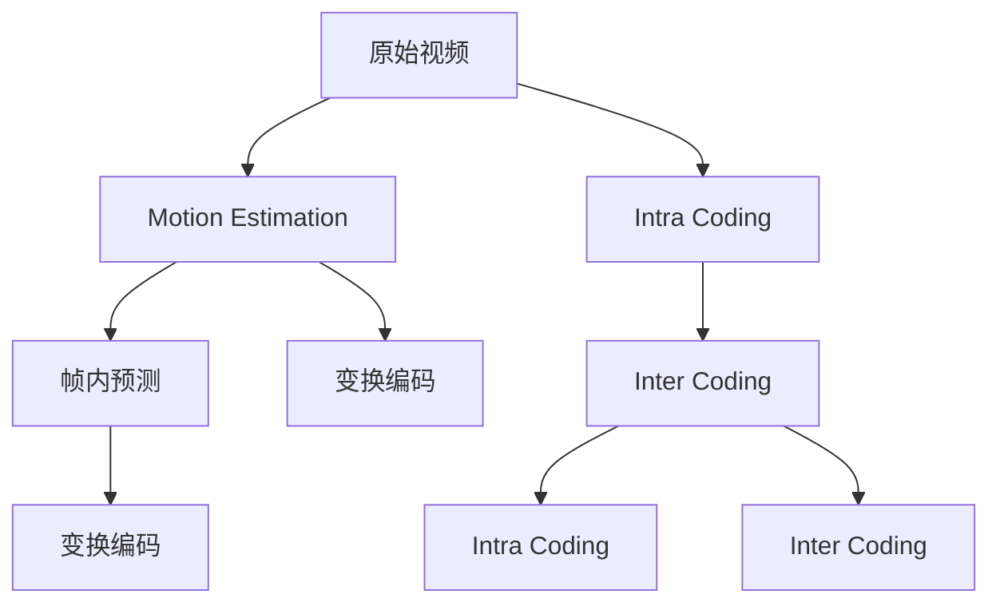

                 

# 视频编码和压缩：H.264 和 HEVC

## 1. 背景介绍

随着数字媒体技术的发展，视频数据的生成和传播变得越来越普遍。然而，视频数据的存储和传输需要占用大量的存储空间和带宽资源。为了有效降低视频数据的存储空间和传输带宽，视频压缩技术应运而生。H.264和HEVC是当前主流的两种视频压缩技术，它们的压缩性能、计算复杂度和应用场景各有特点，本文将详细探讨这两种压缩技术的原理和应用。

## 2. 核心概念与联系

### 2.1 核心概念概述

视频压缩技术是利用数学、统计和算法等方法，对原始视频数据进行编码，将视频数据压缩成更小的数据量，同时尽可能保留视频的原始质量。视频压缩技术主要包括运动估计、帧内预测、变换编码等环节。

- **运动估计**：利用相邻帧之间的像素运动信息，对视频数据进行压缩，减少冗余信息。
- **帧内预测**：对当前帧内进行预测，减少帧内数据的冗余。
- **变换编码**：将视频数据转换为频域信号，进行频域编码，进一步压缩视频数据。

H.264和HEVC都是基于运动估计、帧内预测和变换编码的压缩技术。它们的区别主要在于编码算法和压缩效率上。

### 2.2 核心概念原理和架构的 Mermaid 流程图



- A: 原始视频
- B: 运动估计
- C: 帧内预测
- D: 变换编码
- E: 变换编码
- F: 帧内编码
- G: 帧间编码
- H: 帧内编码
- I: 帧间编码

## 3. 核心算法原理 & 具体操作步骤

### 3.1 算法原理概述

H.264和HEVC都是基于帧间和帧内预测的视频压缩技术。它们的核心算法包括运动估计、帧内预测、变换编码、量化等。

#### 3.1.1 运动估计

运动估计是视频压缩中最重要的算法之一，它通过计算相邻帧之间的像素运动信息，预测当前帧的运动向量。运动估计的目的是将当前帧与参考帧进行匹配，找到最佳的运动向量，从而减少帧间冗余。

#### 3.1.2 帧内预测

帧内预测是用于压缩视频帧内数据的算法，它通过利用相邻像素的相关性，预测当前像素的值。帧内预测可以进一步减少帧内数据的冗余。

#### 3.1.3 变换编码

变换编码是将视频数据转换为频域信号，进行频域编码的算法。常见的变换编码包括离散余弦变换（DCT）和离散小波变换（DWT）。变换编码能够有效地压缩视频数据，但同时也增加了计算复杂度。

#### 3.1.4 量化

量化是压缩视频数据的重要算法之一，它通过将浮点数转换为整数，减少数据的位数。量化通常会在变换编码后进行，从而进一步压缩视频数据。

### 3.2 算法步骤详解

#### 3.2.1 H.264压缩流程

1. **帧内编码**：对当前帧进行帧内预测，得到预测块。对预测块进行DCT变换，并量化后进行熵编码。
2. **帧间编码**：对当前帧进行运动估计，得到运动向量。对当前帧的残差块进行DCT变换和量化，并熵编码。
3. **编码控制参数**：对编码控制参数进行熵编码，如帧类型、帧率、量化参数等。
4. **位流合成**：将各个部分进行组合，形成位流。

#### 3.2.2 HEVC压缩流程

1. **帧内编码**：对当前帧进行帧内预测，得到预测块。对预测块进行预测编码和变换编码，并量化后进行熵编码。
2. **帧间编码**：对当前帧进行运动估计，得到运动向量。对当前帧的残差块进行预测编码和变换编码，并量化后进行熵编码。
3. **编码控制参数**：对编码控制参数进行熵编码，如帧类型、帧率、量化参数等。
4. **位流合成**：将各个部分进行组合，形成位流。

### 3.3 算法优缺点

#### 3.3.1 H.264

- **优点**：H.264压缩率高，计算复杂度较低，压缩效果较好。
- **缺点**：对编码器要求较高，需要较高的计算资源和内存空间。

#### 3.3.2 HEVC

- **优点**：HEVC压缩率更高，支持多参考帧，适应性更强。
- **缺点**：计算复杂度较高，需要更多的计算资源和内存空间。

### 3.4 算法应用领域

H.264和HEVC被广泛应用于各种视频编码和传输场景，例如：

- **数字电视和有线电视**：H.264和HEVC被广泛用于数字电视和有线电视的传输。
- **视频会议和远程教育**：H.264和HEVC被用于视频会议和远程教育的实时视频传输。
- **移动设备和流媒体**：H.264和HEVC被用于移动设备和流媒体的压缩和传输。

## 4. 数学模型和公式 & 详细讲解 & 举例说明

### 4.1 数学模型构建

视频压缩的数学模型主要包括以下几个部分：

1. **运动估计模型**：用于计算运动向量，通常使用SAD（Sums of Absolute Differences）等指标进行优化。
2. **帧内预测模型**：用于预测当前帧的像素值，通常使用DCT、DWT等变换进行编码。
3. **量化模型**：用于将浮点数转换为整数，通常使用标量量化和矢量量化等方法。
4. **熵编码模型**：用于压缩位流，通常使用Huffman编码、算术编码等方法。

### 4.2 公式推导过程

#### 4.2.1 运动估计

假设当前帧为 $F_i$，参考帧为 $F_{i-1}$，运动向量为 $M_{ij}$，则运动估计的优化目标为：

$$
\min_{M_{ij}} \sum_{i,j} |F_{i,j} - F_{i-1, j-M_{ij}}|
$$

其中 $F_{i,j}$ 为当前帧的像素值，$F_{i-1, j-M_{ij}}$ 为参考帧中对应的像素值。

#### 4.2.2 帧内预测

假设当前帧的像素值为 $y_{i,j}$，预测像素值为 $\hat{y}_{i,j}$，则帧内预测的目标函数为：

$$
\min_{\hat{y}_{i,j}} \sum_{i,j} (y_{i,j} - \hat{y}_{i,j})^2
$$

其中 $y_{i,j}$ 为当前像素的真实值，$\hat{y}_{i,j}$ 为预测像素的值。

#### 4.2.3 变换编码

假设当前帧的残差块为 $R_{i,j}$，则变换编码的目标函数为：

$$
\min_{R_{i,j}} \sum_{i,j} |R_{i,j} - R'_{i,j}|^2
$$

其中 $R'_{i,j}$ 为变换后的系数，$R_{i,j}$ 为原始残差块。

#### 4.2.4 量化

假设当前像素的浮点数为 $x_{i,j}$，量化后的整数为 $q_{i,j}$，则量化的目标函数为：

$$
\min_{q_{i,j}} \sum_{i,j} (x_{i,j} - q_{i,j})^2
$$

其中 $x_{i,j}$ 为原始像素的浮点数，$q_{i,j}$ 为量化后的整数。

### 4.3 案例分析与讲解

#### 4.3.1 视频压缩实验

假设有一个分辨率为1920x1080的视频片段，使用H.264进行压缩。首先，将视频片段划分为若干个宏块（16x16像素块）。然后，对每个宏块进行帧内预测和变换编码，得到残差块。接着，对残差块进行量化和熵编码，得到压缩后的位流。

## 5. 项目实践：代码实例和详细解释说明

### 5.1 开发环境搭建

在进行视频压缩实验前，需要先搭建好开发环境。以下是使用FFmpeg搭建FFmpeg环境的步骤：

1. 下载FFmpeg源代码。
2. 解压源代码，进入目录。
3. 运行 `./configure` 命令进行编译配置。
4. 运行 `make` 命令进行编译。
5. 运行 `sudo make install` 命令安装FFmpeg。

### 5.2 源代码详细实现

以下是一个使用FFmpeg进行H.264压缩的Python代码示例：

```python
import subprocess

# 设置输入文件路径和输出文件路径
input_file = '/path/to/input.mp4'
output_file = '/path/to/output.h264'

# 设置FFmpeg命令行参数
command = ['ffmpeg', 
           '-i', input_file, 
           '-vcodec', 'libx264', 
           '-vf', 'vcodec=libx264,sws_scale=1:1,format=anm', 
           '-vf', 'h264omxh264=y=1,top=0,bottom=0', 
           '-pix_fmt', 'yuv420p', 
           '-crf', '23', 
           '-tune', 'zforced', 
           '-b:v', '2M', 
           '-c:a', 'libmp3lame', 
           '-b:a', '160k', 
           '-f', 'mp4', 
           output_file]

# 执行FFmpeg命令
subprocess.run(command)
```

### 5.3 代码解读与分析

**代码解读**：

- 首先，设置输入文件路径和输出文件路径。
- 然后，设置FFmpeg命令行参数，包括输入文件、视频编码器、视频过滤器、像素格式、视频质量控制、音频编码器、音频比特率、输出文件格式等。
- 最后，使用 `subprocess.run` 函数执行FFmpeg命令。

**代码分析**：

- 输入文件路径和输出文件路径需要根据实际情况进行修改。
- 视频编码器 `libx264` 表示使用H.264进行压缩。
- 视频过滤器 `vcodec=libx264,sws_scale=1:1,format=anm` 表示使用H.264编码，同时将帧率设置为25fps。
- 像素格式 `pix_fmt` 设置为 `yuv420p`，表示使用YUV 4:2:0格式。
- 视频质量控制 `crf` 设置为 `23`，表示使用可控的码率进行压缩。
- 音频编码器 `c:a` 设置为 `libmp3lame`，表示使用MP3进行音频编码。
- 音频比特率 `-b:a` 设置为 `160k`，表示音频的比特率为160k。
- 输出文件格式 `-f` 设置为 `mp4`，表示输出为MP4格式。

## 6. 实际应用场景

### 6.1 数字电视和有线电视

数字电视和有线电视领域对视频压缩的要求非常高，需要高效、低延迟的压缩算法。H.264和HEVC是当前最广泛使用的压缩算法。H.264在数字电视和有线电视中得到了广泛应用，而HEVC则逐步取代H.264成为新的主流标准。

### 6.2 视频会议和远程教育

视频会议和远程教育对视频压缩的实时性和质量都有较高要求。H.264和HEVC的实时性较好，适用于视频会议和远程教育的实时视频传输。

### 6.3 移动设备和流媒体

移动设备和流媒体对视频压缩的带宽和延迟有较高要求。H.264和HEVC能够满足这些要求，广泛用于移动设备和流媒体的压缩和传输。

## 7. 工具和资源推荐

### 7.1 学习资源推荐

- **《视频压缩技术》**：该书介绍了H.264和HEVC的原理和应用，适合初学者学习。
- **《视频压缩技术与标准》**：该书介绍了视频压缩标准的发展历程和应用场景，适合深入了解视频压缩技术。
- **《FFmpeg视频编码与压缩》**：该书介绍了FFmpeg的使用方法和视频编码原理，适合编程实践。

### 7.2 开发工具推荐

- **FFmpeg**：FFmpeg是一款开源的视频处理工具，支持多种视频编码格式和压缩算法。
- **X264**：X264是一个高性能的H.264视频编码器，适合进行大规模视频压缩。
- **OpenH264**：OpenH264是一个开源的H.264视频编解码器，适合进行实时视频压缩。

### 7.3 相关论文推荐

- **"Video Compression using H.264"**：该论文介绍了H.264的原理和压缩算法，适合深入了解H.264技术。
- **"HEVC for High-Quality Video Compression"**：该论文介绍了HEVC的原理和压缩算法，适合深入了解HEVC技术。
- **"Video Compression: A Survey"**：该论文介绍了多种视频压缩算法的原理和应用，适合了解视频压缩技术的发展历程。

## 8. 总结：未来发展趋势与挑战

### 8.1 研究成果总结

视频压缩技术是视频处理中的重要技术之一，H.264和HEVC是当前最主流的压缩算法。H.264和HEVC通过运动估计、帧内预测和变换编码等技术，实现了高效的视频压缩。H.264在计算复杂度和压缩效率上表现较好，适合在数字电视和有线电视领域应用；HEVC在压缩率上表现较好，适合在视频会议和远程教育领域应用。

### 8.2 未来发展趋势

未来，视频压缩技术将朝着以下方向发展：

1. **更高压缩率**：随着硬件计算能力的提升，未来将开发更加高效的压缩算法，实现更高的压缩率。
2. **更广应用场景**：视频压缩技术将逐步应用于更多的应用场景，如物联网、AR/VR等。
3. **更低延迟**：未来将开发低延迟的视频压缩算法，适应实时视频传输的需求。
4. **更高效编码**：未来将开发更加高效的编码算法，减少计算复杂度和内存消耗。
5. **更好质量控制**：未来将开发更精细的视频质量控制算法，实现更好的视频压缩效果。

### 8.3 面临的挑战

尽管H.264和HEVC取得了较好的压缩效果，但未来仍面临以下挑战：

1. **计算复杂度较高**：H.264和HEVC的计算复杂度较高，需要更多的计算资源和内存空间。
2. **延迟较高**：H.264和HEVC的压缩算法复杂度较高，压缩过程中需要较长的计算时间。
3. **多参考帧处理**：HEVC支持多参考帧，增加了计算复杂度和内存消耗。
4. **质量控制问题**：H.264和HEVC的压缩质量控制较难，容易导致质量波动。

### 8.4 研究展望

未来，视频压缩技术将在以下方向进行进一步的研究：

1. **改进压缩算法**：开发更加高效、低延迟的压缩算法，适应不同的应用场景。
2. **优化计算复杂度**：优化压缩算法的计算复杂度，减少计算资源和内存消耗。
3. **实现自适应编码**：开发自适应编码算法，根据视频质量需求进行动态调整。
4. **提高实时性**：开发实时性更好的压缩算法，适应实时视频传输的需求。
5. **增强鲁棒性**：增强压缩算法的鲁棒性，适应不同的编码环境和视频质量需求。

## 9. 附录：常见问题与解答

### Q1: 如何选择合适的视频压缩算法？

A: 选择视频压缩算法需要考虑以下几个因素：
1. **压缩率**：选择压缩率较高的算法，如HEVC。
2. **计算复杂度**：选择计算复杂度较低的算法，如H.264。
3. **实时性**：选择实时性较好的算法，如OpenH264。
4. **应用场景**：根据具体的应用场景选择合适的算法，如数字电视和有线电视适合使用H.264，视频会议和远程教育适合使用HEVC。

### Q2: 如何进行视频压缩质量控制？

A: 视频压缩质量控制通常需要考虑以下几个因素：
1. **码率控制**：控制码率，避免过度压缩导致质量下降。
2. **帧率控制**：控制帧率，避免过度压缩导致延迟增加。
3. **视频质量评估**：使用PSNR（峰值信噪比）和SSIM（结构相似性指标）等指标评估视频质量。
4. **参考帧选择**：选择适当的参考帧，进行多参考帧压缩，提高压缩效果。

### Q3: 如何进行视频编码和解码？

A: 视频编码和解码通常使用FFmpeg等工具进行。
1. **视频编码**：使用FFmpeg的`-vcodec`参数指定压缩算法，如`libx264`表示使用H.264压缩。
2. **视频解码**：使用FFmpeg的`-vcodec`参数指定压缩算法，如`libavcodec`表示使用H.264解码。
3. **音频编码**：使用FFmpeg的`-acodec`参数指定音频编码算法，如`libmp3lame`表示使用MP3编码。
4. **音频解码**：使用FFmpeg的`-acodec`参数指定音频解码算法，如`libmp3lame`表示使用MP3解码。

---

作者：禅与计算机程序设计艺术 / Zen and the Art of Computer Programming

