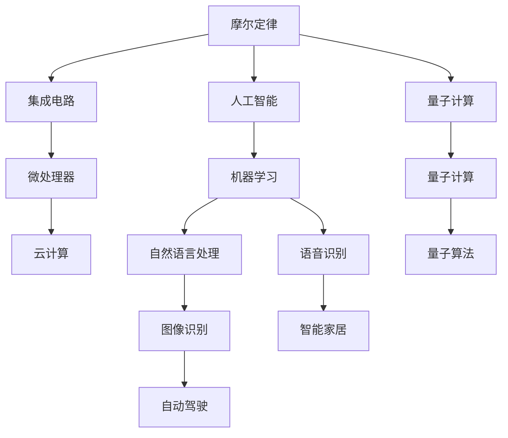

                 

## 1. 背景介绍

### 1.1 摩尔定律的历史渊源
1965年，仙童半导体公司的戈登·摩尔（Gordon Moore）提出了著名的“摩尔定律”：集成电路上可容纳的晶体管数量大约每两年会翻倍，同时，成本会减半。这一定律不仅描绘了半导体行业的发展蓝图，也成为了计算机发展的黄金准则，驱动了计算机科技的飞速进步。

### 1.2 摩尔定律的意义
摩尔定律不仅仅是关于晶体管数量的预言，更是关于创新、效率和规模的宣言。它揭示了技术的指数级增长潜力，支撑了几十年的计算机发展。从微处理器到服务器、从移动设备到数据中心，摩尔定律几乎渗透到计算机技术的每一个角落。

### 1.3 摩尔定律的演变
随着时间的推移，摩尔定律逐渐由原来的硬件性能预测转变为一种技术创新的象征。越来越多的创新，如云计算、人工智能、量子计算等，正在重新定义摩尔定律的含义。本文将探讨这些创新如何延续摩尔定律的精神，支撑未来的计算机发展。

## 2. 核心概念与联系

### 2.1 核心概念概述
- **摩尔定律（Moore's Law）**：描述半导体集成电路芯片上晶体管数量的增长趋势，每两年翻一番，同时成本减半。
- **集成电路（IC）**：将多个晶体管、电阻、电容等电子元件集成在一块半导体芯片上，实现复杂逻辑功能。
- **超大规模集成电路（VLSI）**：集成电路的一种，通常指集成度超过1000个晶体管/平方毫米的电路。
- **微处理器（CPU）**：作为计算机的核心部件，负责执行指令、处理数据。
- **云计算**：通过互联网提供计算资源和数据存储服务，使得用户可以按需获取计算能力。
- **人工智能（AI）**：利用计算机模拟人类智能行为，包括学习、推理、感知等能力。
- **量子计算**：利用量子力学原理进行计算，旨在解决传统计算机难以处理的问题。

### 2.2 核心概念的联系
摩尔定律是计算机发展的基石，推动了集成电路的进步，进而影响了CPU的性能提升和云计算的普及。随着AI和量子计算的兴起，摩尔定律的内涵也在不断扩展，涵盖了更广泛的技术创新。

这些核心概念之间的关系可以通过以下Mermaid流程图来展示：



这个流程图展示了摩尔定律如何通过集成电路和微处理器的演进，推动了云计算和人工智能的发展，进一步延伸到量子计算等前沿领域。

## 3. 核心算法原理 & 具体操作步骤
### 3.1 算法原理概述

摩尔定律的核心在于不断增加的集成电路复杂性，这得益于晶体管数量的指数级增长。晶体管数量的增加，不仅提高了计算能力，还带来了能效比和成本的显著提升。

**公式1：晶体管数量增长公式**

$$
n = n_0 \times 2^{t/T}
$$

其中，$n$ 为当前晶体管数量，$n_0$ 为初始晶体管数量，$t$ 为时间，$T$ 为每两年翻一番的时间间隔。

### 3.2 算法步骤详解

摩尔定律的实现步骤包括：

1. **技术创新**：推动晶体管制造技术的不断突破，如晶体管尺寸的缩小、新材料的应用等。
2. **生产规模**：随着晶体管数量的增加，生产规模也随之扩大，以降低单位成本。
3. **市场应用**：新技术的快速应用，推动计算机硬件和软件系统的广泛普及。

### 3.3 算法优缺点

摩尔定律的优点包括：

- **驱动技术进步**：推动了半导体和计算机硬件的快速发展。
- **提升计算效率**：晶体管数量的增加，显著提升了计算能力。
- **降低成本**：大规模生产降低了单位成本，使得计算机技术更加普及。

其缺点主要在于：

- **能源消耗**：晶体管数量的指数级增长，伴随着能耗的快速上升。
- **环境问题**：大规模生产带来的环境污染和资源消耗问题。
- **技术瓶颈**：当前技术已接近物理极限，未来晶体管尺寸进一步缩小的可能性有限。

### 3.4 算法应用领域

摩尔定律的应用领域包括：

- **微处理器**：推动了从早期的大型机到现代的多核CPU的发展。
- **数据中心**：支持了云计算和分布式计算的需求。
- **移动设备**：推动了智能手机、平板电脑等移动设备的普及。
- **物联网**：使得大量低功耗设备能够联网并实现数据交换。

## 4. 数学模型和公式 & 详细讲解  
### 4.1 数学模型构建

摩尔定律的数学模型构建如下：

**公式2：晶体管数量随时间变化的模型**

$$
n(t) = n_0 \times 2^{t/T}
$$

其中，$n(t)$ 为时间$t$时的晶体管数量，$n_0$ 为初始晶体管数量，$T$ 为每两年翻一番的时间间隔。

### 4.2 公式推导过程

摩尔定律的推导基于以下假设：

- 晶体管制造技术呈指数级进步。
- 每两年晶体管数量翻倍，成本减半。

根据这些假设，可以得到晶体管数量的增长公式。进一步推导，可以得到计算能力与时间的关系：

**公式3：计算能力与时间的关系**

$$
C(t) = C_0 \times 2^{t/T}
$$

其中，$C(t)$ 为时间$t$时的计算能力，$C_0$ 为初始计算能力。

### 4.3 案例分析与讲解

**案例分析：早期计算机与现代计算机**

1960年代，IBM的System/360系列计算机，每个晶体管能处理的指令数为每秒几千次。而到了2020年代，现代CPU的指令处理能力已经达到了每秒数万亿次。这种巨大的性能提升，正是摩尔定律驱动的结果。

## 5. 项目实践：代码实例和详细解释说明
### 5.1 开发环境搭建

在进行摩尔定律相关实践前，需要准备以下开发环境：

1. **编程语言**：Python。
2. **开发工具**：Jupyter Notebook、PyCharm等。
3. **数据集**：从摩尔定律的历史数据中获取晶体管数量和时间的数据集。

### 5.2 源代码详细实现

以下是一个Python代码示例，用于计算和可视化摩尔定律下晶体管数量的增长：

```python
import numpy as np
import matplotlib.pyplot as plt

# 初始晶体管数量和每两年翻一番的时间间隔
n_0 = 2000
T = 2

# 时间范围
t_min = 1960
t_max = 2020

# 计算时间间隔
dt = 5

# 计算每个时间点的晶体管数量
n_values = np.empty(((t_max - t_min) // dt + 1))
for i, t in enumerate(range(t_min, t_max, dt)):
    n_values[i] = n_0 * 2**(t / T)

# 绘制晶体管数量增长曲线
plt.plot(np.arange(t_min, t_max, dt), n_values)
plt.xlabel('Year')
plt.ylabel('Number of Transistors')
plt.title('Moore's Law: Transistor Growth Over Time')
plt.show()
```

### 5.3 代码解读与分析

该代码通过计算每个时间点的晶体管数量，绘制了摩尔定律下晶体管数量的增长曲线。通过这一曲线，可以直观地看到晶体管数量随时间的指数级增长。

## 6. 实际应用场景

### 6.1 数据中心和云计算

随着晶体管数量的增加，数据中心和云计算得到了极大的提升。数据中心服务器和云服务提供商可以提供更强大的计算能力和更灵活的资源分配，支持各类企业和个人的大规模数据处理和应用开发。

**案例分析：云计算的崛起**

亚马逊AWS、谷歌云和微软Azure等云服务提供商，通过不断扩展数据中心的规模，提供了强大的计算和存储资源。云计算的应用范围从传统的企业应用扩展到个人开发者、初创公司等，极大地推动了数字化转型。

### 6.2 移动设备和物联网

摩尔定律推动了移动设备的发展，使得智能手机、平板电脑等便携设备的功能越来越强大，普及度越来越高。物联网设备也在迅速增长，数量庞大的传感器和智能设备构成了新的计算生态。

**案例分析：智能手机的发展**

从早期的诺基亚到现代的苹果、三星，智能手机性能的提升，正是基于摩尔定律驱动的芯片技术进步。智能手机的应用场景从通讯工具扩展到社交、娱乐、教育等多个领域，改变了人们的生活方式。

### 6.3 人工智能和量子计算

人工智能和量子计算的发展，也依赖于摩尔定律提供的强大计算能力。AI算法和模型训练需要大量的计算资源，而量子计算的目标在于解决传统计算机难以处理的复杂问题。

**案例分析：AI模型的训练**

深度学习模型的训练过程，需要处理大规模的数据集和计算密集型的操作。云计算和GPU集群提供了足够的计算资源，使得AI模型的训练和部署变得更加高效。量子计算的发展，虽然处于早期阶段，但已经展示了处理某些特定问题的潜力。

## 7. 工具和资源推荐

### 7.1 学习资源推荐

1. **Coursera《计算机科学导论》**：由斯坦福大学提供的入门课程，涵盖计算机科学的多个方面，包括数据结构、算法、计算机体系结构等。
2. **Udacity《深度学习专业纳米学位》**：提供深度学习、机器学习和人工智能的实战课程，包括TensorFlow、PyTorch等工具的使用。
3. **Khan Academy《计算机科学》**：提供免费的计算机科学课程，覆盖编程、算法、数据结构等内容。
4. **edX《计算机科学导论》**：麻省理工学院提供的入门课程，适合初学者学习计算机科学的基础知识。

### 7.2 开发工具推荐

1. **Jupyter Notebook**：支持Python、R等多种语言，适用于数据科学和机器学习任务的开发。
2. **PyCharm**：Google开发的Python IDE，支持调试、测试、版本控制等功能。
3. **GitHub**：代码托管平台，提供版本控制和协作开发功能。
4. **AWS CLI**：用于管理AWS资源的命令行工具，便于部署和管理云服务。

### 7.3 相关论文推荐

1. **Moore's Law: An Experiment in History**：Gordon Moore的原始论文，介绍了摩尔定律的背景和预测。
2. **Quantum Computing Beyond the Classical: Quantum Machines for Parameterized Operations**：Google的研究论文，探讨了量子计算的潜力。
3. **The Scaling Impact of Machine Learning on Datacenter Performance**：Google的研究论文，分析了深度学习对数据中心性能的影响。

## 8. 总结：未来发展趋势与挑战

### 8.1 研究成果总结

摩尔定律驱动了计算机硬件和软件的快速发展，支撑了数十年的计算机发展。从早期的大型机到现代的多核CPU，再到云计算、AI和量子计算，摩尔定律的内涵不断扩展，推动了技术创新的边界。

### 8.2 未来发展趋势

1. **持续的技术创新**：量子计算、光子计算等新技术将进一步扩展摩尔定律的内涵，解决传统计算难以处理的问题。
2. **大规模集成**：随着芯片技术的发展，未来的超级计算机将实现更多的集成和定制化。
3. **跨学科融合**：计算机科学与生物医学、环境科学等领域的交叉融合，将推动新技术的发展。

### 8.3 面临的挑战

1. **能源消耗**：计算能力的提升伴随着能耗的增加，未来的节能技术需要进一步发展。
2. **环境问题**：大规模生产带来的环境污染和资源消耗问题，需要得到有效解决。
3. **技术瓶颈**：当前技术已接近物理极限，未来技术的突破需要更多的创新和探索。

### 8.4 研究展望

未来的研究将集中在以下几个方向：

1. **量子计算**：探索量子算法的实际应用，解决传统计算机难以处理的问题。
2. **光子计算**：利用光子进行计算，提升计算速度和能效比。
3. **神经形态计算**：模仿人脑的结构和功能，实现更加高效和灵活的计算方式。
4. **分子计算**：利用分子的物理特性进行计算，探索新的计算模式。

总之，未来的计算机技术将继续遵循摩尔定律的精神，推动技术创新的不断进步，解决当前和未来的计算问题。

## 9. 附录：常见问题与解答

**Q1：摩尔定律是否已经失效？**

A: 虽然当前的晶体管制造技术接近物理极限，但摩尔定律的精神依然存在。新技术的发展，如量子计算、光子计算等，将为未来计算能力的提升提供新的途径。

**Q2：摩尔定律的能源消耗问题如何解决？**

A: 未来的能源技术，如太阳能、核聚变等，有望提供更清洁、更高效的能源。同时，数据中心和计算设备的能效比也需要不断提升，以降低整体的能源消耗。

**Q3：量子计算和传统计算有何不同？**

A: 量子计算利用量子位进行计算，可以在某些特定问题上实现指数级加速。与传统计算相比，量子计算的实现和算法设计更为复杂，但具有解决某些复杂问题的潜力。

**Q4：云计算对未来计算有哪些影响？**

A: 云计算使得计算资源更加灵活和可扩展，支持更多样的应用场景。未来，云计算将继续扩展到边缘计算、雾计算等新兴领域，提升计算的实时性和响应速度。

**Q5：人工智能和量子计算的未来发展趋势是什么？**

A: 人工智能将在更多的领域得到应用，推动智能自动化和智能交互的发展。量子计算在解决某些特定问题上具有巨大潜力，但目前还处于早期阶段，未来的发展需要更多的技术突破和实际应用。

---

作者：禅与计算机程序设计艺术 / Zen and the Art of Computer Programming

