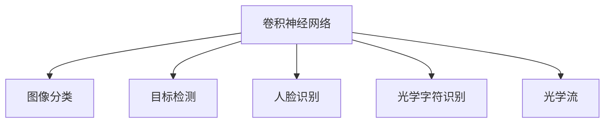

                 

# 计算机视觉(Computer Vision) - 原理与代码实例讲解

> 关键词：计算机视觉,深度学习,卷积神经网络,图像识别,目标检测,人脸识别,光学字符识别

## 1. 背景介绍

### 1.1 问题由来
计算机视觉（Computer Vision, CV）是人工智能领域的一个重要分支，致力于使计算机能够像人类一样“看”和“理解”世界。通过CV技术，计算机可以识别和理解图像中的对象、场景和动作，广泛应用于自动驾驶、医学影像分析、视频监控、工业质检等领域。近年来，深度学习技术的发展极大地推动了CV领域的发展，使其成为一个备受关注的研究方向。

### 1.2 问题核心关键点
计算机视觉的核心在于让计算机从原始图像数据中提取出有意义的特征信息，并将这些信息与预定义的类别进行匹配。这一过程通常包括以下几个关键步骤：
1. **特征提取**：通过卷积神经网络（Convolutional Neural Networks, CNNs）等深度学习模型，从图像中提取高层次的特征表示。
2. **分类/检测**：利用分类器或检测器，将提取的特征映射到具体的类别或边界框上。
3. **训练与验证**：在大型标注数据集上训练模型，并在验证集上评估性能，以确保模型具有泛化能力。

### 1.3 问题研究意义
计算机视觉技术的进步不仅有助于解决各种实际问题，还为更多领域带来了新的技术可能性。例如，自动驾驶需要计算机视觉来实现道路检测、目标跟踪等任务；医学影像分析则可以通过CV技术提高诊断准确性；视频监控系统可以通过实时图像识别技术提高安全性和效率。

## 2. 核心概念与联系

### 2.1 核心概念概述

为更好地理解计算机视觉的核心原理和应用，本节将介绍几个密切相关的核心概念：

- **卷积神经网络（CNN）**：一种广泛应用于图像处理的深度学习模型，通过卷积、池化等操作提取特征，适用于图像分类、目标检测等任务。
- **图像分类**：将输入图像分为预定义的多个类别之一的任务。
- **目标检测**：识别图像中的对象，并标注出其边界框的位置。
- **人脸识别**：利用人脸特征进行身份验证和识别。
- **光学字符识别（OCR）**：将图像中的文字转换为可编辑和搜索的文本。
- **光学流（Optical Flow）**：描述图像序列中相邻帧之间像素的运动方向和速度。

这些概念之间的逻辑关系可以通过以下Mermaid流程图来展示：



这个流程图展示了几类典型的计算机视觉任务：

1. 卷积神经网络(CNN)是图像处理的基础，能够提取图像特征。
2. 图像分类任务利用CNN的特征提取能力，将图像分为不同类别。
3. 目标检测任务在CNN基础上进一步处理，识别并标注对象边界。
4. 人脸识别和光学字符识别是图像分类的特定应用场景。
5. 光学流是视频处理的基础，用于动态场景的建模。

## 3. 核心算法原理 & 具体操作步骤
### 3.1 算法原理概述

计算机视觉的核心算法是基于深度学习的卷积神经网络（CNNs）。CNNs通过多个卷积层和池化层提取图像特征，再通过全连接层进行分类或回归等任务。其核心原理包括：

- **卷积操作**：通过滑动卷积核在图像上计算特征响应，提取局部特征。
- **池化操作**：通过降采样操作减小特征图的尺寸，减少计算量和参数数量。
- **非线性激活函数**：通过ReLU等激活函数引入非线性，提高模型表达能力。
- **全连接层**：将卷积层的特征映射到特定任务上，如分类或回归。

卷积神经网络的架构通常由以下几个部分组成：
1. **输入层**：原始图像数据。
2. **卷积层**：提取图像特征。
3. **池化层**：减小特征图尺寸。
4. **全连接层**：将特征映射到输出类别。

### 3.2 算法步骤详解

以下是卷积神经网络进行图像分类的具体操作步骤：

**Step 1: 数据准备**
- 收集标注数据集，如CIFAR-10、ImageNet等，包含大量带标注的图像样本。
- 将图像数据进行预处理，如归一化、扩增等。

**Step 2: 搭建模型架构**
- 设计卷积神经网络的层次结构，通常包括卷积层、池化层、全连接层等。
- 选择合适的激活函数和损失函数，如ReLU、交叉熵损失。

**Step 3: 模型训练**
- 使用反向传播算法，根据损失函数计算梯度。
- 使用优化器（如SGD、Adam）更新模型参数。
- 在验证集上评估模型性能，防止过拟合。

**Step 4: 模型评估**
- 在测试集上评估模型性能，对比训练前后的精度提升。
- 使用混淆矩阵、ROC曲线等工具进行可视化分析。

**Step 5: 部署应用**
- 将训练好的模型部署到实际应用系统中。
- 实时接收图像数据，进行分类或检测。

### 3.3 算法优缺点

卷积神经网络在计算机视觉中的应用具有以下优点：
1. 高效性：通过卷积和池化操作，减少计算量和参数数量。
2. 泛化能力：大量的训练数据和复杂的网络结构，提高了模型的泛化能力。
3. 可解释性：卷积层的特征可以直观地解释，便于理解模型的工作原理。

同时，卷积神经网络也存在一些局限性：
1. 过拟合风险：复杂的网络结构容易导致过拟合，需要采用正则化等方法缓解。
2. 参数量巨大：大规模网络需要大量计算资源和存储空间。
3. 计算密集：卷积和池化操作计算复杂，难以在移动设备上部署。

尽管存在这些局限性，但CNNs在图像分类、目标检测、人脸识别等领域仍具有无可替代的地位，是当前计算机视觉的主流技术。

### 3.4 算法应用领域

计算机视觉技术已经在多个领域得到了广泛应用，以下是几个典型应用场景：

- **自动驾驶**：通过计算机视觉技术实现道路检测、车辆识别、交通标志识别等，辅助自动驾驶系统决策。
- **医学影像分析**：用于疾病诊断、病理分析、手术导航等，提高医学诊断的准确性和效率。
- **视频监控**：实时检测异常行为、识别人脸，提升视频监控系统的安全性和效率。
- **工业质检**：对产品进行自动检测和分类，提高生产效率和产品质量。
- **智慧零售**：通过图像识别技术，实现商品识别、库存管理、客户行为分析等。

此外，计算机视觉技术还在智慧城市、智能家居、社交媒体等众多领域得到了应用，为各行各业带来了新的发展机遇。

## 4. 数学模型和公式 & 详细讲解  
### 4.1 数学模型构建

本节将使用数学语言对卷积神经网络的图像分类过程进行更加严格的刻画。

记输入图像数据为 $x \in \mathbb{R}^{n}$，其中 $n$ 为像素总数。假设卷积神经网络包含 $L$ 个卷积层，每个卷积层的输出分别为 $f_1(x), f_2(x), ..., f_L(x)$。最终输出层为全连接层，其输出为 $y \in \mathbb{R}^C$，其中 $C$ 为类别数。

定义模型在输入 $x$ 上的损失函数为 $\ell(f(x), y)$，则在数据集 $D$ 上的经验风险为：

$$
\mathcal{L}(x) = \frac{1}{N}\sum_{i=1}^N \ell(f(x_i), y_i)
$$

其中 $\ell$ 为交叉熵损失函数，定义为：

$$
\ell(f(x), y) = -\frac{1}{N}\sum_{i=1}^N [y_i \log f(x_i) + (1-y_i) \log(1-f(x_i))]
$$

通过梯度下降等优化算法，模型不断更新参数以最小化损失函数，直至收敛。

### 4.2 公式推导过程

以下我们以二分类任务为例，推导交叉熵损失函数及其梯度的计算公式。

假设模型 $f(x)$ 在输入 $x$ 上的输出为 $\hat{y}=M_{\theta}(x) \in [0,1]$，表示样本属于正类的概率。真实标签 $y \in \{0,1\}$。则二分类交叉熵损失函数定义为：

$$
\ell(f(x), y) = -[y\log \hat{y} + (1-y)\log (1-\hat{y})]
$$

将其代入经验风险公式，得：

$$
\mathcal{L}(x) = -\frac{1}{N}\sum_{i=1}^N [y_i\log f(x_i)+(1-y_i)\log(1-f(x_i))]
$$

通过链式法则，损失函数对参数 $\theta$ 的梯度为：

$$
\frac{\partial \mathcal{L}(x)}{\partial \theta} = -\frac{1}{N}\sum_{i=1}^N (\frac{y_i}{f(x_i)}-\frac{1-y_i}{1-f(x_i)}) \frac{\partial f(x_i)}{\partial \theta}
$$

其中 $\frac{\partial f(x_i)}{\partial \theta}$ 可进一步递归展开，利用自动微分技术完成计算。

在得到损失函数的梯度后，即可带入优化算法更新模型参数。重复上述过程直至收敛，最终得到适应图像分类任务的最优模型参数 $\theta^*$。

## 5. 项目实践：代码实例和详细解释说明
### 5.1 开发环境搭建

在进行计算机视觉项目开发前，我们需要准备好开发环境。以下是使用Python进行TensorFlow开发的环境配置流程：

1. 安装Anaconda：从官网下载并安装Anaconda，用于创建独立的Python环境。

2. 创建并激活虚拟环境：
```bash
conda create -n tf-env python=3.8 
conda activate tf-env
```

3. 安装TensorFlow：根据CUDA版本，从官网获取对应的安装命令。例如：
```bash
conda install tensorflow-gpu==2.4.1 -c pytorch -c conda-forge
```

4. 安装相关库：
```bash
pip install numpy pandas scikit-image scikit-learn matplotlib tqdm jupyter notebook ipython
```

完成上述步骤后，即可在`tf-env`环境中开始计算机视觉项目开发。

### 5.2 源代码详细实现

下面我们以图像分类任务为例，给出使用TensorFlow和Keras进行卷积神经网络构建和训练的代码实现。

```python
import tensorflow as tf
from tensorflow.keras import layers
from tensorflow.keras.datasets import cifar10
from tensorflow.keras.utils import to_categorical

# 加载数据集
(train_images, train_labels), (test_images, test_labels) = cifar10.load_data()

# 数据预处理
train_images = train_images / 255.0
test_images = test_images / 255.0
train_labels = to_categorical(train_labels)
test_labels = to_categorical(test_labels)

# 定义模型架构
model = tf.keras.Sequential([
    layers.Conv2D(32, (3, 3), activation='relu', input_shape=(32, 32, 3)),
    layers.MaxPooling2D((2, 2)),
    layers.Conv2D(64, (3, 3), activation='relu'),
    layers.MaxPooling2D((2, 2)),
    layers.Conv2D(128, (3, 3), activation='relu'),
    layers.MaxPooling2D((2, 2)),
    layers.Flatten(),
    layers.Dense(64, activation='relu'),
    layers.Dense(10, activation='softmax')
])

# 编译模型
model.compile(optimizer='adam', loss='categorical_crossentropy', metrics=['accuracy'])

# 训练模型
history = model.fit(train_images, train_labels, epochs=10, validation_data=(test_images, test_labels))
```

以上代码实现了使用TensorFlow和Keras搭建卷积神经网络模型，并在CIFAR-10数据集上进行训练。

### 5.3 代码解读与分析

让我们再详细解读一下关键代码的实现细节：

**数据预处理**：
- 将图像数据归一化到[0,1]之间，以便于模型训练。
- 使用`to_categorical`将标签转换为独热编码。

**模型定义**：
- 使用`Sequential`模型定义顺序层。
- 添加卷积层、池化层和全连接层，激活函数为ReLU和Softmax。
- 定义损失函数为交叉熵损失，优化器为Adam。

**模型训练**：
- 使用`fit`方法进行模型训练，设置训练轮数为10。
- 在每个epoch结束时，自动在验证集上评估模型性能。

**输出分析**：
- `model.evaluate(test_images, test_labels)`输出测试集上的准确率和损失。

可以看到，TensorFlow和Keras提供了强大的API支持，使得模型的构建和训练变得简洁高效。开发者可以将更多精力放在模型设计、数据处理等高层逻辑上，而不必过多关注底层的实现细节。

当然，工业级的系统实现还需考虑更多因素，如模型的保存和部署、超参数的自动搜索、更灵活的任务适配层等。但核心的卷积神经网络构建和训练流程基本与此类似。

## 6. 实际应用场景
### 6.1 智能安防

计算机视觉技术在智能安防领域得到了广泛应用，主要用于实时视频监控和人脸识别。通过在监控系统中集成计算机视觉算法，可以实现自动检测异常行为、识别身份信息等，提升安全性和效率。

例如，在视频监控系统中，可以实时分析监控录像，检测出入侵、异常物体等行为，并及时发出警报。人脸识别技术则可以在进出办公区、交通工具等场合进行身份验证，确保场所的安全性。

### 6.2 医学影像分析

医学影像分析是计算机视觉在医疗领域的重要应用，用于疾病的早期筛查和诊断。通过卷积神经网络，可以从医学影像中提取高层次的特征，识别病变区域，并辅助医生进行诊断和治疗。

例如，在肺结节检测任务中，可以利用卷积神经网络对肺部CT图像进行自动分析和标注，快速发现可疑病灶，提高早期筛查的效率。在病理切片分析中，计算机视觉技术可以对细胞和组织切片进行图像分割和分类，辅助病理医生进行诊断。

### 6.3 自动驾驶

自动驾驶是计算机视觉技术的重要应用之一，通过实时感知和理解周围环境，实现车辆的自主导航和避障。计算机视觉技术在自动驾驶中主要应用于以下场景：

- **道路检测**：通过识别车道线、交通标志等，帮助车辆在复杂道路环境中稳定行驶。
- **目标检测**：识别行人、车辆、交通信号灯等，提供导航和避障信息。
- **行为识别**：通过分析车辆行为和动作，预测和避免潜在风险。

### 6.4 智慧零售

计算机视觉技术在智慧零售领域的应用主要包括商品识别、库存管理和客户行为分析。通过计算机视觉技术，可以实现自动化的商品管理和客户服务，提升零售业的效率和用户体验。

例如，在商品识别任务中，可以利用计算机视觉技术对货架上的商品进行自动标注和识别，实时更新库存信息。在客户行为分析中，可以通过分析客户在店内的行为轨迹和停留时间，提供个性化推荐和营销策略，提高客户满意度和销售额。

### 6.5 未来应用展望

随着计算机视觉技术的不断进步，其在各个领域的应用前景将更加广阔：

- **增强现实（AR）和虚拟现实（VR）**：通过计算机视觉技术，实现对现实世界的增强和虚拟场景的构建，为AR/VR应用提供基础。
- **智能家居**：利用计算机视觉技术，实现智能设备和环境的感知和控制，提高家居生活的智能化和便捷性。
- **自动驾驶**：随着计算机视觉技术的不断完善，自动驾驶车辆将具备更强的感知和决策能力，推动无人驾驶技术的发展。
- **工业质检**：在制造业中，计算机视觉技术可以实现对产品质量的实时检测和分类，提高生产效率和产品质量。

## 7. 工具和资源推荐
### 7.1 学习资源推荐

为了帮助开发者系统掌握计算机视觉的理论基础和实践技巧，这里推荐一些优质的学习资源：

1. 《深度学习》系列博文：由大模型技术专家撰写，深入浅出地介绍了深度学习原理、计算机视觉应用等前沿话题。

2. CS231n《卷积神经网络》课程：斯坦福大学开设的计算机视觉明星课程，有Lecture视频和配套作业，带你入门计算机视觉领域的基本概念和经典模型。

3. 《计算机视觉：算法与应用》书籍：详细介绍了计算机视觉的理论基础和实际应用，包括图像处理、目标检测、人脸识别等。

4. OpenCV官方文档：OpenCV开源计算机视觉库的官方文档，提供了丰富的代码示例和功能说明，是实践计算机视觉算法的必备工具。

5. CVPR和ICCV论文集：计算机视觉领域的两大顶级会议，收录了大量的前沿研究成果，是了解最新研究动态的绝佳资源。

通过对这些资源的学习实践，相信你一定能够快速掌握计算机视觉的精髓，并用于解决实际的图像处理问题。

### 7.2 开发工具推荐

高效的开发离不开优秀的工具支持。以下是几款用于计算机视觉开发的常用工具：

1. OpenCV：开源计算机视觉库，提供了丰富的图像处理和特征提取函数，支持多种平台和语言。

2. TensorFlow：谷歌主导开发的深度学习框架，提供了丰富的卷积神经网络实现，适合大规模工程应用。

3. PyTorch：Facebook开发的深度学习框架，支持动态计算图，适合快速迭代研究。

4. Keras：高层API封装深度学习框架，易于使用，适合初学者快速上手。

5. ImageNet：大规模图像数据集，用于预训练卷积神经网络，提供标注数据和验证集。

6. Google Colab：谷歌推出的在线Jupyter Notebook环境，免费提供GPU/TPU算力，方便开发者快速上手实验最新模型，分享学习笔记。

合理利用这些工具，可以显著提升计算机视觉项目的开发效率，加快创新迭代的步伐。

### 7.3 相关论文推荐

计算机视觉技术的发展源于学界的持续研究。以下是几篇奠基性的相关论文，推荐阅读：

1. AlexNet: ImageNet Classification with Deep Convolutional Neural Networks：提出了深度卷积神经网络AlexNet，在ImageNet图像分类任务上取得了优异的表现，开启了深度学习在计算机视觉中的应用。

2. VGGNet: Very Deep Convolutional Networks for Large-Scale Image Recognition：提出VGG网络架构，显著提升了图像分类任务的精度，成为深度学习研究的重要基础。

3. GoogLeNet: Going Deeper with Convolutions：提出Inception网络，实现了在较浅的网络结构下，保持较高的分类精度，成为计算机视觉领域的重要里程碑。

4. ResNet: Deep Residual Learning for Image Recognition：提出残差网络，解决了深度神经网络中的梯度消失问题，显著提升了网络的训练深度和性能。

5. R-CNN: Rich Feature Hierarchies for Accurate Object Detection and Semantic Segmentation：提出R-CNN目标检测框架，开启了计算机视觉中的目标检测研究。

6. Faster R-CNN: Towards Real-Time Object Detection with Region Proposal Networks：提出Faster R-CNN框架，显著提高了目标检测的速度和准确性，成为计算机视觉中的主流方法。

这些论文代表了大规模卷积神经网络在计算机视觉中的应用和发展，为后续的研究提供了重要的理论和技术基础。

## 8. 总结：未来发展趋势与挑战

### 8.1 总结

本文对卷积神经网络在计算机视觉中的应用进行了全面系统的介绍。首先阐述了计算机视觉的核心原理和应用场景，明确了卷积神经网络在大规模图像处理任务中的核心地位。其次，从原理到实践，详细讲解了卷积神经网络的构建和训练过程，给出了计算机视觉项目开发的完整代码实例。同时，本文还广泛探讨了卷积神经网络在自动驾驶、医学影像分析、智慧零售等多个领域的应用前景，展示了其在实际应用中的巨大潜力。

通过本文的系统梳理，可以看到，卷积神经网络作为计算机视觉的主流技术，极大地推动了图像处理和识别任务的进展，为各个行业带来了深远的影响。未来，伴随计算机视觉技术的不断演进，其在更多领域的应用前景将更加广阔。

### 8.2 未来发展趋势

展望未来，计算机视觉技术将呈现以下几个发展趋势：

1. **大规模预训练**：随着计算资源的增加和算法的改进，大规模预训练模型的训练和应用将越来越广泛，为计算机视觉任务提供更强大的数据和特征支持。

2. **多模态融合**：计算机视觉技术将与语音、文本、传感器数据等多模态信息进行融合，提升对复杂场景的理解和分析能力。

3. **实时性和高效性**：随着硬件技术的进步，实时性和计算效率将成为计算机视觉应用的重要目标，如在自动驾驶、智能安防等领域。

4. **跨领域应用**：计算机视觉技术将拓展到更多领域，如医疗、零售、娱乐等，提升这些领域的智能化水平。

5. **自监督学习和迁移学习**：通过自监督学习和迁移学习，计算机视觉模型能够从少量标注数据和跨领域数据中学习和提升，降低训练成本，提高泛化能力。

6. **端到端训练**：端到端训练方法将提高模型从数据到输出的整体性能，提升模型训练的效率和精度。

这些趋势凸显了计算机视觉技术的广阔前景。这些方向的探索发展，必将进一步提升计算机视觉系统的性能和应用范围，为各行各业带来新的技术可能性。

### 8.3 面临的挑战

尽管计算机视觉技术已经取得了瞩目成就，但在迈向更加智能化、普适化应用的过程中，仍面临诸多挑战：

1. **数据依赖**：计算机视觉模型对高质量标注数据的需求较高，大规模数据集的获取和标注成本较高，限制了模型的泛化能力。

2. **计算资源**：大规模卷积神经网络的训练和推理需要大量的计算资源和存储空间，限制了模型在移动设备和嵌入式设备上的应用。

3. **可解释性**：计算机视觉模型通常缺乏可解释性，难以解释其内部工作机制和决策逻辑，给实际应用带来了挑战。

4. **鲁棒性**：模型对噪声、遮挡、光照等变化较为敏感，鲁棒性有待进一步提升。

5. **跨领域泛化**：模型在不同领域和数据分布上的泛化能力有限，需要更多的跨领域迁移学习研究。

6. **安全性**：模型可能会学习到有害信息，如偏见、歧视等，对模型进行伦理和安全性审查成为必要。

正视计算机视觉面临的这些挑战，积极应对并寻求突破，将是大规模卷积神经网络迈向成熟的必由之路。相信随着学界和产业界的共同努力，这些挑战终将一一被克服，计算机视觉技术必将在构建智能视觉系统中发挥更大的作用。

### 8.4 研究展望

面对计算机视觉面临的挑战，未来的研究需要在以下几个方面寻求新的突破：

1. **无监督学习和自监督学习**：通过无监督学习和自监督学习，利用数据分布和结构信息，实现更高效、更泛化的模型训练。

2. **跨模态学习**：将计算机视觉技术与语音、文本、传感器数据等进行融合，提升对复杂场景的理解和分析能力。

3. **实时性和计算效率**：通过硬件加速、模型压缩、知识蒸馏等方法，提高计算机视觉系统的实时性和计算效率。

4. **可解释性和透明度**：引入可解释性和透明度技术，如可视化、特征分析、因果推断等，增强计算机视觉模型的可解释性。

5. **鲁棒性和泛化能力**：通过鲁棒性优化、跨领域迁移学习等方法，提升模型的鲁棒性和泛化能力。

6. **安全性**：引入伦理和安全性约束，建立模型训练和部署的伦理审查机制，确保模型的安全性。

这些研究方向将推动计算机视觉技术的不断进步，为构建智能视觉系统提供新的技术手段和应用范式。面向未来，计算机视觉技术需要与更多学科进行交叉融合，共同推动人工智能技术的全面发展。

## 9. 附录：常见问题与解答

**Q1：计算机视觉任务中常用的数据增强技术有哪些？**

A: 计算机视觉任务中常用的数据增强技术包括：
1. **随机裁剪**：在图像上随机裁剪出不同大小的子图，增加数据多样性。
2. **水平翻转**：将图像沿水平方向翻转，增加样本数量。
3. **随机旋转**：将图像随机旋转一定角度，增加样本数量。
4. **颜色变换**：对图像进行颜色变化，如亮度、对比度、饱和度等，增加数据多样性。
5. **噪声添加**：在图像中添加随机噪声，模拟实际环境中的噪声。

这些技术可以有效地扩充训练集，减少过拟合，提高模型泛化能力。

**Q2：如何选择合适的卷积神经网络结构？**

A: 选择合适的卷积神经网络结构需要考虑以下几个因素：
1. **数据复杂度**：根据数据集的复杂度选择合适的网络深度和宽度。
2. **计算资源**：考虑可用计算资源，选择合适的网络结构。
3. **任务需求**：根据任务需求选择合适的特征提取和分类器。
4. **已有研究**：参考已有的研究文献，选择适合的任务模型。

常用的卷积神经网络结构包括AlexNet、VGGNet、ResNet、Inception等，需要根据具体任务选择合适的模型架构。

**Q3：计算机视觉任务中的迁移学习有哪些常见方法？**

A: 计算机视觉任务中的迁移学习常见方法包括：
1. **微调**：在预训练模型基础上，微调部分或全部层，适应新任务。
2. **迁移学习**：利用已有模型的特征提取能力，在新任务上微调分类器。
3. **知识蒸馏**：通过教师模型向学生模型转移知识，提高学生模型的性能。
4. **多任务学习**：在多个任务上同时训练模型，提高模型的泛化能力。

这些方法可以通过减少训练时间、提高泛化能力等方式提升计算机视觉任务的性能。

**Q4：卷积神经网络的反向传播算法中，梯度消失和梯度爆炸问题如何解决？**

A: 卷积神经网络的反向传播算法中，梯度消失和梯度爆炸问题可以通过以下方法解决：
1. **梯度裁剪**：对梯度进行裁剪，限制梯度的大小，避免梯度爆炸。
2. **权重初始化**：选择合适的权重初始化方法，如Xavier、He等，减小梯度消失风险。
3. **批标准化**：在网络中间层引入批标准化，提高网络稳定性。
4. **残差连接**：在网络中加入残差连接，减少梯度消失风险。

这些方法可以有效地缓解梯度消失和梯度爆炸问题，提高卷积神经网络的训练效果。

**Q5：计算机视觉任务中的数据集应该如何选择和构建？**

A: 计算机视觉任务中的数据集选择和构建需要考虑以下几个因素：
1. **数据多样性**：选择多样性的数据集，包含各种场景和类别。
2. **标注质量**：选择标注质量高的数据集，避免因标注错误导致的模型性能下降。
3. **数据规模**：选择足够大的数据集，避免过拟合。
4. **数据分布**：选择与实际应用场景相匹配的数据集，提高模型的泛化能力。

常用的计算机视觉数据集包括CIFAR-10、ImageNet、PASCAL VOC等，需要根据具体任务选择合适的数据集。

综上所述，计算机视觉技术的不断进步将推动其在各个领域的应用，为人工智能技术的全面发展提供重要支持。面向未来，计算机视觉技术需要在数据、模型、算法等方面进行深入研究，推动技术的进一步发展。

---

作者：禅与计算机程序设计艺术 / Zen and the Art of Computer Programming

