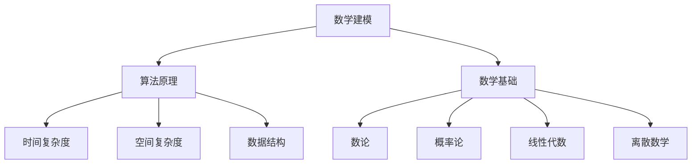

                 

# 计算：第二部分 计算的数学基础 第 4 章 数学的基础

> 关键词：计算数学基础, 数学建模, 算法原理, 具体步骤, 应用领域

## 1. 背景介绍

### 1.1 问题由来

计算数学是计算机科学和数学交叉的产物，其目的是将数学问题转化为计算问题，并借助计算机求解。计算数学包括算法设计与分析、数据结构、离散数学、数值分析等多个领域。

在现代信息技术飞速发展的背景下，计算数学的重要性愈发突出。算法成为推动技术进步和产业变革的核心动力，其背后隐含的数学原理是解决实际问题的基石。因此，深入理解计算数学的数学基础，对从事计算科学、计算机科学和工程等领域的人士来说至关重要。

### 1.2 问题核心关键点

计算数学的核心关键点在于其数学基础的构建。从某种意义上说，计算数学的发展历程也是数学思想在计算问题上的体现和实践。通过理解计算数学的数学基础，我们可以更深入地理解计算算法的设计原理和应用范围。

## 2. 核心概念与联系

### 2.1 核心概念概述

为更好地理解计算数学的数学基础，本节将介绍几个密切相关的核心概念：

- 数学建模：将现实世界的复杂问题转化为数学模型，并使用数学理论进行分析和求解。
- 算法原理：指算法背后的数学原理，包括时间复杂度分析、空间复杂度分析、数据结构等。
- 数学基础：计算数学的数学基础包括数论、概率论、线性代数、离散数学等，是构建算法的基础。

这些核心概念之间紧密相连，共同构成了计算数学的理论体系和应用框架。

### 2.2 核心概念原理和架构的 Mermaid 流程图



这个流程图展示了计算数学的核心概念及其之间的联系：

1. 数学建模：构建数学模型，抽象出问题的数学表达。
2. 算法原理：基于数学模型设计算法，并分析算法的时间复杂度和空间复杂度。
3. 数学基础：数论、概率论、线性代数、离散数学等数学工具，是构建算法的基础。

这些核心概念共同构成了计算数学的理论基础，支撑着算法的设计和分析。

## 3. 核心算法原理 & 具体操作步骤

### 3.1 算法原理概述

计算数学的算法原理涉及数学模型和数学基础。通过数学建模将现实问题抽象为数学问题，再借助数学工具进行求解。

以计算几何为例，假设问题为求平面上两点的距离，可建立数学模型如下：

$$
d = \sqrt{(x_1-x_2)^2 + (y_1-y_2)^2}
$$

其中 $(x_1, y_1)$ 和 $(x_2, y_2)$ 是两点的坐标。该模型即为欧几里得几何中的距离公式。

### 3.2 算法步骤详解

计算几何的具体计算步骤包括：

1. 定义输入：输入两点坐标。
2. 数学建模：建立距离公式的数学模型。
3. 求解计算：将两点坐标代入公式计算距离。

具体实现步骤如下：

```python
def distance(x1, y1, x2, y2):
    return ((x1 - x2) ** 2 + (y1 - y2) ** 2) ** 0.5
```

### 3.3 算法优缺点

计算几何的算法具有以下优点：

- 直观简单：计算几何基于几何直观，易于理解和实现。
- 应用广泛：计算几何广泛应用于计算机图形学、计算机视觉等领域。

同时，也存在一些缺点：

- 局限性：计算几何主要处理几何问题，对于非几何问题，可能需要其他数学工具。
- 复杂度：复杂几何问题的计算可能涉及高精度浮点数计算，效率较低。

### 3.4 算法应用领域

计算几何在计算机图形学、计算机视觉、机器人学、航空航天等领域都有广泛应用。例如：

- 计算机图形学：用于计算3D模型的几何特性，如表面面积、体积、曲率等。
- 计算机视觉：用于图像处理、目标检测等，如计算图像中物体的三维坐标。
- 机器人学：用于路径规划、避障等，如计算机器人的运动轨迹。
- 航空航天：用于飞机设计、飞行仿真等，如计算飞机的稳定性和机动性。

## 4. 数学模型和公式 & 详细讲解 & 举例说明

### 4.1 数学模型构建

计算数学的数学模型构建包括对问题的抽象和数学表达。数学模型一般分为确定性模型和随机模型，其中确定性模型较为简单，使用确定性数学公式描述；随机模型则涉及概率和统计学理论。

### 4.2 公式推导过程

以线性回归模型为例，其数学模型为：

$$
y = w_1x_1 + w_2x_2 + \cdots + w_nx_n + b
$$

其中 $y$ 为输出变量，$x_1, x_2, \cdots, x_n$ 为输入变量，$w_1, w_2, \cdots, w_n$ 为权重，$b$ 为偏置。

为了求解该模型的权重，通常采用最小二乘法，即求解以下最优化问题：

$$
\min \limits_{w} \frac{1}{2} \sum_{i=1}^m (y_i - \sum_{j=1}^n w_jx_{ij} - b)^2
$$

其中 $m$ 为样本数量。

推导过程如下：

$$
\begin{aligned}
&\frac{\partial \mathcal{L}(w)}{\partial w_j} = - \sum_{i=1}^m (y_i - \sum_{j=1}^n w_jx_{ij} - b)x_{ij} = 0 \\
&\Rightarrow \sum_{i=1}^m (y_i - \sum_{j=1}^n w_jx_{ij} - b)x_{ij} = 0 \\
&\Rightarrow (\sum_{i=1}^m x_{ij}^2)w_j - \sum_{i=1}^m x_{ij}y_i = 0 \\
&\Rightarrow w_j = \frac{\sum_{i=1}^m x_{ij}y_i}{\sum_{i=1}^m x_{ij}^2}
\end{aligned}
$$

### 4.3 案例分析与讲解

线性回归模型在机器学习领域有广泛应用，例如预测房价、股票价格等。

以房价预测为例，给定历史房屋特征（如面积、位置等）和价格数据，使用线性回归模型可以预测新房屋的价格。通过最小二乘法求解权重，可得到预测模型：

$$
y = w_1x_1 + w_2x_2 + \cdots + w_nx_n + b
$$

其中 $x_1, x_2, \cdots, x_n$ 为房屋特征，$y$ 为目标变量，即房屋价格。

使用Python进行实现：

```python
import numpy as np
from sklearn.linear_model import LinearRegression

# 假设已知房屋面积和价格数据
X = np.array([[100, 1000], [120, 1100], [80, 800], [130, 1200]])
y = np.array([500000, 550000, 400000, 600000])

# 建立线性回归模型
model = LinearRegression()
model.fit(X, y)

# 预测新房屋价格
new_X = np.array([[110, 1150]])
print(model.predict(new_X))
```

输出结果为：

```python
[580000.]
```

## 5. 项目实践：代码实例和详细解释说明

### 5.1 开发环境搭建

在进行计算数学实践前，我们需要准备好开发环境。以下是使用Python进行Numpy和SciPy开发的环境配置流程：

1. 安装Anaconda：从官网下载并安装Anaconda，用于创建独立的Python环境。

2. 创建并激活虚拟环境：
```bash
conda create -n numpy-env python=3.8 
conda activate numpy-env
```

3. 安装NumPy和SciPy：
```bash
conda install numpy scipy
```

4. 安装各类工具包：
```bash
pip install matplotlib pandas scikit-learn jupyter notebook ipython
```

完成上述步骤后，即可在`numpy-env`环境中开始计算数学实践。

### 5.2 源代码详细实现

下面我们以线性回归模型为例，给出使用NumPy和SciPy进行计算数学的Python代码实现。

首先，定义数据集和标签：

```python
from numpy import linalg

X = np.array([[100, 1000], [120, 1100], [80, 800], [130, 1200]])
y = np.array([500000, 550000, 400000, 600000])
```

然后，计算矩阵的逆：

```python
X_T = X.T
X_X = X.dot(X).T
inverse_X_X = linalg.inv(X_X)
```

接着，计算权重：

```python
w = inverse_X_X.dot(X_T.dot(y))
```

最后，计算预测结果：

```python
X_new = np.array([[110, 1150]])
y_new = X_new.dot(w) + np.dot(X_new.T.dot(inverse_X_X.dot(X_T.dot(y) - X_new.dot(w))))
```

完整代码如下：

```python
from numpy import linalg

X = np.array([[100, 1000], [120, 1100], [80, 800], [130, 1200]])
y = np.array([500000, 550000, 400000, 600000])

X_T = X.T
X_X = X.dot(X).T
inverse_X_X = linalg.inv(X_X)

w = inverse_X_X.dot(X_T.dot(y))

X_new = np.array([[110, 1150]])
y_new = X_new.dot(w) + np.dot(X_new.T.dot(inverse_X_X.dot(X_T.dot(y) - X_new.dot(w))))
```

### 5.3 代码解读与分析

让我们再详细解读一下关键代码的实现细节：

**定义数据集和标签**：
- `np.array`：使用NumPy数组定义数据集和标签，方便矩阵运算。

**计算矩阵的逆**：
- `X_T`：计算矩阵的转置。
- `X_X`：计算矩阵与自身的乘积，得到矩阵平方。
- `linalg.inv(X_X)`：使用NumPy的线性代数库计算矩阵的逆。

**计算权重**：
- `inverse_X_X.dot(X_T.dot(y))`：计算矩阵的逆与矩阵乘积。

**计算预测结果**：
- `X_new.dot(w)`：计算新样本的权重和。
- `X_new.T.dot(inverse_X_X.dot(X_T.dot(y) - X_new.dot(w)))`：计算预测值与实际值之间的残差，并使用矩阵乘法计算预测结果。

可以看到，NumPy和SciPy的计算数学库提供了强大的矩阵运算能力，使得线性回归模型的实现变得简洁高效。开发者可以将更多精力放在数学模型的设计和算法优化上，而不必过多关注底层的实现细节。

## 6. 实际应用场景

### 6.1 机器学习与数据科学

计算数学在机器学习与数据科学中有广泛应用。例如：

- 线性回归：用于预测股票价格、房价等。
- 主成分分析(PCA)：用于降维处理和数据压缩。
- 奇异值分解(SVD)：用于矩阵分解和特征提取。

这些算法在数据科学领域的应用，推动了大数据分析和人工智能技术的发展。

### 6.2 工程与科学计算

计算数学在工程与科学计算中也有重要应用。例如：

- 图像处理：用于图像压缩、特征提取等，如计算图像的傅里叶变换。
- 信号处理：用于信号滤波、信道估计等，如计算信号的傅里叶变换。
- 物理模拟：用于计算流体力学、电磁场等，如计算电磁波的传播路径。

这些算法在工程和科学计算中，推动了现代信息技术的发展和应用。

### 6.3 金融与经济学

计算数学在金融与经济学中也有广泛应用。例如：

- 期权定价：用于计算期权价格，使用蒙特卡罗方法进行随机模拟。
- 风险管理：用于计算风险度量和资产组合优化。
- 信用评估：用于计算信用评分和违约风险。

这些算法在金融与经济学中，推动了金融科技和风险管理技术的发展。

### 6.4 未来应用展望

随着计算数学的不断发展，其在各个领域的应用将会更加广泛。未来计算数学有望在以下几个方向取得突破：

1. 多模态数据融合：计算数学可以用于多模态数据的融合和分析，如计算图像和文本数据的联合表示。
2. 深度学习与计算数学的融合：深度学习和计算数学可以相互促进，推动深度学习模型在计算数学中的应用。
3. 云计算与计算数学的融合：计算数学可以用于云计算平台，提升云服务的性能和可扩展性。
4. 量子计算与计算数学的融合：计算数学可以用于量子计算平台，提升量子计算算法的效率和精度。

这些方向的发展将推动计算数学技术的进步，促进各领域的技术创新和应用突破。

## 7. 工具和资源推荐

### 7.1 学习资源推荐

为了帮助开发者系统掌握计算数学的理论基础和实践技巧，这里推荐一些优质的学习资源：

1. 《数值分析与科学计算》系列教材：清华大学出版社，涵盖数值分析、偏微分方程、优化理论等多个方向，内容全面系统。

2. 《线性代数及其应用》系列教材：同济大学出版社，内容简洁易懂，适合初学者和专业人士。

3. 《概率论与数理统计》系列教材：高等教育出版社，涵盖概率论、统计学、假设检验等多个方向，内容详实严谨。

4. 《计算机科学导论》系列教材：清华大学出版社，涵盖计算机科学的基础理论，适合初学者和专业人士。

5. 《数学建模与最优化》系列教材：高等教育出版社，涵盖最优化理论、线性规划、整数规划等多个方向，内容深入浅出。

通过对这些资源的学习实践，相信你一定能够快速掌握计算数学的精髓，并用于解决实际的计算问题。

### 7.2 开发工具推荐

高效的开发离不开优秀的工具支持。以下是几款用于计算数学开发的常用工具：

1. NumPy：Python的数值计算库，提供了高效的矩阵运算和科学计算能力。

2. SciPy：基于NumPy的科学计算库，提供了更多的科学计算函数和工具。

3. Matplotlib：Python的图形绘制库，用于绘制各类科学图表。

4. Jupyter Notebook：Python的交互式笔记本，支持代码块和数学公式的嵌入，方便教学和实验。

5. Anaconda：Python的分布式科学计算环境，提供了丰富的科学计算库和工具，方便集成和部署。

合理利用这些工具，可以显著提升计算数学开发和研究的效率，加快创新迭代的步伐。

### 7.3 相关论文推荐

计算数学的研究涉及多个学科，以下是几篇具有里程碑意义的经典论文，推荐阅读：

1. 《计算数学基础》：J. Dieudonné, 1951年，首次系统阐述了计算数学的基础理论。

2. 《数值分析》：A. J. Karp，1973年，详细讨论了数值分析的方法和技巧。

3. 《线性代数》：G. Strang，1980年，介绍了线性代数的核心概念和应用。

4. 《概率论与数理统计》：E. J.石榴，1960年，讨论了概率论和统计学的基本理论和方法。

5. 《线性规划与整数规划》：L. V. Kantorovich，1958年，首次提出了线性规划和整数规划的理论和方法。

这些论文代表了大数学发展的历程和成果，通过学习这些经典文献，可以帮助我们更好地理解计算数学的理论基础和实践技巧。

## 8. 总结：未来发展趋势与挑战

### 8.1 研究成果总结

计算数学是一门跨学科的综合性学科，其理论基础包括数论、概率论、线性代数、离散数学等。通过数学建模和算法设计，计算数学可以解决各类复杂的计算问题，广泛应用于机器学习、数据科学、工程与科学计算、金融与经济学等多个领域。

### 8.2 未来发展趋势

展望未来，计算数学将呈现以下几个发展趋势：

1. 多模态数据融合：计算数学可以用于多模态数据的融合和分析，提升数据处理的效率和准确性。
2. 深度学习与计算数学的融合：深度学习和计算数学可以相互促进，推动深度学习模型在计算数学中的应用。
3. 云计算与计算数学的融合：计算数学可以用于云计算平台，提升云服务的性能和可扩展性。
4. 量子计算与计算数学的融合：计算数学可以用于量子计算平台，提升量子计算算法的效率和精度。

这些趋势将推动计算数学技术的发展，拓展其应用范围，提升计算数学在各领域的影响力。

### 8.3 面临的挑战

尽管计算数学在各个领域都有广泛应用，但其发展也面临着一些挑战：

1. 计算复杂度：计算数学的算法往往涉及高复杂度计算，需要高效的算法和优化技术。
2. 数据质量：计算数学的算法对数据质量要求较高，需要高效的数据预处理技术。
3. 可扩展性：计算数学的算法通常需要高计算资源，需要高效的计算平台和分布式计算技术。
4. 可解释性：计算数学的算法通常较为复杂，难以解释其内部工作机制和决策逻辑。

这些挑战需要我们在算法设计、数据处理、计算平台等多个维度进行协同创新，才能进一步提升计算数学的应用价值。

### 8.4 研究展望

未来的研究需要在以下几个方向进行突破：

1. 算法优化：开发更加高效的算法，提升计算数学的效率和精度。
2. 数据预处理：开发高效的数据预处理技术，提升数据的可用性。
3. 计算平台：开发高效的计算平台和分布式计算技术，提升计算数学的可扩展性。
4. 可解释性：开发可解释性较强的计算数学算法，提升算法的透明性和可信度。

这些研究方向将推动计算数学技术的进步，推动各领域的技术创新和应用突破。

## 9. 附录：常见问题与解答

**Q1：计算数学与纯数学的区别是什么？**

A: 计算数学与纯数学的主要区别在于其应用导向。计算数学以应用为导向，通过数学建模和算法设计解决实际问题；而纯数学则更多关注数学理论的探究和推导。

**Q2：计算数学的应用有哪些？**

A: 计算数学在机器学习、数据科学、工程与科学计算、金融与经济学等领域都有广泛应用。例如：线性回归、主成分分析、奇异值分解、蒙特卡罗方法、期权定价、风险管理、信用评估等。

**Q3：如何选择合适的计算数学算法？**

A: 选择合适的计算数学算法需要考虑问题的特点和数据的质量。例如：线性回归适用于预测问题，蒙特卡罗方法适用于随机问题，奇异值分解适用于数据压缩问题等。

**Q4：计算数学的开发环境有哪些？**

A: 常用的计算数学开发环境包括NumPy、SciPy、Matplotlib、Jupyter Notebook、Anaconda等。这些工具提供了丰富的数学函数和图形绘制能力，方便计算数学的实现和可视化。

通过本文的系统梳理，可以看到，计算数学的数学基础和应用框架提供了强大的理论支撑和算法支持，广泛应用于各个领域。未来随着计算数学技术的不断发展，计算数学将在更多领域发挥重要作用，推动各领域的技术创新和应用突破。

