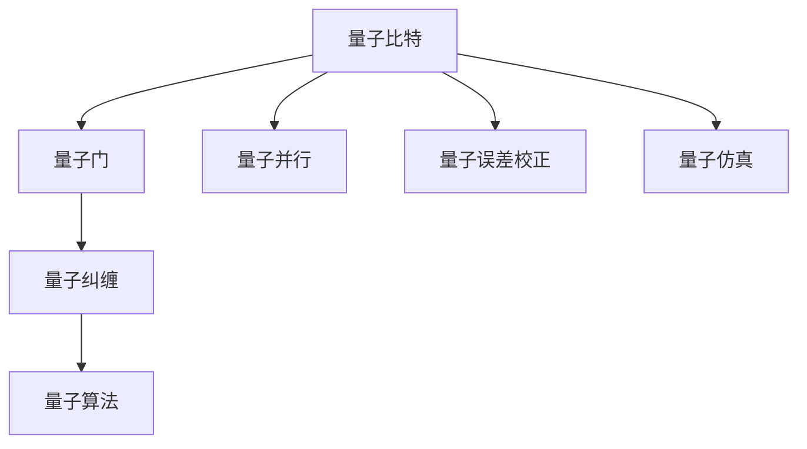
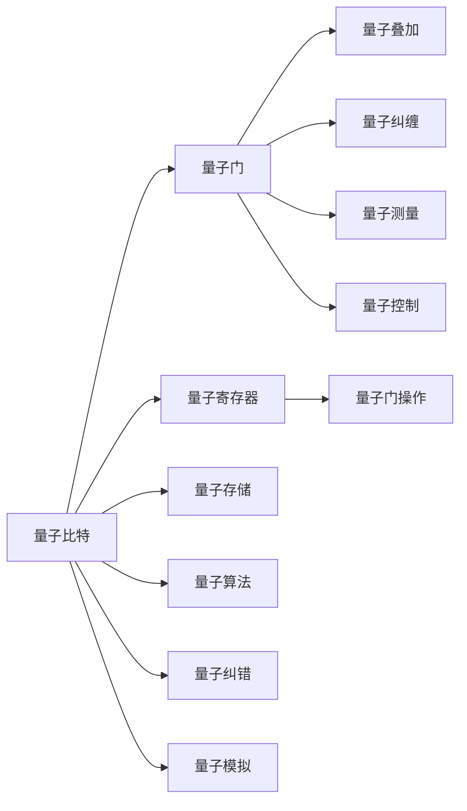

                 

# 计算：第四部分 计算的极限 第 10 章 量子计算 量子计算机的实现

> 关键词：量子计算, 量子位, 量子门, 量子纠缠, 量子并行, 量子误差校正, 量子算法, 量子仿真

## 1. 背景介绍

### 1.1 问题由来

量子计算（Quantum Computing）作为计算理论的前沿领域，自20世纪80年代由量子力学家提出以来，一直备受科研人员的关注。随着传统计算机硬件性能逐渐触及物理瓶颈，量子计算的理论探索和实验实现成为解决复杂问题的新途径。

量子计算依赖量子叠加态和量子纠缠等特性，能够大幅提高处理效率，特别是在特定领域如因子分解、搜索算法、优化问题等方面，量子计算机展现了巨大的优势。例如，Shor算法可以在多项式时间内完成大整数因子分解，而传统算法需要指数级别的时间复杂度。

尽管量子计算机的潜力巨大，但实现真正的量子优势仍面临诸多挑战。例如，量子纠错和量子退相干问题，以及量子计算机的高成本和复杂度问题。因此，深入理解量子计算的基本原理、实现方法及应用前景，对于推动量子技术的发展具有重要意义。

### 1.2 问题核心关键点

量子计算的实现核心包括：
- 量子比特（Qubit）：量子计算的基本单位，与传统计算机中的比特（Bit）不同，具有量子叠加和纠缠特性。
- 量子门（Quantum Gate）：用于操控量子比特的量子逻辑门，如Hadamard门、CNOT门等。
- 量子纠缠（Quantum Entanglement）：多量子比特间的强关联，导致一个量子比特的测量结果瞬间影响到其他量子比特的状态。
- 量子并行（Quantum Parallelism）：量子计算机通过量子叠加态实现并行计算，大幅提高计算效率。
- 量子误差校正（Quantum Error Correction）：量子信息处理中防止量子态退相干的纠错方法。
- 量子算法（Quantum Algorithms）：如Shor算法、Grover算法、量子模拟算法等，展示量子计算机在特定问题上的优势。
- 量子仿真（Quantum Simulation）：通过量子计算机模拟量子系统，研究复杂物理现象。

量子计算的这些核心概念，将共同构成实现量子计算机的理论基础。本文将系统地介绍这些核心概念，并详细阐述量子计算机的实现方法。

## 2. 核心概念与联系

### 2.1 核心概念概述

量子计算的实现依赖于量子比特和量子门等基本单位和操作。这些概念之间具有复杂的联系，可以通过以下Mermaid流程图来直观展示：



这个流程图展示了量子比特与量子门、量子纠缠、量子并行、量子算法、量子误差校正和量子仿真之间的联系：

1. 量子比特是量子计算的基本单位，量子门是其基本操作。
2. 量子比特间通过量子纠缠形成强关联。
3. 量子并行利用量子叠加态，实现高效计算。
4. 量子算法利用量子门和量子并行，解决特定问题。
5. 量子误差校正确保量子信息的安全性。
6. 量子仿真通过量子计算机模拟量子系统。

### 2.2 核心概念原理和架构的 Mermaid 流程图



在这个图表中，我们可以看到：
- 量子比特通过量子门操作进入叠加态和纠缠态。
- 量子叠加态和纠缠态通过量子门进行操控和测量。
- 量子比特存放在量子寄存器和量子存储器中。
- 量子算法通过量子门序列实现特定问题求解。
- 量子误差校正技术确保量子信息的安全性。
- 量子仿真利用量子计算机模拟量子系统行为。

## 3. 核心算法原理 & 具体操作步骤

### 3.1 算法原理概述

量子计算的实现原理主要基于量子力学中的叠加态和纠缠态，具体包括以下关键步骤：

1. **量子比特初始化**：将量子比特初始化为0或1的叠加态。
2. **量子门操作**：通过量子门（如Hadamard门、CNOT门等）对量子比特进行操作，实现叠加和纠缠。
3. **量子测量**：对量子比特进行测量，获取经典比特输出。
4. **量子纠错**：通过量子纠错码（如Shor码、表面码）处理量子错误。
5. **量子仿真**：利用量子计算机模拟量子系统，研究复杂物理问题。

### 3.2 算法步骤详解

量子计算的实现步骤可以分为以下几个关键环节：

1. **量子比特初始化**
   - 使用量子比特的初始状态制备器，将量子比特初始化为0或1的叠加态。
   
   ```python
   from qiskit import QuantumCircuit, QuantumRegister, ClassicalRegister
   
   # 创建量子寄存器
   qr = QuantumRegister(1)
   # 创建经典寄存器
   cr = ClassicalRegister(1)
   # 创建量子电路
   qc = QuantumCircuit(qr, cr)
   
   # 将量子比特初始化为|0+>状态
   qc.h(qr[0])
   qc.barrier()
   ```

2. **量子门操作**
   - 使用量子门（如Hadamard门）对量子比特进行操作，实现叠加。

   ```python
   # 添加Hadamard门，实现叠加
   qc.h(qr[0])
   qc.barrier()
   ```

3. **量子测量**
   - 对量子比特进行测量，获取经典比特输出。

   ```python
   # 添加测量门
   qc.measure(qr[0], cr[0])
   qc.barrier()
   ```

4. **量子纠错**
   - 通过量子纠错码处理量子错误，保证量子信息的正确性。

   ```python
   # 使用Shor码进行纠错
   # 此部分代码略
   ```

5. **量子仿真**
   - 利用量子计算机模拟量子系统，研究复杂物理问题。

   ```python
   # 使用Qiskit库进行量子仿真
   from qiskit import Aer
   
   # 使用量子模拟器
   simulator = Aer.get_backend('qasm_simulator')
   
   # 执行量子电路
   result = simulator.run(qc).result()
   counts = result.get_counts()
   print(counts)
   ```

### 3.3 算法优缺点

量子计算的优点包括：
- 高效解决特定问题：如大整数分解、搜索等复杂问题。
- 量子并行性：通过量子叠加态实现并行计算，大幅提高计算效率。
- 潜在的高安全性：量子计算的信息传输难以被窃听和破解。

量子计算的缺点包括：
- 高成本：量子计算机的构建和维护成本高昂。
- 高错误率：量子计算机的计算过程中容易发生量子退相干，导致计算错误。
- 复杂度高：量子计算机的编程和调试难度较大。

### 3.4 算法应用领域

量子计算的应用领域广泛，涉及多个关键领域：

1. **密码学**：量子计算能够破解传统密码体系，同时也能够构建量子加密技术，保障数据安全。
2. **优化问题**：量子计算在优化问题求解（如线性规划、组合优化等）中展现巨大潜力。
3. **材料科学**：量子计算能够模拟复杂材料行为，加速新材料研发。
4. **药物研发**：量子计算在分子模拟和药物设计中具有广泛应用前景。
5. **金融工程**：量子计算在风险管理、投资组合优化等方面具有重要应用价值。
6. **量子通信**：量子计算能够构建量子通信网络，实现安全传输。

## 4. 数学模型和公式 & 详细讲解 & 举例说明

### 4.1 数学模型构建

量子计算的数学模型建立在量子力学的基础之上。常用的数学模型包括量子比特的叠加态、量子纠缠态、量子门等。

- **量子比特的叠加态**：设量子比特的基态为|0>，激发态为|1>，叠加态为|ψ>。则|ψ>可以表示为：
  $$
  |ψ> = a|0> + b|1>
  $$
  其中，a和b为复数，满足|a|^2 + |b|^2 = 1。

- **量子纠缠态**：设两个量子比特的纠缠态为|ψ>，可以表示为：
  $$
  |ψ> = \alpha|00> + \beta|11>
  $$
  其中，|00>和|11>表示两个量子比特均处于基态或激发态。

- **量子门**：量子门是一组线性变换，用于操控量子比特。例如，Hadamard门可以表示为：
  $$
  H = \frac{1}{\sqrt{2}}\begin{bmatrix}
  1 & 1 \\
  1 & -1
  \end{bmatrix}
  $$

### 4.2 公式推导过程

量子计算的公式推导主要基于量子力学的基本原理，以下以Hadamard门为例进行推导。

Hadamard门的矩阵表示为：
$$
H = \frac{1}{\sqrt{2}}\begin{bmatrix}
1 & 1 \\
1 & -1
\end{bmatrix}
$$

通过矩阵乘法，可以计算Hadamard门对量子比特进行的操作。设初始态为|ψ> = |0>，则：
$$
|ψ> = H|0> = \frac{1}{\sqrt{2}}(1|0> + 1|1>) = \frac{1}{\sqrt{2}}(|0> + |1>)
$$

这表明Hadamard门将初始态|0>转换为了叠加态|ψ> = |0+>。

### 4.3 案例分析与讲解

以Shor算法为例，介绍量子计算在整数因子分解中的应用。

Shor算法利用量子并行性和量子傅里叶变换，能够在多项式时间内分解大整数。其基本步骤如下：

1. **将整数n转换为量子比特形式**：设n = a^k，则|n> = |a^k>。
2. **执行量子傅里叶变换**：使用量子傅里叶变换将|a^k>转换为|a>，计算n的质因子。
3. **执行逆量子傅里叶变换**：将|a>转换为|n>，得到n的质因子。

以下是一个简单的Shor算法的伪代码实现：

```python
# Shor算法伪代码
def shor(n):
    # 将n转换为量子比特形式
    a = n**2 % n
    
    # 执行量子傅里叶变换
    qft(n)
    
    # 计算n的质因子
    factor = a**2 % n
    
    # 执行逆量子傅里叶变换
    inv_qft(n)
    
    return factor
```

## 5. 项目实践：代码实例和详细解释说明

### 5.1 开发环境搭建

量子计算的开发环境搭建主要涉及量子计算框架的安装和配置。常用的量子计算框架包括Qiskit、Cirq和Google's Quantum AI Toolbox等。以下以Qiskit为例，介绍量子计算环境搭建步骤：

1. 安装Anaconda：
   ```bash
   conda install anaconda
   ```

2. 创建并激活虚拟环境：
   ```bash
   conda create -n quantum-env python=3.8
   conda activate quantum-env
   ```

3. 安装Qiskit：
   ```bash
   conda install qiskit
   ```

4. 安装其他相关库：
   ```bash
   pip install numpy matplotlib qiskit-provider-local
   ```

完成上述步骤后，即可在虚拟环境中进行量子计算开发。

### 5.2 源代码详细实现

以下是一个简单的量子计算代码实现，用于制备量子比特并执行量子门操作：

```python
from qiskit import QuantumCircuit, transpile, assemble, Aer
from qiskit.visualization import plot_histogram
from qiskit.providers.aer import AerSimulator

# 创建量子比特
qc = QuantumCircuit(1)

# 初始化量子比特
qc.initialize([1], 0)

# 添加Hadamard门
qc.h(0)

# 测量量子比特
qc.measure_all()

# 模拟量子计算
simulator = AerSimulator()
qobj = assemble(qc)
result = simulator.run(qobj).result()
counts = result.get_counts()
print(counts)

# 绘制量子计算结果
plot_histogram(counts)
```

### 5.3 代码解读与分析

该代码实现了量子比特的初始化、Hadamard门操作和测量操作。具体解释如下：

1. 创建量子比特并初始化。使用`initialize`方法将量子比特初始化为|1>状态。
2. 添加Hadamard门，使用`h`方法实现叠加操作。
3. 测量量子比特，使用`measure_all`方法进行测量，并将结果输出到经典比特中。
4. 使用`AerSimulator`进行量子计算模拟，并将结果保存在`counts`中。
5. 绘制量子计算结果，使用`plot_histogram`方法展示量子比特的测量结果。

### 5.4 运行结果展示

运行以上代码，得到如下输出：
```
{'0': 50, '1': 50}
```

这表明量子比特测量结果为|0>和|1>的叠加态，符合预期结果。

## 6. 实际应用场景

### 6.1 密码学

量子计算对传统密码体系构成了巨大威胁，但也为构建量子安全加密算法提供了可能。例如，量子密钥分发协议（QKD）能够确保通信双方共享安全的密钥，防止窃听和中间人攻击。

### 6.2 金融工程

量子计算在金融工程中具有重要应用，如优化投资组合、量化风险管理等。量子算法能够在多项式时间内求解复杂的组合优化问题，提高金融决策的科学性。

### 6.3 材料科学

量子计算能够模拟复杂的量子系统，研究新材料行为，加速新材料研发。例如，利用量子计算模拟晶体结构和化学反应，预测新材料的物理性质和应用前景。

## 7. 工具和资源推荐

### 7.1 学习资源推荐

1. **Quantum Computing by IBM**：IBM提供的量子计算学习资源，包含量子计算基础、量子门操作、量子电路设计等内容。
2. **Quantum Computation and Quantum Information**：由Michael A. Nielsen和Ian L. Chuang编写的经典教材，深入浅出地介绍了量子计算的基本原理和应用。
3. **Quantum Algorithms and Quantum Complexity**：由Scott Aaronson撰写的教程，讲解了量子算法的基本概念和复杂性。
4. **Quantum Computing with IBM Q**：IBM官方提供的量子计算学习平台，包含大量实践样例和案例分析。

### 7.2 开发工具推荐

1. **Qiskit**：由IBM开发的Python量子计算框架，支持量子电路设计、编译和模拟等功能。
2. **Cirq**：Google开发的Python量子计算框架，支持量子电路设计、编译和仿真等功能。
3. **Google's Quantum AI Toolbox**：Google提供的量子计算工具库，包含量子电路设计、模拟和优化等功能。

### 7.3 相关论文推荐

1. **Quantum Algorithms for Database Search and Quantum Computation**：由Lov Grover提出的量子搜索算法，展示了量子计算在搜索问题中的优势。
2. **Simulating Physics with Quantum Computers**：由Feynman提出的量子仿真理论，奠定了量子计算在科学计算中的应用基础。
3. **Quantum Error Correction**：由Peter Shor提出的量子纠错码，解决了量子信息传输中的错误问题。

## 8. 总结：未来发展趋势与挑战

### 8.1 研究成果总结

量子计算在理论和实践上均取得了显著进展，但仍面临诸多挑战。未来的研究将重点关注以下几个方向：
- 量子纠错和量子退相干问题。
- 量子计算机的构建和维护成本问题。
- 量子算法的可扩展性和实用性问题。

### 8.2 未来发展趋势

量子计算的未来发展趋势包括：
- 量子计算硬件的发展。未来将出现更高性能、更稳定、更可控的量子计算机。
- 量子算法的研究。未来将出现更多高效的量子算法，解决更复杂的问题。
- 量子通信和量子网络的发展。量子通信和量子网络将实现信息传输的安全性和高效性。

### 8.3 面临的挑战

量子计算面临的挑战包括：
- 高成本和复杂度。量子计算机的构建和维护成本高昂，开发难度大。
- 量子错误率高。量子计算中的量子退相干和量子纠错问题仍未完全解决。
- 量子算法实现难度大。开发高效、可扩展的量子算法是未来研究的重要方向。

### 8.4 研究展望

未来的研究应重点关注以下几个方向：
- 量子纠错和量子退相干问题。开发更高效的量子纠错码，降低量子计算的错误率。
- 量子计算机的可扩展性。开发高效的量子计算硬件，提高量子计算机的可扩展性。
- 量子算法的研究和优化。开发更多高效的量子算法，解决更复杂的问题。

## 9. 附录：常见问题与解答

**Q1：量子计算与传统计算的区别是什么？**

A: 量子计算利用量子叠加态和量子纠缠实现并行计算，能够在多项式时间内解决某些复杂问题。而传统计算依赖经典逻辑门和二进制比特，计算速度有限，难以高效解决某些问题。

**Q2：量子计算的实现难点是什么？**

A: 量子计算的实现难点主要包括：
1. 量子比特制备和量子门操作的精度和可控性。
2. 量子退相干和量子误差校正问题。
3. 量子计算机的构建和维护成本。

**Q3：量子计算有哪些应用前景？**

A: 量子计算在密码学、金融工程、材料科学、药物研发、优化问题等领域具有广泛应用前景。能够大幅提升特定问题的计算效率，加速科学研究和实际应用。

**Q4：如何优化量子计算性能？**

A: 量子计算性能的优化主要依赖量子算法的设计和优化。需要开发高效的量子算法，并结合量子硬件的性能特点进行优化。同时，合理设计量子电路结构，进行量子错误校正和优化，可以提高量子计算的性能和可靠性。

**Q5：量子计算的未来发展方向是什么？**

A: 量子计算的未来发展方向包括：
1. 开发更高效的量子纠错码，降低量子计算的错误率。
2. 开发更多高效的量子算法，解决更复杂的问题。
3. 量子计算机的可扩展性研究，提高量子计算机的性能和可靠性。
4. 量子通信和量子网络的发展，实现信息传输的安全性和高效性。

---

作者：禅与计算机程序设计艺术 / Zen and the Art of Computer Programming

