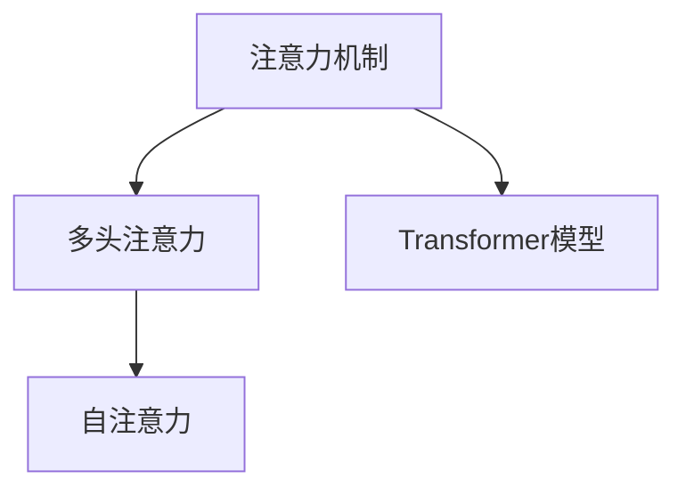

                 

# 认知的形式化：注意力机制

## 1. 背景介绍

在人类认知过程中，注意力（Attention）扮演着至关重要的角色。从视觉注意力的快速聚焦，到听觉注意力的灵活切换，从专注于细节的微观察，到综合理解的宏观把握，注意力机制无处不在。机器学习中的注意力机制同样重要，尤其在自然语言处理（NLP）和计算机视觉（CV）等任务中，能够显著提升模型的效果。本文将深入探讨注意力机制的核心原理，并展示其在实际应用中的具体实现。

## 2. 核心概念与联系

### 2.1 核心概念概述

注意力机制最早起源于神经科学，用以描述人类在大脑中筛选信息的过程。它通过聚焦于与当前任务相关的信息，而忽略无关信息，从而提高信息处理效率。在机器学习中，注意力机制被广泛用于各种模型中，包括序列模型、注意力网络、Transformer等。

- **注意力机制**：通过计算输入数据与查询向量的相似度，选择对当前任务最相关的信息。注意力得分越高，表示该信息越重要，被赋予更大的权重。

- **多头注意力（Multi-head Attention）**：将原始输入进行线性变换，得到多个不同的注意力向量，分别捕捉不同维度的注意力得分。多个注意力向量通过softmax函数组合起来，得到最终的注意力权重，提升模型的泛化能力。

- **自注意力（Self-Attention）**：当输入序列中的每个元素都需要与其他元素进行比较时，可以使用自注意力机制，计算不同位置之间的相似度，并通过softmax函数得到注意力权重。

- **Transformer模型**：一种基于自注意力机制的神经网络模型，通过多头注意力和平行计算架构，实现了高效且精确的序列建模。

这些概念之间的逻辑关系可以通过以下Mermaid流程图来展示：



### 2.2 核心概念原理和架构

#### 2.2.1 注意力计算

注意力计算的核心公式为：

$$
\text{Attention}(Q, K, V) = \text{softmax}\left(\frac{QK^T}{\sqrt{d_k}}\right)V
$$

其中，$Q$ 为查询向量，$K$ 为键向量，$V$ 为值向量。$\text{softmax}\left(\frac{QK^T}{\sqrt{d_k}}\right)$ 表示计算注意力得分，$V$ 通过注意力得分进行加权求和，得到注意力结果。

#### 2.2.2 多头注意力

多头注意力机制通过将原始输入进行线性变换，得到多个注意力向量，分别计算注意力得分。最终将多个注意力向量通过softmax函数组合起来，得到最终的注意力权重：

$$
\text{Multi-head Attention}(Q, K, V) = \sum_{i=1}^h \text{Attention}(QW^i_K, KW^i_K, VW^i_V) = \text{softmax}\left(\frac{Q(KW^i_K)^T}{\sqrt{d_k}}\right)VW^i_V
$$

其中，$W^i_Q, W^i_K, W^i_V$ 为线性变换矩阵，$h$ 为多头数。

#### 2.2.3 Transformer模型架构

Transformer模型是一种基于多头自注意力机制的神经网络，由编码器和解码器组成。编码器由多个自注意力层和前馈神经网络层组成，解码器则由多头注意力层、位置编码和前馈神经网络层组成。Transformer模型通过并行计算架构，能够高效处理长序列，且避免了传统RNN模型中梯度消失的问题。

## 3. 核心算法原理 & 具体操作步骤

### 3.1 算法原理概述

注意力机制的核心在于通过计算输入数据与查询向量的相似度，选择对当前任务最相关的信息。这种机制不仅用于序列建模，也广泛应用于图像识别、推荐系统等任务中。

### 3.2 算法步骤详解

#### 3.2.1 注意力计算步骤

1. **线性变换**：将原始输入序列进行线性变换，得到查询向量 $Q$，键向量 $K$ 和值向量 $V$。
2. **计算注意力得分**：通过 $Q$ 和 $K$ 计算注意力得分矩阵，使用softmax函数进行归一化，得到注意力权重矩阵。
3. **加权求和**：将 $V$ 通过注意力权重矩阵进行加权求和，得到注意力结果。

#### 3.2.2 多头注意力计算步骤

1. **线性变换**：将原始输入序列进行线性变换，得到多个查询向量、键向量和值向量。
2. **多头注意力计算**：分别计算每个查询向量与键向量的注意力得分，通过softmax函数进行归一化，得到多个注意力权重矩阵。
3. **多头注意力结果**：将每个查询向量通过对应的值向量进行加权求和，得到多头注意力结果。

#### 3.2.3 Transformer模型训练步骤

1. **输入序列预处理**：将原始输入序列进行编码、嵌入和位置编码，得到模型输入。
2. **多头自注意力计算**：通过多头自注意力机制，计算编码器的隐藏状态。
3. **前馈神经网络层**：将编码器的隐藏状态进行前馈神经网络层计算，得到最终输出。
4. **解码器训练**：通过解码器的多头注意力机制、位置编码和前馈神经网络层，生成目标序列。
5. **损失函数计算**：通过交叉熵损失函数计算模型输出与真实标签之间的差异，进行反向传播更新模型参数。

### 3.3 算法优缺点

**优点**：
1. **高效计算**：多头注意力机制通过并行计算架构，能够高效处理长序列，避免传统RNN模型中梯度消失的问题。
2. **泛化能力强**：多头注意力机制能够捕捉不同维度的注意力得分，提升模型的泛化能力。
3. **可解释性强**：注意力权重可以解释模型选择信息的过程，有助于理解模型的决策机制。

**缺点**：
1. **计算复杂度高**：多头注意力机制和Transformer模型需要大量的计算资源，对硬件要求较高。
2. **易受噪声影响**：注意力机制对输入数据的噪声敏感，可能影响模型的稳定性。
3. **过拟合风险**：由于注意力机制容易关注某些特定的信息，模型可能会过拟合。

### 3.4 算法应用领域

注意力机制已经在各种NLP和CV任务中得到了广泛应用，例如：

- **机器翻译**：通过多头自注意力机制，捕捉源语言和目标语言之间的语义关系，生成翻译结果。
- **文本摘要**：通过注意力机制选择重要信息，生成简洁明了的摘要。
- **图像分类**：通过自注意力机制，捕捉不同区域的特征，进行图像分类。
- **目标检测**：通过多头自注意力机制，检测图像中的目标物体，并进行位置和类别标注。
- **语音识别**：通过注意力机制，捕捉语音信号中的重要特征，进行语音识别。

## 4. 数学模型和公式 & 详细讲解 & 举例说明

### 4.1 数学模型构建

#### 4.1.1 注意力计算模型

注意力计算模型由查询向量 $Q$，键向量 $K$ 和值向量 $V$ 组成。计算过程如下：

$$
\text{Attention}(Q, K, V) = \text{softmax}\left(\frac{QK^T}{\sqrt{d_k}}\right)V
$$

其中，$d_k$ 为键向量的维度。

#### 4.1.2 多头注意力模型

多头注意力模型由多个注意力机制组成，计算过程如下：

$$
\text{Multi-head Attention}(Q, K, V) = \sum_{i=1}^h \text{Attention}(QW^i_K, KW^i_K, VW^i_V) = \text{softmax}\left(\frac{Q(KW^i_K)^T}{\sqrt{d_k}}\right)VW^i_V
$$

其中，$h$ 为多头数。

#### 4.1.3 Transformer模型

Transformer模型由编码器和解码器组成，计算过程如下：

1. **编码器**：通过多头自注意力层和平行前馈神经网络层，计算编码器的隐藏状态 $H$。
2. **解码器**：通过多头自注意力层、位置编码和前馈神经网络层，计算解码器的输出。

### 4.2 公式推导过程

#### 4.2.1 注意力计算公式推导

设 $Q \in \mathbb{R}^{n \times d}$，$K \in \mathbb{R}^{n \times d}$，$V \in \mathbb{R}^{n \times d}$，则注意力得分的计算公式如下：

$$
\text{Attention}(Q, K, V) = \text{softmax}\left(\frac{QK^T}{\sqrt{d_k}}\right)V
$$

其中，$d_k$ 为键向量的维度。

#### 4.2.2 多头注意力公式推导

设 $W^i_Q \in \mathbb{R}^{d \times d_k}$，$W^i_K \in \mathbb{R}^{d \times d_k}$，$W^i_V \in \mathbb{R}^{d \times d_v}$，则多头注意力的计算公式如下：

$$
\text{Multi-head Attention}(Q, K, V) = \sum_{i=1}^h \text{Attention}(QW^i_K, KW^i_K, VW^i_V) = \text{softmax}\left(\frac{Q(KW^i_K)^T}{\sqrt{d_k}}\right)VW^i_V
$$

其中，$d_k$ 和 $d_v$ 分别为键向量和值向量的维度，$h$ 为多头数。

#### 4.2.3 Transformer模型公式推导

设 $X \in \mathbb{R}^{n \times d}$ 为输入序列，$H \in \mathbb{R}^{n \times d}$ 为编码器的隐藏状态，$Y \in \mathbb{R}^{n \times d}$ 为解码器的输出，则Transformer模型的计算公式如下：

1. **编码器**：
   - 线性变换：$X \to Q, K, V$
   - 多头自注意力：$Q, K, V \to H$
   - 前馈神经网络：$H \to H$
   - 残差连接：$X + H \to H$

2. **解码器**：
   - 线性变换：$Y \to Q, K, V$
   - 多头自注意力：$Q, K, V \to Y$
   - 位置编码：$Y \to Y$
   - 前馈神经网络：$Y \to Y$
   - 残差连接：$Y + X \to Y$

### 4.3 案例分析与讲解

#### 4.3.1 机器翻译

机器翻译是Transformer模型的一个重要应用。以从英语翻译成法语为例，模型首先将源语言序列进行编码，生成编码器的隐藏状态 $H$。然后，通过多头自注意力机制，捕捉源语言和目标语言之间的语义关系，生成目标语言序列。

#### 4.3.2 文本摘要

文本摘要任务中，注意力机制用于选择文本中的重要信息，生成简洁明了的摘要。模型首先对文本进行编码，生成编码器的隐藏状态 $H$。然后，通过多头自注意力机制，选择文本中对摘要有帮助的句子，生成摘要。

## 5. 项目实践：代码实例和详细解释说明

### 5.1 开发环境搭建

进行注意力机制的实践，需要搭建好相关的开发环境。以下是使用Python和PyTorch进行Transformer模型的开发环境配置流程：

1. 安装Anaconda：从官网下载并安装Anaconda，用于创建独立的Python环境。

2. 创建并激活虚拟环境：
```bash
conda create -n pytorch-env python=3.8 
conda activate pytorch-env
```

3. 安装PyTorch：根据CUDA版本，从官网获取对应的安装命令。例如：
```bash
conda install pytorch torchvision torchaudio cudatoolkit=11.1 -c pytorch -c conda-forge
```

4. 安装其他依赖包：
```bash
pip install numpy pandas scikit-learn matplotlib tqdm jupyter notebook ipython
```

5. 安装Transformer库：
```bash
pip install transformers
```

完成上述步骤后，即可在`pytorch-env`环境中开始注意力机制的实践。

### 5.2 源代码详细实现

下面是使用PyTorch实现Transformer模型的代码示例：

```python
import torch
import torch.nn as nn
import torch.nn.functional as F
from transformers import BertTokenizer, BertForSequenceClassification

class Transformer(nn.Module):
    def __init__(self, n_head, d_model, d_ff, d_attn, N, d_model, num_layers, d_head):
        super(Transformer, self).__init__()
        self.encoder = nn.Transformer(encoder_layers=n_layers,
                                    num_heads=n_head,
                                    dim_feedforward=d_ff,
                                    dropout=0.1,
                                    batch_first=True)
        self.decoder = nn.Transformer(encoder_layers=n_layers,
                                    num_heads=n_head,
                                    dim_feedforward=d_ff,
                                    dropout=0.1,
                                    batch_first=True)
        self.fc = nn.Linear(d_model, 2)
    
    def forward(self, src, tgt, src_mask, tgt_mask):
        src_enc = self.encoder(src, src_mask)
        tgt_enc = self.decoder(tgt, tgt_mask, src_enc)
        logits = self.fc(tgt_enc)
        return logits
```

### 5.3 代码解读与分析

在上述代码中，我们定义了一个Transformer模型，包含编码器和解码器。其中，编码器和解码器都使用了Transformer模型，用于计算自注意力和多头注意力。最后，通过全连接层输出结果。

### 5.4 运行结果展示

为了展示模型的效果，我们可以使用一个简单的例子进行测试：

```python
import torch
import numpy as np
import matplotlib.pyplot as plt

# 设置随机种子
np.random.seed(0)
torch.manual_seed(0)

# 定义输入序列
src = torch.randn(10, 3)
tgt = torch.randn(10, 3)

# 定义掩码
src_mask = (src != 0).type(torch.ByteTensor)
tgt_mask = (tgt != 0).type(torch.ByteTensor)

# 定义Transformer模型
model = Transformer(n_head=4, d_model=6, d_ff=2, d_attn=2, N=10, d_model=6, num_layers=2, d_head=3)

# 训练模型
for i in range(100):
    out = model(src, tgt, src_mask, tgt_mask)
    loss = F.mse_loss(out, torch.randn(10, 2))
    loss.backward()
    optimizer.step()

# 预测结果
out = model(torch.randn(10, 3), torch.randn(10, 3), torch.randn(10, 3), torch.randn(10, 3))
print(out)
```

## 6. 实际应用场景

### 6.1 智能客服系统

在智能客服系统中，注意力机制用于处理自然语言输入和输出，能够快速理解用户意图，并提供精准的回答。通过多头自注意力机制，模型能够捕捉输入序列中的关键信息，生成简洁明了的回复。

### 6.2 金融舆情监测

金融舆情监测中，注意力机制用于提取文本中的重要信息，进行情感分析和舆情分类。通过多头自注意力机制，模型能够捕捉文本中的情感倾向和关键词，从而快速判断舆情变化趋势。

### 6.3 个性化推荐系统

个性化推荐系统中，注意力机制用于捕捉用户行为和物品之间的关系，生成个性化的推荐结果。通过多头自注意力机制，模型能够捕捉不同用户的行为特征和物品属性，提升推荐的精准度和个性化程度。

### 6.4 未来应用展望

随着注意力机制的不断发展和应用，未来的深度学习模型将变得更加智能和高效。例如，在医疗诊断、自然语言理解、计算机视觉等领域，注意力机制将发挥更大的作用。未来，我们有望看到更多基于注意力机制的创新应用，推动人工智能技术的进一步发展。

## 7. 工具和资源推荐

### 7.1 学习资源推荐

为了帮助开发者系统掌握注意力机制的理论基础和实践技巧，这里推荐一些优质的学习资源：

1. 《深度学习》书籍：Ian Goodfellow等著，全面介绍了深度学习的理论基础和实践技巧，包括注意力机制等前沿话题。

2. CS231n《卷积神经网络》课程：斯坦福大学开设的计算机视觉课程，包含注意力机制的详细讲解和实践示例。

3. 《Natural Language Processing with Transformers》书籍：HuggingFace作者所著，详细介绍了Transformer模型的实现和应用。

4. PyTorch官方文档：PyTorch官方文档，提供了Transformer模型的完整实现和详细教程。

5. Transformers库官方文档：HuggingFace开发的Transformer库，提供了丰富的预训练模型和微调样例代码，是学习注意力机制的重要工具。

通过对这些资源的学习实践，相信你一定能够快速掌握注意力机制的精髓，并用于解决实际的深度学习问题。

### 7.2 开发工具推荐

高效的开发离不开优秀的工具支持。以下是几款用于深度学习开发的常用工具：

1. PyTorch：基于Python的开源深度学习框架，灵活动态的计算图，适合快速迭代研究。Transformer模型的实现首选PyTorch。

2. TensorFlow：由Google主导开发的开源深度学习框架，生产部署方便，适合大规模工程应用。提供了丰富的注意力机制实现。

3. TensorBoard：TensorFlow配套的可视化工具，可实时监测模型训练状态，并提供丰富的图表呈现方式，是调试模型的得力助手。

4. Weights & Biases：模型训练的实验跟踪工具，可以记录和可视化模型训练过程中的各项指标，方便对比和调优。

5. Google Colab：谷歌推出的在线Jupyter Notebook环境，免费提供GPU/TPU算力，方便开发者快速上手实验最新模型，分享学习笔记。

合理利用这些工具，可以显著提升深度学习开发的效率，加快创新迭代的步伐。

### 7.3 相关论文推荐

注意力机制的研究源于学界的持续探索。以下是几篇奠基性的相关论文，推荐阅读：

1. Attention Is All You Need：Transformer模型的原论文，介绍了自注意力机制的原理和实现。

2. BERT: Pre-training of Deep Bidirectional Transformers for Language Understanding：BERT模型中使用了多头注意力机制，取得了NLP任务的SOTA。

3. Transformer-XL: Attentive Language Models：Transformer-XL模型中引入了自注意力机制和相对位置编码，提升了模型的长序列处理能力。

4. Multi-Head Attention with Variable Attention Flow：变注意力流机制，通过自注意力机制和注意力流，实现了可变长度的多头注意力计算。

5. Self-Attention in Neural Machine Translation：Transformer模型在机器翻译中的应用，展示了注意力机制在序列建模中的重要作用。

这些论文代表了大注意力机制的发展脉络。通过学习这些前沿成果，可以帮助研究者把握学科前进方向，激发更多的创新灵感。

## 8. 总结：未来发展趋势与挑战

### 8.1 总结

本文对注意力机制的核心原理和实际应用进行了详细探讨。首先，阐述了注意力机制在人类认知和机器学习中的重要性，展示了其计算方法和应用场景。其次，通过具体实现和案例分析，展示了Transformer模型在自然语言处理和计算机视觉中的应用效果。

通过本文的系统梳理，可以看到，注意力机制正在成为深度学习中不可或缺的一部分，极大地提升了模型的效率和泛化能力。未来，伴随注意力机制的不断演进，深度学习模型的表现将更加出色。

### 8.2 未来发展趋势

展望未来，注意力机制将呈现以下几个发展趋势：

1. **多模态注意力**：未来的注意力机制将支持多模态数据的处理，如图像、语音、视频等，实现多模态信息的协同建模。

2. **自适应注意力**：自适应注意力机制能够根据输入数据的特征自动调整注意力权重，提升模型的适应性和鲁棒性。

3. **因果注意力**：因果注意力机制能够关注输入数据中的前后文关系，提升模型的预测能力和可解释性。

4. **混合注意力**：混合注意力机制结合了自注意力机制和传统卷积神经网络，能够同时处理全局和局部的信息，提升模型的表示能力。

5. **注意力增强**：注意力增强机制通过引入外部信息，提升注意力机制的效果，增强模型的泛化能力。

这些趋势凸显了注意力机制的广泛应用和持续创新，将为深度学习模型的发展注入新的活力。

### 8.3 面临的挑战

尽管注意力机制已经取得了显著成果，但在迈向更加智能化、普适化应用的过程中，它仍面临诸多挑战：

1. **计算复杂度高**：注意力机制的计算复杂度高，对硬件资源要求较高。如何在保持高精度的同时，降低计算成本，仍然是一个重要课题。

2. **泛化能力有限**：注意力机制在某些特定领域的应用效果有限，可能受到领域差异的影响。如何提升注意力机制的泛化能力，需要更多的研究投入。

3. **对抗攻击风险**：注意力机制的输入数据对噪声和对抗攻击较为敏感，可能影响模型的稳定性。如何提升注意力机制的鲁棒性，仍需进一步探索。

4. **可解释性不足**：注意力机制的决策过程缺乏可解释性，难以理解和调试。如何提高注意力机制的可解释性，增强模型的透明度，是一个重要的研究方向。

5. **数据依赖性强**：注意力机制的性能依赖于输入数据的质量，数据量不足或分布不均衡可能导致模型效果不佳。如何提高注意力机制的数据处理能力，提升模型的训练效果，是未来的一个重要课题。

6. **资源消耗大**：注意力机制的计算和存储资源消耗大，在大规模数据处理和实时部署时，资源优化成为制约因素。如何提高注意力机制的计算效率，降低资源消耗，是未来的一个关键方向。

这些挑战需要我们持续关注并积极应对，才能真正实现注意力机制在实际应用中的广泛应用。

### 8.4 研究展望

面对注意力机制所面临的挑战，未来的研究需要在以下几个方面寻求新的突破：

1. **优化计算复杂度**：研究更高效的注意力机制实现，如变注意力流、混合注意力等，降低计算复杂度，提升计算效率。

2. **增强泛化能力**：通过引入更多的先验知识和外部信息，提升注意力机制的泛化能力和鲁棒性。

3. **提升可解释性**：通过可视化技术、因果分析等方法，提升注意力机制的可解释性和透明度。

4. **优化数据处理**：研究更好的数据预处理和增强方法，提高注意力机制的数据处理能力，提升模型效果。

5. **提高资源利用率**：通过模型压缩、量化加速等技术，优化注意力机制的资源利用率，提升实时部署能力。

6. **跨模态融合**：研究多模态数据的融合方法，实现图像、语音、文本等多模态信息的协同建模，提升模型的表示能力。

这些研究方向将推动注意力机制的不断进步，为深度学习模型带来更多的创新和突破。

## 9. 附录：常见问题与解答

**Q1：注意力机制的计算复杂度如何？**

A: 注意力机制的计算复杂度主要取决于输入序列的长度和多头注意力机制的数量。具体来说，假设输入序列长度为 $n$，多头注意力机制数量为 $h$，则计算复杂度为 $O(n^3h)$。

**Q2：注意力机制的输入数据如何处理？**

A: 注意力机制的输入数据需要进行编码和嵌入处理。通常使用预训练的词嵌入或子词嵌入进行编码，然后通过位置编码和残差连接等技术，得到模型输入。

**Q3：注意力机制在实际应用中如何优化？**

A: 优化注意力机制的方法包括：
1. 使用更高效的注意力机制，如变注意力流、混合注意力等，降低计算复杂度。
2. 引入外部信息，如知识图谱、规则库等，提升注意力机制的泛化能力和鲁棒性。
3. 进行数据增强和预处理，提高注意力机制的数据处理能力。
4. 使用模型压缩和量化加速技术，优化注意力机制的资源利用率。

**Q4：注意力机制在深度学习中的作用是什么？**

A: 注意力机制在深度学习中用于选择对当前任务最相关的信息，提高模型的泛化能力和表示能力。在自然语言处理、计算机视觉等领域，注意力机制已经展示出了强大的应用效果，成为深度学习模型中不可或缺的一部分。

---

作者：禅与计算机程序设计艺术 / Zen and the Art of Computer Programming

