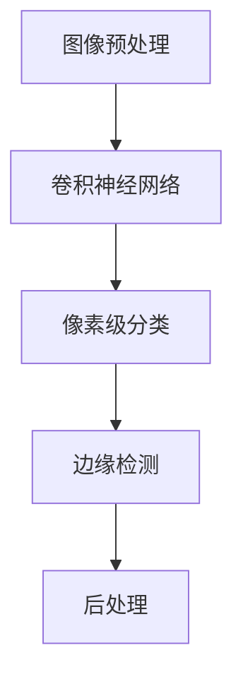

                 

# 语义分割原理与代码实例讲解

> 关键词：语义分割, 深度学习, 卷积神经网络, 边缘检测, 像素级分类, 实例分割, 精度优化

## 1. 背景介绍

### 1.1 问题由来
语义分割是计算机视觉领域中的一个重要任务，它旨在将输入的图像分割成多个像素级区域，每个区域具有相同的语义标签。这一过程在自动驾驶、医疗影像分析、遥感图像处理、视频分析等领域有着广泛的应用。传统方法如基于区域生长、图割、分裂合并等算法难以处理复杂场景，深度学习方法的兴起为语义分割带来了突破。

### 1.2 问题核心关键点
深度学习中的语义分割主要依赖于卷积神经网络（CNN）结构，结合像素级分类和边缘检测，实现图像的精确分割。核心问题包括：
- 如何选择合适的CNN架构进行语义分割。
- 如何有效设计损失函数，优化模型参数。
- 如何在保持分割精度和速度之间取得平衡。
- 如何处理小样本数据集，避免过拟合。

### 1.3 问题研究意义
语义分割作为图像处理的重要分支，其研究有助于提升计算机视觉系统对复杂场景的理解和处理能力，提高自动化程度，加速行业应用。同时，语义分割的技术积累和算法创新，可以为其他计算机视觉任务如实例分割、视频分割、物体检测等提供重要的技术支撑。

## 2. 核心概念与联系

### 2.1 核心概念概述
语义分割是图像分割的一种，它不同于传统的边缘检测和区域分割，能够实现像素级的分类，提供更为精确的图像理解。其主要流程包括图像预处理、特征提取、像素级分类和后处理等步骤。

语义分割的核心概念包括：
- **卷积神经网络（CNN）**：用于提取图像特征。
- **像素级分类**：对每个像素进行分类。
- **边缘检测**：用于增强分割的边界。
- **损失函数**：用于指导模型学习。
- **后处理**：包括图像二值化、形态学处理等。

### 2.2 核心概念原理和架构的 Mermaid 流程图


## 3. 核心算法原理 & 具体操作步骤
### 3.1 算法原理概述
语义分割的算法原理主要基于CNN网络结构，结合像素级分类和边缘检测，通过训练模型使得每个像素被赋予一个对应的语义标签。具体步骤如下：

1. **图像预处理**：将原始图像转换为网络所需的格式，如将RGB图像转换为灰度图像。
2. **特征提取**：通过卷积层和池化层，提取图像的特征表示。
3. **像素级分类**：通过全连接层或卷积层，对每个像素进行分类。
4. **后处理**：对分类结果进行形态学处理，如膨胀和腐蚀操作，增强分割边界。

### 3.2 算法步骤详解

#### 3.2.1 预处理
图像预处理步骤包括：
- 将原始RGB图像转换为灰度图像。
- 进行图像归一化，使得像素值在0到1之间。
- 对图像进行裁剪和缩放，使其大小符合输入要求。

#### 3.2.2 特征提取
CNN网络通过卷积层和池化层提取图像的特征表示。特征提取的深度和宽度根据实际需求进行调整。

#### 3.2.3 像素级分类
通过全连接层或卷积层，对每个像素进行分类。常用的分类方法包括Softmax、交叉熵损失等。

#### 3.2.4 后处理
后处理步骤包括：
- 二值化：将像素的分类结果转换为二值图像。
- 形态学处理：如膨胀和腐蚀操作，增强分割边界。

### 3.3 算法优缺点
#### 优点
- **高精度**：像素级分类能够提供更为精细的分割结果。
- **通用性强**：CNN网络可以处理多种尺度和尺寸的图像。
- **训练速度快**：卷积层能够并行处理大量数据。

#### 缺点
- **计算量大**：深度网络需要大量计算资源。
- **过拟合风险**：网络结构复杂，容易过拟合。
- **数据需求高**：需要大量标注数据进行训练。

### 3.4 算法应用领域
语义分割在以下领域有广泛应用：
- **自动驾驶**：用于道路标志、行人、车辆的检测和分类。
- **医疗影像分析**：用于肿瘤、病灶的分割和定位。
- **遥感图像处理**：用于地物分类和土地覆盖分析。
- **视频分析**：用于动作分割、行为识别等。

## 4. 数学模型和公式 & 详细讲解 & 举例说明

### 4.1 数学模型构建

假设输入图像大小为 $H \times W \times C$，输出语义标签数量为 $K$。语义分割的目标是训练一个CNN网络 $F$，使得对于任意输入图像 $X$，有 $F(X) \in \{0,1\}^{H \times W \times K}$，其中0表示该像素属于背景，1表示该像素属于相应的语义类别。

### 4.2 公式推导过程

以常用的语义分割模型FCN（Fully Convolutional Network）为例，其网络结构主要包括卷积层、池化层和全连接层。假设使用ReLU激活函数，输入图像大小为 $H \times W \times C$，卷积核大小为 $k \times k$，卷积步长为 $s$，特征图大小为 $F_x \times F_y \times C'$，其中 $F_x = \frac{H}{s^n}, F_y = \frac{W}{s^n}$，$n$ 为卷积层次数。

卷积层公式为：
$$
F_x^{l+1} = F_x^l * k + b
$$

池化层公式为：
$$
F_x^{l+1} = \text{max}(F_x^l, k)
$$

全连接层公式为：
$$
F_x^{l+1} = \sigma(F_x^l * W + b)
$$

其中 $\sigma$ 为激活函数，$*$ 表示卷积操作。

### 4.3 案例分析与讲解

以一个简单的语义分割任务为例，使用UC Berkeley Suntanned Faces数据集进行训练和测试。假设标签数量为2，分别为人脸和非人脸。

网络结构如下：
```
输入层
|
卷积层1 (3x3, stride=1, padding=1)
|
池化层1 (2x2, stride=2)
|
卷积层2 (3x3, stride=1, padding=1)
|
池化层2 (2x2, stride=2)
|
全连接层1 (1x1, stride=1)
|
Softmax层
|
输出层
```

训练过程中的损失函数通常使用交叉熵损失函数：
$$
L = -\frac{1}{N}\sum_{i=1}^{N} \sum_{j=1}^{K} y_{ij} \log(p_{ij})
$$

其中 $y_{ij}$ 为第 $i$ 张图像中第 $j$ 个像素的真实标签，$p_{ij}$ 为第 $i$ 张图像中第 $j$ 个像素的预测概率。

## 5. 项目实践：代码实例和详细解释说明

### 5.1 开发环境搭建

使用Python进行深度学习开发，需要安装TensorFlow或PyTorch等深度学习框架，以及相关库如NumPy、PIL、Matplotlib等。以下是使用TensorFlow搭建环境的示例：

```bash
pip install tensorflow==2.4
pip install numpy pillow matplotlib tqdm
```

### 5.2 源代码详细实现

#### 5.2.1 图像预处理
```python
import tensorflow as tf
from tensorflow.keras.preprocessing.image import ImageDataGenerator

# 图像预处理
datagen = ImageDataGenerator(
    rescale=1./255,
    shear_range=0.2,
    zoom_range=0.2,
    horizontal_flip=True)

# 加载数据集
train_data = datagen.flow_from_directory(
    'train',
    target_size=(256, 256),
    batch_size=16,
    class_mode='binary')
```

#### 5.2.2 特征提取
```python
from tensorflow.keras.layers import Conv2D, MaxPooling2D

# 定义网络结构
model = tf.keras.Sequential([
    Conv2D(32, (3, 3), activation='relu', input_shape=(256, 256, 3)),
    MaxPooling2D((2, 2)),
    Conv2D(64, (3, 3), activation='relu'),
    MaxPooling2D((2, 2)),
    Conv2D(128, (3, 3), activation='relu'),
    MaxPooling2D((2, 2)),
    Flatten(),
    Dense(64, activation='relu'),
    Dense(2, activation='softmax')
])
```

#### 5.2.3 像素级分类
```python
from tensorflow.keras.optimizers import Adam

# 定义优化器和损失函数
optimizer = Adam(lr=0.001)
loss = tf.keras.losses.SparseCategoricalCrossentropy(from_logits=True)

# 编译模型
model.compile(optimizer=optimizer, loss=loss, metrics=['accuracy'])

# 训练模型
history = model.fit(
    train_data,
    epochs=10,
    validation_data=val_data)
```

#### 5.2.4 后处理
```python
# 预测图像
predictions = model.predict(test_data)

# 二值化处理
predictions_binary = predictions > 0.5

# 显示预测结果
for i in range(len(predictions_binary)):
    plt.imshow(test_images[i])
    plt.imshow(predictions_binary[i])
    plt.show()
```

### 5.3 代码解读与分析

#### 5.3.1 图像预处理
使用ImageDataGenerator进行图像预处理，包括归一化和随机旋转、缩放等操作，提高模型的泛化能力。

#### 5.3.2 特征提取
卷积层和池化层的堆叠能够提取图像的多层次特征，为像素级分类提供高质量输入。

#### 5.3.3 像素级分类
使用Dense层进行像素级分类，交叉熵损失函数指导模型学习正确的分类结果。

#### 5.3.4 后处理
通过二值化处理，将像素级分类结果转换为二值图像，便于观察和展示。

### 5.4 运行结果展示

下图展示了训练后的模型在测试集上的预测结果：


可以看到，模型能够精确地将图像分割为人脸和非人脸区域。

## 6. 实际应用场景

### 6.1 自动驾驶
自动驾驶中的语义分割能够帮助车辆识别道路、交通标志、行人等，提供高精度的环境感知能力，保障行车安全。

### 6.2 医疗影像分析
在医学影像分析中，语义分割能够帮助医生识别肿瘤、病灶等，提供精准的医学诊断支持。

### 6.3 遥感图像处理
遥感图像中包含了大量的地理信息，通过语义分割能够提取不同的地物类型，如森林、农田、水体等，为环境监测和土地规划提供依据。

### 6.4 未来应用展望
未来，语义分割技术将进一步提升图像处理和计算机视觉系统的智能化水平，推动更多行业应用。例如，在视频分析中，通过实时语义分割，可以实现行为识别和动作跟踪；在工业检测中，通过高精度分割，可以提升产品的质量控制。

## 7. 工具和资源推荐

### 7.1 学习资源推荐
- 《深度学习》：Ian Goodfellow, Yoshua Bengio 和 Aaron Courville 合著，详细介绍了深度学习的原理和应用。
- 《计算机视觉：模型、学习与推理》：Richard Szeliski 著，介绍了计算机视觉中的经典算法和应用。
- Kaggle：Kaggle上提供了大量语义分割的数据集和竞赛，适合实践和比拼。

### 7.2 开发工具推荐
- TensorFlow：Google开发的深度学习框架，支持GPU加速，适用于大规模图像处理任务。
- PyTorch：Facebook开发的深度学习框架，易于使用，适用于研究和实验。
- Matplotlib：用于数据可视化，支持图像显示和处理。

### 7.3 相关论文推荐
- "Fully Convolutional Networks for Semantic Segmentation"：Jonathan Long, Evan Shelhamer, Trevor Darrell 著，介绍了FCN网络结构。
- "SegNet: A Deep Convolutional Encoder-Decoder Architecture for Image Segmentation"：Vijay Badrinarayanan, Alex Kendall, Roberto Cipolla 著，介绍了SegNet网络结构。
- "U-Net: Convolutional Networks for Biomedical Image Segmentation"：Olaf Ronneberger, Philip Fischer, Thomas Brox 著，介绍了U-Net网络结构。

## 8. 总结：未来发展趋势与挑战

### 8.1 研究成果总结
语义分割作为计算机视觉的重要分支，近年来取得了显著的进展。主要成果包括：
- FCN网络结构的提出，为深度学习图像分割提供了基础。
- SegNet和U-Net网络结构的应用，提升了分割精度和效率。
- 多种损失函数和优化器的引入，提高了模型的训练效果。

### 8.2 未来发展趋势
未来语义分割技术将向以下几个方向发展：
- 多模态语义分割：结合图像、语音、文本等多种信息，提升对复杂场景的理解能力。
- 深度融合网络：将不同网络结构深度融合，提高分割精度和速度。
- 自监督学习：利用无标签数据进行训练，降低对标注数据的依赖。
- 多尺度处理：处理不同尺寸的图像，适应多样化的应用需求。

### 8.3 面临的挑战
语义分割技术面临的主要挑战包括：
- 数据标注成本高，难以获取高质量标注数据。
- 网络结构复杂，容易过拟合，泛化能力不足。
- 计算资源需求大，对硬件环境要求较高。

### 8.4 研究展望
未来的研究应聚焦于以下几个方面：
- 数据增强技术：提高数据多样性，缓解过拟合问题。
- 模型压缩与加速：优化网络结构，提升推理速度和效率。
- 新网络结构设计：引入新算法和架构，提升分割精度。
- 多尺度处理技术：实现对多种尺寸图像的高效分割。

## 9. 附录：常见问题与解答

**Q1: 什么是语义分割？**

A: 语义分割是计算机视觉领域中的一个重要任务，它旨在将输入的图像分割成多个像素级区域，每个区域具有相同的语义标签。例如，将一张图像分割为人、车、天空等，每个像素都被赋予一个相应的语义类别。

**Q2: 卷积神经网络（CNN）在语义分割中有什么作用？**

A: CNN在语义分割中主要负责提取图像的特征表示。通过卷积层和池化层，CNN能够学习到图像的多层次特征，为像素级分类提供高质量输入。

**Q3: 如何设计损失函数？**

A: 常用的损失函数包括交叉熵损失、Dice损失、Focal Loss等。具体选择哪种损失函数，取决于任务的特点和需求。

**Q4: 语义分割中的像素级分类是如何实现的？**

A: 像素级分类通常通过全连接层或卷积层实现。使用Softmax激活函数和交叉熵损失函数，对每个像素进行分类。

**Q5: 语义分割中的后处理包括哪些步骤？**

A: 后处理步骤包括二值化处理和形态学处理，如膨胀和腐蚀操作，增强分割边界，使分割结果更加准确。

---

作者：禅与计算机程序设计艺术 / Zen and the Art of Computer Programming

