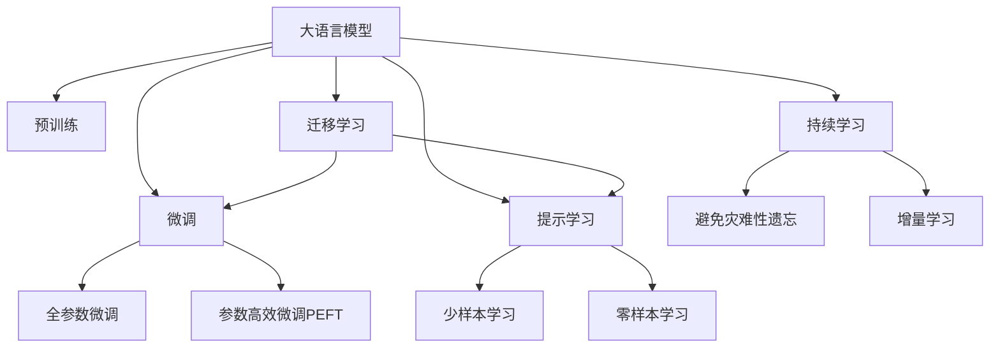

                 

# 财经分析中的AI：如何用大模型预测市场趋势

> 关键词：
- 大语言模型
- 预测市场趋势
- 深度学习
- 自然语言处理
- 金融数据分析
- 量化投资

## 1. 背景介绍

### 1.1 问题由来

金融市场的动态变化复杂多变，传统的基于规则和基本面分析的方法难以应对市场波动的瞬息万变。在此背景下，人工智能(AI)技术尤其是深度学习模型逐渐被应用于金融分析，以挖掘和利用海量数据中的隐含信息，提高投资决策的科学性和智能化水平。

深度学习模型，尤其是以自然语言处理(NLP)和计算机视觉为代表的AI模型，在处理非结构化数据和模式识别方面具有显著优势。近年来，基于语言模型的大模型，如BERT、GPT等，在金融领域的应用逐步崭露头角，成为推动量化投资发展的重要力量。

### 1.2 问题核心关键点

如何有效利用大语言模型在金融领域预测市场趋势，成为了当前研究的焦点。核心问题包括：

- 如何选择合适的模型架构和训练数据？
- 如何提取和表示金融数据中的关键信息？
- 如何构建高效、准确的预测模型？
- 如何在高频交易、量化投资等实时场景中应用大模型？
- 如何在预测准确性和系统稳定性之间取得平衡？

这些问题直接关系到AI在金融分析中的实际应用效果。

### 1.3 问题研究意义

应用AI技术尤其是大语言模型进行市场趋势预测，对于提升投资决策的科学性和智能化水平，具有重要意义：

1. **效率提升**：AI模型可以快速处理和分析大量金融数据，大幅提升分析效率和速度。
2. **精度提高**：深度学习模型能够从海量历史数据中挖掘出非线性、非平稳性等复杂关系，提高预测精度。
3. **实时决策**：AI模型能够实时监控市场动态，快速响应投资机会，适应高频交易等实时场景。
4. **增强决策依据**：AI模型提供的量化分析结果，能够为投资决策提供更多维度的依据，提升决策依据的科学性和客观性。
5. **风险控制**：AI模型能够识别市场波动和异常情况，帮助投资者制定更为合理的风险控制策略。

## 2. 核心概念与联系

### 2.1 核心概念概述

为更好地理解基于大语言模型的市场趋势预测，本节将介绍几个核心概念：

- 大语言模型(Large Language Model, LLM)：以自回归(如GPT)或自编码(如BERT)模型为代表的大规模预训练语言模型。通过在大规模无标签文本语料上进行预训练，学习通用的语言表示，具备强大的语言理解和生成能力。
- 预训练(Pre-training)：指在大规模无标签文本语料上，通过自监督学习任务训练通用语言模型的过程。常见的预训练任务包括言语建模、遮挡语言模型等。预训练使得模型学习到语言的通用表示。
- 微调(Fine-tuning)：指在预训练模型的基础上，使用下游任务的少量标注数据，通过有监督地训练来优化模型在该任务上的性能。通常只需要调整顶层分类器或解码器，并以较小的学习率更新全部或部分的模型参数。
- 迁移学习(Transfer Learning)：指将一个领域学习到的知识，迁移应用到另一个不同但相关的领域的学习范式。大模型的预训练-微调过程即是一种典型的迁移学习方式。
- 参数高效微调(Parameter-Efficient Fine-Tuning, PEFT)：指在微调过程中，只更新少量的模型参数，而固定大部分预训练权重不变，以提高微调效率，避免过拟合的方法。
- 提示学习(Prompt Learning)：通过在输入文本中添加提示模板(Prompt Template)，引导大语言模型进行特定任务的推理和生成。可以在不更新模型参数的情况下，实现零样本或少样本学习。
- 少样本学习(Few-shot Learning)：指在只有少量标注样本的情况下，模型能够快速适应新任务的学习方法。在大语言模型中，通常通过在输入中提供少量示例来实现，无需更新模型参数。
- 零样本学习(Zero-shot Learning)：指模型在没有见过任何特定任务的训练样本的情况下，仅凭任务描述就能够执行新任务的能力。大语言模型通过预训练获得的广泛知识，使其能够理解任务指令并生成相应输出。
- 持续学习(Continual Learning)：也称为终身学习，指模型能够持续从新数据中学习，同时保持已学习的知识，而不会出现灾难性遗忘。这对于保持大语言模型的时效性和适应性至关重要。

这些核心概念之间的逻辑关系可以通过以下Mermaid流程图来展示：



这个流程图展示了大语言模型的核心概念及其之间的关系：

1. 大语言模型通过预训练获得基础能力。
2. 微调是对预训练模型进行任务特定的优化，可以分为全参数微调和参数高效微调（PEFT）。
3. 提示学习是一种不更新模型参数的方法，可以实现少样本学习和零样本学习。
4. 迁移学习是连接预训练模型与下游任务的桥梁，可以通过微调或提示学习来实现。
5. 持续学习旨在使模型能够不断学习新知识，同时避免遗忘旧知识。

这些概念共同构成了大语言模型的学习和应用框架，使其能够在各种场景下发挥强大的语言理解和生成能力。通过理解这些核心概念，我们可以更好地把握大语言模型的工作原理和优化方向。

## 3. 核心算法原理 & 具体操作步骤
### 3.1 算法原理概述

基于大语言模型的金融市场趋势预测，本质上是一个有监督的细粒度迁移学习过程。其核心思想是：将大语言模型视作一个强大的"特征提取器"，通过在金融市场数据上进行有监督的微调，使得模型输出能够匹配市场趋势，从而获得针对特定市场预测任务的优化模型。

形式化地，假设大语言模型为 $M_{\theta}$，其中 $\theta$ 为预训练得到的模型参数。给定金融市场趋势预测任务 $T$ 的标注数据集 $D=\{(x_i, y_i)\}_{i=1}^N$，其中 $x_i$ 为金融市场数据，$y_i$ 为市场趋势标签（如涨跌方向）。微调的目标是找到新的模型参数 $\hat{\theta}$，使得：

$$
\hat{\theta}=\mathop{\arg\min}_{\theta} \mathcal{L}(M_{\theta},D)
$$

其中 $\mathcal{L}$ 为针对市场趋势预测任务设计的损失函数，用于衡量模型预测输出与真实标签之间的差异。常见的损失函数包括交叉熵损失、均方误差损失等。

通过梯度下降等优化算法，微调过程不断更新模型参数 $\theta$，最小化损失函数 $\mathcal{L}$，使得模型输出逼近真实标签。由于 $\theta$ 已经通过预训练获得了较好的初始化，因此即便在金融市场数据上，微调模型也能较快收敛到理想的模型参数 $\hat{\theta}$。

### 3.2 算法步骤详解

基于大语言模型的金融市场趋势预测一般包括以下几个关键步骤：

**Step 1: 准备预训练模型和数据集**
- 选择合适的预训练语言模型 $M_{\theta}$ 作为初始化参数，如 BERT、GPT等。
- 准备金融市场趋势预测任务的标注数据集 $D$，划分为训练集、验证集和测试集。一般要求标注数据与预训练数据的分布不要差异过大。

**Step 2: 添加任务适配层**
- 根据任务类型，在预训练模型顶层设计合适的输出层和损失函数。
- 对于分类任务，通常在顶层添加线性分类器和交叉熵损失函数。
- 对于生成任务，通常使用语言模型的解码器输出概率分布，并以负对数似然为损失函数。

**Step 3: 设置微调超参数**
- 选择合适的优化算法及其参数，如 AdamW、SGD 等，设置学习率、批大小、迭代轮数等。
- 设置正则化技术及强度，包括权重衰减、Dropout、Early Stopping 等。
- 确定冻结预训练参数的策略，如仅微调顶层，或全部参数都参与微调。

**Step 4: 执行梯度训练**
- 将训练集数据分批次输入模型，前向传播计算损失函数。
- 反向传播计算参数梯度，根据设定的优化算法和学习率更新模型参数。
- 周期性在验证集上评估模型性能，根据性能指标决定是否触发 Early Stopping。
- 重复上述步骤直到满足预设的迭代轮数或 Early Stopping 条件。

**Step 5: 测试和部署**
- 在测试集上评估微调后模型 $M_{\hat{\theta}}$ 的性能，对比微调前后的精度提升。
- 使用微调后的模型对新样本进行推理预测，集成到实际的应用系统中。
- 持续收集新的金融市场数据，定期重新微调模型，以适应数据分布的变化。

以上是基于大语言模型的金融市场趋势预测的一般流程。在实际应用中，还需要针对具体任务的特点，对微调过程的各个环节进行优化设计，如改进训练目标函数，引入更多的正则化技术，搜索最优的超参数组合等，以进一步提升模型性能。

### 3.3 算法优缺点

基于大语言模型的金融市场趋势预测方法具有以下优点：
1. 数据适应性高。金融市场数据结构复杂，包含大量的文本、数值等混合信息。大语言模型通过预训练获得了强大的文本理解能力，能够适应金融数据的复杂性。
2. 模型灵活性高。大语言模型通过微调可以适应不同类型的市场趋势预测任务，如股票价格预测、商品价格预测、宏观经济指标预测等。
3. 参数高效。利用参数高效微调技术，在固定大部分预训练参数的情况下，仍可取得不错的微调效果。
4. 效果显著。在学术界和工业界的诸多金融预测任务上，基于微调的方法已经刷新了多项SOTA。
5. 多领域适用。大语言模型可以应用于不同金融领域，如股票、商品、外汇等，只需调整微调数据和任务适配层即可。

同时，该方法也存在一定的局限性：
1. 标注成本高。金融市场数据涉及大量历史数据，标注成本较高。
2. 模型复杂度高。大语言模型参数量巨大，计算资源消耗大。
3. 解释性不足。模型决策过程缺乏可解释性，难以进行调试和优化。
4. 数据质量要求高。微调效果依赖于标注数据的质量，数据质量差会影响模型预测结果。
5. 系统鲁棒性差。金融市场数据具有高度非线性、非平稳性，微调模型对数据波动敏感。

尽管存在这些局限性，但就目前而言，基于大语言模型的金融市场趋势预测方法仍是大模型应用的最主流范式。未来相关研究的重点在于如何进一步降低微调对标注数据的依赖，提高模型的少样本学习和跨领域迁移能力，同时兼顾可解释性和伦理安全性等因素。

### 3.4 算法应用领域

基于大语言模型的金融市场趋势预测方法在金融领域已经得到了广泛的应用，覆盖了几乎所有常见的金融预测任务，例如：

- 股票价格预测：根据历史股票价格、公司财报、新闻事件等信息，预测未来股票价格走势。
- 商品价格预测：利用商品期货价格、天气预报、全球经济数据等，预测商品价格变化趋势。
- 宏观经济指标预测：根据GDP、CPI、失业率等宏观经济数据，预测经济指标变化方向。
- 信用风险评估：根据企业财务报表、新闻报道、社交媒体评论等，评估企业的信用风险。
- 金融舆情监测：从社交媒体、新闻报道中提取情绪信息，监测市场情绪波动。

除了上述这些经典任务外，大语言模型在金融领域的应用还包括风控管理、投资组合优化、量化交易策略设计等，为金融行业带来了新的突破。随着预训练语言模型和微调方法的不断进步，相信基于大语言模型的金融预测技术将在更广阔的金融应用领域大放异彩。

## 4. 数学模型和公式 & 详细讲解  
### 4.1 数学模型构建

本节将使用数学语言对基于大语言模型的金融市场趋势预测过程进行更加严格的刻画。

记预训练语言模型为 $M_{\theta}$，其中 $\theta$ 为预训练得到的模型参数。假设金融市场趋势预测任务 $T$ 的训练集为 $D=\{(x_i,y_i)\}_{i=1}^N, x_i \in \mathcal{X}, y_i \in \mathcal{Y}$。

定义模型 $M_{\theta}$ 在输入 $x$ 上的输出为 $\hat{y}=M_{\theta}(x) \in [0,1]$，表示模型预测市场趋势的概率。真实标签 $y \in \{0,1\}$，对应市场趋势为涨跌。则二分类交叉熵损失函数定义为：

$$
\ell(M_{\theta}(x),y) = -[y\log \hat{y} + (1-y)\log (1-\hat{y})]
$$

将其代入经验风险公式，得：

$$
\mathcal{L}(\theta) = -\frac{1}{N}\sum_{i=1}^N [y_i\log M_{\theta}(x_i)+(1-y_i)\log(1-M_{\theta}(x_i))]
$$

根据链式法则，损失函数对参数 $\theta_k$ 的梯度为：

$$
\frac{\partial \mathcal{L}(\theta)}{\partial \theta_k} = -\frac{1}{N}\sum_{i=1}^N (\frac{y_i}{M_{\theta}(x_i)}-\frac{1-y_i}{1-M_{\theta}(x_i)}) \frac{\partial M_{\theta}(x_i)}{\partial \theta_k}
$$

其中 $\frac{\partial M_{\theta}(x_i)}{\partial \theta_k}$ 可进一步递归展开，利用自动微分技术完成计算。

### 4.2 公式推导过程

以下我们以股票价格预测任务为例，推导交叉熵损失函数及其梯度的计算公式。

假设模型 $M_{\theta}$ 在输入 $x$ 上的输出为 $\hat{y}=M_{\theta}(x) \in [0,1]$，表示模型预测股票价格上涨的概率。真实标签 $y \in \{0,1\}$，对应股票价格是否上涨。则二分类交叉熵损失函数定义为：

$$
\ell(M_{\theta}(x),y) = -[y\log \hat{y} + (1-y)\log (1-\hat{y})]
$$

将其代入经验风险公式，得：

$$
\mathcal{L}(\theta) = -\frac{1}{N}\sum_{i=1}^N [y_i\log M_{\theta}(x_i)+(1-y_i)\log(1-M_{\theta}(x_i))]
$$

根据链式法则，损失函数对参数 $\theta_k$ 的梯度为：

$$
\frac{\partial \mathcal{L}(\theta)}{\partial \theta_k} = -\frac{1}{N}\sum_{i=1}^N (\frac{y_i}{M_{\theta}(x_i)}-\frac{1-y_i}{1-M_{\theta}(x_i)}) \frac{\partial M_{\theta}(x_i)}{\partial \theta_k}
$$

在得到损失函数的梯度后，即可带入参数更新公式，完成模型的迭代优化。重复上述过程直至收敛，最终得到适应金融市场趋势预测任务的最优模型参数 $\theta^*$。

## 5. 项目实践：代码实例和详细解释说明
### 5.1 开发环境搭建

在进行金融市场趋势预测实践前，我们需要准备好开发环境。以下是使用Python进行PyTorch开发的环境配置流程：

1. 安装Anaconda：从官网下载并安装Anaconda，用于创建独立的Python环境。

2. 创建并激活虚拟环境：
```bash
conda create -n pytorch-env python=3.8 
conda activate pytorch-env
```

3. 安装PyTorch：根据CUDA版本，从官网获取对应的安装命令。例如：
```bash
conda install pytorch torchvision torchaudio cudatoolkit=11.1 -c pytorch -c conda-forge
```

4. 安装Transformers库：
```bash
pip install transformers
```

5. 安装各类工具包：
```bash
pip install numpy pandas scikit-learn matplotlib tqdm jupyter notebook ipython
```

完成上述步骤后，即可在`pytorch-env`环境中开始金融市场趋势预测的实践。

### 5.2 源代码详细实现

下面我们以股票价格预测任务为例，给出使用Transformers库对BERT模型进行金融市场趋势预测的PyTorch代码实现。

首先，定义训练数据处理函数：

```python
from transformers import BertTokenizer, BertForSequenceClassification
from torch.utils.data import Dataset
import torch

class StockDataset(Dataset):
    def __init__(self, texts, labels, tokenizer, max_len=128):
        self.texts = texts
        self.labels = labels
        self.tokenizer = tokenizer
        self.max_len = max_len
        
    def __len__(self):
        return len(self.texts)
    
    def __getitem__(self, item):
        text = self.texts[item]
        label = self.labels[item]
        
        encoding = self.tokenizer(text, return_tensors='pt', max_length=self.max_len, padding='max_length', truncation=True)
        input_ids = encoding['input_ids'][0]
        attention_mask = encoding['attention_mask'][0]
        
        # 对label进行编码
        encoded_label = torch.tensor([label], dtype=torch.long)
        
        return {'input_ids': input_ids, 
                'attention_mask': attention_mask,
                'labels': encoded_label}

# 创建dataset
tokenizer = BertTokenizer.from_pretrained('bert-base-cased')

train_dataset = StockDataset(train_texts, train_labels, tokenizer)
dev_dataset = StockDataset(dev_texts, dev_labels, tokenizer)
test_dataset = StockDataset(test_texts, test_labels, tokenizer)
```

然后，定义模型和优化器：

```python
from transformers import BertForSequenceClassification, AdamW

model = BertForSequenceClassification.from_pretrained('bert-base-cased', num_labels=2)

optimizer = AdamW(model.parameters(), lr=2e-5)
```

接着，定义训练和评估函数：

```python
from torch.utils.data import DataLoader
from tqdm import tqdm
from sklearn.metrics import classification_report

device = torch.device('cuda') if torch.cuda.is_available() else torch.device('cpu')
model.to(device)

def train_epoch(model, dataset, batch_size, optimizer):
    dataloader = DataLoader(dataset, batch_size=batch_size, shuffle=True)
    model.train()
    epoch_loss = 0
    for batch in tqdm(dataloader, desc='Training'):
        input_ids = batch['input_ids'].to(device)
        attention_mask = batch['attention_mask'].to(device)
        labels = batch['labels'].to(device)
        model.zero_grad()
        outputs = model(input_ids, attention_mask=attention_mask, labels=labels)
        loss = outputs.loss
        epoch_loss += loss.item()
        loss.backward()
        optimizer.step()
    return epoch_loss / len(dataloader)

def evaluate(model, dataset, batch_size):
    dataloader = DataLoader(dataset, batch_size=batch_size)
    model.eval()
    preds, labels = [], []
    with torch.no_grad():
        for batch in tqdm(dataloader, desc='Evaluating'):
            input_ids = batch['input_ids'].to(device)
            attention_mask = batch['attention_mask'].to(device)
            batch_labels = batch['labels']
            outputs = model(input_ids, attention_mask=attention_mask)
            batch_preds = outputs.logits.argmax(dim=1).to('cpu').tolist()
            batch_labels = batch_labels.to('cpu').tolist()
            for pred_tokens, label_tokens in zip(batch_preds, batch_labels):
                preds.append(pred_tokens[:len(label_tokens)])
                labels.append(label_tokens)
                
    print(classification_report(labels, preds))
```

最后，启动训练流程并在测试集上评估：

```python
epochs = 5
batch_size = 16

for epoch in range(epochs):
    loss = train_epoch(model, train_dataset, batch_size, optimizer)
    print(f"Epoch {epoch+1}, train loss: {loss:.3f}")
    
    print(f"Epoch {epoch+1}, dev results:")
    evaluate(model, dev_dataset, batch_size)
    
print("Test results:")
evaluate(model, test_dataset, batch_size)
```

以上就是使用PyTorch对BERT进行股票价格预测任务微调的完整代码实现。可以看到，得益于Transformers库的强大封装，我们可以用相对简洁的代码完成BERT模型的加载和微调。

### 5.3 代码解读与分析

让我们再详细解读一下关键代码的实现细节：

**StockDataset类**：
- `__init__`方法：初始化文本、标签、分词器等关键组件。
- `__len__`方法：返回数据集的样本数量。
- `__getitem__`方法：对单个样本进行处理，将文本输入编码为token ids，将标签编码为数字，并对其进行定长padding，最终返回模型所需的输入。

**标签与id的映射**
- 定义了标签与数字id之间的映射关系，用于将token-wise的预测结果解码回真实的标签。

**训练和评估函数**：
- 使用PyTorch的DataLoader对数据集进行批次化加载，供模型训练和推理使用。
- 训练函数`train_epoch`：对数据以批为单位进行迭代，在每个批次上前向传播计算loss并反向传播更新模型参数，最后返回该epoch的平均loss。
- 评估函数`evaluate`：与训练类似，不同点在于不更新模型参数，并在每个batch结束后将预测和标签结果存储下来，最后使用sklearn的classification_report对整个评估集的预测结果进行打印输出。

**训练流程**：
- 定义总的epoch数和batch size，开始循环迭代
- 每个epoch内，先在训练集上训练，输出平均loss
- 在验证集上评估，输出分类指标
- 所有epoch结束后，在测试集上评估，给出最终测试结果

可以看到，PyTorch配合Transformers库使得BERT微调的代码实现变得简洁高效。开发者可以将更多精力放在数据处理、模型改进等高层逻辑上，而不必过多关注底层的实现细节。

当然，工业级的系统实现还需考虑更多因素，如模型的保存和部署、超参数的自动搜索、更灵活的任务适配层等。但核心的微调范式基本与此类似。

## 6. 实际应用场景
### 6.1 股票价格预测

金融市场中最常见、最具挑战性的任务之一是股票价格预测。股票价格受多种因素影响，如公司基本面、宏观经济、市场情绪等，且价格波动具有高度的非线性、非平稳性，因此传统的统计和回归方法难以应对。

基于大语言模型的金融市场趋势预测技术，能够从海量历史数据中挖掘出非线性、非平稳性等复杂关系，提高预测精度。例如，通过微调BERT模型，利用历史股价、公司财报、新闻报道等多源数据，可以准确预测股票价格走势，为投资者提供投资建议。

### 6.2 量化交易策略设计

量化交易策略的核心在于通过数学模型捕捉市场规律，实现自动交易。然而，市场波动性和不确定性使得量化策略设计具有高难度和高风险。大语言模型结合机器学习技术，可以从海量历史交易数据中自动挖掘出交易规律，设计出高效的量化交易策略。

例如，通过微调BERT模型，可以构建多因子量化策略，利用公司财务指标、行业数据、市场情绪等信息，预测股票价格变化，实现高胜率的投资决策。

### 6.3 信用风险评估

金融机构需要实时评估客户的信用风险，以控制贷款违约风险。传统的信用评估依赖于人工审核和经验判断，难以应对客户数量巨大的问题。

通过微调BERT模型，可以构建基于自然语言处理的信用风险评估系统，利用客户信用报告、社交媒体评论、新闻报道等多源数据，全面评估客户信用风险。例如，通过分析客户的贷款申请文本、社交媒体评论等，预测客户的还款意愿和还款能力，辅助银行进行贷款审批和风控管理。

### 6.4 金融舆情监测

金融机构需要实时监测市场舆论动向，以便及时应对负面信息传播，规避金融风险。传统的人工监测方式成本高、效率低，难以应对网络时代海量信息爆发的挑战。

基于大语言模型的金融舆情监测技术，能够从社交媒体、新闻报道等非结构化数据中提取情绪信息，监测市场情绪波动，预测市场趋势变化。例如，通过微调BERT模型，可以构建基于情感分析的金融舆情监测系统，利用社交媒体评论、新闻报道等数据，评估市场情绪，预测市场波动，辅助投资者做出更为理性的投资决策。

### 6.5 高频交易

高频交易（HFT）依赖于毫秒级的交易响应速度和精准度，对系统实时性和稳定性有极高要求。大语言模型结合深度学习技术，可以在毫秒级时间尺度上实现精准交易决策。

例如，通过微调BERT模型，可以构建基于深度学习的量化交易系统，利用高频交易数据，实时计算股票价格预测，快速生成交易指令，实现高频交易策略的高效执行。

## 7. 工具和资源推荐
### 7.1 学习资源推荐

为了帮助开发者系统掌握基于大语言模型的金融市场趋势预测的理论基础和实践技巧，这里推荐一些优质的学习资源：

1. 《Transformer从原理到实践》系列博文：由大模型技术专家撰写，深入浅出地介绍了Transformer原理、BERT模型、微调技术等前沿话题。

2. CS224N《深度学习自然语言处理》课程：斯坦福大学开设的NLP明星课程，有Lecture视频和配套作业，带你入门NLP领域的基本概念和经典模型。

3. 《Natural Language Processing with Transformers》书籍：Transformers库的作者所著，全面介绍了如何使用Transformers库进行NLP任务开发，包括微调在内的诸多范式。

4. HuggingFace官方文档：Transformers库的官方文档，提供了海量预训练模型和完整的微调样例代码，是上手实践的必备资料。

5. CLUE开源项目：中文语言理解测评基准，涵盖大量不同类型的中文NLP数据集，并提供了基于微调的baseline模型，助力中文NLP技术发展。

通过对这些资源的学习实践，相信你一定能够快速掌握基于大语言模型的金融市场趋势预测的精髓，并用于解决实际的金融预测问题。
###  7.2 开发工具推荐

高效的开发离不开优秀的工具支持。以下是几款用于大语言模型微调开发的常用工具：

1. PyTorch：基于Python的开源深度学习框架，灵活动态的计算图，适合快速迭代研究。大部分预训练语言模型都有PyTorch版本的实现。

2. TensorFlow：由Google主导开发的开源深度学习框架，生产部署方便，适合大规模工程应用。同样有丰富的预训练语言模型资源。

3. Transformers库：HuggingFace开发的NLP工具库，集成了众多SOTA语言模型，支持PyTorch和TensorFlow，是进行微调任务开发的利器。

4. Weights & Biases：模型训练的实验跟踪工具，可以记录和可视化模型训练过程中的各项指标，方便对比和调优。与主流深度学习框架无缝集成。

5. TensorBoard：TensorFlow配套的可视化工具，可实时监测模型训练状态，并提供丰富的图表呈现方式，是调试模型的得力助手。

6. Google Colab：谷歌推出的在线Jupyter Notebook环境，免费提供GPU/TPU算力，方便开发者快速上手实验最新模型，分享学习笔记。

合理利用这些工具，可以显著提升大语言模型微调任务的开发效率，加快创新迭代的步伐。

### 7.3 相关论文推荐

大语言模型和微调技术的发展源于学界的持续研究。以下是几篇奠基性的相关论文，推荐阅读：

1. Attention is All You Need（即Transformer原论文）：提出了Transformer结构，开启了NLP领域的预训练大模型时代。

2. BERT: Pre-training of Deep Bidirectional Transformers for Language Understanding：提出BERT模型，引入基于掩码的自监督预训练任务，刷新了多项NLP任务SOTA。

3. Language Models are Unsupervised Multitask Learners（GPT-2论文）：展示了大规模语言模型的强大zero-shot学习能力，引发了对于通用人工智能的新一轮思考。

4. Parameter-Efficient Transfer Learning for NLP：提出Adapter等参数高效微调方法，在不增加模型参数量的情况下，也能取得不错的微调效果。

5. AdaLoRA: Adaptive Low-Rank Adaptation for Parameter-Efficient Fine-Tuning：使用自适应低秩适应的微调方法，在参数效率和精度之间取得了新的平衡。

6. Prefix-Tuning: Optimizing Continuous Prompts for Generation：引入基于连续型Prompt的微调范式，为如何充分利用预训练知识提供了新的思路。

这些论文代表了大语言模型微调技术的发展脉络。通过学习这些前沿成果，可以帮助研究者把握学科前进方向，激发更多的创新灵感。

## 8. 总结：未来发展趋势与挑战

### 8.1 总结

本文对基于大语言模型的金融市场趋势预测方法进行了全面系统的介绍。首先阐述了大语言模型和微调技术的研究背景和意义，明确了微调在拓展预训练模型应用、提升金融预测性能方面的独特价值。其次，从原理到实践，详细讲解了微调的数学原理和关键步骤，给出了金融市场趋势预测任务的完整代码实例。同时，本文还广泛探讨了微调方法在金融市场预测、量化交易、信用风险评估等金融领域的应用前景，展示了微调范式的巨大潜力。此外，本文精选了微调技术的各类学习资源，力求为读者提供全方位的技术指引。

通过本文的系统梳理，可以看到，基于大语言模型的金融市场趋势预测方法正在成为金融预测技术的核心范式，极大地提升了金融预测的智能化水平。未来，伴随大语言模型和微调方法的持续演进，基于大语言模型的金融预测技术将在更广阔的金融应用领域大放异彩，为金融行业带来新的突破。

### 8.2 未来发展趋势

展望未来，基于大语言模型的金融市场趋势预测技术将呈现以下几个发展趋势：

1. 模型规模持续增大。随着算力成本的下降和数据规模的扩张，预训练语言模型的参数量还将持续增长。超大规模语言模型蕴含的丰富语言知识，有望支撑更加复杂多变的金融预测任务。

2. 微调方法日趋多样。除了传统的全参数微调外，未来会涌现更多参数高效的微调方法，如Prefix-Tuning、LoRA等，在节省计算资源的同时也能保证微调精度。

3. 持续学习成为常态。随着数据分布的不断变化，微调模型也需要持续学习新知识以保持性能。如何在不遗忘原有知识的同时，高效吸收新样本信息，将成为重要的研究课题。

4. 标注样本需求降低。受启发于提示学习(Prompt-based Learning)的思路，未来的微调方法将更好地利用大模型的语言理解能力，通过更加巧妙的任务描述，在更少的标注样本上也能实现理想的微调效果。

5. 数据质量要求降低。未来的微调方法将利用大数据集成和多源信息融合技术，自动合成高质量的微调数据，降低数据获取成本。

6. 多领域应用广泛。基于大语言模型的金融预测技术将不仅限于股票、商品等传统领域，还将逐步拓展到外汇、期货、加密货币等新兴领域，实现多领域金融预测的全面覆盖。

以上趋势凸显了大语言模型微调技术的广阔前景。这些方向的探索发展，必将进一步提升金融预测的智能化水平，为金融市场决策提供更为精准、及时的支持。

### 8.3 面临的挑战

尽管基于大语言模型的金融市场趋势预测技术已经取得了显著成效，但在迈向更加智能化、普适化应用的过程中，它仍面临着诸多挑战：

1. 标注成本高。金融市场数据涉及大量历史数据，标注成本较高。需要更高效的数据采集和标注方法，降低标注成本。

2. 模型鲁棒性不足。金融市场数据具有高度非线性、非平稳性，微调模型对数据波动敏感。需要更强大的鲁棒性提升方法，确保模型在不同数据分布下都能保持稳定。

3. 解释性不足。金融市场预测涉及多种复杂因素，模型的决策过程缺乏可解释性，难以进行调试和优化。需要更强的可解释性和可解释性增强方法。

4. 系统鲁棒性差。高频交易等实时场景对系统实时性和稳定性有极高要求，需要更强大的系统优化方法，确保系统在高频交易等实时场景下高效稳定运行。

5. 数据质量要求高。金融市场预测依赖于高质量的数据，需要更强大的数据清洗和预处理能力，确保数据的准确性和一致性。

6. 系统复杂度高。金融市场预测涉及多源数据和多维模型，系统设计复杂度高，需要更强大的系统设计和集成能力，确保系统的高效稳定运行。

正视这些挑战，积极应对并寻求突破，将是大语言模型微调技术走向成熟的必由之路。相信随着学界和产业界的共同努力，这些挑战终将一一被克服，基于大语言模型的金融预测技术将在更广阔的金融应用领域大放异彩。

### 8.4 研究展望

面对大语言模型微调在金融预测领域面临的种种挑战，未来的研究需要在以下几个方面寻求新的突破：

1. 探索无监督和半监督微调方法。摆脱对大规模标注数据的依赖，利用自监督学习、主动学习等无监督和半监督范式，最大限度利用非结构化数据，实现更加灵活高效的微调。

2. 研究参数高效和计算高效的微调范式。开发更加参数高效的微调方法，在固定大部分预训练参数的同时，只更新极少量的任务相关参数。同时优化微调模型的计算图，减少前向传播和反向传播的资源消耗，实现更加轻量级、实时性的部署。

3. 融合因果和对比学习范式。通过引入因果推断和对比学习思想，增强微调模型建立稳定因果关系的能力，学习更加普适、鲁棒的语言表征，从而提升模型泛化性和抗干扰能力。

4. 引入更多先验知识。将符号化的先验知识，如知识图谱、逻辑规则等，与神经网络模型进行巧妙融合，引导微调过程学习更准确、合理的语言模型。同时加强不同模态数据的整合，实现视觉、语音等多模态信息与文本信息的协同建模。

5. 结合因果分析和博弈论工具。将因果分析方法引入微调模型，识别出模型决策的关键特征，增强输出解释的因果性和逻辑性。借助博弈论工具刻画人机交互过程，主动探索并规避模型的脆弱点，提高系统稳定性。

6. 纳入伦理道德约束。在模型训练目标中引入伦理导向的评估指标，过滤和惩罚有偏见、有害的输出倾向。同时加强人工干预和审核，建立模型行为的监管机制，确保输出符合人类价值观和伦理道德。

这些研究方向的探索，必将引领大语言模型微调技术迈向更高的台阶，为构建安全、可靠、可解释、可控的智能系统铺平道路。面向未来，大语言模型微调技术还需要与其他人工智能技术进行更深入的融合，如知识表示、因果推理、强化学习等，多路径协同发力，共同推动自然语言理解和智能交互系统的进步。只有勇于创新、敢于突破，才能不断拓展语言模型的边界，让智能技术更好地造福人类社会。

## 9. 附录：常见问题与解答

**Q1：如何选择合适的预训练语言模型？**

A: 选择合适的预训练语言模型需要考虑模型的规模、结构和性能等因素。通常，模型规模越大，参数量越多，预测能力越强。但在金融预测任务中，由于数据规模较大，大模型可能会面临计算资源和内存的限制。因此，需要根据实际应用场景和计算资源选择适当的模型规模和结构。

**Q2：如何设计任务适配层？**

A: 任务适配层的设计需要根据具体的金融预测任务来决定。对于分类任务，通常在顶层添加线性分类器和交叉熵损失函数。对于生成任务，通常使用语言模型的解码器输出概率分布，并以负对数似然为损失函数。在实际应用中，任务适配层的具体设计还需要考虑数据规模、模型规模和计算资源等因素。

**Q3：如何在高频交易等实时场景中应用大模型？**

A: 高频交易等实时场景对系统实时性和稳定性有极高要求，需要采用一些优化技术，如模型剪枝、量化加速、模型并行等，来突破硬件瓶颈。同时，系统架构设计也需要考虑消息队列、缓存等组件的优化，确保系统在高频交易等实时场景下高效稳定运行。

**Q4：如何提高模型的解释性和鲁棒性？**

A: 提高模型的解释性可以通过引入可解释性增强方法，如注意力机制、可解释性嵌入等，增强模型的可解释性。提高模型的鲁棒性可以通过引入对抗样本、正则化技术、数据增强等方法，增强模型的鲁棒性和泛化能力。同时，对模型进行持续学习，不断吸收新数据，也是提高模型鲁棒性的重要手段。

**Q5：如何降低标注成本？**

A: 降低标注成本可以通过数据合成、主动学习等方法，自动生成高质量的微调数据。数据合成方法可以通过自然语言处理技术，自动生成大量的金融预测任务数据。主动学习方法可以通过模型推理结果，主动选择最有代表性的样本进行标注，减少标注成本。

---

作者：禅与计算机程序设计艺术 / Zen and the Art of Computer Programming

