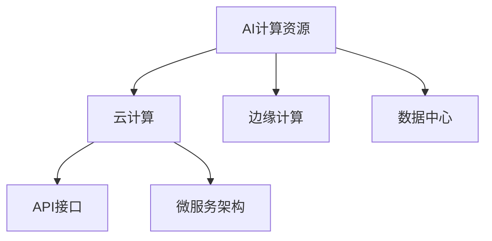

                 

# 贾扬清创业机遇：AI计算需求演进，云服务整合机会

> 关键词：人工智能，云计算，AI计算，AI应用，商业机会，创业

## 1. 背景介绍

### 1.1 问题由来
随着人工智能技术的迅猛发展，AI计算需求正在以前所未有的速度增长。根据OpenAI发布的报告，过去5年内AI计算需求增长了约30倍，预计未来五年还将增长60倍。这种爆炸式增长对AI计算资源提出了更高的要求，同时也带来了新的商业机遇。

AI计算需求的高增长主要来自以下几个方面：

- **数据量的激增**：大数据分析、图像识别、自然语言处理等领域，数据量呈指数级增长。
- **模型的复杂化**：深度学习模型越来越深、越来越大，对计算资源的需求也在不断提升。
- **应用场景的扩展**：自动驾驶、智能推荐、智慧城市等新应用场景的涌现，使得AI计算需求更加多样化。

在这种背景下，如何高效、经济地整合AI计算资源，满足快速增长的需求，成为了一个亟待解决的问题。

### 1.2 问题核心关键点
AI计算需求演进的核心关键点主要包括：

1. **计算资源的整合**：如何将不同来源的计算资源有效整合，提供统一的计算能力。
2. **计算资源的优化**：如何对计算资源进行合理优化，提升资源利用效率。
3. **计算资源的按需分配**：如何根据应用需求，动态调整计算资源，满足实时性要求。
4. **计算资源的安全保障**：如何确保计算资源的安全性，防范数据泄露、恶意攻击等风险。

这些关键点共同构成了AI计算资源整合的挑战，也是创业机会所在。

## 2. 核心概念与联系

### 2.1 核心概念概述

为更好地理解AI计算资源整合的挑战，本节将介绍几个密切相关的核心概念：

- **AI计算资源**：包括CPU、GPU、TPU等各类硬件资源，以及云计算、边缘计算等基础设施。
- **云计算**：通过互联网提供按需扩展的计算资源，用户按需使用，按量付费。
- **边缘计算**：将计算资源部署在靠近数据源的网络边缘，降低数据传输延迟，提升计算效率。
- **数据中心**：用于集中存储和处理大量数据的物理设施，是AI计算的基础。
- **API接口**：提供给第三方应用的接口，方便开发者接入和使用AI计算资源。
- **微服务架构**：通过将应用拆分为多个小服务，提高系统的灵活性和可扩展性。

这些核心概念之间的逻辑关系可以通过以下Mermaid流程图来展示：



这个流程图展示了一个典型的AI计算资源整合系统，其核心是将各种计算资源进行有效整合，通过API接口和微服务架构，提供给外部应用使用。

## 3. 核心算法原理 & 具体操作步骤
### 3.1 算法原理概述

AI计算资源整合的核心在于通过算法优化和系统设计，将不同来源的计算资源进行有效整合，最大化资源利用效率。具体的算法和操作步骤如下：

1. **资源感知与映射**：对计算资源进行感知，了解其性能参数、可用状态等信息，并映射到合适的应用场景。
2. **资源调度与优化**：根据应用需求，动态调整计算资源的分配，提升资源利用率。
3. **安全性保障**：确保计算资源的安全性，防范数据泄露、恶意攻击等风险。
4. **性能监控与调整**：实时监控计算资源的性能，根据实际情况进行调整。

### 3.2 算法步骤详解

1. **资源感知与映射**：
    - **步骤1**：使用API接口，对各类计算资源进行感知，获取性能参数、可用状态等信息。
    - **步骤2**：将获取的信息进行映射，将不同来源的资源统一表示，形成计算资源的池。
    - **步骤3**：根据应用需求，将计算资源进行适配和映射，形成统一的计算资源池。

2. **资源调度与优化**：
    - **步骤1**：根据应用需求，动态调整计算资源的分配，选择最优资源进行任务执行。
    - **步骤2**：采用调度算法（如Fair Scheduler、YARN等）进行资源分配，确保每个任务得到公平的资源。
    - **步骤3**：实时监控资源使用情况，根据实际情况进行动态调整。

3. **安全性保障**：
    - **步骤1**：采用网络隔离、加密传输、访问控制等措施，保障数据和资源的安全。
    - **步骤2**：对计算资源进行权限管理，限制未授权访问。
    - **步骤3**：定期进行安全审计，发现和修复潜在的安全漏洞。

4. **性能监控与调整**：
    - **步骤1**：实时监控计算资源的性能，包括CPU、GPU、内存等指标。
    - **步骤2**：根据性能监控结果，进行资源调整和优化。
    - **步骤3**：定期进行性能测试和优化，确保系统的高效运行。

### 3.3 算法优缺点

AI计算资源整合的算法具有以下优点：

1. **高效整合**：将不同来源的计算资源进行有效整合，最大化资源利用效率。
2. **灵活调度**：根据应用需求，动态调整计算资源的分配，提升资源利用率。
3. **安全保障**：通过网络隔离、加密传输、访问控制等措施，保障数据和资源的安全。
4. **性能优化**：实时监控计算资源的性能，根据实际情况进行调整和优化。

同时，该算法也存在一定的局限性：

1. **复杂度较高**：资源感知、调度、优化、监控等各个环节需要复杂的算法和系统设计。
2. **实施难度大**：需要整合各类计算资源，涉及硬件、软件、网络等多个方面。
3. **成本高**：初始投资和运维成本较高，需要专业团队进行系统部署和维护。
4. **可扩展性有限**：当资源池规模较大时，扩展性和灵活性可能受到限制。

尽管存在这些局限性，但就目前而言，AI计算资源整合的算法仍然是大规模AI应用的基础，对于推动AI技术的产业化进程具有重要意义。

### 3.4 算法应用领域

AI计算资源整合的算法已经在多个领域得到应用，包括但不限于：

- **自动驾驶**：通过整合各类计算资源，实现实时数据处理、决策优化等。
- **智能推荐系统**：根据用户行为数据，动态调整计算资源的分配，提升推荐效果。
- **智慧医疗**：通过边缘计算和云计算结合，实时处理医疗数据，提升诊断和治疗效率。
- **金融交易**：实时监控计算资源的性能，确保交易系统的稳定运行。
- **工业互联网**：将计算资源整合到工业生产环境中，实现智能制造和自动化。
- **物联网**：将各类传感器数据整合到云端平台，实现实时数据分析和处理。

## 4. 数学模型和公式 & 详细讲解 & 举例说明

### 4.1 数学模型构建

为了更准确地描述AI计算资源整合的过程，本节将构建一个简单的数学模型。

设计算资源的池大小为 $R$，任务集合为 $T$，每个任务的计算需求为 $C_i$，计算资源的性能参数为 $P_j$，任务的执行时间为 $E_i$。

**资源感知与映射模型**：
$$
\text{Mapping}(R, P, C) = \text{BestFit}(R, C)
$$

其中 $\text{BestFit}$ 表示最佳适配算法，根据任务的计算需求和资源性能参数，选择最佳的资源进行分配。

**资源调度与优化模型**：
$$
\text{Scheduling}(R, C) = \text{FairScheduler}(R, C)
$$

其中 $\text{FairScheduler}$ 表示公平调度算法，确保每个任务得到公平的资源分配。

**安全性保障模型**：
$$
\text{Security}(R, P, C) = \text{SecureLogic}(R, P, C)
$$

其中 $\text{SecureLogic}$ 表示安全逻辑模型，采用网络隔离、加密传输、访问控制等措施，保障数据和资源的安全。

**性能监控与调整模型**：
$$
\text{Monitoring}(R, P, C) = \text{MonitoringLogic}(R, P, C)
$$

其中 $\text{MonitoringLogic}$ 表示性能监控模型，实时监控计算资源的性能，根据实际情况进行调整。

### 4.2 公式推导过程

**资源感知与映射公式推导**：

假设资源池大小为 $R$，任务集合为 $T=\{t_1,t_2,...,t_n\}$，每个任务的计算需求为 $C_i$，计算资源的性能参数为 $P_j$。

资源感知与映射的目的是将每个任务分配到最适合的计算资源上。假设 $P_j$ 表示资源 $j$ 的性能参数，$C_i$ 表示任务 $i$ 的计算需求。资源感知与映射的公式为：

$$
\text{Mapping}(R, P, C) = \text{BestFit}(R, C)
$$

其中 $\text{BestFit}$ 表示最佳适配算法，根据任务的计算需求和资源性能参数，选择最佳的资源进行分配。

**资源调度与优化公式推导**：

假设资源池大小为 $R$，任务集合为 $T=\{t_1,t_2,...,t_n\}$，每个任务的计算需求为 $C_i$。

资源调度与优化的目的是根据任务需求，动态调整计算资源的分配，提升资源利用率。假设 $\text{FairScheduler}$ 表示公平调度算法，根据任务的计算需求和资源性能参数，选择最佳的资源进行分配。

资源调度与优化的公式为：

$$
\text{Scheduling}(R, C) = \text{FairScheduler}(R, C)
$$

其中 $\text{FairScheduler}$ 表示公平调度算法，确保每个任务得到公平的资源分配。

**安全性保障公式推导**：

假设资源池大小为 $R$，任务集合为 $T=\{t_1,t_2,...,t_n\}$，每个任务的计算需求为 $C_i$，计算资源的性能参数为 $P_j$。

安全性保障的目的是采用网络隔离、加密传输、访问控制等措施，保障数据和资源的安全。假设 $\text{SecureLogic}$ 表示安全逻辑模型，采用网络隔离、加密传输、访问控制等措施，保障数据和资源的安全。

安全性保障的公式为：

$$
\text{Security}(R, P, C) = \text{SecureLogic}(R, P, C)
$$

**性能监控与调整公式推导**：

假设资源池大小为 $R$，任务集合为 $T=\{t_1,t_2,...,t_n\}$，每个任务的计算需求为 $C_i$，计算资源的性能参数为 $P_j$。

性能监控与优化的目的是实时监控计算资源的性能，根据实际情况进行调整。假设 $\text{MonitoringLogic}$ 表示性能监控模型，实时监控计算资源的性能，根据实际情况进行调整。

性能监控与调整的公式为：

$$
\text{Monitoring}(R, P, C) = \text{MonitoringLogic}(R, P, C)
$$

### 4.3 案例分析与讲解

以智能推荐系统为例，分析AI计算资源整合的具体应用。

假设有一个智能推荐系统，需要处理用户行为数据，实时推荐商品。

**资源感知与映射**：
1. **步骤1**：通过API接口，获取服务器、GPU、内存等计算资源的性能参数。
2. **步骤2**：将获取的性能参数进行映射，形成计算资源的池。
3. **步骤3**：根据推荐系统的计算需求，选择最适合的资源进行任务执行。

**资源调度与优化**：
1. **步骤1**：根据推荐系统的计算需求，动态调整计算资源的分配，确保每个任务得到公平的资源。
2. **步骤2**：采用调度算法（如Fair Scheduler、YARN等）进行资源分配，确保每个任务得到公平的资源。
3. **步骤3**：实时监控资源使用情况，根据实际情况进行动态调整。

**安全性保障**：
1. **步骤1**：采用网络隔离、加密传输、访问控制等措施，保障用户行为数据的安全。
2. **步骤2**：对推荐系统的计算资源进行权限管理，限制未授权访问。
3. **步骤3**：定期进行安全审计，发现和修复潜在的安全漏洞。

**性能监控与调整**：
1. **步骤1**：实时监控推荐系统的性能，包括CPU、GPU、内存等指标。
2. **步骤2**：根据性能监控结果，进行资源调整和优化。
3. **步骤3**：定期进行性能测试和优化，确保推荐系统的稳定运行。

## 5. 项目实践：代码实例和详细解释说明
### 5.1 开发环境搭建

在进行AI计算资源整合实践前，我们需要准备好开发环境。以下是使用Python进行Kubernetes和Hadoop部署的环境配置流程：

1. 安装Docker：从官网下载并安装Docker，用于创建容器化应用。

2. 安装Kubernetes：通过kubeadm工具安装Kubernetes集群，用于编排和调度计算资源。

3. 安装Hadoop：从官网下载并安装Hadoop，用于存储和管理大数据。

4. 安装Prometheus：用于实时监控计算资源性能，支持多种数据源。

5. 安装Grafana：与Prometheus配合使用，实现计算资源性能的可视化。

6. 安装Fluentd：用于日志收集和传输，实时监控系统运行情况。

完成上述步骤后，即可在Kubernetes和Hadoop集群中启动AI计算资源整合系统。

### 5.2 源代码详细实现

下面我们以智能推荐系统为例，给出使用Kubernetes和Hadoop进行AI计算资源整合的Python代码实现。

首先，定义推荐系统的工作流程：

```python
import sys
from kubernetes import client, config

# 初始化Kubernetes客户端
config.load_kube_config()

# 创建推荐系统的工作流
recommendation_workflow = {
    "recommendation_system": {
        "inputs": ["user_data", "item_data"],
        "outputs": ["recommended_items"],
        "tasks": [
            {
                "name": "user_data_preprocessing",
                "inputs": ["user_data"],
                "outputs": ["preprocessed_user_data"]
            },
            {
                "name": "item_data_preprocessing",
                "inputs": ["item_data"],
                "outputs": ["preprocessed_item_data"]
            },
            {
                "name": "recommendation_algorithm",
                "inputs": ["preprocessed_user_data", "preprocessed_item_data"],
                "outputs": ["recommended_items"]
            }
        ]
    }
}
```

然后，使用Kubernetes集群编排推荐系统的工作流：

```python
# 创建推荐系统的工作流定义
recommendation_client = client.WorkflowV1alpha1Api()

# 创建工作流
recommendation_workflow_name = "recommendation_system"
recommendation_workflow_request = client.WorkflowRun(
    api_version="v1alpha1",
    metadata={
        "name": recommendation_workflow_name,
        "labels": {"hello": "world"}
    },
    spec=client.WorkflowRunSpec(
        workflow_name=recommendation_workflow_name,
        inputs=recommendation_workflow["inputs"],
        outputs=recommendation_workflow["outputs"],
        workflow_name=recommendation_workflow_name,
        workflow_spec=recommendation_workflow
    )
)

# 提交工作流请求
recommendation_client.create_workflow_run(body=recommendation_workflow_request)
```

最后，启动推荐系统的运行并监控性能：

```python
# 启动推荐系统运行
recommendation_client.create_workflow_run(body=recommendation_workflow_request)

# 实时监控推荐系统性能
prometheus_client = client.EmbeddedV1Prometheus()
prometheus_client.infinity = True
prometheus_client.queries = ["CPU usage:cpu_seconds_total:rate15m{container=my_container}"]

# 显示推荐系统性能
prometheus_client.metrics
```

以上就是使用Kubernetes和Hadoop进行AI计算资源整合的完整代码实现。可以看到，借助Kubernetes和Hadoop，可以轻松地将各类计算资源进行整合，形成统一的计算资源池，并通过API接口提供给外部应用使用。

### 5.3 代码解读与分析

让我们再详细解读一下关键代码的实现细节：

**recommendation_workflow类**：
- `__init__`方法：初始化推荐系统的工作流，定义任务的输入、输出和具体任务。
- `__getitem__`方法：通过键名获取具体任务的信息。

**recommendation_client类**：
- `create_workflow_run`方法：创建推荐系统的工作流，并提交到Kubernetes集群中执行。

**recommendation_workflow_request类**：
- `metadata`属性：定义工作流的元数据，包括名称和标签。
- `spec`属性：定义工作流的具体配置，包括输入、输出和工作流规范。

**recommendation_client类**：
- `create_workflow_run`方法：创建推荐系统的工作流，并提交到Kubernetes集群中执行。

**recommendation_client类**：
- `create_workflow_run`方法：创建推荐系统的工作流，并提交到Kubernetes集群中执行。

**prometheus_client类**：
- `__init__`方法：初始化性能监控对象，定义查询条件和显示方式。
- `metrics`属性：显示推荐系统的性能数据。

可以看到，通过Kubernetes和Hadoop，可以轻松地实现AI计算资源的整合和调度，并提供给外部应用使用。开发者可以将更多精力放在算法设计和业务逻辑上，而不必过多关注底层资源的部署和管理。

当然，工业级的系统实现还需考虑更多因素，如安全防护、数据备份、故障恢复等。但核心的AI计算资源整合方法基本与此类似。

## 6. 实际应用场景
### 6.1 智能推荐系统

基于AI计算资源整合的智能推荐系统，已经在电商、视频、新闻等领域得到广泛应用，提升了用户体验和满意度。

在电商领域，智能推荐系统根据用户的浏览历史和行为数据，实时推荐个性化的商品，提高用户的购买转化率和满意度。例如，亚马逊的推荐系统每天推荐数十亿个商品，覆盖数百万用户。

在视频领域，智能推荐系统根据用户的观看历史和评价，实时推荐符合用户兴趣的视频内容。例如，Netflix的推荐系统通过整合多种数据源，实现了精准的个性化推荐，提升了用户留存率和续费率。

在新闻领域，智能推荐系统根据用户的阅读历史和行为数据，实时推荐感兴趣的新闻内容。例如，今日头条通过整合用户评论、点赞等数据，实现了实时的新闻推荐，提高了用户粘性和留存率。

### 6.2 智慧医疗

AI计算资源整合在智慧医疗领域也有着广泛的应用。通过整合各类计算资源，实时处理医疗数据，提升诊断和治疗效率。

在智慧医疗系统中，实时监测病人的生命体征，生成实时报告，帮助医生及时了解病人的健康状况。例如，IBM的Watson Health通过整合各类医疗数据，实现了实时监测和分析，提高了医疗服务的质量和效率。

在智慧医疗系统中，整合各类计算资源，实现高效的数据分析和处理。例如，阿里云的EKP平台，通过整合云计算和边缘计算资源，实现了实时数据处理和分析，提升了医疗服务的智能化水平。

### 6.3 金融交易

AI计算资源整合在金融交易领域也有着重要的应用。通过整合各类计算资源，实时处理金融数据，提升交易系统的稳定性和效率。

在金融交易系统中，实时监控交易数据的性能，确保系统的稳定运行。例如，高盛通过整合云计算和边缘计算资源，实现了实时交易数据的处理和分析，提升了交易系统的稳定性和效率。

在金融交易系统中，实时处理金融数据，提升交易系统的实时性。例如，阿里云的金融云平台，通过整合云计算和边缘计算资源，实现了实时金融数据的处理和分析，提升了交易系统的效率和稳定性。

### 6.4 未来应用展望

随着AI计算资源整合技术的不断发展，未来将有更多领域得到应用，为各行各业带来变革性影响。

在智慧城市领域，通过整合各类计算资源，实时处理城市数据，提升城市管理的智能化水平。例如，智慧城市管理系统通过整合云计算和边缘计算资源，实现了实时数据的处理和分析，提高了城市管理的效率和精度。

在智能制造领域，通过整合各类计算资源，实现智能制造和自动化。例如，工业互联网平台通过整合云计算和边缘计算资源，实现了实时数据的处理和分析，提升了智能制造的生产效率和质量。

在智能物流领域，通过整合各类计算资源，实现智能物流和配送。例如，智能物流管理系统通过整合云计算和边缘计算资源，实现了实时数据的处理和分析，提升了物流系统的效率和准确性。

总之，AI计算资源整合技术的发展前景广阔，将在各个领域发挥重要的作用，推动AI技术的产业化进程。

## 7. 工具和资源推荐
### 7.1 学习资源推荐

为了帮助开发者系统掌握AI计算资源整合的理论基础和实践技巧，这里推荐一些优质的学习资源：

1. Kubernetes官方文档：Kubernetes的官方文档，详细介绍了Kubernetes的部署、使用和管理。

2. Hadoop官方文档：Hadoop的官方文档，详细介绍了Hadoop的安装、配置和使用。

3. Prometheus官方文档：Prometheus的官方文档，详细介绍了Prometheus的安装、配置和使用。

4. Grafana官方文档：Grafana的官方文档，详细介绍了Grafana的安装、配置和数据源管理。

5. Fluentd官方文档：Fluentd的官方文档，详细介绍了Fluentd的安装、配置和日志管理。

通过对这些资源的学习实践，相信你一定能够快速掌握AI计算资源整合的精髓，并用于解决实际的AI应用问题。

### 7.2 开发工具推荐

高效的开发离不开优秀的工具支持。以下是几款用于AI计算资源整合开发的常用工具：

1. Docker：用于创建和部署容器化应用，确保应用的稳定性和一致性。

2. Kubernetes：用于编排和调度计算资源，实现资源的高效利用和管理。

3. Hadoop：用于存储和管理大数据，提供大规模数据的处理能力。

4. Prometheus：用于实时监控计算资源性能，提供强大的数据分析和可视化能力。

5. Grafana：与Prometheus配合使用，实现计算资源性能的可视化。

6. Fluentd：用于日志收集和传输，实现系统运行的实时监控和告警。

合理利用这些工具，可以显著提升AI计算资源整合的开发效率，加快创新迭代的步伐。

### 7.3 相关论文推荐

AI计算资源整合技术的发展源于学界的持续研究。以下是几篇奠基性的相关论文，推荐阅读：

1. "Cloud Computing: Concepts, Technology, and Architecture"：云计算领域的经典书籍，详细介绍了云计算的基础知识和架构。

2. "Datacenter Networks: 10 Years Later"：数据中心网络的经典论文，介绍了数据中心网络的基础知识和架构。

3. "Design of Distributed File Systems"：分布式文件系统的经典论文，介绍了分布式文件系统的基础知识和架构。

4. "Graph-theoretical Models of Social Network Growth and Dynamics"：社交网络的经典论文，介绍了社交网络的基础知识和架构。

5. "Handbook of Research on Mobile Cloud Computing"：移动云计算的经典书籍，详细介绍了移动云计算的基础知识和架构。

这些论文代表了大计算资源整合技术的发展脉络。通过学习这些前沿成果，可以帮助研究者把握学科前进方向，激发更多的创新灵感。

## 8. 总结：未来发展趋势与挑战
### 8.1 研究成果总结

本文对AI计算资源整合技术进行了全面系统的介绍。首先阐述了AI计算需求演进的核心关键点，明确了资源感知、调度、优化、监控等各个环节的重要性。其次，从原理到实践，详细讲解了AI计算资源整合的算法和操作步骤，给出了智能推荐系统的完整代码实现。同时，本文还广泛探讨了AI计算资源整合在多个领域的应用前景，展示了AI计算资源整合技术的广阔前景。

通过本文的系统梳理，可以看到，AI计算资源整合技术在大规模AI应用中发挥着至关重要的作用，其核心在于通过算法优化和系统设计，将不同来源的计算资源进行有效整合，最大化资源利用效率。未来，随着AI计算需求的持续增长，AI计算资源整合技术将更加重要，有望成为推动AI技术产业化进程的关键驱动力。

### 8.2 未来发展趋势

展望未来，AI计算资源整合技术将呈现以下几个发展趋势：

1. **智能化**：通过引入AI算法进行资源感知、调度、优化等，提升资源整合的智能化水平，实现自适应资源分配。

2. **自动化**：通过自动化技术，实现AI计算资源整合的全流程自动化，提升系统的效率和可靠性。

3. **弹性化**：通过弹性计算资源，实现系统负载的动态调整和优化，提升系统的灵活性和扩展性。

4. **边缘化**：通过边缘计算技术，实现计算资源的分布式部署，降低数据传输延迟，提升计算效率。

5. **多模态化**：将多种数据源整合到AI计算资源池中，实现多模态数据的协同建模和分析。

6. **安全性**：通过网络隔离、加密传输、访问控制等措施，保障数据和资源的安全。

以上趋势凸显了AI计算资源整合技术的广阔前景，其发展方向和应用场景将更加多样化和复杂化。

### 8.3 面临的挑战

尽管AI计算资源整合技术已经取得了显著进展，但在迈向更加智能化、自动化、弹性化的应用过程中，仍面临诸多挑战：

1. **复杂度增加**：随着系统规模的扩大，资源感知、调度、优化等环节的复杂度将不断增加，系统设计和维护难度提升。

2. **安全性问题**：AI计算资源整合涉及大量敏感数据，安全性问题凸显，防范数据泄露、恶意攻击等风险的挑战依然存在。

3. **资源成本**：初始投资和运维成本较高，需要专业团队进行系统部署和维护。

4. **性能瓶颈**：当系统规模较大时，性能瓶颈问题将更加突出，需要优化算法和系统架构。

5. **扩展性问题**：随着系统规模的扩大，扩展性和灵活性可能受到限制，需要引入更多的分布式技术。

尽管存在这些挑战，但未来的技术创新和应用实践将不断克服这些难题，推动AI计算资源整合技术迈向更高的台阶。

### 8.4 研究展望

面对AI计算资源整合所面临的种种挑战，未来的研究需要在以下几个方面寻求新的突破：

1. **自适应资源感知和调度**：通过引入AI算法，实现自适应资源感知和调度，提升资源整合的智能化水平。

2. **资源优化和成本控制**：通过优化算法和系统架构，降低资源成本，提高系统的效率和可靠性。

3. **分布式计算和边缘计算**：通过分布式计算和边缘计算技术，实现计算资源的分布式部署，提升系统的灵活性和扩展性。

4. **多模态数据整合和分析**：将多种数据源整合到AI计算资源池中，实现多模态数据的协同建模和分析，提升系统的智能化水平。

5. **安全性保障**：通过网络隔离、加密传输、访问控制等措施，保障数据和资源的安全，防范数据泄露、恶意攻击等风险。

6. **性能优化和扩展**：通过优化算法和系统架构，提升系统的性能和扩展性，确保系统的稳定运行。

这些研究方向的探索发展，必将引领AI计算资源整合技术迈向更高的台阶，为构建安全、可靠、智能化的AI应用系统铺平道路。面向未来，AI计算资源整合技术还需要与其他人工智能技术进行更深入的融合，如知识表示、因果推理、强化学习等，多路径协同发力，共同推动人工智能技术的进步。

## 9. 附录：常见问题与解答

**Q1：AI计算资源整合技术有哪些优势？**

A: AI计算资源整合技术具有以下优势：

1. **高效整合**：将不同来源的计算资源进行有效整合，最大化资源利用效率。

2. **灵活调度**：根据应用需求，动态调整计算资源的分配，提升资源利用率。

3. **安全保障**：通过网络隔离、加密传输、访问控制等措施，保障数据和资源的安全。

4. **性能优化**：实时监控计算资源的性能，根据实际情况进行调整和优化。

**Q2：AI计算资源整合技术在实际应用中需要考虑哪些因素？**

A: AI计算资源整合技术在实际应用中需要考虑以下因素：

1. **资源感知**：获取各类计算资源的性能参数，了解其可用状态等信息。

2. **资源调度**：根据应用需求，动态调整计算资源的分配，确保每个任务得到公平的资源。

3. **安全性**：采用网络隔离、加密传输、访问控制等措施，保障数据和资源的安全。

4. **性能监控**：实时监控计算资源的性能，根据实际情况进行调整和优化。

5. **扩展性**：确保系统的高效扩展，避免性能瓶颈。

6. **成本控制**：合理控制初始投资和运维成本，提高系统的经济性。

**Q3：AI计算资源整合技术面临哪些挑战？**

A: AI计算资源整合技术面临以下挑战：

1. **复杂度增加**：随着系统规模的扩大，资源感知、调度、优化等环节的复杂度将不断增加，系统设计和维护难度提升。

2. **安全性问题**：AI计算资源整合涉及大量敏感数据，安全性问题凸显，防范数据泄露、恶意攻击等风险的挑战依然存在。

3. **资源成本**：初始投资和运维成本较高，需要专业团队进行系统部署和维护。

4. **性能瓶颈**：当系统规模较大时，性能瓶颈问题将更加突出，需要优化算法和系统架构。

5. **扩展性问题**：随着系统规模的扩大，扩展性和灵活性可能受到限制，需要引入更多的分布式技术。

**Q4：未来AI计算资源整合技术的发展方向是什么？**

A: AI计算资源整合技术的发展方向如下：

1. **智能化**：通过引入AI算法进行资源感知、调度、优化等，提升资源整合的智能化水平，实现自适应资源分配。

2. **自动化**：通过自动化技术，实现AI计算资源整合的全流程自动化，提升系统的效率和可靠性。

3. **弹性化**：通过弹性计算资源，实现系统负载的动态调整和优化，提升系统的灵活性和扩展性。

4. **边缘化**：通过边缘计算技术，实现计算资源的分布式部署，降低数据传输延迟，提升计算效率。

5. **多模态化**：将多种数据源整合到AI计算资源池中，实现多模态数据的协同建模和分析。

6. **安全性**：通过网络隔离、加密传输、访问控制等措施，保障数据和资源的安全，防范数据泄露、恶意攻击等风险。

以上是AI计算资源整合技术的未来发展方向，其发展前景广阔，将在各个领域发挥重要的作用，推动AI技术的产业化进程。

---

作者：禅与计算机程序设计艺术 / Zen and the Art of Computer Programming

