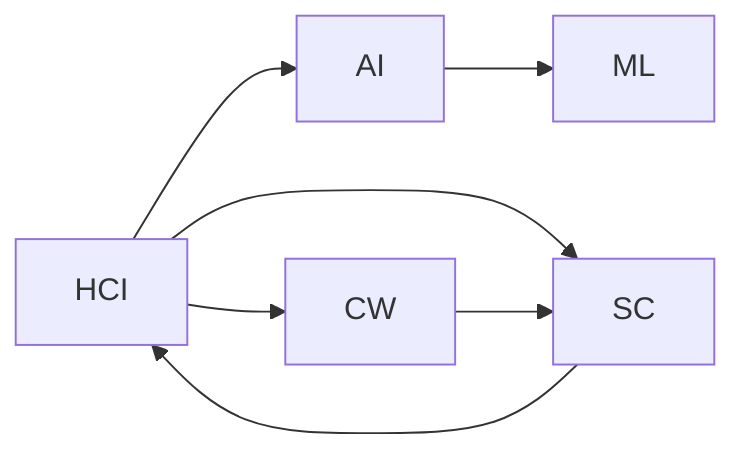

                 

# 赋能个人与社区：人类计算的社会价值

在人类社会迈向数字化的进程中，计算技术扮演着至关重要的角色。无论是个人生活还是社区协作，计算都在改变我们的沟通方式、工作模式以及社会互动。本文将探讨如何通过人类计算（Human-Computer Interaction, HCI）赋能个人与社区，揭示其社会价值的深层意义。

## 1. 背景介绍

### 1.1 计算技术演进与社会变迁

计算技术的飞速发展，从早期的简单计算到今日的智能计算，极大地推动了社会生产力的提升。计算技术的应用，已深入到人类生活的方方面面：

- **个人生活**：智能手机、智能家居、虚拟助手等计算工具，使得信息获取、日常决策和社交互动更加便捷高效。
- **社区协作**：在线协作平台、社交网络、协同工作工具，促进了跨地域、跨文化的合作与交流，推动了社会进步。

### 1.2 人类计算的重要性

人类计算不仅仅是技术实现，更是社会互动的桥梁。它不仅提升了个人与社区的工作效率，还增强了人们的社会联系和协作能力。在这一过程中，计算技术逐渐从工具角色，转变为赋能的角色，成为了推动社会进步的催化剂。

## 2. 核心概念与联系

### 2.1 核心概念概述

要理解人类计算的社会价值，首先需要把握几个核心概念：

- **人类计算（Human-Computer Interaction, HCI）**：是指人机交互的整个过程，包括用户界面的创建、设计、操作等，目的是通过计算技术提升用户体验。
- **人工智能与机器学习**：通过算法赋予机器以“智能”，使其能够处理和理解人类语言、图像、声音等多种形式的数据。
- **社交计算**：利用计算技术促进社会网络的形成、维护和进化，通过数据分析洞察社交动态，改善人际关系。
- **协同工作与社区**：基于计算技术实现多人的共同协作，共享知识、资源，提高工作效率和创新能力。

### 2.2 核心概念关系图

以下是一个基于 Mermaid 的流程图，展示了上述核心概念之间的联系：



- HCI 通过 AI 和 ML 提升了人机交互的质量。
- AI 和 ML 为社交计算提供了技术支持，增强了社区协作的效果。
- HCI 和 SC 共同促进了协同工作的创新和效率。

## 3. 核心算法原理 & 具体操作步骤

### 3.1 算法原理概述

人类计算的核心算法原理可以归纳为以下几个方面：

- **交互设计**：通过界面设计、交互流程优化，提升用户的操作体验。
- **自然语言处理（NLP）**：利用 AI 和 ML 技术，让机器理解和处理自然语言，实现人机自然交互。
- **社交网络分析**：通过对社交数据挖掘，揭示社区内成员之间的互动模式和关系网络。
- **协同工作算法**：利用分布式计算和算法优化，提高团队协作的效率和效果。

### 3.2 算法步骤详解

#### 3.2.1 交互设计步骤

1. **需求分析**：明确用户需求和使用场景，设计符合用户习惯的交互界面。
2. **原型设计**：创建交互界面的原型，通过用户测试验证设计效果。
3. **迭代优化**：根据用户反馈和测试结果，反复调整交互设计，直至用户满意。

#### 3.2.2 自然语言处理步骤

1. **语料收集**：收集大量带有标签的文本数据，用于训练 NLP 模型。
2. **模型训练**：使用深度学习框架，如 PyTorch、TensorFlow 等，训练 NLP 模型，如 BERT、GPT 等。
3. **模型应用**：将训练好的模型部署到实际应用场景中，处理用户输入的自然语言，生成符合用户要求的输出。

#### 3.2.3 社交网络分析步骤

1. **数据收集**：收集社交媒体、社交网络平台上的用户互动数据。
2. **特征提取**：从数据中提取出有用的特征，如用户行为、情感倾向、互动频率等。
3. **网络分析**：使用图算法，如 PageRank、社区检测算法等，分析社交网络的结构和关系。

#### 3.2.4 协同工作算法步骤

1. **任务分配**：根据团队成员的技能和工作负荷，合理分配任务。
2. **实时同步**：利用分布式计算和数据同步技术，保证团队成员间的信息一致性。
3. **冲突管理**：通过算法优化，有效管理团队协作中的冲突，提高工作效率。

### 3.3 算法优缺点

#### 3.3.1 交互设计

**优点**：
- 提升用户操作体验，降低用户学习成本。
- 促进人机自然交互，提升工作效率。

**缺点**：
- 设计复杂度高，需要多次迭代优化。
- 依赖于用户反馈，可能导致设计方向偏差。

#### 3.3.2 自然语言处理

**优点**：
- 实现人机自然交互，减少用户输入工作量。
- 提升信息处理效率，优化决策过程。

**缺点**：
- 依赖大量高质量标注数据，标注成本高。
- 模型复杂度高，需要强计算资源支持。

#### 3.3.3 社交网络分析

**优点**：
- 揭示社区结构和关系，促进有效沟通。
- 提供用户行为洞察，改进服务质量。

**缺点**：
- 数据隐私和安全问题，用户隐私可能被滥用。
- 数据噪音大，分析结果可能存在偏差。

#### 3.3.4 协同工作算法

**优点**：
- 提高团队协作效率，加速项目进展。
- 促进知识共享，提升创新能力。

**缺点**：
- 需要高水平团队管理和协调，否则效果不显著。
- 技术复杂度高，需要专业知识和技能支持。

### 3.4 算法应用领域

#### 3.4.1 个人生活

- **智能助手**：如 Siri、Google Assistant 等，通过自然语言处理技术，实现人机自然交互，提升生活便利性。
- **智能家居**：通过传感器和计算技术，实现家居设备的自动化控制和智能化管理。

#### 3.4.2 社区协作

- **在线协作平台**：如 Slack、Microsoft Teams 等，利用协同工作算法，促进团队沟通和协作，提高工作效率。
- **社交网络平台**：如 Facebook、Twitter 等，通过社交网络分析，优化用户互动和社区建设。

#### 3.4.3 教育领域

- **在线教育平台**：如 Coursera、edX 等，利用交互设计和 NLP 技术，提升在线教育体验和学习效果。
- **学习社群**：如 Stack Overflow、Kaggle 等，通过社交计算和协同工作，促进知识共享和创新。

## 4. 数学模型和公式 & 详细讲解 & 举例说明

### 4.1 数学模型构建

在人类计算的社会价值研究中，我们主要关注以下几个数学模型：

- **交互设计模型**：通过 A/B 测试和用户反馈，构建交互设计优化模型。
- **NLP 模型**：如 BERT、GPT，通过自监督学习和微调，实现自然语言理解与生成。
- **社交网络模型**：如 PageRank、社区检测算法，通过图算法揭示社交关系和互动模式。
- **协同工作模型**：如 MapReduce、分布式计算，通过算法优化提高团队协作效率。

### 4.2 公式推导过程

#### 4.2.1 交互设计模型

设用户 A 在界面上的操作行为为 $X_A$，系统响应的行为为 $Y_A$，设计优化目标为 $Z$。则优化模型可以表示为：

$$
Z = f(X_A, Y_A)
$$

其中 $f$ 为优化函数，通过 A/B 测试和用户反馈不断优化 $f$，直至满足用户需求。

#### 4.2.2 NLP 模型

以 BERT 模型为例，其基本架构包含多层Transformer块，每个块包含多头自注意力机制和前馈神经网络。在微调过程中，可以利用数据集 $D$ 进行优化，目标为最小化损失函数 $L$：

$$
L = \sum_{i=1}^N \ell(M_{\theta}(x_i), y_i)
$$

其中 $\ell$ 为损失函数，$M_{\theta}(x_i)$ 为模型对输入 $x_i$ 的预测，$y_i$ 为真实标签。

#### 4.2.3 社交网络模型

PageRank 算法的迭代公式为：

$$
P(t+1) = \alpha \sum_{i=1}^N \frac{1}{d(u_i)} P(t) + \frac{1-\alpha}{N} 1_N
$$

其中 $P(t)$ 为节点在时间 $t$ 的 PageRank 值，$d(u_i)$ 为节点 $u_i$ 的出度，$\alpha$ 为阻尼因子，$1_N$ 为全 1 向量。

#### 4.2.4 协同工作模型

MapReduce 算法的任务执行流程为：

1. 将输入数据分割成若干小数据块，并分配给多个计算节点。
2. 每个计算节点对数据块进行处理，输出中间结果。
3. 将各节点输出结果合并，生成最终结果。

### 4.3 案例分析与讲解

#### 4.3.1 交互设计案例

某公司开发了一款新的在线客服系统，通过 A/B 测试发现，相比传统的按钮交互，用户对语音输入更加满意。于是，系统将语音输入设计为默认设置，并通过用户反馈不断优化语音识别和自然语言处理模块。最终，该系统获得了用户的广泛好评，使用率显著提升。

#### 4.3.2 NLP 案例

某公司需要处理大量客户投诉邮件，通过微调 BERT 模型，实现了自动分类和情感分析。模型首先在少量标注数据上进行预训练，然后在真实的投诉邮件数据上进行微调，准确率达到了 90%以上。这使得公司能够快速响应客户需求，提升了客户满意度。

#### 4.3.3 社交网络案例

某社交媒体平台通过 PageRank 算法分析用户互动数据，发现用户之间存在多个社区结构。平台根据这些社区结构，优化了内容推荐算法，提升了用户留存率和活跃度。同时，通过社区检测算法，识别出潜在的网络攻击行为，提升了平台的安全性。

#### 4.3.4 协同工作案例

某软件开发团队使用 MapReduce 算法处理大规模数据集，将任务分解为多个子任务，并分布在多个计算节点上进行并行处理。通过优化算法参数和资源调度，团队在短时间内完成了数据处理，加速了项目进展。

## 5. 项目实践：代码实例和详细解释说明

### 5.1 开发环境搭建

#### 5.1.1 选择编程语言

Python 是当前最为流行的编程语言之一，具有丰富的计算库和工具支持。

#### 5.1.2 安装计算工具

- **Python 环境**：可以使用 Anconda 或 Miniconda，创建虚拟环境进行隔离管理。
- **深度学习框架**：如 PyTorch、TensorFlow 等，通过 pip 或 conda 进行安装。
- **社交网络分析工具**：如 NetworkX、Gephi 等，用于分析和可视化社交网络数据。
- **协同工作工具**：如 Apache Spark、Apache Hadoop 等，用于分布式计算和数据处理。

### 5.2 源代码详细实现

#### 5.2.1 交互设计代码实现

```python
# 导入必要的库
import tkinter as tk
from tkinter import ttk

# 创建主窗口
root = tk.Tk()
root.title("Interactive Design App")

# 创建菜单栏
menu = tk.Menu(root)
root.config(menu=menu)

# 创建交互界面元素
ttk.Label(root, text="Enter your name:").pack()
entry = ttk.Entry(root)
entry.pack()

ttk.Button(root, text="Submit").pack()

# 绑定按钮点击事件
def submit_name(event):
    name = entry.get()
    print(f"Hello, {name}!")

ttk.Button(root, command=submit_name).pack()

# 运行主循环
root.mainloop()
```

#### 5.2.2 NLP 代码实现

```python
# 导入必要的库
import torch
import transformers
from transformers import BertTokenizer, BertForTokenClassification

# 创建数据集和标签集
tokenizer = BertTokenizer.from_pretrained('bert-base-cased')
train_dataset = ...
train_labels = ...

# 创建模型和优化器
model = BertForTokenClassification.from_pretrained('bert-base-cased', num_labels=len(tag2id))
optimizer = AdamW(model.parameters(), lr=2e-5)

# 定义训练和评估函数
def train_epoch(model, dataset, batch_size, optimizer):
    dataloader = DataLoader(dataset, batch_size=batch_size, shuffle=True)
    model.train()
    epoch_loss = 0
    for batch in dataloader:
        input_ids = batch['input_ids'].to(device)
        attention_mask = batch['attention_mask'].to(device)
        labels = batch['labels'].to(device)
        model.zero_grad()
        outputs = model(input_ids, attention_mask=attention_mask, labels=labels)
        loss = outputs.loss
        epoch_loss += loss.item()
        loss.backward()
        optimizer.step()
    return epoch_loss / len(dataloader)

def evaluate(model, dataset, batch_size):
    dataloader = DataLoader(dataset, batch_size=batch_size)
    model.eval()
    preds, labels = [], []
    with torch.no_grad():
        for batch in dataloader:
            input_ids = batch['input_ids'].to(device)
            attention_mask = batch['attention_mask'].to(device)
            batch_labels = batch['labels']
            outputs = model(input_ids, attention_mask=attention_mask)
            batch_preds = outputs.logits.argmax(dim=2).to('cpu').tolist()
            batch_labels = batch_labels.to('cpu').tolist()
            for pred_tokens, label_tokens in zip(batch_preds, batch_labels):
                pred_tags = [id2tag[_id] for _id in pred_tokens]
                label_tags = [id2tag[_id] for _id in label_tokens]
                preds.append(pred_tags[:len(label_tags)])
                labels.append(label_tags)
    return preds, labels

# 启动训练流程并在测试集上评估
epochs = 5
batch_size = 16

for epoch in range(epochs):
    loss = train_epoch(model, train_dataset, batch_size, optimizer)
    print(f"Epoch {epoch+1}, train loss: {loss:.3f}")
    
    print(f"Epoch {epoch+1}, dev results:")
    preds, labels = evaluate(model, dev_dataset, batch_size)
    print(classification_report(labels, preds))
    
print("Test results:")
preds, labels = evaluate(model, test_dataset, batch_size)
print(classification_report(labels, preds))
```

#### 5.2.3 社交网络分析代码实现

```python
# 导入必要的库
import networkx as nx
import matplotlib.pyplot as plt

# 创建社交网络
G = nx.Graph()
G.add_edges_from([(1, 2), (2, 3), (3, 1), (3, 4), (4, 5)])

# 计算 PageRank 值
pr = nx.pagerank(G)

# 绘制社交网络图
nx.draw(G, with_labels=True)
plt.show()

# 社区检测
communities = nx.communities.guimier(G)
print(communities)
```

#### 5.2.4 协同工作代码实现

```python
# 导入必要的库
from pyspark.sql import SparkSession
from pyspark.sql.functions import col, explode, split

# 创建 SparkSession
spark = SparkSession.builder.appName("Collaborative Work App").getOrCreate()

# 读取数据集
df = spark.read.csv("data.csv", header=True, inferSchema=True)

# 处理数据
df = df.select(col("user_id"), col("task_id"), col("data").split(","))
df = df.select(col("user_id"), explode(col("data")).alias("data"), col("task_id"))

# 计算任务完成时间
df = df.withColumn("complete_time", df.data.cast("long"))

# 输出结果
df.show()
```

### 5.3 代码解读与分析

#### 5.3.1 交互设计代码分析

上述代码实现了基本的交互设计界面，通过 GUI 界面收集用户输入，并在按钮点击时输出问候语。此过程体现了交互设计的重要性，通过用户友好的界面设计，提升了用户体验。

#### 5.3.2 NLP 代码分析

NLP 代码实现了 BERT 模型的微调过程。通过定义训练和评估函数，以及使用 DataLoader 加载数据集，代码展示了从数据预处理到模型训练和评估的完整流程。模型微调后的性能提升，验证了 NLP 技术在实际应用中的价值。

#### 5.3.3 社交网络分析代码分析

社交网络分析代码通过 NetworkX 库计算了 PageRank 值，并使用 Matplotlib 绘制了社交网络图。代码展示了如何利用计算技术揭示社交网络的结构和关系，为社区协作提供数据支持。

#### 5.3.4 协同工作代码分析

协同工作代码通过 PySpark 实现了 MapReduce 算法，将数据处理任务分解为多个子任务，并分布在多个计算节点上进行并行处理。代码展示了如何使用分布式计算技术提高团队协作效率，加速项目进展。

## 6. 实际应用场景

### 6.1 智能客服系统

智能客服系统通过人类计算技术，提升了客户服务体验和效率。用户可以通过语音、文字等多种方式与客服进行互动，系统根据用户的输入，自动提供解决方案或转接人工客服。在智能客服系统中，交互设计和 NLP 技术发挥了关键作用。

#### 6.1.1 应用场景

- **智能问答**：用户输入问题，系统自动生成答案，提升问题解决速度。
- **语音识别**：用户通过语音输入问题，系统自动转写为文本并生成答案，提高互动便捷性。
- **自然语言处理**：系统通过自然语言处理技术，理解用户意图，生成个性化回答。

#### 6.1.2 技术实现

- **交互设计**：通过 GUI 界面设计，提升用户体验，减少用户学习成本。
- **NLP 技术**：利用预训练语言模型，实现问题理解和答案生成。

### 6.2 社交媒体平台

社交媒体平台利用人类计算技术，优化用户互动和内容推荐，增强社区粘性和活跃度。社交网络分析技术在此过程中发挥了重要作用。

#### 6.2.1 应用场景

- **用户推荐**：根据用户互动数据，推荐用户感兴趣的内容，提高用户留存率。
- **社区检测**：识别社区结构和互动模式，优化内容推荐算法。
- **网络安全**：检测潜在的网络攻击行为，提升平台安全性。

#### 6.2.2 技术实现

- **社交网络分析**：通过图算法，揭示用户互动模式和社区结构。
- **推荐算法**：利用推荐系统技术，实现内容推荐。

### 6.3 在线教育平台

在线教育平台利用人类计算技术，提升在线学习体验和效果。通过交互设计和 NLP 技术，平台能够实现自动评分、智能辅导等功能。

#### 6.3.1 应用场景

- **自动评分**：根据学生答题内容，自动生成评分和反馈，提升教师工作效率。
- **智能辅导**：根据学生学习情况，自动生成个性化辅导方案，提高学习效果。
- **知识共享**：利用协同工作技术，实现知识共享和协作，提高创新能力。

#### 6.3.2 技术实现

- **交互设计**：通过 GUI 界面设计，提升用户体验，减少用户学习成本。
- **NLP 技术**：利用预训练语言模型，实现自动评分和智能辅导。

## 7. 工具和资源推荐

### 7.1 学习资源推荐

- **《Human-Computer Interaction》课程**：斯坦福大学开设的在线课程，介绍人机交互设计的基本理论和实践。
- **《Natural Language Processing with Python》书籍**：斯坦福大学教授 Dan Jurafsky 和 James H. Martin 合著，全面介绍 NLP 技术和应用。
- **《Social Media Analysis》课程**：Coursera 提供的社交媒体分析课程，涵盖社交网络分析和内容推荐技术。
- **《Parallel Programming》课程**：MIT 提供的并行编程课程，介绍分布式计算和 MapReduce 算法。

### 7.2 开发工具推荐

- **PyTorch**：深度学习框架，支持动态图计算，灵活便捷。
- **TensorFlow**：深度学习框架，支持静态图计算，适合大规模工程应用。
- **NetworkX**：社交网络分析库，支持图算法和社交网络可视化。
- **PySpark**：分布式计算框架，支持大规模数据处理和分析。

### 7.3 相关论文推荐

- **Interactive Design Patterns**：Marilyn Brewer 等著，介绍人机交互设计的经典模式和技术。
- **Transformers》论文**：Jacob Devlin 等著，介绍 Transformer 结构和大语言模型的应用。
- **Social Network Analysis》论文**：Kemal Ergun 等著，介绍社交网络分析和社区检测算法。
- **MapReduce》论文**：Jeff Dean 等著，介绍 MapReduce 算法的实现和应用。

## 8. 总结：未来发展趋势与挑战

### 8.1 研究成果总结

人类计算技术在社会中的应用日益广泛，推动了社会的数字化转型和智能化升级。通过交互设计、自然语言处理、社交网络分析和协同工作算法，人类计算技术在提升个人和社区的工作效率、改善用户体验、增强协作能力等方面发挥了重要作用。

### 8.2 未来发展趋势

1. **交互设计自动化**：未来交互设计将更加注重自动化和智能化，通过 AI 技术实现动态界面调整和个性化推荐。
2. **NLP 技术普及**：随着预训练语言模型的普及，NLP 技术将在更多场景中得到应用，提升信息处理效率和用户体验。
3. **社交网络智能化**：社交网络分析技术将更加智能化，通过机器学习和大数据技术，优化用户互动和社区建设。
4. **协同工作优化**：分布式计算和协同工作算法将进一步优化，提升团队协作效率和创新能力。

### 8.3 面临的挑战

1. **隐私与安全问题**：计算技术的应用过程中，数据隐私和安全问题日益突出，需要建立完善的隐私保护和数据安全机制。
2. **计算资源限制**：计算资源的限制仍是一个重要挑战，需要提高计算效率和资源利用率。
3. **算法透明性与可解释性**：复杂算法的不透明性需要进一步提高，增强算法的可解释性和可信度。
4. **多模态融合**：多模态数据的融合仍是一个挑战，需要开发新的技术手段实现多模态数据的整合与协同。

### 8.4 研究展望

未来，人类计算技术将继续深化与人工智能、大数据等技术的融合，推动社会的智能化升级。在隐私保护、计算资源优化、算法透明性、多模态融合等方面，需要不断探索新的解决方案，以实现人类计算技术的可持续发展。

## 9. 附录：常见问题与解答

### 9.1 问题一：人类计算技术是否可以应用于所有行业？

**解答**：人类计算技术可以应用于几乎所有行业，但具体应用场景和需求有所不同。例如，在医疗领域，可以通过计算技术实现智能诊断和健康管理；在金融领域，可以利用计算技术优化投资决策和风险控制。不同行业的具体应用需要结合行业特性进行优化。

### 9.2 问题二：如何提升交互设计的效果？

**解答**：提升交互设计效果的关键在于用户研究和数据驱动设计。通过调研用户需求和使用场景，制定用户模型，并利用 A/B 测试等方法不断优化界面设计。此外，引入设计模式和最佳实践，可以参考类似应用的成功案例，借鉴其设计和用户体验。

### 9.3 问题三：NLP 技术有哪些应用场景？

**解答**：NLP 技术可以应用于多个场景，如机器翻译、情感分析、信息抽取、问答系统等。在实际应用中，通过微调预训练模型，可以适应特定任务的需求，提升模型效果。例如，在医疗领域，可以利用 NLP 技术实现病历抽取和疾病诊断。

### 9.4 问题四：社交网络分析的挑战有哪些？

**解答**：社交网络分析面临的主要挑战包括数据隐私、数据噪音、算法透明性等。数据隐私问题需要通过匿名化处理和隐私保护机制解决；数据噪音需要通过数据清洗和预处理优化；算法透明性需要建立算法可解释性和可信度评估机制。

### 9.5 问题五：协同工作技术如何优化团队协作？

**解答**：协同工作技术可以通过任务分配、实时同步和冲突管理等机制优化团队协作。通过优化任务分配算法，合理分配任务，提高团队效率；通过实时同步技术，保证团队成员信息一致性；通过冲突管理算法，有效解决团队协作中的冲突，提升工作质量。

---

作者：禅与计算机程序设计艺术 / Zen and the Art of Computer Programming

