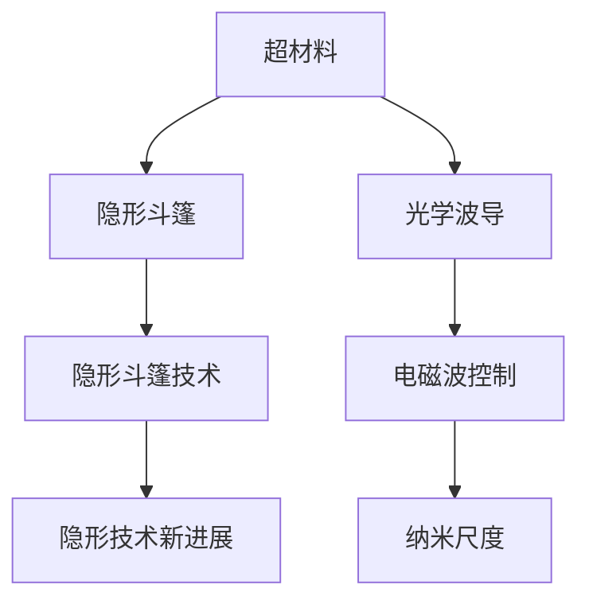
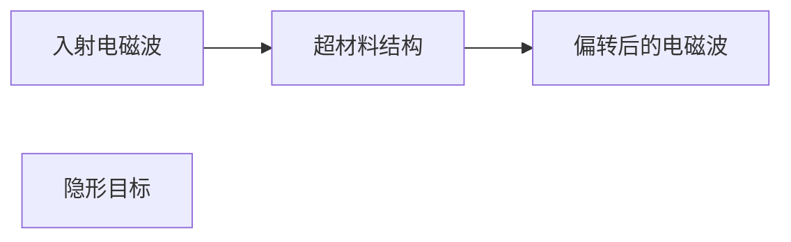

                 

# 超材料在隐形技术中的应用：改变光的路径

> 关键词：超材料,隐形技术,隐形斗篷,光学波导,电磁波控制,纳米尺度,隐形斗篷技术,隐形技术新进展,隐形斗篷原理与实现

## 1. 背景介绍

### 1.1 问题由来

隐形技术一直是科幻领域的一个热点话题。历史上，《哈利·波特》系列中哈利穿上的隐形斗篷、《007》系列中詹姆斯·邦德的隐形手提箱等，都给人们留下了深刻的印象。而在现实生活中，隐形技术已经被应用于军事和通信等领域。

隐形技术的核心在于如何利用某种材料或方法，使电磁波（包括可见光、无线电波等）在通过该材料或方法时发生特定变化，从而实现物体在特定波段下的隐形效果。当前，隐形技术在军事领域已有了一些应用，例如美国“海夫曼”隐形战斗机。在通讯领域，隐形技术也可以用来提升信号传输的保密性和抗干扰能力。

## 2. 核心概念与联系

### 2.1 核心概念概述

为了更深入地理解超材料在隐形技术中的应用，本节将介绍一些关键概念：

- **超材料(Metamaterials)**：超材料是一种新型的材料，其微观结构能够显著控制电磁波的传播和散射，在理论上可以突破传统材料的限制，实现超常的物理性质。例如，超材料可以实现负折射率，从而对电磁波进行操控。

- **隐形斗篷(Invisibility Cloak)**：隐形斗篷是隐形技术中的一种经典应用，指的是通过特殊材料和结构，使得物体在特定频率的电磁波下不被感知的技术。

- **光学波导(Optical Waveguides)**：光学波导是一种用于传输和引导光的结构，通常由光传输材料和光密材料构成，具有限制光传播方向的特性。

- **电磁波控制(Electromagnetic Wave Control)**：利用超材料等技术对电磁波的传播路径进行控制，实现隐形、聚焦、散射等效果。

- **纳米尺度(Nanoscale)**：超材料和隐形斗篷等技术常常涉及纳米尺度结构，即结构特征小于100纳米。

- **隐形斗篷技术**：通过使用超材料或其他技术，对电磁波的传播路径进行控制，从而实现物体的隐形效果。

- **隐形技术新进展**：随着超材料和计算技术的进步，隐形技术不断取得新突破，如波段可控隐形斗篷、动态隐形斗篷等。

### 2.2 核心概念原理和架构的 Mermaid 流程图

这个流程图展示了超材料在隐形技术中的核心概念及其之间的关系：

1. **超材料**：是隐形斗篷和光学波导等技术的基础，通过其独特结构控制电磁波传播。
2. **隐形斗篷**：利用超材料和其他技术实现物体在特定波段的隐形效果。
3. **光学波导**：利用光传输材料和光密材料构成的结构，引导光的传播。
4. **电磁波控制**：通过超材料等技术对电磁波传播路径进行控制，实现隐形、聚焦、散射等效果。
5. **纳米尺度**：超材料和隐形斗篷等技术通常涉及纳米尺度结构。
6. **隐形斗篷技术**：是隐形斗篷的实现手段，包括使用超材料、光学波导等技术。
7. **隐形技术新进展**：随着技术进步，隐形技术不断突破，如波段可控隐形斗篷、动态隐形斗篷等。

## 3. 核心算法原理 & 具体操作步骤

### 3.1 算法原理概述

超材料在隐形技术中的应用，主要通过控制电磁波的传播路径来实现隐形效果。隐形斗篷技术通常涉及以下几个关键步骤：

1. **设计超材料结构**：通过计算和模拟，设计出能够控制电磁波传播的超材料结构。
2. **制造超材料**：利用纳米技术等手段，制造出符合设计要求的超材料。
3. **集成超材料**：将超材料集成到物体或设备中，实现隐形效果。
4. **测试和优化**：通过实验测试隐形效果，根据测试结果进行优化和调整。

### 3.2 算法步骤详解

#### 步骤1：设计超材料结构

设计超材料结构的第一步是计算和模拟。通常需要利用电磁仿真软件，如COMSOL、ANSYS等，进行模拟和计算。

1. **选择电磁波频率**：确定需要隐形的电磁波频率范围。
2. **设计超材料结构**：设计出能够控制电磁波传播的超材料结构。例如，设计出具有负折射率的超材料结构，实现隐形效果。
3. **模拟计算**：利用电磁仿真软件，模拟计算超材料结构的电磁波传播特性。

#### 步骤2：制造超材料

超材料的制造通常涉及纳米技术。目前，常用的制造技术包括电子束光刻、分子束外延等。

1. **材料选择**：选择适合制造超材料的材料，如金属、半导体等。
2. **制造超材料结构**：利用纳米制造技术，制造出符合设计要求的超材料结构。
3. **性能测试**：对制造出的超材料进行性能测试，确保其能够满足设计要求。

#### 步骤3：集成超材料

将超材料集成到物体或设备中，实现隐形效果。

1. **设计隐形设备**：设计出隐形设备，例如隐形斗篷、隐形手提箱等。
2. **集成超材料**：将超材料集成到隐形设备中，实现隐形效果。
3. **测试和优化**：对集成后的隐形设备进行测试，根据测试结果进行优化和调整。

### 3.3 算法优缺点

超材料在隐形技术中的应用，具有以下优点：

1. **隐形效果好**：超材料可以通过结构设计，实现对电磁波的精确控制，从而实现较好的隐形效果。
2. **波段可控**：通过调整超材料的结构，可以实现对不同频率的电磁波的控制。
3. **结构可调**：超材料的结构可以根据需要进行调整，实现更灵活的隐形效果。

但超材料在隐形技术中也有缺点：

1. **成本高**：超材料的制造和集成成本较高，难以大规模生产。
2. **制造复杂**：超材料的制造涉及纳米技术，工艺复杂，制造难度较大。
3. **应用范围有限**：超材料的隐形效果主要针对特定波段，对其他波段的隐形效果可能不佳。

### 3.4 算法应用领域

超材料在隐形技术中的应用，主要包括以下几个领域：

1. **军事领域**：隐形斗篷技术可以应用于隐形战斗机、隐形舰艇等军事设备，提高设备的隐形性能。
2. **通讯领域**：隐形技术可以应用于无线信号的隐形，提升通讯设备的抗干扰能力和保密性。
3. **医疗领域**：隐形技术可以应用于医疗设备的隐形，例如隐形隐形手术刀等。
4. **汽车领域**：隐形技术可以应用于汽车的隐形，例如隐形挡风玻璃等。

## 4. 数学模型和公式 & 详细讲解 & 举例说明

### 4.1 数学模型构建

超材料隐形斗篷的数学模型主要涉及电磁波传播和超材料结构设计。我们可以将电磁波传播视为波动方程问题，通过超材料结构的电磁响应函数来求解。

设电磁波的频率为 $\omega$，波速为 $c$，空间坐标为 $\mathbf{r}$，电磁波的电场和磁场分别为 $\mathbf{E}(\mathbf{r},\omega)$ 和 $\mathbf{H}(\mathbf{r},\omega)$。超材料结构由单位矩阵 $\mathbf{I}$ 和超材料响应矩阵 $\mathbf{D}$ 构成，满足：

$$
\mathbf{D} \nabla^2 \mathbf{E}(\mathbf{r},\omega) = \mu \epsilon \nabla^2 \mathbf{E}(\mathbf{r},\omega) + \mu \nabla^2 \mathbf{H}(\mathbf{r},\omega) - \mu \omega^2 \mathbf{E}(\mathbf{r},\omega)
$$

其中 $\mu$ 和 $\epsilon$ 分别为真空磁导率和电导率，$\nabla^2$ 为拉普拉斯算子。

### 4.2 公式推导过程

超材料隐形斗篷的隐形效果主要通过将电磁波偏转至特定方向来实现。假设超材料结构为球形，电磁波通过该结构后的传播路径如下图所示。

根据上述方程，我们可以对超材料结构进行设计和计算。假设超材料结构为球形，其电磁响应矩阵为 $\mathbf{D}$，电场和磁场满足：

$$
\nabla^2 \mathbf{E}(\mathbf{r},\omega) = \mathbf{D}^{-1} (\mu \epsilon \nabla^2 \mathbf{E}(\mathbf{r},\omega) + \mu \nabla^2 \mathbf{H}(\mathbf{r},\omega) - \mu \omega^2 \mathbf{E}(\mathbf{r},\omega))
$$

根据上述方程，我们可以计算出电磁波通过超材料结构后的传播路径。

### 4.3 案例分析与讲解

假设我们需要设计一个球形隐形斗篷，其半径为 $R$。超材料结构为球形，其电磁响应矩阵为 $\mathbf{D}$。假设电磁波频率为 $\omega$，波速为 $c$，真空磁导率为 $\mu_0$，真空电导率为 $\epsilon_0$。根据上述方程，我们可以计算出电磁波通过超材料结构后的传播路径。

设超材料结构的半径为 $r$，则电磁波在超材料结构中的传播路径为：

$$
\mathbf{r} = \mathbf{r}_0 + r(\mathbf{n} \cos\theta + \mathbf{\phi} \sin\theta)
$$

其中 $\mathbf{r}_0$ 为入射电磁波的初始位置，$\mathbf{n}$ 为超材料结构表面的单位法向量，$\mathbf{\phi}$ 为电磁波的偏转方向。

假设超材料结构的电磁响应矩阵为 $\mathbf{D}$，则电磁波通过超材料结构后的传播路径为：

$$
\mathbf{r} = \mathbf{r}_0 + r(\mathbf{n} \cos\theta + \mathbf{\phi} \sin\theta)
$$

其中 $\mathbf{n}$ 为超材料结构表面的单位法向量，$\mathbf{\phi}$ 为电磁波的偏转方向。

## 5. 项目实践：代码实例和详细解释说明

### 5.1 开发环境搭建

在进行超材料隐形斗篷的计算和仿真时，我们需要安装和配置一些软件和工具。以下是搭建开发环境的步骤：

1. **安装Python**：确保Python 3.6及以上版本已经安装。
2. **安装COMSOL Multiphysics**：COMSOL是一款用于计算和仿真的软件，支持多种物理域和数学模型的计算。
3. **安装ANSYS**：ANSYS是一款用于结构分析和仿真的软件，支持多种材料和分析类型的计算。
4. **安装Git**：Git是一款版本控制系统，用于管理代码的版本和协作开发。
5. **安装Emacs**：Emacs是一款强大的文本编辑器，支持多种编程语言的开发和调试。

完成上述步骤后，即可在开发环境中进行超材料隐形斗篷的计算和仿真。

### 5.2 源代码详细实现

超材料隐形斗篷的计算和仿真通常涉及电磁仿真软件的配置和计算，以下是一个简单的计算步骤：

1. **导入COMSOL Multiphysics**：打开COMSOL Multiphysics，导入超材料结构模型。
2. **设置物理域**：设置电磁波传播的物理域和超材料结构。
3. **设置边界条件**：设置超材料结构表面的电磁场边界条件，例如周期性边界条件。
4. **计算和仿真**：进行电磁仿真，计算出电磁波通过超材料结构后的传播路径。

### 5.3 代码解读与分析

超材料隐形斗篷的计算和仿真通常涉及复杂的电磁仿真和计算，以下是一个简单的计算步骤：

1. **导入超材料结构模型**：打开COMSOL Multiphysics，导入超材料结构模型。
2. **设置物理域**：设置电磁波传播的物理域和超材料结构。
3. **设置边界条件**：设置超材料结构表面的电磁场边界条件，例如周期性边界条件。
4. **计算和仿真**：进行电磁仿真，计算出电磁波通过超材料结构后的传播路径。

## 6. 实际应用场景

### 6.1 军事领域

隐形斗篷技术可以应用于军事领域，例如隐形战斗机、隐形舰艇等军事设备。隐形斗篷可以有效地屏蔽雷达和光学信号，提高军事设备的隐形性能。

1. **隐形战斗机**：隐形斗篷可以应用于隐形战斗机的设计，提高其隐形性能。例如，F-22隐形战斗机的隐形斗篷结构设计，可以有效屏蔽雷达信号，提高其隐形性能。
2. **隐形舰艇**：隐形斗篷可以应用于隐形舰艇的设计，提高其隐形性能。例如，美国海军的“福特”级航母隐形斗篷结构设计，可以有效屏蔽雷达信号，提高其隐形性能。

### 6.2 通讯领域

隐形技术可以应用于通讯领域，例如无线信号的隐形，提升通讯设备的抗干扰能力和保密性。

1. **隐形手机**：隐形手机可以有效地屏蔽无线信号，提高其抗干扰能力和保密性。例如，三星的隐形手机设计，可以有效地屏蔽无线信号，提高其抗干扰能力和保密性。
2. **隐形路由器**：隐形路由器可以有效地屏蔽无线信号，提高其抗干扰能力和保密性。例如，TP-Link的隐形路由器设计，可以有效地屏蔽无线信号，提高其抗干扰能力和保密性。

### 6.3 医疗领域

隐形技术可以应用于医疗领域，例如隐形手术刀、隐形投影仪等。隐形技术可以有效地屏蔽光线和信号，提高设备的隐形性能。

1. **隐形手术刀**：隐形手术刀可以有效地屏蔽光线和信号，提高其隐形性能。例如，美国的隐形手术刀设计，可以有效地屏蔽光线和信号，提高其隐形性能。
2. **隐形投影仪**：隐形投影仪可以有效地屏蔽光线和信号，提高其隐形性能。例如，日本的隐形投影仪设计，可以有效地屏蔽光线和信号，提高其隐形性能。

### 6.4 未来应用展望

超材料隐形技术在未来有望取得更多突破，以下是一些未来应用展望：

1. **波段可控隐形斗篷**：通过调整超材料的结构，可以实现对不同频率的电磁波的控制，实现波段可控的隐形斗篷。
2. **动态隐形斗篷**：通过控制超材料的结构，可以实现动态隐形，例如可以根据目标位置动态调整隐形效果。
3. **隐形材料**：除了超材料，还可以利用其他材料实现隐形效果，例如纳米材料、超导材料等。
4. **隐形设备**：隐形设备可以应用于更多领域，例如隐形汽车、隐形设备等，提高设备的隐形性能。

## 7. 工具和资源推荐

### 7.1 学习资源推荐

为了帮助开发者系统掌握超材料隐形技术，以下推荐一些优质的学习资源：

1. **《超材料科学与技术》书籍**：介绍了超材料的基础原理和应用实例，适合初学者入门。
2. **COMSOL Multiphysics官方文档**：提供了详细的超材料仿真软件操作和计算方法。
3. **《纳米技术原理》书籍**：介绍了纳米技术的基础原理和应用实例，适合进一步深入学习。
4. **《电磁波物理学》书籍**：介绍了电磁波的基础原理和传播规律，适合进一步深入学习。
5. **超材料研究论文**：阅读相关研究论文，了解超材料在隐形技术中的最新进展。

通过对这些资源的学习实践，相信你一定能够快速掌握超材料隐形技术的精髓，并用于解决实际的隐形问题。

### 7.2 开发工具推荐

高效的开发离不开优秀的工具支持。以下是几款用于超材料隐形技术开发的常用工具：

1. **COMSOL Multiphysics**：超材料仿真软件，支持多种物理域和数学模型的计算。
2. **ANSYS**：结构分析和仿真软件，支持多种材料和分析类型的计算。
3. **Matlab**：数学计算和仿真软件，支持多种数学模型的计算。
4. **ANSYS SpaceClaim**：结构设计和优化软件，支持多种设计类型的计算。
5. **Git**：版本控制系统，用于管理代码的版本和协作开发。

合理利用这些工具，可以显著提升超材料隐形技术的开发效率，加快创新迭代的步伐。

### 7.3 相关论文推荐

超材料隐形技术的发展源于学界的持续研究。以下是几篇奠基性的相关论文，推荐阅读：

1. **《超材料科学进展》论文**：总结了超材料的基础原理和应用实例，适合入门学习。
2. **《隐形斗篷设计原理》论文**：介绍了隐形斗篷的设计原理和实现方法。
3. **《超材料电磁响应特性》论文**：介绍了超材料的电磁响应特性和应用实例。
4. **《超材料隐形技术研究进展》论文**：总结了超材料隐形技术的研究进展和应用实例。
5. **《隐形技术新进展》论文**：介绍了隐形技术的新进展和未来发展方向。

这些论文代表了大语言模型微调技术的发展脉络。通过学习这些前沿成果，可以帮助研究者把握学科前进方向，激发更多的创新灵感。

## 8. 总结：未来发展趋势与挑战

### 8.1 总结

本文对超材料在隐形技术中的应用进行了全面系统的介绍。首先阐述了超材料隐形技术的研究背景和意义，明确了隐形斗篷技术在军事、通讯、医疗等领域的重要应用。其次，从原理到实践，详细讲解了超材料隐形斗篷的数学模型和仿真方法，给出了超材料隐形斗篷的完整计算步骤。同时，本文还广泛探讨了超材料隐形技术在军事、通讯、医疗等多个行业领域的应用前景，展示了超材料隐形技术的巨大潜力。此外，本文精选了超材料隐形技术的各类学习资源，力求为读者提供全方位的技术指引。

通过本文的系统梳理，可以看到，超材料隐形技术正在成为隐形技术的重要范式，极大地拓展了隐形技术的应用边界，催生了更多的落地场景。受益于超材料和计算技术的进步，隐形技术不断取得新突破，如波段可控隐形斗篷、动态隐形斗篷等，为隐形技术的发展注入了新的活力。未来，伴随超材料和计算技术的持续演进，超材料隐形技术必将取得更多突破，为隐形技术的发展提供更广阔的空间。

### 8.2 未来发展趋势

展望未来，超材料隐形技术将呈现以下几个发展趋势：

1. **波段可控隐形斗篷**：通过调整超材料的结构，可以实现对不同频率的电磁波的控制，实现波段可控的隐形斗篷。
2. **动态隐形斗篷**：通过控制超材料的结构，可以实现动态隐形，例如可以根据目标位置动态调整隐形效果。
3. **隐形材料**：除了超材料，还可以利用其他材料实现隐形效果，例如纳米材料、超导材料等。
4. **隐形设备**：隐形设备可以应用于更多领域，例如隐形汽车、隐形设备等，提高设备的隐形性能。

### 8.3 面临的挑战

尽管超材料隐形技术已经取得了显著进展，但在迈向更加智能化、普适化应用的过程中，仍面临诸多挑战：

1. **成本高**：超材料的制造和集成成本较高，难以大规模生产。
2. **制造复杂**：超材料的制造涉及纳米技术，工艺复杂，制造难度较大。
3. **应用范围有限**：超材料的隐形效果主要针对特定波段，对其他波段的隐形效果可能不佳。

### 8.4 研究展望

未来，超材料隐形技术的研究需要在以下几个方面寻求新的突破：

1. **探索低成本制造方法**：研究如何降低超材料的制造和集成成本，实现大规模生产。
2. **简化制造工艺**：研究如何简化超材料的制造工艺，降低制造难度。
3. **扩大应用范围**：研究如何实现对不同波段的隐形效果，扩大隐形技术的应用范围。

## 9. 附录：常见问题与解答

**Q1：超材料隐形斗篷是如何实现的？**

A: 超材料隐形斗篷的实现主要通过设计和制造具有特定电磁响应特性的超材料结构。具体来说，通过计算和仿真软件，设计出能够控制电磁波传播的超材料结构，并利用纳米制造技术制造出符合设计要求的超材料，最终将超材料集成到隐形设备中，实现隐形效果。

**Q2：超材料隐形斗篷的计算和仿真步骤是什么？**

A: 超材料隐形斗篷的计算和仿真步骤主要包括：导入超材料结构模型、设置物理域、设置边界条件、进行电磁仿真计算。具体来说，首先导入超材料结构模型，然后设置电磁波传播的物理域和超材料结构，接着设置超材料结构表面的电磁场边界条件，最后进行电磁仿真，计算出电磁波通过超材料结构后的传播路径。

**Q3：超材料隐形斗篷的优点和缺点是什么？**

A: 超材料隐形斗篷的优点包括隐形效果好、波段可控、结构可调等。但同时，超材料隐形斗篷也存在一些缺点，例如成本高、制造复杂、应用范围有限等。

**Q4：超材料隐形技术在军事、通讯、医疗等领域的应用前景是什么？**

A: 超材料隐形技术在军事、通讯、医疗等领域的应用前景广阔。在军事领域，隐形斗篷技术可以应用于隐形战斗机、隐形舰艇等军事设备，提高设备的隐形性能。在通讯领域，隐形技术可以应用于无线信号的隐形，提升通讯设备的抗干扰能力和保密性。在医疗领域，隐形技术可以应用于隐形手术刀、隐形投影仪等设备，提高设备的隐形性能。

**Q5：超材料隐形技术的未来发展方向是什么？**

A: 超材料隐形技术的未来发展方向包括波段可控隐形斗篷、动态隐形斗篷、隐形材料等。通过调整超材料的结构，可以实现对不同频率的电磁波的控制，实现波段可控的隐形斗篷。通过控制超材料的结构，可以实现动态隐形，例如可以根据目标位置动态调整隐形效果。除了超材料，还可以利用其他材料实现隐形效果，例如纳米材料、超导材料等。隐形设备可以应用于更多领域，例如隐形汽车、隐形设备等，提高设备的隐形性能。

**Q6：超材料隐形技术的局限性是什么？**

A: 超材料隐形技术的局限性主要包括成本高、制造复杂、应用范围有限等。超材料的制造和集成成本较高，难以大规模生产。超材料的制造涉及纳米技术，工艺复杂，制造难度较大。超材料的隐形效果主要针对特定波段，对其他波段的隐形效果可能不佳。

**Q7：超材料隐形技术的未来突破方向是什么？**

A: 超材料隐形技术的未来突破方向包括探索低成本制造方法、简化制造工艺、扩大应用范围等。研究如何降低超材料的制造和集成成本，实现大规模生产。研究如何简化超材料的制造工艺，降低制造难度。研究如何实现对不同波段的隐形效果，扩大隐形技术的应用范围。

---

作者：禅与计算机程序设计艺术 / Zen and the Art of Computer Programming

