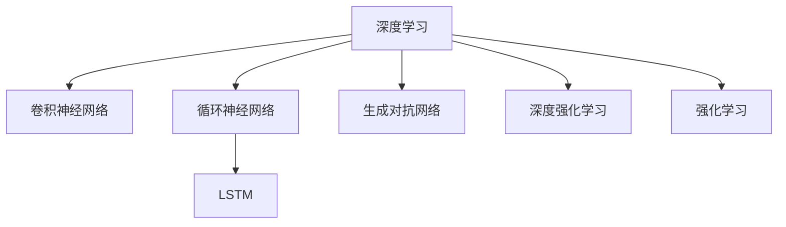

                 

# 软件 2.0 的发展趋势：深度学习、强化学习

## 1. 背景介绍

### 1.1 问题由来
随着计算能力的飞速提升和算法模型的不断演进，人工智能(AI)技术在过去十年取得了革命性突破，标志着人类社会进入了"软件 2.0"时代。从自动驾驶、语音识别、图像识别，到智能推荐、自然语言处理(NLP)、生成对抗网络(GAN)，AI技术已经渗透到各个行业的核心业务之中。其中，深度学习和强化学习(DL/RL)作为AI领域的双驾马车，为人工智能的发展提供了强大的驱动力。

深度学习通过构建复杂的神经网络结构，模拟人类大脑的神经元功能，实现对数据的高级抽象和模式识别。而强化学习则通过模仿人类在环境中学习和决策的过程，构建智能体与环境之间的交互，使模型能够在不断试错中优化策略，从而实现自主学习。

### 1.2 问题核心关键点
深度学习和强化学习虽然技术路径和应用场景有所不同，但共同推动了人工智能技术的发展，并在多个领域展示了强大的应用潜力。当前，这两大技术已经广泛应用于自动驾驶、智能推荐、游戏AI、医疗诊断、金融预测等诸多领域，成为构建复杂AI系统的核心力量。

尽管深度学习和强化学习取得了巨大的成功，但仍面临着诸多挑战。数据依赖、模型复杂度、可解释性不足等问题依然困扰着AI技术的广泛应用。如何克服这些挑战，推动AI技术向着更加智能化、泛化性更强的方向发展，成为当前AI研究的焦点。

### 1.3 问题研究意义
研究深度学习和强化学习的发展趋势，对于推动AI技术的持续创新和落地应用，具有重要意义：

1. 提升模型性能：深度学习和强化学习通过不断的算法改进和模型优化，可以显著提升AI系统的性能和准确度。
2. 拓展应用场景：新技术的出现，使得AI技术可以应用于更多领域的复杂任务，如机器人导航、自动驾驶、金融预测等。
3. 推动产业升级：AI技术的普及和应用，将大大提升各个行业的效率和生产力，为传统行业数字化转型注入新的动力。
4. 带来技术创新：深度学习和强化学习的研究促进了新算法、新模型的不断涌现，为AI领域的技术进步提供了有力支撑。
5. 增强模型可解释性：通过进一步理解深度学习和强化学习的内部机制，构建更透明、更可解释的AI模型，确保AI应用的公正性和可靠性。

## 2. 核心概念与联系

### 2.1 核心概念概述

为更好地理解深度学习和强化学习的发展趋势，本节将介绍几个密切相关的核心概念：

- 深度学习(Deep Learning)：通过构建多层神经网络，学习数据的复杂非线性关系，实现对数据的高级表示和模式识别。
- 强化学习(Reinforcement Learning)：通过智能体与环境的交互，在试错中逐步优化策略，实现自主学习和决策。
- 卷积神经网络(Convolutional Neural Networks, CNN)：一种特殊的神经网络，主要用于图像识别、语音处理等计算机视觉领域。
- 循环神经网络(Recurrent Neural Networks, RNN)：一种能够处理序列数据的神经网络，广泛应用于语言模型、时间序列预测等任务。
- 长短期记忆网络(Long Short-Term Memory, LSTM)：一种特殊的RNN结构，能够有效解决序列数据的长期依赖问题。
- 生成对抗网络(Generative Adversarial Networks, GAN)：通过训练一个生成器和一个判别器，生成逼真的人造数据，广泛应用于图像生成、风格迁移等领域。
- 深度强化学习(Deep Reinforcement Learning)：将深度学习与强化学习相结合，构建更加复杂的智能体模型，用于复杂环境中的自主决策。

这些核心概念之间的逻辑关系可以通过以下Mermaid流程图来展示：



这个流程图展示了深度学习和强化学习的主要分支及其之间的关联。深度学习通过构建复杂神经网络结构，实现了对数据的高效表示和模式识别；强化学习则通过智能体与环境的交互，实现了自主学习和决策。GAN和深度强化学习是深度学习和强化学习的延伸，拓展了模型的应用范围和能力。

## 3. 核心算法原理 & 具体操作步骤
### 3.1 算法原理概述

深度学习和强化学习各自拥有独特的算法原理和计算模型，但两者都基于优化目标函数，通过迭代求解最优解。其核心思想是通过构建模型，利用样本数据进行学习，从而实现对数据的高级抽象和自主决策。

对于深度学习，优化目标函数通常为交叉熵损失、均方误差损失等，用于衡量模型预测输出与真实标签之间的差异。优化算法则包括梯度下降、Adam、SGD等，通过不断迭代更新模型参数，最小化损失函数。

对于强化学习，优化目标函数通常为累积奖励函数，用于衡量智能体在环境中的长期表现。优化算法则包括Q-learning、SARSA、策略梯度等，通过与环境的交互，逐步优化策略，最大化累积奖励。

### 3.2 算法步骤详解

#### 深度学习步骤：

1. **数据准备**：收集标注数据，划分为训练集、验证集和测试集。
2. **模型选择**：选择合适的深度学习模型结构，如卷积神经网络、循环神经网络等。
3. **网络构建**：构建深度神经网络，包括层数、节点数、激活函数等设计。
4. **损失函数**：定义适用于该任务的损失函数，如交叉熵、均方误差等。
5. **优化器**：选择合适的优化算法，如梯度下降、Adam等，设置学习率和批大小。
6. **模型训练**：使用训练集数据进行迭代训练，最小化损失函数。
7. **验证和调整**：在验证集上评估模型性能，调整超参数。
8. **测试评估**：在测试集上评估模型性能，给出最终结果。

#### 强化学习步骤：

1. **环境构建**：构建模拟环境，包括状态、行动、奖励等。
2. **智能体设计**：设计智能体模型，选择合适的策略和优化算法。
3. **交互训练**：通过智能体与环境的交互，逐步优化策略，最大化累积奖励。
4. **参数调整**：调整智能体参数，如学习率、探索率等。
5. **评估测试**：在测试集上评估模型性能，给出最终结果。

### 3.3 算法优缺点

深度学习和强化学习各自具有独特的优势和劣势：

#### 深度学习优缺点：

- **优点**：
  - 数据驱动：依赖大量标注数据，但可以捕捉复杂的非线性关系。
  - 可解释性：黑盒模型难以解释，但部分模型（如CNN）具有较好的可解释性。
  - 高性能：在图像识别、语音处理等任务上，已经达到了人类级别的表现。

- **缺点**：
  - 过拟合风险：依赖大规模数据，容易过拟合。
  - 计算资源需求高：模型复杂度大，需要高性能计算设备。
  - 数据依赖：需要大量标注数据，获取成本高。

#### 强化学习优缺点：

- **优点**：
  - 自主学习：无需大量标注数据，能够自主学习和决策。
  - 鲁棒性强：在复杂环境中表现出较好的鲁棒性。
  - 可扩展性：可以应用于更多领域，如自动驾驶、游戏AI等。

- **缺点**：
  - 探索与利用平衡：探索新策略和利用已有知识之间的平衡难以把握。
  - 多模态数据处理：难以处理多模态数据，如文本、图像等。
  - 可解释性差：模型决策过程难以解释。

### 3.4 算法应用领域

深度学习和强化学习在多个领域得到了广泛的应用，涵盖了从计算机视觉、自然语言处理到自动驾驶、智能推荐等各个方面。以下是一些典型的应用场景：

- **计算机视觉**：图像识别、目标检测、人脸识别等。通过深度神经网络提取图像特征，实现图像的高效识别和处理。
- **自然语言处理**：机器翻译、情感分析、文本生成等。通过RNN、LSTM等模型，捕捉语言序列中的上下文信息，实现对文本的理解和生成。
- **语音处理**：语音识别、语音合成等。通过卷积神经网络、循环神经网络等模型，实现对语音信号的高效处理和分析。
- **自动驾驶**：导航、路径规划、环境感知等。通过深度强化学习，构建智能体模型，实现自主导航和决策。
- **游戏AI**：决策、策略优化等。通过强化学习，训练智能体模型，实现游戏中的自主决策和策略优化。
- **医疗诊断**：影像分析、病历分析等。通过深度学习模型，提取影像特征，实现对疾病的早期诊断和预测。
- **金融预测**：股票预测、风险评估等。通过深度学习模型，分析历史数据，预测股票价格和市场趋势。

## 4. 数学模型和公式 & 详细讲解 & 举例说明

### 4.1 数学模型构建

#### 深度学习数学模型：

假设深度学习模型 $M$ 的参数为 $\theta$，输入数据为 $x$，输出为 $y$，定义损失函数为 $\ell(y, M(x))$。模型的训练目标是最小化损失函数，即：

$$
\min_{\theta} \ell(y, M(x))
$$

常见的损失函数包括交叉熵损失、均方误差损失等。例如，对于分类任务，交叉熵损失函数为：

$$
\ell(y, M(x)) = -\frac{1}{N} \sum_{i=1}^N \sum_{j=1}^C y_{ij} \log M_{j}(x_i)
$$

其中 $N$ 为样本数，$C$ 为类别数，$y_{ij}$ 表示样本 $i$ 属于类别 $j$ 的真实标签。

#### 强化学习数学模型：

假设强化学习环境的状态为 $s$，智能体的行动为 $a$，奖励函数为 $r$，智能体的策略为 $\pi$，智能体的状态-行动值为 $Q$。智能体的目标是最大化累积奖励，即：

$$
\max_{\pi} \mathbb{E}_{\pi} \sum_{t=1}^{\infty} \gamma^t r(s_t, a_t)
$$

其中 $\gamma$ 为折扣因子。智能体的策略 $\pi$ 可以通过值函数 $Q$ 来更新，常用的更新公式为：

$$
Q_{t+1}(s_t, a_t) = Q_t(s_t, a_t) + \alpha [r_t + \gamma \max_{a_{t+1}} Q_{t+1}(s_{t+1}, a_{t+1}) - Q_t(s_t, a_t)]
$$

其中 $\alpha$ 为学习率。

### 4.2 公式推导过程

#### 深度学习公式推导：

以交叉熵损失函数为例，推导其梯度更新公式。对于二分类任务，交叉熵损失函数为：

$$
\ell(y, M(x)) = -\frac{1}{N} \sum_{i=1}^N [y_i \log M_{1}(x_i) + (1-y_i) \log M_{0}(x_i)]
$$

其中 $M_{1}(x)$ 和 $M_{0}(x)$ 分别表示正例和负例的概率预测值。根据链式法则，损失函数对模型参数 $\theta$ 的梯度为：

$$
\frac{\partial \ell}{\partial \theta} = -\frac{1}{N} \sum_{i=1}^N [(y_i - M_{1}(x_i)) \frac{\partial M_{1}}{\partial \theta} + (1-y_i - M_{0}(x_i)) \frac{\partial M_{0}}{\partial \theta}]
$$

其中 $\frac{\partial M_{1}}{\partial \theta}$ 和 $\frac{\partial M_{0}}{\partial \theta}$ 分别表示正例和负例预测值的梯度。

#### 强化学习公式推导：

以Q-learning算法为例，推导其更新公式。假设智能体在状态 $s$ 下采取行动 $a$，获得奖励 $r$，下一个状态为 $s'$。Q-learning算法更新公式为：

$$
Q_{s,a} \leftarrow Q_{s,a} + \alpha (r + \gamma \max_{a'} Q_{s', a'} - Q_{s,a})
$$

其中 $\alpha$ 为学习率，$\gamma$ 为折扣因子。

### 4.3 案例分析与讲解

以图像分类为例，分析深度学习的数学模型和训练过程：

1. **数据准备**：收集图像数据，划分为训练集、验证集和测试集。
2. **模型选择**：选择卷积神经网络作为图像分类模型，包括卷积层、池化层、全连接层等。
3. **网络构建**：构建卷积神经网络，包括卷积核大小、层数、节点数等设计。
4. **损失函数**：定义交叉熵损失函数，用于衡量模型预测输出与真实标签之间的差异。
5. **优化器**：选择Adam优化算法，设置学习率和批大小。
6. **模型训练**：使用训练集数据进行迭代训练，最小化损失函数。
7. **验证和调整**：在验证集上评估模型性能，调整超参数。
8. **测试评估**：在测试集上评估模型性能，给出最终结果。

## 5. 项目实践：代码实例和详细解释说明

### 5.1 开发环境搭建

在进行深度学习和强化学习实践前，我们需要准备好开发环境。以下是使用Python进行PyTorch和OpenAI Gym开发的环境配置流程：

1. 安装Anaconda：从官网下载并安装Anaconda，用于创建独立的Python环境。

2. 创建并激活虚拟环境：
```bash
conda create -n dl-env python=3.8 
conda activate dl-env
```

3. 安装PyTorch：根据CUDA版本，从官网获取对应的安装命令。例如：
```bash
conda install pytorch torchvision torchaudio cudatoolkit=11.1 -c pytorch -c conda-forge
```

4. 安装OpenAI Gym：
```bash
pip install gym
```

5. 安装各类工具包：
```bash
pip install numpy pandas scikit-learn matplotlib tqdm jupyter notebook ipython
```

完成上述步骤后，即可在`dl-env`环境中开始深度学习和强化学习的实践。

### 5.2 源代码详细实现

#### 深度学习项目：图像分类

以下是使用PyTorch实现图像分类的完整代码：

```python
import torch
import torch.nn as nn
import torchvision.transforms as transforms
import torchvision.datasets as datasets
from torch.utils.data import DataLoader
from torch.optim import Adam

# 定义模型结构
class Net(nn.Module):
    def __init__(self):
        super(Net, self).__init__()
        self.conv1 = nn.Conv2d(3, 6, 5)
        self.pool = nn.MaxPool2d(2, 2)
        self.conv2 = nn.Conv2d(6, 16, 5)
        self.fc1 = nn.Linear(16 * 5 * 5, 120)
        self.fc2 = nn.Linear(120, 84)
        self.fc3 = nn.Linear(84, 10)

    def forward(self, x):
        x = self.pool(torch.relu(self.conv1(x)))
        x = self.pool(torch.relu(self.conv2(x)))
        x = x.view(-1, 16 * 5 * 5)
        x = torch.relu(self.fc1(x))
        x = torch.relu(self.fc2(x))
        x = self.fc3(x)
        return x

# 加载数据集
train_dataset = datasets.CIFAR10(root='./data', train=True, transform=transforms.ToTensor(), download=True)
test_dataset = datasets.CIFAR10(root='./data', train=False, transform=transforms.ToTensor(), download=True)

# 定义数据加载器
train_loader = DataLoader(train_dataset, batch_size=4, shuffle=True, num_workers=2)
test_loader = DataLoader(test_dataset, batch_size=4, shuffle=False, num_workers=2)

# 定义模型和优化器
model = Net()
optimizer = Adam(model.parameters(), lr=0.001)

# 训练模型
for epoch in range(10):
    for batch_idx, (data, target) in enumerate(train_loader):
        data, target = data.to(device), target.to(device)
        optimizer.zero_grad()
        output = model(data)
        loss = nn.CrossEntropyLoss()(output, target)
        loss.backward()
        optimizer.step()
```

#### 强化学习项目：CartPole游戏

以下是使用PyTorch和OpenAI Gym实现CartPole游戏的完整代码：

```python
import gym
import numpy as np
import torch
import torch.nn as nn
import torch.optim as optim

# 定义智能体模型
class Policy(nn.Module):
    def __init__(self, state_size, action_size):
        super(Policy, self).__init__()
        self.fc1 = nn.Linear(state_size, 64)
        self.fc2 = nn.Linear(64, 64)
        self.fc3 = nn.Linear(64, action_size)

    def forward(self, x):
        x = torch.relu(self.fc1(x))
        x = torch.relu(self.fc2(x))
        return torch.tanh(self.fc3(x))

# 定义智能体策略
class QNetwork(nn.Module):
    def __init__(self, state_size, action_size):
        super(QNetwork, self).__init__()
        self.fc1 = nn.Linear(state_size, 64)
        self.fc2 = nn.Linear(64, 64)
        self.fc3 = nn.Linear(64, action_size)

    def forward(self, x):
        x = torch.relu(self.fc1(x))
        x = torch.relu(self.fc2(x))
        return torch.tanh(self.fc3(x))

# 加载环境
env = gym.make('CartPole-v1')
state_size = env.observation_space.shape[0]
action_size = env.action_space.n

# 初始化模型和优化器
policy = Policy(state_size, action_size).to(device)
q_network = QNetwork(state_size, action_size).to(device)
optimizer = optim.Adam(policy.parameters(), lr=0.001)
q_optimizer = optim.Adam(q_network.parameters(), lr=0.001)

# 训练智能体
for episode in range(2000):
    state = env.reset()
    state = torch.tensor(state, dtype=torch.float32).unsqueeze(0).to(device)
    done = False
    while not done:
        action = policy(state)
        action = np.argmax(action.cpu().data.numpy(), axis=1)
        state, reward, done, _ = env.step(action)
        state = torch.tensor(state, dtype=torch.float32).unsqueeze(0).to(device)
        optimizer.zero_grad()
        q_network.zero_grad()
        q_value = q_network(state)
        loss = nn.MSELoss()(q_value, torch.tensor([reward], device=device))
        loss.backward()
        q_optimizer.step()
        optimizer.step()

    print('Episode {}: {}'.format(episode, reward))
```

### 5.3 代码解读与分析

#### 深度学习代码解读：

1. **模型定义**：定义卷积神经网络模型，包括卷积层、池化层、全连接层等。
2. **数据加载**：使用PyTorch内置的数据加载器，加载CIFAR-10数据集，并进行批处理和随机打乱。
3. **模型训练**：通过Adam优化器，对模型进行迭代训练，最小化交叉熵损失函数。
4. **性能评估**：在测试集上评估模型性能，给出准确率和损失值。

#### 强化学习代码解读：

1. **环境加载**：使用Gym加载CartPole环境。
2. **模型定义**：定义智能体模型和策略，使用全连接神经网络。
3. **训练过程**：通过智能体与环境的交互，逐步优化策略，最大化累积奖励。
4. **性能评估**：在测试集上评估模型性能，给出最终结果。

## 6. 实际应用场景

### 6.1 计算机视觉

深度学习在计算机视觉领域得到了广泛的应用，涵盖了图像分类、目标检测、图像生成等各个方面。例如，深度卷积神经网络在ImageNet上实现了图像识别的突破，大幅提升了计算机视觉任务的准确度。

### 6.2 自然语言处理

深度学习在自然语言处理领域也展现了强大的能力，尤其是在语言模型和文本生成方面。例如，GPT-3模型通过预训练-微调范式，在多项NLP任务上刷新了最先进的性能指标。

### 6.3 自动驾驶

深度学习在自动驾驶领域具有重要的应用价值，特别是在环境感知、路径规划和决策等方面。例如，深度神经网络可以高效地处理传感器数据，实现对车辆周围环境的实时感知。

### 6.4 游戏AI

强化学习在游戏AI领域取得了突破性进展，通过智能体模型，AI可以在复杂环境中进行自主决策和策略优化。例如，AlphaGo在围棋中战胜了人类顶尖棋手，展示了强化学习的强大能力。

## 7. 工具和资源推荐

### 7.1 学习资源推荐

为了帮助开发者系统掌握深度学习和强化学习的理论基础和实践技巧，这里推荐一些优质的学习资源：

1. 《深度学习》课程：斯坦福大学Andrew Ng教授主讲的深度学习课程，涵盖从基础到高级的各个知识点，深入浅出地介绍了深度学习的原理和应用。

2. 《强化学习》课程：DeepMind开设的强化学习课程，详细讲解了强化学习的理论基础和算法实现，涵盖从简单到复杂的多个范式。

3. 《深度学习与强化学习》书籍：由TensorFlow团队编写的经典教材，系统介绍了深度学习和强化学习的原理、算法和应用。

4. 《深度学习框架指南》：全面介绍了TensorFlow、PyTorch等主流深度学习框架的使用方法，提供丰富的代码示例和实践指南。

5. 《OpenAI Gym教程》：OpenAI Gym是强化学习领域的标准库，提供了丰富的环境和算法实现，是学习强化学习的好帮手。

通过对这些资源的学习实践，相信你一定能够快速掌握深度学习和强化学习的精髓，并用于解决实际的AI问题。

### 7.2 开发工具推荐

高效的开发离不开优秀的工具支持。以下是几款用于深度学习和强化学习开发的常用工具：

1. PyTorch：基于Python的开源深度学习框架，灵活动态的计算图，适合快速迭代研究。支持自动微分、GPU/TPU加速等功能，广泛应用于深度学习领域。

2. TensorFlow：由Google主导开发的开源深度学习框架，生产部署方便，适合大规模工程应用。提供了丰富的API和工具，支持分布式训练和优化器。

3. Keras：高层次的深度学习框架，易于上手和使用，支持多种后端引擎，包括TensorFlow和Theano。

4. JAX：Google开发的基于Python的高性能深度学习框架，支持自动微分、GPU/TPU加速，支持动态图和静态图两种计算模式。

5. Gym：OpenAI Gym是强化学习领域的标准库，提供了丰富的环境和算法实现，支持多种模拟环境。

合理利用这些工具，可以显著提升深度学习和强化学习的开发效率，加快创新迭代的步伐。

### 7.3 相关论文推荐

深度学习和强化学习的研究源于学界的持续探索。以下是几篇奠基性的相关论文，推荐阅读：

1. AlexNet：在ImageNet上实现图像分类的突破，引入了卷积神经网络，奠定了深度学习在计算机视觉领域的基础。

2. GANs：通过生成器和判别器的对抗训练，实现了高逼真度的图像生成和风格迁移，开辟了生成对抗网络的新领域。

3. RNN和LSTM：提出循环神经网络和长短期记忆网络，用于处理序列数据，解决了传统神经网络在时间依赖性方面的不足。

4. Q-learning：提出了Q-learning算法，通过智能体与环境的交互，实现了自主学习和决策。

5. AlphaGo：使用深度强化学习技术，在围棋中战胜人类顶尖棋手，展示了强化学习在游戏AI领域的强大潜力。

这些论文代表了大模型微调技术的发展脉络。通过学习这些前沿成果，可以帮助研究者把握学科前进方向，激发更多的创新灵感。

## 8. 总结：未来发展趋势与挑战

### 8.1 研究成果总结

深度学习和强化学习在过去十年间取得了突破性进展，广泛应用于多个领域，并推动了人工智能技术的发展。主要的研究成果包括：

1. 深度学习在计算机视觉、自然语言处理等领域实现了多项突破，推动了这些领域的快速发展。
2. 强化学习在游戏AI、自动驾驶等领域展示了强大的能力，推动了这些领域的创新和应用。
3. 深度学习和强化学习技术的结合，推动了深度强化学习的崛起，拓展了模型的应用范围和能力。

### 8.2 未来发展趋势

展望未来，深度学习和强化学习将继续在以下几个方面取得新的突破：

1. **模型结构优化**：通过更先进的神经网络结构，提升模型的表达能力和泛化性能。例如，Transformer、ResNet等结构的不断优化，已经实现了图像分类、语言模型等领域的新突破。

2. **算法改进**：通过更高效的优化算法和模型训练策略，提升模型的训练速度和性能。例如，Adam、RMSprop等优化算法已经被广泛应用于深度学习和强化学习中。

3. **多模态学习**：通过将深度学习和强化学习与其他技术结合，提升模型的多模态处理能力。例如，深度学习和生成对抗网络相结合，实现了更加逼真的图像生成和风格迁移。

4. **跨领域应用**：通过深度学习和强化学习技术的泛化，推动AI技术在更多领域的应用。例如，AI技术在医疗、金融、教育等领域的应用已经取得了显著进展。

5. **联邦学习**：通过分布式计算和联邦学习技术，提升模型的数据隐私和安全保障。例如，联邦学习可以实现数据在本地训练，避免了数据泄露的风险。

### 8.3 面临的挑战

尽管深度学习和强化学习取得了巨大成功，但仍面临着诸多挑战：

1. **计算资源消耗高**：深度学习模型通常具有较大的参数规模，训练和推理所需计算资源较高。如何降低计算成本，提升模型的训练和推理效率，仍然是一个重要问题。

2. **数据依赖性强**：深度学习和强化学习依赖大量标注数据和模拟环境，获取成本高。如何降低数据依赖，提升模型的泛化能力，是一个需要解决的问题。

3. **可解释性不足**：深度学习和强化学习模型通常是黑盒模型，难以解释其内部工作机制和决策逻辑。如何提升模型的可解释性，增强其可信度，是一个重要的研究方向。

4. **安全性问题**：深度学习和强化学习模型容易受到对抗样本攻击，如何提升模型的鲁棒性和安全性，是一个需要解决的问题。

5. **道德与伦理问题**：深度学习和强化学习模型可能输出有害信息，如何保证模型的公平性和伦理性，是一个需要解决的问题。

### 8.4 研究展望

面对深度学习和强化学习面临的挑战，未来的研究需要在以下几个方面寻求新的突破：

1. **无监督和半监督学习**：探索无监督和半监督学习算法，降低深度学习和强化学习对标注数据的依赖，提升模型的泛化能力。

2. **模型压缩与优化**：研究模型压缩与优化技术，降低深度学习和强化学习模型的参数规模，提升模型的训练和推理效率。

3. **可解释性研究**：研究可解释性方法，提升深度学习和强化学习模型的可解释性和可信度。

4. **安全与隐私保护**：研究对抗攻击和隐私保护技术，提升深度学习和强化学习模型的鲁棒性和安全性。

5. **伦理与道德研究**：研究AI伦理与道德问题，确保深度学习和强化学习模型的公平性和伦理性。

这些研究方向的探索，必将引领深度学习和强化学习技术迈向更高的台阶，为构建安全、可靠、可解释、可控的智能系统铺平道路。面向未来，深度学习和强化学习技术还需要与其他人工智能技术进行更深入的融合，如知识表示、因果推理、强化学习等，多路径协同发力，共同推动自然语言理解和智能交互系统的进步。只有勇于创新、敢于突破，才能不断拓展语言模型的边界，让智能技术更好地造福人类社会。

## 9. 附录：常见问题与解答

**Q1: 深度学习和强化学习有哪些应用场景？**

A: 深度学习和强化学习在多个领域得到了广泛的应用，涵盖了从计算机视觉、自然语言处理到自动驾驶、智能推荐等各个方面。具体应用场景包括：

- 计算机视觉：图像分类、目标检测、图像生成等。
- 自然语言处理：语言模型、文本生成、机器翻译等。
- 自动驾驶：环境感知、路径规划、决策等。
- 游戏AI：策略优化、自主决策等。
- 金融预测：股票预测、风险评估等。
- 医疗诊断：影像分析、病历分析等。

**Q2: 深度学习和强化学习的区别是什么？**

A: 深度学习和强化学习虽然都属于人工智能技术，但它们的技术路径和应用场景有所不同：

- 深度学习：通过构建复杂的神经网络结构，学习数据的复杂非线性关系，实现对数据的高级抽象和模式识别。主要应用于图像识别、语音处理、自然语言处理等领域。
- 强化学习：通过智能体与环境的交互，在试错中逐步优化策略，实现自主学习和决策。主要应用于游戏AI、自动驾驶、机器人控制等领域。

**Q3: 深度学习和强化学习分别有哪些优缺点？**

A: 深度学习和强化学习各自具有独特的优势和劣势：

- 深度学习优缺点：
  - 优点：数据驱动，能够捕捉复杂的非线性关系，高性能。
  - 缺点：过拟合风险高，计算资源需求高，数据依赖强。

- 强化学习优缺点：
  - 优点：自主学习，鲁棒性强，可扩展性好。
  - 缺点：探索与利用平衡难，多模态数据处理困难，可解释性差。

**Q4: 深度学习和强化学习的未来发展趋势是什么？**

A: 深度学习和强化学习的未来发展趋势包括：

- 模型结构优化：通过更先进的神经网络结构，提升模型的表达能力和泛化性能。
- 算法改进：通过更高效的优化算法和模型训练策略，提升模型的训练速度和性能。
- 多模态学习：通过将深度学习和强化学习与其他技术结合，提升模型的多模态处理能力。
- 跨领域应用：通过深度学习和强化学习技术的泛化，推动AI技术在更多领域的应用。
- 联邦学习：通过分布式计算和联邦学习技术，提升模型的数据隐私和安全保障。

**Q5: 深度学习和强化学习面临的主要挑战是什么？**

A: 深度学习和强化学习面临的主要挑战包括：

- 计算资源消耗高：深度学习模型通常具有较大的参数规模，训练和推理所需计算资源较高。
- 数据依赖性强：深度学习和强化学习依赖大量标注数据和模拟环境，获取成本高。
- 可解释性不足：深度学习和强化学习模型通常是黑盒模型，难以解释其内部工作机制和决策逻辑。
- 安全性问题：深度学习和强化学习模型容易受到对抗样本攻击，如何提升模型的鲁棒性和安全性，是一个需要解决的问题。
- 道德与伦理问题：深度学习和强化学习模型可能输出有害信息，如何保证模型的公平性和伦理性，是一个需要解决的问题。

**Q6: 如何提升深度学习和强化学习的可解释性？**

A: 提升深度学习和强化学习的可解释性需要从以下几个方面入手：

- 增加可解释性层：在模型中增加可解释性层，如注意力机制、因果推理等，增强模型的透明度。
- 使用可解释性算法：使用可解释性算法，如LIME、SHAP等，对模型进行解释和可视化。
- 设计可解释性模型：设计可解释性模型，如可解释性神经网络、因果模型等，提升模型的可解释性。

**Q7: 如何提升深度学习和强化学习模型的鲁棒性？**

A: 提升深度学习和强化学习模型的鲁棒性需要从以下几个方面入手：

- 数据增强：通过数据增强技术，扩充训练集，增强模型的泛化能力。
- 正则化技术：使用正则化技术，如L2正则、Dropout等，防止模型过拟合。
- 对抗训练：通过对抗训练技术，提高模型对对抗样本的鲁棒性。
- 联邦学习：通过联邦学习技术，提升模型在分布式环境中的鲁棒性。

通过不断优化和改进，深度学习和强化学习模型将在各个领域发挥更加重要的作用，推动人工智能技术的持续发展和应用。

