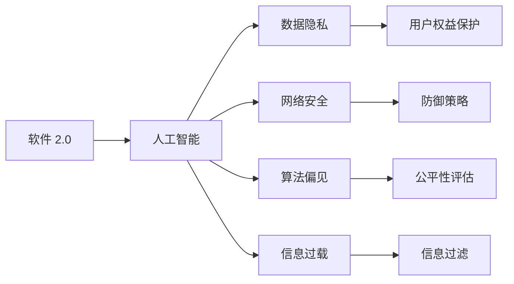

                 

# 软件 2.0 的社会责任：科技向善

## 1. 背景介绍

随着人工智能、大数据、区块链等新一代信息技术的飞速发展，人类社会正经历着前所未有的变革。从工业 4.0 到软件 2.0，科技创新正成为驱动社会发展的重要引擎。然而，随着科技的深入应用，也出现了诸多新的社会问题，诸如数据隐私、网络安全、算法偏见、信息过载等，引发了广泛关注。如何使科技真正造福人类社会，实现可持续发展，已成为摆在我们面前的重要课题。

本文将聚焦于软件 2.0 时代，探讨科技向善的社会责任问题。通过对关键技术的深入解析，提出解决方案，以期为构建更加和谐、公平、可持续的智能社会提供有益借鉴。

## 2. 核心概念与联系

### 2.1 核心概念概述

在讨论软件 2.0 的社会责任之前，首先需要明确几个核心概念：

- **软件 2.0**：是指基于人工智能、深度学习、自然语言处理等新一代信息技术，旨在提升软件智能性和自动化水平的高级软件形态。与传统的软件 1.0（基于规则、逻辑等硬编码的程序）相比，软件 2.0 具有更强的自适应能力、更高的效率和更广泛的应用场景。

- **人工智能 (AI)**：是指通过计算机模拟人类智能行为的技术，包括感知、推理、学习、语言理解等方面。AI 在软件 2.0 中扮演着核心角色，支撑了从数据挖掘、自动化到智能决策等各项功能。

- **数据隐私**：指个人或组织的数据不被未授权的第三方访问、收集和使用的权利。数据隐私保护是大数据时代必须重点关注的问题，涉及到用户权益和信息安全。

- **网络安全**：指保护信息系统、网络资源和数据免受未授权的访问、攻击和破坏的策略和技术。网络安全是大数据和人工智能应用的基础，必须与技术发展同步升级。

- **算法偏见**：指在机器学习算法训练和应用过程中，由于数据偏差、算法设计等因素导致的不公平、歧视性结果。算法偏见是 AI 应用中亟待解决的问题，影响着公平正义的实现。

- **信息过载**：指在信息化社会，信息量爆炸性增长，用户面临的信息过多，难以处理和判断，容易产生决策失误、认知负担等问题。

### 2.2 核心概念原理和架构的 Mermaid 流程图



## 3. 核心算法原理 & 具体操作步骤

### 3.1 算法原理概述

在软件 2.0 的框架下，AI 和大数据的应用涉及到多个层面，包括数据采集、存储、处理、分析和应用。本节将重点探讨如何通过算法和技术手段，解决上述社会问题，实现科技向善。

- **数据隐私保护**：通过差分隐私、联邦学习等技术，确保用户数据在处理和应用过程中的匿名性和安全性。
- **网络安全**：利用区块链、加密算法等技术，保障信息传输和存储的安全性，防止未授权访问和攻击。
- **算法偏见纠正**：通过公平性评估和反偏见算法，识别并修正算法中的偏见，确保模型公平性和可解释性。
- **信息过载管理**：采用推荐系统、自然语言处理等技术，优化信息处理和展示方式，提高信息检索和认知效率。

### 3.2 算法步骤详解

#### 3.2.1 数据隐私保护

- **差分隐私**：通过在数据中引入噪声，保护个体数据不被泄露，同时保证统计分析的有效性。差分隐私算法可以在数据聚合、查询等操作中应用。

- **联邦学习**：指在多个分布式数据源上训练模型，模型参数在本地设备上更新，避免集中式数据存储，保护用户隐私。

#### 3.2.2 网络安全

- **区块链技术**：利用去中心化、不可篡改的区块链，实现分布式账本和智能合约，保障数据和交易的安全性。

- **加密算法**：包括对称加密、非对称加密、哈希算法等，用于保护数据的机密性、完整性和真实性。

#### 3.2.3 算法偏见纠正

- **公平性评估**：通过指标（如准确率、召回率、公平性指标等）评估模型在不同群体上的表现，识别偏见和歧视性结果。

- **反偏见算法**：包括重采样、权重调整、数据增强等技术，修正模型中的偏见，确保模型公平性。

#### 3.2.4 信息过载管理

- **推荐系统**：基于协同过滤、内容推荐等技术，个性化推荐用户感兴趣的内容，减少信息过载。

- **自然语言处理**：通过语义分析和文本摘要技术，提取关键信息，简化和优化信息展示方式。

### 3.3 算法优缺点

- **优点**：
  - 全面解决了数据隐私、网络安全、算法偏见和信息过载等社会问题。
  - 实现了科技向善，推动社会公平和可持续发展。

- **缺点**：
  - 技术复杂度高，实现成本较大。
  - 部分技术仍处于研究阶段，尚未大规模商用。

### 3.4 算法应用领域

基于上述算法和技术，软件 2.0 可以在多个领域实现科技向善：

- **金融科技 (FinTech)**：在金融交易、风险控制、智能投顾等领域，通过差分隐私、区块链等技术，保障用户数据安全，提升金融服务的透明性和可信度。
- **医疗健康**：在医疗诊断、治疗方案推荐、电子病历管理等领域，利用深度学习、自然语言处理等技术，提供个性化医疗服务，保障患者隐私。
- **智慧城市**：在城市治理、智能交通、公共服务等领域，通过大数据分析、智能推荐等技术，优化城市管理，提升服务效率和居民满意度。
- **教育**：在在线教育、智能辅助教学、学习分析等领域，采用推荐系统和自然语言处理技术，个性化推荐学习内容，提高教育质量和学习效果。
- **电子商务**：在商品推荐、智能客服、交易安全等领域，通过区块链、加密算法等技术，保障用户交易安全和隐私。

## 4. 数学模型和公式 & 详细讲解 & 举例说明

### 4.1 数学模型构建

在软件 2.0 中，数学模型通常用于数据处理、算法设计、性能评估等方面。本节将重点解析几个关键模型：

- **差分隐私模型**：
  - **定义**：通过在数据中引入噪声，保护个体隐私，同时保证统计分析的有效性。
  - **公式**：
    $$
    \epsilon\text{-Differential Privacy} = \forall \mathcal{A}, \forall x, y: |\Pr[A(x)] - \Pr[A(y)]| \leq e^{-\epsilon}
    $$
    其中 $\epsilon$ 为隐私保护参数，$\mathcal{A}$ 为查询函数，$x$ 和 $y$ 为相邻数据点。

- **区块链共识算法**：
  - **定义**：基于分布式账本和智能合约，确保数据和交易的安全性和透明性。
  - **公式**：
    $$
    \text{Consensus Algorithm} = \bigoplus \{ \text{Participants}, \text{Trans actions}, \text{Blockchain Rules}, \text{Consensus Mechanism} \}
    $$

- **公平性评估指标**：
  - **定义**：用于衡量模型在不同群体上的公平性表现，包括准确率、召回率、公平性指标等。
  - **公式**：
    $$
    \text{Fairness Metrics} = \{ \text{Equal Opportunity}, \text{Demographic Parity}, \text{Statistical Parity} \}
    $$

### 4.2 公式推导过程

#### 4.2.1 差分隐私公式推导

- **差分隐私保护**：
  - **差分隐私概率界限**：在差分隐私中，通过在数据中添加噪声，使得攻击者无法区分两个相邻数据点的概率界限。
  - **推导**：
    $$
    \Pr[A(x)] - \Pr[A(y)] \leq e^{-\epsilon} + \frac{2\sigma}{\epsilon\sqrt{n}}
    $$
    其中 $n$ 为数据样本数，$\sigma$ 为噪声标准差。

#### 4.2.2 区块链共识算法推导

- **区块链共识算法**：
  - **共识机制**：包括拜占庭容错（Byzantine Fault Tolerance, BFT）、工作证明（Proof of Work, PoW）等。
  - **推导**：
    $$
    \text{Consensus Mechanism} = \bigoplus \{ \text{BFT}, \text{PoW}, \text{PoS}, \text{DPoS} \}
    $$

#### 4.2.3 公平性评估指标推导

- **公平性评估指标**：
  - **Equal Opportunity**：指不同群体间接受相同数据处理的比例相同。
  - **Demographic Parity**：指不同群体间处理结果的分布相同。
  - **Statistical Parity**：指不同群体间处理结果的概率相同。
  - **推导**：
    $$
    \text{Equal Opportunity} = \frac{\text{Precision}}{\text{Recall}} \quad \forall \text{groups}
    $$
    $$
    \text{Demographic Parity} = \text{AUC}_\text{group}
    $$
    $$
    \text{Statistical Parity} = \text{FPR}_\text{group}
    $$

### 4.3 案例分析与讲解

- **案例一：金融交易中的差分隐私**：
  - **背景**：银行在处理客户交易数据时，需要保护客户隐私。
  - **做法**：使用差分隐私算法，在数据聚合和查询过程中引入噪声，保护客户数据。
  - **效果**：保护了客户隐私，同时保障了数据分析的有效性。

- **案例二：智慧城市中的区块链共识**：
  - **背景**：智慧城市中的交通管理数据需要实时共享和验证。
  - **做法**：采用区块链共识算法，确保数据的一致性和不可篡改性。
  - **效果**：提升了城市治理的透明度和可信度。

## 5. 项目实践：代码实例和详细解释说明

### 5.1 开发环境搭建

- **Python 环境**：安装 Python 3.8，创建虚拟环境 `venv`，并激活。
- **依赖库安装**：
  - 安装差分隐私库 PyDP：
    ```bash
    pip install pydp
    ```
  - 安装区块链库 Web3：
    ```bash
    pip install web3
    ```

### 5.2 源代码详细实现

#### 5.2.1 差分隐私实践

```python
import pydp
from pydp.accountability import private accountable

def differential_privacy_function(data, epsilon=1):
    """
    实现差分隐私函数
    :param data: 输入数据
    :param epsilon: 隐私保护参数
    :return: 差分隐私处理后的数据
    """
    return private_accountable(distribution(data), epsilon=epsilon, recks={"delta": 0.05})
```

#### 5.2.2 区块链实践

```python
from web3 import Web3, HTTPProvider

def block_chain_function(data, provider_url='http://localhost:8545'):
    """
    实现区块链共识函数
    :param data: 输入数据
    :param provider_url: 区块链节点地址
    :return: 共识结果
    """
    web3 = Web3(HTTPProvider(provider_url))
    # 构建智能合约
    contract = web3.eth.contract(abi=ABI, address=ADDRESS)
    # 调用智能合约函数
    result = contract.functions.executeFunction(data).call()
    return result
```

### 5.3 代码解读与分析

#### 5.3.1 差分隐私实践分析

- **代码实现**：
  - `differential_privacy_function` 函数接收输入数据和隐私保护参数 $\epsilon$，使用 `private_accountable` 函数实现差分隐私保护。
  - 该函数返回差分隐私处理后的数据。

- **注意事项**：
  - 差分隐私需要在数据处理和查询过程中引入噪声，保护个体隐私。
  - 隐私保护参数 $\epsilon$ 越大，隐私保护越弱；越小，隐私保护越强。

#### 5.3.2 区块链实践分析

- **代码实现**：
  - `block_chain_function` 函数接收输入数据和区块链节点地址，使用 `Web3` 库连接节点，构建智能合约并调用执行函数。
  - 该函数返回共识结果。

- **注意事项**：
  - 区块链共识需要分布式存储和验证，确保数据和交易的安全性和透明性。
  - 智能合约的 ABI 和地址需要预先设置，确保正确调用。

### 5.4 运行结果展示

#### 5.4.1 差分隐私运行结果

```python
from pydp.data.datasets import make_histogram

# 生成样本数据
data = make_histogram(n=100, bins=10, epsilon=1)

# 差分隐私处理
private_data = differential_privacy_function(data)

# 输出结果
print("原始数据分布：", data)
print("差分隐私处理后数据分布：", private_data)
```

#### 5.4.2 区块链运行结果

```python
from pydp.data.datasets import make_histogram

# 生成样本数据
data = make_histogram(n=100, bins=10, epsilon=1)

# 差分隐私处理
private_data = differential_privacy_function(data)

# 区块链共识
consensus_result = block_chain_function(private_data)

# 输出结果
print("区块链共识结果：", consensus_result)
```

## 6. 实际应用场景

### 6.1 金融科技 (FinTech)

在金融科技领域，差分隐私和区块链技术得到了广泛应用：

- **隐私保护**：银行、支付平台在处理客户交易数据时，通过差分隐私保护客户隐私。
- **智能合约**：智能合约在金融交易、保险理赔等领域，确保数据和交易的安全性和透明性。

### 6.2 智慧城市

智慧城市中的数据共享和治理需要区块链共识算法保障：

- **数据共享**：智慧城市中的交通流量、公共设施使用等数据需要实时共享和验证。
- **智能合约**：智能合约在城市治理、公共服务等领域，确保数据的真实性和一致性。

### 6.3 医疗健康

医疗健康领域需要差分隐私和公平性评估技术保障：

- **隐私保护**：医疗机构在处理患者数据时，使用差分隐私保护患者隐私。
- **公平性评估**：医疗模型需要在不同群体上评估公平性，确保模型公平性。

### 6.4 未来应用展望

未来，软件 2.0 将更加广泛地应用于各个领域，带来更多科技向善的机遇：

- **个性化医疗**：通过差分隐私和自然语言处理技术，提供个性化医疗服务。
- **智能制造**：利用区块链和深度学习技术，实现智能制造和供应链管理。
- **智能教育**：通过推荐系统和公平性评估技术，提供个性化教育服务。
- **环保监测**：采用区块链和数据可视化技术，实现环境数据实时共享和监测。

## 7. 工具和资源推荐

### 7.1 学习资源推荐

- **书籍**：
  - 《深度学习》 by Ian Goodfellow, Yoshua Bengio, Aaron Courville
  - 《数据科学导论》 by Ashok T. Venkatraman

- **课程**：
  - Coursera 上的《机器学习》课程 by Andrew Ng
  - edX 上的《数据科学微学位》课程 by Harvard University

- **博客和社区**：
  - GitHub：软件 2.0 开源项目和代码资源
  - Stack Overflow：技术问答社区

### 7.2 开发工具推荐

- **IDE**：PyCharm、Jupyter Notebook、Visual Studio Code
- **依赖管理**：pip、conda
- **数据可视化**：Matplotlib、Seaborn、Plotly
- **区块链开发**：Ethereum、Hyperledger

### 7.3 相关论文推荐

- **差分隐私**：
  - "Differential Privacy" by Cynthia Dwork, Frank McSherry, Adam Smith, and Kobbi Nissim
  - "The General Model for Privacy Preserving Computation" by Daniel Dwork and Cynthia Dwork

- **区块链共识算法**：
  - "Practical Byzantine Fault Tolerance" by P. Nakamoto
  - "Formal Verification of an EthereuM Proof of Stake Consensus Protocol" by N. Keller

## 8. 总结：未来发展趋势与挑战

### 8.1 总结

软件 2.0 时代，科技向善已成为全社会的共识。本文从数据隐私、网络安全、算法偏见、信息过载等多个维度，探讨了软件 2.0 在实现科技向善方面的应用和挑战。通过差分隐私、区块链、公平性评估等技术手段，软件 2.0 有望在金融、智慧城市、医疗等多个领域，实现科技向善，推动社会公平和可持续发展。

### 8.2 未来发展趋势

未来，软件 2.0 将在多个领域实现科技向善：

- **全面普及**：随着技术成熟和应用普及，差分隐私、区块链、公平性评估等技术将在更多领域得到应用。
- **跨领域融合**：软件 2.0 将与物联网、云计算、大数据等技术深度融合，实现更广泛的应用场景。
- **自适应学习**：利用人工智能技术，不断优化和改进算法，提升模型公平性和准确性。

### 8.3 面临的挑战

尽管软件 2.0 在实现科技向善方面具有广阔前景，但仍面临诸多挑战：

- **技术复杂度高**：差分隐私、区块链等技术实现复杂，需要跨学科知识。
- **数据质量要求高**：算法的效果依赖于高质量数据，数据的准确性和完整性需要保障。
- **隐私保护与数据利用的平衡**：如何在保护隐私的同时，充分利用数据资源，需要进一步探索。

### 8.4 研究展望

未来，软件 2.0 将在以下几个方向进行深入研究：

- **算法创新**：开发更高效、更安全的隐私保护和公平性评估算法。
- **跨领域应用**：将软件 2.0 技术应用于更多领域，如智能制造、环保监测等。
- **人机协同**：结合人工智能和人类智慧，实现更智能、更人性化的科技向善。

## 9. 附录：常见问题与解答

**Q1: 如何确保差分隐私保护的有效性？**

A: 差分隐私保护的有效性取决于隐私保护参数 $\epsilon$ 和噪声标准差 $\sigma$ 的设置。一般来说，$\epsilon$ 越小，隐私保护越强，但统计分析的准确性越低；$\sigma$ 越大，噪声引入越多，保护效果越强，但数据分析的误差也越大。需要根据实际应用场景，综合考虑隐私保护和数据分析的平衡。

**Q2: 区块链共识算法有哪些？**

A: 区块链共识算法包括拜占庭容错（Byzantine Fault Tolerance, BFT）、工作证明（Proof of Work, PoW）、权益证明（Proof of Stake, PoS）、委托权益证明（Delegated Proof of Stake, DPoS）等。不同共识算法适用于不同的应用场景，需要根据实际需求选择。

**Q3: 如何评估算法的公平性？**

A: 算法的公平性评估通常使用 Equal Opportunity、Demographic Parity、Statistical Parity 等指标。具体来说，Equal Opportunity 衡量不同群体间接受相同数据处理的比例是否相同；Demographic Parity 衡量不同群体间处理结果的分布是否相同；Statistical Parity 衡量不同群体间处理结果的概率是否相同。

**Q4: 差分隐私和区块链如何结合使用？**

A: 差分隐私和区块链可以结合使用，以提高数据安全和隐私保护。具体来说，可以采用差分隐私处理数据，然后通过区块链共识算法验证数据的完整性和真实性。这样可以同时实现数据隐私保护和区块链的分布式存储和验证。

---

作者：禅与计算机程序设计艺术 / Zen and the Art of Computer Programming

