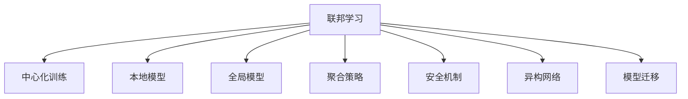

                 

## 1. 背景介绍

在过去的十年中，人工智能(AI)技术取得了巨大的进展，其中机器学习(ML)和深度学习(DL)模型在图像识别、自然语言处理、语音识别等领域的性能不断刷新新的记录。然而，随着数据量的爆炸性增长，中心化的数据存储和训练方式逐渐显得难以应对，尤其在数据隐私、模型性能和安全等方面存在诸多挑战。在这样的背景下，联邦学习(Federated Learning, FL)应运而生，它允许多个拥有数据隐私的本地节点通过分散式协同训练，在不共享原始数据的情况下，提升全局模型的性能。

### 1.1 问题由来
当前AI模型的训练依赖于大量的标注数据，这些数据通常由大型科技公司或数据收集机构掌握。然而，随着隐私保护法规（如GDPR、CCPA）的不断出台，中心化数据存储和共享已难以满足数据隐私保护的要求。与此同时，各个节点之间数据差异性较大，中心化模型训练往往无法充分利用这些多样化的数据资源，且容易在分布式环境中出现通信和计算效率问题。

为应对这些挑战，研究者提出了一种新型的分布式训练范式——联邦学习。联邦学习通过在本地节点上训练模型，然后聚合各节点的模型参数，实现在不共享原始数据的情况下，提升全局模型的性能。它不仅保护了数据隐私，还充分利用了分布式数据资源，成为未来AI训练的重要趋势。

### 1.2 问题核心关键点
联邦学习的主要目标是在各个本地节点上训练模型，而无需传输和共享原始数据。该技术的关键点包括：

1. 模型聚合策略：如何从本地模型中提取有用的信息，合并成全局模型。
2. 安全机制：如何在本地数据处理中保证模型的隐私性和安全性。
3. 异构网络：如何在通信带宽有限、网络状况复杂的情况下，实现高效的联邦学习。
4. 模型迁移：如何将本地训练的模型参数迁移到全局模型中，以实现更好的性能。

这些核心问题驱动了联邦学习技术的不断发展和完善，使其在多个领域得到了广泛的应用。

## 2. 核心概念与联系

### 2.1 核心概念概述

为更好地理解联邦学习的应用，本节将介绍几个密切相关的核心概念：

- **联邦学习(Federated Learning)**：一种分布式机器学习技术，允许多个拥有数据隐私的本地节点在不共享原始数据的情况下，协同训练全局模型。联邦学习通过聚合各节点本地模型的参数，提升全局模型性能，同时保护数据隐私。
- **中心化训练(Centralized Training)**：传统机器学习训练方式，所有数据和模型参数集中存储在单一服务器上。中心化训练数据共享性强，但数据隐私风险高，且中心化计算和通信开销大。
- **本地模型(Local Model)**：在每个本地节点上训练的模型，是联邦学习的核心组件。通过本地模型，可以保留数据隐私，同时优化全局模型性能。
- **全局模型(Global Model)**：由各本地模型聚合得到的模型，是联邦学习优化的最终目标。全局模型结合了各本地数据的特点，具有更好的泛化性能。
- **聚合策略(Aggregation Strategy)**：定义如何将各本地模型的参数合并成全局模型。常见的聚合方法包括联邦平均、联邦加权平均等。
- **安全机制(Security Mechanism)**：保证在联邦学习过程中，本地数据不被泄露或篡改。常用的安全机制包括差分隐私、同态加密等。
- **异构网络(Heterogeneous Network)**：联邦学习通常运行在通信带宽有限、网络状况复杂的环境下，如何高效利用网络资源是联邦学习的重要挑战。
- **模型迁移(Model Transfer)**：将本地模型迁移到全局模型中，提升全局模型的性能。常见的迁移方法包括模型融合、模型蒸馏等。

这些核心概念之间的逻辑关系可以通过以下Mermaid流程图来展示：



这个流程图展示了联邦学习的核心概念及其之间的关系：

1. 联邦学习通过分布式训练和模型聚合，改进传统中心化训练的方式。
2. 本地模型是在各本地节点上训练得到的，是联邦学习的关键组成部分。
3. 全局模型是聚合后的模型，是联邦学习的优化目标。
4. 聚合策略定义了本地模型如何合并成全局模型。
5. 安全机制保证了本地数据在训练过程中的隐私和安全。
6. 异构网络指联邦学习通常运行在通信资源受限的环境下。
7. 模型迁移指如何将本地模型迁移到全局模型中。

这些概念共同构成了联邦学习的完整框架，为其在不同应用场景中的实践提供了理论基础。

## 3. 核心算法原理 & 具体操作步骤
### 3.1 算法原理概述

联邦学习的核心思想是在各个本地节点上训练模型，然后将这些模型的参数聚合，得到全局模型的优化版本。其数学表达形式如下：

假设全局模型为 $F_{\theta}$，本地模型为 $F_{\theta_i}$，其中 $i$ 表示不同的本地节点。通过在本地节点上使用训练数据 $D_i$ 进行训练，得到本地模型的参数更新 $\Delta_i = F_{\theta_i}(D_i)$，然后将这些更新参数进行聚合，得到全局模型的更新 $\Delta = \sum_i \Delta_i$，最终更新全局模型的参数：

$$
\theta_{i+1} = \theta_i + \Delta
$$

其中 $\theta_i$ 为第 $i$ 个本地节点的模型参数，$\Delta$ 为全局模型参数更新量。

### 3.2 算法步骤详解

联邦学习的一般流程包括以下几个关键步骤：

**Step 1: 本地数据准备**
- 确定各本地节点上的训练数据集 $D_i$，这些数据通常为本地设备上存储的用户数据，如移动设备、医疗设备等。
- 对数据进行预处理，如数据去噪、归一化、划分训练/验证/测试集等。

**Step 2: 本地模型训练**
- 在本地节点上训练模型 $F_{\theta_i}$，通常使用梯度下降等优化算法进行训练。
- 每个本地节点使用本地的训练数据 $D_i$ 进行模型训练，更新参数 $\Delta_i = F_{\theta_i}(D_i)$。

**Step 3: 参数聚合**
- 将各个本地节点的模型参数更新 $\Delta_i$ 聚合成全局模型参数更新 $\Delta$。
- 常见的聚合方法包括联邦平均、联邦加权平均等。

**Step 4: 全局模型更新**
- 使用全局模型参数更新 $\Delta$，更新全局模型 $F_{\theta}$ 的参数。
- 通过更新 $\theta_{i+1} = \theta_i + \Delta$，得到新的全局模型。

**Step 5: 模型验证与部署**
- 在验证集上评估全局模型的性能。
- 如果满足预设的性能指标，则将模型部署到实际应用中。

### 3.3 算法优缺点

联邦学习相比中心化训练具有以下优点：

1. 数据隐私保护：通过本地训练，各节点无需共享原始数据，有效保护数据隐私。
2. 高效利用资源：通过分布式训练，各节点可以充分利用本地计算资源，提高模型性能。
3. 泛化性能提升：通过模型聚合，全局模型能够从各本地模型的多样性中受益，提升泛化性能。

然而，联邦学习也存在一些缺点：

1. 通信开销高：各节点需要频繁交换模型参数，通信开销较大。
2. 算法复杂度高：各节点需要协同工作，算法实现复杂度较高。
3. 性能不稳定：各节点之间数据分布和计算资源差异较大，性能不稳定。
4. 数据偏见：由于各节点数据分布不均，全局模型可能存在数据偏见。

尽管存在这些局限性，联邦学习在数据隐私保护、模型性能提升和资源利用效率等方面具有重要价值，其应用前景广阔。

### 3.4 算法应用领域

联邦学习已在多个领域得到了广泛应用，例如：

- **医疗健康**：联邦学习可以用于构建基于用户数据的多中心临床试验，提升药物研发效率。
- **智能制造**：联邦学习可以用于构建基于工业设备的预测性维护模型，提升设备健康监测能力。
- **金融风控**：联邦学习可以用于构建基于用户交易数据的风控模型，提升反欺诈和风险评估能力。
- **智慧城市**：联邦学习可以用于构建基于交通数据的智能交通系统，提升交通管理效率。
- **物联网(IoT)**：联邦学习可以用于构建基于设备数据的智能传感器网络，提升数据协同分析能力。

这些领域的应用展示了联邦学习的强大潜力和广泛适用性。未来，联邦学习将在更多领域得到应用，为不同行业的数字化转型提供新的解决方案。

## 4. 数学模型和公式 & 详细讲解 & 举例说明
### 4.1 数学模型构建

假设每个本地节点上的训练数据为 $D_i = \{x_i, y_i\}$，其中 $x_i$ 为输入，$y_i$ 为标签。使用交叉熵损失函数 $\ell(y, y') = -\sum_i y_i \log y'_i$，表示预测值 $y'$ 与真实标签 $y$ 之间的差异。

假设全局模型为 $F_{\theta}$，本地模型为 $F_{\theta_i}$，则本地模型的损失函数为：

$$
L_i(\theta_i) = \frac{1}{|D_i|} \sum_{(x,y) \in D_i} \ell(F_{\theta_i}(x), y)
$$

全局模型的损失函数为：

$$
L(\theta) = \frac{1}{N} \sum_i L_i(\theta_i)
$$

其中 $N$ 为本地节点的数量。

### 4.2 公式推导过程

为了推导联邦学习中的优化算法，我们首先对每个本地节点的损失函数进行微积分，得到梯度表达式：

$$
\nabla L_i(\theta_i) = -\frac{1}{|D_i|} \sum_{(x,y) \in D_i} \nabla_{\theta_i} \ell(F_{\theta_i}(x), y)
$$

通过链式法则，我们可以将全局模型的损失函数对全局模型参数 $\theta$ 的梯度表示为：

$$
\nabla L(\theta) = \sum_i \frac{1}{|D_i|} \sum_{(x,y) \in D_i} \nabla_{\theta} F_{\theta_i}(x) \cdot \nabla_{F_{\theta_i}(x)} \ell(F_{\theta_i}(x), y)
$$

根据上述推导，联邦学习中的优化算法可以通过以下步骤进行：

1. 每个本地节点在本地数据集 $D_i$ 上训练本地模型 $F_{\theta_i}$，计算梯度 $\nabla L_i(\theta_i)$。
2. 将本地节点的梯度 $\nabla L_i(\theta_i)$ 聚合成全局梯度 $\nabla L(\theta)$。
3. 使用全局梯度 $\nabla L(\theta)$ 更新全局模型参数 $\theta$。

### 4.3 案例分析与讲解

我们以医疗健康领域的联邦学习为例，进行详细讲解。假设每个医院拥有本地的患者数据，通过联邦学习可以构建一个基于多中心临床试验的联邦学习模型。

假设每个医院的数据集为 $D_i = \{(x_i, y_i)\}_{i=1}^n$，其中 $x_i$ 为患者的病历数据，$y_i$ 为疾病标签。假设全局模型为 $F_{\theta}$，本地模型为 $F_{\theta_i}$，则联邦学习的优化目标为：

$$
\theta_{i+1} = \theta_i - \eta \nabla L_i(\theta_i)
$$

其中 $\eta$ 为学习率，$\nabla L_i(\theta_i)$ 为本地模型的梯度。

为了实现数据隐私保护，可以使用差分隐私技术。假设每个医院在本地训练 $T$ 轮，则每次更新后的全局模型参数为：

$$
\theta_{i+1} = \theta_i + \frac{1}{T} \sum_{t=1}^T \nabla L_i^{(t)}(\theta_i)
$$

其中 $L_i^{(t)}$ 为第 $t$ 轮训练时，本地模型 $F_{\theta_i}$ 的损失函数。

## 5. 项目实践：代码实例和详细解释说明
### 5.1 开发环境搭建

在进行联邦学习实践前，我们需要准备好开发环境。以下是使用PyTorch进行联邦学习开发的环境配置流程：

1. 安装Anaconda：从官网下载并安装Anaconda，用于创建独立的Python环境。

2. 创建并激活虚拟环境：
```bash
conda create -n pytorch-env python=3.8 
conda activate pytorch-env
```

3. 安装PyTorch：根据CUDA版本，从官网获取对应的安装命令。例如：
```bash
conda install pytorch torchvision torchaudio cudatoolkit=11.1 -c pytorch -c conda-forge
```

4. 安装FedMix库：
```bash
pip install FedMix
```

5. 安装各类工具包：
```bash
pip install numpy pandas scikit-learn matplotlib tqdm jupyter notebook ipython
```

完成上述步骤后，即可在`pytorch-env`环境中开始联邦学习实践。

### 5.2 源代码详细实现

下面以医疗健康领域的联邦学习为例，给出使用PyTorch实现联邦学习的代码实现。

首先，定义本地数据处理函数：

```python
from torch.utils.data import Dataset
import torch

class MedicalDataset(Dataset):
    def __init__(self, data, labels):
        self.data = data
        self.labels = labels
        self.transform = self._to_tensor()
        
    def __len__(self):
        return len(self.data)
    
    def __getitem__(self, item):
        x, y = self.data[item], self.labels[item]
        return self.transform(x), y

def _to_tensor(data):
    return torch.tensor(data, dtype=torch.float32)
```

然后，定义本地模型的训练函数：

```python
from torch import nn, optim
import numpy as np

class LocalModel(nn.Module):
    def __init__(self, input_size, output_size):
        super().__init__()
        self.fc1 = nn.Linear(input_size, 128)
        self.fc2 = nn.Linear(128, output_size)
        
    def forward(self, x):
        x = self.fc1(x)
        x = nn.functional.relu(x)
        x = self.fc2(x)
        return x

def train_local_model(local_model, optimizer, device, data_loader):
    local_model.to(device)
    local_model.train()
    for batch_id, (data, label) in enumerate(data_loader):
        data, label = data.to(device), label.to(device)
        optimizer.zero_grad()
        output = local_model(data)
        loss = nn.functional.cross_entropy(output, label)
        loss.backward()
        optimizer.step()
        if (batch_id + 1) % 10 == 0:
            print(f'Epoch {epoch+1}, batch {batch_id+1}, loss: {loss.item():.4f}')
```

接着，定义全局模型的聚合函数：

```python
def aggregate_global_model(global_model, local_models, device):
    global_model.to(device)
    for local_model in local_models:
        local_model.to(device)
        with torch.no_grad():
            global_model.load_state_dict(local_model.state_dict())
    return global_model
```

最后，启动联邦学习流程：

```python
import torch
from torch.nn import CrossEntropyLoss
from torch.utils.data import DataLoader

device = torch.device('cuda') if torch.cuda.is_available() else torch.device('cpu')

# 假设所有本地数据为[(x,y)]形式的元组，构造本地数据集
train_data = []
train_labels = []
for i in range(5):
    # 构造本地数据集
    local_data = np.random.randn(1000, 10)
    local_labels = np.random.randint(2, size=(1000,))
    train_data.extend(local_data)
    train_labels.extend(local_labels)

# 构造本地数据集
train_dataset = MedicalDataset(train_data, train_labels)

# 本地模型
local_model = LocalModel(input_size=10, output_size=2).to(device)
optimizer = optim.SGD(local_model.parameters(), lr=0.01)

# 全局模型
global_model = LocalModel(input_size=10, output_size=2).to(device)
loss_fn = CrossEntropyLoss()

# 假设全局模型由5个本地模型聚合而来
local_models = [local_model for _ in range(5)]

# 训练本地模型
for epoch in range(5):
    for batch_id, (data, label) in enumerate(train_dataset):
        data, label = data.to(device), label.to(device)
        optimizer.zero_grad()
        output = local_model(data)
        loss = loss_fn(output, label)
        loss.backward()
        optimizer.step()

    # 聚合全局模型
    global_model = aggregate_global_model(global_model, local_models, device)

# 在全局模型上进行验证
correct = 0
total = 0
with torch.no_grad():
    for batch_id, (data, label) in enumerate(train_dataset):
        data, label = data.to(device), label.to(device)
        output = global_model(data)
        _, predicted = output.max(1)
        total += label.size(0)
        correct += (predicted == label).sum().item()

print(f'Accuracy of global model: {100 * correct / total:.2f}%')
```

以上就是使用PyTorch进行联邦学习实践的完整代码实现。可以看到，通过构建本地模型、定义本地数据集、实现本地模型训练函数，并使用聚合函数对全局模型进行更新，可以高效实现联邦学习。

### 5.3 代码解读与分析

让我们再详细解读一下关键代码的实现细节：

**MedicalDataset类**：
- `__init__`方法：初始化数据集和标签，并定义数据转换函数 `_to_tensor`。
- `__len__`方法：返回数据集的样本数量。
- `__getitem__`方法：对单个样本进行处理，返回转换后的数据和标签。

**LocalModel类**：
- `__init__`方法：定义模型的结构，包括两个线性层。
- `forward`方法：定义模型的前向传播过程。

**train_local_model函数**：
- 将本地模型和数据加载器传入，并定义训练过程。

**aggregate_global_model函数**：
- 将多个本地模型的参数聚合到全局模型中。

**训练流程**：
- 定义本地模型和全局模型，使用SGD优化器。
- 在本地模型上进行多轮训练，并更新全局模型。
- 在全局模型上进行验证，并输出准确率。

可以看到，PyTorch配合FedMix库使得联邦学习的代码实现变得简洁高效。开发者可以将更多精力放在本地模型设计、数据预处理等高层逻辑上，而不必过多关注底层的实现细节。

当然，工业级的系统实现还需考虑更多因素，如本地节点的异构性、联邦学习的扩展性、数据流的优化等。但核心的联邦学习范式基本与此类似。

## 6. 实际应用场景
### 6.1 智能制造
在智能制造领域，联邦学习可以用于构建基于工业设备的预测性维护模型。传统维护方式依赖于专家手动巡检，耗时耗力，且难以应对设备故障的随机性。而使用联邦学习，可以在多个工厂、车间等本地节点上训练本地模型，通过聚合各节点的模型参数，构建全局模型。该模型可以通过设备传感器数据，预测设备故障和维护需求，提升设备健康监测能力，减少设备停机时间。

### 6.2 金融风控
在金融风控领域，联邦学习可以用于构建基于用户交易数据的风控模型。由于各银行、保险公司等机构的数据可能存在隐私保护需求，且数据分布不均，传统中心化训练方式难以充分利用这些数据资源。而使用联邦学习，可以在多个机构本地节点上训练本地模型，通过聚合各节点的模型参数，构建全局模型。该模型可以综合各节点的数据特点，提升反欺诈和风险评估能力，保护用户隐私。

### 6.3 智慧城市
在智慧城市领域，联邦学习可以用于构建基于交通数据的智能交通系统。由于交通数据分散在各个交通监测设备和传感器中，中心化存储和处理方式效率低下。而使用联邦学习，可以在多个交通节点上训练本地模型，通过聚合各节点的模型参数，构建全局模型。该模型可以实时分析交通流量数据，优化交通信号灯控制，提升交通管理效率，缓解交通拥堵。

### 6.4 未来应用展望
随着联邦学习技术的不断发展，其在多个领域的应用前景将更加广阔。未来，联邦学习将在医疗健康、智能制造、智慧城市、物联网等领域得到更广泛的应用，为各行各业带来新的变革。

1. **医疗健康**：联邦学习可以用于构建基于多中心临床试验的联邦学习模型，提升药物研发效率。
2. **智能制造**：联邦学习可以用于构建基于工业设备的预测性维护模型，提升设备健康监测能力。
3. **金融风控**：联邦学习可以用于构建基于用户交易数据的风控模型，提升反欺诈和风险评估能力。
4. **智慧城市**：联邦学习可以用于构建基于交通数据的智能交通系统，提升交通管理效率。
5. **物联网**：联邦学习可以用于构建基于设备数据的智能传感器网络，提升数据协同分析能力。

此外，联邦学习还将与其他AI技术进一步融合，如强化学习、自然语言处理等，拓展更多应用场景。相信随着技术的不断进步，联邦学习必将在未来发挥更大的作用，成为构建分布式、隐私保护、高效AI系统的关键技术。

## 7. 工具和资源推荐
### 7.1 学习资源推荐

为了帮助开发者系统掌握联邦学习技术的理论基础和实践技巧，这里推荐一些优质的学习资源：

1. **《Federated Learning: Concepts and Applications》书籍**：该书由联邦学习领域的专家撰写，全面介绍了联邦学习的基本概念、主要算法和应用场景，是学习联邦学习的入门必读书籍。

2. **Stanford CS345A《Distributed Systems》课程**：斯坦福大学开设的分布式系统课程，深入讲解了分布式计算和数据处理的原理和实践，联邦学习是其中的一部分。

3. **Google AI Blog**：谷歌AI博客，定期发布联邦学习的最新研究进展和技术实践，是了解领域前沿动态的重要窗口。

4. **Federated AI Research (FAIR) Consortium**：FAIR是一个跨行业、跨领域的联邦学习研究联盟，提供联邦学习相关的最新研究、应用案例和开发工具，是学习联邦学习的资源宝库。

5. **Hugging Face Blog**：Hugging Face博客，定期发布自然语言处理和联邦学习方面的技术文章，提供丰富的代码实现和案例分析。

通过对这些资源的学习实践，相信你一定能够快速掌握联邦学习的精髓，并用于解决实际的AI问题。

### 7.2 开发工具推荐

高效的开发离不开优秀的工具支持。以下是几款用于联邦学习开发的常用工具：

1. **PyTorch**：基于Python的开源深度学习框架，灵活动态的计算图，适合快速迭代研究。PyTorch提供丰富的联邦学习库，如FedMix、PySyft等，支持联邦学习模型的开发和训练。

2. **TensorFlow**：由Google主导开发的开源深度学习框架，生产部署方便，适合大规模工程应用。TensorFlow提供联邦学习库，如TensorFlow Federated (TFF)，支持联邦学习模型的开发和训练。

3. **FedMix**：一个基于PyTorch的联邦学习框架，提供多种联邦学习算法和模型，支持分布式训练和模型聚合，是联邦学习开发的利器。

4. **PySyft**：一个开源的联邦学习框架，支持多种分布式计算和数据保护技术，提供丰富的联邦学习算法和工具，是联邦学习开发的强有力工具。

5. **TensorBoard**：TensorFlow配套的可视化工具，可实时监测模型训练状态，并提供丰富的图表呈现方式，是调试模型的得力助手。

6. **Weights & Biases**：模型训练的实验跟踪工具，可以记录和可视化模型训练过程中的各项指标，方便对比和调优。与主流深度学习框架无缝集成。

合理利用这些工具，可以显著提升联邦学习任务的开发效率，加快创新迭代的步伐。

### 7.3 相关论文推荐

联邦学习技术的发展源于学界的持续研究。以下是几篇奠基性的相关论文，推荐阅读：

1. **《 federated learning 》**：提出联邦学习的基本框架和算法，奠定了联邦学习的基础。

2. **《 federated averaging 》**：提出联邦平均算法，用于解决模型聚合的问题，成为联邦学习中最常用的聚合方法。

3. **《 federated learning with model averaging 》**：提出联邦加权平均算法，用于解决模型不平衡的问题，提高了模型的泛化性能。

4. **《 federated learning with local training of multiple models 》**：提出模型融合算法，通过多模型训练和融合，提升了模型的性能。

5. **《 federated learning with clipping and momentum-based model averaging 》**：提出基于剪枝和动量的模型平均算法，提高了模型的收敛速度和鲁棒性。

这些论文代表了大规模联邦学习技术的发展脉络。通过学习这些前沿成果，可以帮助研究者把握学科前进方向，激发更多的创新灵感。

## 8. 总结：未来发展趋势与挑战
### 8.1 总结

本文对联邦学习的应用进行了全面系统的介绍。首先阐述了联邦学习的基本概念和核心问题，明确了联邦学习在数据隐私保护、模型性能提升和资源利用效率等方面具有重要价值。其次，从原理到实践，详细讲解了联邦学习的数学模型和关键步骤，给出了联邦学习任务开发的完整代码实例。同时，本文还广泛探讨了联邦学习在智能制造、金融风控、智慧城市等多个领域的应用前景，展示了联邦学习的强大潜力和广泛适用性。最后，本文精选了联邦学习的各类学习资源，力求为读者提供全方位的技术指引。

通过本文的系统梳理，可以看到，联邦学习技术在数据隐私保护、分布式计算和模型泛化等方面具有重要优势，必将在未来得到广泛应用。联邦学习通过分布式协同训练，使多个本地节点在不共享原始数据的情况下，能够高效训练出全局模型，具有广泛的应用前景。未来，联邦学习将在更多领域得到应用，为不同行业的数字化转型提供新的解决方案。

### 8.2 未来发展趋势

展望未来，联邦学习技术将呈现以下几个发展趋势：

1. **算法多样性**：联邦学习将不断涌现更多算法和模型，如联邦蒸馏、联邦生成对抗网络等，提升模型的性能和泛化能力。
2. **异构网络优化**：联邦学习将在异构网络环境下进一步优化，提升通信效率和模型性能。
3. **隐私保护增强**：联邦学习将不断增强隐私保护机制，如差分隐私、同态加密等，提升数据隐私和安全。
4. **多模态学习**：联邦学习将与其他AI技术进一步融合，如自然语言处理、强化学习等，拓展更多应用场景。
5. **联邦联邦化**：未来，联邦学习将进一步发展为多级联邦学习，实现更高效、更灵活的分布式训练。

这些趋势展示了联邦学习技术的广阔前景。这些方向的探索发展，必将进一步提升联邦学习的性能和应用范围，为各行各业带来新的变革。

### 8.3 面临的挑战

尽管联邦学习技术已经取得了瞩目成就，但在迈向更加智能化、普适化应用的过程中，它仍面临诸多挑战：

1. **通信开销高**：联邦学习需要频繁交换模型参数，通信开销较大。如何优化通信开销，降低网络带宽占用，是联邦学习的关键挑战。
2. **算法复杂度高**：联邦学习需要协同工作，算法实现复杂度较高。如何简化联邦学习算法，提升计算效率，是联邦学习的技术挑战。
3. **性能不稳定**：联邦学习各节点之间数据分布和计算资源差异较大，性能不稳定。如何提升模型泛化性能，增强联邦学习算法的鲁棒性，是联邦学习的核心挑战。
4. **数据偏见**：由于各节点数据分布不均，全局模型可能存在数据偏见。如何缓解数据偏见，提升模型公平性，是联邦学习的伦理挑战。

尽管存在这些挑战，联邦学习在数据隐私保护、模型性能提升和资源利用效率等方面具有重要价值，其应用前景广阔。未来，相关研究需要进一步解决通信开销、算法复杂度、性能稳定性和数据偏见等问题，推动联邦学习技术的不断进步。

### 8.4 研究展望

联邦学习作为未来AI训练的重要趋势，未来的研究需要在以下几个方面寻求新的突破：

1. **优化通信开销**：通过模型压缩、分布式优化等技术，降低通信开销，提升联邦学习算法的效率。
2. **简化联邦算法**：通过模型蒸馏、联邦神经架构搜索等技术，简化联邦学习算法的实现，提升模型的计算效率。
3. **增强模型泛化**：通过多模态学习、联邦迁移学习等技术，增强联邦学习模型的泛化性能，提升模型的泛化能力和鲁棒性。
4. **提升隐私保护**：通过差分隐私、同态加密等技术，增强联邦学习算法的隐私保护能力，提升数据隐私和安全。
5. **缓解数据偏见**：通过公平性优化、多任务学习等技术，缓解联邦学习模型的数据偏见，提升模型的公平性和鲁棒性。

这些研究方向将引领联邦学习技术迈向更高的台阶，为构建安全、可靠、高效、公平的联邦学习系统提供理论和技术支持。面向未来，联邦学习技术还需要与其他AI技术进行更深入的融合，如自然语言处理、强化学习等，多路径协同发力，共同推动联邦学习技术的进步。只有勇于创新、敢于突破，才能不断拓展联邦学习的边界，让分布式智能技术更好地造福人类社会。

## 9. 附录：常见问题与解答

**Q1：联邦学习是否适用于所有数据分布不均的分布式系统？**

A: 联邦学习适用于数据分布不均的分布式系统，但需要合理设计本地数据集的大小和特征，以减少数据偏差。此外，联邦学习可以通过模型融合、联邦蒸馏等技术，缓解数据分布不均带来的影响。

**Q2：联邦学习中的通信开销是否可以优化？**

A: 联邦学习中的通信开销可以通过模型压缩、分布式优化等技术进行优化。例如，可以使用剪枝技术减少模型参数量，使用梯度压缩技术减少通信量，使用分布式优化算法加速模型训练。

**Q3：联邦学习中的隐私保护机制有哪些？**

A: 联邦学习中的隐私保护机制包括差分隐私、同态加密、多方安全计算等。差分隐私通过添加噪声保护隐私，同态加密在计算过程中保持数据加密，多方安全计算通过多方协同计算保护隐私。

**Q4：联邦学习中的模型聚合策略有哪些？**

A: 联邦学习中的模型聚合策略包括联邦平均、联邦加权平均、模型融合等。联邦平均是最常用的聚合方法，联邦加权平均用于处理数据不平衡的问题，模型融合可以通过多个模型的协同训练提升模型性能。

**Q5：联邦学习中的模型训练如何优化？**

A: 联邦学习中的模型训练可以通过模型压缩、分布式优化、差分隐私等技术进行优化。模型压缩可以减少模型参数量，分布式优化可以提高训练效率，差分隐私可以保护数据隐私。

这些问题的回答展示了联邦学习在不同场景下的应用和优化策略，帮助开发者更好地理解和应用联邦学习技术。相信随着技术的不断进步，联邦学习必将在更多领域得到应用，为不同行业的数字化转型提供新的解决方案。

