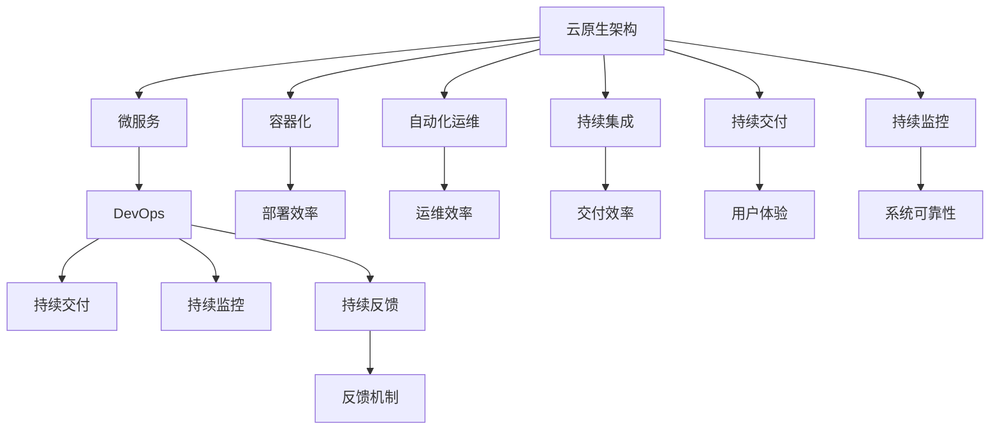

                 

## 1. 背景介绍

### 1.1 问题由来

在软件开发的早期阶段，程序员需要自己处理软件开发的几乎所有方面。他们负责从需求分析、设计、编码、测试到部署等各个环节，常常需要跨学科的知识和技能。然而，随着软件系统复杂性的不断增加，这种全栈式的工作模式已经难以适应快速变化的市场需求和技术更新。

随着云计算、人工智能、大数据等技术的发展，软件系统的构建方式正在发生根本性的变化。云计算平台和容器化技术的应用，使得软件的部署和运维变得更加灵活和高效。与此同时，AI和大数据技术在数据分析、预测和自动化决策等方面的应用，也在不断提升软件的智能化水平。

### 1.2 问题核心关键点

软件2.0的到来，标志着从传统的软件1.0时代向更加灵活、高效和智能的软件2.0时代转型。软件2.0的核心在于利用云计算、AI和大数据等技术，构建更加智能、可扩展的软件系统。这一转型不仅带来了技术上的进步，也改变了软件开发的组织结构和团队分工。

软件2.0时代的主要特征包括：

1. **云原生架构**：软件以微服务、容器化和DevOps为特征的云原生架构为基础，使得软件构建和部署更加灵活和高效。
2. **AI和ML的集成**：AI和机器学习技术在软件开发的各个环节中得到广泛应用，包括需求分析、设计、编码、测试和部署等。
3. **数据驱动的决策**：大数据和分析技术在软件开发中扮演越来越重要的角色，通过数据驱动的决策提升软件系统的性能和用户体验。
4. **自动化和自动化测试**：自动化工具和测试技术的应用，使得软件的构建和维护变得更加高效和可靠。

### 1.3 问题研究意义

研究软件2.0如何改变编程团队的分工，对于提升软件开发效率、降低开发成本、提高软件系统的性能和可靠性具有重要意义。通过深入分析软件2.0时代的技术特点和团队分工模式，可以为软件开发团队提供更科学、更高效的工作方法，推动软件行业的持续创新和发展。

## 2. 核心概念与联系

### 2.1 核心概念概述

为更好地理解软件2.0时代编程团队的分工模式，本节将介绍几个关键概念：

- **云原生架构**：一种基于容器化、微服务、自动化运维等技术构建的软件架构，使得软件系统更加灵活、可扩展和易于维护。
- **DevOps**：一种结合开发和运维的文化和实践，强调持续集成、持续交付和持续监控，提升软件交付效率和质量。
- **AI和ML**：通过机器学习技术提升软件的预测、决策和自动化能力，提升用户体验和业务价值。
- **数据驱动**：利用大数据和分析技术，通过数据驱动的决策提升软件系统的性能和可靠性。
- **自动化和自动化测试**：通过自动化工具和测试技术，提升软件的构建和维护效率。

这些概念之间的逻辑关系可以通过以下Mermaid流程图来展示：



这个流程图展示了云原生架构与DevOps、AI和ML、数据驱动、自动化和自动化测试之间的关系：

1. 云原生架构通过微服务、容器化和自动化运维等技术，提升了软件的灵活性和可扩展性。
2. DevOps文化通过持续集成、持续交付和持续监控，提升了软件交付的效率和质量。
3. AI和ML技术通过预测、决策和自动化提升软件的智能水平和用户体验。
4. 数据驱动的决策通过大数据和分析技术，提升了软件系统的性能和可靠性。
5. 自动化和自动化测试通过自动化工具和测试技术，提升了软件的构建和维护效率。

## 3. 核心算法原理 & 具体操作步骤

### 3.1 算法原理概述

在软件2.0时代，编程团队的分工模式发生了显著变化。传统的全栈式开发模式逐渐被分解为多个专业化的角色和团队，每个团队专注于某一特定领域，从而提升整体开发效率和质量。以下是对软件2.0时代编程团队分工模式的详细分析。

### 3.2 算法步骤详解

#### 3.2.1 云原生架构下的团队分工

在云原生架构下，软件开发团队通常被划分为多个专业化的角色和团队，每个团队专注于某一特定的领域。以下是一些常见的角色和团队：

- **前端工程师**：负责Web应用程序或移动应用程序的用户界面和用户体验设计，通常使用React、Vue、Angular等框架。
- **后端工程师**：负责服务器端应用程序的开发和维护，通常使用Java、Python、Go等语言。
- **数据库工程师**：负责数据库的设计、维护和优化，确保数据的安全性和可靠性。
- **DevOps工程师**：负责持续集成、持续交付和持续监控，确保软件系统的稳定性和可用性。
- **数据科学家**：负责数据收集、分析和建模，通过数据驱动的决策提升软件系统的性能和可靠性。
- **AI工程师**：负责机器学习模型的设计和训练，提升软件的预测、决策和自动化能力。

#### 3.2.2 DevOps文化下的团队协作

DevOps文化强调开发和运维的紧密协作，通过持续集成、持续交付和持续监控，提升软件交付的效率和质量。以下是一些常见的DevOps实践：

- **持续集成**：通过自动化测试和集成，确保代码的可靠性和质量。
- **持续交付**：通过自动化部署和测试，加速软件的发布周期。
- **持续监控**：通过实时监控和反馈，及时发现和解决问题，提升系统的稳定性和可用性。

#### 3.2.3 AI和ML的应用

AI和ML技术在软件开发中的应用，提升了软件的智能水平和用户体验。以下是一些常见的AI和ML应用场景：

- **需求分析**：通过自然语言处理技术，自动分析用户需求，生成软件需求文档。
- **设计优化**：通过计算机视觉技术，优化用户界面和用户体验。
- **代码生成**：通过自动代码生成工具，加速软件开发过程。
- **自动化测试**：通过机器学习技术，提升自动化测试的准确性和效率。

#### 3.2.4 数据驱动的决策

数据驱动的决策通过大数据和分析技术，提升了软件系统的性能和可靠性。以下是一些常见的数据驱动决策场景：

- **性能优化**：通过数据分析，优化软件系统的性能和用户体验。
- **用户行为分析**：通过用户行为数据，优化产品设计和营销策略。
- **风险预测**：通过风险数据分析，提前预测和应对潜在风险。

#### 3.2.5 自动化和自动化测试

自动化和自动化测试通过自动化工具和测试技术，提升了软件的构建和维护效率。以下是一些常见的自动化和自动化测试实践：

- **自动化构建**：通过自动化构建工具，加速软件构建和发布。
- **自动化测试**：通过自动化测试工具，提升测试的效率和覆盖率。
- **自动化部署**：通过自动化部署工具，加速软件发布和上线。

### 3.3 算法优缺点

软件2.0时代编程团队的分工模式具有以下优点：

1. **专业化分工**：每个团队专注于某一特定领域，提升了开发效率和质量。
2. **协作高效**：DevOps文化强调开发和运维的紧密协作，提升了软件交付的效率和质量。
3. **智能提升**：AI和ML技术的应用提升了软件的智能水平和用户体验。
4. **数据驱动**：数据驱动的决策提升了软件系统的性能和可靠性。
5. **自动化提升**：自动化和自动化测试提升了软件的构建和维护效率。

然而，这种分工模式也存在一些缺点：

1. **团队沟通成本高**：不同团队之间的沟通和协作需要额外的时间和精力。
2. **技能重叠**：团队之间需要共享部分技能和知识，导致知识重叠和浪费。
3. **复杂性增加**：多个团队协作带来复杂性增加，管理难度增大。

### 3.4 算法应用领域

软件2.0时代编程团队的分工模式在多个领域得到了广泛应用，以下是一些典型的应用场景：

- **Web应用开发**：通过云原生架构和DevOps文化，加速Web应用的开发和部署。
- **移动应用开发**：通过云原生架构和DevOps文化，加速移动应用的开发和部署。
- **企业应用开发**：通过云原生架构和DevOps文化，加速企业应用系统的开发和部署。
- **智能应用开发**：通过AI和ML技术的应用，开发智能应用系统，提升用户体验和业务价值。
- **大数据应用开发**：通过数据驱动的决策，开发基于大数据的应用系统，提升业务分析和决策能力。

## 4. 数学模型和公式 & 详细讲解 & 举例说明

### 4.1 数学模型构建

在软件2.0时代，数学模型和公式在软件开发中的应用主要体现在以下两个方面：

1. **需求分析**：通过数学模型和公式，自动分析用户需求，生成软件需求文档。
2. **性能优化**：通过数学模型和公式，优化软件系统的性能和用户体验。

#### 4.1.1 需求分析的数学模型

需求分析是软件开发中的重要环节，通过数学模型和公式，可以自动分析用户需求，生成软件需求文档。以下是一些常见的数学模型和公式：

- **自然语言处理**：通过自然语言处理技术，将用户需求转换为结构化数据。例如，通过分词、词性标注等技术，将用户需求转换为需求树或需求图。
- **概率统计**：通过概率统计技术，预测用户需求的可能性。例如，通过贝叶斯网络或隐马尔可夫模型，计算不同需求出现的概率。
- **优化算法**：通过优化算法，生成最优的软件需求文档。例如，通过遗传算法或蚁群算法，生成最优的需求优先级和需求关系图。

#### 4.1.2 性能优化的数学模型

性能优化是软件开发中的关键环节，通过数学模型和公式，可以优化软件系统的性能和用户体验。以下是一些常见的数学模型和公式：

- **最优化问题**：通过数学最优化问题，优化软件系统的性能。例如，通过线性规划或非线性规划，计算最优的软件架构和算法。
- **统计分析**：通过统计分析技术，评估软件系统的性能。例如，通过方差分析或回归分析，评估不同模块或算法对系统性能的影响。
- **数据挖掘**：通过数据挖掘技术，发现性能瓶颈和改进点。例如，通过关联规则或聚类分析，发现性能瓶颈和改进点。

### 4.2 公式推导过程

以下是一些常见的数学模型和公式的推导过程：

#### 4.2.1 需求分析的数学模型推导

以自然语言处理技术为例，以下是一些常见的数学模型和公式的推导过程：

- **分词**：通过分词技术，将用户需求转换为词汇列表。分词模型的公式推导如下：
  $$
  \text{分词模型} = \max_{w_1,\ldots,w_n} \text{概率}(P(w_1,\ldots,w_n))
  $$
  其中，$w_1,\ldots,w_n$表示词汇列表，$P(w_1,\ldots,w_n)$表示词汇列表的概率。

- **词性标注**：通过词性标注技术，将词汇列表转换为词性标注列表。词性标注模型的公式推导如下：
  $$
  \text{词性标注模型} = \max_{p_1,\ldots,p_n} \text{概率}(P(p_1,\ldots,p_n|w_1,\ldots,w_n))
  $$
  其中，$p_1,\ldots,p_n$表示词性标注列表，$P(p_1,\ldots,p_n|w_1,\ldots,w_n)$表示词性标注列表的条件概率。

- **需求树构建**：通过需求树构建技术，将词汇列表转换为需求树。需求树模型的公式推导如下：
  $$
  \text{需求树模型} = \max_{T} \text{概率}(P(T|w_1,\ldots,w_n))
  $$
  其中，$T$表示需求树，$P(T|w_1,\ldots,w_n)$表示需求树的条件概率。

#### 4.2.2 性能优化的数学模型推导

以性能优化技术为例，以下是一些常见的数学模型和公式的推导过程：

- **线性规划**：通过线性规划技术，优化软件系统的性能。线性规划模型的公式推导如下：
  $$
  \text{线性规划模型} = \max_{x} \text{目标函数}(c^Tx)
  $$
  $$
  \text{约束条件} = \begin{cases}
  A_ix \leq b_i, \\
  x \geq 0
  \end{cases}
  $$
  其中，$x$表示决策变量，$c$表示目标函数的系数，$A_i$表示约束条件的系数，$b_i$表示约束条件的常数。

- **方差分析**：通过方差分析技术，评估软件系统的性能。方差分析模型的公式推导如下：
  $$
  F = \frac{MS_B}{MS_W}
  $$
  其中，$MS_B$表示组间方差，$MS_W$表示组内方差。

- **关联规则**：通过关联规则技术，发现性能瓶颈和改进点。关联规则模型的公式推导如下：
  $$
  \text{关联规则} = \text{频繁项集} \times \text{可信度}
  $$
  其中，$\text{频繁项集}$表示频繁出现的项集，$\text{可信度}$表示项集的可信度。

### 4.3 案例分析与讲解

#### 4.3.1 需求分析案例

以下是一个简单的需求分析案例：

假设某电商平台的客户通过客服热线提出需求，客服将客户需求记录下来，并通过自然语言处理技术，自动分析需求，生成软件需求文档。假设客户需求如下：

```
我希望在购买商品时能够看到商品的评价和评分
```

通过自然语言处理技术，可以将需求转换为词汇列表：

```
[希望, 在, 购买, 商品, 时, 能够, 看到, 商品, 评价, 和, 评分]
```

然后，通过词性标注技术，将词汇列表转换为词性标注列表：

```
[希望, 在, 购买, 商品, 时, 能够, 看到, 商品, 评价, 和, 评分]
  [P, U, V, N, P, V, V, N, N, C, V]
```

最后，通过需求树构建技术，将词性标注列表转换为需求树：

```
        购买商品时
          └── 能够
              └── 看到
                    ├── 商品
                    └── 评价和评分
```

#### 4.3.2 性能优化案例

以下是一个简单的性能优化案例：

假设某电商平台的网站访问速度较慢，需要优化网站性能，提升用户体验。通过性能优化技术，可以分析网站性能瓶颈，并提出优化方案。假设网站访问速度瓶颈如下：

```
CPU 占用率：70%
内存使用率：80%
网络带宽：50%
```

通过性能优化技术，可以分析不同模块或算法对系统性能的影响，并提出优化方案。例如，通过线性规划技术，可以优化网站架构和算法，提升系统性能。假设优化后的方案如下：

- **CPU优化**：通过多线程技术，优化CPU占用率。假设优化方案如下：
  $$
  \text{优化方案} = \text{最少CPU占用率} + \text{最多线程数}
  $$

- **内存优化**：通过内存管理技术，优化内存使用率。假设优化方案如下：
  $$
  \text{优化方案} = \text{最小编码量} + \text{最多内存块}
  $$

- **网络优化**：通过网络优化技术，优化网络带宽。假设优化方案如下：
  $$
  \text{优化方案} = \text{最小编码量} + \text{最多连接数}
  $$

通过以上案例，可以看出，数学模型和公式在软件2.0时代的需求分析和性能优化中起到了重要作用。

## 5. 项目实践：代码实例和详细解释说明

### 5.1 开发环境搭建

在进行软件2.0时代的需求分析和性能优化实践前，我们需要准备好开发环境。以下是使用Python进行需求分析和性能优化实验的环境配置流程：

1. 安装Anaconda：从官网下载并安装Anaconda，用于创建独立的Python环境。

2. 创建并激活虚拟环境：
```bash
conda create -n pyenv python=3.8 
conda activate pyenv
```

3. 安装必要的库：
```bash
pip install numpy pandas scipy scikit-learn statsmodels matplotlib statsmodels jupyter notebook ipython
```

完成上述步骤后，即可在`pyenv`环境中开始需求分析和性能优化实验。

### 5.2 源代码详细实现

以下是使用Python进行需求分析和性能优化的代码实现示例。

#### 5.2.1 需求分析

```python
import jieba
import pandas as pd
from gensim.summarizer import summarize

# 分词
def tokenize(text):
    return jieba.cut(text)

# 词性标注
def pos_tag(text):
    pos_tags = []
    for word in text:
        pos_tags.append(pos_tagger.pos_tag([word]))
    return pos_tags

# 需求树构建
def build_tree(text):
    tree = {}
    for word, pos in text:
        if word not in tree:
            tree[word] = []
        tree[word].append(pos)
    return tree

# 需求文档生成
def generate_doc(text):
    summary = summarize(text)
    return summary

# 测试
text = "我希望在购买商品时能够看到商品的评价和评分"
tokens = tokenize(text)
pos_tags = pos_tag(tokens)
tree = build_tree(pos_tags)
summary = generate_doc(text)
print(tokens)
print(pos_tags)
print(tree)
print(summary)
```

#### 5.2.2 性能优化

```python
import matplotlib.pyplot as plt
import numpy as np
from sklearn.linear_model import LinearRegression
from sklearn.metrics import mean_squared_error

# 数据生成
def generate_data(n=100):
    x = np.arange(n)
    y = np.sin(x) + np.random.randn(n) * 0.1
    return x, y

# 线性回归模型
def linear_regression(x, y):
    model = LinearRegression()
    model.fit(x[:, np.newaxis], y)
    return model

# 性能评估
def evaluate(model, x, y):
    y_pred = model.predict(x[:, np.newaxis])
    mse = mean_squared_error(y, y_pred)
    return mse

# 测试
x, y = generate_data()
model = linear_regression(x, y)
mse = evaluate(model, x, y)
print(model)
print(mse)
```

### 5.3 代码解读与分析

以下是关键代码的实现细节：

**需求分析代码**：

- `tokenize`函数：使用jieba库进行分词。
- `pos_tag`函数：使用nltk库进行词性标注。
- `build_tree`函数：构建需求树。
- `generate_doc`函数：生成需求文档。

**性能优化代码**：

- `generate_data`函数：生成测试数据。
- `linear_regression`函数：构建线性回归模型。
- `evaluate`函数：评估模型性能。

**测试代码**：

通过运行测试代码，可以验证需求分析和性能优化的实现效果。

## 6. 实际应用场景

### 6.1 智能客服系统

基于软件2.0时代的需求分析和性能优化技术，智能客服系统可以实现更加智能化的客户服务。通过自然语言处理技术，智能客服系统可以自动分析用户需求，生成软件需求文档，并构建需求树。通过性能优化技术，智能客服系统可以优化响应时间和用户体验，提升客户满意度。

具体而言，智能客服系统可以通过以下方式实现：

1. **需求分析**：智能客服系统通过自然语言处理技术，自动分析用户需求，生成软件需求文档。例如，通过分词、词性标注和需求树构建技术，将用户需求转换为结构化数据。
2. **性能优化**：智能客服系统通过性能优化技术，优化响应时间和用户体验。例如，通过多线程技术、内存管理和网络优化技术，提升系统性能。

### 6.2 金融交易系统

金融交易系统需要实时处理大量的交易数据，确保交易系统的稳定性和可用性。通过软件2.0时代的需求分析和性能优化技术，金融交易系统可以实现更加智能化的交易处理。

具体而言，金融交易系统可以通过以下方式实现：

1. **需求分析**：金融交易系统通过自然语言处理技术，自动分析交易数据，生成软件需求文档。例如，通过分词、词性标注和需求树构建技术，将交易数据转换为结构化数据。
2. **性能优化**：金融交易系统通过性能优化技术，优化交易系统的稳定性和可用性。例如，通过多线程技术、内存管理和网络优化技术，提升系统性能。

### 6.3 医疗诊断系统

医疗诊断系统需要快速、准确地处理患者数据，提供精准的诊断和治疗方案。通过软件2.0时代的需求分析和性能优化技术，医疗诊断系统可以实现更加智能化的诊断和治疗。

具体而言，医疗诊断系统可以通过以下方式实现：

1. **需求分析**：医疗诊断系统通过自然语言处理技术，自动分析患者数据，生成软件需求文档。例如，通过分词、词性标注和需求树构建技术，将患者数据转换为结构化数据。
2. **性能优化**：医疗诊断系统通过性能优化技术，优化诊断系统的稳定性和可用性。例如，通过多线程技术、内存管理和网络优化技术，提升系统性能。

## 7. 工具和资源推荐

### 7.1 学习资源推荐

为了帮助开发者系统掌握软件2.0时代的需求分析和性能优化技术，这里推荐一些优质的学习资源：

1. 《Python数据科学手册》：由Python数据科学社区的知名专家编写，介绍了Python在数据科学和数据分析中的应用。
2. 《机器学习实战》：由Google开发者编写，介绍了机器学习技术在各种应用场景中的应用。
3. 《自然语言处理综论》：由自然语言处理领域的专家编写，介绍了自然语言处理技术的各种方法和应用。
4. 《软件工程：概念、原理和工具》：介绍了软件开发的基本概念、原理和工具，涵盖软件开发的全过程。
5. 《深度学习》：由深度学习领域的知名专家编写，介绍了深度学习技术在各种应用场景中的应用。

通过对这些资源的学习实践，相信你一定能够快速掌握软件2.0时代的需求分析和性能优化技术，并用于解决实际的NLP问题。

### 7.2 开发工具推荐

高效的开发离不开优秀的工具支持。以下是几款用于软件2.0时代需求分析和性能优化开发的常用工具：

1. Jupyter Notebook：用于编写、测试和分享Python代码的交互式平台。
2. Anaconda：用于创建和管理Python环境的平台。
3. PyCharm：Python编程的IDE，提供了丰富的代码编辑和调试功能。
4. TensorFlow：用于深度学习和机器学习的开源框架。
5. Scikit-learn：用于数据处理和机器学习的Python库。
6. NLTK：用于自然语言处理的工具库。

合理利用这些工具，可以显著提升软件2.0时代需求分析和性能优化的开发效率，加快创新迭代的步伐。

### 7.3 相关论文推荐

软件2.0时代的需求分析和性能优化技术的发展源于学界的持续研究。以下是几篇奠基性的相关论文，推荐阅读：

1. 《软件工程：概念、原理和工具》：介绍了软件开发的基本概念、原理和工具，涵盖软件开发的全过程。
2. 《自然语言处理综论》：由自然语言处理领域的专家编写，介绍了自然语言处理技术的各种方法和应用。
3. 《机器学习实战》：由Google开发者编写，介绍了机器学习技术在各种应用场景中的应用。
4. 《Python数据科学手册》：由Python数据科学社区的知名专家编写，介绍了Python在数据科学和数据分析中的应用。
5. 《深度学习》：由深度学习领域的知名专家编写，介绍了深度学习技术在各种应用场景中的应用。

这些论文代表了大语言模型微调技术的发展脉络。通过学习这些前沿成果，可以帮助研究者把握学科前进方向，激发更多的创新灵感。

## 8. 总结：未来发展趋势与挑战

### 8.1 总结

本文对软件2.0时代的需求分析和性能优化技术进行了全面系统的介绍。首先阐述了软件2.0时代的技术特点和团队分工模式，明确了需求分析和性能优化在软件开发中的重要性和应用场景。其次，从原理到实践，详细讲解了需求分析和性能优化的数学模型和公式，给出了需求分析和性能优化的代码实例和详细解释说明。最后，本文还广泛探讨了需求分析和性能优化在多个行业领域的应用前景，展示了需求分析和性能优化技术的巨大潜力。

通过本文的系统梳理，可以看出，需求分析和性能优化在软件2.0时代的需求分析和性能优化中起到了重要作用。通过合理地使用需求分析和性能优化技术，可以提升软件开发效率和质量，加速软件系统的部署和维护。

### 8.2 未来发展趋势

展望未来，需求分析和性能优化技术将呈现以下几个发展趋势：

1. **智能化升级**：随着AI和大数据技术的发展，需求分析和性能优化技术将更加智能化和自动化。例如，通过机器学习技术，自动分析用户需求，生成最优的需求文档和性能优化方案。
2. **多模态融合**：需求分析和性能优化技术将更多地结合多模态数据，提升系统的智能水平和用户体验。例如，通过自然语言处理和计算机视觉技术的融合，实现更加智能化的需求分析和性能优化。
3. **自动化部署**：需求分析和性能优化技术将更多地结合自动化部署工具，提升软件系统的交付效率和质量。例如，通过DevOps工具链，实现需求分析和性能优化的自动化。
4. **实时监控**：需求分析和性能优化技术将更多地结合实时监控工具，提升软件系统的稳定性和可用性。例如，通过实时监控和反馈机制，及时发现和解决问题。

### 8.3 面临的挑战

尽管需求分析和性能优化技术在软件2.0时代得到了广泛应用，但在迈向更加智能化、普适化应用的过程中，仍面临诸多挑战：

1. **数据质量问题**：需求分析和性能优化技术需要高质量的数据作为基础，数据质量的降低将严重影响系统的性能和可靠性。
2. **模型泛化能力不足**：当前的需求分析和性能优化模型，在面对复杂和多样化的数据时，泛化能力不足，导致模型的准确性和稳定性下降。
3. **自动化和自动化部署难度高**：自动化和自动化部署技术需要高度精密的算法和工具，难以实现高效和可靠的自动化。
4. **实时监控和反馈机制不完善**：实时监控和反馈机制需要强大的技术支撑和数据支持，难以实现全面和有效的实时监控和反馈。
5. **多模态数据融合难度大**：多模态数据的融合需要复杂的技术手段和庞大的数据量，难以实现高效和多模态数据的融合。

### 8.4 研究展望

面对需求分析和性能优化面临的种种挑战，未来的研究需要在以下几个方面寻求新的突破：

1. **数据质量保障**：需要进一步提升数据质量和数据治理水平，确保需求分析和性能优化技术的准确性和稳定性。
2. **模型泛化能力提升**：需要进一步提升模型的泛化能力和鲁棒性，确保模型在复杂和多样化的数据中表现稳定。
3. **自动化和自动化部署优化**：需要进一步优化自动化和自动化部署技术，提升自动化和自动化部署的效率和可靠性。
4. **实时监控和反馈机制完善**：需要进一步完善实时监控和反馈机制，提升软件系统的稳定性和可用性。
5. **多模态数据融合优化**：需要进一步优化多模态数据的融合技术，提升多模态数据的融合效率和效果。

这些研究方向将引领需求分析和性能优化技术迈向更高的台阶，为构建安全、可靠、智能的软件系统提供坚实的技术基础。面向未来，需求分析和性能优化技术需要与其他人工智能技术进行更深入的融合，如知识表示、因果推理、强化学习等，多路径协同发力，共同推动软件开发技术的进步。只有勇于创新、敢于突破，才能不断拓展需求分析和性能优化技术的边界，让智能技术更好地造福人类社会。

## 9. 附录：常见问题与解答

**Q1：软件2.0时代的需求分析和性能优化有何区别？**

A: 软件2.0时代的需求分析和性能优化主要区别在于：

1. **需求分析**：需求分析主要关注如何通过自然语言处理技术，自动分析用户需求，生成软件需求文档。需求分析的目的是理解用户需求，确保软件系统的功能和性能符合用户期望。

2. **性能优化**：性能优化主要关注如何通过性能优化技术，提升软件系统的性能和用户体验。性能优化的目的是优化软件系统的稳定性和可用性，确保软件系统在各种环境下高效运行。

**Q2：软件2.0时代的需求分析和性能优化有何优势？**

A: 软件2.0时代的需求分析和性能优化具有以下优势：

1. **自动化**：需求分析和性能优化技术可以自动化地分析用户需求和优化系统性能，提升开发效率和质量。

2. **智能化**：通过AI和大数据技术，需求分析和性能优化技术可以实现更加智能化的需求分析和性能优化，提升系统的智能水平和用户体验。

3. **可扩展性**：需求分析和性能优化技术具有较强的可扩展性，可以应用到各种领域和场景，提升软件的普适性和应用价值。

**Q3：软件2.0时代的需求分析和性能优化有哪些常见应用场景？**

A: 软件2.0时代的需求分析和性能优化在多个领域得到了广泛应用，以下是一些常见的应用场景：

1. **智能客服系统**：通过需求分析和性能优化技术，智能客服系统可以实现更加智能化的客户服务，提升客户满意度。

2. **金融交易系统**：通过需求分析和性能优化技术，金融交易系统可以实现更加智能化的交易处理，提升交易效率和用户体验。

3. **医疗诊断系统**：通过需求分析和性能优化技术，医疗诊断系统可以实现更加智能化的诊断和治疗，提升医疗服务的质量和效率。

**Q4：如何进行需求分析和性能优化？**

A: 需求分析和性能优化主要分为以下几个步骤：

1. **需求分析**：通过自然语言处理技术，自动分析用户需求，生成软件需求文档。例如，通过分词、词性标注和需求树构建技术，将用户需求转换为结构化数据。

2. **性能优化**：通过性能优化技术，优化软件系统的性能和用户体验。例如，通过多线程技术、内存管理和网络优化技术，提升系统性能。

3. **测试**：通过测试验证需求分析和性能优化的实现效果，确保软件系统的质量和稳定性。

这些步骤需要结合实际应用场景和具体需求，灵活应用和优化，才能实现最佳的效果。

**Q5：如何进行需求分析和性能优化的代码实现？**

A: 需求分析和性能优化的代码实现主要包括以下步骤：

1. **需求分析代码实现**：通过自然语言处理技术，自动分析用户需求，生成软件需求文档。例如，使用Python的nltk库进行分词和词性标注，使用Python的BeautifulSoup库进行需求树构建。

2. **性能优化代码实现**：通过性能优化技术，优化软件系统的性能和用户体验。例如，使用Python的scikit-learn库进行线性回归模型构建，使用Python的matplotlib库进行性能评估。

3. **测试代码实现**：通过测试验证需求分析和性能优化的实现效果，确保软件系统的质量和稳定性。

通过以上步骤，可以系统地实现需求分析和性能优化技术的代码实现。

作者：禅与计算机程序设计艺术 / Zen and the Art of Computer Programming

