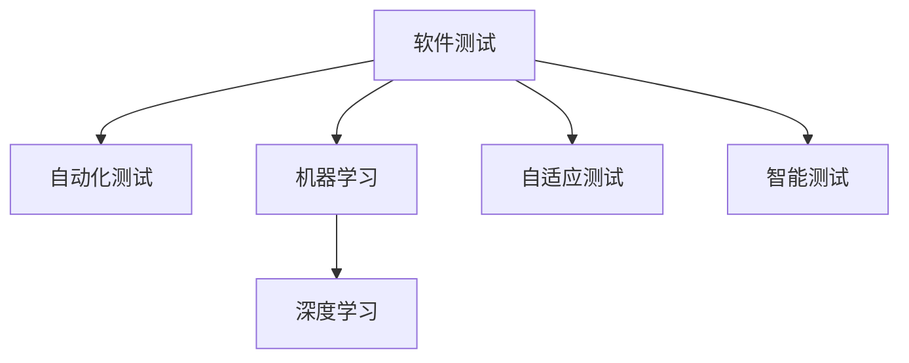

                 

## 1. 背景介绍

### 1.1 问题由来
随着计算机技术的飞速发展，软件开发生命周期中测试工作的复杂性和重要性愈发凸显。测试人员不仅要确保软件的正确性，还需要保证软件的性能、安全性和可靠性。传统的软件测试方法往往依赖人工测试和静态代码检查，存在测试效率低、覆盖率不足、成本高等问题。近年来，人工智能技术的兴起，特别是深度学习、自然语言处理等领域的突破，为软件测试方法带来了新的变革。

### 1.2 问题核心关键点
软件测试方法论的变革，核心在于利用人工智能技术提升测试的自动化水平和智能化程度。具体而言，通过机器学习、深度学习等技术，可以构建自适应测试模型，自动生成测试用例、预测软件缺陷、自动化执行测试用例，从而大大提高测试效率和测试质量，降低测试成本。

### 1.3 问题研究意义
研究软件2.0时代的新型测试方法，对于提升软件质量、加快产品上市、优化软件开发流程具有重要意义：

1. 提高测试效率。自动化的测试方法和工具可以有效缩短测试周期，提高测试效率。
2. 提高测试覆盖率。通过智能化的测试方法，能够全面覆盖软件的各种功能和边界条件，减少漏测和误测。
3. 降低测试成本。自动化的测试过程减少了人工参与，大幅降低测试成本，加速企业产品迭代。
4. 增强测试可控性。通过数据驱动的测试模型，可以更好地量化测试质量，提高测试的可控性和可重复性。
5. 优化软件开发流程。测试与开发的紧密结合，能够提升整体开发效率，缩短上市周期。

## 2. 核心概念与联系

### 2.1 核心概念概述

为更好地理解软件2.0时代的新型测试方法，本节将介绍几个密切相关的核心概念：

- 软件测试：通过一系列活动，确保软件的质量和性能符合需求和标准的过程。
- 自动化测试：利用工具和脚本，自动执行测试用例，减少人工干预的过程。
- 机器学习：通过数据驱动的算法，自动从数据中学习规律和模式的过程。
- 深度学习：一种特殊类型的机器学习，使用多层神经网络，能够处理更复杂的数据模式。
- 自适应测试：利用机器学习算法，根据历史测试数据和反馈信息，自动调整测试策略的过程。
- 智能测试：结合自然语言处理、知识图谱等技术，实现更高效、更全面的测试分析。

这些核心概念之间的逻辑关系可以通过以下Mermaid流程图来展示：



这个流程图展示了一些核心概念及其之间的关系：

1. 软件测试是整个软件开发流程的关键环节。
2. 自动化测试通过减少人工干预，提高测试效率和覆盖率。
3. 机器学习和深度学习为测试提供了数据驱动的算法，提升测试智能化水平。
4. 自适应测试和智能测试进一步优化了测试策略，提升测试效果。

## 3. 核心算法原理 & 具体操作步骤

### 3.1 算法原理概述

软件2.0时代的新型测试方法，本质上是通过机器学习算法实现自动化和智能化测试。其核心思想是：利用历史测试数据和反馈信息，构建自适应测试模型，自动生成测试用例、预测软件缺陷、自动化执行测试用例。

具体而言，常用的算法包括：

- 回归测试：利用历史测试数据，预测软件在特定条件下的行为，自动生成测试用例。
- 分类测试：通过训练模型，自动识别软件中的缺陷类型，提高缺陷检测率。
- 聚类测试：利用聚类算法，对测试用例进行分组，提高测试覆盖率和效率。
- 强化学习测试：通过与环境的交互，自动优化测试策略，提升测试效果。

### 3.2 算法步骤详解

#### 3.2.1 数据收集与预处理

测试数据的收集和预处理是构建测试模型的基础。一般而言，测试数据可以分为两类：

- 错误报告数据：收集软件缺陷的报告信息，如错误类型、发现时间、严重程度等。
- 测试执行数据：记录软件测试用例的执行信息，如测试步骤、执行结果、覆盖率等。

数据收集后，需要进行预处理，包括数据清洗、数据标注、数据归一化等步骤，以便于后续的模型训练。

#### 3.2.2 模型构建与训练

选择合适的机器学习模型，并利用历史测试数据进行训练。常用的模型包括回归模型、分类模型、聚类模型等。训练过程中，需要选择合适的损失函数、优化算法和超参数，以获得最佳模型性能。

#### 3.2.3 模型评估与优化

训练好的模型需要进行评估，以验证其性能和泛化能力。常见的评估指标包括精确率、召回率、F1值、覆盖率等。根据评估结果，对模型进行优化，如调整超参数、引入正则化技术等。

#### 3.2.4 模型应用与测试

将训练好的模型应用于实际的测试场景中，自动生成测试用例、预测软件缺陷、自动化执行测试用例。这一步骤需要结合具体的测试环境，灵活调整模型的参数和行为。

### 3.3 算法优缺点

#### 3.3.1 优点

1. 提高测试效率。自动化测试和智能测试方法可以快速生成和执行测试用例，缩短测试周期。
2. 提高测试覆盖率。自适应测试和聚类测试方法能够全面覆盖软件的各种功能和边界条件，减少漏测和误测。
3. 降低测试成本。自动化的测试过程减少了人工参与，大幅降低测试成本，加速企业产品迭代。
4. 增强测试可控性。数据驱动的测试模型可以更好地量化测试质量，提高测试的可控性和可重复性。

#### 3.3.2 缺点

1. 数据依赖性强。测试模型的性能依赖于历史测试数据的质量和数量，数据不足时难以取得良好效果。
2. 模型泛化能力有限。训练模型时需要考虑测试场景的多样性和复杂性，泛化能力有限的模型可能在特定场景下失效。
3. 模型解释性不足。许多深度学习模型缺乏可解释性，测试人员难以理解模型的决策过程。
4. 模型维护复杂。随着软件和测试场景的变化，模型需要不断更新和维护，增加工作量。

## 4. 数学模型和公式 & 详细讲解 & 举例说明

### 4.1 数学模型构建

假设我们有一个回归测试模型 $M(x)$，其中 $x$ 为测试用例的特征向量，$M(x)$ 为测试结果。模型的目标是预测软件在不同条件下的行为，生成新的测试用例。

设训练数据集为 $D=\{(x_i,y_i)\}_{i=1}^N$，其中 $x_i$ 为特征向量，$y_i$ 为真实标签。回归模型的目标是最小化损失函数：

$$
\mathcal{L}(\theta)=\frac{1}{N}\sum_{i=1}^N\left(M(x_i)-y_i\right)^2
$$

其中 $\theta$ 为模型参数，$M(x)$ 为模型预测值。

### 4.2 公式推导过程

回归模型的求解通常采用梯度下降法，求解最小化目标函数：

$$
\min_{\theta} \mathcal{L}(\theta)
$$

具体步骤如下：

1. 随机初始化模型参数 $\theta$。
2. 利用训练数据计算损失函数的梯度 $\frac{\partial \mathcal{L}(\theta)}{\partial \theta}$。
3. 根据梯度方向更新模型参数 $\theta$。
4. 重复步骤2和3，直至收敛或达到预设的迭代次数。

### 4.3 案例分析与讲解

以回归测试模型为例，我们以预测软件在不同输入条件下的响应时间为例，分析模型的构建和训练过程。

假设我们有一个软件模块，其响应时间与输入参数 $x$ 之间存在线性关系。设 $M(x)$ 为回归模型，$y_i$ 为真实响应时间，$x_i$ 为输入参数。我们可以使用线性回归模型：

$$
M(x)=\theta_0+\theta_1 x
$$

其中 $\theta_0$ 和 $\theta_1$ 为模型参数。根据训练数据集 $D$，我们可以求解损失函数的最小值：

$$
\min_{\theta} \frac{1}{N}\sum_{i=1}^N\left(M(x_i)-y_i\right)^2
$$

利用梯度下降法求解，可以得到：

$$
\frac{\partial \mathcal{L}(\theta)}{\partial \theta_0}=-2\frac{1}{N}\sum_{i=1}^N(M(x_i)-y_i)
$$

$$
\frac{\partial \mathcal{L}(\theta)}{\partial \theta_1}=-2\frac{1}{N}\sum_{i=1}^N x_i(M(x_i)-y_i)
$$

通过迭代计算，可以逐步优化模型参数，得到最佳的回归模型。

## 5. 项目实践：代码实例和详细解释说明

### 5.1 开发环境搭建

在进行测试方法实践前，我们需要准备好开发环境。以下是使用Python进行PyTorch开发的环境配置流程：

1. 安装Anaconda：从官网下载并安装Anaconda，用于创建独立的Python环境。

2. 创建并激活虚拟环境：
```bash
conda create -n pytorch-env python=3.8 
conda activate pytorch-env
```

3. 安装PyTorch：根据CUDA版本，从官网获取对应的安装命令。例如：
```bash
conda install pytorch torchvision torchaudio cudatoolkit=11.1 -c pytorch -c conda-forge
```

4. 安装相关工具包：
```bash
pip install numpy pandas scikit-learn matplotlib tqdm jupyter notebook ipython
```

完成上述步骤后，即可在`pytorch-env`环境中开始测试方法实践。

### 5.2 源代码详细实现

这里以回归测试方法为例，给出使用PyTorch进行回归测试模型构建的PyTorch代码实现。

首先，定义回归测试模型的训练函数：

```python
import torch
import torch.nn as nn
import torch.optim as optim

class RegressionModel(nn.Module):
    def __init__(self, input_dim, output_dim):
        super(RegressionModel, self).__init__()
        self.linear = nn.Linear(input_dim, output_dim)
        
    def forward(self, x):
        return self.linear(x)
    
def train_model(model, optimizer, train_loader, epochs=1000):
    model.train()
    loss_fn = nn.MSELoss()
    for epoch in range(epochs):
        for x, y in train_loader:
            optimizer.zero_grad()
            y_pred = model(x)
            loss = loss_fn(y_pred, y)
            loss.backward()
            optimizer.step()
    return model
```

然后，定义训练数据和测试数据：

```python
# 训练数据
train_x = torch.tensor([[1, 2, 3], [4, 5, 6], [7, 8, 9]])
train_y = torch.tensor([2, 5, 10])

# 测试数据
test_x = torch.tensor([[2, 4, 6], [8, 10, 12]])
test_y = torch.tensor([5, 15])

# 定义训练集和测试集
train_loader = torch.utils.data.DataLoader(train_data, batch_size=1)
test_loader = torch.utils.data.DataLoader(test_data, batch_size=1)
```

最后，启动训练流程并在测试集上评估：

```python
# 初始化模型
input_dim = 3
output_dim = 1
model = RegressionModel(input_dim, output_dim)

# 定义优化器
optimizer = optim.SGD(model.parameters(), lr=0.01)

# 训练模型
model = train_model(model, optimizer, train_loader)

# 测试模型
with torch.no_grad():
    test_y_pred = model(test_x)
    print(test_y_pred)
```

以上就是使用PyTorch进行回归测试模型构建的完整代码实现。可以看到，借助PyTorch的强大封装，我们可以用相对简洁的代码完成回归测试模型的训练和测试。

### 5.3 代码解读与分析

让我们再详细解读一下关键代码的实现细节：

**RegressionModel类**：
- `__init__`方法：定义模型结构，包括线性层。
- `forward`方法：定义前向传播，计算模型输出。

**train_model函数**：
- 利用训练集数据进行梯度下降训练，更新模型参数。
- 定义损失函数，计算预测值与真实值之间的均方误差。

**训练数据和测试数据**：
- 定义训练数据和测试数据，作为模型输入。
- 使用DataLoader类将数据集划分为批次，方便模型训练和测试。

**训练流程**：
- 初始化模型和优化器。
- 在训练集上重复执行梯度下降训练，直至模型收敛。
- 在测试集上评估模型性能，输出预测值。

可以看到，PyTorch配合Python实现测试方法开发，可以大大简化代码，提高开发效率。开发者可以将更多精力放在模型设计和数据处理上，而不必过多关注底层实现细节。

当然，工业级的系统实现还需考虑更多因素，如模型保存和部署、超参数优化、数据增强等。但核心的回归测试方法基本与此类似。

## 6. 实际应用场景

### 6.1 自动代码生成

软件开发生命周期中，代码生成是极其重要的一环。自动代码生成工具可以通过测试数据训练模型，自动生成符合规范的代码。这不仅可以大大提高开发效率，还能减少人工错误。

例如，在代码生成任务中，可以利用回归测试模型生成符合规范的代码段。测试数据集可以是现有代码段及其生成的规范代码段。训练模型后，对于新的规范代码段，模型可以自动生成对应的测试用例，验证规范代码的正确性。

### 6.2 性能优化

软件性能优化是软件开发中的重要任务，但往往需要大量人工介入，耗时耗力。通过机器学习模型，可以自动生成性能优化建议，提高优化效率。

在性能优化任务中，可以利用分类测试模型预测软件性能缺陷。测试数据集可以包括不同版本的软件代码、不同测试环境下的性能测试数据等。训练模型后，对于新的软件代码，模型可以自动分析其性能瓶颈，并生成优化建议。

### 6.3 安全测试

软件安全测试是确保软件安全的必要环节，但传统测试方法难以全面覆盖安全漏洞。利用自适应测试方法，可以自动生成安全测试用例，提升安全测试效果。

在安全测试任务中，可以利用聚类测试模型自动生成安全测试用例。测试数据集可以包括历史安全漏洞报告数据、软件代码等。训练模型后，对于新的软件代码，模型可以自动生成安全测试用例，检测代码中的潜在安全漏洞。

### 6.4 未来应用展望

随着测试方法的不断进步，未来软件2.0时代的测试将呈现以下几个发展趋势：

1. 测试自动化水平不断提升。机器学习和深度学习将进一步推动测试方法的自动化和智能化，提高测试效率和测试覆盖率。
2. 多模态测试方法逐渐普及。结合自然语言处理、图像识别等技术，实现多模态测试，提升测试的全面性和准确性。
3. 跨领域测试方法不断涌现。通过知识图谱等技术，实现跨领域的测试方法，提升测试的通用性和泛化能力。
4. 可解释性测试方法逐渐完善。结合符号化推理、因果分析等技术，提升测试结果的可解释性和可审计性。
5. 分布式测试方法不断探索。利用云计算等技术，实现分布式测试，提高测试的扩展性和可控性。

以上趋势展示了测试方法发展的广阔前景。这些方向的探索发展，必将进一步提升软件质量，加速软件开发生命周期的迭代。相信伴随技术进步和应用推广，软件2.0时代的测试方法必将在软件开发中发挥更大的作用。

## 7. 工具和资源推荐

### 7.1 学习资源推荐

为了帮助开发者系统掌握软件2.0时代的新型测试方法，这里推荐一些优质的学习资源：

1. 《深度学习实战》系列博文：由大模型技术专家撰写，深入浅出地介绍了深度学习在测试领域的应用。

2. CS231n《计算机视觉：基础与实践》课程：斯坦福大学开设的深度学习课程，涵盖图像识别、分类等任务，有助于理解深度学习在测试中的应用。

3. 《软件测试进阶指南》书籍：全面介绍了软件测试方法论和工具，涵盖自动化测试、回归测试、性能测试等各类测试技术。

4. Udacity《软件测试工程师纳米学位》课程：在线课程，系统学习软件测试方法论和工具，涵盖自动化测试、回归测试、性能测试等各类测试技术。

5. Selenium官方文档：自动化测试工具Selenium的官方文档，提供了详细的API和教程，适合初学者上手实践。

通过对这些资源的学习实践，相信你一定能够快速掌握软件2.0时代的新型测试方法，并用于解决实际的测试问题。

### 7.2 开发工具推荐

高效的测试开发离不开优秀的工具支持。以下是几款用于测试方法开发的常用工具：

1. PyTorch：基于Python的开源深度学习框架，灵活动态的计算图，适合快速迭代研究。大多数测试方法都有PyTorch版本的实现。

2. TensorFlow：由Google主导开发的开源深度学习框架，生产部署方便，适合大规模工程应用。同样有丰富的测试方法资源。

3. Scikit-learn：Python中的机器学习库，提供了丰富的回归、分类、聚类等算法，适合用于构建测试模型。

4. Weights & Biases：模型训练的实验跟踪工具，可以记录和可视化模型训练过程中的各项指标，方便对比和调优。与主流深度学习框架无缝集成。

5. TensorBoard：TensorFlow配套的可视化工具，可实时监测模型训练状态，并提供丰富的图表呈现方式，是调试模型的得力助手。

6. Selenium：自动化测试工具，支持Web应用测试，提供简单易用的API，适合于Web应用的自动化测试。

合理利用这些工具，可以显著提升测试方法开发效率，加快创新迭代的步伐。

### 7.3 相关论文推荐

测试方法的研究源于学界的持续研究。以下是几篇奠基性的相关论文，推荐阅读：

1. "Soft Error Recovery for Deep Neural Networks"：提出了一种基于深度学习模型的测试方法，用于检测深度学习模型中的错误。

2. "Annotating Deep Learning Models with Unsupervised Testing Knowledge"：提出了基于符号化推理的测试方法，用于检测深度学习模型中的错误。

3. "Automated Software Testing with Deep Learning"：综述了深度学习在自动化测试中的应用，介绍了深度学习在回归测试、分类测试、聚类测试等方面的应用。

4. "Machine Learning for Software Testing: A Survey"：综述了机器学习在软件测试中的应用，介绍了回归测试、分类测试、聚类测试等各类测试方法。

5. "Knowledge-Driven Test Automation in AI-Driven Testing"：提出了基于知识图谱的测试方法，用于检测AI驱动的软件中的错误。

这些论文代表了大规模测试方法的研究脉络。通过学习这些前沿成果，可以帮助研究者把握学科前进方向，激发更多的创新灵感。

## 8. 总结：未来发展趋势与挑战

### 8.1 总结

本文对软件2.0时代的新型测试方法进行了全面系统的介绍。首先阐述了软件测试在软件开发中的重要地位，以及软件2.0时代测试方法的变革趋势。其次，从原理到实践，详细讲解了回归测试、分类测试、聚类测试等测试方法的具体实现流程，并给出了测试方法开发的完整代码实例。同时，本文还广泛探讨了测试方法在自动代码生成、性能优化、安全测试等众多应用场景中的实际应用，展示了测试方法发展的广阔前景。

通过本文的系统梳理，可以看到，软件2.0时代的测试方法正在迎来新的突破，将极大地提升软件开发生命周期的效率和质量，推动软件技术的快速迭代和应用推广。

### 8.2 未来发展趋势

展望未来，测试方法的不断进步，将呈现以下几个发展趋势：

1. 测试自动化水平不断提升。机器学习和深度学习将进一步推动测试方法的自动化和智能化，提高测试效率和测试覆盖率。
2. 多模态测试方法逐渐普及。结合自然语言处理、图像识别等技术，实现多模态测试，提升测试的全面性和准确性。
3. 跨领域测试方法不断涌现。通过知识图谱等技术，实现跨领域的测试方法，提升测试的通用性和泛化能力。
4. 可解释性测试方法逐渐完善。结合符号化推理、因果分析等技术，提升测试结果的可解释性和可审计性。
5. 分布式测试方法不断探索。利用云计算等技术，实现分布式测试，提高测试的扩展性和可控性。

以上趋势展示了测试方法发展的广阔前景。这些方向的探索发展，必将进一步提升软件质量，加速软件开发生命周期的迭代。相信伴随技术进步和应用推广，软件2.0时代的测试方法必将在软件开发中发挥更大的作用。

### 8.3 面临的挑战

尽管测试方法的不断进步，但在迈向更加智能化、普适化应用的过程中，它仍面临着诸多挑战：

1. 数据依赖性强。测试模型的性能依赖于历史测试数据的质量和数量，数据不足时难以取得良好效果。
2. 模型泛化能力有限。训练模型时需要考虑测试场景的多样性和复杂性，泛化能力有限的模型可能在特定场景下失效。
3. 模型解释性不足。许多深度学习模型缺乏可解释性，测试人员难以理解模型的决策过程。
4. 模型维护复杂。随着软件和测试场景的变化，模型需要不断更新和维护，增加工作量。

### 8.4 研究展望

面对测试方法面临的挑战，未来的研究需要在以下几个方面寻求新的突破：

1. 探索无监督和半监督测试方法。摆脱对大规模标注数据的依赖，利用自监督学习、主动学习等无监督和半监督范式，最大限度利用非结构化数据，实现更加灵活高效的测试方法。
2. 研究参数高效和计算高效的测试范式。开发更加参数高效的测试方法，在固定大部分预训练参数的同时，只更新极少量的任务相关参数。同时优化测试模型的计算图，减少前向传播和反向传播的资源消耗，实现更加轻量级、实时性的部署。
3. 结合因果分析和博弈论工具。将因果分析方法引入测试模型，识别出模型决策的关键特征，增强输出解释的因果性和逻辑性。借助博弈论工具刻画人机交互过程，主动探索并规避模型的脆弱点，提高系统稳定性。
4. 纳入伦理道德约束。在测试模型训练目标中引入伦理导向的评估指标，过滤和惩罚有偏见、有害的输出倾向。同时加强人工干预和审核，建立模型行为的监管机制，确保输出符合人类价值观和伦理道德。

这些研究方向的探索，必将引领测试方法走向更高的台阶，为构建安全、可靠、可解释、可控的智能系统铺平道路。面向未来，测试方法还需要与其他人工智能技术进行更深入的融合，如知识表示、因果推理、强化学习等，多路径协同发力，共同推动自然语言理解和智能交互系统的进步。只有勇于创新、敢于突破，才能不断拓展测试方法的边界，让智能技术更好地造福人类社会。

## 9. 附录：常见问题与解答

**Q1：软件2.0时代的新型测试方法是否适用于所有测试场景？**

A: 软件2.0时代的新型测试方法在大多数测试场景上都能取得不错的效果，特别是对于数据量较大的测试场景。但对于一些特殊领域的测试，如医疗、金融等，由于数据量和领域知识较为复杂，可能需要结合领域知识和专业知识进行定制化测试。

**Q2：如何选择合适的测试模型？**

A: 选择合适的测试模型需要考虑以下几个因素：
1. 测试任务类型：不同测试任务可能需要不同类型的测试模型，如回归测试、分类测试、聚类测试等。
2. 数据特点：测试数据的特点决定了测试模型的选择，如数据是否标注、数据分布是否均衡等。
3. 模型性能：测试模型的性能决定了其适用性，如模型的泛化能力、模型的可解释性等。
4. 实际需求：测试模型的选择应结合实际测试需求，综合考虑模型效率、可维护性等因素。

**Q3：测试模型的训练过程中需要注意哪些问题？**

A: 测试模型的训练过程中需要注意以下几个问题：
1. 数据标注：测试数据的标注需要准确、全面，避免数据偏差和标注错误。
2. 模型超参数：选择合适的超参数对模型性能至关重要，如学习率、迭代次数、正则化系数等。
3. 模型验证：在训练过程中，需要进行模型验证，避免过拟合和欠拟合。
4. 模型优化：在训练过程中，需要进行模型优化，调整超参数，提高模型性能。
5. 模型评估：在训练完成后，需要对模型进行评估，验证其性能和泛化能力。

**Q4：测试模型的应用过程中需要注意哪些问题？**

A: 测试模型的应用过程中需要注意以下几个问题：
1. 数据质量：测试数据需要高质量、全面覆盖，避免数据偏差和噪声。
2. 模型部署：测试模型需要稳定部署，避免在实际应用中出现错误。
3. 模型监控：测试模型需要持续监控，及时发现和修复问题。
4. 模型更新：测试模型需要定期更新，适应新的测试场景。

**Q5：如何确保测试模型的鲁棒性和可解释性？**

A: 确保测试模型的鲁棒性和可解释性需要从以下几个方面入手：
1. 鲁棒性：通过引入对抗样本、数据增强等技术，提高测试模型的鲁棒性，避免模型在特定场景下失效。
2. 可解释性：通过引入符号化推理、因果分析等技术，提升测试模型的可解释性，使其决策过程透明、可理解。

这些策略往往需要根据具体测试任务和测试环境进行灵活组合。只有在数据、模型、训练、推理等各环节进行全面优化，才能最大限度地发挥测试模型的威力。

---

作者：禅与计算机程序设计艺术 / Zen and the Art of Computer Programming

