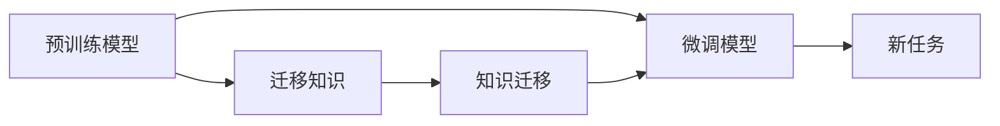

                 

# 迁移学习Transfer Learning原理与代码实例讲解

> 关键词：迁移学习, Transfer Learning, 深度学习, 模型适配, 机器学习, 代码实例, 实践指导

## 1. 背景介绍

### 1.1 问题由来
迁移学习(Transfer Learning)是机器学习中的一种重要策略，旨在通过在相关但不同的任务上预训练模型，将已学习到的知识和特征迁移到新的任务上，以提升模型在新任务上的性能。这一策略在深度学习中尤为显著，特别是在大规模数据稀缺、计算资源有限的情况下。

近年来，深度学习在计算机视觉、自然语言处理(NLP)等领域的突破，主要得益于大模型的预训练和迁移学习范式的广泛应用。这些大模型如VGG、ResNet、BERT等，通过在大规模数据集上进行自监督或监督预训练，学习到了通用的高级特征表示。然后，这些模型通过在特定任务上的微调(Fine-Tuning)，适应了新的任务需求，大大提升了模型在新任务上的性能。

随着深度学习技术的发展，迁移学习已成为数据驱动学习领域的一项基本技术，为各行各业的AI应用提供了强大的支持。本文章将详细介绍迁移学习的基本原理、核心算法及其在实际项目中的应用实例，以期为读者提供全面的技术指导。

### 1.2 问题核心关键点
迁移学习涉及的核心概念包括：

- **预训练(Pre-training)**：在大规模无标签数据上，通过自监督或监督学习任务训练深度模型，学习到通用的高级特征表示。
- **微调(Fine-Tuning)**：在预训练模型基础上，使用特定任务的标注数据，通过有监督学习优化模型在特定任务上的性能。
- **迁移知识(Migrated Knowledge)**：预训练模型中学习到的通用知识或特征，被应用到新的任务中，提升了模型在新任务上的泛化能力。
- **模型适配(Model Adaptation)**：根据新任务的特点，调整预训练模型的结构和参数，以适应新任务的需求。
- **知识迁移(Knowledge Transfer)**：将预训练模型在不同任务之间的知识进行迁移，以解决数据不足或资源限制的问题。

理解这些关键概念及其关系，是掌握迁移学习技术的基础。

### 1.3 问题研究意义
迁移学习在深度学习中具有重要的意义：

1. **数据利用效率高**：通过预训练，模型可以从大规模数据中学习到丰富的特征，极大提升了特征提取效率。
2. **模型泛化能力强**：预训练模型具备较强的泛化能力，能在新任务上表现良好。
3. **训练时间短**：预训练模型在新任务上的微调时间显著缩短，降低了训练成本。
4. **避免从头训练**：特别是在数据稀缺的领域，迁移学习可以避免从头训练模型的巨大计算资源需求。
5. **模型泛化性强**：预训练模型能在各种新任务上实现较好的泛化性能。
6. **知识迁移灵活**：通过知识迁移，模型能迅速适应新任务，具有很强的适应性。

综上所述，迁移学习不仅能够提升模型的性能，还能有效解决数据稀缺、计算资源有限等问题，具有重要的应用价值。

## 2. 核心概念与联系

### 2.1 核心概念概述

为更好地理解迁移学习，本节将介绍几个密切相关的核心概念：

- **深度学习模型**：以神经网络为基础，通过多层非线性变换学习到复杂的特征表示，广泛应用于计算机视觉、自然语言处理等任务。
- **预训练模型**：在大规模无标签数据上，通过自监督或监督学习任务训练深度模型，学习到通用的高级特征表示。
- **微调模型**：在预训练模型的基础上，使用特定任务的标注数据，通过有监督学习优化模型在特定任务上的性能。
- **迁移知识**：预训练模型中学习到的通用知识或特征，被应用到新的任务中，提升了模型在新任务上的泛化能力。
- **知识迁移**：将预训练模型在不同任务之间的知识进行迁移，以解决数据不足或资源限制的问题。

这些核心概念之间的逻辑关系可以通过以下Mermaid流程图来展示：



这个流程图展示了迁移学习的基本流程：

1. 预训练模型学习通用的高级特征表示。
2. 微调模型利用预训练模型在新任务上进行适配，优化模型在新任务上的性能。
3. 迁移知识在新任务中被应用，提升模型在新任务上的泛化能力。
4. 知识迁移使预训练模型在不同任务之间进行知识的传递，增强模型的适应性和泛化能力。

## 3. 核心算法原理 & 具体操作步骤

### 3.1 算法原理概述

迁移学习的核心思想是通过在相关但不同的任务上预训练模型，将已学习到的知识和特征迁移到新的任务上，以提升模型在新任务上的性能。其核心算法包括预训练和微调两个阶段。

在预训练阶段，模型在大规模无标签数据上学习通用的高级特征表示。这通常通过自监督学习任务如ImageNet上的图像分类、语言模型预训练、BERT等模型实现。预训练过程中，模型通过自动编码、掩码语言模型等技术学习到高层次的特征表示。

在微调阶段，模型使用特定任务的标注数据，通过有监督学习优化模型在特定任务上的性能。通常，微调模型会调整预训练模型的最后几层，以适应新任务的需求。微调过程的损失函数通常是交叉熵损失或均方误差损失，通过反向传播算法更新模型参数，使得模型输出逼近真实标签。

### 3.2 算法步骤详解

迁移学习的一般流程包括以下几个关键步骤：

**Step 1: 准备预训练模型和数据集**
- 选择合适的预训练模型，如VGG、ResNet、BERT等。
- 准备下游任务的标注数据集，划分为训练集、验证集和测试集。

**Step 2: 微调模型**
- 将预训练模型顶层和任务相关层解冻，固定其余层。
- 使用下游任务的标注数据，训练微调模型。
- 在验证集上评估微调模型的性能，调整学习率等超参数。
- 在测试集上最终评估微调模型的性能，判断是否满足要求。

**Step 3: 评估与部署**
- 根据微调模型的性能，决定是否在实际应用中使用。
- 将微调模型集成到实际系统中，进行部署和测试。
- 定期收集新数据，重新微调模型以适应数据变化。

### 3.3 算法优缺点

迁移学习具有以下优点：
1. 数据利用效率高。通过预训练模型，可以从大规模无标签数据中学习到丰富的特征，提升特征提取效率。
2. 模型泛化能力强。预训练模型具备较强的泛化能力，能在新任务上表现良好。
3. 训练时间短。预训练模型在新任务上的微调时间显著缩短，降低了训练成本。
4. 避免从头训练。特别是在数据稀缺的领域，迁移学习可以避免从头训练模型的巨大计算资源需求。
5. 知识迁移灵活。通过知识迁移，模型能迅速适应新任务，具有很强的适应性。

同时，该方法也存在一些局限性：
1. 预训练数据要求高。预训练数据必须与新任务有较高的相关性，否则迁移效果有限。
2. 模型适应性有局限。预训练模型必须在新任务上微调，否则无法完全适应新任务。
3. 知识传递有限。迁移学习的知识传递效果受到预训练模型和微调模型之间相似性的影响。
4. 预训练模型复杂度高。大规模预训练模型的计算资源需求较高，增加了迁移学习的实施难度。

尽管存在这些局限性，但迁移学习已成为深度学习中的重要技术，并在众多领域得到了广泛应用。

### 3.4 算法应用领域

迁移学习在多个领域中得到了广泛的应用，例如：

- 计算机视觉：利用预训练的VGG、ResNet等模型，在新的图像分类、目标检测、语义分割等任务上进行微调，提升模型性能。
- 自然语言处理：通过预训练的BERT、GPT等模型，在文本分类、命名实体识别、问答系统等任务上进行微调，提升模型效果。
- 语音识别：利用预训练的声学模型，在新的语音识别任务上进行微调，提升识别精度。
- 推荐系统：通过预训练的推荐模型，在新的推荐任务上进行微调，提升推荐效果。
- 医疗诊断：利用预训练的医学影像模型，在新的医学影像分类、诊断任务上进行微调，提升诊断准确性。
- 智能制造：通过预训练的工业视觉模型，在新的工业检测、质量控制任务上进行微调，提升生产效率。

除了这些领域，迁移学习还被广泛应用于金融风控、环境监测、智能交通等多个领域，为各行各业带来了显著的效益提升。

## 4. 数学模型和公式 & 详细讲解 & 举例说明

### 4.1 数学模型构建

假设预训练模型为 $M_{\theta}$，其中 $\theta$ 为预训练得到的模型参数。下游任务的标注数据集为 $D=\{(x_i,y_i)\}_{i=1}^N, x_i \in \mathcal{X}, y_i \in \mathcal{Y}$。定义模型在数据样本 $(x,y)$ 上的损失函数为 $\ell(M_{\theta}(x),y)$，则在数据集 $D$ 上的经验风险为：

$$
\mathcal{L}(\theta) = \frac{1}{N} \sum_{i=1}^N \ell(M_{\theta}(x_i),y_i)
$$

微调的目标是最小化经验风险，即找到最优参数：

$$
\theta^* = \mathop{\arg\min}_{\theta} \mathcal{L}(\theta)
$$

在实践中，我们通常使用基于梯度的优化算法（如SGD、Adam等）来近似求解上述最优化问题。设 $\eta$ 为学习率，$\lambda$ 为正则化系数，则参数的更新公式为：

$$
\theta \leftarrow \theta - \eta \nabla_{\theta}\mathcal{L}(\theta) - \eta\lambda\theta
$$

其中 $\nabla_{\theta}\mathcal{L}(\theta)$ 为损失函数对参数 $\theta$ 的梯度，可通过反向传播算法高效计算。

### 4.2 公式推导过程

以下我们以图像分类任务为例，推导迁移学习的数学原理。

假设预训练模型为VGG16，下游任务为图像分类。首先，将VGG16的前几层作为预训练模型，顶层作为微调模型。微调模型的损失函数为交叉熵损失，其公式为：

$$
\ell(M_{\theta}(x),y) = -\log(M_{\theta}(x)[y])
$$

其中 $M_{\theta}(x)$ 为模型在输入 $x$ 上的输出，$y$ 为真实标签。则微调模型的损失函数为：

$$
\mathcal{L}(\theta) = -\frac{1}{N}\sum_{i=1}^N \log(M_{\theta}(x_i)[y_i])
$$

利用反向传播算法，计算损失函数对参数 $\theta$ 的梯度，并使用优化算法进行参数更新，最小化损失函数。重复上述过程直至收敛，最终得到适应下游任务的最优模型参数 $\theta^*$。

## 5. 项目实践：代码实例和详细解释说明

### 5.1 开发环境搭建

在进行迁移学习实践前，我们需要准备好开发环境。以下是使用Python进行PyTorch开发的环境配置流程：

1. 安装Anaconda：从官网下载并安装Anaconda，用于创建独立的Python环境。

2. 创建并激活虚拟环境：
```bash
conda create -n pytorch-env python=3.8 
conda activate pytorch-env
```

3. 安装PyTorch：根据CUDA版本，从官网获取对应的安装命令。例如：
```bash
conda install pytorch torchvision torchaudio cudatoolkit=11.1 -c pytorch -c conda-forge
```

4. 安装TensorFlow：
```bash
pip install tensorflow
```

5. 安装TensorBoard：
```bash
pip install tensorboard
```

6. 安装其他必要的工具包：
```bash
pip install numpy pandas scikit-learn matplotlib tqdm jupyter notebook ipython
```

完成上述步骤后，即可在`pytorch-env`环境中开始迁移学习实践。

### 5.2 源代码详细实现

下面我们以迁移学习为例，给出使用PyTorch进行迁移学习的PyTorch代码实现。

首先，准备预训练模型和数据集：

```python
from torchvision import models
from torchvision import transforms

# 加载预训练模型
model = models.vgg16(pretrained=True)

# 定义数据预处理
transform = transforms.Compose([
    transforms.ToTensor(),
    transforms.Normalize(mean=[0.485, 0.456, 0.406], std=[0.229, 0.224, 0.225])
])

# 加载数据集
train_dataset = transforms.ImageFolder(root='path/to/train', transform=transform)
test_dataset = transforms.ImageFolder(root='path/to/test', transform=transform)

# 创建DataLoader
train_loader = torch.utils.data.DataLoader(train_dataset, batch_size=32, shuffle=True)
test_loader = torch.utils.data.DataLoader(test_dataset, batch_size=32, shuffle=False)
```

然后，定义微调模型和优化器：

```python
import torch.nn as nn
import torch.optim as optim

# 定义微调模型的顶层分类器
class VGG16(nn.Module):
    def __init__(self):
        super(VGG16, self).__init__()
        self.fc = nn.Linear(4096, 10)

    def forward(self, x):
        x = self.fc(x)
        return x

# 加载微调模型
model.fc = VGG16()

# 定义优化器
optimizer = optim.SGD(model.fc.parameters(), lr=0.001, momentum=0.9)
```

接着，定义训练和评估函数：

```python
def train(epoch):
    model.train()
    for i, (images, labels) in enumerate(train_loader):
        images = images.to(device)
        labels = labels.to(device)
        optimizer.zero_grad()
        outputs = model(images)
        loss = nn.CrossEntropyLoss()(outputs, labels)
        loss.backward()
        optimizer.step()
        if i % 100 == 0:
            print('Train Epoch: {} [{}/{} ({:.0f}%)]\tLoss: {:.6f}'.format(
                epoch, i * len(images), len(train_loader.dataset),
                100. * i / len(train_loader), loss.item()))

def test():
    model.eval()
    with torch.no_grad():
        correct = 0
        total = 0
        for images, labels in test_loader:
            images = images.to(device)
            labels = labels.to(device)
            outputs = model(images)
            _, predicted = torch.max(outputs.data, 1)
            total += labels.size(0)
            correct += (predicted == labels).sum().item()

    print('Accuracy of the model on the 10000 test images: {} %'.format(
        100 * correct / total))
```

最后，启动训练流程并在测试集上评估：

```python
device = torch.device('cuda' if torch.cuda.is_available() else 'cpu')

model = model.to(device)
train(train_loader, model, device)
test()
```

以上就是使用PyTorch对VGG16模型进行迁移学习的完整代码实现。可以看到，通过简单的代码修改，我们实现了VGG16模型在新的图像分类任务上的微调。

### 5.3 代码解读与分析

让我们再详细解读一下关键代码的实现细节：

**模型定义**：
- `VGG16`类：定义了VGG16模型的顶层分类器，将其作为微调模型的顶层。
- `model.fc`：将预训练模型的顶层分类器替换为`VGG16`类定义的分类器，形成新的微调模型。

**优化器设置**：
- `optimizer`：定义了微调模型的优化器，这里使用SGD，设定了学习率和动量参数。

**训练与评估函数**：
- `train`函数：对训练集进行前向传播和反向传播，更新模型参数，并打印训练过程中的损失。
- `test`函数：对测试集进行前向传播，计算模型的准确率，并打印测试结果。

**训练流程**：
- 在训练函数中，先调用`model.train()`将模型设置为训练模式。
- 在每个批次中，使用`model.to(device)`将模型和数据移至GPU设备上。
- 计算模型输出与真实标签之间的交叉熵损失，并进行反向传播更新参数。
- 每100个批次打印一次训练损失，监控模型训练进度。
- 在测试函数中，使用`model.eval()`将模型设置为评估模式，不进行梯度计算。
- 计算模型在测试集上的准确率，并打印测试结果。

可以看到，PyTorch配合TensorFlow等深度学习框架，使得迁移学习的代码实现变得简洁高效。开发者可以将更多精力放在数据处理、模型改进等高层逻辑上，而不必过多关注底层的实现细节。

当然，工业级的系统实现还需考虑更多因素，如模型的保存和部署、超参数的自动搜索、更灵活的任务适配层等。但核心的迁移学习范式基本与此类似。

## 6. 实际应用场景

### 6.1 智能监控

迁移学习在智能监控领域具有广泛的应用前景。例如，基于预训练的CNN模型，通过微调可以在新的监控任务上快速适应，如视频中的人脸识别、行为识别等。利用迁移学习，可以在新监控场景中快速部署和应用，提升监控系统的智能化水平。

### 6.2 疾病诊断

在医疗领域，迁移学习可用于疾病诊断。例如，基于预训练的医学影像模型，如ResNet、VGG等，通过微调可以实现对新疾病的快速诊断。利用迁移学习，医疗系统可以共享通用的医学知识，提升诊断的准确性和速度。

### 6.3 自动化测试

在自动化测试领域，迁移学习可用于测试任务的快速部署和优化。例如，基于预训练的图像识别模型，通过微调可以实现对新测试用例的快速识别和分析。利用迁移学习，测试系统可以提升自动化测试的覆盖率和准确率。

### 6.4 未来应用展望

随着迁移学习技术的发展，其应用领域将不断拓展。未来，迁移学习将在更多领域得到应用，为各行各业带来变革性影响：

1. **智能制造**：利用迁移学习，智能制造系统可以实现对新产品的快速检测和质量控制。例如，基于预训练的视觉识别模型，对新产品的表面缺陷进行识别和分类。

2. **智慧农业**：在智慧农业领域，迁移学习可用于对新作物的快速识别和分析。例如，基于预训练的图像分类模型，对新作物的生长状态进行分类和预测。

3. **智能物流**：在智能物流领域，迁移学习可用于对新货物的快速分类和识别。例如，基于预训练的图像识别模型，对新货物的包装和标签进行识别和分类。

4. **智能城市**：在智能城市领域，迁移学习可用于对新城市的快速监控和分析。例如，基于预训练的图像识别模型，对新城市的交通状态和环境质量进行识别和分析。

5. **智能交通**：在智能交通领域，迁移学习可用于对新交通场景的快速识别和分析。例如，基于预训练的图像分类模型，对新交通场景的交通规则和行人进行识别和分类。

这些应用场景展示了迁移学习在各个领域的潜力，预示着未来人工智能技术在各行各业的应用前景广阔。

## 7. 工具和资源推荐

### 7.1 学习资源推荐

为了帮助开发者系统掌握迁移学习的基本原理和实践技巧，这里推荐一些优质的学习资源：

1. 《深度学习》课程（Coursera）：由深度学习专家Andrew Ng主讲，涵盖深度学习的基本概念和前沿技术。

2. 《机器学习》课程（斯坦福大学）：由机器学习专家Andrew Ng主讲，涵盖机器学习的基本概念和经典算法。

3. 《迁移学习》书籍：介绍了迁移学习的基本原理、算法和应用场景，适合深度学习和机器学习领域的从业者。

4. 《深度学习框架PyTorch》书籍：介绍了PyTorch的基本概念和实践技巧，适合深度学习开发人员使用。

5. 《迁移学习实战》课程：通过实际项目案例，讲解迁移学习的基本原理和应用技巧，适合深度学习初学者。

通过这些资源的学习实践，相信你一定能够快速掌握迁移学习的精髓，并用于解决实际的机器学习问题。

### 7.2 开发工具推荐

高效的开发离不开优秀的工具支持。以下是几款用于迁移学习开发的常用工具：

1. PyTorch：基于Python的开源深度学习框架，灵活动态的计算图，适合快速迭代研究。

2. TensorFlow：由Google主导开发的开源深度学习框架，生产部署方便，适合大规模工程应用。

3. TensorBoard：TensorFlow配套的可视化工具，可实时监测模型训练状态，并提供丰富的图表呈现方式。

4. Weights & Biases：模型训练的实验跟踪工具，可以记录和可视化模型训练过程中的各项指标，方便对比和调优。

5. PyTorch Lightning：基于PyTorch的轻量级深度学习框架，适合快速原型开发和模型部署。

6. FastAI：基于PyTorch的高层深度学习框架，提供了一系列的预训练模型和实用的API，适合快速构建和微调深度学习模型。

合理利用这些工具，可以显著提升迁移学习的开发效率，加快创新迭代的步伐。

### 7.3 相关论文推荐

迁移学习在深度学习中具有重要的研究价值。以下是几篇奠基性的相关论文，推荐阅读：

1. "A Tutorial on Transfer Learning"：介绍了迁移学习的基本概念、算法和应用场景，适合深度学习和机器学习领域的从业者。

2. "Feature Transfer by Training: Merging Unlabeled Data"：提出了特征转移的概念，通过在大规模无标签数据上预训练模型，然后利用预训练模型在新任务上进行微调，提升模型在新任务上的性能。

3. "Natural Language Processing (almost) from Scratch"：提出了预训练语言模型，通过在大规模无标签文本数据上预训练模型，学习到通用的语言表示，然后在新任务上进行微调，取得显著的性能提升。

4. "Towards a Generalization-Performance-Guaranteed Model Selection Procedure for Deep Neural Networks"：提出了迁移学习模型选择的方法，通过理论分析和实验验证，证明了迁移学习在模型选择中的重要性。

5. "Microsoft Research Automatic Model Selection: A Methodology for Performance-Guaranteed Model Selection"：提出了迁移学习自动模型选择的方法，通过理论分析和实验验证，证明了迁移学习在模型选择中的重要性。

这些论文代表了大迁移学习技术的发展脉络。通过学习这些前沿成果，可以帮助研究者把握学科前进方向，激发更多的创新灵感。

## 8. 总结：未来发展趋势与挑战

### 8.1 总结

本文对迁移学习的基本原理和实践技巧进行了全面系统的介绍。首先阐述了迁移学习的背景和重要性，明确了迁移学习在深度学习中的核心地位。其次，从原理到实践，详细讲解了迁移学习的数学原理和关键步骤，给出了迁移学习任务开发的完整代码实例。同时，本文还广泛探讨了迁移学习在智能监控、疾病诊断、自动化测试等多个领域的应用前景，展示了迁移学习在各个领域的潜力。

通过本文的系统梳理，可以看到，迁移学习不仅能够提升模型的性能，还能有效解决数据稀缺、计算资源有限等问题，具有重要的应用价值。未来，随着迁移学习技术的发展，其应用领域将不断拓展，为各行各业带来变革性影响。

### 8.2 未来发展趋势

展望未来，迁移学习技术将呈现以下几个发展趋势：

1. **多模态迁移学习**：未来的迁移学习将进一步拓展到多模态数据融合领域，如视觉、语音、文本等数据融合的迁移学习，提升模型的跨模态泛化能力。

2. **分布式迁移学习**：随着数据分布的不均衡性和异构性，分布式迁移学习将成为一种重要的迁移学习范式，通过多个数据源的学习，提升模型的泛化能力和适应性。

3. **自适应迁移学习**：未来的迁移学习将具备自适应能力，能够动态调整模型参数，适应数据分布的变化，提升模型的泛化能力和鲁棒性。

4. **深度迁移学习**：未来的迁移学习将进一步拓展到深度学习领域，通过多层次的特征提取和模型融合，提升迁移学习的深度和泛化能力。

5. **实时迁移学习**：未来的迁移学习将具备实时性，能够快速适应新任务和数据分布的变化，满足实时性和动态性要求。

6. **元迁移学习**：未来的迁移学习将具备元学习能力，能够自动调整迁移学习策略，适应不同的学习任务和数据分布。

这些趋势展示了迁移学习技术的广阔前景，预示着未来人工智能技术在各个领域的潜力。

### 8.3 面临的挑战

尽管迁移学习技术已经取得了瞩目成就，但在迈向更加智能化、普适化应用的过程中，仍面临诸多挑战：

1. **数据质量和分布**：预训练数据必须与新任务有较高的相关性，否则迁移效果有限。如何获得高质量的预训练数据，以及如何处理数据分布的差异，是迁移学习的关键问题。

2. **模型泛化能力**：预训练模型必须在新任务上微调，否则无法完全适应新任务。如何提高模型在新任务上的泛化能力，是迁移学习的重要研究方向。

3. **计算资源消耗**：预训练模型的计算资源需求较高，增加了迁移学习的实施难度。如何降低迁移学习的计算资源消耗，是未来研究的重要方向。

4. **知识传递效果**：迁移学习的知识传递效果受到预训练模型和微调模型之间相似性的影响。如何提高知识传递效果，提升迁移学习的效果，是重要的研究方向。

5. **可解释性和可控性**：迁移学习的决策过程缺乏可解释性，难以对其推理逻辑进行分析和调试。如何提高模型的可解释性和可控性，是重要的研究方向。

6. **隐私和安全**：迁移学习中的数据隐私和安全问题需要引起重视。如何保护数据隐私，防止模型泄漏敏感信息，是重要的研究方向。

这些挑战展示了迁移学习技术的复杂性，需要进一步的研究和优化，才能实现其广泛应用。

### 8.4 研究展望

面对迁移学习技术面临的诸多挑战，未来的研究需要在以下几个方面寻求新的突破：

1. **自监督预训练**：通过自监督学习任务，如掩码语言模型、对比学习等，提升预训练模型的泛化能力和知识表示能力。

2. **知识蒸馏**：通过知识蒸馏技术，将预训练模型的知识传递给微调模型，提升微调模型的泛化能力和适应性。

3. **多任务学习**：通过多任务学习技术，将多个任务的学习任务组合起来，提升模型的泛化能力和适应性。

4. **迁移学习系统化**：通过迁移学习系统的研究，将迁移学习与其他人工智能技术（如知识图谱、逻辑推理等）进行整合，提升迁移学习的深度和泛化能力。

5. **元学习**：通过元学习技术，自动调整迁移学习策略，适应不同的学习任务和数据分布。

6. **可解释性增强**：通过因果分析、逻辑推理等技术，增强迁移学习的可解释性和可控性，提高模型的透明度和可信度。

这些研究方向展示了迁移学习技术的广阔前景，预示着未来人工智能技术在各个领域的潜力。

## 9. 附录：常见问题与解答

**Q1：迁移学习是否适用于所有机器学习任务？**

A: 迁移学习适用于绝大多数机器学习任务，特别是数据稀缺、计算资源有限的情况。但对于一些特定领域的任务，如医疗、金融等，仅仅依靠通用语料预训练的模型可能难以很好地适应。此时需要在特定领域语料上进一步预训练，再进行微调，才能获得理想效果。此外，对于一些需要时效性、个性化很强的任务，如对话、推荐等，迁移方法也需要针对性的改进优化。

**Q2：如何选择合适的迁移学习策略？**

A: 迁移学习的策略选择取决于具体任务和数据特点。通常有以下几种策略：

1. **特征迁移**：利用预训练模型的特征表示，进行微调。适用于特征提取和表示学习任务。
2. **模型迁移**：利用预训练模型的全模型或部分层，进行微调。适用于任务映射和推理任务。
3. **自适应迁移**：动态调整模型参数，适应数据分布的变化。适用于动态变化的数据和任务。

选择合适的迁移学习策略需要根据具体任务和数据特点进行权衡和调整。

**Q3：迁移学习过程中如何优化模型性能？**

A: 迁移学习过程中，可以通过以下方法优化模型性能：

1. **超参数调整**：选择合适的学习率、批大小、正则化等超参数，优化模型性能。
2. **数据增强**：通过数据增强技术，如旋转、缩放、裁剪等，扩充训练数据，提升模型泛化能力。
3. **模型融合**：通过模型融合技术，将多个模型进行组合，提升模型性能。
4. **知识蒸馏**：通过知识蒸馏技术，将预训练模型的知识传递给微调模型，提升微调模型的泛化能力和适应性。
5. **多任务学习**：通过多任务学习技术，将多个任务的学习任务组合起来，提升模型的泛化能力和适应性。

这些方法可以结合使用，以优化模型性能，提升迁移学习的效果。

**Q4：迁移学习过程中如何处理数据分布差异？**

A: 迁移学习过程中，数据分布差异是一个常见问题。以下是几种处理数据分布差异的方法：

1. **数据增强**：通过数据增强技术，如旋转、缩放、裁剪等，扩充训练数据，提升模型泛化能力。
2. **迁移学习系统的设计**：通过迁移学习系统的设计，将迁移学习与其他人工智能技术（如知识图谱、逻辑推理等）进行整合，提升迁移学习的深度和泛化能力。
3. **自适应迁移学习**：动态调整模型参数，适应数据分布的变化。
4. **元学习**：通过元学习技术，自动调整迁移学习策略，适应不同的学习任务和数据分布。

这些方法可以结合使用，以优化模型性能，提升迁移学习的效果。

**Q5：迁移学习在实践中需要注意哪些问题？**

A: 迁移学习在实践中需要注意以下几个问题：

1. **数据质量和分布**：预训练数据必须与新任务有较高的相关性，否则迁移效果有限。如何获得高质量的预训练数据，以及如何处理数据分布的差异，是迁移学习的关键问题。
2. **模型泛化能力**：预训练模型必须在新任务上微调，否则无法完全适应新任务。如何提高模型在新任务上的泛化能力，是迁移学习的重要研究方向。
3. **计算资源消耗**：预训练模型的计算资源需求较高，增加了迁移学习的实施难度。如何降低迁移学习的计算资源消耗，是未来研究的重要方向。
4. **知识传递效果**：迁移学习的知识传递效果受到预训练模型和微调模型之间相似性的影响。如何提高知识传递效果，提升迁移学习的效果，是重要的研究方向。
5. **可解释性和可控性**：迁移学习的决策过程缺乏可解释性，难以对其推理逻辑进行分析和调试。如何提高模型的可解释性和可控性，是重要的研究方向。
6. **隐私和安全**：迁移学习中的数据隐私和安全问题需要引起重视。如何保护数据隐私，防止模型泄漏敏感信息，是重要的研究方向。

这些问题是迁移学习技术面临的主要挑战，需要进一步的研究和优化。

**Q6：迁移学习在实际应用中需要注意哪些问题？**

A: 迁移学习在实际应用中需要注意以下几个问题：

1. **数据质量和分布**：预训练数据必须与新任务有较高的相关性，否则迁移效果有限。如何获得高质量的预训练数据，以及如何处理数据分布的差异，是迁移学习的关键问题。
2. **模型泛化能力**：预训练模型必须在新任务上微调，否则无法完全适应新任务。如何提高模型在新任务上的泛化能力，是迁移学习的重要研究方向。
3. **计算资源消耗**：预训练模型的计算资源需求较高，增加了迁移学习的实施难度。如何降低迁移学习的计算资源消耗，是未来研究的重要方向。
4. **知识传递效果**：迁移学习的知识传递效果受到预训练模型和微调模型之间相似性的影响。如何提高知识传递效果，提升迁移学习的效果，是重要的研究方向。
5. **可解释性和可控性**：迁移学习的决策过程缺乏可解释性，难以对其推理逻辑进行分析和调试。如何提高模型的可解释性和可控性，是重要的研究方向。
6. **隐私和安全**：迁移学习中的数据隐私和安全问题需要引起重视。如何保护数据隐私，防止模型泄漏敏感信息，是重要的研究方向。

这些问题是迁移学习技术面临的主要挑战，需要进一步的研究和优化。

---

作者：禅与计算机程序设计艺术 / Zen and the Art of Computer Programming

