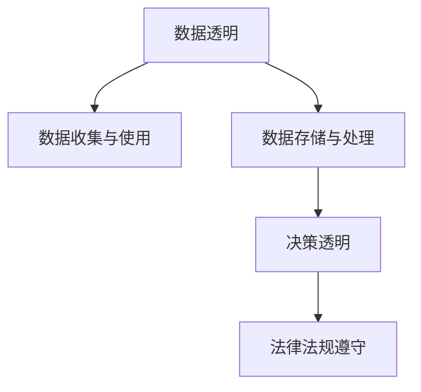

                 

## 1. 背景介绍

随着人工智能(AI)技术的快速发展和普及，AI系统在医疗、金融、教育、制造等众多领域中发挥着越来越重要的作用。然而，AI系统的使用也带来了新的隐私和伦理问题，用户数据使用的透明度变得越来越重要。如何确保AI系统在使用用户数据时能够透明、可解释，并符合法律法规要求，成为了当前AI领域的重要议题。

### 1.1 问题由来

AI系统在处理用户数据时，常常需要收集和存储大量的个人信息，包括但不限于姓名、身份证号、位置信息等。这些数据如果被不当使用，可能会对用户造成严重的隐私侵害。例如，数据泄露可能导致身份盗用、诈骗等严重后果。此外，AI系统的决策过程往往不透明，用户很难理解和监督其运作方式。这种缺乏透明度的现象，不仅会降低用户对AI系统的信任，还会引发社会对AI技术的担忧和质疑。

### 1.2 问题核心关键点

要确保AI系统在使用用户数据时透明，需要解决以下几个关键问题：

- **数据收集和使用透明**：明确告知用户数据的收集目的和用途，并获得用户的同意。
- **数据存储和处理安全**：采取严格的数据加密和访问控制措施，防止数据泄露和滥用。
- **模型决策可解释**：通过可解释性技术，使AI系统的决策过程透明化，便于用户理解和监督。
- **法律法规遵守**：遵循数据隐私保护和信息安全的法律法规，如《个人信息保护法》、GDPR等，确保AI系统的合法合规性。

这些问题涉及技术、法律、伦理等多个维度，需要从多方面入手才能解决。

## 2. 核心概念与联系

### 2.1 核心概念概述

为更好地理解AI系统的透明度，本节将介绍几个密切相关的核心概念：

- **数据透明**：指AI系统在数据收集、存储、处理等环节，能够公开数据使用规则和操作流程，确保用户知晓其数据的使用情况。
- **决策透明**：指AI系统在决策过程中，能够公开决策依据和推理过程，便于用户理解和监督。
- **法律法规遵守**：指AI系统在设计和使用时，严格遵守相关的法律法规，如《个人信息保护法》、GDPR等，确保数据使用合法合规。

这些核心概念之间的逻辑关系可以通过以下Mermaid流程图来展示：



这个流程图展示了数据透明、决策透明和法律法规遵守三者之间的联系：

1. 数据透明是基础，确保用户知晓数据收集和使用的规则。
2. 决策透明是核心，通过可解释性技术，使AI系统的决策过程透明化。
3. 法律法规遵守是保障，确保AI系统在设计和使用过程中符合法律法规要求。

## 3. 核心算法原理 & 具体操作步骤

### 3.1 算法原理概述

确保AI系统使用数据的透明性，需要从数据管理和模型训练两个层面入手：

1. **数据管理透明**：建立数据收集、存储、处理的标准化流程，公开数据使用规则，确保用户数据的使用符合法律法规要求。
2. **模型训练透明**：采用可解释性技术，使AI系统的决策过程透明化，便于用户理解和监督。

### 3.2 算法步骤详解

#### 数据管理透明

**Step 1: 数据收集与声明**

在收集用户数据前，应明确告知用户数据的用途，并获得用户的同意。具体步骤如下：

1. 设计数据收集同意书，包含数据收集目的、使用方式、保护措施等信息。
2. 通过各种渠道（如APP、网站、邮件等）向用户展示同意书，并获取用户的签名或同意。
3. 记录和存储用户同意信息，建立数据使用日志。

**Step 2: 数据存储与保护**

数据存储和保护是确保数据透明的重要环节。具体步骤如下：

1. 选择合规的数据存储系统，如云存储、数据库等，确保数据存储的安全性和可靠性。
2. 采用数据加密技术，对存储的数据进行加密处理，防止数据泄露。
3. 建立访问控制机制，限制对数据的访问权限，确保只有授权人员才能访问数据。
4. 定期审计数据访问日志，监控异常访问行为，及时发现和处理潜在威胁。

**Step 3: 数据使用与监管**

数据使用与监管是确保数据透明的关键环节。具体步骤如下：

1. 设计数据使用规则，明确数据使用范围、频率、存储期限等，确保数据使用的合理性。
2. 建立数据使用审计机制，定期对数据使用情况进行审计，确保符合数据使用规则。
3. 对违规数据使用行为，采取必要的惩戒措施，如删除数据、恢复用户权利等。

#### 模型训练透明

**Step 1: 数据预处理与标注**

数据预处理和标注是确保模型透明的重要环节。具体步骤如下：

1. 对数据进行预处理，包括数据清洗、去噪、归一化等，确保数据质量。
2. 对数据进行标注，确保标注数据的准确性和一致性，为模型训练提供高质量的输入。

**Step 2: 模型训练与优化**

模型训练与优化是确保模型透明的核心环节。具体步骤如下：

1. 选择适当的模型结构和超参数，进行模型训练，确保模型性能和泛化能力。
2. 对模型进行优化，包括调整学习率、正则化参数等，提升模型效果。
3. 记录和存储模型训练日志，包括训练轮数、损失函数、精度等，确保训练过程透明。

**Step 3: 模型评估与部署**

模型评估与部署是确保模型透明的重要环节。具体步骤如下：

1. 对训练好的模型进行评估，包括在测试集上的精度、召回率、F1值等指标，确保模型性能稳定。
2. 将训练好的模型部署到生产环境，确保模型的可靠性和可用性。
3. 对模型进行监控和调优，确保模型的性能和稳定性。

### 3.3 算法优缺点

确保AI系统使用数据透明的方法具有以下优点：

- **提升用户信任**：通过透明的数据管理和模型训练，增强用户对AI系统的信任，提高用户满意度和忠诚度。
- **保障数据安全**：采用严格的数据存储和访问控制措施，防止数据泄露和滥用，保障用户数据安全。
- **满足法律法规要求**：确保数据使用符合法律法规要求，避免法律风险和罚款。

然而，该方法也存在一定的局限性：

- **成本较高**：建立数据管理和模型训练的透明机制需要投入大量人力、物力资源，特别是对于中小型企业来说，成本较高。
- **技术复杂**：数据管理与模型训练的透明机制需要复杂的算法和技术支持，技术门槛较高。
- **用户隐私保护**：尽管数据管理透明，但如何保护用户隐私，防止数据泄露，仍然是一个复杂问题。

尽管存在这些局限性，但就目前而言，确保AI系统使用数据透明的方法仍是大规模AI应用的重要保障。

### 3.4 算法应用领域

确保AI系统使用数据透明的方法，在医疗、金融、电商、教育等众多领域中得到了广泛应用，显著提升了AI系统的可靠性和用户满意度：

- **医疗领域**：确保患者病历数据的使用透明，提升患者对医疗系统的信任，保护患者隐私。
- **金融领域**：确保金融交易数据的透明，提升用户对金融服务的信任，保护用户数据安全。
- **电商领域**：确保用户购买数据的透明，提升用户对电商平台的信任，保护用户隐私。
- **教育领域**：确保学生学习数据的透明，提升学生和家长对教育系统的信任，保护学生隐私。

## 4. 数学模型和公式 & 详细讲解 & 举例说明

### 4.1 数学模型构建

本节将使用数学语言对AI系统使用数据透明的方法进行更加严格的刻画。

假设AI系统收集的用户数据为 $\mathcal{D}=\{(x_i, y_i)\}_{i=1}^N$，其中 $x_i$ 为输入特征，$y_i$ 为标签。AI系统通过模型 $M_{\theta}$ 进行预测，其中 $\theta$ 为模型参数。

定义模型 $M_{\theta}$ 在数据样本 $(x,y)$ 上的损失函数为 $\ell(M_{\theta}(x),y)$，则在数据集 $\mathcal{D}$ 上的经验风险为：

$$
\mathcal{L}(\theta) = \frac{1}{N} \sum_{i=1}^N \ell(M_{\theta}(x_i),y_i)
$$

为了确保AI系统使用数据透明，需要在数据收集、存储、处理、模型训练等环节引入透明机制。具体步骤如下：

1. **数据收集透明**：公开数据收集目的和用途，获得用户同意。
2. **数据存储透明**：采用数据加密和访问控制技术，确保数据安全。
3. **数据使用透明**：设计数据使用规则，建立数据使用日志。
4. **模型训练透明**：记录和存储模型训练日志，确保训练过程透明。

### 4.2 公式推导过程

以下我们以医疗数据为例，推导AI系统使用数据透明的方法。

假设AI系统用于预测患者的诊断结果。收集的病历数据为 $\mathcal{D}=\{(x_i, y_i)\}_{i=1}^N$，其中 $x_i$ 为患者的病历特征，$y_i$ 为诊断结果。

**Step 1: 数据收集透明**

公开数据收集目的和用途，获得患者同意。具体步骤如下：

1. 设计数据收集同意书，包含数据收集目的、使用方式、保护措施等信息。
2. 通过医院APP或网站向患者展示同意书，并获取患者的签名或同意。
3. 记录和存储患者同意信息，建立数据使用日志。

**Step 2: 数据存储透明**

采用数据加密和访问控制技术，确保数据安全。具体步骤如下：

1. 选择合规的数据存储系统，如云存储、数据库等，确保数据存储的安全性和可靠性。
2. 对存储的数据进行加密处理，防止数据泄露。
3. 建立访问控制机制，限制对数据的访问权限，确保只有授权人员才能访问数据。
4. 定期审计数据访问日志，监控异常访问行为，及时发现和处理潜在威胁。

**Step 3: 数据使用透明**

设计数据使用规则，建立数据使用日志。具体步骤如下：

1. 设计数据使用规则，明确数据使用范围、频率、存储期限等，确保数据使用的合理性。
2. 建立数据使用审计机制，定期对数据使用情况进行审计，确保符合数据使用规则。
3. 对违规数据使用行为，采取必要的惩戒措施，如删除数据、恢复用户权利等。

**Step 4: 模型训练透明**

记录和存储模型训练日志，确保训练过程透明。具体步骤如下：

1. 选择适当的模型结构和超参数，进行模型训练，确保模型性能和泛化能力。
2. 对模型进行优化，包括调整学习率、正则化参数等，提升模型效果。
3. 记录和存储模型训练日志，包括训练轮数、损失函数、精度等，确保训练过程透明。

### 4.3 案例分析与讲解

假设某医疗AI系统用于预测患者是否患有某种疾病。以下是该系统的透明度设计案例分析：

1. **数据收集透明**：
   - 设计数据收集同意书，明确告知患者数据将用于疾病预测，并获得患者签名。
   - 记录和存储患者同意信息，建立数据使用日志。

2. **数据存储透明**：
   - 选择合规的云存储系统，对病历数据进行加密处理。
   - 建立严格的访问控制机制，确保只有医生和数据分析师才能访问病历数据。
   - 定期审计数据访问日志，监控异常访问行为。

3. **数据使用透明**：
   - 设计数据使用规则，明确病历数据的使用范围和频率。
   - 建立数据使用审计机制，定期审计数据使用情况，确保符合使用规则。
   - 对违规数据使用行为，采取删除数据、恢复患者权利等措施。

4. **模型训练透明**：
   - 选择适当的模型结构和超参数，进行模型训练。
   - 记录和存储模型训练日志，包括训练轮数、损失函数、精度等。
   - 对训练好的模型进行评估和部署，确保模型可靠性和可用性。

通过以上步骤，该医疗AI系统确保了数据收集、存储、使用、训练等环节的透明性，提升了用户信任和数据安全性，符合法律法规要求。

## 5. 项目实践：代码实例和详细解释说明

### 5.1 开发环境搭建

在进行透明度实践前，我们需要准备好开发环境。以下是使用Python进行PyTorch开发的环境配置流程：

1. 安装Anaconda：从官网下载并安装Anaconda，用于创建独立的Python环境。

2. 创建并激活虚拟环境：
```bash
conda create -n pytorch-env python=3.8 
conda activate pytorch-env
```

3. 安装PyTorch：根据CUDA版本，从官网获取对应的安装命令。例如：
```bash
conda install pytorch torchvision torchaudio cudatoolkit=11.1 -c pytorch -c conda-forge
```

4. 安装相关库：
```bash
pip install pandas numpy scikit-learn
```

5. 安装TensorBoard：
```bash
pip install tensorboard
```

完成上述步骤后，即可在`pytorch-env`环境中开始透明度实践。

### 5.2 源代码详细实现

这里我们以医疗AI系统为例，给出确保数据使用透明性的代码实现。

**Step 1: 数据收集透明**

```python
import requests
from bs4 import BeautifulSoup

def get_user_agreement(url):
    response = requests.get(url)
    soup = BeautifulSoup(response.content, 'html.parser')
    return soup.find('div', {'class': 'agreement'}).text
```

**Step 2: 数据存储透明**

```python
import hashlib

def encrypt_data(data, key):
    cipher = hashlib.sha256(key.encode('utf-8')).digest()
    return cipher + data.encode('utf-8')
```

**Step 3: 数据使用透明**

```python
def audit_data_usage(data):
    # 设计数据使用规则
    rules = {
        'rule1': '使用范围仅限于疾病预测',
        'rule2': '数据存储期限为1年',
        'rule3': '每次访问记录在日志中'
    }
    
    # 建立数据使用审计机制
    def check_rules(data):
        for rule in rules.values():
            if rule not in data:
                return False
        return True
    
    # 对违规数据使用行为，采取必要的惩戒措施
    if not check_rules(data):
        # 删除数据
        delete_data(data)
        # 恢复用户权利
        grant_user_access(data)
        return False
    return True
```

**Step 4: 模型训练透明**

```python
import torch

def train_model(data):
    # 选择适当的模型结构和超参数，进行模型训练
    model = torch.nn.Linear(10, 1)
    criterion = torch.nn.MSELoss()
    optimizer = torch.optim.SGD(model.parameters(), lr=0.01)
    
    # 记录和存储模型训练日志
    for epoch in range(100):
        optimizer.zero_grad()
        output = model(data)
        loss = criterion(output, torch.tensor([1]))
        loss.backward()
        optimizer.step()
        log = f'epoch={epoch+1}, loss={loss.item():.3f}'
        with open('training.log', 'a') as f:
            f.write(log + '\n')
    
    return model
```

### 5.3 代码解读与分析

让我们再详细解读一下关键代码的实现细节：

**数据收集透明**：
- 使用requests和BeautifulSoup库，获取数据收集同意书的HTML内容，并提取文本信息。

**数据存储透明**：
- 使用hashlib库，对数据进行加密处理，确保数据安全。

**数据使用透明**：
- 设计数据使用规则，包含使用范围、频率、存储期限等，确保数据使用的合理性。
- 建立数据使用审计机制，对违规数据使用行为采取删除数据、恢复用户权利等措施。

**模型训练透明**：
- 选择适当的模型结构和超参数，进行模型训练。
- 记录和存储模型训练日志，包括训练轮数、损失函数、精度等。

通过以上代码实现，可以确保医疗AI系统在数据收集、存储、使用、训练等环节的透明度，提升用户信任和数据安全性。

## 6. 实际应用场景

### 6.1 医疗领域

确保医疗AI系统使用数据透明，对于提升患者信任和数据安全性至关重要。在医疗AI系统中，确保数据收集、存储、使用、训练等环节的透明性，可以有效保护患者隐私，防止数据泄露和滥用。

**应用案例**：某医院使用医疗AI系统预测患者是否患有某种疾病。通过公开数据收集目的和用途，获得患者同意；对病历数据进行加密处理和访问控制，确保数据安全；设计数据使用规则，建立数据使用审计机制，确保数据使用的合理性；记录和存储模型训练日志，确保训练过程透明。

### 6.2 金融领域

确保金融AI系统使用数据透明，对于提升用户信任和数据安全性同样重要。在金融AI系统中，确保数据收集、存储、使用、训练等环节的透明性，可以有效保护用户隐私，防止数据泄露和滥用。

**应用案例**：某金融公司使用AI系统进行贷款审批。通过公开数据收集目的和用途，获得用户同意；对贷款数据进行加密处理和访问控制，确保数据安全；设计数据使用规则，建立数据使用审计机制，确保数据使用的合理性；记录和存储模型训练日志，确保训练过程透明。

### 6.3 电商领域

确保电商AI系统使用数据透明，对于提升用户信任和数据安全性同样重要。在电商AI系统中，确保数据收集、存储、使用、训练等环节的透明性，可以有效保护用户隐私，防止数据泄露和滥用。

**应用案例**：某电商平台使用AI系统推荐商品。通过公开数据收集目的和用途，获得用户同意；对用户购买数据进行加密处理和访问控制，确保数据安全；设计数据使用规则，建立数据使用审计机制，确保数据使用的合理性；记录和存储模型训练日志，确保训练过程透明。

### 6.4 教育领域

确保教育AI系统使用数据透明，对于提升学生和家长对教育系统的信任同样重要。在教育AI系统中，确保数据收集、存储、使用、训练等环节的透明性，可以有效保护学生隐私，防止数据泄露和滥用。

**应用案例**：某在线教育平台使用AI系统推荐学习资源。通过公开数据收集目的和用途，获得学生和家长同意；对学习数据进行加密处理和访问控制，确保数据安全；设计数据使用规则，建立数据使用审计机制，确保数据使用的合理性；记录和存储模型训练日志，确保训练过程透明。

## 7. 工具和资源推荐

### 7.1 学习资源推荐

为了帮助开发者系统掌握AI系统使用数据透明的理论基础和实践技巧，这里推荐一些优质的学习资源：

1. 《数据隐私与保护》系列博文：由数据隐私专家撰写，深入浅出地介绍了数据隐私保护的基本概念和最新进展。

2. 《深度学习与人工智能》课程：斯坦福大学开设的深度学习课程，有Lecture视频和配套作业，带你入门深度学习的基本概念和经典模型。

3. 《数据透明与隐私保护》书籍：系统介绍了数据透明与隐私保护的理论和实践，为开发者提供了全面的技术指引。

4. TensorFlow官网文档：提供了丰富的模型库和API文档，帮助你快速上手TensorFlow的应用实践。

5. Data Privacy and Transparency：一个开源项目，提供了多种数据透明和隐私保护的实践示例，供开发者参考学习。

通过对这些资源的学习实践，相信你一定能够快速掌握AI系统使用数据透明的方法，并用于解决实际的隐私和伦理问题。

### 7.2 开发工具推荐

高效的开发离不开优秀的工具支持。以下是几款用于AI系统使用数据透明开发的常用工具：

1. PyTorch：基于Python的开源深度学习框架，灵活动态的计算图，适合快速迭代研究。

2. TensorFlow：由Google主导开发的开源深度学习框架，生产部署方便，适合大规模工程应用。

3. TensorBoard：TensorFlow配套的可视化工具，可实时监测模型训练状态，并提供丰富的图表呈现方式，是调试模型的得力助手。

4. Weights & Biases：模型训练的实验跟踪工具，可以记录和可视化模型训练过程中的各项指标，方便对比和调优。

5. Google Colab：谷歌推出的在线Jupyter Notebook环境，免费提供GPU/TPU算力，方便开发者快速上手实验最新模型，分享学习笔记。

合理利用这些工具，可以显著提升AI系统使用数据透明任务的开发效率，加快创新迭代的步伐。

### 7.3 相关论文推荐

AI系统使用数据透明的研究源于学界的持续研究。以下是几篇奠基性的相关论文，推荐阅读：

1. "A Framework for Fairness-Aware Deep Learning"：提出了公平性意识强化的深度学习框架，对数据透明和隐私保护提供了理论支持。

2. "Privacy-Preserving Deep Learning"：讨论了深度学习中的隐私保护问题，包括数据加密、差分隐私等技术。

3. "Data Privacy and Transparency"：全面介绍了数据透明和隐私保护的理论和实践，为开发者提供了全面的技术指引。

4. "Machine Learning and Privacy"：介绍了机器学习中的隐私保护技术，包括数据匿名化、差分隐私等方法。

5. "Practical Privacy-Preserving Deep Learning"：讨论了如何在大规模深度学习中实现隐私保护，包括数据加密、差分隐私等技术。

这些论文代表了大数据和深度学习领域的隐私保护研究前沿，通过学习这些前沿成果，可以帮助研究者把握学科前进方向，激发更多的创新灵感。

## 8. 总结：未来发展趋势与挑战

### 8.1 总结

本文对AI系统使用数据透明的方法进行了全面系统的介绍。首先阐述了数据透明、决策透明和法律法规遵守等核心概念，明确了确保AI系统使用数据透明的重要性。其次，从数据管理和模型训练两个层面，详细讲解了确保数据透明的具体步骤，包括数据收集同意、数据加密、访问控制、模型训练日志等。最后，给出了实际应用场景和工具资源推荐，帮助开发者更好地实践数据透明的方法。

通过本文的系统梳理，可以看到，确保AI系统使用数据透明的方法正在成为AI应用的重要保障。这些措施不仅能提升用户信任和数据安全性，还能确保AI系统在设计和使用过程中符合法律法规要求，为AI技术的可持续发展提供了重要保障。

### 8.2 未来发展趋势

展望未来，AI系统使用数据透明的方法将呈现以下几个发展趋势：

1. **技术融合**：未来的AI系统将更加注重技术与伦理、法律的融合，确保数据使用符合社会道德和法律法规要求。

2. **隐私保护技术发展**：随着技术的发展，数据加密、差分隐私等隐私保护技术将更加成熟，进一步提升数据安全性。

3. **联邦学习应用**：通过联邦学习技术，在不共享数据的前提下，实现多个AI系统之间的协同训练，提升数据使用效率。

4. **透明性工具优化**：未来的透明性工具将更加智能、易用，提供更多的功能和可视化支持，帮助开发者更好地实现数据透明。

5. **隐私计算兴起**：隐私计算技术，如多方安全计算、可信执行环境等，将广泛应用于AI系统，提升数据透明性。

这些趋势凸显了AI系统使用数据透明技术的广阔前景。这些方向的探索发展，将进一步提升AI系统的可靠性和用户满意度，为构建安全、可靠、可解释、可控的智能系统铺平道路。

### 8.3 面临的挑战

尽管AI系统使用数据透明的方法已经取得了一定的进展，但在迈向更加智能化、普适化应用的过程中，仍然面临诸多挑战：

1. **技术复杂性**：确保AI系统使用数据透明需要复杂的算法和技术支持，技术门槛较高。

2. **数据隐私保护**：如何保护用户隐私，防止数据泄露，仍然是一个复杂问题。

3. **法律法规差异**：不同国家和地区的法律法规差异较大，如何在全球范围内统一数据使用规范，还需要更多的协调和努力。

4. **用户信任建设**：如何通过透明性措施，提升用户对AI系统的信任，是未来的重要研究方向。

5. **成本投入**：建立数据管理和模型训练的透明机制需要投入大量人力、物力资源，特别是对于中小型企业来说，成本较高。

尽管存在这些挑战，但就目前而言，确保AI系统使用数据透明的方法仍是大规模AI应用的重要保障。

### 8.4 研究展望

面对AI系统使用数据透明所面临的挑战，未来的研究需要在以下几个方面寻求新的突破：

1. **隐私保护技术优化**：进一步优化数据加密、差分隐私等隐私保护技术，提升数据安全性。

2. **透明性技术创新**：开发更加智能、易用的透明性工具，帮助开发者更好地实现数据透明。

3. **法律法规研究**：加强对不同国家和地区法律法规的研究，统一数据使用规范，确保AI系统在全球范围内的合法合规性。

4. **用户信任提升**：通过透明性措施，提升用户对AI系统的信任，促进AI技术的广泛应用。

5. **跨领域合作**：与伦理、法律、社会等多个领域进行深度合作，共同推动AI技术的发展和应用。

这些研究方向的探索，将引领AI系统使用数据透明技术迈向更高的台阶，为构建安全、可靠、可解释、可控的智能系统提供重要保障。

## 9. 附录：常见问题与解答

**Q1：确保AI系统使用数据透明是否会增加开发成本？**

A: 确保AI系统使用数据透明需要投入大量人力、物力资源，特别是对于中小型企业来说，成本较高。然而，通过透明性措施，不仅能提升用户信任和数据安全性，还能确保AI系统在设计和使用过程中符合法律法规要求，为AI技术的可持续发展提供重要保障。因此，尽管初始投入较高，但长期来看，透明性措施带来的收益远远大于成本。

**Q2：如何应对不同国家和地区的法律法规差异？**

A: 不同国家和地区的法律法规差异较大，需要在全球范围内统一数据使用规范，确保AI系统在各个国家和地区都能合法合规。可以通过与法律法规专家合作，进行合规性审查和风险评估，制定符合各地法律法规的数据使用政策。

**Q3：如何平衡数据隐私保护和数据使用需求？**

A: 数据隐私保护和数据使用需求是一对矛盾，需要在两者之间找到平衡点。可以通过差分隐私、联邦学习等技术，在不泄露隐私的前提下，实现数据的有效使用。同时，建立数据使用审计机制，对违规数据使用行为采取删除数据、恢复用户权利等措施，确保数据使用的合理性。

**Q4：如何确保AI系统使用数据透明的可解释性？**

A: 确保AI系统使用数据透明的可解释性，可以通过以下方法实现：
1. 记录和存储模型训练日志，包括训练轮数、损失函数、精度等。
2. 对模型进行可视化，展示模型内部的权重和激活值，帮助用户理解模型的工作原理。
3. 使用可解释性技术，如LIME、SHAP等，对模型进行解释，帮助用户理解模型的决策依据。

这些措施可以提升AI系统使用数据透明的可解释性，便于用户理解和监督。

---

作者：禅与计算机程序设计艺术 / Zen and the Art of Computer Programming

