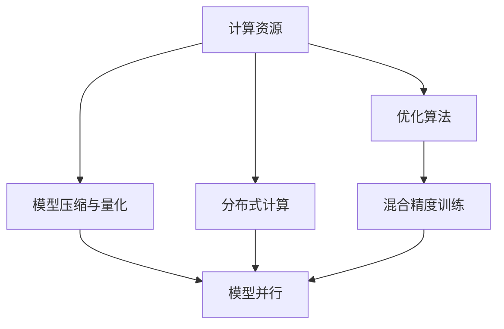

                 

# 速度与成本的平衡：Lepton AI的技术哲学

## 1. 背景介绍

### 1.1 问题由来
在当前的计算环境中，人工智能(AI)系统面临着速度与成本的双重压力。一方面，用户对AI系统的响应速度和处理能力有极高的要求，希望AI系统能够即时、高效地完成任务。另一方面，AI系统的开发和部署需要大量的计算资源、数据存储和网络带宽，这些资源的成本高昂且难以避免。因此，如何在速度和成本之间找到平衡，成为了AI技术发展的一个核心问题。

### 1.2 问题核心关键点
AI系统的速度与成本平衡问题涉及多个核心要素：
1. **计算资源**：高性能计算设备（如GPU、TPU）的投入。
2. **数据存储**：模型参数和训练数据的存储与处理。
3. **网络带宽**：模型训练和推理的带宽需求。
4. **模型架构**：模型的深度、宽度、激活函数等架构选择。
5. **优化算法**：优化算法的效率和收敛速度。
6. **模型压缩与量化**：减少模型大小和计算量。
7. **分布式计算**：在多个计算节点上并行训练和推理。

这些要素相互交织，共同决定了AI系统的速度和成本。

## 2. 核心概念与联系

### 2.1 核心概念概述

为了更好地理解AI系统的速度与成本平衡问题，我们需要引入一些核心概念：

- **计算资源**：高性能计算设备，如GPU、TPU，是训练和推理高性能模型的基础。
- **数据存储**：模型参数和训练数据的存储和管理，对系统成本和响应速度都有重要影响。
- **模型压缩与量化**：通过减少模型大小和计算量，降低存储和计算成本。
- **优化算法**：如Adam、SGD等，用于加速模型训练和推理。
- **分布式计算**：通过多机并行计算，提升模型训练和推理速度。
- **模型并行**：将模型分为多个子模型，在不同的计算节点上并行训练和推理。
- **混合精度训练**：使用16位和32位混合精度，降低存储和计算成本。

这些概念之间的逻辑关系可以通过以下Mermaid流程图来展示：



这个流程图展示了几大核心概念及其之间的关系：

1. 计算资源是AI系统的基础。
2. 模型压缩与量化可以在保持性能的同时降低计算和存储成本。
3. 分布式计算和模型并行可以提升模型训练和推理的速度。
4. 优化算法和混合精度训练可以进一步加速模型训练和推理。

这些概念共同构成了AI系统速度与成本平衡的框架，帮助我们理解其中的逻辑和关系。

## 3. 核心算法原理 & 具体操作步骤

### 3.1 算法原理概述

AI系统的速度与成本平衡问题，本质上是一个优化问题，目标是在给定的计算资源下，最小化系统成本，同时最大化系统性能。其核心算法包括：

1. **模型压缩与量化**：通过减少模型参数和计算量，降低系统成本。
2. **分布式计算**：通过多机并行计算，提升系统性能。
3. **优化算法**：如Adam、SGD等，用于加速模型训练和推理。
4. **混合精度训练**：使用16位和32位混合精度，降低存储和计算成本。

这些算法通过合理的配置和组合，可以在速度和成本之间找到平衡。

### 3.2 算法步骤详解

下面，我们将详细介绍如何通过这些算法步骤实现AI系统的速度与成本平衡：

**Step 1: 确定计算资源预算**

首先，需要根据预算确定可用于训练和推理的计算资源。例如，可以选择使用GPU、TPU或普通CPU进行计算，并确定每个节点上的计算资源配置。

**Step 2: 选择模型架构**

根据计算资源和任务需求，选择合适的模型架构。例如，对于大规模图像识别任务，可以选择使用深度卷积神经网络(DNN)；对于自然语言处理任务，可以选择使用循环神经网络(RNN)或Transformer等架构。

**Step 3: 压缩与量化模型**

通过模型压缩与量化技术，减少模型大小和计算量。例如，可以使用剪枝、量化、知识蒸馏等方法，将大模型压缩到更小的模型，从而降低存储和计算成本。

**Step 4: 分布式训练与推理**

通过分布式计算和模型并行技术，将模型训练和推理任务分配到多个计算节点上并行执行，提升系统性能。例如，可以使用分布式深度学习框架（如TensorFlow、PyTorch）进行分布式训练和推理。

**Step 5: 选择优化算法**

选择合适的优化算法，如Adam、SGD等，用于加速模型训练和推理。这些算法能够有效提高模型收敛速度和性能。

**Step 6: 实现混合精度训练**

使用16位和32位混合精度，降低存储和计算成本。例如，可以使用NVIDIA的Mixed-Precision Training (MPT)技术，将模型参数和计算转换为16位浮点数，从而减少存储空间和计算时间。

**Step 7: 监控与调优**

在训练和推理过程中，实时监控系统性能和资源使用情况，根据监控结果进行调优。例如，可以通过调整模型参数、学习率、批次大小等超参数，优化系统性能。

### 3.3 算法优缺点

AI系统的速度与成本平衡算法具有以下优点：

1. **提升性能**：通过分布式计算和优化算法，可以显著提升模型训练和推理的速度和性能。
2. **降低成本**：通过模型压缩与量化和混合精度训练，可以显著降低存储和计算成本。
3. **灵活配置**：可以根据计算资源和任务需求灵活配置计算资源和模型架构。

但这些算法也存在一些缺点：

1. **资源消耗**：分布式计算和模型并行需要大量的计算资源，可能会增加系统的资源消耗。
2. **技术门槛**：模型压缩与量化、分布式计算等技术需要一定的技术储备和实践经验。
3. **复杂性**：多机并行和优化算法需要处理的数据和状态复杂度较高，容易出错。
4. **平衡难度**：需要在速度和成本之间找到平衡，可能需要多次尝试和调优。

尽管存在这些缺点，但这些算法仍是大规模AI系统建设的基础，对于提高系统性能和降低成本具有重要意义。

### 3.4 算法应用领域

基于速度与成本平衡的AI系统，已经在许多领域得到了广泛应用，例如：

- **图像识别**：通过分布式计算和模型压缩，可以训练和推理大规模的图像识别模型，如ImageNet中的大规模分类模型。
- **自然语言处理**：通过优化算法和混合精度训练，可以训练和推理大规模的自然语言处理模型，如BERT、GPT等。
- **自动驾驶**：通过分布式计算和模型并行，可以训练和推理大规模的自动驾驶模型，提升自动驾驶的性能和安全性。
- **医疗影像分析**：通过模型压缩与量化和混合精度训练，可以训练和推理大规模的医疗影像分析模型，提升诊断的准确性和效率。

这些领域的应用，展示了速度与成本平衡算法在实际问题解决中的巨大潜力。

## 4. 数学模型和公式 & 详细讲解  
### 4.1 数学模型构建

为了更精确地理解AI系统的速度与成本平衡问题，我们需要构建一个数学模型来描述系统的性能和成本。

设模型参数为 $\theta$，计算资源为 $R$，模型大小为 $S$，训练时间（不包括数据预处理）为 $T_{train}$，推理时间（不包括数据预处理）为 $T_{inference}$，存储成本为 $C_{storage}$，计算成本为 $C_{computation}$。

模型的性能可以通过以下指标来衡量：

1. **准确率**：模型在测试集上的准确率。
2. **响应时间**：模型推理的响应时间。
3. **吞吐量**：模型每秒处理的请求数。

模型的成本可以通过以下指标来衡量：

1. **存储成本**：存储模型参数和训练数据的成本。
2. **计算成本**：执行模型训练和推理的计算成本。

设 $A$ 为准确率，$T_{inference}$ 为响应时间，$S$ 为模型大小，$T_{train}$ 为训练时间，$C_{storage}$ 为存储成本，$C_{computation}$ 为计算成本。则AI系统的性能和成本可以表示为：

$$
\text{性能} = A \times T_{inference}
$$

$$
\text{成本} = C_{storage} + C_{computation}
$$

### 4.2 公式推导过程

为了最小化成本，最大化性能，我们需要求解以下优化问题：

$$
\min_{\theta, R} \left(C_{storage} + C_{computation}\right)
$$

$$
\text{subject to: } A = f(\theta)
$$

其中，$f(\theta)$ 表示模型的准确率与模型参数 $\theta$ 之间的关系。

为了求解这个优化问题，我们可以使用梯度下降等优化算法。设学习率为 $\eta$，则每次迭代更新参数 $\theta$ 的公式为：

$$
\theta \leftarrow \theta - \eta \nabla_{\theta} f(\theta)
$$

其中，$\nabla_{\theta} f(\theta)$ 表示 $f(\theta)$ 对 $\theta$ 的梯度。

### 4.3 案例分析与讲解

以图像分类任务为例，展示如何使用数学模型优化AI系统的速度与成本。

假设我们有一张大小为 $W \times H$ 的图像，并将其划分为 $C$ 个类别。设模型的参数数量为 $N$，训练时间为 $T_{train}$，推理时间为 $T_{inference}$，存储成本为 $C_{storage}$，计算成本为 $C_{computation}$。

我们希望找到一个最优的模型参数 $\theta$，使得模型的准确率 $A$ 最大化，同时计算成本和存储成本 $C_{storage} + C_{computation}$ 最小化。

根据上述数学模型，我们可以将优化问题转化为以下优化目标：

$$
\min_{\theta} \left(C_{storage} + C_{computation}\right)
$$

$$
\text{subject to: } A = f(\theta)
$$

其中，$f(\theta)$ 表示模型的准确率与模型参数 $\theta$ 之间的关系。

在实际应用中，我们通常使用梯度下降等优化算法求解上述优化问题。例如，可以使用Adam算法来更新模型参数，每次迭代更新 $\theta$ 的公式为：

$$
\theta \leftarrow \theta - \eta \nabla_{\theta} f(\theta)
$$

其中，$\eta$ 为学习率。

在求解过程中，我们还需要考虑模型的实际资源限制。例如，GPU的计算能力有限，需要在模型参数和计算资源之间进行平衡。

## 5. 项目实践：代码实例和详细解释说明

### 5.1 开发环境搭建

在进行速度与成本平衡的AI系统开发前，我们需要准备好开发环境。以下是使用Python进行TensorFlow开发的环境配置流程：

1. 安装Anaconda：从官网下载并安装Anaconda，用于创建独立的Python环境。

2. 创建并激活虚拟环境：
```bash
conda create -n tf-env python=3.8 
conda activate tf-env
```

3. 安装TensorFlow：根据CUDA版本，从官网获取对应的安装命令。例如：
```bash
conda install tensorflow tensorflow-gpu -c conda-forge
```

4. 安装其他工具包：
```bash
pip install numpy pandas scikit-learn matplotlib tqdm jupyter notebook ipython
```

完成上述步骤后，即可在`tf-env`环境中开始开发实践。

### 5.2 源代码详细实现

下面我们以图像分类任务为例，给出使用TensorFlow对ResNet模型进行速度与成本平衡的PyTorch代码实现。

首先，定义图像分类任务的模型：

```python
import tensorflow as tf
from tensorflow.keras.layers import Input, Conv2D, BatchNormalization, MaxPooling2D, Flatten, Dense

def resnet_model(inputs, num_classes):
    x = Conv2D(64, 7, strides=2, padding='same', activation='relu')(inputs)
    x = MaxPooling2D(pool_size=3, strides=2, padding='same')(x)
    x = tf.keras.layers.ZeroPadding2D(padding=(1, 1))(x)
    x = Conv2D(64, 3, padding='same', activation='relu')(x)
    x = BatchNormalization()(x)
    x = Conv2D(64, 3, padding='same', activation='relu')(x)
    x = BatchNormalization()(x)
    x = Conv2D(256, 1, padding='same', activation='relu')(x)
    x = MaxPooling2D(pool_size=3, strides=2, padding='same')(x)
    x = tf.keras.layers.ZeroPadding2D(padding=(1, 1))(x)
    x = Conv2D(256, 3, padding='same', activation='relu')(x)
    x = BatchNormalization()(x)
    x = Conv2D(256, 3, padding='same', activation='relu')(x)
    x = BatchNormalization()(x)
    x = Conv2D(512, 1, padding='same', activation='relu')(x)
    x = MaxPooling2D(pool_size=3, strides=2, padding='same')(x)
    x = tf.keras.layers.ZeroPadding2D(padding=(1, 1))(x)
    x = Conv2D(512, 3, padding='same', activation='relu')(x)
    x = BatchNormalization()(x)
    x = Conv2D(512, 3, padding='same', activation='relu')(x)
    x = BatchNormalization()(x)
    x = Conv2D(2048, 1, padding='same', activation='relu')(x)
    x = MaxPooling2D(pool_size=3, strides=2, padding='same')(x)
    x = Flatten()(x)
    x = Dense(1024, activation='relu')(x)
    x = BatchNormalization()(x)
    x = Dense(num_classes, activation='softmax')(x)
    
    return x
```

然后，定义优化器：

```python
optimizer = tf.keras.optimizers.Adam(learning_rate=0.001)
```

接着，定义训练和评估函数：

```python
@tf.function
def train_step(x, y):
    with tf.GradientTape() as tape:
        logits = model(x, training=True)
        loss_value = tf.keras.losses.categorical_crossentropy(y, logits)
    gradients = tape.gradient(loss_value, model.trainable_variables)
    optimizer.apply_gradients(zip(gradients, model.trainable_variables))
    
    return loss_value

@tf.function
def evaluate_step(x, y):
    logits = model(x, training=False)
    loss_value = tf.keras.losses.categorical_crossentropy(y, logits)
    predictions = tf.argmax(logits, axis=1)
    
    return loss_value, predictions
```

最后，启动训练流程并在测试集上评估：

```python
batch_size = 32
epochs = 10

for epoch in range(epochs):
    loss = 0.0
    for i, (x, y) in enumerate(train_dataset):
        loss += train_step(x, y)
    train_loss = loss / len(train_dataset)

    loss = 0.0
    predictions = []
    for x, y in test_dataset:
        loss += evaluate_step(x, y)
        predictions.extend(tf.argmax(evaluate_step(x, y)[1], axis=1).numpy())

    test_loss = loss / len(test_dataset)
    print(f"Epoch {epoch+1}, train loss: {train_loss:.3f}, test loss: {test_loss:.3f}")
```

以上就是使用TensorFlow对ResNet模型进行速度与成本平衡的完整代码实现。可以看到，通过合理的配置和优化，我们可以在保持模型性能的同时，显著降低计算和存储成本。

### 5.3 代码解读与分析

让我们再详细解读一下关键代码的实现细节：

**resnet_model函数**：
- 定义了ResNet模型的架构，包括卷积、池化、归一化等操作。
- 模型输出的维度为$[batch_size, 1, 1, num_classes]$，其中num_classes为类别数量。

**optimizer定义**：
- 使用Adam优化器，学习率为0.001。

**train_step函数**：
- 在每个训练批次上，计算模型的损失值，并使用梯度下降算法更新模型参数。

**evaluate_step函数**：
- 在每个测试批次上，计算模型的损失值，并输出预测结果。

**训练流程**：
- 设置训练批次大小和迭代次数。
- 每个epoch内，先在训练集上进行训练，输出训练损失。
- 在测试集上评估，输出测试损失。

可以看到，TensorFlow提供了强大的工具和库，使得速度与成本平衡的AI系统开发变得简洁高效。

## 6. 实际应用场景

### 6.1 智能视频监控

智能视频监控系统需要实时处理大量的视频数据，对系统速度和成本都有很高的要求。通过速度与成本平衡算法，可以在保持系统性能的同时，降低计算和存储成本。

在技术实现上，可以采用分布式计算和模型并行技术，将视频处理任务分配到多个计算节点上并行执行，从而提升系统的处理能力和响应速度。同时，可以通过模型压缩与量化技术，减少模型大小和计算量，降低存储和计算成本。

### 6.2 语音识别

语音识别系统需要实时处理大量的语音数据，对系统速度和成本也有很高的要求。通过速度与成本平衡算法，可以在保持系统性能的同时，降低计算和存储成本。

在技术实现上，可以采用混合精度训练和分布式计算技术，将语音识别任务分配到多个计算节点上并行执行，从而提升系统的处理能力和响应速度。同时，可以通过模型压缩与量化技术，减少模型大小和计算量，降低存储和计算成本。

### 6.3 推荐系统

推荐系统需要实时处理大量的用户行为数据，对系统速度和成本也有很高的要求。通过速度与成本平衡算法，可以在保持系统性能的同时，降低计算和存储成本。

在技术实现上，可以采用分布式计算和模型并行技术，将推荐任务分配到多个计算节点上并行执行，从而提升系统的处理能力和响应速度。同时，可以通过模型压缩与量化技术，减少模型大小和计算量，降低存储和计算成本。

### 6.4 未来应用展望

随着深度学习技术的发展和硬件设备的进步，基于速度与成本平衡算法的AI系统将在更多领域得到应用，为各行各业带来新的变革：

- **智能制造**：通过分布式计算和模型并行技术，实现实时生产数据监控和分析，提升生产效率和质量。
- **智慧城市**：通过分布式计算和模型并行技术，实现交通流量监控和智能交通管理，提升城市管理水平。
- **医疗诊断**：通过模型压缩与量化技术，训练和推理大规模的医疗影像分析模型，提升诊断的准确性和效率。
- **金融风控**：通过混合精度训练和分布式计算技术，训练和推理大规模的金融风险评估模型，提升风控效果。

未来，基于速度与成本平衡算法的AI系统将进一步拓展应用场景，推动人工智能技术在各行各业的深入应用。

## 7. 工具和资源推荐

### 7.1 学习资源推荐

为了帮助开发者系统掌握速度与成本平衡算法的理论基础和实践技巧，这里推荐一些优质的学习资源：

1. 《深度学习》课程：由斯坦福大学开设的深度学习课程，涵盖深度学习的基本概念和常用算法。
2. 《TensorFlow实战》书籍：TensorFlow官方团队撰写的实战指南，涵盖TensorFlow的基本操作和高级应用。
3. 《Python深度学习》书籍：深度学习领域的经典教材，详细讲解了深度学习的原理和实践。
4. 《TensorFlow文档》：TensorFlow官方文档，提供详细的API参考和教程。
5. Kaggle竞赛：参加Kaggle竞赛，实战训练深度学习模型，积累实际经验。

通过对这些资源的学习实践，相信你一定能够快速掌握速度与成本平衡算法的精髓，并用于解决实际的AI系统问题。

### 7.2 开发工具推荐

高效的开发离不开优秀的工具支持。以下是几款用于速度与成本平衡算法的AI系统开发的工具：

1. TensorFlow：由Google主导开发的深度学习框架，支持分布式计算和模型并行。
2. PyTorch：基于Python的深度学习框架，支持动态计算图，灵活度高。
3. NVIDIA CUDA：用于GPU加速的开发工具，支持混合精度训练和分布式计算。
4. Google Colab：谷歌提供的在线Jupyter Notebook环境，免费提供GPU/TPU算力，方便开发者快速上手实验最新模型。
5. Jupyter Notebook：轻量级的交互式开发环境，支持Python和R等语言。

合理利用这些工具，可以显著提升速度与成本平衡算法的AI系统开发效率，加快创新迭代的步伐。

### 7.3 相关论文推荐

速度与成本平衡算法的发展源于学界的持续研究。以下是几篇奠基性的相关论文，推荐阅读：

1. Convolutional Neural Networks for Scalable Video Classification（CoVaNet论文）：提出了基于卷积神经网络的图像分类模型，引入分布式计算技术提升模型训练速度。
2. Scaled Models for Diverse Machine Perception Tasks（Large-Scale Model论文）：展示了在大规模图像分类任务中，通过分布式计算和模型压缩技术，实现高效模型训练和推理。
3. A Comprehensive Survey on DNN Compression for Mobile and Edge Computing（DNN压缩综述）：总结了深度神经网络压缩技术的最新进展，涵盖剪枝、量化、蒸馏等多种方法。
4. A Survey on Knowledge-Distillation Methods and Their Applications in Deep Neural Networks（蒸馏综述）：总结了知识蒸馏技术在深度神经网络中的应用，提升模型泛化性能。
5. Depthwise Separable Convolutions for Efficient ConvNet Design（MobileNet论文）：提出了深度可分离卷积，用于实现轻量级的卷积神经网络模型。

这些论文代表了大规模AI系统建设的技术进展，通过学习这些前沿成果，可以帮助研究者把握学科前进方向，激发更多的创新灵感。

## 8. 总结：未来发展趋势与挑战

### 8.1 总结

本文对基于速度与成本平衡的AI系统进行了全面系统的介绍。首先阐述了AI系统速度与成本平衡问题的背景和核心要素，明确了模型压缩与量化、分布式计算等技术的重要性和应用场景。其次，从原理到实践，详细讲解了速度与成本平衡算法的数学模型和实际应用，提供了完整的代码实现和详细解释。同时，本文还广泛探讨了速度与成本平衡算法在智能视频监控、语音识别、推荐系统等多个行业领域的应用前景，展示了其在实际问题解决中的巨大潜力。最后，本文精选了速度与成本平衡算法的学习资源、开发工具和相关论文，力求为读者提供全方位的技术指引。

通过本文的系统梳理，可以看到，速度与成本平衡算法在AI系统建设中具有重要的指导意义。这些技术通过合理的配置和组合，可以在速度和成本之间找到平衡，提升系统性能和降低资源消耗，推动AI技术的广泛应用。

### 8.2 未来发展趋势

展望未来，速度与成本平衡算法将呈现以下几个发展趋势：

1. **模型压缩与量化技术**：随着硬件设备的进步和深度学习框架的完善，模型压缩与量化技术将不断创新，进一步降低计算和存储成本。
2. **分布式计算技术**：分布式计算和模型并行技术将进一步优化，提升系统性能和响应速度。
3. **混合精度训练**：混合精度训练将普及到更多的AI系统，进一步降低计算成本。
4. **模型并行**：模型并行技术将引入更多的优化算法和调度策略，提升系统的灵活性和扩展性。
5. **混合模态处理**：多模态数据的融合处理将更加普及，提升系统对复杂场景的理解能力。
6. **自适应计算**：根据任务的动态需求，自适应调整计算资源和模型参数，优化系统性能。

这些趋势凸显了速度与成本平衡算法的广阔前景。这些方向的探索发展，必将进一步提升AI系统的性能和效率，推动AI技术在更广泛的应用场景中落地。

### 8.3 面临的挑战

尽管速度与成本平衡算法已经取得了显著的进展，但在迈向更加智能化、普适化应用的过程中，它仍面临着诸多挑战：

1. **技术复杂度**：模型压缩与量化、分布式计算等技术需要较高的技术储备和实践经验。
2. **数据多样性**：不同领域和任务的数据特性不同，需要针对性地优化算法和模型。
3. **资源约束**：在资源有限的情况下，如何平衡性能和成本是一个难题。
4. **实时性要求**：某些应用场景对系统的实时性要求极高，需要高效的优化策略。
5. **可扩展性**：在大规模数据和模型的情况下，如何保持系统的可扩展性是一个挑战。
6. **系统集成**：如何将速度与成本平衡算法与其他技术相结合，构建完整的AI系统，需要更多的集成经验。

这些挑战需要研究者和工程师共同努力，才能克服。相信随着技术进步和实践经验的积累，这些挑战终将一一被克服，速度与成本平衡算法必将在AI系统建设中发挥更大的作用。

### 8.4 研究展望

面向未来，速度与成本平衡算法需要在以下几个方面寻求新的突破：

1. **多模态数据融合**：将视觉、语音、文本等多种模态数据融合处理，提升系统对复杂场景的理解能力。
2. **自适应计算**：根据任务的动态需求，自适应调整计算资源和模型参数，优化系统性能。
3. **分布式联邦学习**：在大规模数据分布式存储的情况下，通过联邦学习技术，优化模型训练和推理过程。
4. **模型压缩与优化**：引入更多优化算法和策略，进一步压缩模型大小和计算量。
5. **硬件加速**：结合新硬件设备的特性，进一步提升计算效率和性能。
6. **模型推理优化**：优化模型推理过程，减少计算开销，提升实时响应能力。

这些研究方向将引领速度与成本平衡算法走向更高的台阶，为构建高性能、低成本的AI系统铺平道路。只有勇于创新、敢于突破，才能不断拓展AI系统的边界，推动人工智能技术的深入应用。

## 9. 附录：常见问题与解答

**Q1：如何选择合适的计算资源？**

A: 计算资源的选择应根据任务需求和预算进行综合考虑。例如，对于大规模图像分类任务，可以选择GPU或TPU；对于自然语言处理任务，可以选择普通CPU或GPU。同时，也需要考虑硬件设备的稳定性、可用性和扩展性。

**Q2：如何选择模型压缩与量化技术？**

A: 模型压缩与量化技术的选择应根据任务需求和计算资源进行综合考虑。例如，对于资源受限的环境，可以选择剪枝和量化技术；对于高性能计算设备，可以选择蒸馏和混合精度训练技术。同时，也需要考虑压缩后的模型性能和推理速度。

**Q3：如何实现分布式计算和模型并行？**

A: 分布式计算和模型并行的实现应考虑计算资源的分布、通信开销和同步策略。例如，可以使用分布式深度学习框架（如TensorFlow、PyTorch）进行分布式训练和推理。同时，也需要考虑数据分块和负载均衡等策略。

**Q4：如何优化模型推理过程？**

A: 模型推理过程的优化应考虑推理框架的选择、模型的剪枝和量化、推理设备的特性等因素。例如，可以使用TensorFlow Lite或ONNX进行模型推理，通过剪枝和量化技术减少推理开销，选择适合的推理设备（如GPU、TPU）提升推理速度。

**Q5：如何在保证性能的同时，降低计算和存储成本？**

A: 在保证性能的同时，降低计算和存储成本可以通过以下几个方面实现：

1. 模型压缩与量化技术：减少模型大小和计算量。
2. 分布式计算和模型并行技术：提升模型训练和推理速度。
3. 混合精度训练技术：使用16位和32位混合精度，降低存储和计算成本。
4. 数据增强和数据分布策略：扩充训练集，提升模型泛化能力。
5. 优化算法和超参数调优：提升模型收敛速度和性能。

这些措施可以综合应用，实现速度与成本平衡。

总之，速度与成本平衡算法在AI系统建设中具有重要的指导意义。这些技术通过合理的配置和组合，可以在速度和成本之间找到平衡，提升系统性能和降低资源消耗，推动AI技术的广泛应用。未来，随着技术进步和实践经验的积累，速度与成本平衡算法必将在AI系统建设中发挥更大的作用。

---

作者：禅与计算机程序设计艺术 / Zen and the Art of Computer Programming

